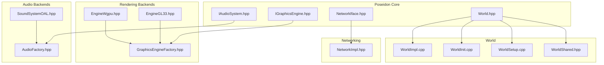
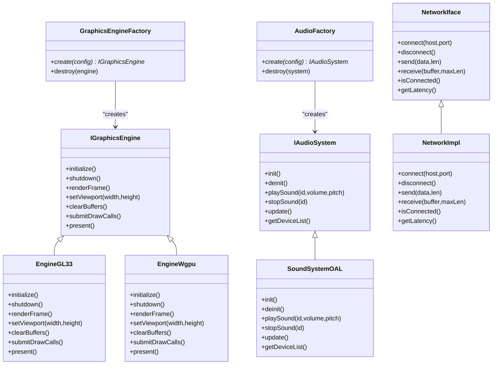
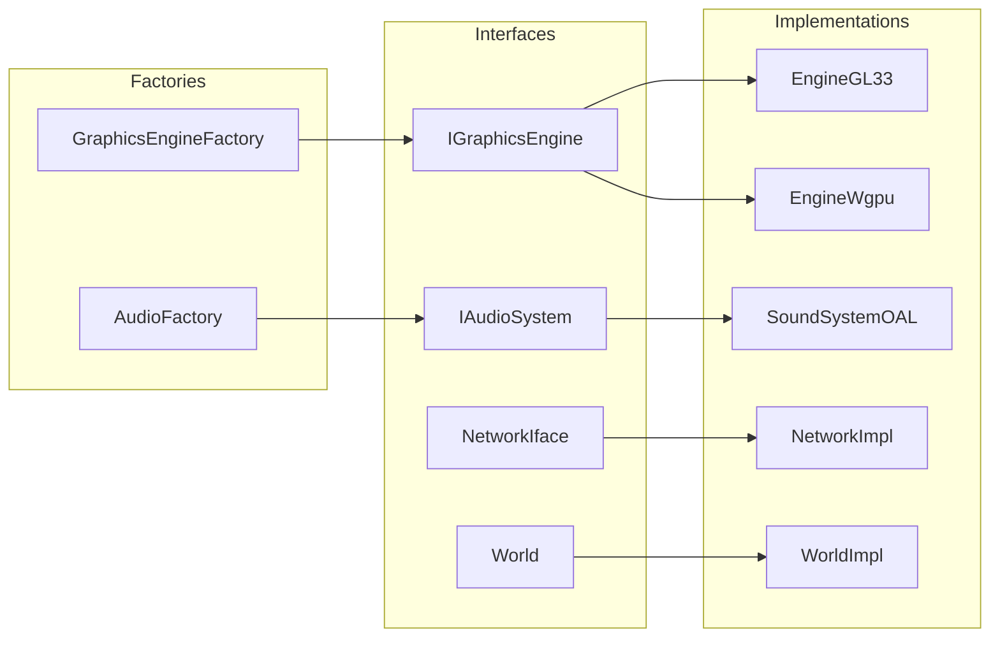

# API Reference

<cite>
**Referenced Files in This Document**
- [IGraphicsEngine.hpp](file://engine/Poseidon/Graphics/IGraphicsEngine.hpp)
- [GraphicsEngineFactory.hpp](file://engine/Poseidon/Graphics/GraphicsEngineFactory.hpp)
- [IAudioSystem.hpp](file://engine/Poseidon/Audio/IAudioSystem.hpp)
- [AudioFactory.hpp](file://engine/Poseidon/Audio/AudioFactory.hpp)
- [NetworkIface.hpp](file://engine/Poseidon/Network/NetworkIface.hpp)
- [NetworkImpl.hpp](file://engine/Poseidon/Network/NetworkImpl.hpp)
- [World.hpp](file://engine/Poseidon/World/World.hpp)
- [WorldImpl.cpp](file://engine/Poseidon/World/WorldImpl.cpp)
- [WorldInit.cpp](file://engine/Poseidon/World/WorldInit.cpp)
- [WorldSetup.cpp](file://engine/Poseidon/World/WorldSetup.cpp)
- [WorldShared.hpp](file://engine/Poseidon/World/WorldShared.hpp)
- [EngineGL33.hpp](file://engine/PoseidonGL33/EngineGL33.hpp)
- [SoundSystemOAL.hpp](file://engine/PoseidonOpenAL/SoundSystemOAL.hpp)
- [EngineWgpu.hpp](file://engine/WgpuRenderer/EngineWgpu.hpp)
</cite>

## Table of Contents
1. [Introduction](#introduction)
2. [Project Structure](#project-structure)
3. [Core Components](#core-components)
4. [Architecture Overview](#architecture-overview)
5. [Detailed Component Analysis](#detailed-component-analysis)
6. [Dependency Analysis](#dependency-analysis)
7. [Performance Considerations](#performance-considerations)
8. [Troubleshooting Guide](#troubleshooting-guide)
9. [Conclusion](#conclusion)
10. [Appendices](#appendices)

## Introduction
This document provides a comprehensive API reference for CWR-CE’s public extension points and core interfaces. It focuses on:
- IGraphicsEngine: the rendering backend interface and factory
- IAudioSystem: the audio subsystem interface and factory
- NetworkIface: the networking abstraction for client/server integration
- World API: game state, entity management, and simulation control

It also covers callback mechanisms, event systems, plugin architecture patterns, thread safety, memory management, performance implications, and migration guidance for API changes.

## Project Structure
CWR-CE organizes engine subsystems under engine/Poseidon with concrete backends in separate modules (e.g., PoseidonGL33, PoseidonOpenAL, WgpuRenderer). The key interfaces are defined in Poseidon headers, while implementations live in their respective backend directories.

**Diagram sources**
- [IGraphicsEngine.hpp](file://engine/Poseidon/Graphics/IGraphicsEngine.hpp)
- [GraphicsEngineFactory.hpp](file://engine/Poseidon/Graphics/GraphicsEngineFactory.hpp)
- [IAudioSystem.hpp](file://engine/Poseidon/Audio/IAudioSystem.hpp)
- [AudioFactory.hpp](file://engine/Poseidon/Audio/AudioFactory.hpp)
- [NetworkIface.hpp](file://engine/Poseidon/Network/NetworkIface.hpp)
- [NetworkImpl.hpp](file://engine/Poseidon/Network/NetworkImpl.hpp)
- [World.hpp](file://engine/Poseidon/World/World.hpp)
- [WorldImpl.cpp](file://engine/Poseidon/World/WorldImpl.cpp)
- [WorldInit.cpp](file://engine/Poseidon/World/WorldInit.cpp)
- [WorldSetup.cpp](file://engine/Poseidon/World/WorldSetup.cpp)
- [WorldShared.hpp](file://engine/Poseidon/World/WorldShared.hpp)
- [EngineGL33.hpp](file://engine/PoseidonGL33/EngineGL33.hpp)
- [EngineWgpu.hpp](file://engine/WgpuRenderer/EngineWgpu.hpp)
- [SoundSystemOAL.hpp](file://engine/PoseidonOpenAL/SoundSystemOAL.hpp)

**Section sources**
- [IGraphicsEngine.hpp](file://engine/Poseidon/Graphics/IGraphicsEngine.hpp)
- [IAudioSystem.hpp](file://engine/Poseidon/Audio/IAudioSystem.hpp)
- [NetworkIface.hpp](file://engine/Poseidon/Network/NetworkIface.hpp)
- [World.hpp](file://engine/Poseidon/World/World.hpp)

## Core Components
This section outlines the primary extension points that applications and plugins implement or consume:
- Rendering: IGraphicsEngine and GraphicsEngineFactory
- Audio: IAudioSystem and AudioFactory
- Networking: NetworkIface and its implementation layer
- World: World API for game state and simulation

These components are designed to be pluggable and backend-agnostic, enabling multiple implementations (e.g., OpenGL, WGPU, OpenAL).

**Section sources**
- [IGraphicsEngine.hpp](file://engine/Poseidon/Graphics/IGraphicsEngine.hpp)
- [GraphicsEngineFactory.hpp](file://engine/Poseidon/Graphics/GraphicsEngineFactory.hpp)
- [IAudioSystem.hpp](file://engine/Poseidon/Audio/IAudioSystem.hpp)
- [AudioFactory.hpp](file://engine/Poseidon/Audio/AudioFactory.hpp)
- [NetworkIface.hpp](file://engine/Poseidon/Network/NetworkIface.hpp)
- [NetworkImpl.hpp](file://engine/Poseidon/Network/NetworkImpl.hpp)
- [World.hpp](file://engine/Poseidon/World/World.hpp)

## Architecture Overview
The system uses an interface-driven architecture where high-level engine code depends on abstract interfaces rather than concrete backends. Factories instantiate appropriate implementations based on configuration or runtime selection.

**Diagram sources**
- [IGraphicsEngine.hpp](file://engine/Poseidon/Graphics/IGraphicsEngine.hpp)
- [EngineGL33.hpp](file://engine/PoseidonGL33/EngineGL33.hpp)
- [EngineWgpu.hpp](file://engine/WgpuRenderer/EngineWgpu.hpp)
- [GraphicsEngineFactory.hpp](file://engine/Poseidon/Graphics/GraphicsEngineFactory.hpp)
- [IAudioSystem.hpp](file://engine/Poseidon/Audio/IAudioSystem.hpp)
- [SoundSystemOAL.hpp](file://engine/PoseidonOpenAL/SoundSystemOAL.hpp)
- [AudioFactory.hpp](file://engine/Poseidon/Audio/AudioFactory.hpp)
- [NetworkIface.hpp](file://engine/Poseidon/Network/NetworkIface.hpp)
- [NetworkImpl.hpp](file://engine/Poseidon/Network/NetworkImpl.hpp)

## Detailed Component Analysis

### IGraphicsEngine Interface
Purpose: Abstracts rendering operations across different graphics APIs. Implementations include OpenGL 3.3 and WGPU.

Key responsibilities:
- Lifecycle management (initialize, shutdown)
- Frame rendering pipeline (clear, submit draw calls, present)
- Viewport and buffer management
- Backend-specific state handling via virtual methods

Typical method categories:
- Initialization and resource setup
- Frame rendering commands
- Resource binding and state configuration
- Presenting frames to the screen

Error conditions:
- Initialization failures due to missing drivers or unsupported features
- Invalid parameters during frame submission
- Resource allocation errors

Thread safety:
- Rendering calls typically occur on the main thread; ensure synchronization when accessing shared resources

Memory management:
- Implementations must manage GPU resources carefully; avoid leaks by releasing textures, buffers, and shaders

Performance considerations:
- Batch draw calls to minimize state changes
- Use efficient vertex formats and instancing where possible
- Avoid frequent resource uploads during frames

Practical example: Implementing a custom renderer involves deriving from IGraphicsEngine and providing platform-specific OpenGL or Vulkan calls.

**Section sources**
- [IGraphicsEngine.hpp](file://engine/Poseidon/Graphics/IGraphicsEngine.hpp)
- [EngineGL33.hpp](file://engine/PoseidonGL33/EngineGL33.hpp)
- [EngineWgpu.hpp](file://engine/WgpuRenderer/EngineWgpu.hpp)

### GraphicsEngineFactory
Purpose: Creates and manages IGraphicsEngine instances based on configuration or runtime selection.

Key responsibilities:
- Factory pattern for backend instantiation
- Configuration validation and feature detection
- Proper cleanup and resource management

Usage pattern:
- Call create with desired configuration
- Use the returned engine instance
- Destroy when no longer needed

Error conditions:
- Unsupported backend requested
- Configuration mismatch with available hardware

**Section sources**
- [GraphicsEngineFactory.hpp](file://engine/Poseidon/Graphics/GraphicsEngineFactory.hpp)

### IAudioSystem Interface
Purpose: Abstracts audio playback, mixing, and device management. Implementations include OpenAL-based systems.

Key responsibilities:
- Audio device initialization and enumeration
- Sound playback control (play, stop, update)
- Volume and pitch manipulation
- Device capability queries

Typical method categories:
- System lifecycle (init, deinit)
- Sound control (play, stop, pause)
- Mixing and update loop
- Device and capability queries

Error conditions:
- Audio device not available
- Invalid sound identifiers
- Memory allocation failures

Thread safety:
- Audio updates typically run on a dedicated thread; ensure thread-safe access to sound objects

Memory management:
- Properly release audio resources to prevent leaks

Performance considerations:
- Minimize real-time allocations in audio callbacks
- Use streaming for large audio files

Practical example: Implementing a custom audio backend requires deriving from IAudioSystem and integrating with your chosen audio library.

**Section sources**
- [IAudioSystem.hpp](file://engine/Poseidon/Audio/IAudioSystem.hpp)
- [SoundSystemOAL.hpp](file://engine/PoseidonOpenAL/SoundSystemOAL.hpp)

### AudioFactory
Purpose: Creates and manages IAudioSystem instances similar to GraphicsEngineFactory.

Key responsibilities:
- Backend selection and instantiation
- Configuration validation
- Resource cleanup

Usage pattern:
- Create appropriate audio system based on platform capabilities
- Manage lifecycle through factory methods

**Section sources**
- [AudioFactory.hpp](file://engine/Poseidon/Audio/AudioFactory.hpp)

### NetworkIface Interface
Purpose: Provides a unified networking abstraction for client-server communication.

Key responsibilities:
- Connection management (connect, disconnect)
- Message sending and receiving
- Connection status and latency monitoring
- Error handling and reconnection logic

Typical method categories:
- Connection lifecycle
- Data transmission
- Status queries
- Error reporting

Error conditions:
- Connection failures
- Network timeouts
- Protocol violations

Thread safety:
- Network operations may be asynchronous; implement proper synchronization for shared state

Performance considerations:
- Buffer reuse to reduce allocations
- Efficient message serialization/deserialization

Practical example: Implementing a custom network transport involves deriving from NetworkIface and integrating with your networking stack.

**Section sources**
- [NetworkIface.hpp](file://engine/Poseidon/Network/NetworkIface.hpp)
- [NetworkImpl.hpp](file://engine/Poseidon/Network/NetworkImpl.hpp)

### World API
Purpose: Central interface for game state manipulation, entity management, and simulation control.

Key responsibilities:
- Entity creation, modification, and destruction
- Simulation step execution
- Game state queries and modifications
- Event handling and callbacks

Typical method categories:
- Entity management (spawn, remove, query)
- Simulation control (step, pause, resume)
- State queries (position, health, inventory)
- Event registration and dispatch

Error conditions:
- Invalid entity references
- Simulation state conflicts
- Resource limitations

Thread safety:
- World operations may require locking; ensure proper synchronization between threads

Memory management:
- Proper entity lifecycle management to prevent memory leaks

Performance considerations:
- Batch entity operations where possible
- Use spatial partitioning for efficient queries

Practical example: Extending game functionality involves implementing custom entity types and registering them with the World system.

**Section sources**
- [World.hpp](file://engine/Poseidon/World/World.hpp)
- [WorldImpl.cpp](file://engine/Poseidon/World/WorldImpl.cpp)
- [WorldInit.cpp](file://engine/Poseidon/World/WorldInit.cpp)
- [WorldSetup.cpp](file://engine/Poseidon/World/WorldSetup.cpp)
- [WorldShared.hpp](file://engine/Poseidon/World/WorldShared.hpp)

## Dependency Analysis
The system exhibits clear separation between interfaces and implementations, promoting modularity and testability.

**Diagram sources**
- [IGraphicsEngine.hpp](file://engine/Poseidon/Graphics/IGraphicsEngine.hpp)
- [IAudioSystem.hpp](file://engine/Poseidon/Audio/IAudioSystem.hpp)
- [NetworkIface.hpp](file://engine/Poseidon/Network/NetworkIface.hpp)
- [World.hpp](file://engine/Poseidon/World/World.hpp)
- [EngineGL33.hpp](file://engine/PoseidonGL33/EngineGL33.hpp)
- [EngineWgpu.hpp](file://engine/WgpuRenderer/EngineWgpu.hpp)
- [SoundSystemOAL.hpp](file://engine/PoseidonOpenAL/SoundSystemOAL.hpp)
- [NetworkImpl.hpp](file://engine/Poseidon/Network/NetworkImpl.hpp)
- [WorldImpl.cpp](file://engine/Poseidon/World/WorldImpl.cpp)
- [GraphicsEngineFactory.hpp](file://engine/Poseidon/Graphics/GraphicsEngineFactory.hpp)
- [AudioFactory.hpp](file://engine/Poseidon/Audio/AudioFactory.hpp)

**Section sources**
- [IGraphicsEngine.hpp](file://engine/Poseidon/Graphics/IGraphicsEngine.hpp)
- [IAudioSystem.hpp](file://engine/Poseidon/Audio/IAudioSystem.hpp)
- [NetworkIface.hpp](file://engine/Poseidon/Network/NetworkIface.hpp)
- [World.hpp](file://engine/Poseidon/World/World.hpp)

## Performance Considerations
- Rendering:
  - Minimize state changes by batching draw calls
  - Use efficient vertex formats and instanced rendering
  - Avoid frequent texture uploads during frames
  - Implement frustum culling and level-of-detail systems

- Audio:
  - Stream large audio files instead of loading entirely into memory
  - Reuse audio buffers to reduce allocations
  - Process audio updates on dedicated threads to avoid blocking

- Networking:
  - Use connection pooling and message queuing
  - Implement efficient serialization formats
  - Handle packet loss and retransmission appropriately

- World:
  - Optimize entity queries using spatial data structures
  - Batch world operations to reduce synchronization overhead
  - Implement lazy loading for large assets

[No sources needed since this section provides general guidance]

## Troubleshooting Guide
Common issues and solutions:

- Graphics initialization failures:
  - Verify driver compatibility and feature support
  - Check hardware capabilities against minimum requirements
  - Review error logs for specific failure reasons

- Audio device problems:
  - Ensure audio devices are properly installed and configured
  - Check permissions for audio device access
  - Verify sample rate and format compatibility

- Network connectivity issues:
  - Validate firewall settings and port configurations
  - Check network timeout settings
  - Monitor connection status and retry logic

- World simulation errors:
  - Verify entity references and lifecycles
  - Check for memory leaks and resource exhaustion
  - Review synchronization between threads

**Section sources**
- [WorldImpl.cpp](file://engine/Poseidon/World/WorldImpl.cpp)
- [NetworkImpl.hpp](file://engine/Poseidon/Network/NetworkImpl.hpp)

## Conclusion
CWR-CE provides a robust, extensible architecture through well-defined interfaces for rendering, audio, networking, and world simulation. The factory pattern enables seamless backend switching, while the modular design supports easy integration of custom implementations. By following the guidelines in this document, developers can create high-performance, maintainable extensions that integrate seamlessly with the engine.

[No sources needed since this section summarizes without analyzing specific files]

## Appendices

### Migration Guide
When updating to newer versions of CWR-CE:

- Breaking changes:
  - Review changelog for interface modifications
  - Update method signatures as needed
  - Test thoroughly after API updates

- Deprecated features:
  - Replace deprecated methods with new equivalents
  - Update configuration options
  - Migrate data formats if necessary

- Backwards compatibility:
  - Use version detection for conditional behavior
  - Provide fallback implementations when possible
  - Document compatibility matrices for different versions

### Plugin Architecture
Best practices for extending CWR-CE:

- Interface compliance:
  - Follow established interface contracts
  - Maintain consistent naming conventions
  - Document all public APIs

- Resource management:
  - Implement proper cleanup in destructors
  - Use RAII principles where possible
  - Monitor memory usage in long-running plugins

- Threading considerations:
  - Identify thread boundaries clearly
  - Use appropriate synchronization primitives
  - Avoid deadlocks and race conditions

### Callback Mechanisms
Event-driven programming patterns:

- Registration:
  - Register callbacks during initialization
  - Store callback references safely
  - Unregister callbacks during cleanup

- Execution:
  - Execute callbacks in appropriate contexts
  - Handle exceptions gracefully
  - Provide error reporting mechanisms

- Performance:
  - Minimize callback overhead
  - Use efficient data passing
  - Consider async execution for heavy operations