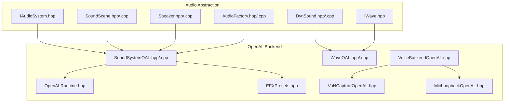
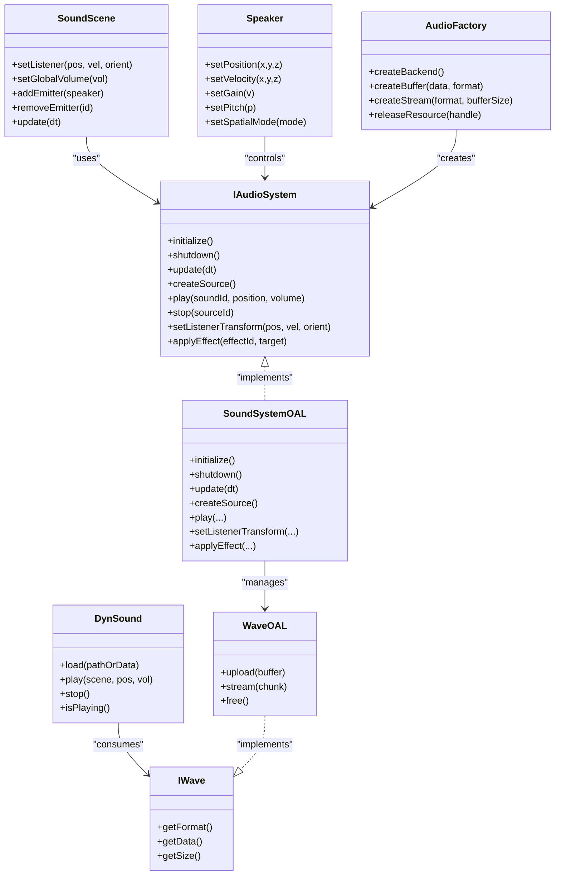
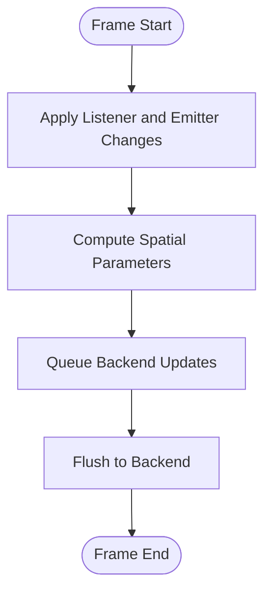
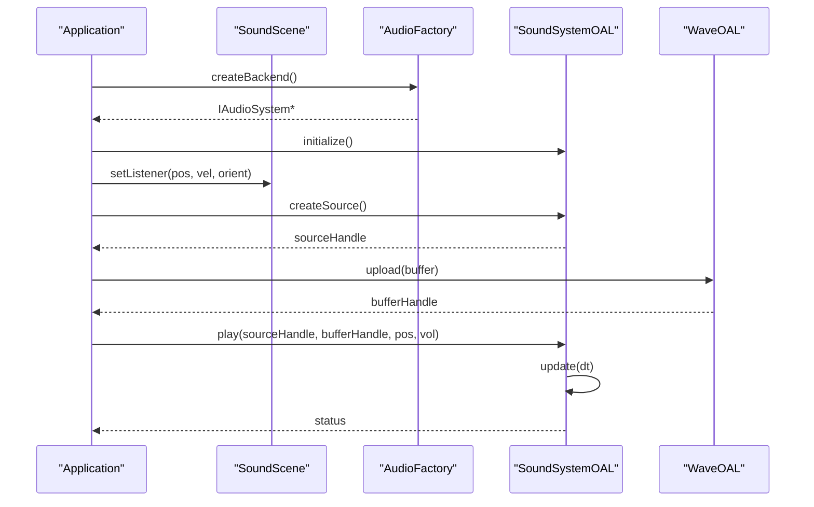
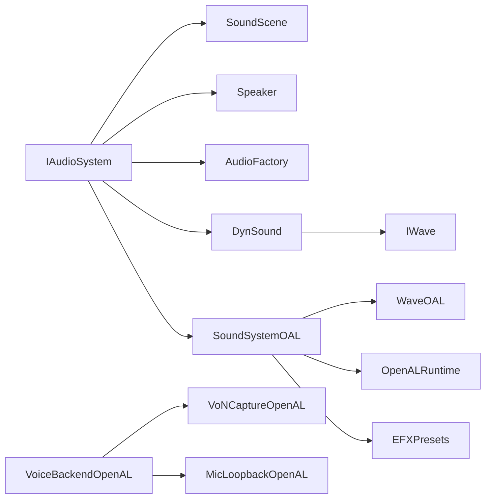

# Audio API

<cite>
**Referenced Files in This Document**
- [IAudioSystem.hpp](file://engine/Poseidon/Audio/IAudioSystem.hpp)
- [SoundScene.hpp](file://engine/Poseidon/Audio/SoundScene.hpp)
- [SoundScene.cpp](file://engine/Poseidon/Audio/SoundScene.cpp)
- [Speaker.hpp](file://engine/Poseidon/Audio/Speaker.hpp)
- [Speaker.cpp](file://engine/Poseidon/Audio/Speaker.cpp)
- [AudioFactory.hpp](file://engine/Poseidon/Audio/AudioFactory.hpp)
- [AudioFactory.cpp](file://engine/Poseidon/Audio/AudioFactory.cpp)
- [DynSound.hpp](file://engine/Poseidon/Audio/DynSound.hpp)
- [DynSound.cpp](file://engine/Poseidon/Audio/DynSound.cpp)
- [IWave.hpp](file://engine/Poseidon/Audio/IWave.hpp)
- [WaveOAL.hpp](file://engine/PoseidonOpenAL/WaveOAL.hpp)
- [WaveOAL.cpp](file://engine/PoseidonOpenAL/WaveOAL.cpp)
- [SoundSystemOAL.hpp](file://engine/PoseidonOpenAL/SoundSystemOAL.hpp)
- [SoundSystemOAL.cpp](file://engine/PoseidonOpenAL/SoundSystemOAL.cpp)
- [OpenALRuntime.hpp](file://engine/PoseidonOpenAL/OpenALRuntime.hpp)
- [VoiceBackendOpenAL.cpp](file://engine/PoseidonOpenAL/Voice/VoiceBackendOpenAL.cpp)
- [VoNCaptureOpenAL.hpp](file://engine/PoseidonOpenAL/Voice/VoNCaptureOpenAL.hpp)
- [MicLoopbackOpenAL.hpp](file://engine/PoseidonOpenAL/Voice/MicLoopbackOpenAL.hpp)
- [EFXPresets.hpp](file://engine/PoseidonOpenAL/EFXPresets.hpp)
</cite>

## Table of Contents
1. [Introduction](#introduction)
2. [Project Structure](#project-structure)
3. [Core Components](#core-components)
4. [Architecture Overview](#architecture-overview)
5. [Detailed Component Analysis](#detailed-component-analysis)
6. [Dependency Analysis](#dependency-analysis)
7. [Performance Considerations](#performance-considerations)
8. [Troubleshooting Guide](#troubleshooting-guide)
9. [Conclusion](#conclusion)
10. [Appendices](#appendices)

## Introduction
This document provides detailed API documentation for the audio system interface in CWR-CE, focusing on the IAudioSystem abstraction and its OpenAL implementation. It covers sound playback, streaming, spatial audio, SoundScene management, audio effects processing, and voice communication APIs. It also includes guidance for implementing custom backends, handling audio formats, and managing resources efficiently, with emphasis on threading models, latency requirements, and platform-specific optimizations.

## Project Structure
The audio subsystem is organized under engine/Poseidon/Audio with a clear separation between the abstract interface, shared components, and backend implementations. The OpenAL backend resides under engine/PoseidonOpenAL.

**Diagram sources**
- [IAudioSystem.hpp](file://engine/Poseidon/Audio/IAudioSystem.hpp)
- [SoundScene.hpp](file://engine/Poseidon/Audio/SoundScene.hpp)
- [SoundScene.cpp](file://engine/Poseidon/Audio/SoundScene.cpp)
- [Speaker.hpp](file://engine/Poseidon/Audio/Speaker.hpp)
- [Speaker.cpp](file://engine/Poseidon/Audio/Speaker.cpp)
- [AudioFactory.hpp](file://engine/Poseidon/Audio/AudioFactory.hpp)
- [AudioFactory.cpp](file://engine/Poseidon/Audio/AudioFactory.cpp)
- [DynSound.hpp](file://engine/Poseidon/Audio/DynSound.hpp)
- [DynSound.cpp](file://engine/Poseidon/Audio/DynSound.cpp)
- [IWave.hpp](file://engine/Poseidon/Audio/IWave.hpp)
- [SoundSystemOAL.hpp](file://engine/PoseidonOpenAL/SoundSystemOAL.hpp)
- [SoundSystemOAL.cpp](file://engine/PoseidonOpenAL/SoundSystemOAL.cpp)
- [WaveOAL.hpp](file://engine/PoseidonOpenAL/WaveOAL.hpp)
- [WaveOAL.cpp](file://engine/PoseidonOpenAL/WaveOAL.cpp)
- [OpenALRuntime.hpp](file://engine/PoseidonOpenAL/OpenALRuntime.hpp)
- [EFXPresets.hpp](file://engine/PoseidonOpenAL/EFXPresets.hpp)
- [VoiceBackendOpenAL.cpp](file://engine/PoseidonOpenAL/Voice/VoiceBackendOpenAL.cpp)
- [VoNCaptureOpenAL.hpp](file://engine/PoseidonOpenAL/Voice/VoNCaptureOpenAL.hpp)
- [MicLoopbackOpenAL.hpp](file://engine/PoseidonOpenAL/Voice/MicLoopbackOpenAL.hpp)

**Section sources**
- [IAudioSystem.hpp](file://engine/Poseidon/Audio/IAudioSystem.hpp)
- [SoundScene.hpp](file://engine/Poseidon/Audio/SoundScene.hpp)
- [SoundScene.cpp](file://engine/Poseidon/Audio/SoundScene.cpp)
- [Speaker.hpp](file://engine/Poseidon/Audio/Speaker.hpp)
- [Speaker.cpp](file://engine/Poseidon/Audio/Speaker.cpp)
- [AudioFactory.hpp](file://engine/Poseidon/Audio/AudioFactory.hpp)
- [AudioFactory.cpp](file://engine/Poseidon/Audio/AudioFactory.cpp)
- [DynSound.hpp](file://engine/Poseidon/Audio/DynSound.hpp)
- [DynSound.cpp](file://engine/Poseidon/Audio/DynSound.cpp)
- [IWave.hpp](file://engine/Poseidon/Audio/IWave.hpp)
- [SoundSystemOAL.hpp](file://engine/PoseidonOpenAL/SoundSystemOAL.hpp)
- [SoundSystemOAL.cpp](file://engine/PoseidonOpenAL/SoundSystemOAL.cpp)
- [WaveOAL.hpp](file://engine/PoseidonOpenAL/WaveOAL.hpp)
- [WaveOAL.cpp](file://engine/PoseidonOpenAL/WaveOAL.cpp)
- [OpenALRuntime.hpp](file://engine/PoseidonOpenAL/OpenALRuntime.hpp)
- [EFXPresets.hpp](file://engine/PoseidonOpenAL/EFXPresets.hpp)
- [VoiceBackendOpenAL.cpp](file://engine/PoseidonOpenAL/Voice/VoiceBackendOpenAL.cpp)
- [VoNCaptureOpenAL.hpp](file://engine/PoseidonOpenAL/Voice/VoNCaptureOpenAL.hpp)
- [MicLoopbackOpenAL.hpp](file://engine/PoseidonOpenAL/Voice/MicLoopbackOpenAL.hpp)

## Core Components
- IAudioSystem: Abstract interface defining audio context lifecycle, playback control, streaming, spatial positioning, and effect routing.
- SoundScene: Manages scene-level audio state, listener transforms, global parameters, and per-source properties.
- Speaker: Represents an audio emitter/source with position, velocity, gain, pitch, and spatial attributes.
- AudioFactory: Creates and manages audio resources (buffers, streams, sources) and binds them to the active backend.
- DynSound: Dynamic sound wrapper that handles format-agnostic playback and resource lifecycle.
- IWave: Interface for wave data access used by both static and streaming playback paths.

Key responsibilities:
- Context initialization and device selection
- Source creation, pooling, and lifecycle management
- Buffer upload and streaming strategies
- Spatialization via listener and source transforms
- Effects chain composition and preset application
- Voice capture and playout integration

**Section sources**
- [IAudioSystem.hpp](file://engine/Poseidon/Audio/IAudioSystem.hpp)
- [SoundScene.hpp](file://engine/Poseidon/Audio/SoundScene.hpp)
- [SoundScene.cpp](file://engine/Poseidon/Audio/SoundScene.cpp)
- [Speaker.hpp](file://engine/Poseidon/Audio/Speaker.hpp)
- [Speaker.cpp](file://engine/Poseidon/Audio/Speaker.cpp)
- [AudioFactory.hpp](file://engine/Poseidon/Audio/AudioFactory.hpp)
- [AudioFactory.cpp](file://engine/Poseidon/Audio/AudioFactory.cpp)
- [DynSound.hpp](file://engine/Poseidon/Audio/DynSound.hpp)
- [DynSound.cpp](file://engine/Poseidon/Audio/DynSound.cpp)
- [IWave.hpp](file://engine/Poseidon/Audio/IWave.hpp)

## Architecture Overview
The audio architecture separates the platform-agnostic API from the OpenAL backend. The factory selects and configures the backend at runtime. Scene and speaker abstractions encapsulate game logic, while the backend performs low-level buffer operations, mixing, and DSP.

**Diagram sources**
- [IAudioSystem.hpp](file://engine/Poseidon/Audio/IAudioSystem.hpp)
- [SoundScene.hpp](file://engine/Poseidon/Audio/SoundScene.hpp)
- [Speaker.hpp](file://engine/Poseidon/Audio/Speaker.hpp)
- [AudioFactory.hpp](file://engine/Poseidon/Audio/AudioFactory.hpp)
- [DynSound.hpp](file://engine/Poseidon/Audio/DynSound.hpp)
- [IWave.hpp](file://engine/Poseidon/Audio/IWave.hpp)
- [SoundSystemOAL.hpp](file://engine/PoseidonOpenAL/SoundSystemOAL.hpp)
- [WaveOAL.hpp](file://engine/PoseidonOpenAL/WaveOAL.hpp)

## Detailed Component Analysis

### IAudioSystem Interface
Responsibilities:
- Lifecycle: initialize, shutdown, update loop integration
- Playback: create sources, play/pause/stop sounds, set per-source properties
- Spatial: set listener transform, configure Doppler and rolloff
- Effects: attach and route effects to sources or groups
- Resource management: buffer/stream allocation and release policies

Implementation notes:
- Methods should be thread-safe where applicable; avoid blocking calls in update
- Prefer batched updates to minimize driver overhead
- Expose minimal, stable API surface for cross-platform consistency

**Section sources**
- [IAudioSystem.hpp](file://engine/Poseidon/Audio/IAudioSystem.hpp)

### SoundScene Management
Responsibilities:
- Maintain listener transform and global audio parameters
- Manage emitter registry and update cycle
- Provide convenience APIs for common operations (e.g., play at world position)

Processing logic:
- Update loop applies per-frame changes to positions, velocities, and gains
- Spatial calculations are delegated to the backend based on scene configuration

**Diagram sources**
- [SoundScene.cpp](file://engine/Poseidon/Audio/SoundScene.cpp)
- [SoundScene.hpp](file://engine/Poseidon/Audio/SoundScene.hpp)

**Section sources**
- [SoundScene.hpp](file://engine/Poseidon/Audio/SoundScene.hpp)
- [SoundScene.cpp](file://engine/Poseidon/Audio/SoundScene.cpp)

### Speaker and Spatial Audio
Responsibilities:
- Represent emitters with position, velocity, orientation, gain, pitch, and spatial mode
- Interact with IAudioSystem to bind to a backend source handle

Spatial considerations:
- Use appropriate rolloff models and Doppler settings
- Ensure consistent coordinate space with the rest of the engine

**Section sources**
- [Speaker.hpp](file://engine/Poseidon/Audio/Speaker.hpp)
- [Speaker.cpp](file://engine/Poseidon/Audio/Speaker.cpp)

### AudioFactory and Resource Creation
Responsibilities:
- Create backend-specific buffers and streams
- Manage resource lifetimes and caching
- Provide uniform API across backends

Best practices:
- Reuse buffers when possible
- Stream large assets to reduce memory footprint

**Section sources**
- [AudioFactory.hpp](file://engine/Poseidon/Audio/AudioFactory.hpp)
- [AudioFactory.cpp](file://engine/Poseidon/Audio/AudioFactory.cpp)

### DynSound and IWave
Responsibilities:
- DynSound wraps audio content and exposes simple play/stop semantics
- IWave defines the contract for accessing raw audio data and format metadata

Usage patterns:
- Load once, reuse across multiple plays
- For streaming, use stream-oriented factories and feed chunks incrementally

**Section sources**
- [DynSound.hpp](file://engine/Poseidon/Audio/DynSound.hpp)
- [DynSound.cpp](file://engine/Poseidon/Audio/DynSound.cpp)
- [IWave.hpp](file://engine/Poseidon/Audio/IWave.hpp)

### OpenAL Backend Reference Implementation
Responsibilities:
- Implements IAudioSystem using OpenAL Soft
- Handles context creation, device enumeration, and error propagation
- Provides buffer/streaming via WaveOAL and effects via EFX presets

Key aspects:
- Real-time update loop integrates with engine frame timing
- Threading model isolates audio thread from main thread where supported
- Platform-specific optimizations leverage OpenAL capabilities

**Diagram sources**
- [SoundSystemOAL.hpp](file://engine/PoseidonOpenAL/SoundSystemOAL.hpp)
- [SoundSystemOAL.cpp](file://engine/PoseidonOpenAL/SoundSystemOAL.cpp)
- [WaveOAL.hpp](file://engine/PoseidonOpenAL/WaveOAL.hpp)
- [WaveOAL.cpp](file://engine/PoseidonOpenAL/WaveOAL.cpp)
- [OpenALRuntime.hpp](file://engine/PoseidonOpenAL/OpenALRuntime.hpp)

**Section sources**
- [SoundSystemOAL.hpp](file://engine/PoseidonOpenAL/SoundSystemOAL.hpp)
- [SoundSystemOAL.cpp](file://engine/PoseidonOpenAL/SoundSystemOAL.cpp)
- [WaveOAL.hpp](file://engine/PoseidonOpenAL/WaveOAL.hpp)
- [WaveOAL.cpp](file://engine/PoseidonOpenAL/WaveOAL.cpp)
- [OpenALRuntime.hpp](file://engine/PoseidonOpenAL/OpenALRuntime.hpp)

### Audio Effects Processing
Responsibilities:
- Define and apply presets such as reverb, delay, and equalization
- Route effects to individual sources or groups

Implementation notes:
- Use hardware-accelerated effects when available
- Cache effect states to avoid repeated setup

**Section sources**
- [EFXPresets.hpp](file://engine/PoseidonOpenAL/EFXPresets.hpp)

### Voice Communication APIs
Responsibilities:
- Capture microphone input and playout to speakers
- Integrate with network transport for multiplayer voice

Threading and latency:
- Dedicated capture/playout threads minimize jitter
- Circular buffers and ring queues ensure low-latency delivery

**Section sources**
- [VoiceBackendOpenAL.cpp](file://engine/PoseidonOpenAL/Voice/VoiceBackendOpenAL.cpp)
- [VoNCaptureOpenAL.hpp](file://engine/PoseidonOpenAL/Voice/VoNCaptureOpenAL.hpp)
- [MicLoopbackOpenAL.hpp](file://engine/PoseidonOpenAL/Voice/MicLoopbackOpenAL.hpp)

## Dependency Analysis
The audio system exhibits clear layering:
- Abstraction layer (IAudioSystem, SoundScene, Speaker, AudioFactory, DynSound, IWave)
- Backend layer (OpenAL implementation)
- Voice layer (capture/playout)

**Diagram sources**
- [IAudioSystem.hpp](file://engine/Poseidon/Audio/IAudioSystem.hpp)
- [SoundScene.hpp](file://engine/Poseidon/Audio/SoundScene.hpp)
- [Speaker.hpp](file://engine/Poseidon/Audio/Speaker.hpp)
- [AudioFactory.hpp](file://engine/Poseidon/Audio/AudioFactory.hpp)
- [DynSound.hpp](file://engine/Poseidon/Audio/DynSound.hpp)
- [IWave.hpp](file://engine/Poseidon/Audio/IWave.hpp)
- [SoundSystemOAL.hpp](file://engine/PoseidonOpenAL/SoundSystemOAL.hpp)
- [WaveOAL.hpp](file://engine/PoseidonOpenAL/WaveOAL.hpp)
- [OpenALRuntime.hpp](file://engine/PoseidonOpenAL/OpenALRuntime.hpp)
- [EFXPresets.hpp](file://engine/PoseidonOpenAL/EFXPresets.hpp)
- [VoiceBackendOpenAL.cpp](file://engine/PoseidonOpenAL/Voice/VoiceBackendOpenAL.cpp)
- [VoNCaptureOpenAL.hpp](file://engine/PoseidonOpenAL/Voice/VoNCaptureOpenAL.hpp)
- [MicLoopbackOpenAL.hpp](file://engine/PoseidonOpenAL/Voice/MicLoopbackOpenAL.hpp)

**Section sources**
- [IAudioSystem.hpp](file://engine/Poseidon/Audio/IAudioSystem.hpp)
- [SoundScene.hpp](file://engine/Poseidon/Audio/SoundScene.hpp)
- [Speaker.hpp](file://engine/Poseidon/Audio/Speaker.hpp)
- [AudioFactory.hpp](file://engine/Poseidon/Audio/AudioFactory.hpp)
- [DynSound.hpp](file://engine/Poseidon/Audio/DynSound.hpp)
- [IWave.hpp](file://engine/Poseidon/Audio/IWave.hpp)
- [SoundSystemOAL.hpp](file://engine/PoseidonOpenAL/SoundSystemOAL.hpp)
- [WaveOAL.hpp](file://engine/PoseidonOpenAL/WaveOAL.hpp)
- [OpenALRuntime.hpp](file://engine/PoseidonOpenAL/OpenALRuntime.hpp)
- [EFXPresets.hpp](file://engine/PoseidonOpenAL/EFXPresets.hpp)
- [VoiceBackendOpenAL.cpp](file://engine/PoseidonOpenAL/Voice/VoiceBackendOpenAL.cpp)
- [VoNCaptureOpenAL.hpp](file://engine/PoseidonOpenAL/Voice/VoNCaptureOpenAL.hpp)
- [MicLoopbackOpenAL.hpp](file://engine/PoseidonOpenAL/Voice/MicLoopbackOpenAL.hpp)

## Performance Considerations
- Threading model:
  - Separate audio thread for real-time tasks to avoid frame spikes
  - Lock-free queues for producer-consumer patterns between main and audio threads
- Latency requirements:
  - Target low-latency buffers for voice and interactive sounds
  - Tune buffer sizes to balance CPU usage and latency
- Resource management:
  - Preload frequently used sounds into memory
  - Stream long audio files to minimize memory pressure
- Platform-specific optimizations:
  - Leverage OpenAL extensions and hardware effects when available
  - Avoid unnecessary state changes; batch updates per frame

[No sources needed since this section provides general guidance]

## Troubleshooting Guide
Common issues and resolutions:
- No audio output:
  - Verify device initialization and context creation
  - Check error codes returned by backend
- Crashes during playback:
  - Validate buffer formats and sample rates
  - Ensure proper synchronization between threads
- High CPU usage:
  - Reduce number of simultaneous sources
  - Optimize streaming chunk sizes
- Voice quality problems:
  - Adjust capture and playout buffer sizes
  - Enable noise suppression if supported

**Section sources**
- [SoundSystemOAL.cpp](file://engine/PoseidonOpenAL/SoundSystemOAL.cpp)
- [WaveOAL.cpp](file://engine/PoseidonOpenAL/WaveOAL.cpp)
- [VoiceBackendOpenAL.cpp](file://engine/PoseidonOpenAL/Voice/VoiceBackendOpenAL.cpp)

## Conclusion
The CWR-CE audio system provides a clean abstraction over platform-specific backends, with OpenAL serving as a robust reference implementation. By adhering to the IAudioSystem interface and following best practices for resource management, threading, and latency tuning, developers can implement efficient and portable audio solutions tailored to their needs.

[No sources needed since this section summarizes without analyzing specific files]

## Appendices

### Implementing a Custom Audio Backend
Steps:
- Implement IAudioSystem methods for lifecycle, playback, and spatial control
- Provide buffer/streaming support compatible with IWave
- Integrate with your platform’s audio API and expose equivalent features to OpenAL
- Test with existing scenes and speakers to ensure compatibility

Guidelines:
- Maintain thread safety and non-blocking behavior in update loops
- Expose error reporting mechanisms for diagnostics
- Keep performance characteristics similar to the OpenAL backend

**Section sources**
- [IAudioSystem.hpp](file://engine/Poseidon/Audio/IAudioSystem.hpp)
- [IWave.hpp](file://engine/Poseidon/Audio/IWave.hpp)
- [SoundSystemOAL.hpp](file://engine/PoseidonOpenAL/SoundSystemOAL.hpp)

### Handling Audio Formats
Recommendations:
- Normalize sample rates and channel layouts early in the pipeline
- Support common formats (PCM, Ogg Vorbis for streaming)
- Use streaming for large assets to reduce memory usage

**Section sources**
- [IWave.hpp](file://engine/Poseidon/Audio/IWave.hpp)
- [WaveOAL.hpp](file://engine/PoseidonOpenAL/WaveOAL.hpp)

### Managing Audio Resources Efficiently
Tips:
- Pool sources and buffers to avoid frequent allocations
- Reuse buffers for short sounds
- Implement lazy loading for large assets

**Section sources**
- [AudioFactory.hpp](file://engine/Poseidon/Audio/AudioFactory.hpp)
- [DynSound.hpp](file://engine/Poseidon/Audio/DynSound.hpp)