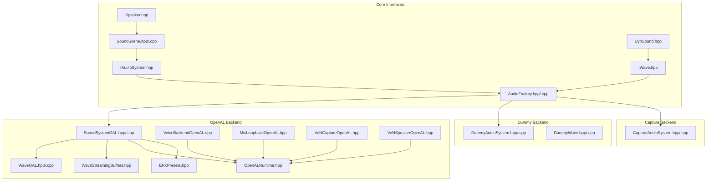
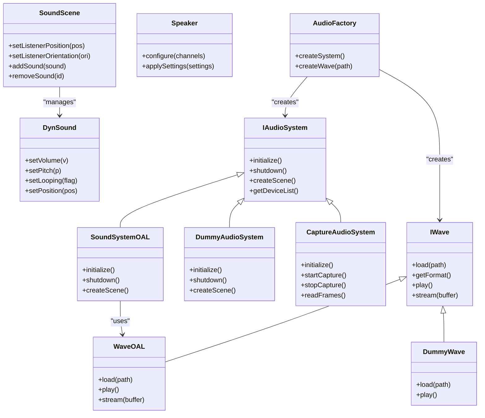
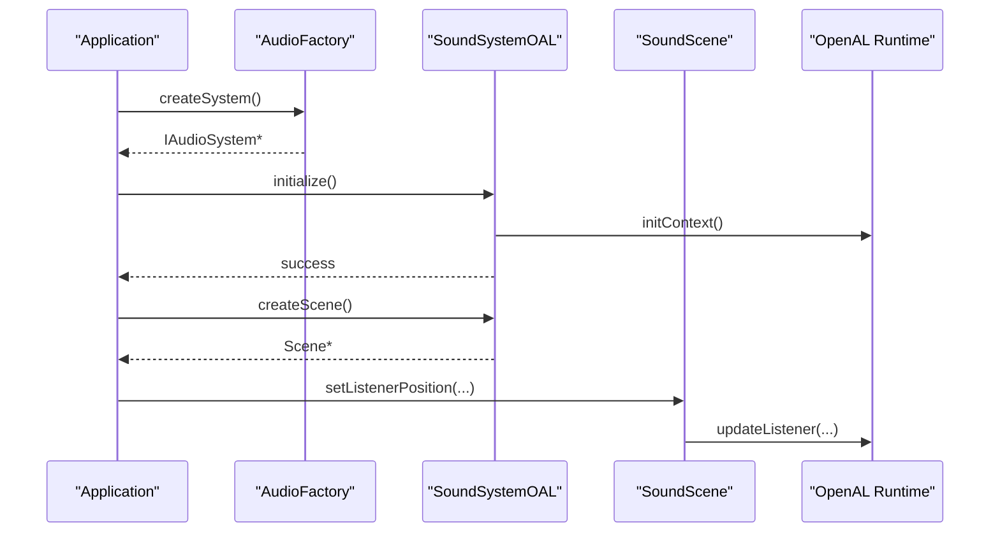
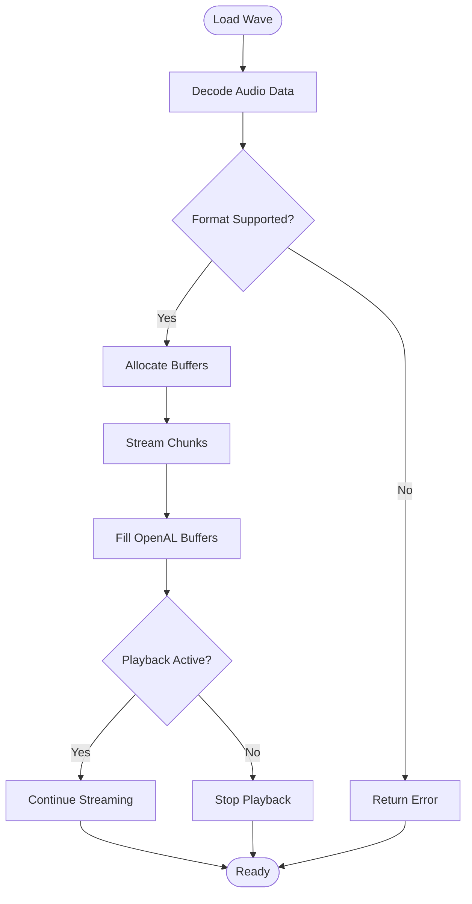
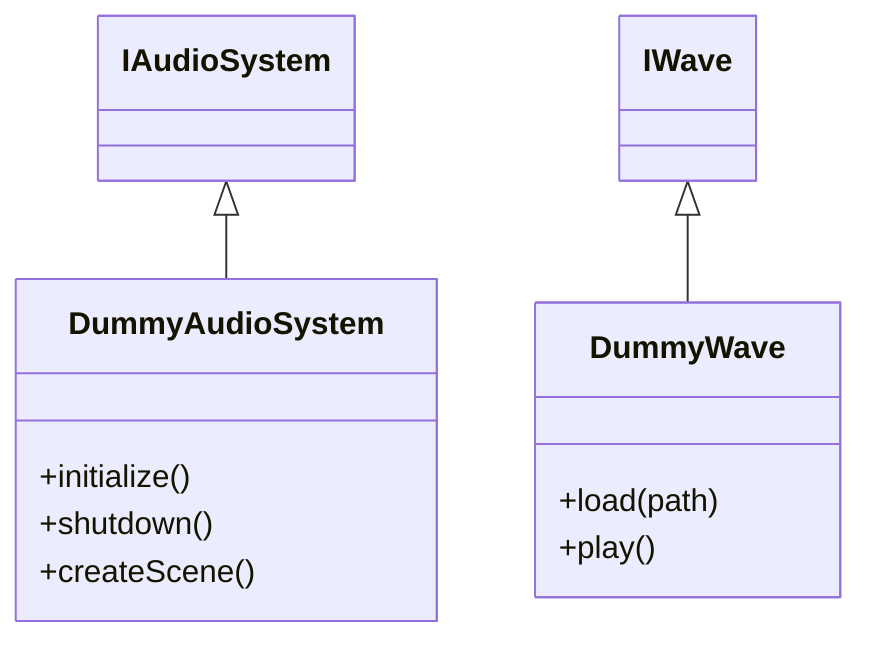
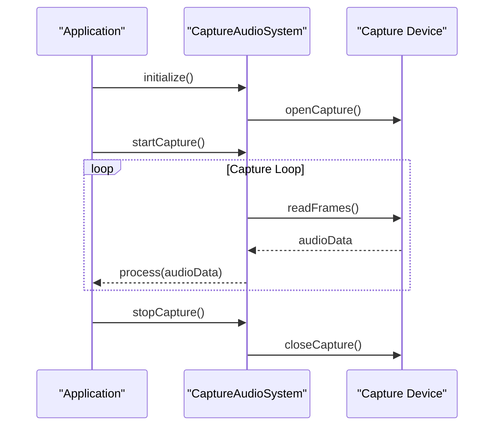
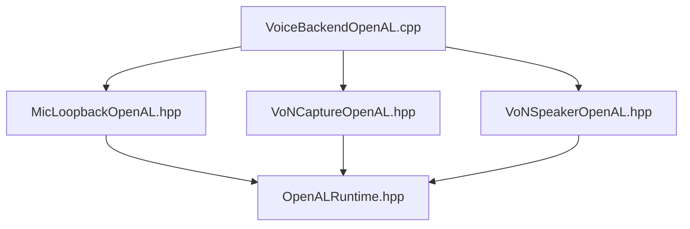
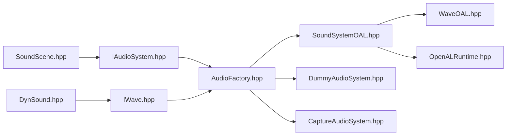

# Audio Backend Implementation

<cite>
**Referenced Files in This Document**
- [IAudioSystem.hpp](file://engine/Poseidon/Audio/IAudioSystem.hpp)
- [AudioFactory.hpp](file://engine/Poseidon/Audio/AudioFactory.hpp)
- [AudioFactory.cpp](file://engine/Poseidon/Audio/AudioFactory.cpp)
- [SoundScene.hpp](file://engine/Poseidon/Audio/SoundScene.hpp)
- [SoundScene.cpp](file://engine/Poseidon/Audio/SoundScene.cpp)
- [IWave.hpp](file://engine/Poseidon/Audio/IWave.hpp)
- [DynSound.hpp](file://engine/Poseidon/Audio/DynSound.hpp)
- [Speaker.hpp](file://engine/Poseidon/Audio/Speaker.hpp)
- [SoundSystemOAL.hpp](file://engine/PoseidonOpenAL/SoundSystemOAL.hpp)
- [SoundSystemOAL.cpp](file://engine/PoseidonOpenAL/SoundSystemOAL.cpp)
- [WaveOAL.hpp](file://engine/PoseidonOpenAL/WaveOAL.hpp)
- [WaveOAL.cpp](file://engine/PoseidonOpenAL/WaveOAL.cpp)
- [WaveStreamingBuffers.hpp](file://engine/PoseidonOpenAL/WaveStreamingBuffers.hpp)
- [OpenALRuntime.hpp](file://engine/PoseidonOpenAL/OpenALRuntime.hpp)
- [EFXPresets.hpp](file://engine/PoseidonOpenAL/EFXPresets.hpp)
- [DummyAudioSystem.hpp](file://engine/Poseidon/Audio/Dummy/DummyAudioSystem.hpp)
- [DummyAudioSystem.cpp](file://engine/Poseidon/Audio/Dummy/DummyAudioSystem.cpp)
- [DummyWave.hpp](file://engine/Poseidon/Audio/Dummy/DummyWave.hpp)
- [DummyWave.cpp](file://engine/Poseidon/Audio/Dummy/DummyWave.cpp)
- [CaptureAudioSystem.hpp](file://engine/Poseidon/Audio/Capture/CaptureAudioSystem.hpp)
- [CaptureAudioSystem.cpp](file://engine/Poseidon/Audio/Capture/CaptureAudioSystem.cpp)
- [VoiceBackendOpenAL.cpp](file://engine/PoseidonOpenAL/Voice/VoiceBackendOpenAL.cpp)
- [MicLoopbackOpenAL.hpp](file://engine/PoseidonOpenAL/Voice/MicLoopbackOpenAL.hpp)
- [VoNCaptureOpenAL.hpp](file://engine/PoseidonOpenAL/Voice/VoNCaptureOpenAL.hpp)
- [VoNSpeakerOpenAL.hpp](file://engine/PoseidonOpenAL/Voice/VoNSpeakerOpenAL.hpp)
</cite>

## Table of Contents
1. Introduction
2. Project Structure
3. Core Components
4. Architecture Overview
5. Detailed Component Analysis
6. Dependency Analysis
7. Performance Considerations
8. Troubleshooting Guide
9. Conclusion
10. Appendices

## Introduction
This document explains how to implement audio backends in CWR-CE with a focus on the OpenAL backend as a reference implementation. It covers system management via SoundSystemOAL, wave handling via WaveOAL, and provides guidance for creating custom backends (including dummy and capture backends). You will learn buffer management strategies, error handling patterns, cross-platform considerations, and performance optimization techniques. Step-by-step instructions are included for integrating third-party audio libraries and building minimal backends.

## Project Structure
The audio subsystem is organized into:
- Shared interfaces and core components under engine/Poseidon/Audio
- Platform-specific implementations under engine/PoseidonOpenAL
- Dummy and capture backends under engine/Poseidon/Audio/Dummy and engine/Poseidon/Audio/Capture
- Voice processing components under engine/PoseidonOpenAL/Voice

**Diagram sources**
- [IAudioSystem.hpp](file://engine/Poseidon/Audio/IAudioSystem.hpp)
- [IWave.hpp](file://engine/Poseidon/Audio/IWave.hpp)
- [SoundScene.hpp](file://engine/Poseidon/Audio/SoundScene.hpp)
- [SoundScene.cpp](file://engine/Poseidon/Audio/SoundScene.cpp)
- [DynSound.hpp](file://engine/Poseidon/Audio/DynSound.hpp)
- [Speaker.hpp](file://engine/Poseidon/Audio/Speaker.hpp)
- [AudioFactory.hpp](file://engine/Poseidon/Audio/AudioFactory.hpp)
- [AudioFactory.cpp](file://engine/Poseidon/Audio/AudioFactory.cpp)
- [SoundSystemOAL.hpp](file://engine/PoseidonOpenAL/SoundSystemOAL.hpp)
- [SoundSystemOAL.cpp](file://engine/PoseidonOpenAL/SoundSystemOAL.cpp)
- [WaveOAL.hpp](file://engine/PoseidonOpenAL/WaveOAL.hpp)
- [WaveOAL.cpp](file://engine/PoseidonOpenAL/WaveOAL.cpp)
- [WaveStreamingBuffers.hpp](file://engine/PoseidonOpenAL/WaveStreamingBuffers.hpp)
- [OpenALRuntime.hpp](file://engine/PoseidonOpenAL/OpenALRuntime.hpp)
- [EFXPresets.hpp](file://engine/PoseidonOpenAL/EFXPresets.hpp)
- [DummyAudioSystem.hpp](file://engine/Poseidon/Audio/Dummy/DummyAudioSystem.hpp)
- [DummyAudioSystem.cpp](file://engine/Poseidon/Audio/Dummy/DummyAudioSystem.cpp)
- [DummyWave.hpp](file://engine/Poseidon/Audio/Dummy/DummyWave.hpp)
- [DummyWave.cpp](file://engine/Poseidon/Audio/Dummy/DummyWave.cpp)
- [CaptureAudioSystem.hpp](file://engine/Poseidon/Audio/Capture/CaptureAudioSystem.hpp)
- [CaptureAudioSystem.cpp](file://engine/Poseidon/Audio/Capture/CaptureAudioSystem.cpp)
- [VoiceBackendOpenAL.cpp](file://engine/PoseidonOpenAL/Voice/VoiceBackendOpenAL.cpp)
- [MicLoopbackOpenAL.hpp](file://engine/PoseidonOpenAL/Voice/MicLoopbackOpenAL.hpp)
- [VoNCaptureOpenAL.hpp](file://engine/PoseidonOpenAL/Voice/VoNCaptureOpenAL.hpp)
- [VoNSpeakerOpenAL.hpp](file://engine/PoseidonOpenAL/Voice/VoNSpeakerOpenAL.hpp)

**Section sources**
- [IAudioSystem.hpp](file://engine/Poseidon/Audio/IAudioSystem.hpp)
- [IWave.hpp](file://engine/Poseidon/Audio/IWave.hpp)
- [SoundScene.hpp](file://engine/Poseidon/Audio/SoundScene.hpp)
- [SoundScene.cpp](file://engine/Poseidon/Audio/SoundScene.cpp)
- [DynSound.hpp](file://engine/Poseidon/Audio/DynSound.hpp)
- [Speaker.hpp](file://engine/Poseidon/Audio/Speaker.hpp)
- [AudioFactory.hpp](file://engine/Poseidon/Audio/AudioFactory.hpp)
- [AudioFactory.cpp](file://engine/Poseidon/Audio/AudioFactory.cpp)
- [SoundSystemOAL.hpp](file://engine/PoseidonOpenAL/SoundSystemOAL.hpp)
- [SoundSystemOAL.cpp](file://engine/PoseidonOpenAL/SoundSystemOAL.cpp)
- [WaveOAL.hpp](file://engine/PoseidonOpenAL/WaveOAL.hpp)
- [WaveOAL.cpp](file://engine/PoseidonOpenAL/WaveOAL.cpp)
- [WaveStreamingBuffers.hpp](file://engine/PoseidonOpenAL/WaveStreamingBuffers.hpp)
- [OpenALRuntime.hpp](file://engine/PoseidonOpenAL/OpenALRuntime.hpp)
- [EFXPresets.hpp](file://engine/PoseidonOpenAL/EFXPresets.hpp)
- [DummyAudioSystem.hpp](file://engine/Poseidon/Audio/Dummy/DummyAudioSystem.hpp)
- [DummyAudioSystem.cpp](file://engine/Poseidon/Audio/Dummy/DummyAudioSystem.cpp)
- [DummyWave.hpp](file://engine/Poseidon/Audio/Dummy/DummyWave.hpp)
- [DummyWave.cpp](file://engine/Poseidon/Audio/Dummy/DummyWave.cpp)
- [CaptureAudioSystem.hpp](file://engine/Poseidon/Audio/Capture/CaptureAudioSystem.hpp)
- [CaptureAudioSystem.cpp](file://engine/Poseidon/Audio/Capture/CaptureAudioSystem.cpp)
- [VoiceBackendOpenAL.cpp](file://engine/PoseidonOpenAL/Voice/VoiceBackendOpenAL.cpp)
- [MicLoopbackOpenAL.hpp](file://engine/PoseidonOpenAL/Voice/MicLoopbackOpenAL.hpp)
- [VoNCaptureOpenAL.hpp](file://engine/PoseidonOpenAL/Voice/VoNCaptureOpenAL.hpp)
- [VoNSpeakerOpenAL.hpp](file://engine/PoseidonOpenAL/Voice/VoNSpeakerOpenAL.hpp)

## Core Components
- IAudioSystem: Defines the abstract interface for audio system initialization, device enumeration, scene creation, and lifecycle control.
- IWave: Abstract interface for wave data loading, format introspection, and playback/streaming primitives.
- SoundScene: Manages 3D audio positioning, listener state, and per-scene resources.
- DynSound: Represents a dynamic sound instance with volume, pitch, looping, and spatial attributes.
- Speaker: Encapsulates speaker configuration and channel mapping.
- AudioFactory: Central factory that constructs concrete audio systems and waves based on runtime selection or build-time configuration.

Key responsibilities:
- Decouple application code from platform-specific audio APIs
- Provide consistent lifecycle and resource management across backends
- Expose common audio features (positioning, effects, streaming) through stable interfaces

**Section sources**
- [IAudioSystem.hpp](file://engine/Poseidon/Audio/IAudioSystem.hpp)
- [IWave.hpp](file://engine/Poseidon/Audio/IWave.hpp)
- [SoundScene.hpp](file://engine/Poseidon/Audio/SoundScene.hpp)
- [SoundScene.cpp](file://engine/Poseidon/Audio/SoundScene.cpp)
- [DynSound.hpp](file://engine/Poseidon/Audio/DynSound.hpp)
- [Speaker.hpp](file://engine/Poseidon/Audio/Speaker.hpp)
- [AudioFactory.hpp](file://engine/Poseidon/Audio/AudioFactory.hpp)
- [AudioFactory.cpp](file://engine/Poseidon/Audio/AudioFactory.cpp)

## Architecture Overview
The audio architecture follows a layered design:
- Application layer uses IAudioSystem and IWave abstractions
- Factory selects and instantiates concrete backends
- Backends implement platform-specific logic (e.g., OpenAL)
- Scene and sound objects manage runtime behavior and resources

**Diagram sources**
- [IAudioSystem.hpp](file://engine/Poseidon/Audio/IAudioSystem.hpp)
- [IWave.hpp](file://engine/Poseidon/Audio/IWave.hpp)
- [SoundScene.hpp](file://engine/Poseidon/Audio/SoundScene.hpp)
- [SoundScene.cpp](file://engine/Poseidon/Audio/SoundScene.cpp)
- [DynSound.hpp](file://engine/Poseidon/Audio/DynSound.hpp)
- [Speaker.hpp](file://engine/Poseidon/Audio/Speaker.hpp)
- [AudioFactory.hpp](file://engine/Poseidon/Audio/AudioFactory.hpp)
- [AudioFactory.cpp](file://engine/Poseidon/Audio/AudioFactory.cpp)
- [SoundSystemOAL.hpp](file://engine/PoseidonOpenAL/SoundSystemOAL.hpp)
- [SoundSystemOAL.cpp](file://engine/PoseidonOpenAL/SoundSystemOAL.cpp)
- [WaveOAL.hpp](file://engine/PoseidonOpenAL/WaveOAL.hpp)
- [WaveOAL.cpp](file://engine/PoseidonOpenAL/WaveOAL.cpp)
- [DummyAudioSystem.hpp](file://engine/Poseidon/Audio/Dummy/DummyAudioSystem.hpp)
- [DummyAudioSystem.cpp](file://engine/Poseidon/Audio/Dummy/DummyAudioSystem.cpp)
- [DummyWave.hpp](file://engine/Poseidon/Audio/Dummy/DummyWave.hpp)
- [DummyWave.cpp](file://engine/Poseidon/Audio/Dummy/DummyWave.cpp)
- [CaptureAudioSystem.hpp](file://engine/Poseidon/Audio/Capture/CaptureAudioSystem.hpp)
- [CaptureAudioSystem.cpp](file://engine/Poseidon/Audio/Capture/CaptureAudioSystem.cpp)

## Detailed Component Analysis

### OpenAL Backend: SoundSystemOAL
SoundSystemOAL implements IAudioSystem using OpenAL for playback, mixing, and effects. It manages device context, listener state, and scene instances. It integrates with OpenAL Runtime for low-level operations and leverages EFX presets for reverb and other effects.

Key responsibilities:
- Initialize OpenAL context and device
- Create and manage SoundScene instances
- Handle global audio settings (volume, sample rate)
- Provide device enumeration and selection

**Diagram sources**
- [AudioFactory.cpp](file://engine/Poseidon/Audio/AudioFactory.cpp)
- [SoundSystemOAL.hpp](file://engine/PoseidonOpenAL/SoundSystemOAL.hpp)
- [SoundSystemOAL.cpp](file://engine/PoseidonOpenAL/SoundSystemOAL.cpp)
- [OpenALRuntime.hpp](file://engine/PoseidonOpenAL/OpenALRuntime.hpp)
- [SoundScene.hpp](file://engine/Poseidon/Audio/SoundScene.hpp)

**Section sources**
- [SoundSystemOAL.hpp](file://engine/PoseidonOpenAL/SoundSystemOAL.hpp)
- [SoundSystemOAL.cpp](file://engine/PoseidonOpenAL/SoundSystemOAL.cpp)
- [OpenALRuntime.hpp](file://engine/PoseidonOpenAL/OpenALRuntime.hpp)
- [EFXPresets.hpp](file://engine/PoseidonOpenAL/EFXPresets.hpp)

### OpenAL Backend: WaveOAL
WaveOAL implements IWave for OpenAL-based wave handling. It supports decoding, buffering, and streaming audio data to OpenAL buffers. It integrates with streaming buffers for efficient playback of large files.

Key responsibilities:
- Decode audio formats and extract metadata
- Allocate and manage OpenAL buffers
- Stream chunks to avoid blocking
- Handle playback states and errors

**Diagram sources**
- [WaveOAL.hpp](file://engine/PoseidonOpenAL/WaveOAL.hpp)
- [WaveOAL.cpp](file://engine/PoseidonOpenAL/WaveOAL.cpp)
- [WaveStreamingBuffers.hpp](file://engine/PoseidonOpenAL/WaveStreamingBuffers.hpp)

**Section sources**
- [WaveOAL.hpp](file://engine/PoseidonOpenAL/WaveOAL.hpp)
- [WaveOAL.cpp](file://engine/PoseidonOpenAL/WaveOAL.cpp)
- [WaveStreamingBuffers.hpp](file://engine/PoseidonOpenAL/WaveStreamingBuffers.hpp)

### Dummy Backend
The dummy backend provides a minimal implementation for testing and development without requiring real audio hardware. It implements IAudioSystem and IWave with no-op or simulated behavior.

Key responsibilities:
- Provide stub initialization and shutdown
- Return valid but non-functional scenes and sounds
- Allow tests to run without audio devices

**Diagram sources**
- [DummyAudioSystem.hpp](file://engine/Poseidon/Audio/Dummy/DummyAudioSystem.hpp)
- [DummyAudioSystem.cpp](file://engine/Poseidon/Audio/Dummy/DummyAudioSystem.cpp)
- [DummyWave.hpp](file://engine/Poseidon/Audio/Dummy/DummyWave.hpp)
- [DummyWave.cpp](file://engine/Poseidon/Audio/Dummy/DummyWave.cpp)

**Section sources**
- [DummyAudioSystem.hpp](file://engine/Poseidon/Audio/Dummy/DummyAudioSystem.hpp)
- [DummyAudioSystem.cpp](file://engine/Poseidon/Audio/Dummy/DummyAudioSystem.cpp)
- [DummyWave.hpp](file://engine/Poseidon/Audio/Dummy/DummyWave.hpp)
- [DummyWave.cpp](file://engine/Poseidon/Audio/Dummy/DummyWave.cpp)

### Capture Backend
The capture backend enables audio recording by implementing IAudioSystem with capture capabilities. It starts/stops capture streams and reads frames for processing.

Key responsibilities:
- Initialize capture device
- Start and stop capture loops
- Read captured audio frames
- Integrate with voice processing pipelines

**Diagram sources**
- [CaptureAudioSystem.hpp](file://engine/Poseidon/Audio/Capture/CaptureAudioSystem.hpp)
- [CaptureAudioSystem.cpp](file://engine/Poseidon/Audio/Capture/CaptureAudioSystem.cpp)

**Section sources**
- [CaptureAudioSystem.hpp](file://engine/Poseidon/Audio/Capture/CaptureAudioSystem.hpp)
- [CaptureAudioSystem.cpp](file://engine/Poseidon/Audio/Capture/CaptureAudioSystem.cpp)

### Voice Processing Integration
Voice processing components integrate with OpenAL for microphone input, loopback, and speaker output. They provide capture and playback paths for voice communication.

Key components:
- VoiceBackendOpenAL: Main voice backend implementation
- MicLoopbackOpenAL: Microphone loopback functionality
- VoNCaptureOpenAL: Voice over network capture
- VoNSpeakerOpenAL: Voice over network speaker output

**Diagram sources**
- [VoiceBackendOpenAL.cpp](file://engine/PoseidonOpenAL/Voice/VoiceBackendOpenAL.cpp)
- [MicLoopbackOpenAL.hpp](file://engine/PoseidonOpenAL/Voice/MicLoopbackOpenAL.hpp)
- [VoNCaptureOpenAL.hpp](file://engine/PoseidonOpenAL/Voice/VoNCaptureOpenAL.hpp)
- [VoNSpeakerOpenAL.hpp](file://engine/PoseidonOpenAL/Voice/VoNSpeakerOpenAL.hpp)
- [OpenALRuntime.hpp](file://engine/PoseidonOpenAL/OpenALRuntime.hpp)

**Section sources**
- [VoiceBackendOpenAL.cpp](file://engine/PoseidonOpenAL/Voice/VoiceBackendOpenAL.cpp)
- [MicLoopbackOpenAL.hpp](file://engine/PoseidonOpenAL/Voice/MicLoopbackOpenAL.hpp)
- [VoNCaptureOpenAL.hpp](file://engine/PoseidonOpenAL/Voice/VoNCaptureOpenAL.hpp)
- [VoNSpeakerOpenAL.hpp](file://engine/PoseidonOpenAL/Voice/VoNSpeakerOpenAL.hpp)

## Dependency Analysis
The audio system has clear dependency boundaries:
- Core interfaces are independent of platform specifics
- Backends depend on their respective runtime libraries (e.g., OpenAL)
- Factory decouples instantiation from concrete types
- Scene and sound objects depend on IAudioSystem and IWave

**Diagram sources**
- [IAudioSystem.hpp](file://engine/Poseidon/Audio/IAudioSystem.hpp)
- [IWave.hpp](file://engine/Poseidon/Audio/IWave.hpp)
- [AudioFactory.hpp](file://engine/Poseidon/Audio/AudioFactory.hpp)
- [AudioFactory.cpp](file://engine/Poseidon/Audio/AudioFactory.cpp)
- [SoundSystemOAL.hpp](file://engine/PoseidonOpenAL/SoundSystemOAL.hpp)
- [WaveOAL.hpp](file://engine/PoseidonOpenAL/WaveOAL.hpp)
- [OpenALRuntime.hpp](file://engine/PoseidonOpenAL/OpenALRuntime.hpp)
- [SoundScene.hpp](file://engine/Poseidon/Audio/SoundScene.hpp)
- [DynSound.hpp](file://engine/Poseidon/Audio/DynSound.hpp)
- [DummyAudioSystem.hpp](file://engine/Poseidon/Audio/Dummy/DummyAudioSystem.hpp)
- [CaptureAudioSystem.hpp](file://engine/Poseidon/Audio/Capture/CaptureAudioSystem.hpp)

**Section sources**
- [IAudioSystem.hpp](file://engine/Poseidon/Audio/IAudioSystem.hpp)
- [IWave.hpp](file://engine/Poseidon/Audio/IWave.hpp)
- [AudioFactory.hpp](file://engine/Poseidon/Audio/AudioFactory.hpp)
- [AudioFactory.cpp](file://engine/Poseidon/Audio/AudioFactory.cpp)
- [SoundSystemOAL.hpp](file://engine/PoseidonOpenAL/SoundSystemOAL.hpp)
- [WaveOAL.hpp](file://engine/PoseidonOpenAL/WaveOAL.hpp)
- [OpenALRuntime.hpp](file://engine/PoseidonOpenAL/OpenALRuntime.hpp)
- [SoundScene.hpp](file://engine/Poseidon/Audio/SoundScene.hpp)
- [DynSound.hpp](file://engine/Poseidon/Audio/DynSound.hpp)
- [DummyAudioSystem.hpp](file://engine/Poseidon/Audio/Dummy/DummyAudioSystem.hpp)
- [CaptureAudioSystem.hpp](file://engine/Poseidon/Audio/Capture/CaptureAudioSystem.hpp)

## Performance Considerations
- Use streaming buffers for large audio files to avoid memory spikes
- Batch updates to listener and sound positions to reduce API calls
- Pre-decode frequently used sounds into memory for faster playback
- Implement efficient buffer recycling to minimize allocations
- Monitor CPU usage during capture loops and adjust buffer sizes
- Leverage platform-specific optimizations where available

[No sources needed since this section provides general guidance]

## Troubleshooting Guide
Common issues and resolutions:
- Initialization failures: Verify device availability and permissions
- Audio glitches: Check buffer sizes and streaming rates
- Memory leaks: Ensure proper cleanup of OpenAL resources
- Cross-platform differences: Test on target platforms early
- Capture latency: Adjust buffer sizes and processing intervals

Error handling patterns:
- Validate all API calls and return meaningful error codes
- Log detailed diagnostics for debugging
- Gracefully degrade functionality when devices are unavailable

**Section sources**
- [SoundSystemOAL.cpp](file://engine/PoseidonOpenAL/SoundSystemOAL.cpp)
- [WaveOAL.cpp](file://engine/PoseidonOpenAL/WaveOAL.cpp)
- [CaptureAudioSystem.cpp](file://engine/Poseidon/Audio/Capture/CaptureAudioSystem.cpp)

## Conclusion
The CWR-CE audio system provides a robust, extensible framework for implementing audio backends. The OpenAL backend serves as a comprehensive reference implementation, while dummy and capture backends demonstrate minimal and specialized use cases. By following the established patterns and interfaces, developers can create custom backends that integrate seamlessly with the engine while maintaining cross-platform compatibility and optimal performance.

[No sources needed since this section summarizes without analyzing specific files]

## Appendices

### Step-by-Step Guide: Creating a Custom Audio Backend
1. Implement IAudioSystem with your platform-specific audio API
2. Implement IWave for audio file handling
3. Register your backend with AudioFactory
4. Test initialization, playback, and cleanup
5. Optimize buffer management and error handling
6. Add platform-specific optimizations as needed

### Integrating Third-Party Audio Libraries
1. Choose a suitable audio library for your platform
2. Create wrapper classes for core functionality
3. Implement IAudioSystem and IWave interfaces
4. Handle library-specific initialization and cleanup
5. Map library concepts to engine abstractions
6. Test thoroughly across different configurations

### Minimal Backend Example
A minimal backend should include:
- Basic initialization and shutdown
- Simple sound playback without effects
- Error handling for unsupported operations
- Resource cleanup to prevent leaks

[No sources needed since this section provides general guidance]