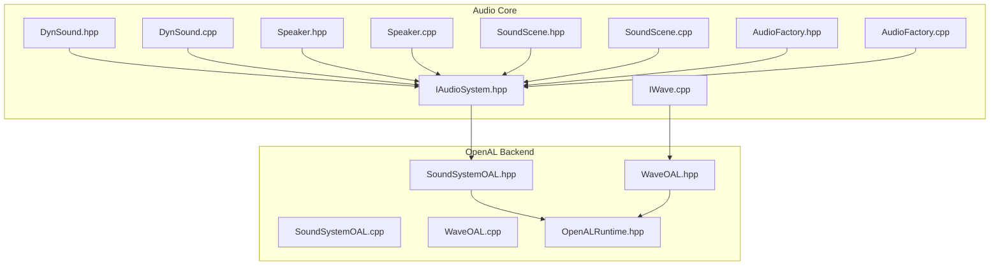
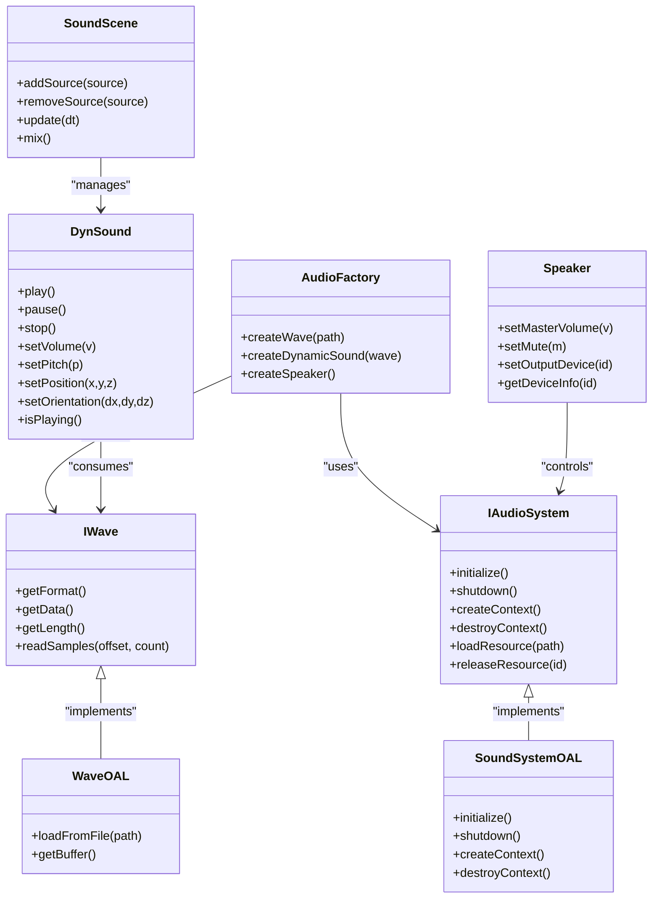
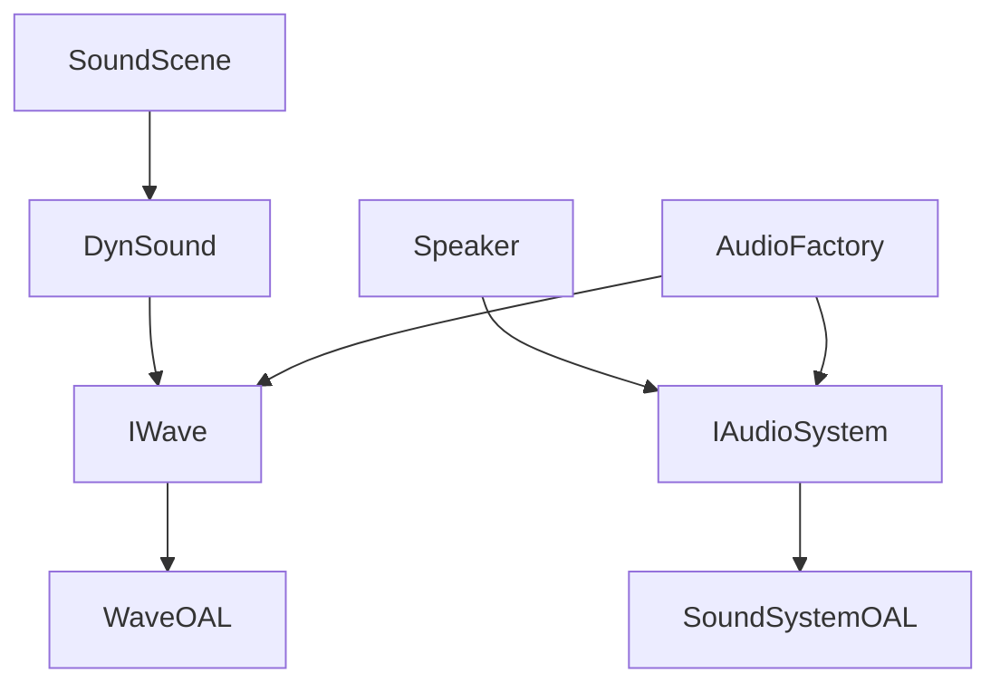
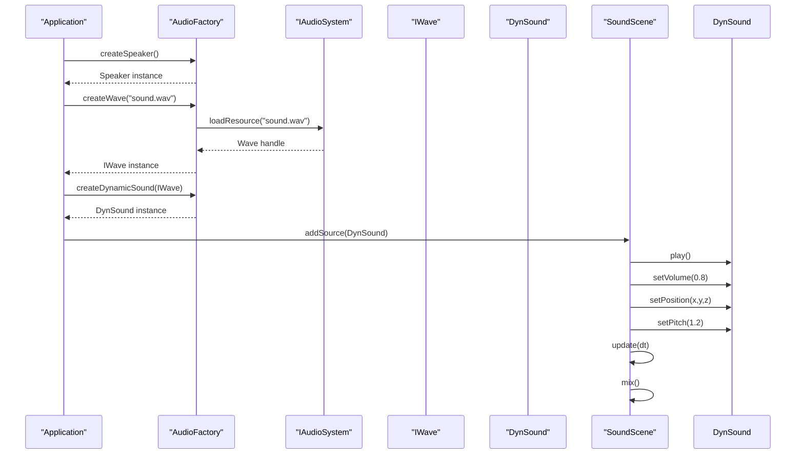

# Core Audio Interface

<cite>
**Referenced Files in This Document**
- [IAudioSystem.hpp](file://engine/Poseidon/Audio/IAudioSystem.hpp)
- [IWave.cpp](file://engine/Poseidon/Audio/IWave.cpp)
- [DynSound.hpp](file://engine/Poseidon/Audio/DynSound.hpp)
- [DynSound.cpp](file://engine/Poseidon/Audio/DynSound.cpp)
- [Speaker.hpp](file://engine/Poseidon/Audio/Speaker.hpp)
- [Speaker.cpp](file://engine/Poseidon/Audio/Speaker.cpp)
- [AudioFactory.hpp](file://engine/Poseidon/Audio/AudioFactory.hpp)
- [AudioFactory.cpp](file://engine/Poseidon/Audio/AudioFactory.cpp)
- [SoundScene.hpp](file://engine/Poseidon/Audio/SoundScene.hpp)
- [SoundScene.cpp](file://engine/Poseidon/Audio/SoundScene.cpp)
- [SoundSystemOAL.hpp](file://engine/Poseidon/OpenAL/SoundSystemOAL.hpp)
- [SoundSystemOAL.cpp](file://engine/Poseidon/OpenAL/SoundSystemOAL.cpp)
- [WaveOAL.hpp](file://engine/Poseidon/OpenAL/WaveOAL.hpp)
- [WaveOAL.cpp](file://engine/Poseidon/OpenAL/WaveOAL.cpp)
- [OpenALRuntime.hpp](file://engine/Poseidon/OpenAL/OpenALRuntime.hpp)
</cite>

## Table of Contents
1. [Introduction](#introduction)
2. [Project Structure](#project-structure)
3. [Core Components](#core-components)
4. [Architecture Overview](#architecture-overview)
5. [Detailed Component Analysis](#detailed-component-analysis)
6. [Dependency Analysis](#dependency-analysis)
7. [Performance Considerations](#performance-considerations)
8. [Troubleshooting Guide](#troubleshooting-guide)
9. [Conclusion](#conclusion)
10. [Appendices](#appendices)

## Introduction
This document provides comprehensive API documentation for the core audio interface in CWR-CE, focusing on:
- IAudioSystem: initialization, context management, and resource lifecycle
- IWave: wave file handling and buffer management
- DynSound: dynamic sound playback control
- Speaker: audio output control including volume, pitch, and spatial positioning
It also covers loading audio formats, managing buffers, controlling playback parameters, threading models, error handling patterns, and performance considerations for real-time audio processing. Guidance is included for implementing custom audio backends by conforming to these interfaces.

## Project Structure
The audio subsystem is organized under engine/Poseidon/Audio with a backend implementation under engine/Poseidon/OpenAL. The key files include:
- Interfaces and core runtime: IAudioSystem.hpp, IWave.cpp, DynSound.hpp/.cpp, Speaker.hpp/.cpp, SoundScene.hpp/.cpp, AudioFactory.hpp/.cpp
- OpenAL backend: SoundSystemOAL.hpp/.cpp, WaveOAL.hpp/.cpp, OpenALRuntime.hpp

**Diagram sources**
- [IAudioSystem.hpp](file://engine/Poseidon/Audio/IAudioSystem.hpp)
- [IWave.cpp](file://engine/Poseidon/Audio/IWave.cpp)
- [DynSound.hpp](file://engine/Poseidon/Audio/DynSound.hpp)
- [DynSound.cpp](file://engine/Poseidon/Audio/DynSound.cpp)
- [Speaker.hpp](file://engine/Poseidon/Audio/Speaker.hpp)
- [Speaker.cpp](file://engine/Poseidon/Audio/Speaker.cpp)
- [SoundScene.hpp](file://engine/Poseidon/Audio/SoundScene.hpp)
- [SoundScene.cpp](file://engine/Poseidon/Audio/SoundScene.cpp)
- [AudioFactory.hpp](file://engine/Poseidon/Audio/AudioFactory.hpp)
- [AudioFactory.cpp](file://engine/Poseidon/Audio/AudioFactory.cpp)
- [SoundSystemOAL.hpp](file://engine/Poseidon/OpenAL/SoundSystemOAL.hpp)
- [SoundSystemOAL.cpp](file://engine/Poseidon/OpenAL/SoundSystemOAL.cpp)
- [WaveOAL.hpp](file://engine/Poseidon/OpenAL/WaveOAL.hpp)
- [WaveOAL.cpp](file://engine/Poseidon/OpenAL/WaveOAL.cpp)
- [OpenALRuntime.hpp](file://engine/Poseidon/OpenAL/OpenALRuntime.hpp)

**Section sources**
- [IAudioSystem.hpp](file://engine/Poseidon/Audio/IAudioSystem.hpp)
- [IWave.cpp](file://engine/Poseidon/Audio/IWave.cpp)
- [DynSound.hpp](file://engine/Poseidon/Audio/DynSound.hpp)
- [DynSound.cpp](file://engine/Poseidon/Audio/DynSound.cpp)
- [Speaker.hpp](file://engine/Poseidon/Audio/Speaker.hpp)
- [Speaker.cpp](file://engine/Poseidon/Audio/Speaker.cpp)
- [SoundScene.hpp](file://engine/Poseidon/Audio/SoundScene.hpp)
- [SoundScene.cpp](file://engine/Poseidon/Audio/SoundScene.cpp)
- [AudioFactory.hpp](file://engine/Poseidon/Audio/AudioFactory.hpp)
- [AudioFactory.cpp](file://engine/Poseidon/Audio/AudioFactory.cpp)
- [SoundSystemOAL.hpp](file://engine/Poseidon/OpenAL/SoundSystemOAL.hpp)
- [SoundSystemOAL.cpp](file://engine/Poseidon/OpenAL/SoundSystemOAL.cpp)
- [WaveOAL.hpp](file://engine/Poseidon/OpenAL/WaveOAL.hpp)
- [WaveOAL.cpp](file://engine/Poseidon/OpenAL/WaveOAL.cpp)
- [OpenALRuntime.hpp](file://engine/Poseidon/OpenAL/OpenALRuntime.hpp)

## Core Components
This section outlines the primary interfaces and classes that form the audio API surface:
- IAudioSystem: Central entry point for initialization, context management, and resource lifecycle
- IWave: Abstraction for wave data and buffer operations
- DynSound: Dynamic sound playback controller
- Speaker: Output device control (volume, pitch, spatial positioning)
- SoundScene: Scene-level audio state and mixing
- AudioFactory: Creation and registration of audio resources and backends
- OpenAL backend: Concrete implementations for OpenAL-based audio

Key responsibilities:
- Initialization and shutdown sequencing
- Context creation and destruction
- Loading and decoding audio formats into buffers
- Playback control (play, pause, stop, loop, seek)
- Parameter updates (volume, pitch, position, orientation)
- Buffer management and streaming where applicable

**Section sources**
- [IAudioSystem.hpp](file://engine/Poseidon/Audio/IAudioSystem.hpp)
- [IWave.cpp](file://engine/Poseidon/Audio/IWave.cpp)
- [DynSound.hpp](file://engine/Poseidon/Audio/DynSound.hpp)
- [DynSound.cpp](file://engine/Poseidon/Audio/DynSound.cpp)
- [Speaker.hpp](file://engine/Poseidon/Audio/Speaker.hpp)
- [Speaker.cpp](file://engine/Poseidon/Audio/Speaker.cpp)
- [SoundScene.hpp](file://engine/Poseidon/Audio/SoundScene.hpp)
- [SoundScene.cpp](file://engine/Poseidon/Audio/SoundScene.cpp)
- [AudioFactory.hpp](file://engine/Poseidon/Audio/AudioFactory.hpp)
- [AudioFactory.cpp](file://engine/Poseidon/Audio/AudioFactory.cpp)

## Architecture Overview
The audio architecture separates the abstract API from platform-specific implementations:
- Abstract layer: IAudioSystem, IWave, DynSound, Speaker, SoundScene, AudioFactory
- Concrete backend: OpenAL-based SoundSystemOAL and WaveOAL
- Runtime: OpenALRuntime manages OpenAL context and device access

**Diagram sources**
- [IAudioSystem.hpp](file://engine/Poseidon/Audio/IAudioSystem.hpp)
- [IWave.cpp](file://engine/Poseidon/Audio/IWave.cpp)
- [DynSound.hpp](file://engine/Poseidon/Audio/DynSound.hpp)
- [DynSound.cpp](file://engine/Poseidon/Audio/DynSound.cpp)
- [Speaker.hpp](file://engine/Poseidon/Audio/Speaker.hpp)
- [Speaker.cpp](file://engine/Poseidon/Audio/Speaker.cpp)
- [SoundScene.hpp](file://engine/Poseidon/Audio/SoundScene.hpp)
- [SoundScene.cpp](file://engine/Poseidon/Audio/SoundScene.cpp)
- [AudioFactory.hpp](file://engine/Poseidon/Audio/AudioFactory.hpp)
- [AudioFactory.cpp](file://engine/Poseidon/Audio/AudioFactory.cpp)
- [SoundSystemOAL.hpp](file://engine/Poseidon/OpenAL/SoundSystemOAL.hpp)
- [SoundSystemOAL.cpp](file://engine/Poseidon/OpenAL/SoundSystemOAL.cpp)
- [WaveOAL.hpp](file://engine/Poseidon/OpenAL/WaveOAL.hpp)
- [WaveOAL.cpp](file://engine/Poseidon/OpenAL/WaveOAL.cpp)

## Detailed Component Analysis

### IAudioSystem Interface
Responsibilities:
- Initialize the audio subsystem and create an audio context
- Manage resource lifecycle (loading, caching, releasing)
- Provide factory-like methods for creating audio objects through AudioFactory
- Expose backend capabilities and configuration

Initialization and context management:
- initialize(): Set up global audio state, load configuration, prepare backend
- createContext(): Create and bind an audio context for rendering
- shutdown()/destroyContext(): Clean up resources and release backend handles

Resource lifecycle:
- loadResource(path): Load and decode audio assets into memory or stream buffers
- releaseResource(id): Free associated resources and invalidate handles

Error handling:
- Return status codes or throw exceptions on failure
- Validate paths and supported formats before loading

Threading model:
- Initialization should occur on the main thread
- Resource loading may be offloaded to worker threads; ensure synchronization when accessing shared state

Performance considerations:
- Prefer asynchronous loading for large assets
- Cache frequently used resources to reduce IO latency
- Avoid frequent create/destroy cycles for heavy resources

**Section sources**
- [IAudioSystem.hpp](file://engine/Poseidon/Audio/IAudioSystem.hpp)
- [AudioFactory.hpp](file://engine/Poseidon/Audio/AudioFactory.hpp)
- [AudioFactory.cpp](file://engine/Poseidon/Audio/AudioFactory.cpp)

### IWave Interface
Responsibilities:
- Represent decoded wave data and metadata
- Provide read access to samples and format information
- Support seeking and length queries

Key methods:
- getFormat(): Returns sample rate, channels, bit depth
- getData(): Access raw PCM data pointer or buffer handle
- getLength(): Total duration or sample count
- readSamples(offset, count): Read a chunk of samples for playback or analysis

Buffer management:
- For static waves, data may be fully loaded into memory
- For streaming waves, provide incremental reads without full memory footprint

Error handling:
- Validate offsets and counts against available data
- Handle unsupported formats gracefully

Threading model:
- Reading samples must be thread-safe if accessed from multiple threads
- Streaming reads should avoid blocking the caller beyond necessary

Performance considerations:
- Minimize copies by exposing direct buffer access where possible
- Use efficient formats (e.g., interleaved PCM) to simplify playback

**Section sources**
- [IWave.cpp](file://engine/Poseidon/Audio/IWave.cpp)
- [WaveOAL.hpp](file://engine/Poseidon/OpenAL/WaveOAL.hpp)
- [WaveOAL.cpp](file://engine/Poseidon/OpenAL/WaveOAL.cpp)

### DynSound Class
Responsibilities:
- Control playback of dynamic sounds
- Update playback parameters at runtime
- Query playback state

Playback control:
- play(), pause(), stop(): Lifecycle methods for sound instances
- setLoop(loopFlag): Toggle looping behavior
- setSeek(timeSec): Seek to a specific time offset

Parameter control:
- setVolume(v): Adjust gain (clamped to valid range)
- setPitch(p): Adjust playback rate/pitch
- setPosition(x,y,z), setOrientation(dx,dy,dz): Spatial positioning and direction

State and events:
- isPlaying(): Check current state
- onEnd(): Callback or event when playback finishes

Threading model:
- Updates should be safe from game/update threads; consider lock-free queues for parameter changes
- Avoid heavy allocations during frame updates

Performance considerations:
- Batch parameter updates where possible
- Reuse instances instead of frequent creation/destruction

**Section sources**
- [DynSound.hpp](file://engine/Poseidon/Audio/DynSound.hpp)
- [DynSound.cpp](file://engine/Poseidon/Audio/DynSound.cpp)

### Speaker Class
Responsibilities:
- Control output device and master settings
- Manage speaker properties like volume and mute

Methods:
- setMasterVolume(v): Global volume scaling
- setMute(m): Mute/unmute output
- setOutputDevice(id): Switch active output device
- getDeviceInfo(id): Retrieve device capabilities and names

Error handling:
- Validate device IDs and availability
- Handle device changes gracefully

Threading model:
- Device changes should be performed on the audio thread or synchronized appropriately

Performance considerations:
- Avoid frequent device switches during gameplay
- Cache device info after initial enumeration

**Section sources**
- [Speaker.hpp](file://engine/Poseidon/Audio/Speaker.hpp)
- [Speaker.cpp](file://engine/Poseidon/Audio/Speaker.cpp)

### SoundScene
Responsibilities:
- Manage a collection of sources (DynSound instances)
- Update scene state each frame
- Mix audio outputs for final rendering

Methods:
- addSource(source)/removeSource(source): Manage active sounds
- update(dt): Advance simulation and apply per-frame changes
- mix(): Produce mixed audio buffer for output

Threading model:
- Scene updates typically run on the main thread; mixing may be delegated to audio thread

Performance considerations:
- Efficient culling and prioritization of active sources
- Avoid unnecessary recalculations of spatial transforms

**Section sources**
- [SoundScene.hpp](file://engine/Poseidon/Audio/SoundScene.hpp)
- [SoundScene.cpp](file://engine/Poseidon/Audio/SoundScene.cpp)

### AudioFactory
Responsibilities:
- Factory for creating audio resources and speakers
- Encapsulates backend-specific creation logic

Methods:
- createWave(path): Instantiate IWave implementation based on path and format
- createDynamicSound(wave): Create DynSound instance bound to a wave
- createSpeaker(): Construct Speaker instance

Error handling:
- Return null or error indicators for unsupported formats or missing files

Threading model:
- Creation can be deferred to background threads; ensure proper ownership transfer

**Section sources**
- [AudioFactory.hpp](file://engine/Poseidon/Audio/AudioFactory.hpp)
- [AudioFactory.cpp](file://engine/Poseidon/Audio/AudioFactory.cpp)

### OpenAL Backend Implementation
Responsibilities:
- Implement IAudioSystem via SoundSystemOAL
- Implement IWave via WaveOAL
- Manage OpenAL context and devices through OpenALRuntime

Key aspects:
- initialize/shutdown: Configure OpenAL device and context
- createContext/destroyContext: Bind and unbind contexts per thread if needed
- WaveOAL::loadFromFile: Decode and upload audio data to OpenAL buffers

Error handling:
- Check OpenAL errors and propagate meaningful messages
- Gracefully handle missing drivers or incompatible hardware

Threading model:
- OpenAL calls are generally not thread-safe; use appropriate synchronization

Performance considerations:
- Reuse buffers and sources where possible
- Stream long audio to minimize memory usage

**Section sources**
- [SoundSystemOAL.hpp](file://engine/Poseidon/OpenAL/SoundSystemOAL.hpp)
- [SoundSystemOAL.cpp](file://engine/Poseidon/OpenAL/SoundSystemOAL.cpp)
- [WaveOAL.hpp](file://engine/Poseidon/OpenAL/WaveOAL.hpp)
- [WaveOAL.cpp](file://engine/Poseidon/OpenAL/WaveOAL.cpp)
- [OpenALRuntime.hpp](file://engine/Poseidon/OpenAL/OpenALRuntime.hpp)

## Dependency Analysis
The audio system exhibits clear separation between abstraction and implementation:
- IAudioSystem is implemented by SoundSystemOAL
- IWave is implemented by WaveOAL
- DynSound depends on IWave for data
- Speaker interacts with IAudioSystem for device control
- SoundScene manages DynSound instances
- AudioFactory creates concrete instances based on backend capabilities

**Diagram sources**
- [IAudioSystem.hpp](file://engine/Poseidon/Audio/IAudioSystem.hpp)
- [SoundSystemOAL.hpp](file://engine/Poseidon/OpenAL/SoundSystemOAL.hpp)
- [IWave.cpp](file://engine/Poseidon/Audio/IWave.cpp)
- [WaveOAL.hpp](file://engine/Poseidon/OpenAL/WaveOAL.hpp)
- [DynSound.hpp](file://engine/Poseidon/Audio/DynSound.hpp)
- [Speaker.hpp](file://engine/Poseidon/Audio/Speaker.hpp)
- [SoundScene.hpp](file://engine/Poseidon/Audio/SoundScene.hpp)
- [AudioFactory.hpp](file://engine/Poseidon/Audio/AudioFactory.hpp)

**Section sources**
- [IAudioSystem.hpp](file://engine/Poseidon/Audio/IAudioSystem.hpp)
- [SoundSystemOAL.hpp](file://engine/Poseidon/OpenAL/SoundSystemOAL.hpp)
- [IWave.cpp](file://engine/Poseidon/Audio/IWave.cpp)
- [WaveOAL.hpp](file://engine/Poseidon/OpenAL/WaveOAL.hpp)
- [DynSound.hpp](file://engine/Poseidon/Audio/DynSound.hpp)
- [Speaker.hpp](file://engine/Poseidon/Audio/Speaker.hpp)
- [SoundScene.hpp](file://engine/Poseidon/Audio/SoundScene.hpp)
- [AudioFactory.hpp](file://engine/Poseidon/Audio/AudioFactory.hpp)

## Performance Considerations
- Asynchronous loading: Offload heavy IO and decoding to worker threads; queue results for main-thread consumption
- Buffer reuse: Reuse IWave and DynSound instances to reduce allocation overhead
- Streaming: For long audio, stream chunks rather than loading entire files into memory
- Parameter batching: Group volume/pitch/spatial updates to minimize backend calls
- Threading safety: Ensure all audio thread interactions are synchronized; avoid locks in hot paths
- Format selection: Prefer native formats supported directly by the backend to reduce conversion costs
- Caching: Cache frequently used resources and device info to avoid repeated lookups

[No sources needed since this section provides general guidance]

## Troubleshooting Guide
Common issues and resolutions:
- Initialization failures: Verify audio driver availability and permissions; check backend logs
- Context errors: Ensure context creation occurs on the correct thread; validate device compatibility
- Playback glitches: Inspect buffer sizes and streaming thresholds; check for underruns
- Volume/pitch anomalies: Validate parameter ranges and normalization; confirm master volume settings
- Device switching: Enumerate devices once and cache info; handle device removal gracefully

Error handling patterns:
- Return explicit status codes from critical functions
- Log detailed diagnostics with context (path, format, device ID)
- Provide fallbacks for unsupported features

Threading pitfalls:
- Avoid calling audio APIs from arbitrary threads without synchronization
- Use producer-consumer queues for parameter updates and events

**Section sources**
- [SoundSystemOAL.cpp](file://engine/Poseidon/OpenAL/SoundSystemOAL.cpp)
- [WaveOAL.cpp](file://engine/Poseidon/OpenAL/WaveOAL.cpp)
- [OpenALRuntime.hpp](file://engine/Poseidon/OpenAL/OpenALRuntime.hpp)

## Conclusion
The CWR-CE audio system provides a robust, extensible API centered around IAudioSystem, IWave, DynSound, and Speaker. The design cleanly separates abstraction from implementation, enabling custom backends while maintaining consistent behavior across platforms. By following the recommended threading models, error handling patterns, and performance practices, developers can implement high-quality real-time audio solutions tailored to their needs.

[No sources needed since this section summarizes without analyzing specific files]

## Appendices

### Creating a Custom Audio Backend
Steps to implement a custom backend:
- Implement IAudioSystem: Provide initialize, createContext, shutdown, and resource lifecycle methods
- Implement IWave: Provide format access, data reading, and length queries
- Integrate with your audio library: Manage contexts, buffers, and playback primitives
- Register with AudioFactory: Enable creation of IWave and DynSound instances through the factory
- Test thoroughly: Validate initialization, playback, parameter updates, and error conditions

Example workflow sequence:

**Diagram sources**
- [AudioFactory.hpp](file://engine/Poseidon/Audio/AudioFactory.hpp)
- [AudioFactory.cpp](file://engine/Poseidon/Audio/AudioFactory.cpp)
- [IAudioSystem.hpp](file://engine/Poseidon/Audio/IAudioSystem.hpp)
- [IWave.cpp](file://engine/Poseidon/Audio/IWave.cpp)
- [DynSound.hpp](file://engine/Poseidon/Audio/DynSound.hpp)
- [DynSound.cpp](file://engine/Poseidon/Audio/DynSound.cpp)
- [SoundScene.hpp](file://engine/Poseidon/Audio/SoundScene.hpp)
- [SoundScene.cpp](file://engine/Poseidon/Audio/SoundScene.cpp)