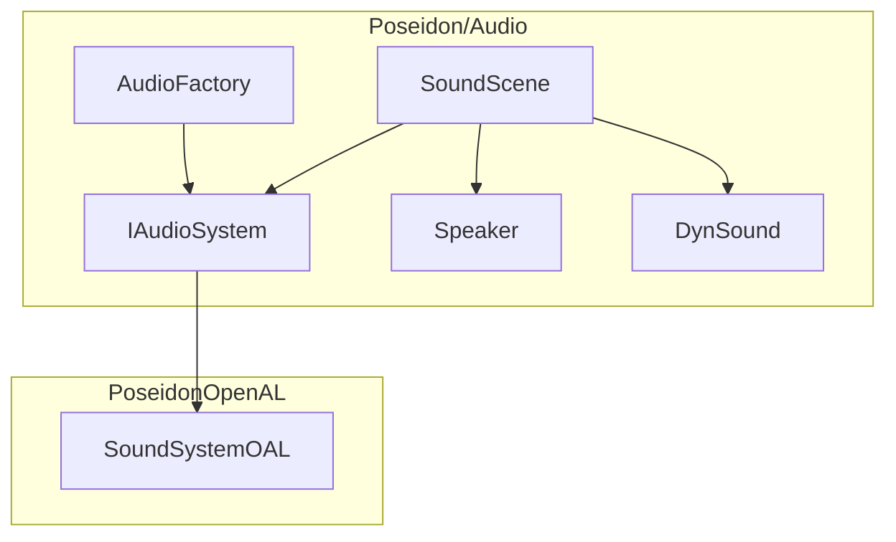
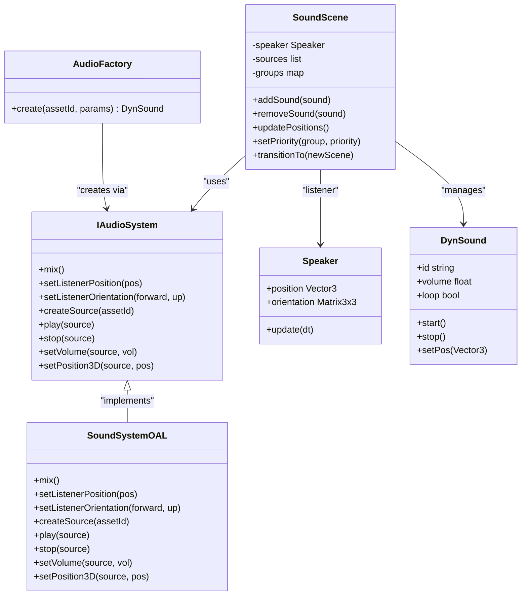
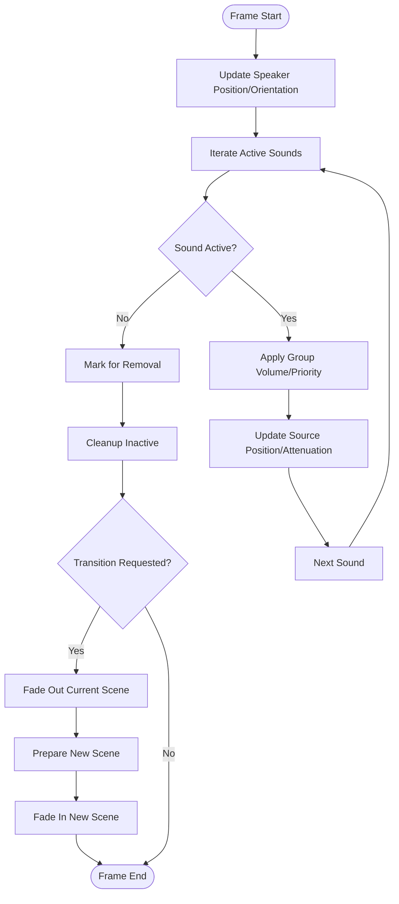
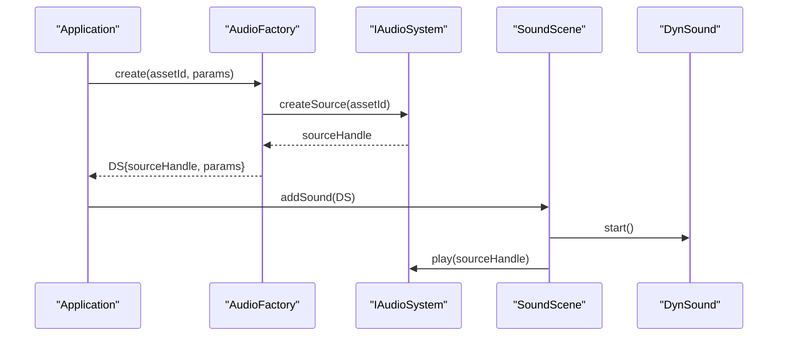
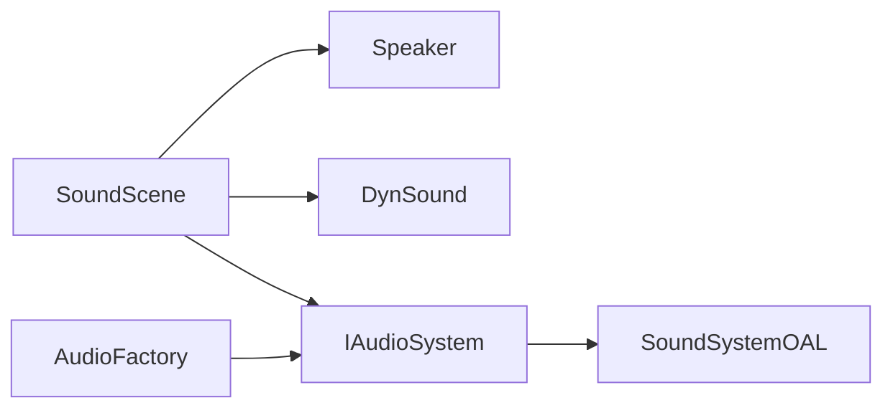

# Sound Scene Management

<cite>
**Referenced Files in This Document**
- [SoundScene.hpp](file://engine/Poseidon/Audio/SoundScene.hpp)
- [SoundScene.cpp](file://engine/Poseidon/Audio/SoundScene.cpp)
- [AudioFactory.hpp](file://engine/Poseidon/Audio/AudioFactory.hpp)
- [AudioFactory.cpp](file://engine/Poseidon/Audio/AudioFactory.cpp)
- [IAudioSystem.hpp](file://engine/Poseidon/Audio/IAudioSystem.hpp)
- [Speaker.hpp](file://engine/Poseidon/Audio/Speaker.hpp)
- [Speaker.cpp](file://engine/Poseidon/Audio/Speaker.cpp)
- [DynSound.hpp](file://engine/Poseidon/Audio/DynSound.hpp)
- [DynSound.cpp](file://engine/Poseidon/Audio/DynSound.cpp)
- [SoundSystemOAL.hpp](file://engine/PoseidonOpenAL/SoundSystemOAL.hpp)
- [SoundSystemOAL.cpp](file://engine/PoseidonOpenAL/SoundSystemOAL.cpp)
</cite>

## Table of Contents
1. [Introduction](#introduction)
2. [Project Structure](#project-structure)
3. [Core Components](#core-components)
4. [Architecture Overview](#architecture-overview)
5. [Detailed Component Analysis](#detailed-component-analysis)
6. [Dependency Analysis](#dependency-analysis)
7. [Performance Considerations](#performance-considerations)
8. [Troubleshooting Guide](#troubleshooting-guide)
9. [Conclusion](#conclusion)
10. [Appendices](#appendices)

## Introduction
This document explains sound scene management in the CWR-CE audio system with a focus on organizing and controlling audio objects, creating instances via AudioFactory, managing scene hierarchies, handling transitions, and configuring spatial audio. It provides practical guidance for building complex scenes with multiple sources, prioritizing audio, and optimizing performance through proper organization.

## Project Structure
The audio subsystem is split between Poseidon (engine core) and PoseidonOpenAL (OpenAL backend). The key files for scene management are:
- Poseidon/Audio: high-level scene and factory abstractions
- PoseidonOpenAL: OpenAL-based implementation of the audio system

**Diagram sources**
- [SoundScene.hpp](file://engine/Poseidon/Audio/SoundScene.hpp)
- [AudioFactory.hpp](file://engine/Poseidon/Audio/AudioFactory.hpp)
- [IAudioSystem.hpp](file://engine/Poseidon/Audio/IAudioSystem.hpp)
- [Speaker.hpp](file://engine/Poseidon/Audio/Speaker.hpp)
- [DynSound.hpp](file://engine/Poseidon/Audio/DynSound.hpp)
- [SoundSystemOAL.hpp](file://engine/PoseidonOpenAL/SoundSystemOAL.hpp)

**Section sources**
- [SoundScene.hpp](file://engine/Poseidon/Audio/SoundScene.hpp)
- [AudioFactory.hpp](file://engine/Poseidon/Audio/AudioFactory.hpp)
- [IAudioSystem.hpp](file://engine/Poseidon/Audio/IAudioSystem.hpp)
- [Speaker.hpp](file://engine/Poseidon/Audio/Speaker.hpp)
- [DynSound.hpp](file://engine/Poseidon/Audio/DynSound.hpp)
- [SoundSystemOAL.hpp](file://engine/PoseidonOpenAL/SoundSystemOAL.hpp)

## Core Components
- SoundScene: manages a collection of audio objects, groups, priorities, and lifecycle operations; exposes methods to add/remove sounds, update positions, and orchestrate transitions.
- AudioFactory: creates concrete audio instances (e.g., DynSound) based on configuration or asset identifiers.
- IAudioSystem: abstracts the underlying audio backend; SoundScene and AudioFactory interact through this interface.
- Speaker: represents listener state and positioning; used by SoundScene to compute spatial effects.
- DynSound: lightweight runtime sound object that wraps playback state and properties.
- SoundSystemOAL: OpenAL implementation of IAudioSystem providing mixing, effects, and 3D audio.

Key responsibilities:
- Scene organization: grouping, hierarchy, and scoping of audio objects.
- Lifecycle: creation, activation, deactivation, and cleanup.
- Spatialization: listener position/orientation and source positioning.
- Prioritization: volume, priority, and ducking strategies.
- Transitions: fade-in/out, crossfades, and scene swaps.

**Section sources**
- [SoundScene.hpp](file://engine/Poseidon/Audio/SoundScene.hpp)
- [AudioFactory.hpp](file://engine/Poseidon/Audio/AudioFactory.hpp)
- [IAudioSystem.hpp](file://engine/Poseidon/Audio/IAudioSystem.hpp)
- [Speaker.hpp](file://engine/Poseidon/Audio/Speaker.hpp)
- [DynSound.hpp](file://engine/Poseidon/Audio/DynSound.hpp)
- [SoundSystemOAL.hpp](file://engine/PoseidonOpenAL/SoundSystemOAL.hpp)

## Architecture Overview
The scene layer sits above the backend abstraction. Scenes use the factory to create sounds and delegate low-level mixing and 3D audio to the backend via IAudioSystem.

**Diagram sources**
- [IAudioSystem.hpp](file://engine/Poseidon/Audio/IAudioSystem.hpp)
- [SoundScene.hpp](file://engine/Poseidon/Audio/SoundScene.hpp)
- [AudioFactory.hpp](file://engine/Poseidon/Audio/AudioFactory.hpp)
- [Speaker.hpp](file://engine/Poseidon/Audio/Speaker.hpp)
- [DynSound.hpp](file://engine/Poseidon/Audio/DynSound.hpp)
- [SoundSystemOAL.hpp](file://engine/PoseidonOpenAL/SoundSystemOAL.hpp)

## Detailed Component Analysis

### SoundScene
Responsibilities:
- Maintain a list of active sounds and grouped collections.
- Provide APIs to add/remove sounds, update positions, set group volumes/priorities, and perform scene transitions.
- Coordinate with Speaker for listener updates and with IAudioSystem for backend operations.

Typical workflow:
- Add sounds to the scene via factory-created instances.
- Update speaker position each frame to reflect listener movement.
- Apply per-group volume and priority rules before mixing.
- On transition, fade out current scene and fade in new scene.

**Diagram sources**
- [SoundScene.cpp](file://engine/Poseidon/Audio/SoundScene.cpp)
- [Speaker.hpp](file://engine/Poseidon/Audio/Speaker.hpp)

**Section sources**
- [SoundScene.hpp](file://engine/Poseidon/Audio/SoundScene.hpp)
- [SoundScene.cpp](file://engine/Poseidon/Audio/SoundScene.cpp)

### AudioFactory
Responsibilities:
- Create DynSound instances from asset identifiers and parameters.
- Optionally configure initial playback state (loop, volume, pitch).
- Integrate with IAudioSystem to bind created sounds to backend resources.

Usage pattern:
- Call create(assetId, params) to obtain a DynSound ready for scene insertion.
- Use returned instance to attach to a SoundScene and control playback.

**Diagram sources**
- [AudioFactory.hpp](file://engine/Poseidon/Audio/AudioFactory.hpp)
- [IAudioSystem.hpp](file://engine/Poseidon/Audio/IAudioSystem.hpp)
- [DynSound.hpp](file://engine/Poseidon/Audio/DynSound.hpp)

**Section sources**
- [AudioFactory.hpp](file://engine/Poseidon/Audio/AudioFactory.hpp)
- [AudioFactory.cpp](file://engine/Poseidon/Audio/AudioFactory.cpp)

### Speaker (Listener)
Responsibilities:
- Track listener position and orientation.
- Provide transform data to SoundScene for spatial calculations.
- Update per-frame based on camera or player movement.

Spatial setup:
- Set listener position and forward/up vectors each frame.
- Ensure consistent coordinate conventions with scene sources.

**Section sources**
- [Speaker.hpp](file://engine/Poseidon/Audio/Speaker.hpp)
- [Speaker.cpp](file://engine/Poseidon/Audio/Speaker.cpp)

### DynSound
Responsibilities:
- Represent a single playable sound instance.
- Expose methods to start/stop, adjust volume, loop, and set 3D position.
- Hold metadata such as asset ID and playback flags.

Lifecycle:
- Created via AudioFactory.
- Added to SoundScene for management.
- Removed when finished or explicitly stopped.

**Section sources**
- [DynSound.hpp](file://engine/Poseidon/Audio/DynSound.hpp)
- [DynSound.cpp](file://engine/Poseidon/Audio/DynSound.cpp)

### IAudioSystem and SoundSystemOAL
IAudioSystem defines the contract for mixing, listener control, source creation, and 3D positioning. SoundSystemOAL implements this using OpenAL, enabling spatial audio and effects.

Key interactions:
- SoundScene calls IAudioSystem to play/stop sources and set listener transforms.
- AudioFactory uses IAudioSystem to create backend-specific sources.

**Section sources**
- [IAudioSystem.hpp](file://engine/Poseidon/Audio/IAudioSystem.hpp)
- [SoundSystemOAL.hpp](file://engine/PoseidonOpenAL/SoundSystemOAL.hpp)
- [SoundSystemOAL.cpp](file://engine/PoseidonOpenAL/SoundSystemOAL.cpp)

## Dependency Analysis
High-level dependencies:
- SoundScene depends on Speaker, DynSound, and IAudioSystem.
- AudioFactory depends on IAudioSystem to create backend sources.
- IAudioSystem is implemented by SoundSystemOAL.

**Diagram sources**
- [SoundScene.hpp](file://engine/Poseidon/Audio/SoundScene.hpp)
- [AudioFactory.hpp](file://engine/Poseidon/Audio/AudioFactory.hpp)
- [IAudioSystem.hpp](file://engine/Poseidon/Audio/IAudioSystem.hpp)
- [Speaker.hpp](file://engine/Poseidon/Audio/Speaker.hpp)
- [DynSound.hpp](file://engine/Poseidon/Audio/DynSound.hpp)
- [SoundSystemOAL.hpp](file://engine/PoseidonOpenAL/SoundSystemOAL.hpp)

**Section sources**
- [SoundScene.hpp](file://engine/Poseidon/Audio/SoundScene.hpp)
- [AudioFactory.hpp](file://engine/Poseidon/Audio/AudioFactory.hpp)
- [IAudioSystem.hpp](file://engine/Poseidon/Audio/IAudioSystem.hpp)
- [Speaker.hpp](file://engine/Poseidon/Audio/Speaker.hpp)
- [DynSound.hpp](file://engine/Poseidon/Audio/DynSound.hpp)
- [SoundSystemOAL.hpp](file://engine/PoseidonOpenAL/SoundSystemOAL.hpp)

## Performance Considerations
- Grouping: Organize sounds into logical groups (ambient, UI, gameplay) to apply batch volume/priority changes efficiently.
- Prioritization: Assign higher priority to critical cues; implement ducking or muting for lower-priority groups under load.
- Spatial updates: Throttle 3D position updates for distant or static sources to reduce CPU overhead.
- Resource reuse: Reuse DynSound instances where possible to minimize allocations.
- Scene transitions: Use fades and crossfades to avoid abrupt stops/starts that can cause pops or spikes in CPU usage.
- Backend tuning: Adjust buffer sizes and thread settings in SoundSystemOAL for target platforms.

[No sources needed since this section provides general guidance]

## Troubleshooting Guide
Common issues and resolutions:
- No sound output: Verify IAudioSystem is initialized and SoundSystemOAL is active; ensure sources are created and played.
- Listener not affecting spatial audio: Confirm Speaker position/orientation updates every frame and coordinate conventions match source positions.
- Audio clipping or distortion: Check global and per-group volumes; ensure dynamic range is managed and peaks are avoided.
- Stuttering during transitions: Implement smooth fades; avoid simultaneous heavy operations like loading assets mid-transition.
- Memory leaks: Ensure all added DynSound instances are removed when no longer needed; validate lifecycle hooks.

**Section sources**
- [SoundScene.cpp](file://engine/Poseidon/Audio/SoundScene.cpp)
- [SoundSystemOAL.cpp](file://engine/PoseidonOpenAL/SoundSystemOAL.cpp)

## Conclusion
SoundScene, AudioFactory, and the IAudioSystem abstraction provide a robust foundation for managing complex audio scenes in CWR-CE. By organizing sounds into groups, applying priorities, updating listener state, and leveraging the OpenAL backend, developers can build immersive, performant audio experiences. Proper scene transitions and careful resource management further enhance stability and quality.

[No sources needed since this section summarizes without analyzing specific files]

## Appendices

### Creating Complex Audio Scenes
- Define groups for ambient, gameplay, UI, and voice.
- Instantiate sounds via AudioFactory and add them to SoundScene.
- Update Speaker each frame; set source positions relative to world coordinates.
- Apply group-level volume and priority rules before mixing.
- On level change, trigger transitionTo with fade durations and callbacks.

[No sources needed since this section provides general guidance]

### Managing Audio Priorities
- Assign numeric priorities per group or per sound.
- Implement a mixer policy that mutes or reduces volume for lower-priority sounds when thresholds are exceeded.
- Monitor peak counts and dynamically adjust limits.

[No sources needed since this section provides general guidance]

### Spatial Audio Setup
- Configure listener position and orientation consistently with world space.
- Set source positions and velocities for Doppler effects if supported.
- Use attenuation curves appropriate for environment size.

[No sources needed since this section provides general guidance]