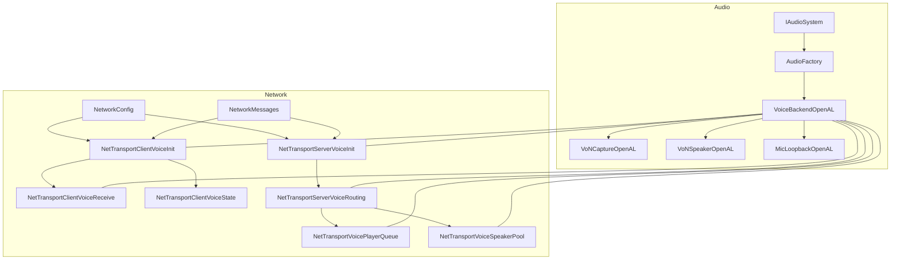
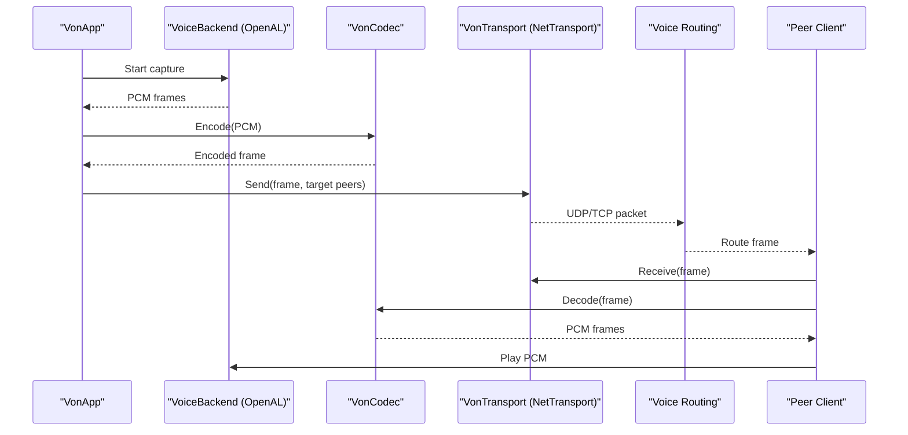
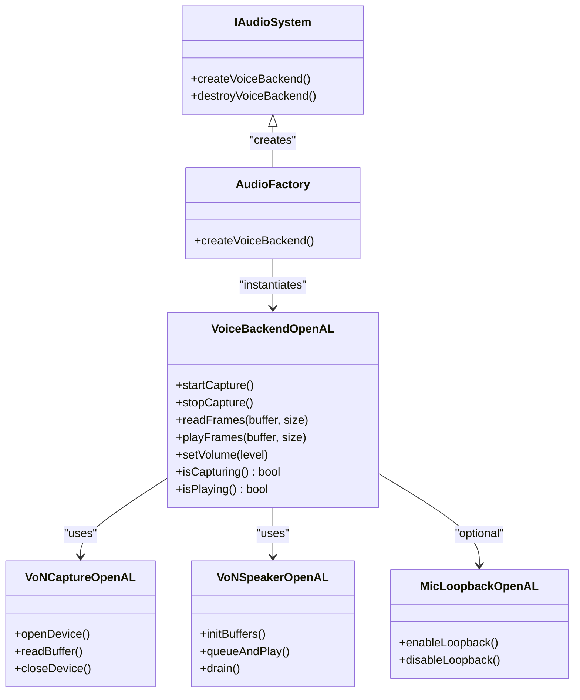
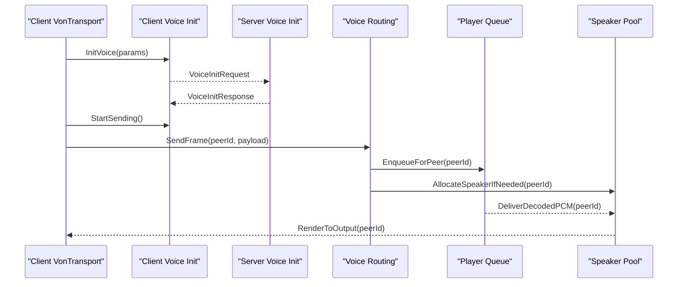
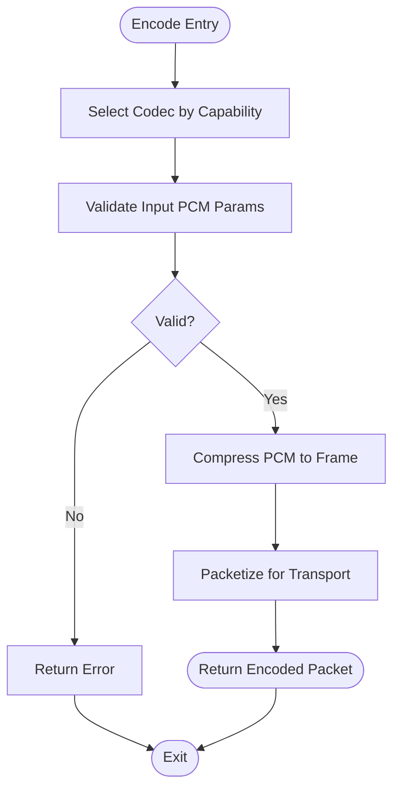
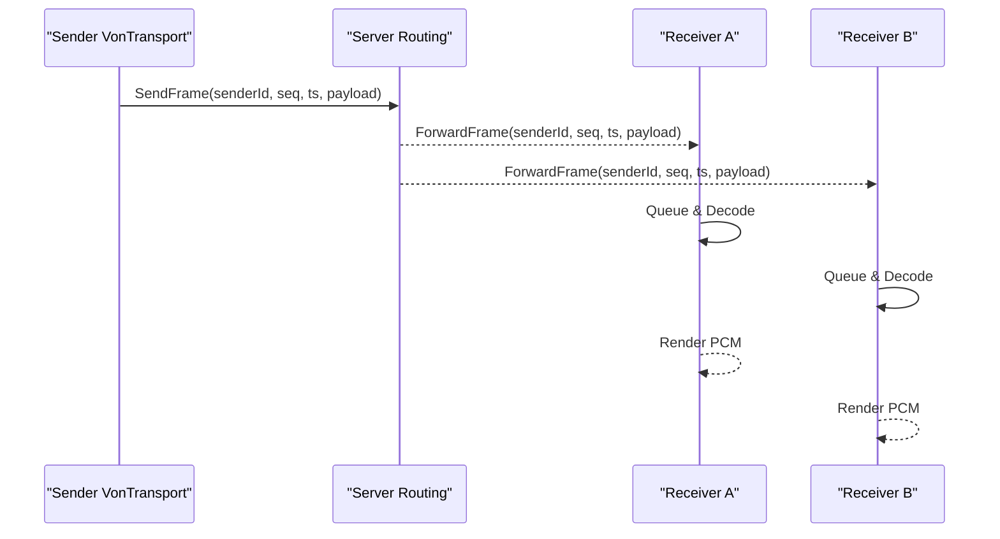
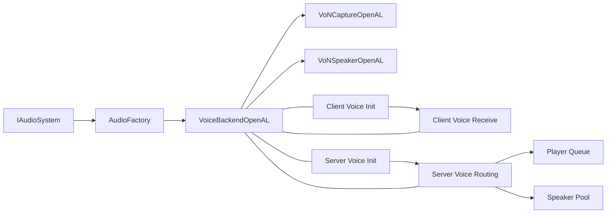

# Voice Communication API

<cite>
**Referenced Files in This Document**
- [VoiceBackendOpenAL.cpp](file://engine/Poseidon/OpenAL/Voice/VoiceBackendOpenAL.cpp)
- [VoNCaptureOpenAL.hpp](file://engine/Poseidon/OpenAL/Voice/VoNCaptureOpenAL.hpp)
- [VoNSpeakerOpenAL.hpp](file://engine/Poseidon/OpenAL/Voice/VoNSpeakerOpenAL.hpp)
- [MicLoopbackOpenAL.hpp](file://engine/Poseidon/OpenAL/Voice/MicLoopbackOpenAL.hpp)
- [NetTransportClientVoiceInit.hpp](file://engine/Poseidon/Network/NetTransportClientVoiceInit.hpp)
- [NetTransportClientVoiceReceive.hpp](file://engine/Poseidon/Network/NetTransportClientVoiceReceive.hpp)
- [NetTransportClientVoiceState.hpp](file://engine/Poseidon/Network/NetTransportClientVoiceState.hpp)
- [NetTransportServerVoiceInit.hpp](file://engine/Poseidon/Network/NetTransportServerVoiceInit.hpp)
- [NetTransportServerVoiceRouting.hpp](file://engine/Poseidon/Network/NetTransportServerVoiceRouting.hpp)
- [NetTransportVoicePlayerQueue.hpp](file://engine/Poseidon/Network/NetTransportVoicePlayerQueue.hpp)
- [NetTransportVoiceSpeakerPool.hpp](file://engine/Poseidon/Network/NetTransportVoiceSpeakerPool.hpp)
- [NetworkConfig.hpp](file://engine/Poseidon/Network/NetworkConfig.hpp)
- [NetworkMessages.hpp](file://engine/Poseidon/Network/NetworkMessages.hpp)
- [AudioFactory.hpp](file://engine/Poseidon/Audio/AudioFactory.hpp)
- [IAudioSystem.hpp](file://engine/Poseidon/Audio/IAudioSystem.hpp)
</cite>

## Table of Contents
1. [Introduction](#introduction)
2. [Project Structure](#project-structure)
3. [Core Components](#core-components)
4. [Architecture Overview](#architecture-overview)
5. [Detailed Component Analysis](#detailed-component-analysis)
6. [Dependency Analysis](#dependency-analysis)
7. [Performance Considerations](#performance-considerations)
8. [Troubleshooting Guide](#troubleshooting-guide)
9. [Conclusion](#conclusion)

## Introduction
This document provides detailed API documentation for the voice communication subsystem in CWR-CE. It focuses on:
- The VoiceBackend interface for capturing microphone input and playing back remote audio
- VoIP application logic (VonApp), network transport (VonTransport), and audio codecs (VonCodec)
- Microphone input handling, voice packet transmission, codec selection, and network optimization
- Practical guidance for implementing custom codecs, configuring voice quality, and handling connectivity issues
- Latency optimization, bandwidth management, and multi-party voice chat scenarios

The content is derived from the engine’s Audio and Network modules, including OpenAL-based voice backend implementations and NetTransport voice messaging.

## Project Structure
The voice system spans two primary areas:
- Audio subsystem: IAudioSystem abstraction and OpenAL-backed VoiceBackend implementation
- Network subsystem: NetTransport voice messages, client/server voice state, routing, speaker pool, and player queues

**Diagram sources**
- [IAudioSystem.hpp](file://engine/Poseidon/Audio/IAudioSystem.hpp)
- [AudioFactory.hpp](file://engine/Poseidon/Audio/AudioFactory.hpp)
- [VoiceBackendOpenAL.cpp](file://engine/Poseidon/OpenAL/Voice/VoiceBackendOpenAL.cpp)
- [VoNCaptureOpenAL.hpp](file://engine/Poseidon/OpenAL/Voice/VoNCaptureOpenAL.hpp)
- [VoNSpeakerOpenAL.hpp](file://engine/Poseidon/OpenAL/Voice/VoNSpeakerOpenAL.hpp)
- [MicLoopbackOpenAL.hpp](file://engine/Poseidon/OpenAL/Voice/MicLoopbackOpenAL.hpp)
- [NetTransportClientVoiceInit.hpp](file://engine/Poseidon/Network/NetTransportClientVoiceInit.hpp)
- [NetTransportClientVoiceReceive.hpp](file://engine/Poseidon/Network/NetTransportClientVoiceReceive.hpp)
- [NetTransportClientVoiceState.hpp](file://engine/Poseidon/Network/NetTransportClientVoiceState.hpp)
- [NetTransportServerVoiceInit.hpp](file://engine/Poseidon/Network/NetTransportServerVoiceInit.hpp)
- [NetTransportServerVoiceRouting.hpp](file://engine/Poseidon/Network/NetTransportServerVoiceRouting.hpp)
- [NetTransportVoicePlayerQueue.hpp](file://engine/Poseidon/Network/NetTransportVoicePlayerQueue.hpp)
- [NetTransportVoiceSpeakerPool.hpp](file://engine/Poseidon/Network/NetTransportVoiceSpeakerPool.hpp)
- [NetworkConfig.hpp](file://engine/Poseidon/Network/NetworkConfig.hpp)
- [NetworkMessages.hpp](file://engine/Poseidon/Network/NetworkMessages.hpp)

**Section sources**
- [IAudioSystem.hpp](file://engine/Poseidon/Audio/IAudioSystem.hpp)
- [AudioFactory.hpp](file://engine/Poseidon/Audio/AudioFactory.hpp)
- [VoiceBackendOpenAL.cpp](file://engine/Poseidon/OpenAL/Voice/VoiceBackendOpenAL.cpp)
- [NetTransportClientVoiceInit.hpp](file://engine/Poseidon/Network/NetTransportClientVoiceInit.hpp)
- [NetTransportServerVoiceRouting.hpp](file://engine/Poseidon/Network/NetTransportServerVoiceRouting.hpp)

## Core Components
- VoiceBackend: Abstraction for capture and playback used by the VoIP stack. Implemented via OpenAL to access microphone input and render audio.
- VonApp: Application-level VoIP logic that coordinates capture, encoding, sending, receiving, decoding, and rendering.
- VonTransport: Network transport layer for voice packets over NetTransport, including client/server initialization and routing.
- VonCodec: Audio encoder/decoder abstraction; allows pluggable codecs with configurable quality and bitrate.

Key responsibilities:
- Capture: Read PCM frames from the microphone using the OpenAL capture implementation.
- Encode: Transform PCM into compressed frames suitable for network transmission.
- Transmit: Send encoded frames over NetTransport with appropriate reliability and ordering policies.
- Receive: Accept incoming frames, reorder if needed, and decode to PCM.
- Render: Play decoded PCM through speakers or loopback paths.

**Section sources**
- [VoiceBackendOpenAL.cpp](file://engine/Poseidon/OpenAL/Voice/VoiceBackendOpenAL.cpp)
- [VoNCaptureOpenAL.hpp](file://engine/Poseidon/OpenAL/Voice/VoNCaptureOpenAL.hpp)
- [VoNSpeakerOpenAL.hpp](file://engine/Poseidon/OpenAL/Voice/VoNSpeakerOpenAL.hpp)
- [NetTransportClientVoiceInit.hpp](file://engine/Poseidon/Network/NetTransportClientVoiceInit.hpp)
- [NetTransportServerVoiceRouting.hpp](file://engine/Poseidon/Network/NetTransportServerVoiceRouting.hpp)

## Architecture Overview
The voice pipeline integrates audio capture/rendition with network transport and codec processing.

**Diagram sources**
- [VoiceBackendOpenAL.cpp](file://engine/Poseidon/OpenAL/Voice/VoiceBackendOpenAL.cpp)
- [NetTransportClientVoiceInit.hpp](file://engine/Poseidon/Network/NetTransportClientVoiceInit.hpp)
- [NetTransportServerVoiceRouting.hpp](file://engine/Poseidon/Network/NetTransportServerVoiceRouting.hpp)

## Detailed Component Analysis

### VoiceBackend Interface and OpenAL Implementation
- Purpose: Provide a unified interface for capture and playback across platforms.
- OpenAL implementation: Uses OpenAL capture for microphone input and OpenAL buffers/sources for playback.
- Key behaviors:
  - Initialize capture device and buffer ring for low-latency streaming
  - Manage playback buffers and scheduling for smooth audio output
  - Handle device availability changes and errors gracefully

**Diagram sources**
- [IAudioSystem.hpp](file://engine/Poseidon/Audio/IAudioSystem.hpp)
- [AudioFactory.hpp](file://engine/Poseidon/Audio/AudioFactory.hpp)
- [VoiceBackendOpenAL.cpp](file://engine/Poseidon/OpenAL/Voice/VoiceBackendOpenAL.cpp)
- [VoNCaptureOpenAL.hpp](file://engine/Poseidon/OpenAL/Voice/VoNCaptureOpenAL.hpp)
- [VoNSpeakerOpenAL.hpp](file://engine/Poseidon/OpenAL/Voice/VoNSpeakerOpenAL.hpp)
- [MicLoopbackOpenAL.hpp](file://engine/Poseidon/OpenAL/Voice/MicLoopbackOpenAL.hpp)

**Section sources**
- [VoiceBackendOpenAL.cpp](file://engine/Poseidon/OpenAL/Voice/VoiceBackendOpenAL.cpp)
- [VoNCaptureOpenAL.hpp](file://engine/Poseidon/OpenAL/Voice/VoNCaptureOpenAL.hpp)
- [VoNSpeakerOpenAL.hpp](file://engine/Poseidon/OpenAL/Voice/VoNSpeakerOpenAL.hpp)
- [MicLoopbackOpenAL.hpp](file://engine/Poseidon/OpenAL/Voice/MicLoopbackOpenAL.hpp)

### VonTransport: Client and Server Voice Messaging
- Client-side initialization: Establishes voice channel parameters, negotiates capabilities, and prepares send/receive pipelines.
- Server-side initialization and routing: Validates clients, assigns channels, and routes voice frames to relevant peers.
- Player queue and speaker pool: Manages per-player receive queues and dynamic speaker allocation for multiple participants.

**Diagram sources**
- [NetTransportClientVoiceInit.hpp](file://engine/Poseidon/Network/NetTransportClientVoiceInit.hpp)
- [NetTransportServerVoiceInit.hpp](file://engine/Poseidon/Network/NetTransportServerVoiceInit.hpp)
- [NetTransportServerVoiceRouting.hpp](file://engine/Poseidon/Network/NetTransportServerVoiceRouting.hpp)
- [NetTransportVoicePlayerQueue.hpp](file://engine/Poseidon/Network/NetTransportVoicePlayerQueue.hpp)
- [NetTransportVoiceSpeakerPool.hpp](file://engine/Poseidon/Network/NetTransportVoiceSpeakerPool.hpp)

**Section sources**
- [NetTransportClientVoiceInit.hpp](file://engine/Poseidon/Network/NetTransportClientVoiceInit.hpp)
- [NetTransportServerVoiceInit.hpp](file://engine/Poseidon/Network/NetTransportServerVoiceInit.hpp)
- [NetTransportServerVoiceRouting.hpp](file://engine/Poseidon/Network/NetTransportServerVoiceRouting.hpp)
- [NetTransportVoicePlayerQueue.hpp](file://engine/Poseidon/Network/NetTransportVoicePlayerQueue.hpp)
- [NetTransportVoiceSpeakerPool.hpp](file://engine/Poseidon/Network/NetTransportVoiceSpeakerPool.hpp)

### VonCodec: Audio Encoding and Decoding
- Responsibilities:
  - Convert between PCM and compressed formats
  - Support multiple codecs with runtime selection
  - Provide configuration for bitrate, latency, and quality
- Implementation patterns:
  - Factory or registry to select codec based on capability negotiation
  - Frame-based APIs with predictable memory usage
  - Error resilience and graceful degradation

**Diagram sources**
- [NetworkMessages.hpp](file://engine/Poseidon/Network/NetworkMessages.hpp)
- [NetworkConfig.hpp](file://engine/Poseidon/Network/NetworkConfig.hpp)

**Section sources**
- [NetworkMessages.hpp](file://engine/Poseidon/Network/NetworkMessages.hpp)
- [NetworkConfig.hpp](file://engine/Poseidon/Network/NetworkConfig.hpp)

### Microphone Input Handling
- Capture pipeline:
  - Open capture device and set sample rate/format
  - Continuously read frames into a circular buffer
  - Throttle and timestamp frames for jitter control
- Quality considerations:
  - Avoid excessive CPU usage by limiting buffer sizes
  - Handle device hotplug and permission errors
  - Provide mute/unmute controls at the backend level

**Section sources**
- [VoNCaptureOpenAL.hpp](file://engine/Poseidon/OpenAL/Voice/VoNCaptureOpenAL.hpp)
- [VoiceBackendOpenAL.cpp](file://engine/Poseidon/OpenAL/Voice/VoiceBackendOpenAL.cpp)

### Voice Packet Transmission and Multi-Party Chat
- Sending:
  - Packets include sender ID, sequence numbers, timestamps, and payload
  - Optional FEC or retransmission strategies can be configured
- Receiving:
  - Per-peer queues maintain order and handle late arrivals
  - Speaker pool allocates resources per active peer
- Multi-party:
  - Server routes frames to all relevant peers
  - Dynamic scaling of speaker instances as peers join/leave

**Diagram sources**
- [NetTransportServerVoiceRouting.hpp](file://engine/Poseidon/Network/NetTransportServerVoiceRouting.hpp)
- [NetTransportVoicePlayerQueue.hpp](file://engine/Poseidon/Network/NetTransportVoicePlayerQueue.hpp)
- [NetTransportVoiceSpeakerPool.hpp](file://engine/Poseidon/Network/NetTransportVoiceSpeakerPool.hpp)

**Section sources**
- [NetTransportServerVoiceRouting.hpp](file://engine/Poseidon/Network/NetTransportServerVoiceRouting.hpp)
- [NetTransportVoicePlayerQueue.hpp](file://engine/Poseidon/Network/NetTransportVoicePlayerQueue.hpp)
- [NetTransportVoiceSpeakerPool.hpp](file://engine/Poseidon/Network/NetTransportVoiceSpeakerPool.hpp)

### Implementing Custom Codecs
Steps:
- Define codec metadata: name, supported sample rates, bitrates, and features
- Implement encode/decode functions adhering to frame boundaries
- Register codec with the factory or capability negotiation mechanism
- Provide configuration options for quality and latency tuning

Guidelines:
- Keep encode/decode deterministic and bounded in time
- Ensure thread safety for concurrent use
- Handle malformed packets gracefully without crashes

**Section sources**
- [NetworkMessages.hpp](file://engine/Poseidon/Network/NetworkMessages.hpp)
- [NetworkConfig.hpp](file://engine/Poseidon/Network/NetworkConfig.hpp)

### Configuring Voice Quality Settings
Parameters typically include:
- Sample rate and channel count
- Target bitrate and maximum packet size
- Jitter buffer size and target latency
- Noise suppression and echo cancellation toggles

Configuration flow:
- Load defaults from config
- Apply user preferences
- Negotiate with peers and server
- Adjust dynamically based on network conditions

**Section sources**
- [NetworkConfig.hpp](file://engine/Poseidon/Network/NetworkConfig.hpp)
- [NetworkMessages.hpp](file://engine/Poseidon/Network/NetworkMessages.hpp)

### Handling Network Connectivity Issues
Strategies:
- Detect packet loss and adjust jitter buffer
- Implement adaptive bitrate switching
- Graceful fallback to lower-quality codecs
- Reconnect and reinitialize voice channels on disconnects

Error handling:
- Log and surface device/network errors
- Provide UI feedback for mute/unmute and connection status
- Avoid blocking operations in audio threads

**Section sources**
- [NetTransportClientVoiceState.hpp](file://engine/Poseidon/Network/NetTransportClientVoiceState.hpp)
- [NetTransportClientVoiceReceive.hpp](file://engine/Poseidon/Network/NetTransportClientVoiceReceive.hpp)

## Dependency Analysis
The voice system depends on:
- Audio abstractions for platform-independent capture/playback
- NetTransport for reliable message framing and delivery
- Configuration and messaging protocols for capability negotiation

**Diagram sources**
- [IAudioSystem.hpp](file://engine/Poseidon/Audio/IAudioSystem.hpp)
- [AudioFactory.hpp](file://engine/Poseidon/Audio/AudioFactory.hpp)
- [VoiceBackendOpenAL.cpp](file://engine/Poseidon/OpenAL/Voice/VoiceBackendOpenAL.cpp)
- [NetTransportClientVoiceInit.hpp](file://engine/Poseidon/Network/NetTransportClientVoiceInit.hpp)
- [NetTransportClientVoiceReceive.hpp](file://engine/Poseidon/Network/NetTransportClientVoiceReceive.hpp)
- [NetTransportServerVoiceInit.hpp](file://engine/Poseidon/Network/NetTransportServerVoiceInit.hpp)
- [NetTransportServerVoiceRouting.hpp](file://engine/Poseidon/Network/NetTransportServerVoiceRouting.hpp)
- [NetTransportVoicePlayerQueue.hpp](file://engine/Poseidon/Network/NetTransportVoicePlayerQueue.hpp)
- [NetTransportVoiceSpeakerPool.hpp](file://engine/Poseidon/Network/NetTransportVoiceSpeakerPool.hpp)

**Section sources**
- [IAudioSystem.hpp](file://engine/Poseidon/Audio/IAudioSystem.hpp)
- [AudioFactory.hpp](file://engine/Poseidon/Audio/AudioFactory.hpp)
- [VoiceBackendOpenAL.cpp](file://engine/Poseidon/OpenAL/Voice/VoiceBackendOpenAL.cpp)
- [NetTransportClientVoiceInit.hpp](file://engine/Poseidon/Network/NetTransportClientVoiceInit.hpp)
- [NetTransportServerVoiceRouting.hpp](file://engine/Poseidon/Network/NetTransportServerVoiceRouting.hpp)

## Performance Considerations
- Latency optimization:
  - Use small capture buffers and minimal processing overhead
  - Tune jitter buffer size to balance latency and stability
  - Avoid heavy work on audio threads; offload to worker threads
- Bandwidth management:
  - Adaptive bitrate based on measured throughput and loss
  - Prefer efficient codecs for speech (e.g., narrowband when necessary)
  - Limit simultaneous active speakers to reduce CPU and bandwidth
- Multi-party scaling:
  - Server-side routing should avoid unnecessary duplication
  - Use speaker pooling to reuse resources efficiently
  - Monitor and cap active streams per session

[No sources needed since this section provides general guidance]

## Troubleshooting Guide
Common issues and resolutions:
- No microphone input:
  - Verify device permissions and availability
  - Check capture device initialization logs
  - Test loopback path to isolate backend issues
- Choppy or delayed audio:
  - Increase jitter buffer size cautiously
  - Reduce codec complexity or bitrate
  - Inspect network metrics for packet loss or high RTT
- Connection drops:
  - Implement reconnect logic and reinitialize voice channels
  - Log handshake failures and capability mismatches
  - Fallback to lower-quality settings automatically

**Section sources**
- [NetTransportClientVoiceState.hpp](file://engine/Poseidon/Network/NetTransportClientVoiceState.hpp)
- [NetTransportClientVoiceReceive.hpp](file://engine/Poseidon/Network/NetTransportClientVoiceReceive.hpp)
- [VoiceBackendOpenAL.cpp](file://engine/Poseidon/OpenAL/Voice/VoiceBackendOpenAL.cpp)

## Conclusion
The CWR-CE voice communication system combines a robust audio backend with a flexible network transport and codec framework. By following the guidelines for capture, encoding, transmission, decoding, and playback, developers can implement high-quality, low-latency voice features. Proper configuration and adaptive strategies ensure reliable performance across varying network conditions and multi-party scenarios.

[No sources needed since this section summarizes without analyzing specific files]