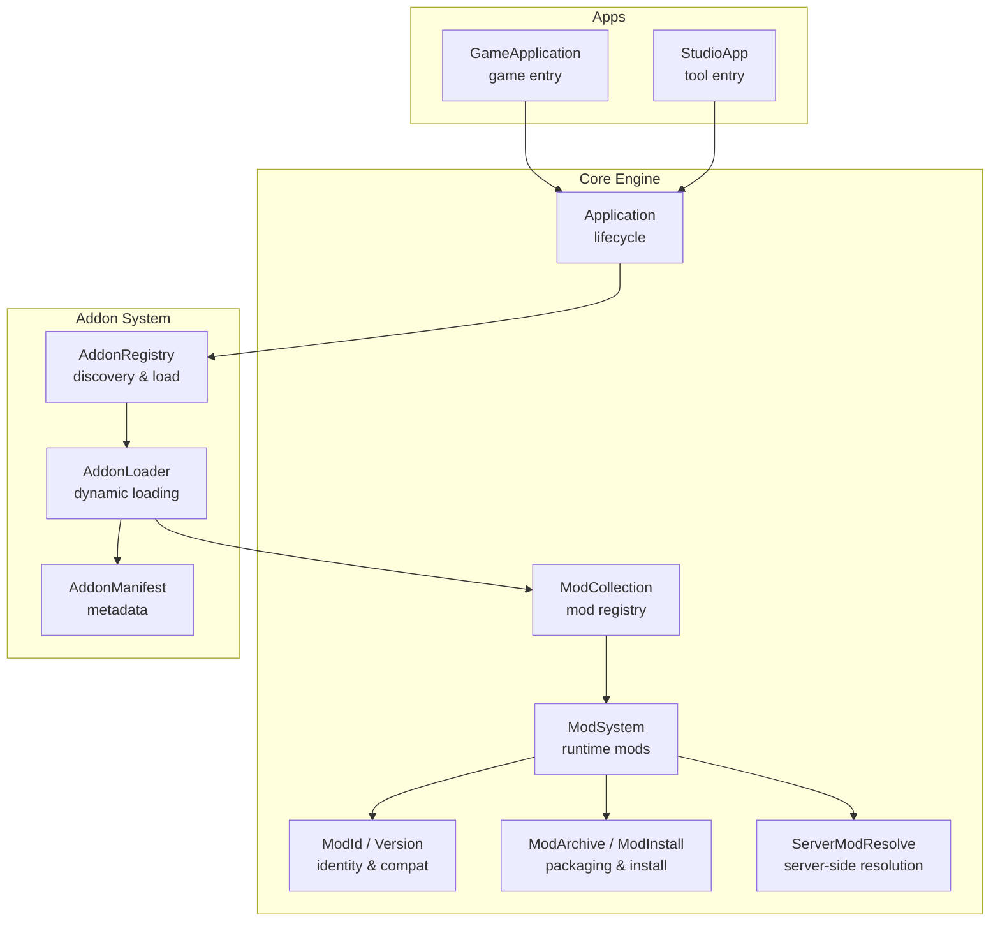
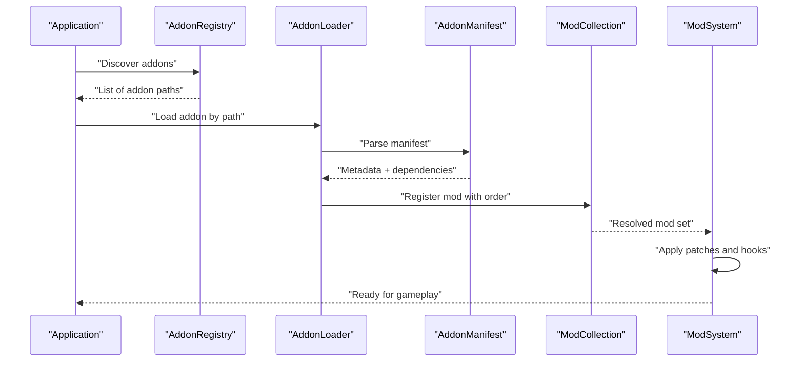
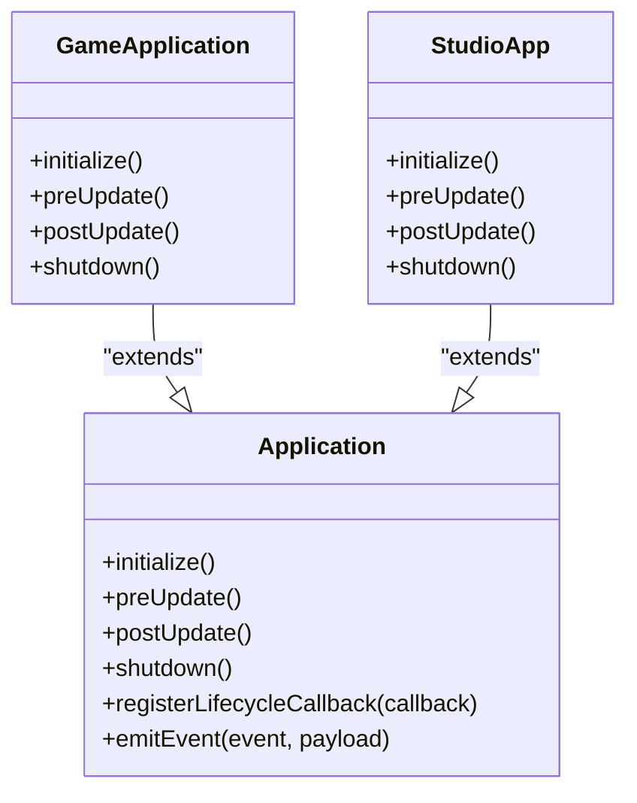
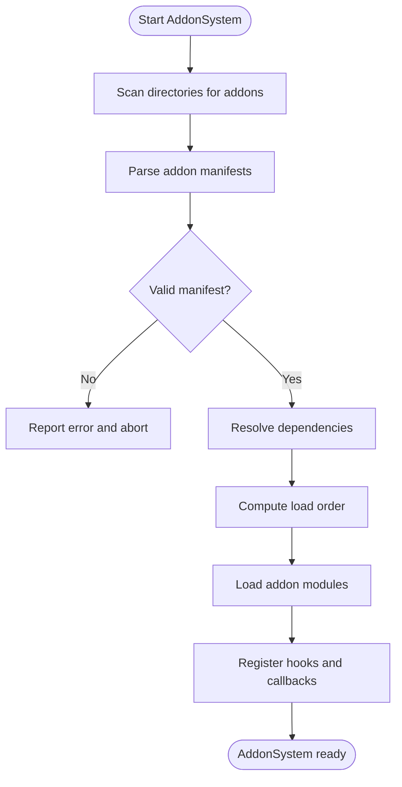
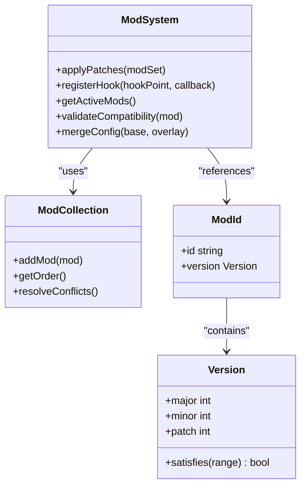
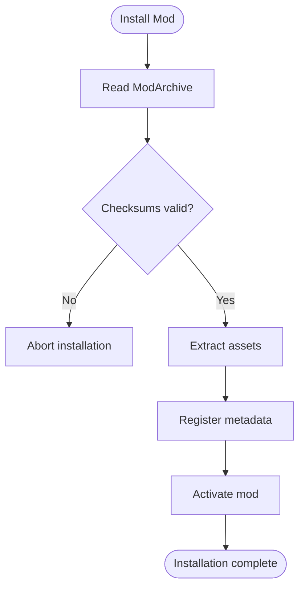
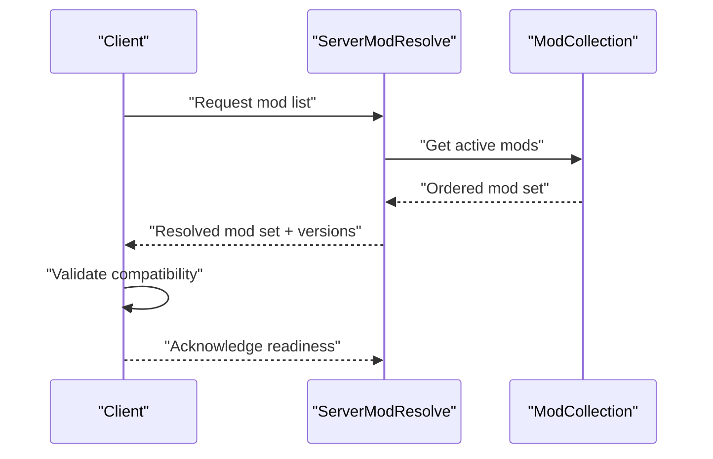
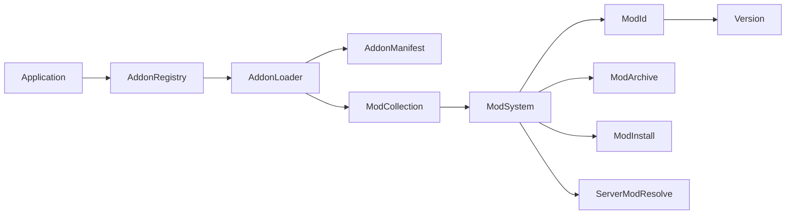

# Extension Points

<cite>
**Referenced Files in This Document**
- [ModSystem.hpp](file://engine/Poseidon/Core/ModSystem.hpp)
- [ModSystem.cpp](file://engine/Poseidon/Core/ModSystem.cpp)
- [ModCollection.hpp](file://engine/Poseidon/Core/ModCollection.hpp)
- [ModCollection.cpp](file://engine/Poseidon/Core/ModCollection.cpp)
- [ModId.hpp](file://engine/Poseidon/Core/ModId.hpp)
- [ModId.cpp](file://engine/Poseidon/Core/ModId.cpp)
- [ModInstall.hpp](file://engine/Poseidon/Core/ModInstall.hpp)
- [ModInstall.cpp](file://engine/Poseidon/Core/ModInstall.cpp)
- [ModArchive.hpp](file://engine/Poseidon/Core/ModArchive.hpp)
- [ModArchive.cpp](file://engine/Poseidon/Core/ModArchive.cpp)
- [ServerModResolve.hpp](file://engine/Poseidon/Core/ServerModResolve.hpp)
- [ServerModResolve.cpp](file://engine/Poseidon/Core/ServerModResolve.cpp)
- [Application.hpp](file://engine/Poseidon/Core/Application.hpp)
- [Application.cpp](file://engine/Poseidon/Core/Application.cpp)
- [EngineState.hpp](file://engine/Poseidon/Core/EngineState.hpp)
- [Version.hpp](file://engine/Poseidon/Core/Version.hpp)
- [Version.cpp](file://engine/Poseidon/Core/Version.cpp)
- [GameApplication.hpp](file://apps/cwr/Game/GameApplication.hpp)
- [GameApplication.cpp](file://apps/cwr/Game/GameApplication.cpp)
- [StudioApp.hpp](file://apps/tools/Studio/StudioApp.hpp)
- [StudioApp.cpp](file://apps/tools/Studio/StudioApp.cpp)
- [addons.hpp](file://engine/Poseidon/Asset/Addon/addons.hpp)
- [addon_loader.hpp](file://engine/Poseidon/Asset/Addon/addon_loader.hpp)
- [addon_manifest.hpp](file://engine/Poseidon/Asset/Addon/addon_manifest.hpp)
- [addon_registry.hpp](file://engine/Poseidon/Asset/Addon/addon_registry.hpp)
</cite>

## Table of Contents
1. [Introduction](#introduction)
2. [Project Structure](#project-structure)
3. [Core Components](#core-components)
4. [Architecture Overview](#architecture-overview)
5. [Detailed Component Analysis](#detailed-component-analysis)
6. [Dependency Analysis](#dependency-analysis)
7. [Performance Considerations](#performance-considerations)
8. [Troubleshooting Guide](#troubleshooting-guide)
9. [Conclusion](#conclusion)
10. [Appendices](#appendices)

## Introduction
This document explains the extension points and plugin architecture in CWR-CE, focusing on application lifecycle management via AppFrame, mod loading and management through AddonSystem, and runtime modifications with ModSystem. It covers callback mechanisms, event systems, hook points for extending engine functionality, addon manifest format, dependency resolution, version compatibility, best practices for extension development, testing strategies, and distribution methods. The goal is to enable developers to create addons, implement custom modules, and integrate external libraries safely and predictably.

## Project Structure
The extension system spans core engine components under engine/Poseidon/Core and asset add-on infrastructure under engine/Poseidon/Asset/Addon. Application entry points demonstrate how the engine initializes and integrates mods at startup.

**Diagram sources**
- [Application.hpp](file://engine/Poseidon/Core/Application.hpp)
- [ModSystem.hpp](file://engine/Poseidon/Core/ModSystem.hpp)
- [ModCollection.hpp](file://engine/Poseidon/Core/ModCollection.hpp)
- [ModId.hpp](file://engine/Poseidon/Core/ModId.hpp)
- [ModArchive.hpp](file://engine/Poseidon/Core/ModArchive.hpp)
- [ModInstall.hpp](file://engine/Poseidon/Core/ModInstall.hpp)
- [ServerModResolve.hpp](file://engine/Poseidon/Core/ServerModResolve.hpp)
- [addon_manifest.hpp](file://engine/Poseidon/Asset/Addon/addon_manifest.hpp)
- [addon_registry.hpp](file://engine/Poseidon/Asset/Addon/addon_registry.hpp)
- [addon_loader.hpp](file://engine/Poseidon/Asset/Addon/addon_loader.hpp)
- [GameApplication.hpp](file://apps/cwr/Game/GameApplication.hpp)
- [StudioApp.hpp](file://apps/tools/Studio/StudioApp.hpp)

**Section sources**
- [Application.hpp](file://engine/Poseidon/Core/Application.hpp)
- [ModSystem.hpp](file://engine/Poseidon/Core/ModSystem.hpp)
- [ModCollection.hpp](file://engine/Poseidon/Core/ModCollection.hpp)
- [ModId.hpp](file://engine/Poseidon/Core/ModId.hpp)
- [ModArchive.hpp](file://engine/Poseidon/Core/ModArchive.hpp)
- [ModInstall.hpp](file://engine/Poseidon/Core/ModInstall.hpp)
- [ServerModResolve.hpp](file://engine/Poseidon/Core/ServerModResolve.hpp)
- [addon_manifest.hpp](file://engine/Poseidon/Asset/Addon/addon_manifest.hpp)
- [addon_registry.hpp](file://engine/Poseidon/Asset/Addon/addon_registry.hpp)
- [addon_loader.hpp](file://engine/Poseidon/Asset/Addon/addon_loader.hpp)
- [GameApplication.hpp](file://apps/cwr/Game/GameApplication.hpp)
- [StudioApp.hpp](file://apps/tools/Studio/StudioApp.hpp)

## Core Components
- AppFrame (Application): Defines the application lifecycle hooks that extensions can override or subscribe to during initialization, update, and shutdown phases.
- AddonSystem: Discovers, validates, and loads addons dynamically. Manages addon manifests, dependencies, and lifecycle events.
- ModSystem: Provides runtime modification capabilities, including configuration overrides, content patching, and integration points for engine subsystems.
- ModCollection: Central registry for active mods, their states, and ordering constraints.
- ModId and Version: Identity and compatibility semantics for mods and addons.
- ModArchive and ModInstall: Packaging and installation utilities for mod assets and metadata.
- ServerModResolve: Ensures server-side consistency for mod sets and versions.

Key responsibilities:
- Lifecycle callbacks: Initialize, pre-update, post-update, shutdown.
- Event hooks: Asset load, config merge, network sync, UI registration.
- Dependency resolution: Topological ordering, conflict detection, version ranges.
- Runtime patching: Safe overlay of configs and data without breaking engine contracts.

**Section sources**
- [Application.hpp](file://engine/Poseidon/Core/Application.hpp)
- [ModSystem.hpp](file://engine/Poseidon/Core/ModSystem.hpp)
- [ModCollection.hpp](file://engine/Poseidon/Core/ModCollection.hpp)
- [ModId.hpp](file://engine/Poseidon/Core/ModId.hpp)
- [ModArchive.hpp](file://engine/Poseidon/Core/ModArchive.hpp)
- [ModInstall.hpp](file://engine/Poseidon/Core/ModInstall.hpp)
- [ServerModResolve.hpp](file://engine/Poseidon/Core/ServerModResolve.hpp)
- [addon_manifest.hpp](file://engine/Poseidon/Asset/Addon/addon_manifest.hpp)
- [addon_registry.hpp](file://engine/Poseidon/Asset/Addon/addon_registry.hpp)
- [addon_loader.hpp](file://engine/Poseidon/Asset/Addon/addon_loader.hpp)

## Architecture Overview
The extension architecture follows a layered design:
- Application layer exposes lifecycle hooks.
- AddonSystem discovers and loads addons based on manifests and registries.
- ModSystem applies runtime modifications using validated and ordered mod sets.
- Supporting services provide identity, packaging, and server-side validation.

**Diagram sources**
- [Application.hpp](file://engine/Poseidon/Core/Application.hpp)
- [addon_registry.hpp](file://engine/Poseidon/Asset/Addon/addon_registry.hpp)
- [addon_loader.hpp](file://engine/Poseidon/Asset/Addon/addon_loader.hpp)
- [addon_manifest.hpp](file://engine/Poseidon/Asset/Addon/addon_manifest.hpp)
- [ModCollection.hpp](file://engine/Poseidon/Core/ModCollection.hpp)
- [ModSystem.hpp](file://engine/Poseidon/Core/ModSystem.hpp)

## Detailed Component Analysis

### AppFrame (Application Lifecycle)
AppFrame defines the contract for application lifecycle management. Extensions can register callbacks for initialization, update loops, and shutdown. This ensures predictable execution order and safe teardown.

- Initialization sequence:
  - Discover addons and validate manifests.
  - Resolve dependencies and compute load order.
  - Load addons and apply runtime modifications.
- Update loop:
  - Pre-update hooks allow addons to prepare state.
  - Post-update hooks allow addons to finalize changes.
- Shutdown:
  - Reverse-order cleanup to avoid dangling references.

Best practices:
- Avoid heavy work in initialize; defer to lazy initialization where possible.
- Use event emission for decoupled communication between addons.
- Ensure idempotent callbacks to support restarts and hot-reloads.

**Diagram sources**
- [Application.hpp](file://engine/Poseidon/Core/Application.hpp)
- [GameApplication.hpp](file://apps/cwr/Game/GameApplication.hpp)
- [StudioApp.hpp](file://apps/tools/Studio/StudioApp.hpp)

**Section sources**
- [Application.hpp](file://engine/Poseidon/Core/Application.hpp)
- [Application.cpp](file://engine/Poseidon/Core/Application.cpp)
- [GameApplication.hpp](file://apps/cwr/Game/GameApplication.hpp)
- [GameApplication.cpp](file://apps/cwr/Game/GameApplication.cpp)
- [StudioApp.hpp](file://apps/tools/Studio/StudioApp.hpp)
- [StudioApp.cpp](file://apps/tools/Studio/StudioApp.cpp)

### AddonSystem (Discovery, Validation, Loading)
AddonSystem manages addon discovery, manifest parsing, dependency resolution, and dynamic loading. It ensures addons are loaded in a deterministic order and that conflicts are detected early.

Key responsibilities:
- Discovery: Scan configured directories for addon packages.
- Manifest parsing: Validate structure and required fields.
- Dependency resolution: Build a dependency graph and compute topological order.
- Dynamic loading: Instantiate addon modules and register hooks.

**Diagram sources**
- [addon_registry.hpp](file://engine/Poseidon/Asset/Addon/addon_registry.hpp)
- [addon_loader.hpp](file://engine/Poseidon/Asset/Addon/addon_loader.hpp)
- [addon_manifest.hpp](file://engine/Poseidon/Asset/Addon/addon_manifest.hpp)

**Section sources**
- [addon_registry.hpp](file://engine/Poseidon/Asset/Addon/addon_registry.hpp)
- [addon_loader.hpp](file://engine/Poseidon/Asset/Addon/addon_loader.hpp)
- [addon_manifest.hpp](file://engine/Poseidon/Asset/Addon/addon_manifest.hpp)

### ModSystem (Runtime Modifications)
ModSystem provides runtime modification capabilities, allowing addons to alter behavior and data without modifying core engine code. It supports configuration merging, asset patching, and hook registration.

Core features:
- Configuration overrides: Merge addon configs into engine defaults.
- Asset patching: Overlay or replace assets safely.
- Hook points: Intercept engine events and extend functionality.
- Version compatibility: Enforce minimum and maximum supported versions.

**Diagram sources**
- [ModSystem.hpp](file://engine/Poseidon/Core/ModSystem.hpp)
- [ModCollection.hpp](file://engine/Poseidon/Core/ModCollection.hpp)
- [ModId.hpp](file://engine/Poseidon/Core/ModId.hpp)
- [Version.hpp](file://engine/Poseidon/Core/Version.hpp)

**Section sources**
- [ModSystem.hpp](file://engine/Poseidon/Core/ModSystem.hpp)
- [ModSystem.cpp](file://engine/Poseidon/Core/ModSystem.cpp)
- [ModCollection.hpp](file://engine/Poseidon/Core/ModCollection.hpp)
- [ModCollection.cpp](file://engine/Poseidon/Core/ModCollection.cpp)
- [ModId.hpp](file://engine/Poseidon/Core/ModId.hpp)
- [ModId.cpp](file://engine/Poseidon/Core/ModId.cpp)
- [Version.hpp](file://engine/Poseidon/Core/Version.hpp)
- [Version.cpp](file://engine/Poseidon/Core/Version.cpp)

### ModPackaging and Installation
ModArchive and ModInstall handle packaging and installation of mods. They ensure consistent formats and verify integrity before activation.

- ModArchive: Reads and writes mod archives, supporting compression and indexing.
- ModInstall: Validates checksums, extracts assets, and registers metadata.

**Diagram sources**
- [ModArchive.hpp](file://engine/Poseidon/Core/ModArchive.hpp)
- [ModInstall.hpp](file://engine/Poseidon/Core/ModInstall.hpp)

**Section sources**
- [ModArchive.hpp](file://engine/Poseidon/Core/ModArchive.hpp)
- [ModArchive.cpp](file://engine/Poseidon/Core/ModArchive.cpp)
- [ModInstall.hpp](file://engine/Poseidon/Core/ModInstall.hpp)
- [ModInstall.cpp](file://engine/Poseidon/Core/ModInstall.cpp)

### Server-Side Mod Resolution
ServerModResolve ensures that all clients connect with compatible mod sets. It enforces version constraints and resolves conflicts before mission start.

**Diagram sources**
- [ServerModResolve.hpp](file://engine/Poseidon/Core/ServerModResolve.hpp)
- [ServerModResolve.cpp](file://engine/Poseidon/Core/ServerModResolve.cpp)
- [ModCollection.hpp](file://engine/Poseidon/Core/ModCollection.hpp)

**Section sources**
- [ServerModResolve.hpp](file://engine/Poseidon/Core/ServerModResolve.hpp)
- [ServerModResolve.cpp](file://engine/Poseidon/Core/ServerModResolve.cpp)

## Dependency Analysis
Dependencies between core components are structured to minimize coupling and maximize extensibility.

**Diagram sources**
- [Application.hpp](file://engine/Poseidon/Core/Application.hpp)
- [addon_registry.hpp](file://engine/Poseidon/Asset/Addon/addon_registry.hpp)
- [addon_loader.hpp](file://engine/Poseidon/Asset/Addon/addon_loader.hpp)
- [addon_manifest.hpp](file://engine/Poseidon/Asset/Addon/addon_manifest.hpp)
- [ModCollection.hpp](file://engine/Poseidon/Core/ModCollection.hpp)
- [ModSystem.hpp](file://engine/Poseidon/Core/ModSystem.hpp)
- [ModId.hpp](file://engine/Poseidon/Core/ModId.hpp)
- [Version.hpp](file://engine/Poseidon/Core/Version.hpp)
- [ModArchive.hpp](file://engine/Poseidon/Core/ModArchive.hpp)
- [ModInstall.hpp](file://engine/Poseidon/Core/ModInstall.hpp)
- [ServerModResolve.hpp](file://engine/Poseidon/Core/ServerModResolve.hpp)

**Section sources**
- [Application.hpp](file://engine/Poseidon/Core/Application.hpp)
- [addon_registry.hpp](file://engine/Poseidon/Asset/Addon/addon_registry.hpp)
- [addon_loader.hpp](file://engine/Poseidon/Asset/Addon/addon_loader.hpp)
- [addon_manifest.hpp](file://engine/Poseidon/Asset/Addon/addon_manifest.hpp)
- [ModCollection.hpp](file://engine/Poseidon/Core/ModCollection.hpp)
- [ModSystem.hpp](file://engine/Poseidon/Core/ModSystem.hpp)
- [ModId.hpp](file://engine/Poseidon/Core/ModId.hpp)
- [Version.hpp](file://engine/Poseidon/Core/Version.hpp)
- [ModArchive.hpp](file://engine/Poseidon/Core/ModArchive.hpp)
- [ModInstall.hpp](file://engine/Poseidon/Core/ModInstall.hpp)
- [ServerModResolve.hpp](file://engine/Poseidon/Core/ServerModResolve.hpp)

## Performance Considerations
- Lazy initialization: Defer expensive operations until needed to reduce startup time.
- Batched updates: Group addon updates to minimize synchronization overhead.
- Efficient manifests: Keep addon manifests minimal to speed up parsing.
- Cache resolved dependencies: Avoid recomputing dependency graphs on every launch.
- Minimize asset patching: Prefer overlays over full replacements to reduce memory usage.

[No sources needed since this section provides general guidance]

## Troubleshooting Guide
Common issues and resolutions:
- Manifest parsing errors: Validate JSON/XML structure and required fields.
- Dependency cycles: Detect and report circular dependencies during resolution.
- Version mismatches: Enforce strict version ranges and provide clear error messages.
- Hook conflicts: Ensure unique hook identifiers and provide precedence rules.
- Archive integrity failures: Recompute checksums and verify file permissions.

Debugging tips:
- Enable verbose logging for addon loading and mod resolution.
- Use unit tests to validate addon manifests and dependency graphs.
- Isolate problematic addons by disabling them one by one.

**Section sources**
- [addon_manifest.hpp](file://engine/Poseidon/Asset/Addon/addon_manifest.hpp)
- [addon_registry.hpp](file://engine/Poseidon/Asset/Addon/addon_registry.hpp)
- [ModCollection.hpp](file://engine/Poseidon/Core/ModCollection.hpp)
- [ModSystem.hpp](file://engine/Poseidon/Core/ModSystem.hpp)

## Conclusion
CWR-CE’s extension architecture provides a robust foundation for addons and runtime modifications. By leveraging AppFrame, AddonSystem, and ModSystem, developers can create modular, maintainable, and interoperable extensions. Following best practices for manifest design, dependency resolution, and performance optimization ensures a smooth experience for users and contributors alike.

[No sources needed since this section summarizes without analyzing specific files]

## Appendices

### Addon Manifest Format
- Required fields: name, version, description, dependencies.
- Optional fields: author, license, hooks, assets.
- Versioning: Semantic versioning with major.minor.patch.
- Dependencies: List of mod IDs with version ranges.

Example structure:
- name: string
- version: object with major, minor, patch
- description: string
- dependencies: array of objects with id and range

[No sources needed since this section provides general guidance]

### Creating an Addon
Steps:
1. Create addon directory with manifest file.
2. Define hooks and callbacks in addon module.
3. Package assets and metadata into archive.
4. Install and verify loading in engine.

Testing strategies:
- Unit tests for manifest validation.
- Integration tests for dependency resolution.
- End-to-end tests for addon functionality.

Distribution methods:
- Direct download links.
- Workshop integration.
- Package managers with checksum verification.

[No sources needed since this section provides general guidance]