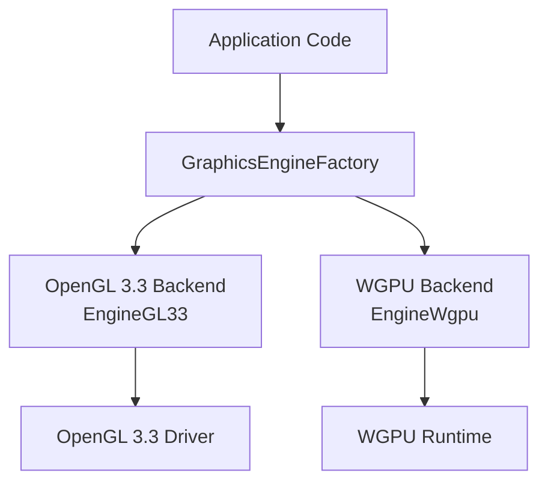
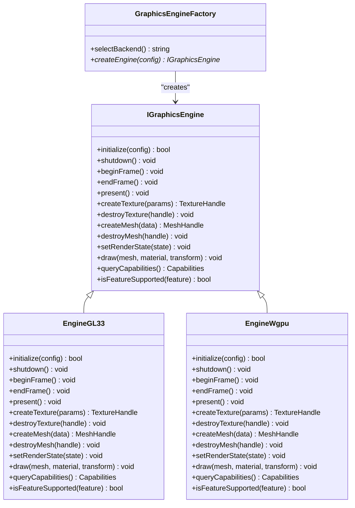
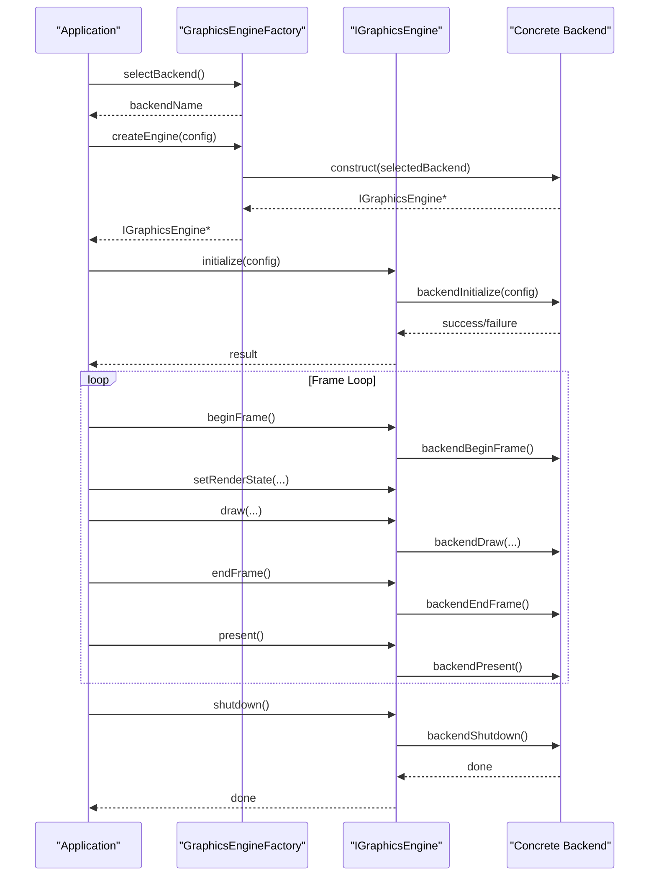
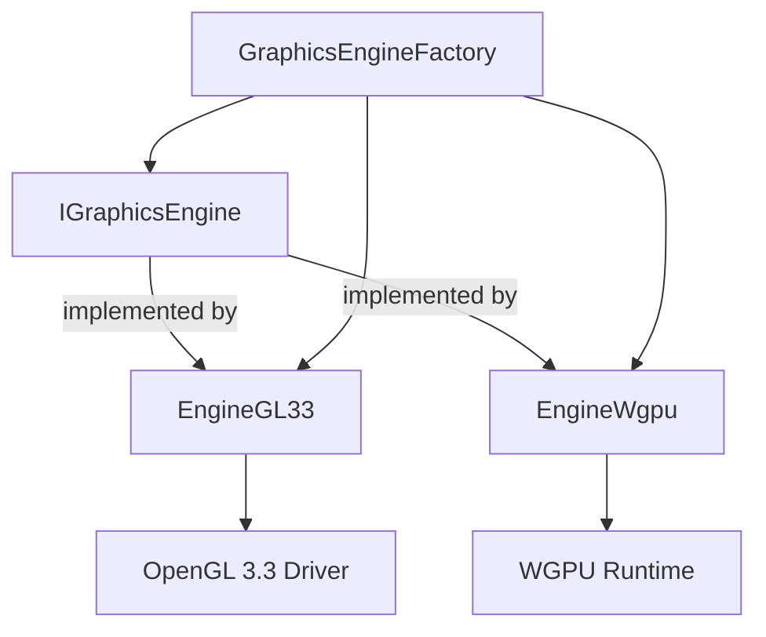

# Core Graphics Interface

<cite>
**Referenced Files in This Document**
- [IGraphicsEngine.hpp](file://engine/Poseidon/Graphics/IGraphicsEngine.hpp)
- [GraphicsEngineFactory.hpp](file://engine/Poseidon/Graphics/GraphicsEngineFactory.hpp)
- [GraphicsEngineFactory.cpp](file://engine/Poseidon/Graphics/GraphicsEngineFactory.cpp)
- [EngineGL33.hpp](file://engine/PoseidonGL33/EngineGL33.hpp)
- [EngineGL33.cpp](file://engine/PoseidonGL33/EngineGL33.cpp)
- [GraphicsBackendGL33.cpp](file://engine/PoseidonGL33/GraphicsBackendGL33.cpp)
- [EngineWgpu.hpp](file://engine/WgpuRenderer/EngineWgpu.hpp)
- [EngineWgpu.cpp](file://engine/WgpuRenderer/EngineWgpu.cpp)
- [GraphicsBackendWgpu.cpp](file://engine/WgpuRenderer/GraphicsBackendWgpu.cpp)
</cite>

## Table of Contents
1. [Introduction](#introduction)
2. [Project Structure](#project-structure)
3. [Core Components](#core-components)
4. [Architecture Overview](#architecture-overview)
5. [Detailed Component Analysis](#detailed-component-analysis)
6. [Dependency Analysis](#dependency-analysis)
7. [Performance Considerations](#performance-considerations)
8. [Troubleshooting Guide](#troubleshooting-guide)
9. [Conclusion](#conclusion)

## Introduction
This document explains the core graphics engine interface in CWR-CE, focusing on the abstract IGraphicsEngine contract, the GraphicsEngineFactory for backend selection and instantiation, and how concrete backends implement the interface. It covers initialization lifecycle, resource management, rendering pipeline control, capability querying, feature detection, configuration options, and error handling patterns. The goal is to help developers integrate with or extend the graphics subsystem without needing to understand backend-specific details.

## Project Structure
The graphics subsystem is organized around a thin abstraction layer that decouples application code from platform-specific rendering backends:
- Abstract interface: IGraphicsEngine defines the common API for all backends.
- Factory: GraphicsEngineFactory selects and constructs a suitable backend at runtime based on configuration and capabilities.
- Concrete backends: OpenGL 3.3 (PoseidonGL33) and WGPU (WgpuRenderer) implement the interface.

**Diagram sources**
- [GraphicsEngineFactory.hpp](file://engine/Poseidon/Graphics/GraphicsEngineFactory.hpp)
- [GraphicsEngineFactory.cpp](file://engine/Poseidon/Graphics/GraphicsEngineFactory.cpp)
- [EngineGL33.hpp](file://engine/PoseidonGL33/EngineGL33.hpp)
- [EngineWgpu.hpp](file://engine/WgpuRenderer/EngineWgpu.hpp)

**Section sources**
- [IGraphicsEngine.hpp](file://engine/Poseidon/Graphics/IGraphicsEngine.hpp)
- [GraphicsEngineFactory.hpp](file://engine/Poseidon/Graphics/GraphicsEngineFactory.hpp)
- [GraphicsEngineFactory.cpp](file://engine/Poseidon/Graphics/GraphicsEngineFactory.cpp)
- [EngineGL33.hpp](file://engine/PoseidonGL33/EngineGL33.hpp)
- [EngineWgpu.hpp](file://engine/WgpuRenderer/EngineWgpu.hpp)

## Core Components
- IGraphicsEngine: Abstract interface defining the engine lifecycle, resource management, rendering control, and capability queries.
- GraphicsEngineFactory: Responsible for selecting a backend based on configuration and environment, then instantiating it.
- EngineGL33: OpenGL 3.3 implementation of IGraphicsEngine.
- EngineWgpu: WGPU implementation of IGraphicsEngine.

Key responsibilities:
- Lifecycle: create, initialize, update frame, present, shutdown.
- Resource management: textures, meshes, materials, buffers.
- Rendering pipeline: state setup, draw calls, batching, shadow passes.
- Capabilities: feature detection, limits, format support.
- Configuration: resolution, multisampling, quality flags.

**Section sources**
- [IGraphicsEngine.hpp](file://engine/Poseidon/Graphics/IGraphicsEngine.hpp)
- [GraphicsEngineFactory.hpp](file://engine/Poseidon/Graphics/GraphicsEngineFactory.hpp)
- [GraphicsEngineFactory.cpp](file://engine/Poseidon/Graphics/GraphicsEngineFactory.cpp)
- [EngineGL33.hpp](file://engine/PoseidonGL33/EngineGL33.hpp)
- [EngineWgpu.hpp](file://engine/WgpuRenderer/EngineWgpu.hpp)

## Architecture Overview
The architecture follows a factory pattern with an abstract interface to isolate backend differences. Application code interacts only with IGraphicsEngine; the factory chooses between OpenGL 3.3 and WGPU based on runtime conditions.

**Diagram sources**
- [IGraphicsEngine.hpp](file://engine/Poseidon/Graphics/IGraphicsEngine.hpp)
- [EngineGL33.hpp](file://engine/PoseidonGL33/EngineGL33.hpp)
- [EngineWgpu.hpp](file://engine/WgpuRenderer/EngineWgpu.hpp)
- [GraphicsEngineFactory.hpp](file://engine/Poseidon/Graphics/GraphicsEngineFactory.hpp)

## Detailed Component Analysis

### IGraphicsEngine Abstract Interface
Responsibilities:
- Initialization lifecycle: create and destroy resources tied to the GPU device.
- Frame loop integration: begin/end frame and present operations.
- Resource management: creation/destruction of textures, meshes, and other GPU objects.
- Rendering pipeline control: state binding, draw calls, and batch submission.
- Capability querying: enumerate supported features, limits, and formats.
- Feature detection: boolean checks for optional capabilities.

Lifecycle expectations:
- initialize must succeed before any resource creation or drawing.
- beginFrame and endFrame bracket per-frame work.
- present swaps buffers or submits commands to the GPU.
- shutdown releases all resources and tears down the backend context.

Error handling:
- initialize returns failure if required features are missing or device creation fails.
- Resource methods return handles or invalid markers on failure.
- queryCapabilities and isFeatureSupported provide safe fallbacks.

**Section sources**
- [IGraphicsEngine.hpp](file://engine/Poseidon/Graphics/IGraphicsEngine.hpp)

### GraphicsEngineFactory
Responsibilities:
- Backend selection: choose OpenGL 3.3 or WGPU based on configuration, platform, and available drivers.
- Instantiation: construct the selected backend and validate its capabilities.
- Configuration propagation: pass user settings to the chosen backend.

Selection logic:
- Prefer modern backends when available (e.g., WGPU).
- Fall back to OpenGL 3.3 if WGPU is unavailable or disabled.
- Respect explicit user overrides in configuration.

Instantiation flow:
- Validate configuration.
- Attempt to create the preferred backend.
- If creation fails, try alternatives until one succeeds or report failure.

**Section sources**
- [GraphicsEngineFactory.hpp](file://engine/Poseidon/Graphics/GraphicsEngineFactory.hpp)
- [GraphicsEngineFactory.cpp](file://engine/Poseidon/Graphics/GraphicsEngineFactory.cpp)

### OpenGL 3.3 Backend (EngineGL33)
Implementation highlights:
- Uses OpenGL 3.3 APIs for texture, mesh, and shader management.
- Implements IGraphicsEngine methods with GL state caching and command buffering.
- Provides GL-specific capability queries (extensions, version, limits).

Rendering pipeline:
- State binding via cached bindings to minimize driver overhead.
- Draw calls batched where possible.
- Shadow depth passes and multi-pass rendering as needed.

Resource management:
- Texture creation from CPU images or memory.
- Mesh creation from vertex/index data.
- Proper cleanup on shutdown or explicit destroy calls.

**Section sources**
- [EngineGL33.hpp](file://engine/PoseidonGL33/EngineGL33.hpp)
- [EngineGL33.cpp](file://engine/PoseidonGL33/EngineGL33.cpp)
- [GraphicsBackendGL33.cpp](file://engine/PoseidonGL33/GraphicsBackendGL33.cpp)

### WGPU Backend (EngineWgpu)
Implementation highlights:
- Uses WGPU runtime for cross-platform GPU access.
- Implements IGraphicsEngine methods with WGPU buffers, textures, and pipelines.
- Provides WGPU-specific capability queries (device features, limits).

Rendering pipeline:
- Command encoder usage for efficient batching.
- Pipeline state objects for shaders and render passes.
- Asynchronous resource loading and staging.

Resource management:
- Textures created from CPU images or loaded asynchronously.
- Meshes built from vertex buffers and index buffers.
- Explicit destruction to free GPU memory.

**Section sources**
- [EngineWgpu.hpp](file://engine/WgpuRenderer/EngineWgpu.hpp)
- [EngineWgpu.cpp](file://engine/WgpuRenderer/EngineWgpu.cpp)
- [GraphicsBackendWgpu.cpp](file://engine/WgpuRenderer/GraphicsBackendWgpu.cpp)

### Initialization and Shutdown Sequence
Typical sequence for engine lifecycle:
- Application requests a backend via GraphicsEngineFactory.
- Factory selects and constructs the backend implementing IGraphicsEngine.
- Application initializes the engine with configuration.
- Per-frame: beginFrame, set state, draw, endFrame, present.
- On exit: shutdown to release resources.

**Diagram sources**
- [GraphicsEngineFactory.hpp](file://engine/Poseidon/Graphics/GraphicsEngineFactory.hpp)
- [GraphicsEngineFactory.cpp](file://engine/Poseidon/Graphics/GraphicsEngineFactory.cpp)
- [IGraphicsEngine.hpp](file://engine/Poseidon/Graphics/IGraphicsEngine.hpp)
- [EngineGL33.hpp](file://engine/PoseidonGL33/EngineGL33.hpp)
- [EngineWgpu.hpp](file://engine/WgpuRenderer/EngineWgpu.hpp)

**Section sources**
- [GraphicsEngineFactory.cpp](file://engine/Poseidon/Graphics/GraphicsEngineFactory.cpp)
- [IGraphicsEngine.hpp](file://engine/Poseidon/Graphics/IGraphicsEngine.hpp)

### Capability Querying and Feature Detection
Capability queries:
- queryCapabilities returns a structure describing supported features, limits, and formats.
- isFeatureSupported allows quick boolean checks for optional capabilities.

Configuration options:
- Resolution, multisampling, quality levels, and backend-specific toggles.
- Factory respects user preferences and falls back gracefully.

Example flows:
- Check if a specific texture format is supported before creating textures.
- Adjust rendering quality based on GPU limits returned by queryCapabilities.

**Section sources**
- [IGraphicsEngine.hpp](file://engine/Poseidon/Graphics/IGraphicsEngine.hpp)
- [GraphicsEngineFactory.cpp](file://engine/Poseidon/Graphics/GraphicsEngineFactory.cpp)

### Error Handling Patterns
Common errors:
- Backend selection failure due to missing drivers or incompatible versions.
- Initialization failure due to insufficient GPU memory or unsupported features.
- Resource creation failures due to invalid parameters or out-of-memory conditions.

Handling strategies:
- Return clear status codes or booleans from initialize and resource methods.
- Provide fallback configurations when features are missing.
- Log detailed diagnostics for debugging.

Best practices:
- Always check initialize results before proceeding.
- Validate inputs to resource creation methods.
- Ensure shutdown is called even on error paths to avoid leaks.

**Section sources**
- [GraphicsEngineFactory.cpp](file://engine/Poseidon/Graphics/GraphicsEngineFactory.cpp)
- [IGraphicsEngine.hpp](file://engine/Poseidon/Graphics/IGraphicsEngine.hpp)

## Dependency Analysis
The graphics subsystem has clear separation between interface, factory, and implementations:
- IGraphicsEngine depends on no concrete backend.
- GraphicsEngineFactory depends on IGraphicsEngine and concrete backends for selection/instantiation.
- Concrete backends depend on their respective APIs (OpenGL 3.3 or WGPU).

**Diagram sources**
- [IGraphicsEngine.hpp](file://engine/Poseidon/Graphics/IGraphicsEngine.hpp)
- [EngineGL33.hpp](file://engine/PoseidonGL33/EngineGL33.hpp)
- [EngineWgpu.hpp](file://engine/WgpuRenderer/EngineWgpu.hpp)
- [GraphicsEngineFactory.hpp](file://engine/Poseidon/Graphics/GraphicsEngineFactory.hpp)

**Section sources**
- [GraphicsEngineFactory.cpp](file://engine/Poseidon/Graphics/GraphicsEngineFactory.cpp)
- [IGraphicsEngine.hpp](file://engine/Poseidon/Graphics/IGraphicsEngine.hpp)

## Performance Considerations
- Minimize state changes by batching similar draw calls.
- Use appropriate texture formats and compression to reduce memory bandwidth.
- Leverage backend-specific optimizations (GL state caching, WGPU command encoding).
- Avoid frequent resource creation/destruction; reuse where possible.
- Profile GPU-bound paths and adjust quality settings based on hardware capabilities.

[No sources needed since this section provides general guidance]

## Troubleshooting Guide
Common issues and resolutions:
- Backend selection fails: verify driver availability and configuration flags.
- Initialization errors: check GPU memory, feature support, and configuration validity.
- Rendering artifacts: validate texture formats, mesh data, and shader compatibility.
- Performance regressions: profile draw calls, reduce overdraw, and optimize resource usage.

Debugging tips:
- Enable detailed logging in the factory and backend initialization.
- Use capability queries to detect unsupported features early.
- Test with minimal scenes to isolate rendering issues.

**Section sources**
- [GraphicsEngineFactory.cpp](file://engine/Poseidon/Graphics/GraphicsEngineFactory.cpp)
- [IGraphicsEngine.hpp](file://engine/Poseidon/Graphics/IGraphicsEngine.hpp)

## Conclusion
The CWR-CE graphics subsystem provides a clean abstraction through IGraphicsEngine, enabling seamless switching between OpenGL 3.3 and WGPU backends. The GraphicsEngineFactory simplifies backend selection and instantiation, while concrete implementations encapsulate platform-specific details. By following the documented lifecycle, resource management, and error handling patterns, developers can build robust applications that adapt to diverse hardware environments.

[No sources needed since this section summarizes without analyzing specific files]