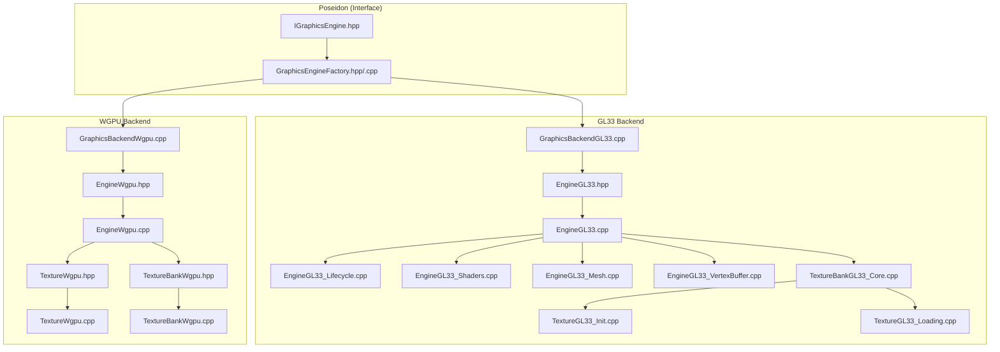
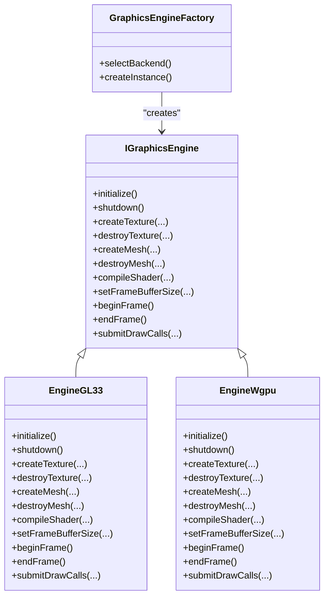
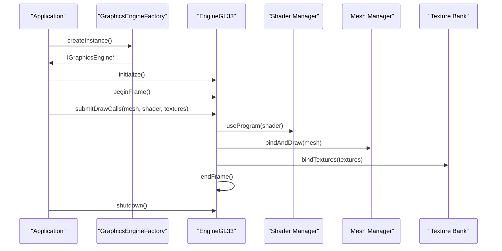
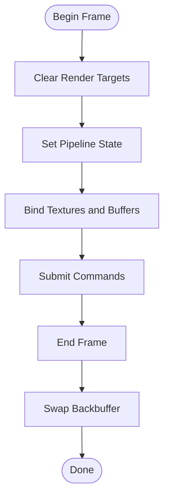
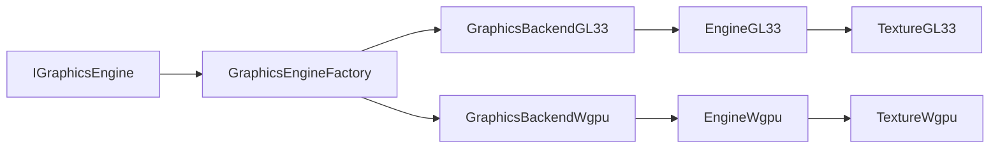

# Graphics API

<cite>
**Referenced Files in This Document**
- [IGraphicsEngine.hpp](file://engine/Poseidon/Graphics/IGraphicsEngine.hpp)
- [GraphicsEngineFactory.hpp](file://engine/Poseidon/Graphics/GraphicsEngineFactory.hpp)
- [GraphicsEngineFactory.cpp](file://engine/Poseidon/Graphics/GraphicsEngineFactory.cpp)
- [EngineGL33.hpp](file://engine/PoseidonGL33/EngineGL33.hpp)
- [EngineGL33.cpp](file://engine/PoseidonGL33/EngineGL33.cpp)
- [EngineGL33_Lifecycle.cpp](file://engine/PoseidonGL33/EngineGL33_Lifecycle.cpp)
- [EngineGL33_Shaders.cpp](file://engine/PoseidonGL33/EngineGL33_Shaders.cpp)
- [EngineGL33_Mesh.cpp](file://engine/PoseidonGL33/EngineGL33_Mesh.cpp)
- [EngineGL33_VertexBuffer.cpp](file://engine/PoseidonGL33/EngineGL33_VertexBuffer.cpp)
- [TextureBankGL33_Core.cpp](file://engine/PoseidonGL33/TextureBankGL33_Core.cpp)
- [TextureGL33_Init.cpp](file://engine/PoseidonGL33/TextureGL33_Init.cpp)
- [TextureGL33_Loading.cpp](file://engine/PoseidonGL33/TextureGL33_Loading.cpp)
- [GraphicsBackendGL33.cpp](file://engine/PoseidonGL33/GraphicsBackendGL33.cpp)
- [EngineWgpu.hpp](file://engine/WgpuRenderer/EngineWgpu.hpp)
- [EngineWgpu.cpp](file://engine/WgpuRenderer/EngineWgpu.cpp)
- [GraphicsBackendWgpu.cpp](file://engine/WgpuRenderer/GraphicsBackendWgpu.cpp)
- [TextureWgpu.hpp](file://engine/WgpuRenderer/TextureWgpu.hpp)
- [TextureWgpu.cpp](file://engine/WgpuRenderer/TextureWgpu.cpp)
- [TextureBankWgpu.hpp](file://engine/WgpuRenderer/TextureBankWgpu.hpp)
- [TextureBankWgpu.cpp](file://engine/WgpuRenderer/TextureBankWgpu.cpp)
</cite>

## Table of Contents
1. [Introduction](#introduction)
2. [Project Structure](#project-structure)
3. [Core Components](#core-components)
4. [Architecture Overview](#architecture-overview)
5. [Detailed Component Analysis](#detailed-component-analysis)
6. [Dependency Analysis](#dependency-analysis)
7. [Performance Considerations](#performance-considerations)
8. [Troubleshooting Guide](#troubleshooting-guide)
9. [Conclusion](#conclusion)

## Introduction
This document provides comprehensive API documentation for the graphics rendering interface in CWR-CE. It focuses on the IGraphicsEngine interface, its initialization and resource management semantics, and the rendering command surface exposed to higher layers. It also documents the GraphicsEngineFactory used to select and instantiate a backend at runtime, and covers texture loading, mesh rendering, shader compilation, and frame buffer operations. Reference implementations are provided by the GL33 and WGPU backends. Guidance is included for implementing custom backends, handling GPU resources, optimizing render performance, and addressing thread safety, memory management, and error handling patterns specific to graphics operations.

## Project Structure
The graphics subsystem is organized around a clear separation between the abstract interface, factory selection, and concrete backend implementations:
- Abstract interface and factory: engine/Poseidon/Graphics
- GL33 backend: engine/PoseidonGL33
- WGPU backend: engine/WgpuRenderer

**Diagram sources**
- [IGraphicsEngine.hpp](file://engine/Poseidon/Graphics/IGraphicsEngine.hpp)
- [GraphicsEngineFactory.hpp](file://engine/Poseidon/Graphics/GraphicsEngineFactory.hpp)
- [GraphicsEngineFactory.cpp](file://engine/Poseidon/Graphics/GraphicsEngineFactory.cpp)
- [EngineGL33.hpp](file://engine/PoseidonGL33/EngineGL33.hpp)
- [EngineGL33.cpp](file://engine/PoseidonGL33/EngineGL33.cpp)
- [EngineGL33_Lifecycle.cpp](file://engine/PoseidonGL33/EngineGL33_Lifecycle.cpp)
- [EngineGL33_Shaders.cpp](file://engine/PoseidonGL33/EngineGL33_Shaders.cpp)
- [EngineGL33_Mesh.cpp](file://engine/PoseidonGL33/EngineGL33_Mesh.cpp)
- [EngineGL33_VertexBuffer.cpp](file://engine/PoseidonGL33/EngineGL33_VertexBuffer.cpp)
- [TextureBankGL33_Core.cpp](file://engine/PoseidonGL33/TextureBankGL33_Core.cpp)
- [TextureGL33_Init.cpp](file://engine/PoseidonGL33/TextureGL33_Init.cpp)
- [TextureGL33_Loading.cpp](file://engine/PoseidonGL33/TextureGL33_Loading.cpp)
- [GraphicsBackendGL33.cpp](file://engine/PoseidonGL33/GraphicsBackendGL33.cpp)
- [EngineWgpu.hpp](file://engine/WgpuRenderer/EngineWgpu.hpp)
- [EngineWgpu.cpp](file://engine/WgpuRenderer/EngineWgpu.cpp)
- [GraphicsBackendWgpu.cpp](file://engine/WgpuRenderer/GraphicsBackendWgpu.cpp)
- [TextureWgpu.hpp](file://engine/WgpuRenderer/TextureWgpu.hpp)
- [TextureWgpu.cpp](file://engine/WgpuRenderer/TextureWgpu.cpp)
- [TextureBankWgpu.hpp](file://engine/WgpuRenderer/TextureBankWgpu.hpp)
- [TextureBankWgpu.cpp](file://engine/WgpuRenderer/TextureBankWgpu.cpp)

**Section sources**
- [IGraphicsEngine.hpp](file://engine/Poseidon/Graphics/IGraphicsEngine.hpp)
- [GraphicsEngineFactory.hpp](file://engine/Poseidon/Graphics/GraphicsEngineFactory.hpp)
- [GraphicsEngineFactory.cpp](file://engine/Poseidon/Graphics/GraphicsEngineFactory.cpp)
- [EngineGL33.hpp](file://engine/PoseidonGL33/EngineGL33.hpp)
- [EngineWgpu.hpp](file://engine/WgpuRenderer/EngineWgpu.hpp)

## Core Components
This section outlines the primary abstractions and their responsibilities:
- IGraphicsEngine: The core interface that exposes initialization, resource management, and rendering commands to the rest of the engine.
- GraphicsEngineFactory: Selects and instantiates a concrete backend implementation based on configuration or runtime hints.
- Backend implementations:
  - GL33: OpenGL 3.3-based implementation with dedicated modules for lifecycle, shaders, meshes, vertex buffers, and textures.
  - WGPU: WebGPU-based implementation providing modern GPU abstraction with texture and texture bank management.

Key responsibilities include:
- Initialization and device context setup
- Resource creation and destruction (textures, meshes, shaders, frame buffers)
- Rendering command submission (draw calls, state binding, pipeline setup)
- Texture loading and caching
- Frame buffer operations (clear, resolve, blit)

**Section sources**
- [IGraphicsEngine.hpp](file://engine/Poseidon/Graphics/IGraphicsEngine.hpp)
- [GraphicsEngineFactory.hpp](file://engine/Poseidon/Graphics/GraphicsEngineFactory.hpp)
- [GraphicsEngineFactory.cpp](file://engine/Poseidon/Graphics/GraphicsEngineFactory.cpp)
- [EngineGL33.hpp](file://engine/PoseidonGL33/EngineGL33.hpp)
- [EngineWgpu.hpp](file://engine/WgpuRenderer/EngineWgpu.hpp)

## Architecture Overview
The graphics architecture follows a clean separation between interface and implementation:
- Higher-level systems call into IGraphicsEngine without knowing backend specifics.
- GraphicsEngineFactory resolves the appropriate backend at startup.
- Each backend implements IGraphicsEngine and manages its own GPU resources and driver-specific details.

**Diagram sources**
- [IGraphicsEngine.hpp](file://engine/Poseidon/Graphics/IGraphicsEngine.hpp)
- [GraphicsEngineFactory.hpp](file://engine/Poseidon/Graphics/GraphicsEngineFactory.hpp)
- [EngineGL33.hpp](file://engine/PoseidonGL33/EngineGL33.hpp)
- [EngineWgpu.hpp](file://engine/WgpuRenderer/EngineWgpu.hpp)

## Detailed Component Analysis

### IGraphicsEngine Interface
The IGraphicsEngine defines the contract for all graphics backends. It includes:
- Lifecycle methods: initialize(), shutdown()
- Resource management: create/destroy for textures, meshes, and other GPU objects
- Shader compilation: compileShader()
- Frame buffer operations: setFrameBufferSize(), beginFrame(), endFrame()
- Rendering commands: submitDrawCalls() and related state binding APIs

Best practices when implementing this interface:
- Ensure thread safety for concurrent access from multiple threads if required by the engine’s threading model.
- Provide robust error handling with clear error codes or exceptions.
- Minimize state changes during draw submission to reduce driver overhead.

**Section sources**
- [IGraphicsEngine.hpp](file://engine/Poseidon/Graphics/IGraphicsEngine.hpp)

### GraphicsEngineFactory
The GraphicsEngineFactory selects and instantiates a backend implementation. Responsibilities include:
- Reading configuration or environment hints to choose a backend (e.g., GL33 vs WGPU).
- Creating the concrete IGraphicsEngine instance.
- Providing a stable entry point for the rest of the engine.

Implementation considerations:
- Centralize backend selection logic to avoid scattering platform-specific code.
- Support fallback mechanisms if preferred backend is unavailable.
- Expose minimal configuration options to keep the factory simple.

**Section sources**
- [GraphicsEngineFactory.hpp](file://engine/Poseidon/Graphics/GraphicsEngineFactory.hpp)
- [GraphicsEngineFactory.cpp](file://engine/Poseidon/Graphics/GraphicsEngineFactory.cpp)

### GL33 Backend Implementation
The GL33 backend implements IGraphicsEngine using OpenGL 3.3. Key modules:
- Lifecycle: EngineGL33_Lifecycle.cpp handles device context setup and teardown.
- Shaders: EngineGL33_Shaders.cpp manages shader compilation and linking.
- Meshes: EngineGL33_Mesh.cpp encapsulates mesh data and draw calls.
- Vertex buffers: EngineGL33_VertexBuffer.cpp manages VBO/VAO lifecycles.
- Textures: TextureBankGL33_Core.cpp plus TextureGL33_Init.cpp and TextureGL33_Loading.cpp handle texture creation and loading.

Rendering flow highlights:
- Frame start clears buffers and sets up viewport/scissor.
- Draw submission batches state changes and issues glDraw* calls efficiently.
- Texture binding uses a bind cache to minimize redundant state updates.

**Diagram sources**
- [EngineGL33.cpp](file://engine/PoseidonGL33/EngineGL33.cpp)
- [EngineGL33_Lifecycle.cpp](file://engine/PoseidonGL33/EngineGL33_Lifecycle.cpp)
- [EngineGL33_Shaders.cpp](file://engine/PoseidonGL33/EngineGL33_Shaders.cpp)
- [EngineGL33_Mesh.cpp](file://engine/PoseidonGL33/EngineGL33_Mesh.cpp)
- [EngineGL33_VertexBuffer.cpp](file://engine/PoseidonGL33/EngineGL33_VertexBuffer.cpp)
- [TextureBankGL33_Core.cpp](file://engine/PoseidonGL33/TextureBankGL33_Core.cpp)
- [TextureGL33_Init.cpp](file://engine/PoseidonGL33/TextureGL33_Init.cpp)
- [TextureGL33_Loading.cpp](file://engine/PoseidonGL33/TextureGL33_Loading.cpp)

**Section sources**
- [EngineGL33.hpp](file://engine/PoseidonGL33/EngineGL33.hpp)
- [EngineGL33.cpp](file://engine/PoseidonGL33/EngineGL33.cpp)
- [EngineGL33_Lifecycle.cpp](file://engine/PoseidonGL33/EngineGL33_Lifecycle.cpp)
- [EngineGL33_Shaders.cpp](file://engine/PoseidonGL33/EngineGL33_Shaders.cpp)
- [EngineGL33_Mesh.cpp](file://engine/PoseidonGL33/EngineGL33_Mesh.cpp)
- [EngineGL33_VertexBuffer.cpp](file://engine/PoseidonGL33/EngineGL33_VertexBuffer.cpp)
- [TextureBankGL33_Core.cpp](file://engine/PoseidonGL33/TextureBankGL33_Core.cpp)
- [TextureGL33_Init.cpp](file://engine/PoseidonGL33/TextureGL33_Init.cpp)
- [TextureGL33_Loading.cpp](file://engine/PoseidonGL33/TextureGL33_Loading.cpp)
- [GraphicsBackendGL33.cpp](file://engine/PoseidonGL33/GraphicsBackendGL33.cpp)

### WGPU Backend Implementation
The WGPU backend implements IGraphicsEngine using WebGPU. Key modules:
- EngineWgpu: Core engine lifecycle and rendering coordination.
- GraphicsBackendWgpu: Backend registration and selection integration.
- TextureWgpu: Texture object management and upload paths.
- TextureBankWgpu: Texture caching and reuse strategies.

Rendering flow highlights:
- Command encoder usage for efficient batching of GPU work.
- Pipeline state objects for shaders and input layouts.
- Texture views and bindings managed through descriptor sets.

**Diagram sources**
- [EngineWgpu.cpp](file://engine/WgpuRenderer/EngineWgpu.cpp)
- [GraphicsBackendWgpu.cpp](file://engine/WgpuRenderer/GraphicsBackendWgpu.cpp)
- [TextureWgpu.hpp](file://engine/WgpuRenderer/TextureWgpu.hpp)
- [TextureWgpu.cpp](file://engine/WgpuRenderer/TextureWgpu.cpp)
- [TextureBankWgpu.hpp](file://engine/WgpuRenderer/TextureBankWgpu.hpp)
- [TextureBankWgpu.cpp](file://engine/WgpuRenderer/TextureBankWgpu.cpp)

**Section sources**
- [EngineWgpu.hpp](file://engine/WgpuRenderer/EngineWgpu.hpp)
- [EngineWgpu.cpp](file://engine/WgpuRenderer/EngineWgpu.cpp)
- [GraphicsBackendWgpu.cpp](file://engine/WgpuRenderer/GraphicsBackendWgpu.cpp)
- [TextureWgpu.hpp](file://engine/WgpuRenderer/TextureWgpu.hpp)
- [TextureWgpu.cpp](file://engine/WgpuRenderer/TextureWgpu.cpp)
- [TextureBankWgpu.hpp](file://engine/WgpuRenderer/TextureBankWgpu.hpp)
- [TextureBankWgpu.cpp](file://engine/WgpuRenderer/TextureBankWgpu.cpp)

### Implementing a Custom Graphics Backend
To implement a new backend:
- Create a class that inherits from IGraphicsEngine.
- Implement all lifecycle methods: initialize(), shutdown().
- Implement resource management: create/destroy for textures, meshes, shaders.
- Implement shader compilation and pipeline setup.
- Implement frame buffer operations: setFrameBufferSize(), beginFrame(), endFrame().
- Implement rendering commands: submitDrawCalls() with efficient state batching.

Guidelines:
- Use RAII for GPU resource management where possible.
- Provide detailed error reporting and validation hooks.
- Minimize state changes during draw submission.
- Consider thread safety requirements of your target API.

**Section sources**
- [IGraphicsEngine.hpp](file://engine/Poseidon/Graphics/IGraphicsEngine.hpp)

### Handling GPU Resources
Resource management patterns across backends:
- Textures: Created via createTexture(), uploaded via load methods, cached in texture banks.
- Meshes: Encapsulate vertex/index data with draw parameters.
- Shaders: Compiled from source strings or binaries, linked into programs.
- Frame buffers: Managed via framebuffer objects or render passes.

Memory management best practices:
- Track GPU memory usage and provide cleanup on shutdown.
- Avoid frequent allocation/deallocation during frame loops.
- Use pooling or caching for frequently reused resources.

**Section sources**
- [TextureGL33_Init.cpp](file://engine/PoseidonGL33/TextureGL33_Init.cpp)
- [TextureGL33_Loading.cpp](file://engine/PoseidonGL33/TextureGL33_Loading.cpp)
- [TextureWgpu.hpp](file://engine/WgpuRenderer/TextureWgpu.hpp)
- [TextureWgpu.cpp](file://engine/WgpuRenderer/TextureWgpu.cpp)

### Optimizing Render Performance
Optimization strategies:
- Batch draw calls to reduce state changes.
- Use instanced rendering for repeated geometry.
- Implement frustum culling and occlusion culling.
- Optimize texture atlases to reduce binding switches.
- Profile GPU utilization to identify bottlenecks.

**Section sources**
- [EngineGL33.cpp](file://engine/PoseidonGL33/EngineGL33.cpp)
- [EngineWgpu.cpp](file://engine/WgpuRenderer/EngineWgpu.cpp)

## Dependency Analysis
The graphics system has clear dependency boundaries:
- IGraphicsEngine depends only on abstract interfaces.
- GraphicsEngineFactory depends on backend registration mechanisms.
- Backend implementations depend on their respective graphics APIs (OpenGL, WebGPU).

**Diagram sources**
- [IGraphicsEngine.hpp](file://engine/Poseidon/Graphics/IGraphicsEngine.hpp)
- [GraphicsEngineFactory.hpp](file://engine/Poseidon/Graphics/GraphicsEngineFactory.hpp)
- [GraphicsBackendGL33.cpp](file://engine/PoseidonGL33/GraphicsBackendGL33.cpp)
- [GraphicsBackendWgpu.cpp](file://engine/WgpuRenderer/GraphicsBackendWgpu.cpp)
- [EngineGL33.hpp](file://engine/PoseidonGL33/EngineGL33.hpp)
- [EngineWgpu.hpp](file://engine/WgpuRenderer/EngineWgpu.hpp)
- [TextureGL33_Init.cpp](file://engine/PoseidonGL33/TextureGL33_Init.cpp)
- [TextureWgpu.hpp](file://engine/WgpuRenderer/TextureWgpu.hpp)

**Section sources**
- [IGraphicsEngine.hpp](file://engine/Poseidon/Graphics/IGraphicsEngine.hpp)
- [GraphicsEngineFactory.hpp](file://engine/Poseidon/Graphics/GraphicsEngineFactory.hpp)
- [GraphicsBackendGL33.cpp](file://engine/PoseidonGL33/GraphicsBackendGL33.cpp)
- [GraphicsBackendWgpu.cpp](file://engine/WgpuRenderer/GraphicsBackendWgpu.cpp)

## Performance Considerations
- Reduce state changes by grouping similar draw calls.
- Use texture atlases to minimize texture binding overhead.
- Implement level-of-detail (LOD) systems for complex meshes.
- Profile with tools like RenderDoc (for GL33) or wgpu-profiler (for WGPU).
- Consider asynchronous resource loading to avoid frame stalls.

[No sources needed since this section provides general guidance]

## Troubleshooting Guide
Common issues and solutions:
- Initialization failures: Check driver compatibility and available features.
- Texture loading errors: Verify file formats and dimensions.
- Shader compilation failures: Inspect error logs and validate syntax.
- Memory leaks: Use debugging tools to track resource lifetimes.
- Thread safety issues: Ensure proper synchronization for multi-threaded access.

Debugging tips:
- Enable verbose logging in development builds.
- Use graphics debugger overlays to visualize state.
- Validate resource states before draw calls.

**Section sources**
- [EngineGL33_Lifecycle.cpp](file://engine/PoseidonGL33/EngineGL33_Lifecycle.cpp)
- [EngineGL33_Shaders.cpp](file://engine/PoseidonGL33/EngineGL33_Shaders.cpp)
- [TextureGL33_Loading.cpp](file://engine/PoseidonGL33/TextureGL33_Loading.cpp)

## Conclusion
The CWR-CE graphics API provides a flexible and extensible foundation for rendering through a well-defined interface and modular backend implementations. The IGraphicsEngine interface abstracts platform-specific details, while GraphicsEngineFactory enables dynamic backend selection. Both GL33 and WGPU backends demonstrate effective resource management and rendering optimization strategies. By following the patterns outlined in this documentation, developers can implement custom backends, optimize performance, and maintain thread safety and robust error handling in graphics operations.

[No sources needed since this section summarizes without analyzing specific files]