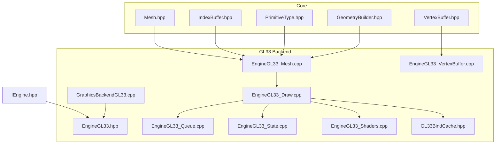
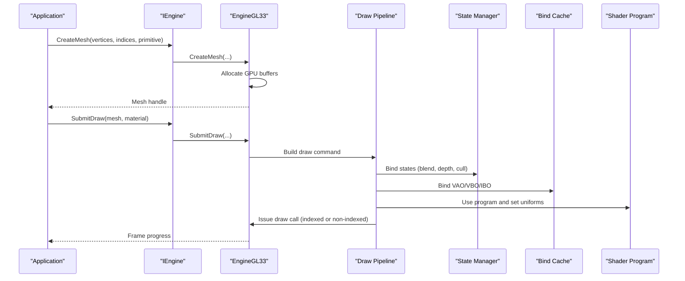
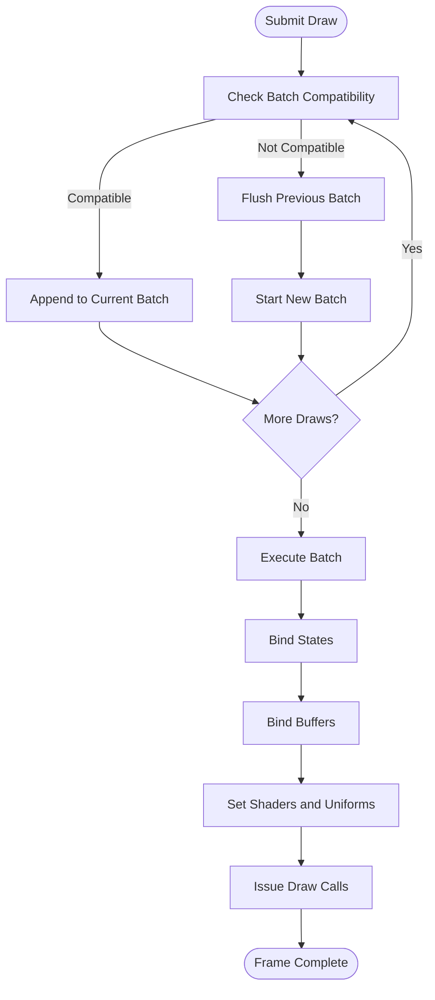
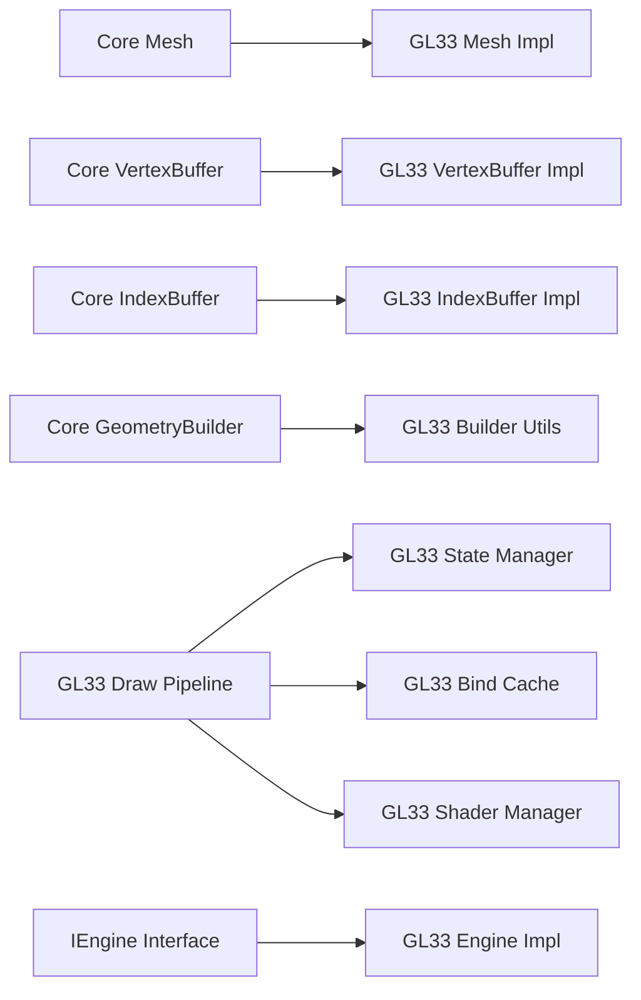

# Mesh Rendering

<cite>
**Referenced Files in This Document**
- [EngineGL33_Mesh.cpp](file://engine/PoseidonGL33/EngineGL33_Mesh.cpp)
- [EngineGL33_VertexBuffer.cpp](file://engine/PoseidonGL33/EngineGL33_VertexBuffer.cpp)
- [EngineGL33_Draw.cpp](file://engine/PoseidonGL33/EngineGL33_Draw.cpp)
- [EngineGL33_Queue.cpp](file://engine/PoseidonGL33/EngineGL33_Queue.cpp)
- [EngineGL33_State.cpp](file://engine/PoseidonGL33/EngineGL33_State.cpp)
- [EngineGL33_Shaders.cpp](file://engine/PoseidonGL33/EngineGL33_Shaders.cpp)
- [GL33BindCache.hpp](file://engine/PoseidonGL33/GL33BindCache.hpp)
- [GraphicsBackendGL33.cpp](file://engine/PoseidonGL33/GraphicsBackendGL33.cpp)
- [EngineGL33.hpp](file://engine/PoseidonGL33/EngineGL33.hpp)
- [IEngine.hpp](file://engine/Poseidon/Graphics/IEngine.hpp)
- [Mesh.hpp](file://engine/Poseidon/Graphics/Core/Mesh.hpp)
- [VertexBuffer.hpp](file://engine/Poseidon/Graphics/Core/VertexBuffer.hpp)
- [IndexBuffer.hpp](file://engine/Poseidon/Graphics/Core/IndexBuffer.hpp)
- [PrimitiveType.hpp](file://engine/Poseidon/Graphics/Core/PrimitiveType.hpp)
- [GeometryBuilder.hpp](file://engine/Poseidon/Graphics/Core/GeometryBuilder.hpp)
</cite>

## Table of Contents
1. [Introduction](#introduction)
2. [Project Structure](#project-structure)
3. [Core Components](#core-components)
4. [Architecture Overview](#architecture-overview)
5. [Detailed Component Analysis](#detailed-component-analysis)
6. [Dependency Analysis](#dependency-analysis)
7. [Performance Considerations](#performance-considerations)
8. [Troubleshooting Guide](#troubleshooting-guide)
9. [Conclusion](#conclusion)
10. [Appendices](#appendices)

## Introduction
This document explains mesh rendering in CWR-CE with a focus on the MeshVertex structure, vertex and index buffer management, mesh building utilities, primitive types, and the MeshBuild system for constructing complex geometry from primitives. It also covers integration with the rendering pipeline, optimization techniques to reduce draw calls, and strategies for handling large mesh datasets efficiently.

## Project Structure
The mesh rendering subsystem spans core graphics abstractions and the OpenGL 3.3 backend implementation:
- Core definitions define mesh data structures, buffers, and builders.
- The GL33 backend implements GPU-side resources, state management, batching, and draw execution.
- The engine interface abstracts backend details for higher-level systems.

**Diagram sources**
- [Mesh.hpp](file://engine/Poseidon/Graphics/Core/Mesh.hpp)
- [VertexBuffer.hpp](file://engine/Poseidon/Graphics/Core/VertexBuffer.hpp)
- [IndexBuffer.hpp](file://engine/Poseidon/Graphics/Core/IndexBuffer.hpp)
- [PrimitiveType.hpp](file://engine/Poseidon/Graphics/Core/PrimitiveType.hpp)
- [GeometryBuilder.hpp](file://engine/Poseidon/Graphics/Core/GeometryBuilder.hpp)
- [EngineGL33.hpp](file://engine/PoseidonGL33/EngineGL33.hpp)
- [EngineGL33_Mesh.cpp](file://engine/PoseidonGL33/EngineGL33_Mesh.cpp)
- [EngineGL33_VertexBuffer.cpp](file://engine/PoseidonGL33/EngineGL33_VertexBuffer.cpp)
- [EngineGL33_Draw.cpp](file://engine/PoseidonGL33/EngineGL33_Draw.cpp)
- [EngineGL33_Queue.cpp](file://engine/PoseidonGL33/EngineGL33_Queue.cpp)
- [EngineGL33_State.cpp](file://engine/PoseidonGL33/EngineGL33_State.cpp)
- [EngineGL33_Shaders.cpp](file://engine/PoseidonGL33/EngineGL33_Shaders.cpp)
- [GL33BindCache.hpp](file://engine/PoseidonGL33/GL33BindCache.hpp)
- [GraphicsBackendGL33.cpp](file://engine/PoseidonGL33/GraphicsBackendGL33.cpp)
- [IEngine.hpp](file://engine/Poseidon/Graphics/IEngine.hpp)

**Section sources**
- [EngineGL33_Mesh.cpp](file://engine/PoseidonGL33/EngineGL33_Mesh.cpp)
- [EngineGL33_VertexBuffer.cpp](file://engine/PoseidonGL33/EngineGL33_VertexBuffer.cpp)
- [EngineGL33_Draw.cpp](file://engine/PoseidonGL33/EngineGL33_Draw.cpp)
- [EngineGL33_Queue.cpp](file://engine/PoseidonGL33/EngineGL33_Queue.cpp)
- [EngineGL33_State.cpp](file://engine/PoseidonGL33/EngineGL33_State.cpp)
- [EngineGL33_Shaders.cpp](file://engine/PoseidonGL33/EngineGL33_Shaders.cpp)
- [GL33BindCache.hpp](file://engine/PoseidonGL33/GL33BindCache.hpp)
- [GraphicsBackendGL33.cpp](file://engine/PoseidonGL33/GraphicsBackendGL33.cpp)
- [EngineGL33.hpp](file://engine/PoseidonGL33/EngineGL33.hpp)
- [IEngine.hpp](file://engine/Poseidon/Graphics/IEngine.hpp)
- [Mesh.hpp](file://engine/Poseidon/Graphics/Core/Mesh.hpp)
- [VertexBuffer.hpp](file://engine/Poseidon/Graphics/Core/VertexBuffer.hpp)
- [IndexBuffer.hpp](file://engine/Poseidon/Graphics/Core/IndexBuffer.hpp)
- [PrimitiveType.hpp](file://engine/Poseidon/Graphics/Core/PrimitiveType.hpp)
- [GeometryBuilder.hpp](file://engine/Poseidon/Graphics/Core/GeometryBuilder.hpp)

## Core Components
- MeshVertex: Defines per-vertex attributes consumed by shaders (positions, normals, UVs, colors, etc.). Its layout must match the vertex attribute bindings used by the active shader programs.
- VertexBuffer: Hosts and manages GPU memory for vertex attributes; supports dynamic updates and streaming patterns.
- IndexBuffer: Stores triangle indices to reuse vertices and reduce bandwidth.
- PrimitiveType: Enumerates supported drawing primitives (e.g., triangles, lines, points).
- GeometryBuilder: Utility to construct meshes from primitives and helper routines, enabling efficient assembly of complex geometry.

Key responsibilities:
- Define consistent vertex layouts and stride/padding rules.
- Provide APIs to upload, update, and bind buffers efficiently.
- Support indexed drawing to minimize redundant vertex data.
- Offer builder functions that generate common shapes and combine them into larger meshes.

**Section sources**
- [Mesh.hpp](file://engine/Poseidon/Graphics/Core/Mesh.hpp)
- [VertexBuffer.hpp](file://engine/Poseidon/Graphics/Core/VertexBuffer.hpp)
- [IndexBuffer.hpp](file://engine/Poseidon/Graphics/Core/IndexBuffer.hpp)
- [PrimitiveType.hpp](file://engine/Poseidon/Graphics/Core/PrimitiveType.hpp)
- [GeometryBuilder.hpp](file://engine/Poseidon/Graphics/Core/GeometryBuilder.hpp)

## Architecture Overview
The rendering pipeline integrates core mesh definitions with the GL33 backend:
- Core defines data structures and builders.
- GL33 implements GPU resource creation, binding caches, state management, and draw commands.
- Engine abstraction decouples game code from backend specifics.

**Diagram sources**
- [IEngine.hpp](file://engine/Poseidon/Graphics/IEngine.hpp)
- [EngineGL33.hpp](file://engine/PoseidonGL33/EngineGL33.hpp)
- [EngineGL33_Mesh.cpp](file://engine/PoseidonGL33/EngineGL33_Mesh.cpp)
- [EngineGL33_Draw.cpp](file://engine/PoseidonGL33/EngineGL33_Draw.cpp)
- [EngineGL33_State.cpp](file://engine/PoseidonGL33/EngineGL33_State.cpp)
- [GL33BindCache.hpp](file://engine/PoseidonGL33/GL33BindCache.hpp)
- [EngineGL33_Shaders.cpp](file://engine/PoseidonGL33/EngineGL33_Shaders.cpp)

## Detailed Component Analysis

### MeshVertex and Vertex Layout
- Purpose: Encapsulates per-vertex data consumed by vertex shaders.
- Layout considerations:
  - Attribute order and types must match shader bindings.
  - Stride and offsets are computed to avoid padding overhead.
  - Common attributes include position, normal, UV, color, and optional tangent/bitangent for advanced shading.
- Validation:
  - Ensure vertex count matches index count when using indexed drawing.
  - Validate attribute sizes against shader expectations.

Optimization tips:
- Pack tightly to reduce memory bandwidth.
- Reuse shared attributes across materials where possible.
- Avoid unnecessary per-vertex data if not used by shaders.

**Section sources**
- [Mesh.hpp](file://engine/Poseidon/Graphics/Core/Mesh.hpp)
- [EngineGL33_Mesh.cpp](file://engine/PoseidonGL33/EngineGL33_Mesh.cpp)

### Vertex Buffer Management
- Responsibilities:
  - Allocate GPU memory for vertex attributes.
  - Upload initial data and support dynamic updates.
  - Manage lifetime and synchronization with draw calls.
- Patterns:
  - Static buffers for immutable geometry.
  - Dynamic/streaming buffers for frequent updates (e.g., deformations, particles).
- Performance:
  - Minimize CPU-GPU sync points.
  - Use ring buffers or double/triple buffering for streaming.

**Section sources**
- [VertexBuffer.hpp](file://engine/Poseidon/Graphics/Core/VertexBuffer.hpp)
- [EngineGL33_VertexBuffer.cpp](file://engine/PoseidonGL33/EngineGL33_VertexBuffer.cpp)

### Index Buffer and Primitive Types
- IndexBuffer:
  - Reduces vertex duplication and improves cache efficiency.
  - Supports 16-bit or 32-bit indices depending on mesh size.
- PrimitiveType:
  - Triangles for solid geometry.
  - Lines and points for wireframes/debug visualization.
- Best practices:
  - Prefer indexed drawing for repeated vertices.
  - Keep index ranges contiguous to improve batching.

**Section sources**
- [IndexBuffer.hpp](file://engine/Poseidon/Graphics/Core/IndexBuffer.hpp)
- [PrimitiveType.hpp](file://engine/Poseidon/Graphics/Core/PrimitiveType.hpp)
- [EngineGL33_Mesh.cpp](file://engine/PoseidonGL33/EngineGL33_Mesh.cpp)

### MeshBuild System and Geometry Builder
- GeometryBuilder provides utilities to assemble meshes from primitives:
  - Generate boxes, spheres, planes, cylinders, and custom shapes.
  - Combine multiple primitives into a single mesh to reduce draw calls.
  - Compute normals, UVs, and tangents automatically where applicable.
- Workflow:
  - Initialize builder with target vertex format.
  - Add primitives via builder methods.
  - Finalize to produce a Mesh object with buffers ready for rendering.

Optimization opportunities:
- Merge adjacent faces sharing material and transform.
- Remove degenerate triangles and duplicate vertices.
- Bake static transforms into vertex positions for animated instances.

**Section sources**
- [GeometryBuilder.hpp](file://engine/Poseidon/Graphics/Core/GeometryBuilder.hpp)
- [EngineGL33_Mesh.cpp](file://engine/PoseidonGL33/EngineGL33_Mesh.cpp)

### Rendering Pipeline Integration
- Submission:
  - Application submits draw commands with mesh handles and material parameters.
  - Backend batches compatible draws to minimize state changes.
- State Management:
  - Binds blend modes, depth tests, culling, and scissor regions.
  - Uses a bind cache to avoid redundant state operations.
- Shader Programs:
  - Selects appropriate shader based on material requirements.
  - Sets uniforms and textures per draw.

**Diagram sources**
- [EngineGL33_Draw.cpp](file://engine/PoseidonGL33/EngineGL33_Draw.cpp)
- [EngineGL33_State.cpp](file://engine/PoseidonGL33/EngineGL33_State.cpp)
- [GL33BindCache.hpp](file://engine/PoseidonGL33/GL33BindCache.hpp)
- [EngineGL33_Shaders.cpp](file://engine/PoseidonGL33/EngineGL33_Shaders.cpp)

**Section sources**
- [EngineGL33_Draw.cpp](file://engine/PoseidonGL33/EngineGL33_Draw.cpp)
- [EngineGL33_State.cpp](file://engine/PoseidonGL33/EngineGL33_State.cpp)
- [GL33BindCache.hpp](file://engine/PoseidonGL33/GL33BindCache.hpp)
- [EngineGL33_Shaders.cpp](file://engine/PoseidonGL33/EngineGL33_Shaders.cpp)

### Creating Custom Geometry
Steps to create custom geometry:
- Define vertex layout matching your shader requirements.
- Populate vertex arrays with positions, normals, UVs, and other attributes.
- Generate index arrays for efficient triangle rendering.
- Use GeometryBuilder helpers to validate and optimize the mesh.
- Upload to GPU via Mesh creation APIs.

Tips:
- Validate winding order and normals for correct lighting.
- Use UV unwrapping tools for texture mapping.
- Test with debug line rendering to verify topology.

**Section sources**
- [GeometryBuilder.hpp](file://engine/Poseidon/Graphics/Core/GeometryBuilder.hpp)
- [EngineGL33_Mesh.cpp](file://engine/PoseidonGL33/EngineGL33_Mesh.cpp)

### Optimizing Draw Calls
Strategies to reduce draw calls:
- Merge meshes with identical materials and transforms.
- Use instancing for repeated objects.
- Implement frustum and occlusion culling.
- Batch small meshes into larger atlases.

Monitoring:
- Profile draw call counts and state changes.
- Measure GPU utilization and memory bandwidth usage.

**Section sources**
- [EngineGL33_Draw.cpp](file://engine/PoseidonGL33/EngineGL33_Draw.cpp)
- [EngineGL33_State.cpp](file://engine/PoseidonGL33/EngineGL33_State.cpp)

### Handling Large Mesh Datasets
Approaches for large scenes:
- Level-of-detail (LOD) meshes to reduce complexity at distance.
- Streaming geometry to load only visible portions.
- Spatial partitioning (BVH, octrees) for efficient culling.
- Texture atlasing to minimize state changes.

Implementation notes:
- Precompute bounding volumes for culling.
- Use asynchronous loading to avoid frame stalls.
- Monitor memory usage and garbage collect unused assets.

**Section sources**
- [EngineGL33_Mesh.cpp](file://engine/PoseidonGL33/EngineGL33_Mesh.cpp)
- [EngineGL33_VertexBuffer.cpp](file://engine/PoseidonGL33/EngineGL33_VertexBuffer.cpp)

## Dependency Analysis
The mesh rendering system has clear separation between core abstractions and backend implementations:
- Core modules define interfaces and data structures.
- GL33 backend implements these interfaces with OpenGL-specific optimizations.
- Engine abstraction allows swapping backends without changing application code.

**Diagram sources**
- [Mesh.hpp](file://engine/Poseidon/Graphics/Core/Mesh.hpp)
- [VertexBuffer.hpp](file://engine/Poseidon/Graphics/Core/VertexBuffer.hpp)
- [IndexBuffer.hpp](file://engine/Poseidon/Graphics/Core/IndexBuffer.hpp)
- [GeometryBuilder.hpp](file://engine/Poseidon/Graphics/Core/GeometryBuilder.hpp)
- [EngineGL33_Mesh.cpp](file://engine/PoseidonGL33/EngineGL33_Mesh.cpp)
- [EngineGL33_VertexBuffer.cpp](file://engine/PoseidonGL33/EngineGL33_VertexBuffer.cpp)
- [EngineGL33_Draw.cpp](file://engine/PoseidonGL33/EngineGL33_Draw.cpp)
- [EngineGL33_State.cpp](file://engine/PoseidonGL33/EngineGL33_State.cpp)
- [GL33BindCache.hpp](file://engine/PoseidonGL33/GL33BindCache.hpp)
- [EngineGL33_Shaders.cpp](file://engine/PoseidonGL33/EngineGL33_Shaders.cpp)
- [IEngine.hpp](file://engine/Poseidon/Graphics/IEngine.hpp)
- [GraphicsBackendGL33.cpp](file://engine/PoseidonGL33/GraphicsBackendGL33.cpp)

**Section sources**
- [GraphicsBackendGL33.cpp](file://engine/PoseidonGL33/GraphicsBackendGL33.cpp)
- [EngineGL33.hpp](file://engine/PoseidonGL33/EngineGL33.hpp)

## Performance Considerations
- Memory bandwidth:
  - Use compressed formats where possible.
  - Minimize vertex attribute size and count.
- CPU-GPU synchronization:
  - Avoid blocking calls during frame rendering.
  - Use async uploads and ring buffers.
- State changes:
  - Batch draws with similar states.
  - Use bind caches to reduce redundant operations.
- Culling:
  - Implement frustum and occlusion culling early.
  - Use hierarchical culling for large scenes.
- Shader complexity:
  - Optimize fragment shaders for mobile/high-performance targets.
  - Use varying precision types appropriately.

[No sources needed since this section provides general guidance]

## Troubleshooting Guide
Common issues and solutions:
- Incorrect vertex layout:
  - Verify attribute order and types match shader expectations.
  - Check stride and offset calculations.
- Missing indices or out-of-bounds access:
  - Validate index ranges against vertex count.
  - Ensure index buffer is properly uploaded.
- Poor performance:
  - Profile draw call counts and state changes.
  - Check for excessive CPU-GPU synchronization.
- Visual artifacts:
  - Verify normal directions and winding order.
  - Debug with wireframe rendering to inspect topology.

Debugging tools:
- Use RenderDoc or similar GPU profilers.
- Enable validation layers for OpenGL errors.
- Log mesh statistics (vertices, indices, draw calls).

**Section sources**
- [EngineGL33_Mesh.cpp](file://engine/PoseidonGL33/EngineGL33_Mesh.cpp)
- [EngineGL33_State.cpp](file://engine/PoseidonGL33/EngineGL33_State.cpp)
- [EngineGL33_Draw.cpp](file://engine/PoseidonGL33/EngineGL33_Draw.cpp)

## Conclusion
CWR-CE’s mesh rendering system combines well-defined core abstractions with an optimized OpenGL 3.3 backend. By understanding MeshVertex layouts, buffer management, and the GeometryBuilder utilities, developers can create efficient, scalable geometry for complex scenes. Following the optimization strategies and troubleshooting guidelines will help achieve high performance in mesh-heavy environments.

[No sources needed since this section summarizes without analyzing specific files]

## Appendices

### Example Workflows

#### Creating a Simple Box Mesh
- Use GeometryBuilder to generate box vertices and indices.
- Apply material and transform matrices.
- Submit draw call through the engine interface.

**Section sources**
- [GeometryBuilder.hpp](file://engine/Poseidon/Graphics/Core/GeometryBuilder.hpp)
- [EngineGL33_Mesh.cpp](file://engine/PoseidonGL33/EngineGL33_Mesh.cpp)

#### Building Complex Terrain Geometry
- Generate heightmap-based terrain using builder utilities.
- Optimize with LOD levels and texture atlasing.
- Stream chunks based on camera position.

**Section sources**
- [GeometryBuilder.hpp](file://engine/Poseidon/Graphics/Core/GeometryBuilder.hpp)
- [EngineGL33_VertexBuffer.cpp](file://engine/PoseidonGL33/EngineGL33_VertexBuffer.cpp)