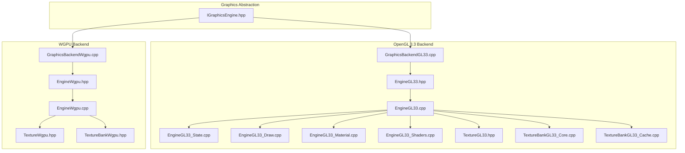
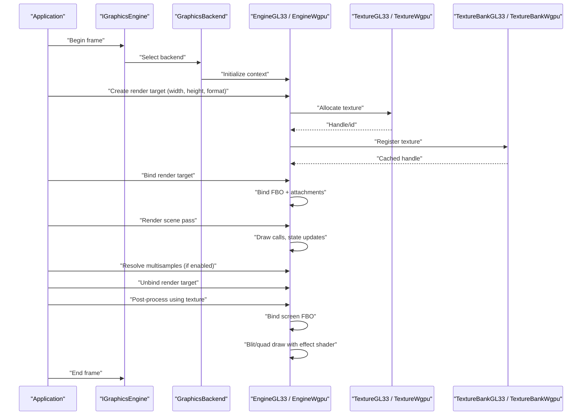
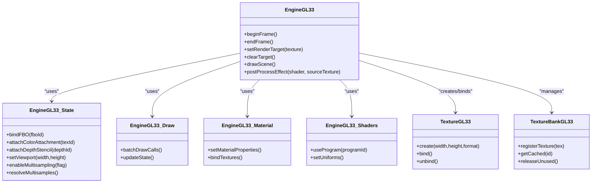
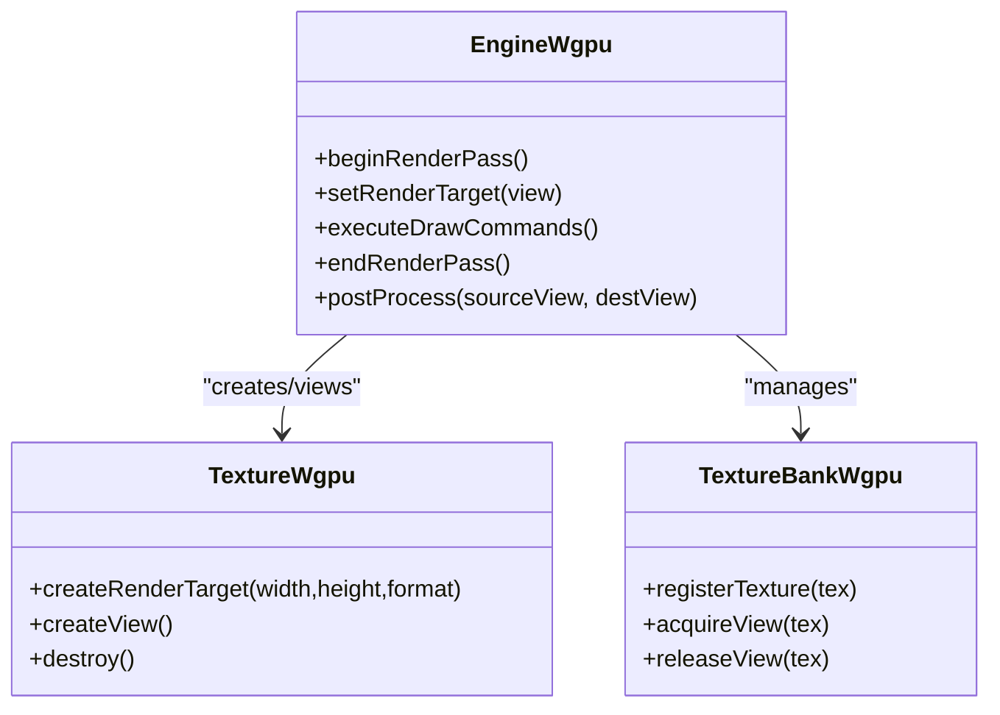
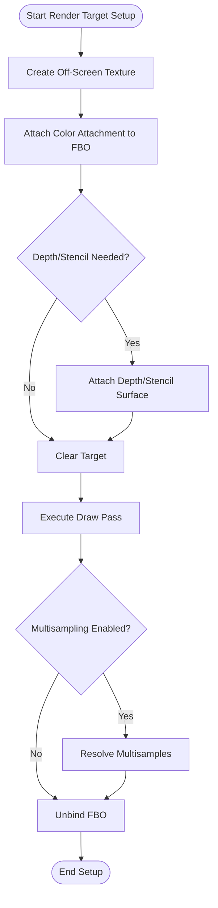
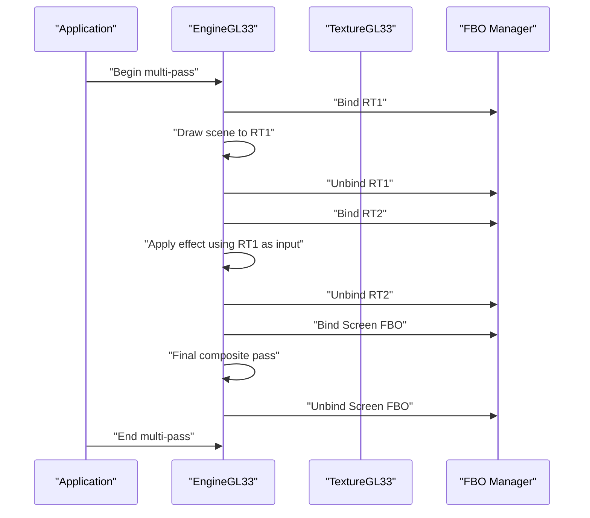
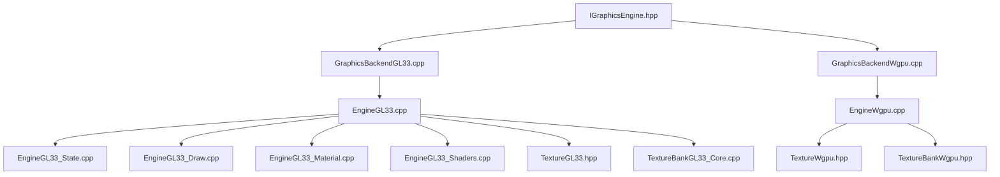

# Render Targets

<cite>
**Referenced Files in This Document**
- [EngineGL33.hpp](file://engine/PoseidonGL33/EngineGL33.hpp)
- [EngineGL33.cpp](file://engine/PoseidonGL33/EngineGL33.cpp)
- [EngineGL33_2DRendering.cpp](file://engine/PoseidonGL33/EngineGL33_2DRendering.cpp)
- [EngineGL33_Draw.cpp](file://engine/PoseidonGL33/EngineGL33_Draw.cpp)
- [EngineGL33_Material.cpp](file://engine/PoseidonGL33/EngineGL33_Material.cpp)
- [EngineGL33_Shaders.cpp](file://engine/PoseidonGL33/EngineGL33_Shaders.cpp)
- [EngineGL33_State.cpp](file://engine/PoseidonGL33/EngineGL33_State.cpp)
- [TextureGL33.hpp](file://engine/PoseidonGL33/TextureGL33.hpp)
- [TextureBankGL33_Core.cpp](file://engine/PoseidonGL33/TextureBankGL33_Core.cpp)
- [TextureBankGL33_Cache.cpp](file://engine/PoseidonGL33/TextureBankGL33_Cache.cpp)
- [GraphicsBackendGL33.cpp](file://engine/PoseidonGL33/GraphicsBackendGL33.cpp)
- [EngineWgpu.hpp](file://engine/WgpuRenderer/EngineWgpu.hpp)
- [EngineWgpu.cpp](file://engine/WgpuRenderer/EngineWgpu.cpp)
- [GraphicsBackendWgpu.cpp](file://engine/WgpuRenderer/GraphicsBackendWgpu.cpp)
- [TextureWgpu.hpp](file://engine/WgpuRenderer/TextureWgpu.hpp)
- [TextureBankWgpu.hpp](file://engine/WgpuRenderer/TextureBankWgpu.hpp)
- [IGraphicsEngine.hpp](file://engine/Poseidon/Graphics/IGraphicsEngine.hpp)
</cite>

## Table of Contents
1. [Introduction](#introduction)
2. [Project Structure](#project-structure)
3. [Core Components](#core-components)
4. [Architecture Overview](#architecture-overview)
5. [Detailed Component Analysis](#detailed-component-analysis)
6. [Dependency Analysis](#dependency-analysis)
7. [Performance Considerations](#performance-considerations)
8. [Troubleshooting Guide](#troubleshooting-guide)
9. [Conclusion](#conclusion)
10. [Appendices](#appendices)

## Introduction
This document explains render targets and framebuffer management in CWR-CE, focusing on off-screen rendering, framebuffer objects (FBOs), render-to-texture operations, multi-pass rendering, depth/stencil buffers, multisampling support, and efficient buffer state management via GLBufferMap. It also covers how render targets integrate with the overall rendering pipeline and provides practical guidance for custom render targets, post-processing effects, and optimization strategies.

## Project Structure
CWR-CE implements graphics backends for OpenGL 3.3 and WGPU. The core abstractions are defined in the Graphics layer, while backend-specific implementations live under PoseidonGL33 and WgpuRenderer. Key files relevant to render targets include:
- Engine interfaces and entry points
- Backend-specific engine implementations
- Texture and texture bank abstractions
- State and draw pipelines that bind FBOs and textures

**Diagram sources**
- [IGraphicsEngine.hpp](file://engine/Poseidon/Graphics/IGraphicsEngine.hpp)
- [EngineGL33.hpp](file://engine/PoseidonGL33/EngineGL33.hpp)
- [EngineGL33.cpp](file://engine/PoseidonGL33/EngineGL33.cpp)
- [EngineGL33_State.cpp](file://engine/PoseidonGL33/EngineGL33_State.cpp)
- [EngineGL33_Draw.cpp](file://engine/PoseidonGL33/EngineGL33_Draw.cpp)
- [EngineGL33_Material.cpp](file://engine/PoseidonGL33/EngineGL33_Material.cpp)
- [EngineGL33_Shaders.cpp](file://engine/PoseidonGL33/EngineGL33_Shaders.cpp)
- [TextureGL33.hpp](file://engine/PoseidonGL33/TextureGL33.hpp)
- [TextureBankGL33_Core.cpp](file://engine/PoseidonGL33/TextureBankGL33_Core.cpp)
- [TextureBankGL33_Cache.cpp](file://engine/PoseidonGL33/TextureBankGL33_Cache.cpp)
- [GraphicsBackendGL33.cpp](file://engine/PoseidonGL33/GraphicsBackendGL33.cpp)
- [EngineWgpu.hpp](file://engine/WgpuRenderer/EngineWgpu.hpp)
- [EngineWgpu.cpp](file://engine/WgpuRenderer/EngineWgpu.cpp)
- [GraphicsBackendWgpu.cpp](file://engine/WgpuRenderer/GraphicsBackendWgpu.cpp)
- [TextureWgpu.hpp](file://engine/WgpuRenderer/TextureWgpu.hpp)
- [TextureBankWgpu.hpp](file://engine/WgpuRenderer/TextureBankWgpu.hpp)

**Section sources**
- [IGraphicsEngine.hpp](file://engine/Poseidon/Graphics/IGraphicsEngine.hpp)
- [EngineGL33.hpp](file://engine/PoseidonGL33/EngineGL33.hpp)
- [EngineGL33.cpp](file://engine/PoseidonGL33/EngineGL33.cpp)
- [GraphicsBackendGL33.cpp](file://engine/PoseidonGL33/GraphicsBackendGL33.cpp)
- [EngineWgpu.hpp](file://engine/WgpuRenderer/EngineWgpu.hpp)
- [EngineWgpu.cpp](file://engine/WgpuRenderer/EngineWgpu.cpp)
- [GraphicsBackendWgpu.cpp](file://engine/WgpuRenderer/GraphicsBackendWgpu.cpp)

## Core Components
- Engine interface and backends:
  - IGraphicsEngine defines the high-level API used by the application.
  - GraphicsBackendGL33 and GraphicsBackendWgpu implement platform-specific rendering.
- OpenGL 3.3 engine:
  - EngineGL33 orchestrates rendering passes, state changes, and resource binding.
  - EngineGL33_State manages GPU state including FBO bindings and render target attachments.
  - EngineGL33_Draw handles draw calls and batching.
  - EngineGL33_Material and EngineGL33_Shaders manage shader programs and material properties.
- Textures and texture banks:
  - TextureGL33 wraps GL textures and supports creation for render targets.
  - TextureBankGL33 manages texture lifetimes, caching, and reuse.
- WGPU engine:
  - EngineWgpu and related files provide a modern GPU abstraction for render targets and pipelines.

Key responsibilities for render targets:
- Creation and configuration of off-screen textures and depth/stencil surfaces.
- Binding of FBOs and attachments per pass.
- Managing multisample resolve paths.
- Switching between screen and off-screen targets efficiently.

**Section sources**
- [IGraphicsEngine.hpp](file://engine/Poseidon/Graphics/IGraphicsEngine.hpp)
- [EngineGL33.hpp](file://engine/PoseidonGL33/EngineGL33.hpp)
- [EngineGL33.cpp](file://engine/PoseidonGL33/EngineGL33.cpp)
- [EngineGL33_State.cpp](file://engine/PoseidonGL33/EngineGL33_State.cpp)
- [EngineGL33_Draw.cpp](file://engine/PoseidonGL33/EngineGL33_Draw.cpp)
- [EngineGL33_Material.cpp](file://engine/PoseidonGL33/EngineGL33_Material.cpp)
- [EngineGL33_Shaders.cpp](file://engine/PoseidonGL33/EngineGL33_Shaders.cpp)
- [TextureGL33.hpp](file://engine/PoseidonGL33/TextureGL33.hpp)
- [TextureBankGL33_Core.cpp](file://engine/PoseidonGL33/TextureBankGL33_Core.cpp)
- [TextureBankGL33_Cache.cpp](file://engine/PoseidonGL33/TextureBankGL33_Cache.cpp)
- [GraphicsBackendGL33.cpp](file://engine/PoseidonGL33/GraphicsBackendGL33.cpp)
- [EngineWgpu.hpp](file://engine/WgpuRenderer/EngineWgpu.hpp)
- [EngineWgpu.cpp](file://engine/WgpuRenderer/EngineWgpu.cpp)
- [GraphicsBackendWgpu.cpp](file://engine/WgpuRenderer/GraphicsBackendWgpu.cpp)
- [TextureWgpu.hpp](file://engine/WgpuRenderer/TextureWgpu.hpp)
- [TextureBankWgpu.hpp](file://engine/WgpuRenderer/TextureBankWgpu.hpp)

## Architecture Overview
The render target system is layered:
- Application code uses IGraphicsEngine to request rendering operations.
- Backend selection delegates to GraphicsBackendGL33 or GraphicsBackendWgpu.
- EngineGL33 coordinates passes, binds textures/FBOs, and updates state.
- TextureGL33 and TextureBankGL33 manage GPU-side resources.
- For WGPU, EngineWgpu encapsulates render passes and pipeline state.

**Diagram sources**
- [IGraphicsEngine.hpp](file://engine/Poseidon/Graphics/IGraphicsEngine.hpp)
- [GraphicsBackendGL33.cpp](file://engine/PoseidonGL33/GraphicsBackendGL33.cpp)
- [EngineGL33.cpp](file://engine/PoseidonGL33/EngineGL33.cpp)
- [TextureGL33.hpp](file://engine/PoseidonGL33/TextureGL33.hpp)
- [TextureBankGL33_Core.cpp](file://engine/PoseidonGL33/TextureBankGL33_Core.cpp)
- [EngineWgpu.cpp](file://engine/WgpuRenderer/EngineWgpu.cpp)
- [TextureWgpu.hpp](file://engine/WgpuRenderer/TextureWgpu.hpp)
- [TextureBankWgpu.hpp](file://engine/WgpuRenderer/TextureBankWgpu.hpp)

## Detailed Component Analysis

### OpenGL 3.3 Engine and State Management
- EngineGL33 coordinates rendering passes and integrates with state management.
- EngineGL33_State handles FBO binding, viewport setup, and render target attachment switching.
- Draw and material/shader modules ensure correct program and uniform updates during render-to-texture.

**Diagram sources**
- [EngineGL33.hpp](file://engine/PoseidonGL33/EngineGL33.hpp)
- [EngineGL33.cpp](file://engine/PoseidonGL33/EngineGL33.cpp)
- [EngineGL33_State.cpp](file://engine/PoseidonGL33/EngineGL33_State.cpp)
- [EngineGL33_Draw.cpp](file://engine/PoseidonGL33/EngineGL33_Draw.cpp)
- [EngineGL33_Material.cpp](file://engine/PoseidonGL33/EngineGL33_Material.cpp)
- [EngineGL33_Shaders.cpp](file://engine/PoseidonGL33/EngineGL33_Shaders.cpp)
- [TextureGL33.hpp](file://engine/PoseidonGL33/TextureGL33.hpp)
- [TextureBankGL33_Core.cpp](file://engine/PoseidonGL33/TextureBankGL33_Core.cpp)
- [TextureBankGL33_Cache.cpp](file://engine/PoseidonGL33/TextureBankGL33_Cache.cpp)

**Section sources**
- [EngineGL33.hpp](file://engine/PoseidonGL33/EngineGL33.hpp)
- [EngineGL33.cpp](file://engine/PoseidonGL33/EngineGL33.cpp)
- [EngineGL33_State.cpp](file://engine/PoseidonGL33/EngineGL33_State.cpp)
- [EngineGL33_Draw.cpp](file://engine/PoseidonGL33/EngineGL33_Draw.cpp)
- [EngineGL33_Material.cpp](file://engine/PoseidonGL33/EngineGL33_Material.cpp)
- [EngineGL33_Shaders.cpp](file://engine/PoseidonGL33/EngineGL33_Shaders.cpp)
- [TextureGL33.hpp](file://engine/PoseidonGL33/TextureGL33.hpp)
- [TextureBankGL33_Core.cpp](file://engine/PoseidonGL33/TextureBankGL33_Core.cpp)
- [TextureBankGL33_Cache.cpp](file://engine/PoseidonGL33/TextureBankGL33_Cache.cpp)

### WGPU Engine and Render Passes
- EngineWgpu encapsulates render pass creation, texture views, and pipeline state.
- TextureWgpu and TextureBankWgpu manage GPU textures and their lifecycle.

**Diagram sources**
- [EngineWgpu.hpp](file://engine/WgpuRenderer/EngineWgpu.hpp)
- [EngineWgpu.cpp](file://engine/WgpuRenderer/EngineWgpu.cpp)
- [TextureWgpu.hpp](file://engine/WgpuRenderer/TextureWgpu.hpp)
- [TextureBankWgpu.hpp](file://engine/WgpuRenderer/TextureBankWgpu.hpp)

**Section sources**
- [EngineWgpu.hpp](file://engine/WgpuRenderer/EngineWgpu.hpp)
- [EngineWgpu.cpp](file://engine/WgpuRenderer/EngineWgpu.cpp)
- [TextureWgpu.hpp](file://engine/WgpuRenderer/TextureWgpu.hpp)
- [TextureBankWgpu.hpp](file://engine/WgpuRenderer/TextureBankWgpu.hpp)

### Render Target Setup Flow
A typical render-to-texture workflow involves creating an off-screen texture, attaching it to an FBO, clearing, drawing, resolving multisamples, and unbinding.

**Diagram sources**
- [EngineGL33.cpp](file://engine/PoseidonGL33/EngineGL33.cpp)
- [EngineGL33_State.cpp](file://engine/PoseidonGL33/EngineGL33_State.cpp)
- [TextureGL33.hpp](file://engine/PoseidonGL33/TextureGL33.hpp)

**Section sources**
- [EngineGL33.cpp](file://engine/PoseidonGL33/EngineGL33.cpp)
- [EngineGL33_State.cpp](file://engine/PoseidonGL33/EngineGL33_State.cpp)
- [TextureGL33.hpp](file://engine/PoseidonGL33/TextureGL33.hpp)

### Multi-Pass Rendering and Post-Processing
Multi-pass rendering chains multiple render targets and effects:
- First pass renders scene into an off-screen texture.
- Subsequent passes read from previous textures and write to new ones.
- Final pass blits to the screen.

**Diagram sources**
- [EngineGL33.cpp](file://engine/PoseidonGL33/EngineGL33.cpp)
- [EngineGL33_State.cpp](file://engine/PoseidonGL33/EngineGL33_State.cpp)
- [EngineGL33_Shaders.cpp](file://engine/PoseidonGL33/EngineGL33_Shaders.cpp)

**Section sources**
- [EngineGL33.cpp](file://engine/PoseidonGL33/EngineGL33.cpp)
- [EngineGL33_State.cpp](file://engine/PoseidonGL33/EngineGL33_State.cpp)
- [EngineGL33_Shaders.cpp](file://engine/PoseidonGL33/EngineGL33_Shaders.cpp)

### Depth/Stencil Buffers
- Depth/stencil attachments are optional but recommended for accurate occlusion testing.
- Ensure formats match the color attachment and resolution.
- Clear depth/stencil before each pass to avoid stale data.

**Section sources**
- [EngineGL33_State.cpp](file://engine/PoseidonGL33/EngineGL33_State.cpp)
- [TextureGL33.hpp](file://engine/PoseidonGL33/TextureGL33.hpp)

### Multisampling Support
- Enable multisampling at texture creation time for anti-aliasing.
- Use resolve step to copy samples to a single-sample target for reading or display.
- Avoid sampling directly from multisampled textures; always resolve first.

**Section sources**
- [EngineGL33_State.cpp](file://engine/PoseidonGL33/EngineGL33_State.cpp)
- [TextureGL33.hpp](file://engine/PoseidonGL33/TextureGL33.hpp)

### GLBufferMap for Efficient Buffer State Management
- GLBufferMap centralizes tracking of bound buffers, textures, and states to minimize redundant GPU calls.
- Cache active bindings and only update when necessary.
- Integrate with EngineGL33_State to synchronize CPU-side state with GPU.

Best practices:
- Group draw calls by similar states to reduce map updates.
- Invalidate cache entries when switching render targets or shaders.
- Monitor map size and eviction policies to prevent memory growth.

**Section sources**
- [EngineGL33_State.cpp](file://engine/PoseidonGL33/EngineGL33_State.cpp)
- [EngineGL33.cpp](file://engine/PoseidonGL33/EngineGL33.cpp)

### Examples: Custom Render Targets and Post-Processing
- Custom render targets:
  - Allocate textures with appropriate formats (e.g., RGBA16F for HDR).
  - Bind to FBO as color and depth attachments.
  - Render scene geometry and UI elements.
- Post-processing effects:
  - Use full-screen quad draws with effect shaders.
  - Chain multiple passes for complex effects (bloom, SSAO, tone mapping).
  - Optimize by minimizing texture switches and reusing intermediate targets.

Implementation references:
- Texture creation and binding: [TextureGL33.hpp](file://engine/PoseidonGL33/TextureGL33.hpp)
- FBO state management: [EngineGL33_State.cpp](file://engine/PoseidonGL33/EngineGL33_State.cpp)
- Shader usage and uniforms: [EngineGL33_Shaders.cpp](file://engine/PoseidonGL33/EngineGL33_Shaders.cpp)
- Draw orchestration: [EngineGL33_Draw.cpp](file://engine/PoseidonGL33/EngineGL33_Draw.cpp)

**Section sources**
- [TextureGL33.hpp](file://engine/PoseidonGL33/TextureGL33.hpp)
- [EngineGL33_State.cpp](file://engine/PoseidonGL33/EngineGL33_State.cpp)
- [EngineGL33_Shaders.cpp](file://engine/PoseidonGL33/EngineGL33_Shaders.cpp)
- [EngineGL33_Draw.cpp](file://engine/PoseidonGL33/EngineGL33_Draw.cpp)

## Dependency Analysis
Render target components depend on texture management, state synchronization, and backend-specific APIs.

**Diagram sources**
- [IGraphicsEngine.hpp](file://engine/Poseidon/Graphics/IGraphicsEngine.hpp)
- [GraphicsBackendGL33.cpp](file://engine/PoseidonGL33/GraphicsBackendGL33.cpp)
- [EngineGL33.cpp](file://engine/PoseidonGL33/EngineGL33.cpp)
- [EngineGL33_State.cpp](file://engine/PoseidonGL33/EngineGL33_State.cpp)
- [EngineGL33_Draw.cpp](file://engine/PoseidonGL33/EngineGL33_Draw.cpp)
- [EngineGL33_Material.cpp](file://engine/PoseidonGL33/EngineGL33_Material.cpp)
- [EngineGL33_Shaders.cpp](file://engine/PoseidonGL33/EngineGL33_Shaders.cpp)
- [TextureGL33.hpp](file://engine/PoseidonGL33/TextureGL33.hpp)
- [TextureBankGL33_Core.cpp](file://engine/PoseidonGL33/TextureBankGL33_Core.cpp)
- [GraphicsBackendWgpu.cpp](file://engine/WgpuRenderer/GraphicsBackendWgpu.cpp)
- [EngineWgpu.cpp](file://engine/WgpuRenderer/EngineWgpu.cpp)
- [TextureWgpu.hpp](file://engine/WgpuRenderer/TextureWgpu.hpp)
- [TextureBankWgpu.hpp](file://engine/WgpuRenderer/TextureBankWgpu.hpp)

**Section sources**
- [IGraphicsEngine.hpp](file://engine/Poseidon/Graphics/IGraphicsEngine.hpp)
- [GraphicsBackendGL33.cpp](file://engine/PoseidonGL33/GraphicsBackendGL33.cpp)
- [EngineGL33.cpp](file://engine/PoseidonGL33/EngineGL33.cpp)
- [EngineWgpu.cpp](file://engine/WgpuRenderer/EngineWgpu.cpp)

## Performance Considerations
- Minimize FBO and texture switches by batching render targets.
- Reuse intermediate render targets across frames when possible.
- Prefer single-sample textures for post-processing; resolve only when needed.
- Keep depth/stencil clear operations minimal; clear once per pass.
- Use efficient formats (e.g., half-float) for HDR pipelines to reduce bandwidth.
- Profile GPU-bound stages with tools like RenderDoc to identify bottlenecks.

[No sources needed since this section provides general guidance]

## Troubleshooting Guide
Common issues and resolutions:
- Incorrect FBO completeness:
  - Verify all attachments have matching dimensions and formats.
  - Ensure depth/stencil attachments are present if required.
- Stale depth/stencil data:
  - Always clear depth/stencil before drawing to avoid artifacts.
- Multisampling sampling errors:
  - Resolve multisampled textures before sampling in subsequent passes.
- Memory leaks:
  - Track texture lifetimes via TextureBank; release unused resources.
- State mismatches:
  - Validate GLBufferMap consistency; force cache invalidation on critical state changes.

Debugging tips:
- Use RenderDoc to inspect FBO attachments and draw calls.
- Log texture IDs and FBO states around critical transitions.
- Add assertions for expected viewport and scissor regions.

**Section sources**
- [EngineGL33_State.cpp](file://engine/PoseidonGL33/EngineGL33_State.cpp)
- [TextureGL33.hpp](file://engine/PoseidonGL33/TextureGL33.hpp)
- [TextureBankGL33_Core.cpp](file://engine/PoseidonGL33/TextureBankGL33_Core.cpp)

## Conclusion
CWR-CE’s render target system provides robust off-screen rendering capabilities through well-structured abstractions and backend-specific implementations. By leveraging FBOs, depth/stencil buffers, multisampling, and efficient state management via GLBufferMap, developers can implement advanced rendering techniques such as multi-pass effects and post-processing. Following best practices for texture reuse, state minimization, and careful debugging ensures optimal performance and reliability.

[No sources needed since this section summarizes without analyzing specific files]

## Appendices
- Additional references:
  - IGraphicsEngine interface for high-level operations: [IGraphicsEngine.hpp](file://engine/Poseidon/Graphics/IGraphicsEngine.hpp)
  - Backend selection and initialization: [GraphicsBackendGL33.cpp](file://engine/PoseidonGL33/GraphicsBackendGL33.cpp), [GraphicsBackendWgpu.cpp](file://engine/WgpuRenderer/GraphicsBackendWgpu.cpp)
  - Texture lifecycle management: [TextureBankGL33_Core.cpp](file://engine/PoseidonGL33/TextureBankGL33_Core.cpp), [TextureBankWgpu.hpp](file://engine/WgpuRenderer/TextureBankWgpu.hpp)

[No sources needed since this section lists references without analyzing specific files]