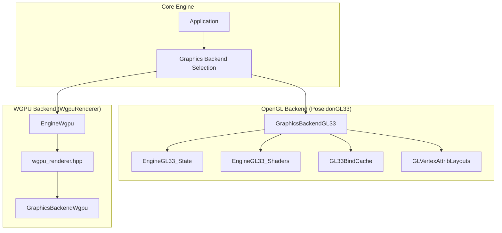
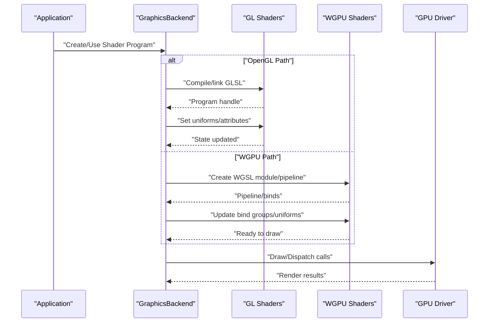
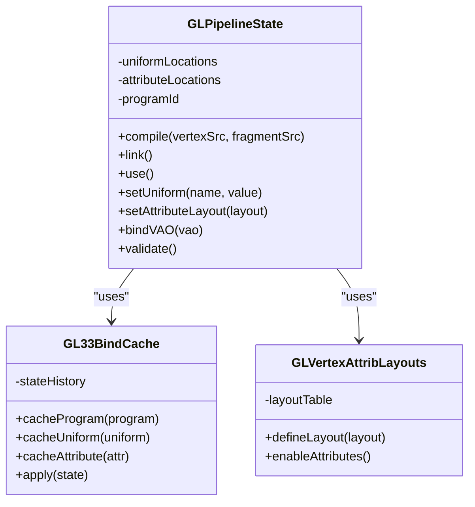
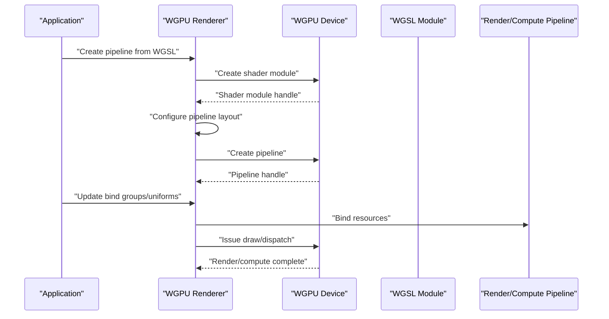
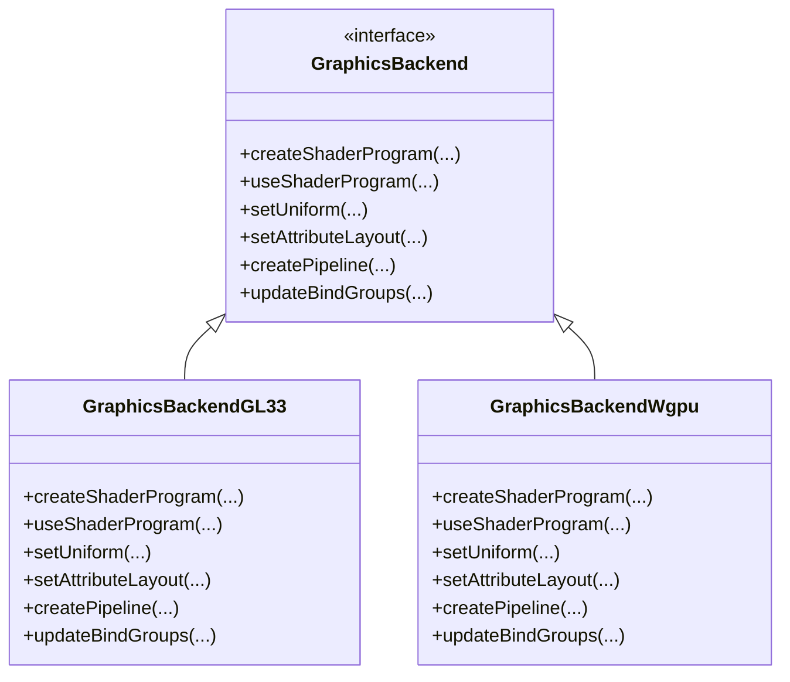
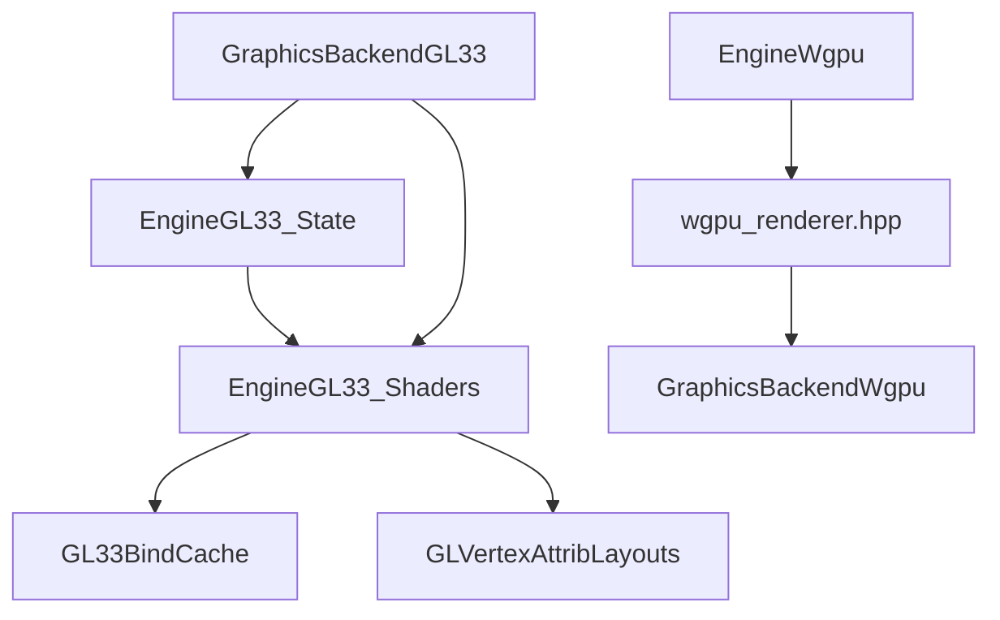

# Shader Pipeline

<cite>
**Referenced Files in This Document**
- [EngineGL33_Shaders.cpp](file://engine/PoseidonGL33/EngineGL33_Shaders.cpp)
- [EngineGL33_State.cpp](file://engine/PoseidonGL33/EngineGL33_State.cpp)
- [GL33BindCache.hpp](file://engine/PoseidonGL33/GL33BindCache.hpp)
- [GLVertexAttribLayouts.hpp](file://engine/PoseidonGL33/GLVertexAttribLayouts.hpp)
- [GraphicsBackendGL33.cpp](file://engine/PoseidonGL33/GraphicsBackendGL33.cpp)
- [EngineWgpu.cpp](file://engine/WgpuRenderer/EngineWgpu.cpp)
- [GraphicsBackendWgpu.cpp](file://engine/WgpuRenderer/GraphicsBackendWgpu.cpp)
- [wgpu_renderer.hpp](file://engine/WgpuRenderer/include/wgpu_renderer.hpp)
</cite>

## Table of Contents
1. [Introduction](#introduction)
2. [Project Structure](#project-structure)
3. [Core Components](#core-components)
4. [Architecture Overview](#architecture-overview)
5. [Detailed Component Analysis](#detailed-component-analysis)
6. [Dependency Analysis](#dependency-analysis)
7. [Performance Considerations](#performance-considerations)
8. [Troubleshooting Guide](#troubleshooting-guide)
9. [Conclusion](#conclusion)

## Introduction
This document explains the shader pipeline in CWR-CE with a focus on:
- OpenGL state management and shader compilation via GLPipelineState
- Shader program creation, uniform binding, and attribute layout management
- WGPU shader system using WGSL shaders and compute pipelines
- Cross-platform abstraction between OpenGL and WGPU backends
- Practical guidance for writing custom shaders, managing resources, and optimizing performance

The goal is to provide both high-level architecture understanding and code-level details so that developers can author, bind, and optimize shaders across platforms.

## Project Structure
CWR-CE implements two rendering backends:
- OpenGL 3.3 backend under PoseidonGL33
- WGPU backend under WgpuRenderer

Shader-related logic spans engine entry points, backend implementations, and shared abstractions. The following diagram shows how the backends relate to the core engine and where shader pipeline responsibilities live.

**Diagram sources**
- [GraphicsBackendGL33.cpp](file://engine/PoseidonGL33/GraphicsBackendGL33.cpp)
- [EngineGL33_State.cpp](file://engine/PoseidonGL33/EngineGL33_State.cpp)
- [EngineGL33_Shaders.cpp](file://engine/PoseidonGL33/EngineGL33_Shaders.cpp)
- [GL33BindCache.hpp](file://engine/PoseidonGL33/GL33BindCache.hpp)
- [GLVertexAttribLayouts.hpp](file://engine/PoseidonGL33/GLVertexAttribLayouts.hpp)
- [EngineWgpu.cpp](file://engine/WgpuRenderer/EngineWgpu.cpp)
- [wgpu_renderer.hpp](file://engine/WgpuRenderer/include/wgpu_renderer.hpp)
- [GraphicsBackendWgpu.cpp](file://engine/WgpuRenderer/GraphicsBackendWgpu.cpp)

**Section sources**
- [GraphicsBackendGL33.cpp](file://engine/PoseidonGL33/GraphicsBackendGL33.cpp)
- [EngineWgpu.cpp](file://engine/WgpuRenderer/EngineWgpu.cpp)
- [wgpu_renderer.hpp](file://engine/WgpuRenderer/include/wgpu_renderer.hpp)

## Core Components
- GLPipelineState (OpenGL): Manages shader programs, uniforms, attributes, and state transitions. It centralizes compilation, linking, validation, and error reporting for GL shaders.
- WGPU Shader System: Wraps WGSL source or compiled modules into render and compute pipelines, manages bind groups, and integrates with the WGPU device lifecycle.
- Backend Abstraction: GraphicsBackendGL33 and GraphicsBackendWgpu expose a unified interface to the engine while delegating to platform-specific shader and resource management.

Key responsibilities:
- Shader program creation and caching
- Uniform binding APIs (per-frame updates)
- Attribute layout definitions and VAO/VBO bindings
- Pipeline state setup and transitions
- Resource binding (textures, buffers, samplers)
- Error handling and diagnostics

**Section sources**
- [EngineGL33_Shaders.cpp](file://engine/PoseidonGL33/EngineGL33_Shaders.cpp)
- [EngineGL33_State.cpp](file://engine/PoseidonGL33/EngineGL33_State.cpp)
- [GL33BindCache.hpp](file://engine/PoseidonGL33/GL33BindCache.hpp)
- [GLVertexAttribLayouts.hpp](file://engine/PoseidonGL33/GLVertexAttribLayouts.hpp)
- [EngineWgpu.cpp](file://engine/WgpuRenderer/EngineWgpu.cpp)
- [wgpu_renderer.hpp](file://engine/WgpuRenderer/include/wgpu_renderer.hpp)
- [GraphicsBackendWgpu.cpp](file://engine/WgpuRenderer/GraphicsBackendWgpu.cpp)

## Architecture Overview
The shader pipeline is implemented as a layered architecture:
- Application layer requests rendering operations
- Backend selection chooses OpenGL or WGPU
- Backend-specific shader subsystem compiles and binds shaders
- GPU executes draw/compute commands

**Diagram sources**
- [GraphicsBackendGL33.cpp](file://engine/PoseidonGL33/GraphicsBackendGL33.cpp)
- [EngineGL33_Shaders.cpp](file://engine/PoseidonGL33/EngineGL33_Shaders.cpp)
- [EngineWgpu.cpp](file://engine/WgpuRenderer/EngineWgpu.cpp)
- [wgpu_renderer.hpp](file://engine/WgpuRenderer/include/wgpu_renderer.hpp)

## Detailed Component Analysis

### OpenGL Shader Pipeline (GLPipelineState)
GLPipelineState encapsulates:
- Shader compilation from GLSL sources
- Program linking and validation
- Uniform location caching and update paths
- Vertex attribute layout management
- State transitions and bind cache integration

**Diagram sources**
- [EngineGL33_Shaders.cpp](file://engine/PoseidonGL33/EngineGL33_Shaders.cpp)
- [GL33BindCache.hpp](file://engine/PoseidonGL33/GL33BindCache.hpp)
- [GLVertexAttribLayouts.hpp](file://engine/PoseidonGL33/GLVertexAttribLayouts.hpp)

Key implementation aspects:
- Shader compilation:
  - Compile vertex and fragment shaders from GLSL strings
  - Validate compilation logs and report errors
- Program linking:
  - Link compiled shaders into a program
  - Cache uniform and attribute locations by name
- Uniform binding:
  - Provide typed setters for scalar/vector/matrix uniforms
  - Minimize redundant updates via cache
- Attribute layout:
  - Define per-vertex attribute formats and strides
  - Enable/disable attributes and set pointers
- State management:
  - Integrate with VAO/VBO bindings
  - Track active program and bound resources

**Section sources**
- [EngineGL33_Shaders.cpp](file://engine/PoseidonGL33/EngineGL33_Shaders.cpp)
- [EngineGL33_State.cpp](file://engine/PoseidonGL33/EngineGL33_State.cpp)
- [GL33BindCache.hpp](file://engine/PoseidonGL33/GL33BindCache.hpp)
- [GLVertexAttribLayouts.hpp](file://engine/PoseidonGL33/GLVertexAttribLayouts.hpp)

### WGPU Shader System (WGSL and Compute Pipelines)
The WGPU backend uses WGSL shaders and constructs:
- Render pipelines with vertex, fragment, and optional depth/stencil states
- Compute pipelines for GPU-side processing
- Bind groups for textures, buffers, and samplers
- Pipeline state objects that encapsulate layouts and modes

**Diagram sources**
- [EngineWgpu.cpp](file://engine/WgpuRenderer/EngineWgpu.cpp)
- [wgpu_renderer.hpp](file://engine/WgpuRenderer/include/wgpu_renderer.hpp)
- [GraphicsBackendWgpu.cpp](file://engine/WgpuRenderer/GraphicsBackendWgpu.cpp)

Key implementation aspects:
- Shader module creation from WGSL source or precompiled modules
- Pipeline configuration:
  - Vertex input layouts
  - Fragment output targets
  - Depth/stencil settings
- Bind group management:
  - Texture/sampler bindings
  - Buffer bindings for uniforms and instance data
- Compute pipeline usage:
  - Dispatch workgroups
  - Manage storage and uniform buffers

**Section sources**
- [EngineWgpu.cpp](file://engine/WgpuRenderer/EngineWgpu.cpp)
- [wgpu_renderer.hpp](file://engine/WgpuRenderer/include/wgpu_renderer.hpp)
- [GraphicsBackendWgpu.cpp](file://engine/WgpuRenderer/GraphicsBackendWgpu.cpp)

### Cross-Platform Abstraction
Both backends implement a common graphics backend interface:
- Abstracts shader creation and usage
- Provides uniform and attribute binding APIs
- Encapsulates pipeline state management
- Hides platform differences behind consistent interfaces

**Diagram sources**
- [GraphicsBackendGL33.cpp](file://engine/PoseidonGL33/GraphicsBackendGL33.cpp)
- [GraphicsBackendWgpu.cpp](file://engine/WgpuRenderer/GraphicsBackendWgpu.cpp)

**Section sources**
- [GraphicsBackendGL33.cpp](file://engine/PoseidonGL33/GraphicsBackendGL33.cpp)
- [GraphicsBackendWgpu.cpp](file://engine/WgpuRenderer/GraphicsBackendWgpu.cpp)

### Writing Custom Shaders
Guidelines for creating custom shaders:
- OpenGL:
  - Write GLSL vertex and fragment shaders
  - Ensure attribute names match expected layouts
  - Use consistent precision qualifiers for mobile compatibility
- WGPU:
  - Write WGSL shaders with explicit types and layouts
  - Define buffer structures matching CPU-side layouts
  - Use bind groups to organize resources

Best practices:
- Keep shader variants minimal; use feature flags when possible
- Avoid dynamic branching in fragment shaders
- Prefer texture arrays over multiple textures
- Use instancing for repeated geometry

[No sources needed since this section provides general guidance]

### Managing Shader Resources
- Uniforms:
  - Batch updates to reduce driver overhead
  - Use push constants or uniform buffers where supported
- Textures:
  - Group by format and usage to minimize state changes
  - Prefer atlases and texture arrays
- Buffers:
  - Reuse buffers across frames when possible
  - Align memory layouts to avoid padding issues

[No sources needed since this section provides general guidance]

### Optimizing Shader Performance
- Reduce overdraw and early-z culling
- Minimize texture fetches and conditional branches
- Use appropriate precision (e.g., half floats)
- Leverage compute shaders for heavy preprocessing
- Profile with tools like RenderDoc or WGPU trace capture

[No sources needed since this section provides general guidance]

## Dependency Analysis
The shader pipeline components have clear dependencies:
- GLPipelineState depends on GL33BindCache and GLVertexAttribLayouts
- WGPU pipelines depend on device and shader modules
- Backends abstract these dependencies behind common interfaces

**Diagram sources**
- [EngineGL33_State.cpp](file://engine/PoseidonGL33/EngineGL33_State.cpp)
- [EngineGL33_Shaders.cpp](file://engine/PoseidonGL33/EngineGL33_Shaders.cpp)
- [GL33BindCache.hpp](file://engine/PoseidonGL33/GL33BindCache.hpp)
- [GLVertexAttribLayouts.hpp](file://engine/PoseidonGL33/GLVertexAttribLayouts.hpp)
- [GraphicsBackendGL33.cpp](file://engine/PoseidonGL33/GraphicsBackendGL33.cpp)
- [EngineWgpu.cpp](file://engine/WgpuRenderer/EngineWgpu.cpp)
- [wgpu_renderer.hpp](file://engine/WgpuRenderer/include/wgpu_renderer.hpp)
- [GraphicsBackendWgpu.cpp](file://engine/WgpuRenderer/GraphicsBackendWgpu.cpp)

**Section sources**
- [EngineGL33_State.cpp](file://engine/PoseidonGL33/EngineGL33_State.cpp)
- [EngineGL33_Shaders.cpp](file://engine/PoseidonGL33/EngineGL33_Shaders.cpp)
- [GL33BindCache.hpp](file://engine/PoseidonGL33/GL33BindCache.hpp)
- [GLVertexAttribLayouts.hpp](file://engine/PoseidonGL33/GLVertexAttribLayouts.hpp)
- [GraphicsBackendGL33.cpp](file://engine/PoseidonGL33/GraphicsBackendGL33.cpp)
- [EngineWgpu.cpp](file://engine/WgpuRenderer/EngineWgpu.cpp)
- [wgpu_renderer.hpp](file://engine/WgpuRenderer/include/wgpu_renderer.hpp)
- [GraphicsBackendWgpu.cpp](file://engine/WgpuRenderer/GraphicsBackendWgpu.cpp)

## Performance Considerations
- Minimize shader switches by batching draw calls
- Use bind caches to avoid redundant state updates
- Prefer uniform buffers over individual uniform updates
- Reduce texture bandwidth with atlases and mipmaps
- Profile GPU time to identify bottlenecks

[No sources needed since this section provides general guidance]

## Troubleshooting Guide
Common issues and resolutions:
- Shader compilation failures:
  - Check GLSL/WGSL syntax and version compatibility
  - Inspect compiler logs for errors and warnings
- Linking errors:
  - Verify uniform and attribute names match between shaders and CPU code
  - Ensure all required extensions are available
- Runtime crashes:
  - Validate buffer sizes and alignments
  - Confirm bind group layouts match shader expectations
- Performance regressions:
  - Use profiling tools to identify expensive operations
  - Reduce overdraw and branch divergence

[No sources needed since this section provides general guidance]

## Conclusion
CWR-CE’s shader pipeline provides a robust, cross-platform foundation for modern rendering. The OpenGL backend leverages GLPipelineState for efficient state management and shader compilation, while the WGPU backend utilizes WGSL and compute pipelines for flexible, high-performance rendering. By adhering to best practices in shader design, resource management, and optimization, developers can achieve consistent results across platforms.

[No sources needed since this section summarizes without analyzing specific files]