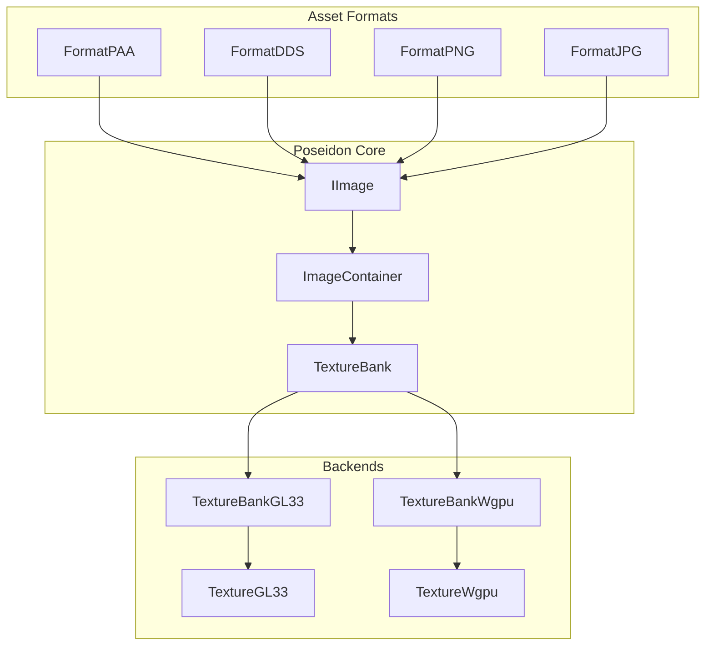
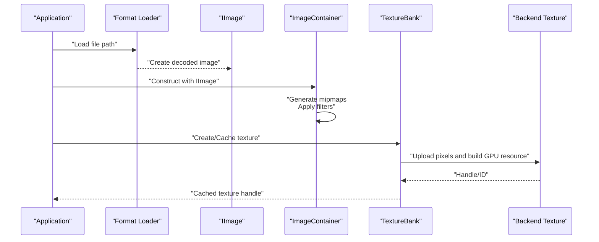
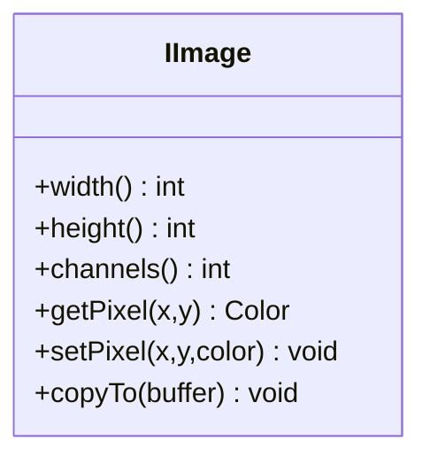
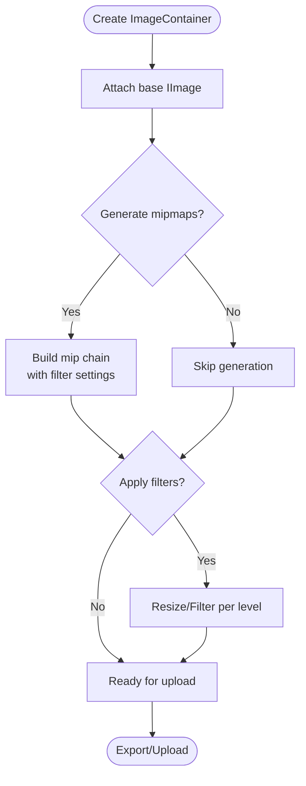
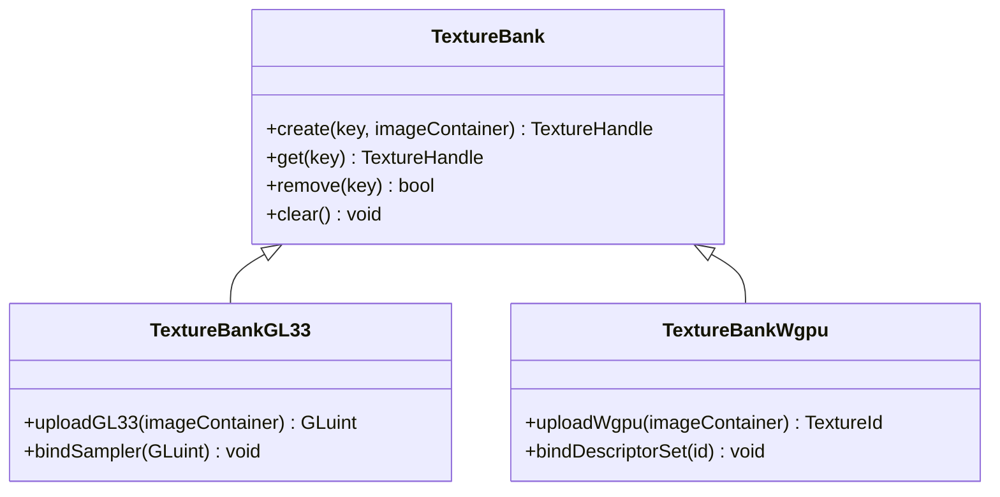
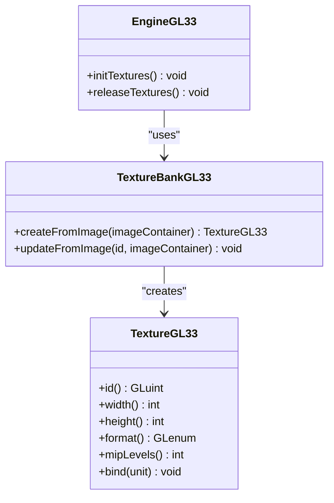
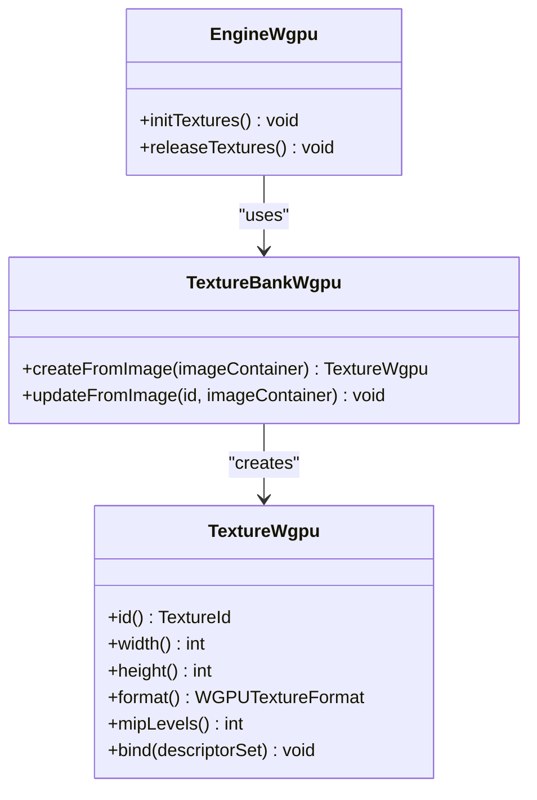
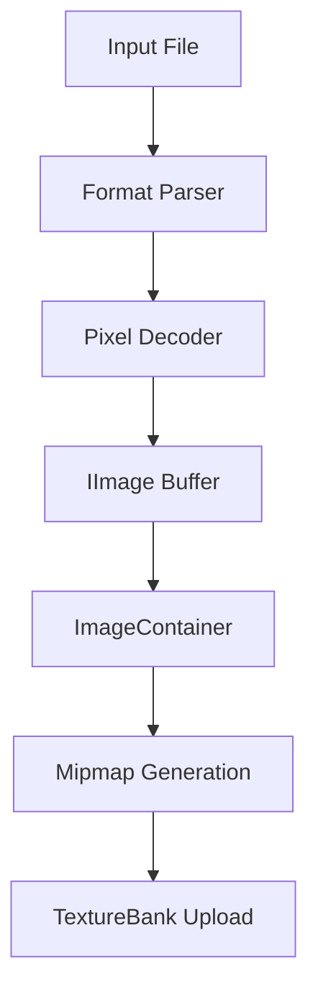
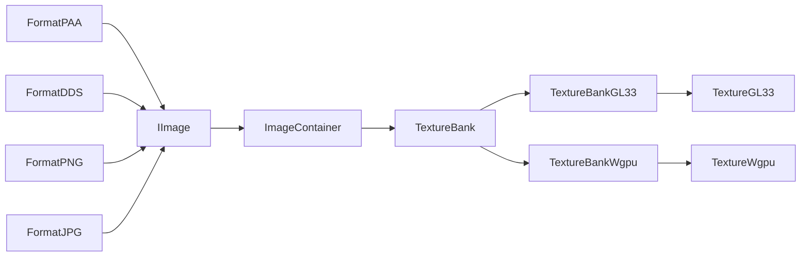
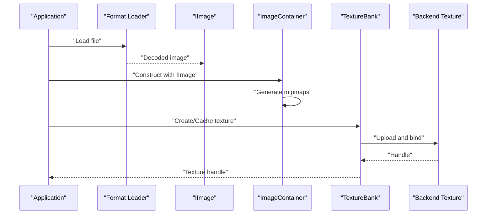

# Texture System

<cite>
**Referenced Files in This Document**
- [TextureGL33.hpp](file://engine/PoseidonGL33/TextureGL33.hpp)
- [EngineGL33_Loading.cpp](file://engine/PoseidonGL33/TextureGL33_Init.cpp)
- [TextureBankGL33_Core.cpp](file://engine/PoseidonGL33/TextureBankGL33_Core.cpp)
- [TextureBankGL33_Cache.cpp](file://engine/PoseidonGL33/TextureBankGL33_Cache.cpp)
- [TextureWgpu.hpp](file://engine/WgpuRenderer/TextureWgpu.hpp)
- [TextureWgpu.cpp](file://engine/WgpuRenderer/TextureWgpu.cpp)
- [TextureBankWgpu.hpp](file://engine/WgpuRenderer/TextureBankWgpu.hpp)
- [TextureBankWgpu.cpp](file://engine/WgpuRenderer/TextureBankWgpu.cpp)
- [GraphicsBackendGL33.cpp](file://engine/PoseidonGL33/GraphicsBackendGL33.cpp)
- [GraphicsBackendWgpu.cpp](file://engine/WgpuRenderer/GraphicsBackendWgpu.cpp)
- [IImage.hpp](file://engine/Poseidon/Textures/IImage.hpp)
- [ImageContainer.hpp](file://engine/Poseidon/Textures/ImageContainer.hpp)
- [TextureBank.hpp](file://engine/Poseidon/Textures/TextureBank.hpp)
- [FormatPAA.cpp](file://engine/Poseidon/Asset/Formats/PAA/FormatPAA.cpp)
- [FormatDDS.cpp](file://engine/Poseidon/Asset/Formats/DDS/FormatDDS.cpp)
- [FormatPNG.cpp](file://engine/Poseidon/Asset/Formats/PNG/FormatPNG.cpp)
- [FormatJPG.cpp](file://engine/Poseidon/Asset/Formats/JPG/FormatJPG.cpp)
</cite>

## Table of Contents
1. [Introduction](#introduction)
2. [Project Structure](#project-structure)
3. [Core Components](#core-components)
4. [Architecture Overview](#architecture-overview)
5. [Detailed Component Analysis](#detailed-component-analysis)
6. [Dependency Analysis](#dependency-analysis)
7. [Performance Considerations](#performance-considerations)
8. [Troubleshooting Guide](#troubleshooting-guide)
9. [Conclusion](#conclusion)
10. [Appendices](#appendices)

## Introduction
This document explains the texture system in CWR-CE with a focus on:
- Image loading and manipulation via the Image class
- Resource management through ImageContainer
- Efficient caching and lifecycle control via TextureBank
- Supported formats (PAA, DDS, PNG, JPG), compression options, and mipmapping
- Loading from various sources, memory management, and GPU upload processes
- GL33 and WGPU backend implementations as reference backends

The goal is to provide both high-level architecture understanding and detailed implementation insights for developers working with textures across CPU and GPU layers.

## Project Structure
The texture system spans several engine subsystems:
- Poseidon core abstractions define image and texture interfaces and containers
- Asset format loaders decode PAA, DDS, PNG, and JPG into pixel data
- Backend-specific implementations handle GPU resource creation and uploads for GL33 and WGPU
- TextureBank provides caching and shared ownership across the rendering pipeline

**Diagram sources**
- [IImage.hpp](file://engine/Poseidon/Textures/IImage.hpp)
- [ImageContainer.hpp](file://engine/Poseidon/Textures/ImageContainer.hpp)
- [TextureBank.hpp](file://engine/Poseidon/Textures/TextureBank.hpp)
- [FormatPAA.cpp](file://engine/Poseidon/Asset/Formats/PAA/FormatPAA.cpp)
- [FormatDDS.cpp](file://engine/Poseidon/Asset/Formats/DDS/FormatDDS.cpp)
- [FormatPNG.cpp](file://engine/Poseidon/Asset/Formats/PNG/FormatPNG.cpp)
- [FormatJPG.cpp](file://engine/Poseidon/Asset/Formats/JPG/FormatJPG.cpp)
- [TextureGL33.hpp](file://engine/PoseidonGL33/TextureGL33.hpp)
- [TextureBankGL33_Core.cpp](file://engine/PoseidonGL33/TextureBankGL33_Core.cpp)
- [TextureWgpu.hpp](file://engine/WgpuRenderer/TextureWgpu.hpp)
- [TextureBankWgpu.hpp](file://engine/WgpuRenderer/TextureBankWgpu.hpp)

**Section sources**
- [IImage.hpp](file://engine/Poseidon/Textures/IImage.hpp)
- [ImageContainer.hpp](file://engine/Poseidon/Textures/ImageContainer.hpp)
- [TextureBank.hpp](file://engine/Poseidon/Textures/TextureBank.hpp)
- [TextureGL33.hpp](file://engine/PoseidonGL33/TextureGL33.hpp)
- [TextureWgpu.hpp](file://engine/WgpuRenderer/TextureWgpu.hpp)

## Core Components
- IImage: Abstract interface representing decoded image data (dimensions, channels, pixel buffer access). Used by format loaders to produce a common representation.
- ImageContainer: Holds one or more mipmap levels and manages CPU-side memory for an image. Provides methods to create, resize, convert formats, and apply filters.
- TextureBank: Centralized cache that owns GPU textures and coordinates their lifecycle. Backends implement specific upload and binding behavior.

Key responsibilities:
- Format decoders populate IImage instances
- ImageContainer builds mipmaps and applies optional processing
- TextureBank caches textures per key and handles GPU allocation and updates

**Section sources**
- [IImage.hpp](file://engine/Poseidon/Textures/IImage.hpp)
- [ImageContainer.hpp](file://engine/Poseidon/Textures/ImageContainer.hpp)
- [TextureBank.hpp](file://engine/Poseidon/Textures/TextureBank.hpp)

## Architecture Overview
The texture pipeline flows from file decoding to GPU resources:
- Loaders read files and produce IImage objects
- ImageContainer constructs full-resolution images and generates mipmaps
- TextureBank creates backend-specific GPU textures, caches them, and exposes handles to renderers

**Diagram sources**
- [FormatPAA.cpp](file://engine/Poseidon/Asset/Formats/PAA/FormatPAA.cpp)
- [FormatDDS.cpp](file://engine/Poseidon/Asset/Formats/DDS/FormatDDS.cpp)
- [FormatPNG.cpp](file://engine/Poseidon/Asset/Formats/PNG/FormatPNG.cpp)
- [FormatJPG.cpp](file://engine/Poseidon/Asset/Formats/JPG/FormatJPG.cpp)
- [IImage.hpp](file://engine/Poseidon/Textures/IImage.hpp)
- [ImageContainer.hpp](file://engine/Poseidon/Textures/ImageContainer.hpp)
- [TextureBank.hpp](file://engine/Poseidon/Textures/TextureBank.hpp)
- [TextureGL33.hpp](file://engine/PoseidonGL33/TextureGL33.hpp)
- [TextureWgpu.hpp](file://engine/WgpuRenderer/TextureWgpu.hpp)

## Detailed Component Analysis

### IImage: Decoded Image Abstraction
- Purpose: Provide a uniform API over different format decoders
- Typical capabilities: width/height queries, channel count, pixel accessors, row stride
- Usage: Consumed by ImageContainer to build mipmaps and perform conversions

**Diagram sources**
- [IImage.hpp](file://engine/Poseidon/Textures/IImage.hpp)

**Section sources**
- [IImage.hpp](file://engine/Poseidon/Textures/IImage.hpp)

### ImageContainer: CPU-side Texture Management
- Responsibilities:
  - Hold base image and generated mip levels
  - Convert between color spaces and formats
  - Apply filters (e.g., blur, sharpen) and resizing
  - Manage memory for all levels
- Key operations:
  - Construct from IImage
  - Generate mipmaps with configurable filtering
  - Resize and re-mip
  - Export raw buffers for debugging or further processing

**Diagram sources**
- [ImageContainer.hpp](file://engine/Poseidon/Textures/ImageContainer.hpp)

**Section sources**
- [ImageContainer.hpp](file://engine/Poseidon/Textures/ImageContainer.hpp)

### TextureBank: GPU Texture Cache
- Responsibilities:
  - Cache textures keyed by logical identifiers
  - Coordinate GPU uploads via backend-specific implementations
  - Manage lifetime and sharing across systems
- GL33 and WGPU backends implement:
  - Upload paths and format mapping
  - Mip handling and sampling parameters
  - Memory management and synchronization

**Diagram sources**
- [TextureBank.hpp](file://engine/Poseidon/Textures/TextureBank.hpp)
- [TextureBankGL33_Core.cpp](file://engine/PoseidonGL33/TextureBankGL33_Core.cpp)
- [TextureBankWgpu.hpp](file://engine/WgpuRenderer/TextureBankWgpu.hpp)

**Section sources**
- [TextureBank.hpp](file://engine/Poseidon/Textures/TextureBank.hpp)
- [TextureBankGL33_Core.cpp](file://engine/PoseidonGL33/TextureBankGL33_Core.cpp)
- [TextureBankWgpu.hpp](file://engine/WgpuRenderer/TextureBankWgpu.hpp)

### GL33 Backend: OpenGL 3.3 Textures
- TextureGL33 encapsulates OpenGL texture objects and state
- TextureBankGL33 implements upload routines and sampler configuration
- EngineGL33 integration points coordinate creation and destruction

**Diagram sources**
- [TextureGL33.hpp](file://engine/PoseidonGL33/TextureGL33.hpp)
- [TextureBankGL33_Core.cpp](file://engine/PoseidonGL33/TextureBankGL33_Core.cpp)
- [EngineGL33_Loading.cpp](file://engine/PoseidonGL33/TextureGL33_Init.cpp)

**Section sources**
- [TextureGL33.hpp](file://engine/PoseidonGL33/TextureGL33.hpp)
- [TextureBankGL33_Core.cpp](file://engine/PoseidonGL33/TextureBankGL33_Core.cpp)
- [EngineGL33_Loading.cpp](file://engine/PoseidonGL33/TextureGL33_Init.cpp)

### WGPU Backend: WebGPU Textures
- TextureWgpu wraps WGPU texture resources and descriptors
- TextureBankWgpu handles uploads and descriptor set bindings
- EngineWgpu integrates lifecycle management

**Diagram sources**
- [TextureWgpu.hpp](file://engine/WgpuRenderer/TextureWgpu.hpp)
- [TextureWgpu.cpp](file://engine/WgpuRenderer/TextureWgpu.cpp)
- [TextureBankWgpu.hpp](file://engine/WgpuRenderer/TextureBankWgpu.hpp)
- [TextureBankWgpu.cpp](file://engine/WgpuRenderer/TextureBankWgpu.cpp)

**Section sources**
- [TextureWgpu.hpp](file://engine/WgpuRenderer/TextureWgpu.hpp)
- [TextureWgpu.cpp](file://engine/WgpuRenderer/TextureWgpu.cpp)
- [TextureBankWgpu.hpp](file://engine/WgpuRenderer/TextureBankWgpu.hpp)
- [TextureBankWgpu.cpp](file://engine/WgpuRenderer/TextureBankWgpu.cpp)

### Format Loaders: PAA, DDS, PNG, JPG
- Each loader decodes its format into an IImage instance
- Common steps:
  - Read file/stream
  - Parse headers and metadata
  - Decode pixel data into a contiguous buffer
  - Populate IImage with dimensions, channels, and pixel accessors
- Compression and mipmaps:
  - Some formats (DDS, PAA) may include compressed GPU formats or prebuilt mipmaps
  - For uncompressed formats (PNG, JPG), mipmaps are generated later by ImageContainer

**Diagram sources**
- [FormatPAA.cpp](file://engine/Poseidon/Asset/Formats/PAA/FormatPAA.cpp)
- [FormatDDS.cpp](file://engine/Poseidon/Asset/Formats/DDS/FormatDDS.cpp)
- [FormatPNG.cpp](file://engine/Poseidon/Asset/Formats/PNG/FormatPNG.cpp)
- [FormatJPG.cpp](file://engine/Poseidon/Asset/Formats/JPG/FormatJPG.cpp)

**Section sources**
- [FormatPAA.cpp](file://engine/Poseidon/Asset/Formats/PAA/FormatPAA.cpp)
- [FormatDDS.cpp](file://engine/Poseidon/Asset/Formats/DDS/FormatDDS.cpp)
- [FormatPNG.cpp](file://engine/Poseidon/Asset/Formats/PNG/FormatPNG.cpp)
- [FormatJPG.cpp](file://engine/Poseidon/Asset/Formats/JPG/FormatJPG.cpp)

## Dependency Analysis
- Format loaders depend on IImage to expose decoded data
- ImageContainer depends on IImage and performs CPU-side transformations
- TextureBank abstracts backend details; GL33 and WGPU implementations depend on respective graphics APIs
- GraphicsBackend files integrate texture lifecycles with engine initialization and shutdown

**Diagram sources**
- [FormatPAA.cpp](file://engine/Poseidon/Asset/Formats/PAA/FormatPAA.cpp)
- [FormatDDS.cpp](file://engine/Poseidon/Asset/Formats/DDS/FormatDDS.cpp)
- [FormatPNG.cpp](file://engine/Poseidon/Asset/Formats/PNG/FormatPNG.cpp)
- [FormatJPG.cpp](file://engine/Poseidon/Asset/Formats/JPG/FormatJPG.cpp)
- [IImage.hpp](file://engine/Poseidon/Textures/IImage.hpp)
- [ImageContainer.hpp](file://engine/Poseidon/Textures/ImageContainer.hpp)
- [TextureBank.hpp](file://engine/Poseidon/Textures/TextureBank.hpp)
- [TextureBankGL33_Core.cpp](file://engine/PoseidonGL33/TextureBankGL33_Core.cpp)
- [TextureBankWgpu.hpp](file://engine/WgpuRenderer/TextureBankWgpu.hpp)
- [TextureGL33.hpp](file://engine/PoseidonGL33/TextureGL33.hpp)
- [TextureWgpu.hpp](file://engine/WgpuRenderer/TextureWgpu.hpp)

**Section sources**
- [GraphicsBackendGL33.cpp](file://engine/PoseidonGL33/GraphicsBackendGL33.cpp)
- [GraphicsBackendWgpu.cpp](file://engine/WgpuRenderer/GraphicsBackendWgpu.cpp)

## Performance Considerations
- Prefer GPU-compressed formats when available (DDS, PAA) to reduce bandwidth and VRAM usage
- Generate mipmaps once during asset load; avoid runtime regeneration unless necessary
- Use TextureBank to share textures across systems and minimize duplicate allocations
- Batch texture uploads where possible to reduce driver overhead
- Choose appropriate filtering modes (nearest vs linear) based on use case to balance quality and performance
- Monitor memory footprint of large textures and consider streaming or tiling strategies for very large assets

[No sources needed since this section provides general guidance]

## Troubleshooting Guide
Common issues and resolutions:
- Missing or corrupted textures:
  - Verify format loader success and IImage validity
  - Check file paths and permissions
- Incorrect colors or alpha:
  - Ensure proper sRGB handling and channel ordering
  - Validate conversion steps in ImageContainer
- Poor visual quality at distance:
  - Confirm mipmaps are generated and sampled correctly
  - Adjust filtering and anisotropy settings
- GPU upload failures:
  - Inspect backend-specific error logs
  - Validate supported formats and maximum texture sizes

**Section sources**
- [TextureGL33.hpp](file://engine/PoseidonGL33/TextureGL33.hpp)
- [TextureWgpu.hpp](file://engine/WgpuRenderer/TextureWgpu.hpp)
- [TextureBankGL33_Core.cpp](file://engine/PoseidonGL33/TextureBankGL33_Core.cpp)
- [TextureBankWgpu.hpp](file://engine/WgpuRenderer/TextureBankWgpu.hpp)

## Conclusion
CWR-CE’s texture system separates concerns cleanly:
- Format loaders produce standardized IImage data
- ImageContainer manages CPU-side resources and preprocessing
- TextureBank coordinates GPU uploads and caching with backend-specific implementations
This design enables flexible format support, efficient reuse, and smooth integration with multiple graphics backends.

[No sources needed since this section summarizes without analyzing specific files]

## Appendices

### Creating Textures: Example Workflow
- Load a file using the appropriate format loader to obtain an IImage
- Wrap the IImage in an ImageContainer and generate mipmaps
- Request a cached texture from TextureBank, which uploads to the GPU via the active backend
- Bind the resulting texture handle in shaders as needed

**Diagram sources**
- [FormatPAA.cpp](file://engine/Poseidon/Asset/Formats/PAA/FormatPAA.cpp)
- [FormatDDS.cpp](file://engine/Poseidon/Asset/Formats/DDS/FormatDDS.cpp)
- [FormatPNG.cpp](file://engine/Poseidon/Asset/Formats/PNG/FormatPNG.cpp)
- [FormatJPG.cpp](file://engine/Poseidon/Asset/Formats/JPG/FormatJPG.cpp)
- [IImage.hpp](file://engine/Poseidon/Textures/IImage.hpp)
- [ImageContainer.hpp](file://engine/Poseidon/Textures/ImageContainer.hpp)
- [TextureBank.hpp](file://engine/Poseidon/Textures/TextureBank.hpp)
- [TextureGL33.hpp](file://engine/PoseidonGL33/TextureGL33.hpp)
- [TextureWgpu.hpp](file://engine/WgpuRenderer/TextureWgpu.hpp)

### Applying Filters and Conversions
- Use ImageContainer to apply filters such as blur or sharpen before mip generation
- Convert color spaces or channel layouts if required by downstream pipelines
- Rebuild mipmaps after any transformation to ensure correct sampling

**Section sources**
- [ImageContainer.hpp](file://engine/Poseidon/Textures/ImageContainer.hpp)

### Handling Format Conversions
- When converting between formats, ensure consistent channel counts and byte orders
- Validate target GPU format compatibility with the selected backend
- Prefer native compressed formats when available to minimize memory and bandwidth

**Section sources**
- [FormatPAA.cpp](file://engine/Poseidon/Asset/Formats/PAA/FormatPAA.cpp)
- [FormatDDS.cpp](file://engine/Poseidon/Asset/Formats/DDS/FormatDDS.cpp)
- [FormatPNG.cpp](file://engine/Poseidon/Asset/Formats/PNG/FormatPNG.cpp)
- [FormatJPG.cpp](file://engine/Poseidon/Asset/Formats/JPG/FormatJPG.cpp)