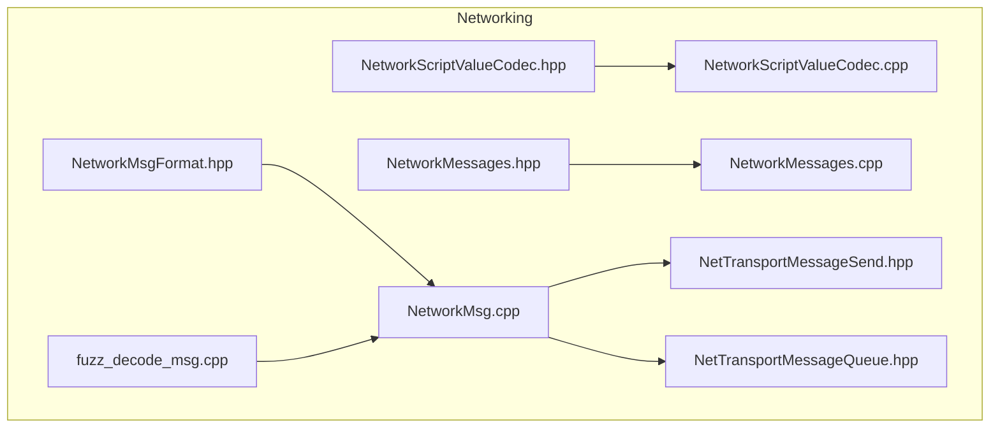
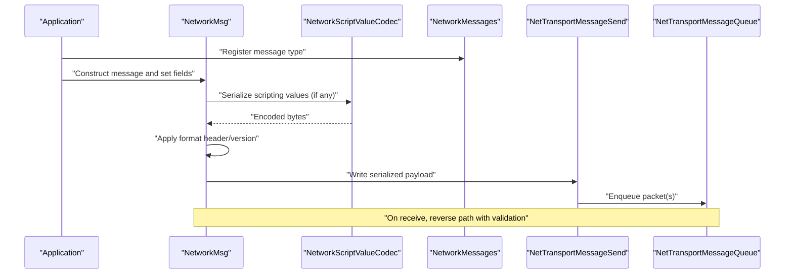
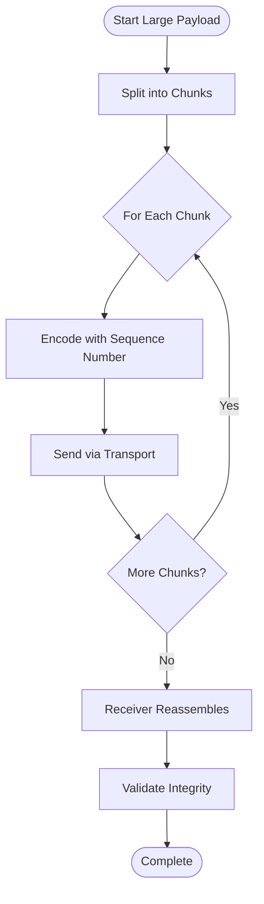
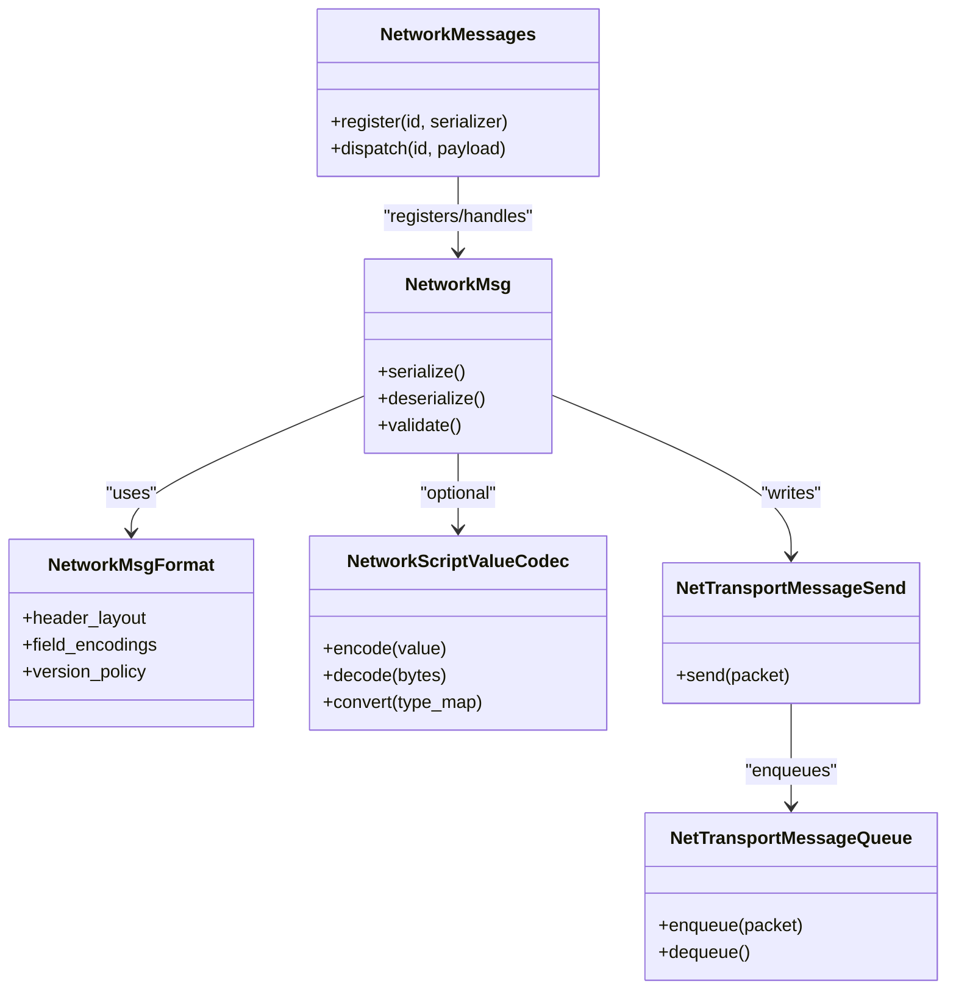

# Message Serialization

<cite>
**Referenced Files in This Document**
- [NetworkMsgFormat.hpp](file://engine/Poseidon/Network/NetworkMsgFormat.hpp)
- [NetworkMsg.cpp](file://engine/Poseidon/Network/NetworkMsg.cpp)
- [NetworkScriptValueCodec.hpp](file://engine/Poseidon/Network/NetworkScriptValueCodec.hpp)
- [NetworkScriptValueCodec.cpp](file://engine/Poseidon/Network/NetworkScriptValueCodec.cpp)
- [NetworkMessages.hpp](file://engine/Poseidon/Network/NetworkMessages.hpp)
- [NetworkMessages.cpp](file://engine/Poseidon/Network/NetworkMessages.cpp)
- [NetTransportMessageSend.hpp](file://engine/Poseidon/Network/NetTransportMessageSend.hpp)
- [NetTransportMessageQueue.hpp](file://engine/Poseidon/Network/NetTransportMessageQueue.hpp)
- [fuzz_decode_msg.cpp](file://apps/fuzzers/Fuzzer/fuzz_decode_msg.cpp)
</cite>

## Table of Contents
1. Introduction
2. Project Structure
3. Core Components
4. Architecture Overview
5. Detailed Component Analysis
6. Dependency Analysis
7. Performance Considerations
8. Troubleshooting Guide
9. Conclusion

## Introduction
This document explains message serialization and deserialization in CWR-CE’s networking system. It focuses on the binary NetworkMsg format, supported data types, version compatibility, and the NetworkScriptValueCodec for scripting interoperability. It also provides guidance for creating custom messages, handling large payloads, optimizing performance, validating messages, recovering from errors, ensuring backward compatibility, and debugging network traffic.

## Project Structure
The networking subsystem is primarily implemented under engine/Poseidon/Network. The most relevant files for serialization are:
- NetworkMsgFormat.hpp: Defines the wire format and serialization primitives.
- NetworkMsg.cpp: Implements message framing, encoding, decoding, and validation.
- NetworkScriptValueCodec.{hpp,cpp}: Bridges scripting values to/from the wire format.
- NetworkMessages.{hpp,cpp}: Declares and registers concrete message types.
- NetTransport* headers: Provide transport abstractions used by send/receive paths.
- fuzz_decode_msg.cpp: Fuzzing harness for robustness testing of decoders.

**Diagram sources**
- [NetworkMsgFormat.hpp](file://engine/Poseidon/Network/NetworkMsgFormat.hpp)
- [NetworkMsg.cpp](file://engine/Poseidon/Network/NetworkMsg.cpp)
- [NetworkScriptValueCodec.hpp](file://engine/Poseidon/Network/NetworkScriptValueCodec.hpp)
- [NetworkScriptValueCodec.cpp](file://engine/Poseidon/Network/NetworkScriptValueCodec.cpp)
- [NetworkMessages.hpp](file://engine/Poseidon/Network/NetworkMessages.hpp)
- [NetworkMessages.cpp](file://engine/Poseidon/Network/NetworkMessages.cpp)
- [NetTransportMessageSend.hpp](file://engine/Poseidon/Network/NetTransportMessageSend.hpp)
- [NetTransportMessageQueue.hpp](file://engine/Poseidon/Network/NetTransportMessageQueue.hpp)
- [fuzz_decode_msg.cpp](file://apps/fuzzers/Fuzzer/fuzz_decode_msg.cpp)

**Section sources**
- [NetworkMsgFormat.hpp](file://engine/Poseidon/Network/NetworkMsgFormat.hpp)
- [NetworkMsg.cpp](file://engine/Poseidon/Network/NetworkMsg.cpp)
- [NetworkScriptValueCodec.hpp](file://engine/Poseidon/Network/NetworkScriptValueCodec.hpp)
- [NetworkScriptValueCodec.cpp](file://engine/Poseidon/Network/NetworkScriptValueCodec.cpp)
- [NetworkMessages.hpp](file://engine/Poseidon/Network/NetworkMessages.hpp)
- [NetworkMessages.cpp](file://engine/Poseidon/Network/NetworkMessages.cpp)
- [NetTransportMessageSend.hpp](file://engine/Poseidon/Network/NetTransportMessageSend.hpp)
- [NetTransportMessageQueue.hpp](file://engine/Poseidon/Network/NetTransportMessageQueue.hpp)
- [fuzz_decode_msg.cpp](file://apps/fuzzers/Fuzzer/fuzz_decode_msg.cpp)

## Core Components
- NetworkMsgFormat: Defines the binary layout, field encodings, and versioning strategy for messages.
- NetworkMsg: Encapsulates a serialized message with methods to serialize/deserialize fields, validate integrity, and manage buffers.
- NetworkScriptValueCodec: Converts between scripting language values and the wire format, supporting dynamic typing and safe conversions.
- NetworkMessages: Central registry of message IDs and their serializers/deserializers.
- Transport integration: Uses NetTransportMessageSend and NetTransportMessageQueue for sending and queuing serialized packets.

Key responsibilities:
- Efficient binary packing/unpacking with minimal allocations.
- Strict validation and error reporting during decode.
- Version negotiation and compatibility checks.
- Safe handling of scripting values across boundaries.

**Section sources**
- [NetworkMsgFormat.hpp](file://engine/Poseidon/Network/NetworkMsgFormat.hpp)
- [NetworkMsg.cpp](file://engine/Poseidon/Network/NetworkMsg.cpp)
- [NetworkScriptValueCodec.hpp](file://engine/Poseidon/Network/NetworkScriptValueCodec.hpp)
- [NetworkScriptValueCodec.cpp](file://engine/Poseidon/Network/NetworkScriptValueCodec.cpp)
- [NetworkMessages.hpp](file://engine/Poseidon/Network/NetworkMessages.hpp)
- [NetworkMessages.cpp](file://engine/Poseidon/Network/NetworkMessages.cpp)
- [NetTransportMessageSend.hpp](file://engine/Poseidon/Network/NetTransportMessageSend.hpp)
- [NetTransportMessageQueue.hpp](file://engine/Poseidon/Network/NetTransportMessageQueue.hpp)

## Architecture Overview
The serialization pipeline integrates message formatting, codec conversion, and transport layers.

**Diagram sources**
- [NetworkMsg.cpp](file://engine/Poseidon/Network/NetworkMsg.cpp)
- [NetworkScriptValueCodec.cpp](file://engine/Poseidon/Network/NetworkScriptValueCodec.cpp)
- [NetworkMessages.cpp](file://engine/Poseidon/Network/NetworkMessages.cpp)
- [NetTransportMessageSend.hpp](file://engine/Poseidon/Network/NetTransportMessageSend.hpp)
- [NetTransportMessageQueue.hpp](file://engine/Poseidon/Network/NetTransportMessageQueue.hpp)

## Detailed Component Analysis

### NetworkMsg Format and Binary Layout
- Purpose: Define a compact, versioned binary representation for all network messages.
- Key aspects:
  - Header includes message ID, version, and length metadata.
  - Field encoding uses fixed-width primitives where possible; variable-length fields use length prefixes.
  - Endianness and alignment are explicitly handled to ensure cross-platform compatibility.
  - Validation routines check bounds, lengths, and type tags before reading fields.

Best practices:
- Keep hot-path fields at fixed offsets to avoid branching.
- Use bitfields sparingly; prefer aligned integers for speed.
- Enforce maximum sizes for strings/blobs to prevent memory exhaustion.

**Section sources**
- [NetworkMsgFormat.hpp](file://engine/Poseidon/Network/NetworkMsgFormat.hpp)
- [NetworkMsg.cpp](file://engine/Poseidon/Network/NetworkMsg.cpp)

### Supported Data Types and Version Compatibility
- Primitive types: integers (signed/unsigned), floats, booleans, enums.
- Composite types: arrays/vectors, maps/dictionaries, nested structures.
- Strings and blobs: UTF-8 strings and raw byte buffers with explicit length.
- Scripting values: variant-like containers bridged via NetworkScriptValueCodec.
- Versioning:
  - Global protocol version and per-message versions.
  - Backward-compatible additions via optional fields and default values.
  - Deprecation flags and migration helpers when needed.

Compatibility strategies:
- Always read unknown fields safely using type tags and length skipping.
- Validate minimum required fields before processing.
- Reject messages with unsupported versions or incompatible layouts.

**Section sources**
- [NetworkMsgFormat.hpp](file://engine/Poseidon/Network/NetworkMsgFormat.hpp)
- [NetworkMsg.cpp](file://engine/Poseidon/Network/NetworkMsg.cpp)

### NetworkScriptValueCodec for Scripting Interoperability
- Purpose: Serialize/deserialize scripting language values into the wire format while preserving dynamic types.
- Features:
  - Type-safe mapping between scripting variants and C++ types.
  - Conversion rules for numeric coercion, string encoding, and container iteration.
  - Error propagation for invalid conversions or out-of-range values.
- Usage:
  - Wrap scripting values before placing them in message fields.
  - Decode received values back into scripting-friendly containers.

Error handling:
- Fail fast on invalid types or malformed data.
- Provide detailed diagnostics for failed conversions.

**Section sources**
- [NetworkScriptValueCodec.hpp](file://engine/Poseidon/Network/NetworkScriptValueCodec.hpp)
- [NetworkScriptValueCodec.cpp](file://engine/Poseidon/Network/NetworkScriptValueCodec.cpp)

### Creating Custom Message Types
Steps:
1. Define a message ID and register it in the central registry.
2. Implement serializer/deserializer functions adhering to the NetworkMsg format.
3. Include validation checks for field ranges and consistency.
4. Integrate with NetworkMessages to enable routing and dispatch.

Guidelines:
- Keep message size small for frequent updates; batch large data separately.
- Avoid heavy allocations in hot paths; reuse buffers where possible.
- Ensure idempotent serialization for reliable retransmission.

**Section sources**
- [NetworkMessages.hpp](file://engine/Poseidon/Network/NetworkMessages.hpp)
- [NetworkMessages.cpp](file://engine/Poseidon/Network/NetworkMessages.cpp)
- [NetworkMsg.cpp](file://engine/Poseidon/Network/NetworkMsg.cpp)

### Handling Large Payloads
Recommendations:
- Split large payloads into chunks with sequence numbers and reassembly logic.
- Use streaming writes to avoid buffering entire payloads in memory.
- Apply compression selectively for non-hot data to reduce bandwidth.
- Enforce strict size limits and timeouts to mitigate abuse.

Flow for chunked transfer:

[No diagram sources since this is a conceptual flow]

### Optimizing Serialization Performance
- Prefer contiguous memory layouts and avoid unnecessary copies.
- Use pre-sized buffers and reserve capacity for vectors/strings.
- Minimize branching in encode/decode paths; use lookup tables for enums.
- Batch multiple small messages when appropriate.
- Profile hot paths with sampling profilers and adjust accordingly.

**Section sources**
- [NetworkMsg.cpp](file://engine/Poseidon/Network/NetworkMsg.cpp)
- [NetTransportMessageSend.hpp](file://engine/Poseidon/Network/NetTransportMessageSend.hpp)

### Message Validation, Error Recovery, and Backward Compatibility
Validation:
- Check message length against declared sizes.
- Verify type tags and field presence.
- Validate numeric ranges and enum values.
- Ensure cryptographic or checksum fields match when applicable.

Error recovery:
- Drop malformed messages and log diagnostic details.
- Attempt graceful fallbacks (e.g., default values) only for safe fields.
- Maintain connection state consistent after errors.

Backward compatibility:
- Add new fields as optional with defaults.
- Preserve existing field order and semantics.
- Use version gating for breaking changes.

**Section sources**
- [NetworkMsg.cpp](file://engine/Poseidon/Network/NetworkMsg.cpp)
- [NetworkMsgFormat.hpp](file://engine/Poseidon/Network/NetworkMsgFormat.hpp)

### Debugging Tools for Message Inspection and Traffic Analysis
- Fuzzing harness: fuzz_decode_msg.cpp exercises decoders with random inputs to uncover edge cases.
- Logging: Enable verbose logging around encode/decode boundaries to capture payloads and errors.
- Packet inspection: Capture raw frames and correlate with decoded messages using message IDs and timestamps.
- Unit tests: Assert round-trip behavior for critical messages and codecs.

Practical steps:
- Run the fuzzer against decoder paths to find crashes or undefined behavior.
- Use structured logs with message IDs, versions, and sizes for quick triage.
- Compare expected vs actual decoded values in tests to catch regressions.

**Section sources**
- [fuzz_decode_msg.cpp](file://apps/fuzzers/Fuzzer/fuzz_decode_msg.cpp)
- [NetworkMsg.cpp](file://engine/Poseidon/Network/NetworkMsg.cpp)

## Dependency Analysis
Serialization components interact through clear interfaces:
- NetworkMsg depends on NetworkMsgFormat for layout definitions.
- NetworkScriptValueCodec is used by NetworkMsg when scripting values are present.
- NetworkMessages provides registration and dispatch for message handlers.
- NetTransportMessageSend and NetTransportMessageQueue handle low-level packetization and queuing.

**Diagram sources**
- [NetworkMsg.cpp](file://engine/Poseidon/Network/NetworkMsg.cpp)
- [NetworkMsgFormat.hpp](file://engine/Poseidon/Network/NetworkMsgFormat.hpp)
- [NetworkScriptValueCodec.hpp](file://engine/Poseidon/Network/NetworkScriptValueCodec.hpp)
- [NetworkScriptValueCodec.cpp](file://engine/Poseidon/Network/NetworkScriptValueCodec.cpp)
- [NetworkMessages.hpp](file://engine/Poseidon/Network/NetworkMessages.hpp)
- [NetworkMessages.cpp](file://engine/Poseidon/Network/NetworkMessages.cpp)
- [NetTransportMessageSend.hpp](file://engine/Poseidon/Network/NetTransportMessageSend.hpp)
- [NetTransportMessageQueue.hpp](file://engine/Poseidon/Network/NetTransportMessageQueue.hpp)

**Section sources**
- [NetworkMsg.cpp](file://engine/Poseidon/Network/NetworkMsg.cpp)
- [NetworkMsgFormat.hpp](file://engine/Poseidon/Network/NetworkMsgFormat.hpp)
- [NetworkScriptValueCodec.hpp](file://engine/Poseidon/Network/NetworkScriptValueCodec.hpp)
- [NetworkScriptValueCodec.cpp](file://engine/Poseidon/Network/NetworkScriptValueCodec.cpp)
- [NetworkMessages.hpp](file://engine/Poseidon/Network/NetworkMessages.hpp)
- [NetworkMessages.cpp](file://engine/Poseidon/Network/NetworkMessages.cpp)
- [NetTransportMessageSend.hpp](file://engine/Poseidon/Network/NetTransportMessageSend.hpp)
- [NetTransportMessageQueue.hpp](file://engine/Poseidon/Network/NetTransportMessageQueue.hpp)

## Performance Considerations
- Memory allocation: Pre-allocate buffers and reuse them across messages.
- CPU usage: Minimize branches and function calls in encode/decode loops.
- Bandwidth: Compress large, infrequent payloads; keep frequent messages lean.
- Concurrency: Separate serialization threads from I/O threads to avoid blocking.
- Profiling: Identify hotspots with sampling tools and optimize critical paths.

[No sources needed since this section provides general guidance]

## Troubleshooting Guide
Common issues and resolutions:
- Mismatched versions: Ensure sender and receiver agree on protocol/message versions; reject incompatible messages early.
- Buffer overruns: Validate lengths before reads; enforce maximum sizes.
- Invalid scripting values: Use NetworkScriptValueCodec conversion rules and log detailed errors.
- Fragmentation: Handle partial reads and reassemble chunks correctly.
- Fuzz failures: Reproduce with minimal inputs captured by the fuzzer and add regression tests.

Debugging tips:
- Enable detailed logs around encode/decode boundaries.
- Use the fuzzer to stress-test decoders regularly.
- Inspect raw packets and correlate with decoded messages.

**Section sources**
- [fuzz_decode_msg.cpp](file://apps/fuzzers/Fuzzer/fuzz_decode_msg.cpp)
- [NetworkMsg.cpp](file://engine/Poseidon/Network/NetworkMsg.cpp)

## Conclusion
CWR-CE’s networking serialization layer centers on a well-defined binary format, robust message handling, and a flexible scripting value codec. By following the guidelines for custom messages, large payloads, performance optimization, validation, and debugging, developers can build reliable, efficient, and maintainable network communication. Continuous fuzzing and careful version management ensure long-term stability and compatibility.