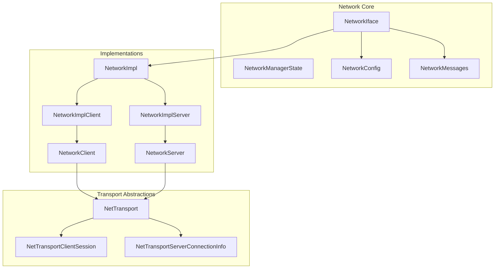
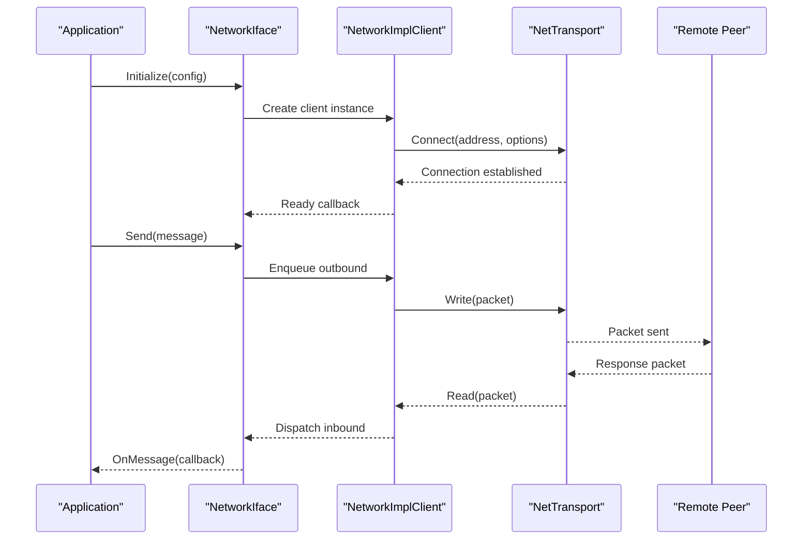
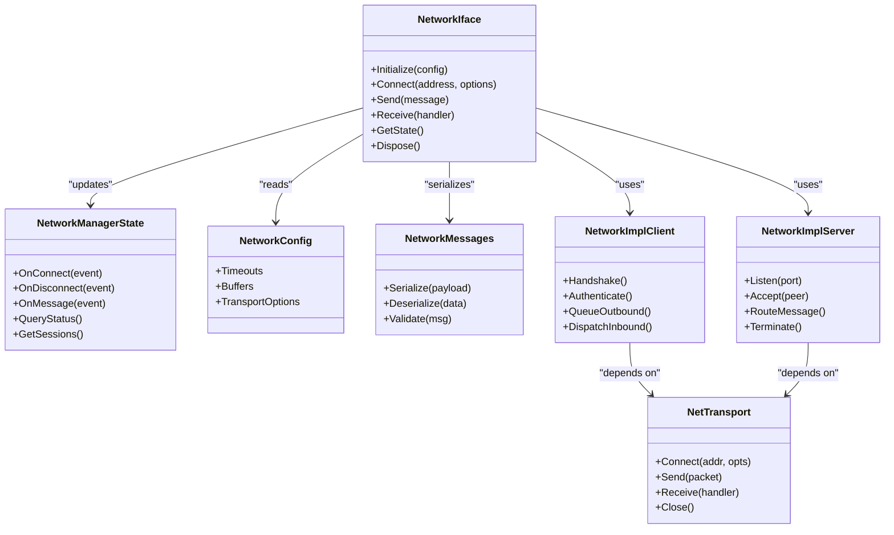

# Network Interface

<cite>
**Referenced Files in This Document**
- [NetworkIface.hpp](file://engine/Poseidon/Network/NetworkIface.hpp)
- [NetworkManagerState.hpp](file://engine/Poseidon/Network/NetworkManagerState.hpp)
- [Network.cpp](file://engine/Poseidon/Network/Network.cpp)
- [NetworkClient.cpp](file://engine/Poseidon/Network/NetworkClient.cpp)
- [NetworkServer.cpp](file://engine/Poseidon/Network/NetworkServer.cpp)
- [NetworkImpl.hpp](file://engine/Poseidon/Network/NetworkImpl.hpp)
- [NetworkImplClient.hpp](file://engine/Poseidon/Network/NetworkImplClient.hpp)
- [NetworkImplServer.hpp](file://engine/Poseidon/Network/NetworkImplServer.hpp)
- [NetTransport.hpp](file://engine/Poseidon/Network/NetTransport.hpp)
- [NetTransportClientSession.hpp](file://engine/Poseidon/Network/NetTransportClientSession.hpp)
- [NetTransportServerConnectionInfo.hpp](file://engine/Poseidon/Network/NetTransportServerConnectionInfo.hpp)
- [NetworkConfig.hpp](file://engine/Poseidon/Network/NetworkConfig.hpp)
- [NetworkMessages.hpp](file://engine/Poseidon/Network/NetworkMessages.hpp)
- [NetworkMsgContext.cpp](file://engine/Poseidon/Network/NetworkMsgContext.cpp)
- [NetworkPlayerRoleAssignment.hpp](file://engine/Poseidon/Network/NetworkPlayerRoleAssignment.hpp)
</cite>

## Table of Contents
1. [Introduction](#introduction)
2. [Project Structure](#project-structure)
3. [Core Components](#core-components)
4. [Architecture Overview](#architecture-overview)
5. [Detailed Component Analysis](#detailed-component-analysis)
6. [Dependency Analysis](#dependency-analysis)
7. [Performance Considerations](#performance-considerations)
8. [Troubleshooting Guide](#troubleshooting-guide)
9. [Conclusion](#conclusion)
10. [Appendices](#appendices)

## Introduction
This document provides detailed API documentation for the core Network interface in CWR-CE, focusing on the NetworkIface class and related components that manage connection establishment, message sending/receiving, and network state management. It also covers NetworkManagerState for tracking connection states, player sessions, and lifecycle events. Guidance is included for initializing connections, handling asynchronous operations, managing resources, error handling patterns, timeout management, health monitoring, and implementing custom backends or integrating with different transport protocols.

## Project Structure
The networking subsystem resides under engine/Poseidon/Network and is organized into:
- Public interfaces and entry points (e.g., NetworkIface, NetworkManagerState)
- Client/server implementations and their internal abstractions
- Transport layer abstractions and session/connection info types
- Configuration, messaging, and context utilities
- Player role assignment and validation helpers

**Diagram sources**
- [NetworkIface.hpp](file://engine/Poseidon/Network/NetworkIface.hpp)
- [NetworkManagerState.hpp](file://engine/Poseidon/Network/NetworkManagerState.hpp)
- [NetworkConfig.hpp](file://engine/Poseidon/Network/NetworkConfig.hpp)
- [NetworkMessages.hpp](file://engine/Poseidon/Network/NetworkMessages.hpp)
- [NetworkImpl.hpp](file://engine/Poseidon/Network/NetworkImpl.hpp)
- [NetworkImplClient.hpp](file://engine/Poseidon/Network/NetworkImplClient.hpp)
- [NetworkImplServer.hpp](file://engine/Poseidon/Network/NetworkImplServer.hpp)
- [NetworkClient.cpp](file://engine/Poseidon/Network/NetworkClient.cpp)
- [NetworkServer.cpp](file://engine/Poseidon/Network/NetworkServer.cpp)
- [NetTransport.hpp](file://engine/Poseidon/Network/NetTransport.hpp)
- [NetTransportClientSession.hpp](file://engine/Poseidon/Network/NetTransportClientSession.hpp)
- [NetTransportServerConnectionInfo.hpp](file://engine/Poseidon/Network/NetTransportServerConnectionInfo.hpp)

**Section sources**
- [NetworkIface.hpp](file://engine/Poseidon/Network/NetworkIface.hpp)
- [NetworkManagerState.hpp](file://engine/Poseidon/Network/NetworkManagerState.hpp)
- [NetworkConfig.hpp](file://engine/Poseidon/Network/NetworkConfig.hpp)
- [NetworkMessages.hpp](file://engine/Poseidon/Network/NetworkMessages.hpp)
- [NetworkImpl.hpp](file://engine/Poseidon/Network/NetworkImpl.hpp)
- [NetworkImplClient.hpp](file://engine/Poseidon/Network/NetworkImplClient.hpp)
- [NetworkImplServer.hpp](file://engine/Poseidon/Network/NetworkImplServer.hpp)
- [NetworkClient.cpp](file://engine/Poseidon/Network/NetworkClient.cpp)
- [NetworkServer.cpp](file://engine/Poseidon/Network/NetworkServer.cpp)
- [NetTransport.hpp](file://engine/Poseidon/Network/NetTransport.hpp)
- [NetTransportClientSession.hpp](file://engine/Poseidon/Network/NetTransportClientSession.hpp)
- [NetTransportServerConnectionInfo.hpp](file://engine/Poseidon/Network/NetTransportServerConnectionInfo.hpp)

## Core Components
- NetworkIface: The primary entry point for all network operations. It exposes methods to initialize connections, send and receive messages, and query/manage network state. It abstracts client/server roles and delegates to concrete implementations.
- NetworkManagerState: Tracks connection states, player sessions, and lifecycle events. Provides a centralized view of the network’s current status and history.
- NetworkConfig: Holds configuration parameters such as timeouts, buffer sizes, and transport-specific settings.
- NetworkMessages: Defines message types, serialization formats, and common payloads used across the network stack.
- NetTransport: Abstract transport interface for underlying protocols (e.g., TCP/UDP). Encapsulates low-level send/receive operations and channel semantics.
- NetworkImpl/NetworkImplClient/NetworkImplServer: Internal implementation classes that bridge NetworkIface to specific client/server behaviors and transport layers.

Key responsibilities:
- Connection lifecycle: create, connect, authenticate, disconnect, reconnect.
- Message pipeline: enqueue outgoing messages, dispatch incoming messages, handle acknowledgments and retransmissions.
- State management: track peers, players, channels, and session metadata.
- Error handling: propagate errors from transports, enforce timeouts, and surface diagnostics.

**Section sources**
- [NetworkIface.hpp](file://engine/Poseidon/Network/NetworkIface.hpp)
- [NetworkManagerState.hpp](file://engine/Poseidon/Network/NetworkManagerState.hpp)
- [NetworkConfig.hpp](file://engine/Poseidon/Network/NetworkConfig.hpp)
- [NetworkMessages.hpp](file://engine/Poseidon/Network/NetworkMessages.hpp)
- [NetTransport.hpp](file://engine/Poseidon/Network/NetTransport.hpp)
- [NetworkImpl.hpp](file://engine/Poseidon/Network/NetworkImpl.hpp)
- [NetworkImplClient.hpp](file://engine/Poseidon/Network/NetworkImplClient.hpp)
- [NetworkImplServer.hpp](file://engine/Poseidon/Network/NetworkImplServer.hpp)

## Architecture Overview
The Network subsystem follows a layered architecture:
- Application layer uses NetworkIface for high-level operations.
- Implementation layer (NetworkImpl*) translates application calls into transport actions.
- Transport layer (NetTransport) abstracts protocol specifics and manages sockets, channels, and packet framing.
- Messaging layer (NetworkMessages + NetworkMsgContext) handles serialization, routing, and per-message context.

**Diagram sources**
- [NetworkIface.hpp](file://engine/Poseidon/Network/NetworkIface.hpp)
- [NetworkImplClient.hpp](file://engine/Poseidon/Network/NetworkImplClient.hpp)
- [NetTransport.hpp](file://engine/Poseidon/Network/NetTransport.hpp)
- [NetworkMessages.hpp](file://engine/Poseidon/Network/NetworkMessages.hpp)

## Detailed Component Analysis

### NetworkIface
Responsibilities:
- Provide unified API for client and server operations.
- Manage initialization, connection lifecycle, and resource cleanup.
- Expose message send/receive APIs with callbacks or async results.
- Query and update network state via NetworkManagerState.

Typical usage patterns:
- Initialize with NetworkConfig.
- Establish connection (client) or start listening (server).
- Register message handlers.
- Send messages asynchronously; handle completion callbacks.
- Monitor state changes and handle errors.

Error handling:
- Propagate transport errors up through callbacks or result objects.
- Enforce timeouts and retry policies where applicable.
- Surface diagnostic information for debugging.

**Section sources**
- [NetworkIface.hpp](file://engine/Poseidon/Network/NetworkIface.hpp)
- [Network.cpp](file://engine/Poseidon/Network/Network.cpp)

### NetworkManagerState
Responsibilities:
- Track connection states (disconnected, connecting, connected, disconnecting).
- Maintain player sessions and peer metadata.
- Emit lifecycle events (onConnect, onDisconnect, onError, onMessage).
- Provide snapshot queries for UI and diagnostics.

Common operations:
- Subscribe to state change events.
- Query current connection status and peer list.
- Inspect session details and recent events.

**Section sources**
- [NetworkManagerState.hpp](file://engine/Poseidon/Network/NetworkManagerState.hpp)

### NetworkConfig
Responsibilities:
- Define timeouts (connect, read, write), buffer sizes, and retry limits.
- Configure transport-specific options (protocol, encryption, compression).
- Set logging levels and diagnostic flags.

Best practices:
- Use conservative defaults for production.
- Tune timeouts based on expected latency and reliability requirements.
- Enable diagnostics during development and testing.

**Section sources**
- [NetworkConfig.hpp](file://engine/Poseidon/Network/NetworkConfig.hpp)

### NetworkMessages and NetworkMsgContext
Responsibilities:
- Define message schemas and serialization formats.
- Provide per-message context (source, destination, priority, timestamps).
- Support routing and filtering of inbound/outbound messages.

Usage guidance:
- Serialize payloads consistently across client/server.
- Use context fields for tracing and QoS.
- Validate message integrity before processing.

**Section sources**
- [NetworkMessages.hpp](file://engine/Poseidon/Network/NetworkMessages.hpp)
- [NetworkMsgContext.cpp](file://engine/Poseidon/Network/NetworkMsgContext.cpp)

### NetTransport and Session/Connection Info
Responsibilities:
- Abstract low-level socket operations and packet framing.
- Manage channels, multiplexing, and flow control.
- Provide connection/session metadata for diagnostics.

Integration points:
- Implement custom transports by adhering to NetTransport interface.
- Use session/connection info to monitor performance and health.

**Section sources**
- [NetTransport.hpp](file://engine/Poseidon/Network/NetTransport.hpp)
- [NetTransportClientSession.hpp](file://engine/Poseidon/Network/NetTransportClientSession.hpp)
- [NetTransportServerConnectionInfo.hpp](file://engine/Poseidon/Network/NetTransportServerConnectionInfo.hpp)

### NetworkImpl, NetworkImplClient, NetworkImplServer
Responsibilities:
- Bridge NetworkIface to transport layer.
- Handle client/server-specific logic (handshake, authentication, replication).
- Manage queues, retries, and error recovery.

Design notes:
- Keep implementation details isolated behind NetworkIface.
- Ensure thread safety for concurrent send/receive operations.
- Expose minimal state to upper layers via NetworkManagerState.

**Section sources**
- [NetworkImpl.hpp](file://engine/Poseidon/Network/NetworkImpl.hpp)
- [NetworkImplClient.hpp](file://engine/Poseidon/Network/NetworkImplClient.hpp)
- [NetworkImplServer.hpp](file://engine/Poseidon/Network/NetworkImplServer.hpp)
- [NetworkClient.cpp](file://engine/Poseidon/Network/NetworkClient.cpp)
- [NetworkServer.cpp](file://engine/Poseidon/Network/NetworkServer.cpp)

### Player Role Assignment
Responsibilities:
- Assign roles (host, client, spectator) to players.
- Enforce role-based permissions and capabilities.
- Coordinate role transitions during lifecycle events.

Guidance:
- Validate role assignments against server policy.
- Update NetworkManagerState when roles change.

**Section sources**
- [NetworkPlayerRoleAssignment.hpp](file://engine/Poseidon/Network/NetworkPlayerRoleAssignment.hpp)

## Dependency Analysis
The following diagram illustrates key dependencies between components:

**Diagram sources**
- [NetworkIface.hpp](file://engine/Poseidon/Network/NetworkIface.hpp)
- [NetworkManagerState.hpp](file://engine/Poseidon/Network/NetworkManagerState.hpp)
- [NetworkConfig.hpp](file://engine/Poseidon/Network/NetworkConfig.hpp)
- [NetworkMessages.hpp](file://engine/Poseidon/Network/NetworkMessages.hpp)
- [NetTransport.hpp](file://engine/Poseidon/Network/NetTransport.hpp)
- [NetworkImplClient.hpp](file://engine/Poseidon/Network/NetworkImplClient.hpp)
- [NetworkImplServer.hpp](file://engine/Poseidon/Network/NetworkImplServer.hpp)

**Section sources**
- [NetworkIface.hpp](file://engine/Poseidon/Network/NetworkIface.hpp)
- [NetworkManagerState.hpp](file://engine/Poseidon/Network/NetworkManagerState.hpp)
- [NetworkConfig.hpp](file://engine/Poseidon/Network/NetworkConfig.hpp)
- [NetworkMessages.hpp](file://engine/Poseidon/Network/NetworkMessages.hpp)
- [NetTransport.hpp](file://engine/Poseidon/Network/NetTransport.hpp)
- [NetworkImplClient.hpp](file://engine/Poseidon/Network/NetworkImplClient.hpp)
- [NetworkImplServer.hpp](file://engine/Poseidon/Network/NetworkImplServer.hpp)

## Performance Considerations
- Buffer sizing: Tune buffer sizes in NetworkConfig to balance memory usage and throughput.
- Timeout tuning: Adjust connect/read/write timeouts based on network conditions and application responsiveness requirements.
- Message batching: Group small messages to reduce overhead when appropriate.
- Async operations: Prefer asynchronous send/receive to avoid blocking the main loop.
- Resource cleanup: Ensure timely disposal of connections and buffers to prevent leaks.
- Diagnostics: Enable metrics collection to monitor latency, packet loss, and throughput.

[No sources needed since this section provides general guidance]

## Troubleshooting Guide
Common issues and resolutions:
- Connection failures: Verify address/port, firewall rules, and transport options. Check NetworkManagerState for error events.
- Timeouts: Increase timeouts if network latency is high; investigate packet loss and congestion.
- Message delivery: Confirm serialization consistency and validate message schemas. Use NetworkMsgContext for tracing.
- Resource leaks: Ensure Dispose/close calls are invoked on all connections. Monitor open handles.
- Health monitoring: Use NetTransport session/connection info to detect degraded links and trigger reconnection.

Error handling patterns:
- Wrap transport calls in try/catch blocks where exceptions may occur.
- Use callbacks to handle asynchronous errors without blocking.
- Log detailed diagnostics including timestamps, addresses, and message IDs.

**Section sources**
- [NetworkManagerState.hpp](file://engine/Poseidon/Network/NetworkManagerState.hpp)
- [NetTransport.hpp](file://engine/Poseidon/Network/NetTransport.hpp)
- [NetworkMsgContext.cpp](file://engine/Poseidon/Network/NetworkMsgContext.cpp)

## Conclusion
The Network interface in CWR-CE provides a robust, layered architecture for managing multiplayer connectivity. NetworkIface serves as the central entry point, delegating to specialized implementations while exposing a consistent API. NetworkManagerState offers comprehensive visibility into connection and session lifecycle. By adhering to the documented patterns for initialization, asynchronous operations, error handling, and resource management, developers can build reliable and performant networked applications. Custom transports and backends can be integrated by implementing the NetTransport interface and leveraging the existing abstraction layers.

[No sources needed since this section summarizes without analyzing specific files]

## Appendices
- Example initialization sequence:
  - Create NetworkConfig with appropriate timeouts and options.
  - Instantiate NetworkIface and call Initialize(config).
  - For client: Connect(address, options); register message handlers; send messages asynchronously.
  - For server: Listen(port); accept peers; route messages; terminate gracefully.
- Asynchronous operation best practices:
  - Use non-blocking send/receive APIs.
  - Implement retry logic with exponential backoff for transient errors.
  - Monitor NetworkManagerState for state transitions and errors.
- Custom backend integration:
  - Implement NetTransport interface for your protocol.
  - Map session/connection info to provide diagnostics.
  - Integrate with NetworkImpl* to expose functionality through NetworkIface.

[No sources needed since this section provides general guidance]