# Networking API

<cite>
**Referenced Files in This Document**
- [NetworkIface.hpp](file://engine/Poseidon/Network/NetworkIface.hpp)
- [NetTransport.hpp](file://engine/Poseidon/Network/NetTransport.hpp)
- [NetTransportAddress.hpp](file://engine/Poseidon/Network/NetTransportAddress.hpp)
- [NetTransportClientSession.hpp](file://engine/Poseidon/Network/NetTransportClientSession.hpp)
- [NetTransportServerInit.hpp](file://engine/Poseidon/Network/NetTransportServerInit.hpp)
- [NetTransportPlayerHandshake.hpp](file://engine/Poseidon/Network/NetTransportPlayerHandshake.hpp)
- [NetTransportPlayerValidation.hpp](file://engine/Poseidon/Network/NetTransportPlayerValidation.hpp)
- [NetTransportPlayerQueue.hpp](file://engine/Poseidon/Network/NetTransportPlayerQueue.hpp)
- [NetTransportPlayerReconnect.hpp](file://engine/Poseidon/Network/NetTransportPlayerReconnect.hpp)
- [NetTransportSessionPolicy.hpp](file://engine/Poseidon/Network/NetTransportSessionPolicy.hpp)
- [NetTransportMessageQueue.hpp](file://engine/Poseidon/Network/NetTransportMessageQueue.hpp)
- [NetTransportFragmentQueue.hpp](file://engine/Poseidon/Network/NetTransportFragmentQueue.hpp)
- [NetTransportVoiceRouting.hpp](file://engine/Poseidon/Network/NetTransportVoiceRouting.hpp)
- [NetTransportStatisticsQuery.hpp](file://engine/Poseidon/Network/NetTransportStatisticsQuery.hpp)
- [NetworkManagerState.hpp](file://engine/Poseidon/Network/NetworkManagerState.hpp)
- [NetworkConfig.hpp](file://engine/Poseidon/Network/NetworkConfig.hpp)
- [NetworkMessages.hpp](file://engine/Poseidon/Network/NetworkMessages.hpp)
- [NetworkMsgFormat.hpp](file://engine/Poseidon/Network/NetworkMsgFormat.hpp)
- [NetworkScriptValueCodec.hpp](file://engine/Poseidon/Network/NetworkScriptValueCodec.hpp)
- [MultiplayerAuth.hpp](file://engine/Poseidon/Network/MultiplayerAuth.hpp)
- [IpBan.hpp](file://engine/Poseidon/Network/IpBan.hpp)
- [IntegrityCheck.hpp](file://engine/Poseidon/Network/IntegrityCheck.hpp)
- [RateLimit.hpp](file://engine/Poseidon/Network/RateLimit.hpp)
- [Network.cpp](file://engine/Poseidon/Network/Network.cpp)
- [NetworkImpl.hpp](file://engine/Poseidon/Network/NetworkImpl.hpp)
- [NetworkImplClient.hpp](file://engine/Poseidon/Network/NetworkImplClient.hpp)
- [NetworkImplServer.hpp](file://engine/Poseidon/Network/NetworkImplServer.hpp)
- [NetworkClient.cpp](file://engine/Poseidon/Network/NetworkClient.cpp)
- [NetworkServer.cpp](file://engine/Poseidon/Network/NetworkServer.cpp)
- [NetworkServerDispatch.hpp](file://engine/Poseidon/Network/NetworkServerDispatch.hpp)
- [NetworkServerMsg.hpp](file://engine/Poseidon/Network/NetworkServerMsg.hpp)
- [NetworkServerSimulate.hpp](file://engine/Poseidon/Network/NetworkServerSimulate.hpp)
- [MasterServerBrowser.hpp](file://engine/Poseidon/Network/MasterServerBrowser.hpp)
- [MasterServerProtocol.hpp](file://engine/Poseidon/Network/MasterServerProtocol.hpp)
</cite>

## Table of Contents
1. Introduction
2. Project Structure
3. Core Components
4. Architecture Overview
5. Detailed Component Analysis
6. Dependency Analysis
7. Performance Considerations
8. Troubleshooting Guide
9. Conclusion

## Introduction
This document provides comprehensive API documentation for the networking interface in CWR-CE, focusing on the NetworkIface abstraction, NetTransport protocol layer, session and player lifecycle management, message routing, authentication, and security. It also covers multiplayer synchronization patterns, client-server communication flows, error handling, reconnection strategies, and performance optimization techniques.

## Project Structure
The networking subsystem is implemented under engine/Poseidon/Network with clear separation between:
- Public interfaces and abstractions (e.g., NetworkIface, NetTransport, messages, configuration)
- Client and server implementations (NetworkImplClient, NetworkImplServer)
- Transport-specific components (sessions, queues, voice routing, statistics)
- Authentication and security (MultiplayerAuth, IpBan, IntegrityCheck, RateLimit)
- Master server integration (browser and protocol)

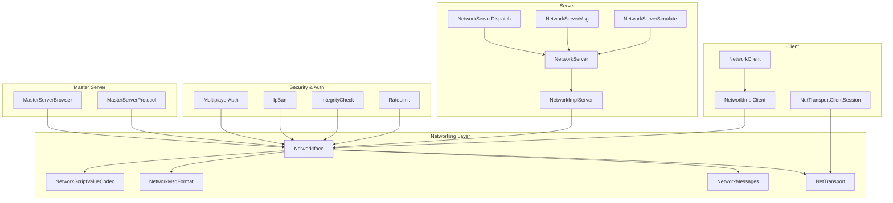

**Diagram sources**
- [NetworkIface.hpp](file://engine/Poseidon/Network/NetworkIface.hpp)
- [NetTransport.hpp](file://engine/Poseidon/Network/NetTransport.hpp)
- [NetworkMessages.hpp](file://engine/Poseidon/Network/NetworkMessages.hpp)
- [NetworkMsgFormat.hpp](file://engine/Poseidon/Network/NetworkMsgFormat.hpp)
- [NetworkScriptValueCodec.hpp](file://engine/Poseidon/Network/NetworkScriptValueCodec.hpp)
- [NetworkImplClient.hpp](file://engine/Poseidon/Network/NetworkImplClient.hpp)
- [NetworkImplServer.hpp](file://engine/Poseidon/Network/NetworkImplServer.hpp)
- [NetworkClient.cpp](file://engine/Poseidon/Network/NetworkClient.cpp)
- [NetworkServer.cpp](file://engine/Poseidon/Network/NetworkServer.cpp)
- [NetworkServerDispatch.hpp](file://engine/Poseidon/Network/NetworkServerDispatch.hpp)
- [NetworkServerMsg.hpp](file://engine/Poseidon/Network/NetworkServerMsg.hpp)
- [NetworkServerSimulate.hpp](file://engine/Poseidon/Network/NetworkServerSimulate.hpp)
- [NetTransportClientSession.hpp](file://engine/Poseidon/Network/NetTransportClientSession.hpp)
- [MultiplayerAuth.hpp](file://engine/Poseidon/Network/MultiplayerAuth.hpp)
- [IpBan.hpp](file://engine/Poseidon/Network/IpBan.hpp)
- [IntegrityCheck.hpp](file://engine/Poseidon/Network/IntegrityCheck.hpp)
- [RateLimit.hpp](file://engine/Poseidon/Network/RateLimit.hpp)
- [MasterServerBrowser.hpp](file://engine/Poseidon/Network/MasterServerBrowser.hpp)
- [MasterServerProtocol.hpp](file://engine/Poseidon/Network/MasterServerProtocol.hpp)

**Section sources**
- [NetworkIface.hpp](file://engine/Poseidon/Network/NetworkIface.hpp)
- [NetTransport.hpp](file://engine/Poseidon/Network/NetTransport.hpp)
- [NetworkImplClient.hpp](file://engine/Poseidon/Network/NetworkImplClient.hpp)
- [NetworkImplServer.hpp](file://engine/Poseidon/Network/NetworkImplServer.hpp)
- [NetworkClient.cpp](file://engine/Poseidon/Network/NetworkClient.cpp)
- [NetworkServer.cpp](file://engine/Poseidon/Network/NetworkServer.cpp)

## Core Components
- NetworkIface: The primary entry point for network operations, exposing methods to create sessions, send/receive messages, manage players, and query state.
- NetTransport: Abstraction over different network protocols; defines connection lifecycle, packet framing, serialization hooks, and transport-specific behavior.
- Session Management: Client and server sessions encapsulate connection state, channel setup, and message routing.
- Player Lifecycle: Handshake, validation, admission, queueing, and termination are managed through dedicated components.
- Message Routing: Centralized dispatch for incoming messages and outbound delivery per player/channel.
- Security and Auth: Multiplayer authentication, IP banning, integrity checks, and rate limiting protect the system.
- Master Server Integration: Browser and protocol support for discovering and publishing servers.

Key responsibilities:
- Connection establishment and teardown
- Packet serialization/deserialization via codec/format layers
- Reliable/unreliable delivery policies
- Voice data routing
- Statistics and metrics collection

**Section sources**
- [NetworkIface.hpp](file://engine/Poseidon/Network/NetworkIface.hpp)
- [NetTransport.hpp](file://engine/Poseidon/Network/NetTransport.hpp)
- [NetTransportClientSession.hpp](file://engine/Poseidon/Network/NetTransportClientSession.hpp)
- [NetTransportServerInit.hpp](file://engine/Poseidon/Network/NetTransportServerInit.hpp)
- [NetTransportPlayerHandshake.hpp](file://engine/Poseidon/Network/NetTransportPlayerHandshake.hpp)
- [NetTransportPlayerValidation.hpp](file://engine/Poseidon/Network/NetTransportPlayerValidation.hpp)
- [NetTransportPlayerQueue.hpp](file://engine/Poseidon/Network/NetTransportPlayerQueue.hpp)
- [NetTransportPlayerReconnect.hpp](file://engine/Poseidon/Network/NetTransportPlayerReconnect.hpp)
- [NetTransportVoiceRouting.hpp](file://engine/Poseidon/Network/NetTransportVoiceRouting.hpp)
- [NetTransportStatisticsQuery.hpp](file://engine/Poseidon/Network/NetTransportStatisticsQuery.hpp)

## Architecture Overview
The networking architecture separates concerns into layers:
- Application layer uses NetworkIface to interact with the network without knowing transport details.
- Transport layer implements NetTransport for specific protocols and manages low-level I/O.
- Session and player layers handle lifecycle events and routing.
- Security and auth modules enforce policies and validate participants.
- Master server modules enable discovery and listing.

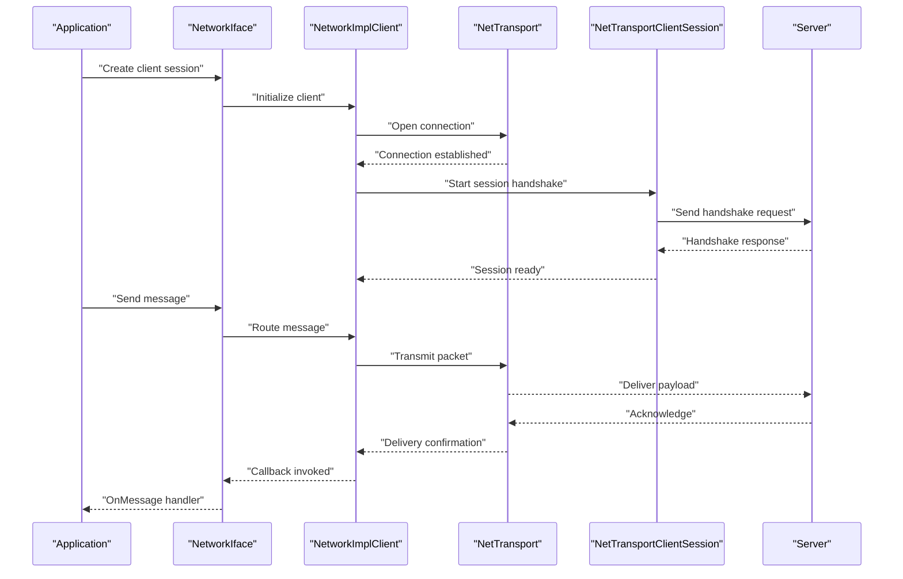

**Diagram sources**
- [NetworkIface.hpp](file://engine/Poseidon/Network/NetworkIface.hpp)
- [NetworkImplClient.hpp](file://engine/Poseidon/Network/NetworkImplClient.hpp)
- [NetTransport.hpp](file://engine/Poseidon/Network/NetTransport.hpp)
- [NetTransportClientSession.hpp](file://engine/Poseidon/Network/NetTransportClientSession.hpp)

**Section sources**
- [Network.cpp](file://engine/Poseidon/Network/Network.cpp)
- [NetworkImplClient.hpp](file://engine/Poseidon/Network/NetworkImplClient.hpp)
- [NetTransportClientSession.hpp](file://engine/Poseidon/Network/NetTransportClientSession.hpp)

## Detailed Component Analysis

### NetworkIface
NetworkIface exposes the high-level API for creating and managing network sessions, sending and receiving messages, and querying network state. It abstracts away transport specifics and provides consistent callbacks for application logic.

Key aspects:
- Session creation and destruction
- Message send/receive with typed payloads
- Player enumeration and targeting
- Configuration access and runtime flags

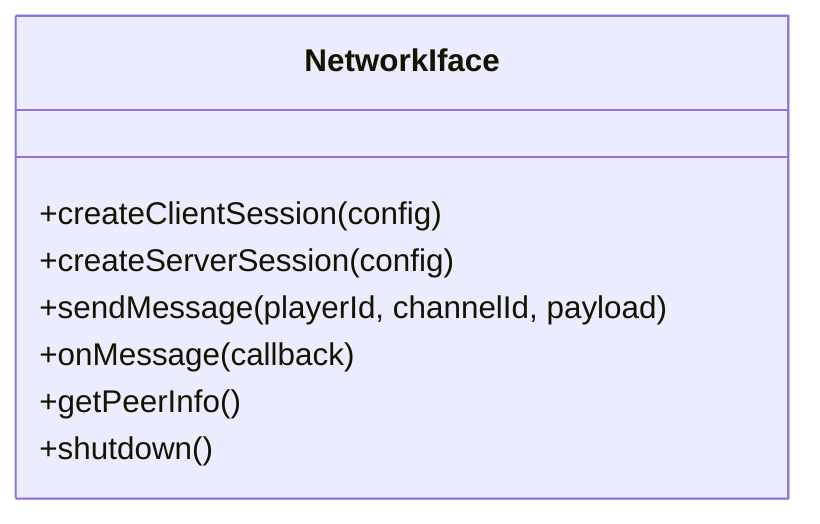

**Diagram sources**
- [NetworkIface.hpp](file://engine/Poseidon/Network/NetworkIface.hpp)

**Section sources**
- [NetworkIface.hpp](file://engine/Poseidon/Network/NetworkIface.hpp)

### NetTransport Abstraction
NetTransport defines the contract for protocol implementations, including connection lifecycle, packet framing, serialization hooks, and transport-specific features like reliability and ordering.

Responsibilities:
- Establish and terminate connections
- Serialize and deserialize packets
- Manage channels and priorities
- Provide metrics and diagnostics

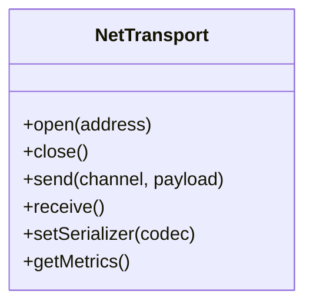

**Diagram sources**
- [NetTransport.hpp](file://engine/Poseidon/Network/NetTransport.hpp)

**Section sources**
- [NetTransport.hpp](file://engine/Poseidon/Network/NetTransport.hpp)

### Session Management
Sessions encapsulate connection state and coordinate handshake, validation, and message routing. Client and server sessions have distinct responsibilities but share common lifecycle phases.

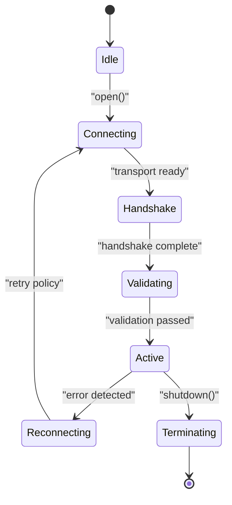

**Diagram sources**
- [NetTransportClientSession.hpp](file://engine/Poseidon/Network/NetTransportClientSession.hpp)
- [NetTransportServerInit.hpp](file://engine/Poseidon/Network/NetTransportServerInit.hpp)

**Section sources**
- [NetTransportClientSession.hpp](file://engine/Poseidon/Network/NetTransportClientSession.hpp)
- [NetTransportServerInit.hpp](file://engine/Poseidon/Network/NetTransportServerInit.hpp)

### Player Lifecycle and Authentication
Player lifecycle includes handshake, validation, admission, queueing, and termination. Authentication ensures secure player registration and prevents unauthorized access.

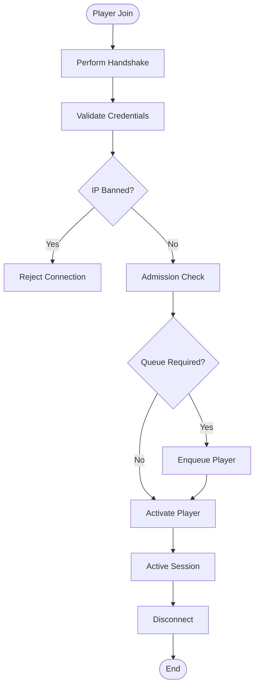

**Diagram sources**
- [NetTransportPlayerHandshake.hpp](file://engine/Poseidon/Network/NetTransportPlayerHandshake.hpp)
- [NetTransportPlayerValidation.hpp](file://engine/Poseidon/Network/NetTransportPlayerValidation.hpp)
- [NetTransportPlayerQueue.hpp](file://engine/Poseidon/Network/NetTransportPlayerQueue.hpp)
- [NetTransportPlayerReconnect.hpp](file://engine/Poseidon/Network/NetTransportPlayerReconnect.hpp)
- [MultiplayerAuth.hpp](file://engine/Poseidon/Network/MultiplayerAuth.hpp)
- [IpBan.hpp](file://engine/Poseidon/Network/IpBan.hpp)

**Section sources**
- [NetTransportPlayerHandshake.hpp](file://engine/Poseidon/Network/NetTransportPlayerHandshake.hpp)
- [NetTransportPlayerValidation.hpp](file://engine/Poseidon/Network/NetTransportPlayerValidation.hpp)
- [NetTransportPlayerQueue.hpp](file://engine/Poseidon/Network/NetTransportPlayerQueue.hpp)
- [NetTransportPlayerReconnect.hpp](file://engine/Poseidon/Network/NetTransportPlayerReconnect.hpp)
- [MultiplayerAuth.hpp](file://engine/Poseidon/Network/MultiplayerAuth.hpp)
- [IpBan.hpp](file://engine/Poseidon/Network/IpBan.hpp)

### Message Routing and Serialization
Message routing handles incoming and outgoing messages across channels and players. Serialization ensures efficient and safe transmission of payloads using codecs and format definitions.

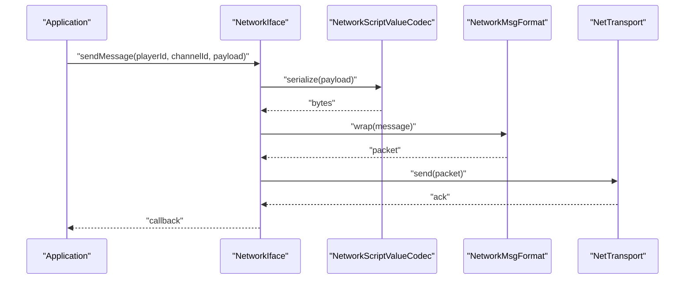

**Diagram sources**
- [NetworkScriptValueCodec.hpp](file://engine/Poseidon/Network/NetworkScriptValueCodec.hpp)
- [NetworkMsgFormat.hpp](file://engine/Poseidon/Network/NetworkMsgFormat.hpp)
- [NetTransport.hpp](file://engine/Poseidon/Network/NetTransport.hpp)

**Section sources**
- [NetworkScriptValueCodec.hpp](file://engine/Poseidon/Network/NetworkScriptValueCodec.hpp)
- [NetworkMsgFormat.hpp](file://engine/Poseidon/Network/NetworkMsgFormat.hpp)
- [NetworkMessages.hpp](file://engine/Poseidon/Network/NetworkMessages.hpp)

### Voice Routing
Voice routing manages real-time audio streams between players, ensuring low latency and appropriate quality settings.

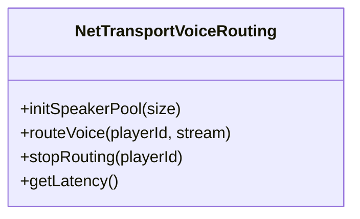

**Diagram sources**
- [NetTransportVoiceRouting.hpp](file://engine/Poseidon/Network/NetTransportVoiceRouting.hpp)

**Section sources**
- [NetTransportVoiceRouting.hpp](file://engine/Poseidon/Network/NetTransportVoiceRouting.hpp)

### Statistics and Diagnostics
Statistics provide insights into network performance, including throughput, latency, and error rates.

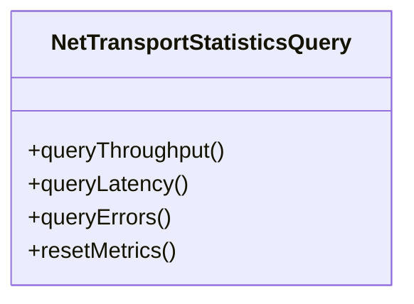

**Diagram sources**
- [NetTransportStatisticsQuery.hpp](file://engine/Poseidon/Network/NetTransportStatisticsQuery.hpp)

**Section sources**
- [NetTransportStatisticsQuery.hpp](file://engine/Poseidon/Network/NetTransportStatisticsQuery.hpp)

### Client Implementation
NetworkImplClient implements the client-side networking logic, handling connection establishment, session management, and message dispatch.

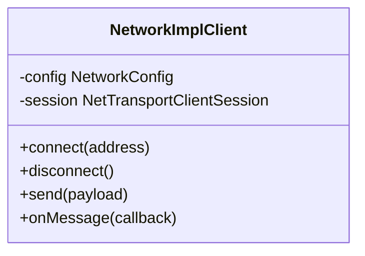

**Diagram sources**
- [NetworkImplClient.hpp](file://engine/Poseidon/Network/NetworkImplClient.hpp)
- [NetworkClient.cpp](file://engine/Poseidon/Network/NetworkClient.cpp)

**Section sources**
- [NetworkImplClient.hpp](file://engine/Poseidon/Network/NetworkImplClient.hpp)
- [NetworkClient.cpp](file://engine/Poseidon/Network/NetworkClient.cpp)

### Server Implementation
NetworkImplServer manages server-side networking, including player acceptance, message dispatch, simulation integration, and integrity checks.

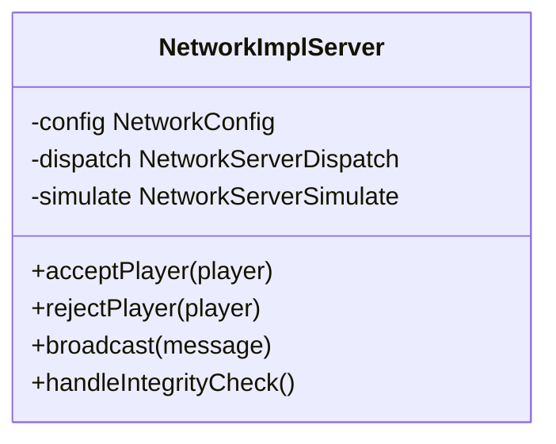

**Diagram sources**
- [NetworkImplServer.hpp](file://engine/Poseidon/Network/NetworkImplServer.hpp)
- [NetworkServer.cpp](file://engine/Poseidon/Network/NetworkServer.cpp)
- [NetworkServerDispatch.hpp](file://engine/Poseidon/Network/NetworkServerDispatch.hpp)
- [NetworkServerSimulate.hpp](file://engine/Poseidon/Network/NetworkServerSimulate.hpp)

**Section sources**
- [NetworkImplServer.hpp](file://engine/Poseidon/Network/NetworkImplServer.hpp)
- [NetworkServer.cpp](file://engine/Poseidon/Network/NetworkServer.cpp)
- [NetworkServerDispatch.hpp](file://engine/Poseidon/Network/NetworkServerDispatch.hpp)
- [NetworkServerSimulate.hpp](file://engine/Poseidon/Network/NetworkServerSimulate.hpp)

### Master Server Integration
Master server components enable server discovery and listing through a centralized service.

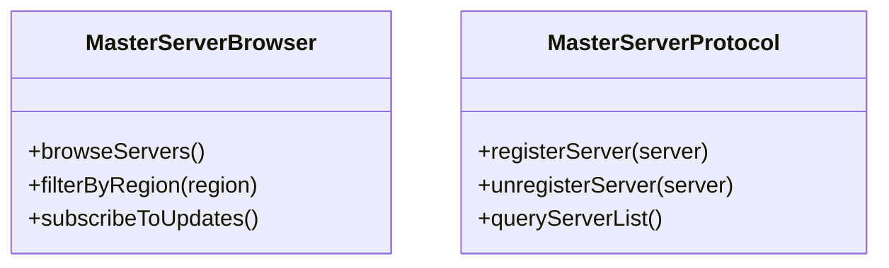

**Diagram sources**
- [MasterServerBrowser.hpp](file://engine/Poseidon/Network/MasterServerBrowser.hpp)
- [MasterServerProtocol.hpp](file://engine/Poseidon/Network/MasterServerProtocol.hpp)

**Section sources**
- [MasterServerBrowser.hpp](file://engine/Poseidon/Network/MasterServerBrowser.hpp)
- [MasterServerProtocol.hpp](file://engine/Poseidon/Network/MasterServerProtocol.hpp)

## Dependency Analysis
The networking layer has well-defined dependencies:
- NetworkIface depends on NetTransport and message formats
- Client/server implementations depend on session and player lifecycle components
- Security modules integrate with core networking for validation and protection
- Master server modules operate independently but communicate via standard protocols

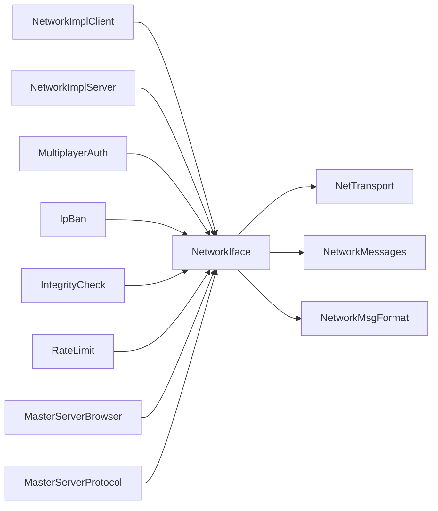

**Diagram sources**
- [NetworkIface.hpp](file://engine/Poseidon/Network/NetworkIface.hpp)
- [NetTransport.hpp](file://engine/Poseidon/Network/NetTransport.hpp)
- [NetworkMessages.hpp](file://engine/Poseidon/Network/NetworkMessages.hpp)
- [NetworkMsgFormat.hpp](file://engine/Poseidon/Network/NetworkMsgFormat.hpp)
- [NetworkImplClient.hpp](file://engine/Poseidon/Network/NetworkImplClient.hpp)
- [NetworkImplServer.hpp](file://engine/Poseidon/Network/NetworkImplServer.hpp)
- [MultiplayerAuth.hpp](file://engine/Poseidon/Network/MultiplayerAuth.hpp)
- [IpBan.hpp](file://engine/Poseidon/Network/IpBan.hpp)
- [IntegrityCheck.hpp](file://engine/Poseidon/Network/IntegrityCheck.hpp)
- [RateLimit.hpp](file://engine/Poseidon/Network/RateLimit.hpp)
- [MasterServerBrowser.hpp](file://engine/Poseidon/Network/MasterServerBrowser.hpp)
- [MasterServerProtocol.hpp](file://engine/Poseidon/Network/MasterServerProtocol.hpp)

**Section sources**
- [NetworkIface.hpp](file://engine/Poseidon/Network/NetworkIface.hpp)
- [NetTransport.hpp](file://engine/Poseidon/Network/NetTransport.hpp)
- [NetworkImplClient.hpp](file://engine/Poseidon/Network/NetworkImplClient.hpp)
- [NetworkImplServer.hpp](file://engine/Poseidon/Network/NetworkImplServer.hpp)

## Performance Considerations
- Use efficient serialization formats to minimize overhead
- Implement batching for frequent small messages
- Configure reliable vs unreliable delivery based on message criticality
- Monitor and tune buffer sizes for optimal throughput
- Leverage voice routing optimizations for real-time audio
- Utilize statistics to identify bottlenecks and adjust parameters

[No sources needed since this section provides general guidance]

## Troubleshooting Guide
Common issues and resolutions:
- Connection failures: Verify address configuration and firewall settings
- Authentication errors: Check credentials and server policies
- Message loss: Adjust reliability settings and monitor network conditions
- High latency: Optimize serialization and reduce payload size
- Memory leaks: Ensure proper cleanup of sessions and resources

Error handling strategies:
- Implement retry logic with exponential backoff
- Log detailed error contexts for debugging
- Gracefully handle disconnections and reconnections
- Validate all inputs and outputs at boundaries

**Section sources**
- [NetworkConfig.hpp](file://engine/Poseidon/Network/NetworkConfig.hpp)
- [NetworkManagerState.hpp](file://engine/Poseidon/Network/NetworkManagerState.hpp)
- [RateLimit.hpp](file://engine/Poseidon/Network/RateLimit.hpp)

## Conclusion
The CWR-CE networking API provides a robust, extensible framework for multiplayer communication. By separating concerns between interfaces, transports, sessions, and security, it enables flexible implementation of custom protocols while maintaining consistency and reliability. Proper usage of authentication, rate limiting, and statistics ensures secure and performant network operations.

[No sources needed since this section summarizes without analyzing specific files]