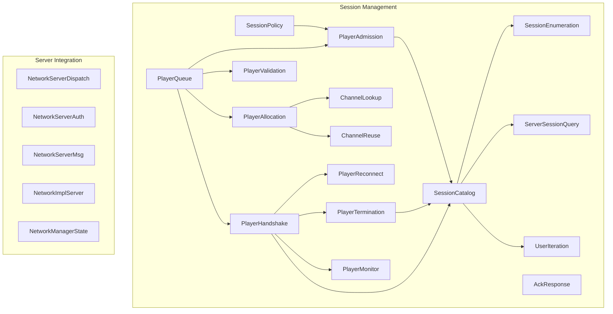
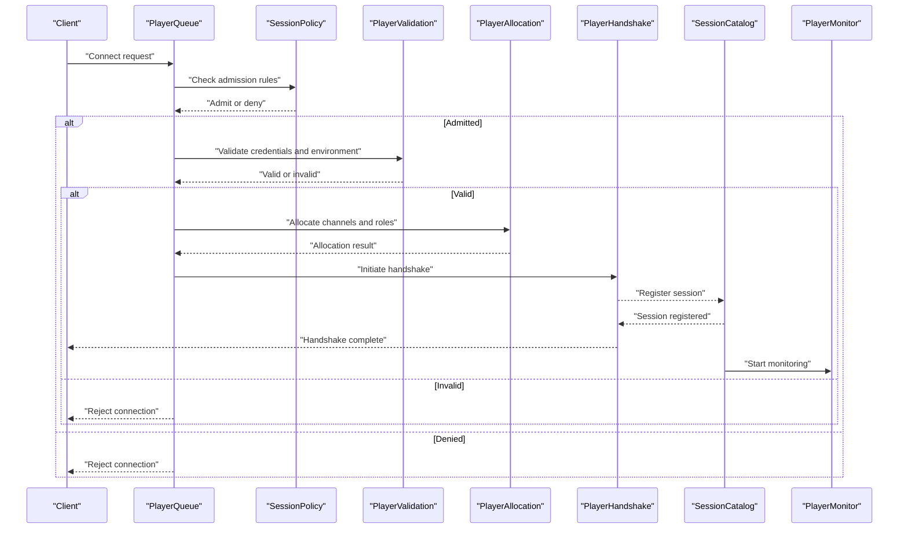
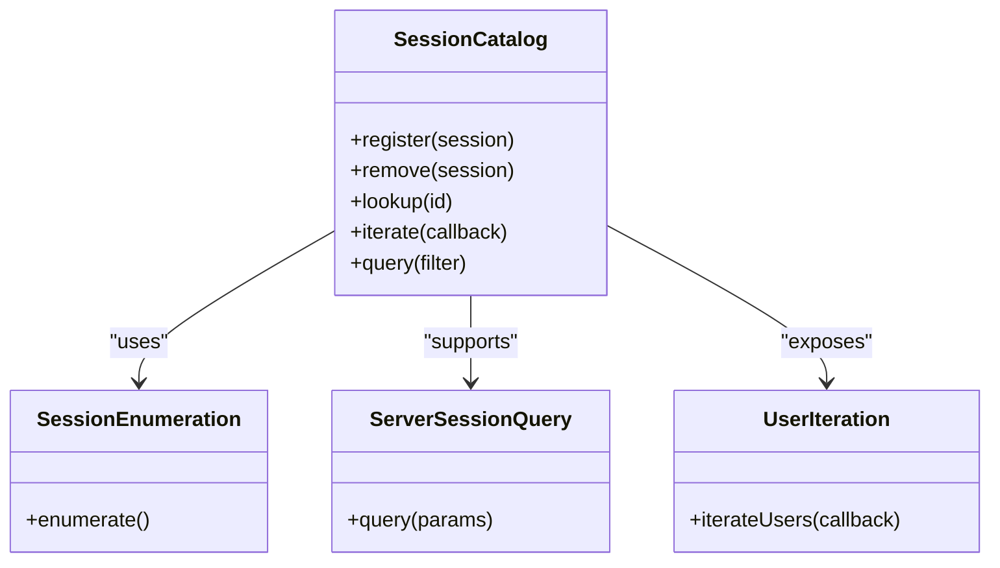
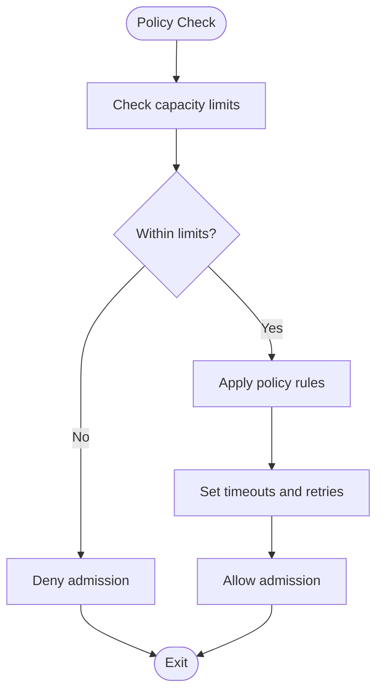
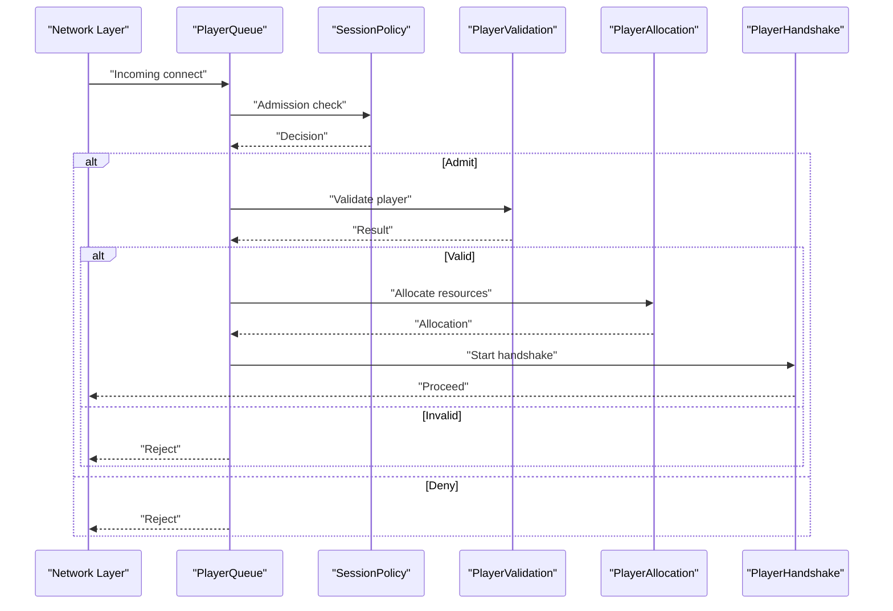
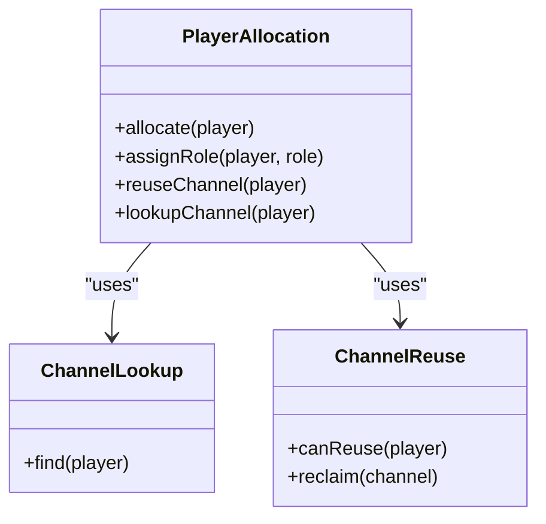
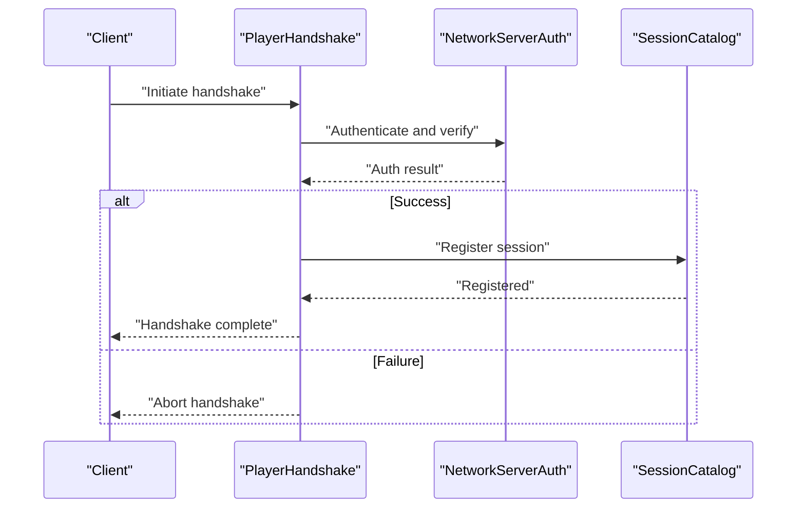
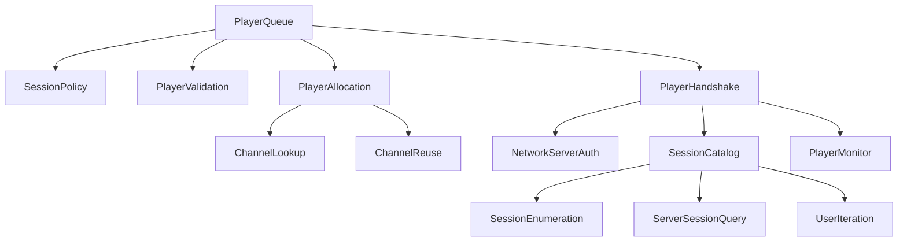

# Session Management

<cite>
**Referenced Files in This Document**
- [NetTransportSessionCatalog.hpp](file://engine/Poseidon/Network/NetTransportSessionCatalog.hpp)
- [NetTransportSessionCatalog.cpp](file://engine/Poseidon/Network/NetTransportSessionCatalog.cpp)
- [NetTransportSessionPolicy.hpp](file://engine/Poseidon/Network/NetTransportSessionPolicy.hpp)
- [NetTransportSessionPolicy.cpp](file://engine/Poseidon/Network/NetTransportSessionPolicy.cpp)
- [NetTransportPlayerQueue.hpp](file://engine/Poseidon/Network/NetTransportPlayerQueue.hpp)
- [NetTransportPlayerQueue.cpp](file://engine/Poseidon/Network/NetTransportPlayerQueue.cpp)
- [NetTransportPlayerValidation.hpp](file://engine/Poseidon/Network/NetTransportPlayerValidation.hpp)
- [NetTransportPlayerValidation.cpp](file://engine/Poseidon/Network/NetTransportPlayerValidation.cpp)
- [NetTransportPlayerAllocation.hpp](file://engine/Poseidon/Network/NetTransportPlayerAllocation.hpp)
- [NetTransportPlayerCreation.hpp](file://engine/Poseidon/Network/NetTransportPlayerCreation.hpp)
- [NetTransportPlayerHandshake.hpp](file://engine/Poseidon/Network/NetTransportPlayerHandshake.hpp)
- [NetTransportPlayerHandshake.cpp](file://engine/Poseidon/Network/NetTransportPlayerHandshake.cpp)
- [NetTransportPlayerReconnect.hpp](file://engine/Poseidon/Network/NetTransportPlayerReconnect.hpp)
- [NetTransportPlayerTermination.hpp](file://engine/Poseidon/Network/NetTransportPlayerTermination.hpp)
- [NetTransportServerSessionQuery.hpp](file://engine/Poseidon/Network/NetTransportServerSessionQuery.hpp)
- [NetTransportSessionEnumeration.hpp](file://engine/Poseidon/Network/NetTransportSessionEnumeration.hpp)
- [NetTransportUserIteration.hpp](file://engine/Poseidon/Network/NetTransportUserIteration.hpp)
- [NetTransportPlayerChannelLookup.hpp](file://engine/Poseidon/Network/NetTransportPlayerChannelLookup.hpp)
- [NetTransportPlayerChannelReuse.hpp](file://engine/Poseidon/Network/NetTransportPlayerChannelReuse.hpp)
- [NetTransportPlayerMonitor.hpp](file://engine/Poseidon/Network/NetTransportPlayerMonitor.hpp)
- [NetTransportPlayerAckResponse.hpp](file://engine/Poseidon/Network/NetTransportPlayerAckResponse.hpp)
- [NetTransportPlayerAdmission.hpp](file://engine/Poseidon/Network/NetTransportPlayerAdmission.hpp)
- [NetTransportClientSession.hpp](file://engine/Poseidon/Network/NetTransportClientSession.hpp)
- [NetTransportClientSession.cpp](file://engine/Poseidon/Network/NetTransportClientSession.cpp)
- [NetworkServerMsg.cpp](file://engine/Poseidon/Network/NetworkServerMsg.cpp)
- [NetworkMessages.hpp](file://engine/Poseidon/Network/NetworkMessages.hpp)
- [NetworkServerDispatch.hpp](file://engine/Poseidon/Network/NetworkServerDispatch.hpp)
- [NetworkServerAuth.hpp](file://engine/Poseidon/Network/NetworkServerAuth.hpp)
- [NetworkServerCommon.hpp](file://engine/Poseidon/Network/NetworkServerCommon.hpp)
- [NetworkImplServer.hpp](file://engine/Poseidon/Network/NetworkImplServer.hpp)
- [NetworkManagerState.hpp](file://engine/Poseidon/Network/NetworkManagerState.hpp)
</cite>

## Table of Contents
1. [Introduction](#introduction)
2. [Project Structure](#project-structure)
3. [Core Components](#core-components)
4. [Architecture Overview](#architecture-overview)
5. [Detailed Component Analysis](#detailed-component-analysis)
6. [Dependency Analysis](#dependency-analysis)
7. [Performance Considerations](#performance-considerations)
8. [Troubleshooting Guide](#troubleshooting-guide)
9. [Conclusion](#conclusion)

## Introduction
This document explains session management in CWR-CE’s networking system with a focus on how sessions are created, tracked, and destroyed across client-server connections. It covers the SessionCatalog for managing active sessions, SessionPolicy for lifecycle rules, and PlayerQueue for handling connection requests. It also includes examples of session validation, resource allocation, cleanup procedures, multiplayer coordination, player role assignment, migration scenarios, persistence and recovery mechanisms, and debugging tools.

## Project Structure
The session management subsystem is implemented under the Poseidon Network module. Key components include:
- Session catalog and enumeration utilities for tracking active sessions and users
- Policy definitions governing session lifecycle and admission criteria
- Player queue for managing incoming connection requests and admission flow
- Validation and allocation modules for verifying players and assigning resources
- Handshake, reconnect, and termination flows for session establishment and teardown
- Server-side message dispatch and authentication integration points

**Diagram sources**
- [NetTransportSessionCatalog.hpp](file://engine/Poseidon/Network/NetTransportSessionCatalog.hpp)
- [NetTransportSessionPolicy.hpp](file://engine/Poseidon/Network/NetTransportSessionPolicy.hpp)
- [NetTransportPlayerQueue.hpp](file://engine/Poseidon/Network/NetTransportPlayerQueue.hpp)
- [NetTransportPlayerValidation.hpp](file://engine/Poseidon/Network/NetTransportPlayerValidation.hpp)
- [NetTransportPlayerAllocation.hpp](file://engine/Poseidon/Network/NetTransportPlayerAllocation.hpp)
- [NetTransportPlayerHandshake.hpp](file://engine/Poseidon/Network/NetTransportPlayerHandshake.hpp)
- [NetTransportPlayerReconnect.hpp](file://engine/Poseidon/Network/NetTransportPlayerReconnect.hpp)
- [NetTransportPlayerTermination.hpp](file://engine/Poseidon/Network/NetTransportPlayerTermination.hpp)
- [NetTransportSessionEnumeration.hpp](file://engine/Poseidon/Network/NetTransportSessionEnumeration.hpp)
- [NetTransportServerSessionQuery.hpp](file://engine/Poseidon/Network/NetTransportServerSessionQuery.hpp)
- [NetTransportUserIteration.hpp](file://engine/Poseidon/Network/NetTransportUserIteration.hpp)
- [NetTransportPlayerChannelLookup.hpp](file://engine/Poseidon/Network/NetTransportPlayerChannelLookup.hpp)
- [NetTransportPlayerChannelReuse.hpp](file://engine/Poseidon/Network/NetTransportPlayerChannelReuse.hpp)
- [NetTransportPlayerMonitor.hpp](file://engine/Poseidon/Network/NetTransportPlayerMonitor.hpp)
- [NetTransportPlayerAckResponse.hpp](file://engine/Poseidon/Network/NetTransportPlayerAckResponse.hpp)
- [NetTransportPlayerAdmission.hpp](file://engine/Poseidon/Network/NetTransportPlayerAdmission.hpp)
- [NetworkServerDispatch.hpp](file://engine/Poseidon/Network/NetworkServerDispatch.hpp)
- [NetworkServerAuth.hpp](file://engine/Poseidon/Network/NetworkServerAuth.hpp)
- [NetworkServerMsg.cpp](file://engine/Poseidon/Network/NetworkServerMsg.cpp)
- [NetworkImplServer.hpp](file://engine/Poseidon/Network/NetworkImplServer.hpp)
- [NetworkManagerState.hpp](file://engine/Poseidon/Network/NetworkManagerState.hpp)

**Section sources**
- [NetTransportSessionCatalog.hpp](file://engine/Poseidon/Network/NetTransportSessionCatalog.hpp)
- [NetTransportSessionPolicy.hpp](file://engine/Poseidon/Network/NetTransportSessionPolicy.hpp)
- [NetTransportPlayerQueue.hpp](file://engine/Poseidon/Network/NetTransportPlayerQueue.hpp)

## Core Components
- SessionCatalog: Central registry for active sessions and user iteration. Provides lookup, enumeration, and query capabilities used by server operations and diagnostics.
- SessionPolicy: Defines lifecycle rules such as admission criteria, timeouts, capacity limits, and constraints that govern when a session can be created or maintained.
- PlayerQueue: Manages incoming connection requests, enforces policy checks, coordinates validation and allocation, and drives handshake initiation.
- PlayerValidation: Validates credentials, permissions, and environment requirements before admission into a session.
- PlayerAllocation: Assigns resources like channels and roles to validated players, ensuring channel reuse where possible.
- PlayerHandshake: Orchestrates the multi-step negotiation between client and server to establish a secure session context.
- PlayerReconnect: Handles reconnection flows to restore state without full re-authentication when allowed by policy.
- PlayerTermination: Coordinates graceful teardown, resource release, and cleanup upon disconnect or forced removal.

**Section sources**
- [NetTransportSessionCatalog.hpp](file://engine/Poseidon/Network/NetTransportSessionCatalog.hpp)
- [NetTransportSessionPolicy.hpp](file://engine/Poseidon/Network/NetTransportSessionPolicy.hpp)
- [NetTransportPlayerQueue.hpp](file://engine/Poseidon/Network/NetTransportPlayerQueue.hpp)
- [NetTransportPlayerValidation.hpp](file://engine/Poseidon/Network/NetTransportPlayerValidation.hpp)
- [NetTransportPlayerAllocation.hpp](file://engine/Poseidon/Network/NetTransportPlayerAllocation.hpp)
- [NetTransportPlayerHandshake.hpp](file://engine/Poseidon/Network/NetTransportPlayerHandshake.hpp)
- [NetTransportPlayerReconnect.hpp](file://engine/Poseidon/Network/NetTransportPlayerReconnect.hpp)
- [NetTransportPlayerTermination.hpp](file://engine/Poseidon/Network/NetTransportPlayerTermination.hpp)

## Architecture Overview
The session lifecycle spans several phases coordinated by the server and client components:
- Admission and creation: PlayerQueue evaluates policy and queues requests; validation confirms identity and permissions; allocation assigns channels and roles; handshake negotiates security parameters.
- Active session: SessionCatalog tracks the session; monitoring ensures health; messages flow through allocated channels; enumeration supports diagnostics and admin queries.
- Reconnection and migration: Reconnect flow restores session state when permitted; migration may involve transferring ownership or rebalancing roles.
- Termination and cleanup: Termination releases resources, updates catalog, and notifies peers.

**Diagram sources**
- [NetTransportPlayerQueue.hpp](file://engine/Poseidon/Network/NetTransportPlayerQueue.hpp)
- [NetTransportSessionPolicy.hpp](file://engine/Poseidon/Network/NetTransportSessionPolicy.hpp)
- [NetTransportPlayerValidation.hpp](file://engine/Poseidon/Network/NetTransportPlayerValidation.hpp)
- [NetTransportPlayerAllocation.hpp](file://engine/Poseidon/Network/NetTransportPlayerAllocation.hpp)
- [NetTransportPlayerHandshake.hpp](file://engine/Poseidon/Network/NetTransportPlayerHandshake.hpp)
- [NetTransportSessionCatalog.hpp](file://engine/Poseidon/Network/NetTransportSessionCatalog.hpp)
- [NetTransportPlayerMonitor.hpp](file://engine/Poseidon/Network/NetTransportPlayerMonitor.hpp)

## Detailed Component Analysis

### SessionCatalog
SessionCatalog maintains the authoritative list of active sessions and provides iteration and query interfaces for server operations. It integrates with enumeration and session query utilities to support diagnostics and administrative tasks.

Key responsibilities:
- Register new sessions upon successful handshake
- Remove sessions during termination or failure
- Provide iteration over users/sessions for broadcasting and monitoring
- Support lookups by identifiers for routing and validation

**Diagram sources**
- [NetTransportSessionCatalog.hpp](file://engine/Poseidon/Network/NetTransportSessionCatalog.hpp)
- [NetTransportSessionEnumeration.hpp](file://engine/Poseidon/Network/NetTransportSessionEnumeration.hpp)
- [NetTransportServerSessionQuery.hpp](file://engine/Poseidon/Network/NetTransportServerSessionQuery.hpp)
- [NetTransportUserIteration.hpp](file://engine/Poseidon/Network/NetTransportUserIteration.hpp)

**Section sources**
- [NetTransportSessionCatalog.hpp](file://engine/Poseidon/Network/NetTransportSessionCatalog.hpp)
- [NetTransportSessionEnumeration.hpp](file://engine/Poseidon/Network/NetTransportSessionEnumeration.hpp)
- [NetTransportServerSessionQuery.hpp](file://engine/Poseidon/Network/NetTransportServerSessionQuery.hpp)
- [NetTransportUserIteration.hpp](file://engine/Poseidon/Network/NetTransportUserIteration.hpp)

### SessionPolicy
SessionPolicy defines the rules that govern session lifecycle decisions, including admission criteria, capacity limits, timeouts, and constraints. It is consulted by PlayerQueue and admission logic to determine whether a connection should proceed.

Key responsibilities:
- Evaluate admission based on server state and configuration
- Enforce rate limits and concurrency caps
- Define timeout behavior and retry policies
- Provide hooks for custom validation rules

**Diagram sources**
- [NetTransportSessionPolicy.hpp](file://engine/Poseidon/Network/NetTransportSessionPolicy.hpp)
- [NetTransportPlayerAdmission.hpp](file://engine/Poseidon/Network/NetTransportPlayerAdmission.hpp)

**Section sources**
- [NetTransportSessionPolicy.hpp](file://engine/Poseidon/Network/NetTransportSessionPolicy.hpp)
- [NetTransportPlayerAdmission.hpp](file://engine/Poseidon/Network/NetTransportPlayerAdmission.hpp)

### PlayerQueue
PlayerQueue orchestrates incoming connection requests, applying policy checks, coordinating validation and allocation, and initiating the handshake process. It acts as the entry point for session creation.

Key responsibilities:
- Accept connection requests and enqueue them
- Apply SessionPolicy to admit or reject requests
- Trigger PlayerValidation and PlayerAllocation
- Initiate PlayerHandshake upon successful preparation

**Diagram sources**
- [NetTransportPlayerQueue.hpp](file://engine/Poseidon/Network/NetTransportPlayerQueue.hpp)
- [NetTransportSessionPolicy.hpp](file://engine/Poseidon/Network/NetTransportSessionPolicy.hpp)
- [NetTransportPlayerValidation.hpp](file://engine/Poseidon/Network/NetTransportPlayerValidation.hpp)
- [NetTransportPlayerAllocation.hpp](file://engine/Poseidon/Network/NetTransportPlayerAllocation.hpp)
- [NetTransportPlayerHandshake.hpp](file://engine/Poseidon/Network/NetTransportPlayerHandshake.hpp)

**Section sources**
- [NetTransportPlayerQueue.hpp](file://engine/Poseidon/Network/NetTransportPlayerQueue.hpp)
- [NetTransportPlayerQueue.cpp](file://engine/Poseidon/Network/NetTransportPlayerQueue.cpp)

### PlayerValidation
PlayerValidation verifies player identity, permissions, and environment compatibility before admission. It integrates with authentication services and policy checks to ensure only authorized players join sessions.

Key responsibilities:
- Authenticate credentials and tokens
- Verify environment consistency (e.g., mods, version)
- Enforce per-player restrictions and quotas
- Return validation results to PlayerQueue

**Section sources**
- [NetTransportPlayerValidation.hpp](file://engine/Poseidon/Network/NetTransportPlayerValidation.hpp)
- [NetTransportPlayerValidation.cpp](file://engine/Poseidon/Network/NetTransportPlayerValidation.cpp)

### PlayerAllocation
PlayerAllocation assigns network channels and roles to validated players. It supports channel reuse and lookup to optimize resource usage and minimize overhead.

Key responsibilities:
- Allocate channels from available pools
- Assign roles based on game state and policy
- Reuse existing channels when safe
- Provide lookup for channel-to-player mapping

**Diagram sources**
- [NetTransportPlayerAllocation.hpp](file://engine/Poseidon/Network/NetTransportPlayerAllocation.hpp)
- [NetTransportPlayerChannelLookup.hpp](file://engine/Poseidon/Network/NetTransportPlayerChannelLookup.hpp)
- [NetTransportPlayerChannelReuse.hpp](file://engine/Poseidon/Network/NetTransportPlayerChannelReuse.hpp)

**Section sources**
- [NetTransportPlayerAllocation.hpp](file://engine/Poseidon/Network/NetTransportPlayerAllocation.hpp)
- [NetTransportPlayerChannelLookup.hpp](file://engine/Poseidon/Network/NetTransportPlayerChannelLookup.hpp)
- [NetTransportPlayerChannelReuse.hpp](file://engine/Poseidon/Network/NetTransportPlayerChannelReuse.hpp)

### PlayerHandshake
PlayerHandshake manages the multi-step negotiation required to establish a secure session context. It coordinates with authentication and session registration to finalize the connection.

Key responsibilities:
- Exchange cryptographic parameters and verify integrity
- Confirm session parameters and capabilities
- Register the session in SessionCatalog upon success
- Handle errors and abort flows gracefully

**Diagram sources**
- [NetTransportPlayerHandshake.hpp](file://engine/Poseidon/Network/NetTransportPlayerHandshake.hpp)
- [NetTransportPlayerHandshake.cpp](file://engine/Poseidon/Network/NetTransportPlayerHandshake.cpp)
- [NetworkServerAuth.hpp](file://engine/Poseidon/Network/NetworkServerAuth.hpp)
- [NetTransportSessionCatalog.hpp](file://engine/Poseidon/Network/NetTransportSessionCatalog.hpp)

**Section sources**
- [NetTransportPlayerHandshake.hpp](file://engine/Poseidon/Network/NetTransportPlayerHandshake.hpp)
- [NetTransportPlayerHandshake.cpp](file://engine/Poseidon/Network/NetTransportPlayerHandshake.cpp)
- [NetworkServerAuth.hpp](file://engine/Poseidon/Network/NetworkServerAuth.hpp)

### PlayerReconnect
PlayerReconnect handles reconnection scenarios where a client attempts to resume an existing session without full re-authentication. It validates eligibility and restores necessary state.

Key responsibilities:
- Detect eligible reconnect requests
- Validate session continuity and policy allowances
- Restore channels and roles if possible
- Notify other participants of reconnection events

**Section sources**
- [NetTransportPlayerReconnect.hpp](file://engine/Poseidon/Network/NetTransportPlayerReconnect.hpp)

### PlayerTermination
PlayerTermination coordinates session teardown, releasing resources and updating the catalog. It ensures clean disconnection and informs peers appropriately.

Key responsibilities:
- Gracefully terminate sessions on disconnect or error
- Release allocated channels and roles
- Update SessionCatalog and notify interested parties
- Perform cleanup and logging for diagnostics

**Section sources**
- [NetTransportPlayerTermination.hpp](file://engine/Poseidon/Network/NetTransportPlayerTermination.hpp)

### Multiplayer Coordination and Role Assignment
Multiplayer coordination involves synchronizing player roles and states across the session. Allocation assigns roles based on policy and game state; acknowledgment responses confirm role acceptance.

Key responsibilities:
- Assign roles consistently across players
- Broadcast role changes to maintain synchronization
- Acknowledge role assignments to prevent inconsistencies

**Section sources**
- [NetTransportPlayerAllocation.hpp](file://engine/Poseidon/Network/NetTransportPlayerAllocation.hpp)
- [NetTransportPlayerAckResponse.hpp](file://engine/Poseidon/Network/NetTransportPlayerAckResponse.hpp)

### Session Migration Scenarios
Migration may occur when a session needs to move ownership or rebalance roles due to failures or load balancing. The system supports reconnection and reallocation to maintain continuity.

Key responsibilities:
- Detect conditions requiring migration
- Coordinate handover of roles and channels
- Ensure minimal disruption to ongoing gameplay

**Section sources**
- [NetTransportPlayerReconnect.hpp](file://engine/Poseidon/Network/NetTransportPlayerReconnect.hpp)
- [NetTransportPlayerAllocation.hpp](file://engine/Poseidon/Network/NetTransportPlayerAllocation.hpp)

### Session Persistence and Recovery
Persistence and recovery mechanisms ensure sessions can survive server restarts or transient failures. The client session component interacts with server state to restore connectivity and state.

Key responsibilities:
- Persist critical session metadata
- Recover state upon server restart
- Re-establish connections using stored identifiers

**Section sources**
- [NetTransportClientSession.hpp](file://engine/Poseidon/Network/NetTransportClientSession.hpp)
- [NetTransportClientSession.cpp](file://engine/Poseidon/Network/NetTransportClientSession.cpp)

### Debugging Tools for Session Issues
Debugging utilities include session enumeration, user iteration, and monitoring to diagnose issues. These tools help inspect active sessions, track player states, and identify bottlenecks.

Key responsibilities:
- Enumerate active sessions and users
- Monitor player health and latency
- Provide diagnostic logs and metrics

**Section sources**
- [NetTransportSessionEnumeration.hpp](file://engine/Poseidon/Network/NetTransportSessionEnumeration.hpp)
- [NetTransportUserIteration.hpp](file://engine/Poseidon/Network/NetTransportUserIteration.hpp)
- [NetTransportPlayerMonitor.hpp](file://engine/Poseidon/Network/NetTransportPlayerMonitor.hpp)

## Dependency Analysis
The session management components exhibit clear separation of concerns with well-defined dependencies:
- PlayerQueue depends on SessionPolicy, PlayerValidation, PlayerAllocation, and PlayerHandshake
- SessionCatalog is central and used by enumeration, query, and monitoring components
- Allocation relies on channel lookup and reuse utilities
- Handshake integrates with authentication and session registration

**Diagram sources**
- [NetTransportPlayerQueue.hpp](file://engine/Poseidon/Network/NetTransportPlayerQueue.hpp)
- [NetTransportSessionPolicy.hpp](file://engine/Poseidon/Network/NetTransportSessionPolicy.hpp)
- [NetTransportPlayerValidation.hpp](file://engine/Poseidon/Network/NetTransportPlayerValidation.hpp)
- [NetTransportPlayerAllocation.hpp](file://engine/Poseidon/Network/NetTransportPlayerAllocation.hpp)
- [NetTransportPlayerHandshake.hpp](file://engine/Poseidon/Network/NetTransportPlayerHandshake.hpp)
- [NetworkServerAuth.hpp](file://engine/Poseidon/Network/NetworkServerAuth.hpp)
- [NetTransportSessionCatalog.hpp](file://engine/Poseidon/Network/NetTransportSessionCatalog.hpp)
- [NetTransportSessionEnumeration.hpp](file://engine/Poseidon/Network/NetTransportSessionEnumeration.hpp)
- [NetTransportServerSessionQuery.hpp](file://engine/Poseidon/Network/NetTransportServerSessionQuery.hpp)
- [NetTransportUserIteration.hpp](file://engine/Poseidon/Network/NetTransportUserIteration.hpp)
- [NetTransportPlayerChannelLookup.hpp](file://engine/Poseidon/Network/NetTransportPlayerChannelLookup.hpp)
- [NetTransportPlayerChannelReuse.hpp](file://engine/Poseidon/Network/NetTransportPlayerChannelReuse.hpp)
- [NetTransportPlayerMonitor.hpp](file://engine/Poseidon/Network/NetTransportPlayerMonitor.hpp)

**Section sources**
- [NetTransportPlayerQueue.hpp](file://engine/Poseidon/Network/NetTransportPlayerQueue.hpp)
- [NetTransportSessionCatalog.hpp](file://engine/Poseidon/Network/NetTransportSessionCatalog.hpp)
- [NetTransportPlayerHandshake.hpp](file://engine/Poseidon/Network/NetTransportPlayerHandshake.hpp)

## Performance Considerations
- Minimize allocations during handshake by reusing channels where safe
- Batch session enumeration operations to reduce overhead
- Implement efficient policy checks to avoid blocking the queue
- Use asynchronous validation and allocation to improve throughput
- Monitor player health to detect and mitigate slow clients early

[No sources needed since this section provides general guidance]

## Troubleshooting Guide
Common issues and resolutions:
- Connection rejected: Review SessionPolicy admission rules and PlayerValidation results
- Handshake failures: Inspect authentication outcomes and certificate validity
- Resource exhaustion: Check channel allocation and reuse strategies
- Session instability: Use PlayerMonitor to identify latency spikes or disconnects
- Diagnostics: Employ SessionEnumeration and UserIteration to inspect active sessions

**Section sources**
- [NetTransportSessionPolicy.hpp](file://engine/Poseidon/Network/NetTransportSessionPolicy.hpp)
- [NetTransportPlayerValidation.hpp](file://engine/Poseidon/Network/NetTransportPlayerValidation.hpp)
- [NetTransportPlayerHandshake.hpp](file://engine/Poseidon/Network/NetTransportPlayerHandshake.hpp)
- [NetTransportPlayerAllocation.hpp](file://engine/Poseidon/Network/NetTransportPlayerAllocation.hpp)
- [NetTransportPlayerMonitor.hpp](file://engine/Poseidon/Network/NetTransportPlayerMonitor.hpp)
- [NetTransportSessionEnumeration.hpp](file://engine/Poseidon/Network/NetTransportSessionEnumeration.hpp)
- [NetTransportUserIteration.hpp](file://engine/Poseidon/Network/NetTransportUserIteration.hpp)

## Conclusion
CWR-CE’s session management system provides a robust framework for creating, tracking, and destroying sessions across client-server connections. The modular design separates concerns among policy, validation, allocation, handshake, and monitoring, enabling scalable and maintainable multiplayer experiences. By leveraging SessionCatalog, SessionPolicy, and PlayerQueue alongside supporting components, developers can implement reliable session lifecycles, coordinate multiplayer interactions, and ensure resilience through persistence and recovery mechanisms.

[No sources needed since this section summarizes without analyzing specific files]