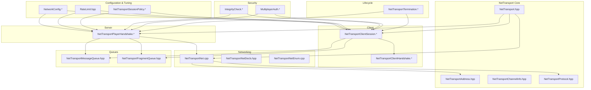
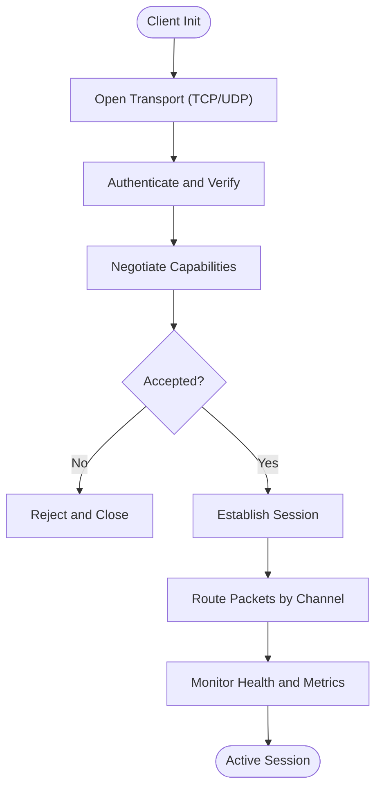
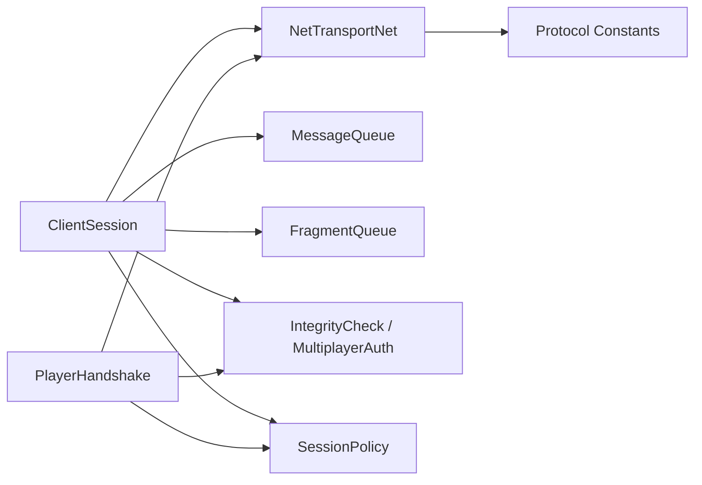

# Transport Layer

<cite>
**Referenced Files in This Document**
- [NetTransport.hpp](file://engine/Poseidon/Network/NetTransport.hpp)
- [NetTransportAddress.hpp](file://engine/Poseidon/Network/NetTransportAddress.hpp)
- [NetTransportChannelInfo.hpp](file://engine/Poseidon/Network/NetTransportChannelInfo.hpp)
- [NetTransportClientHandshake.cpp](file://engine/Poseidon/Network/NetTransportClientHandshake.cpp)
- [NetTransportClientHandshake.hpp](file://engine/Poseidon/Network/NetTransportClientHandshake.hpp)
- [NetTransportClientSession.cpp](file://engine/Poseidon/Network/NetTransportClientSession.cpp)
- [NetTransportClientSession.hpp](file://engine/Poseidon/Network/NetTransportClientSession.hpp)
- [NetTransportPlayerHandshake.cpp](file://engine/Poseidon/Network/NetTransportPlayerHandshake.cpp)
- [NetTransportPlayerHandshake.hpp](file://engine/Poseidon/Network/NetTransportPlayerHandshake.hpp)
- [NetTransportNet.cpp](file://engine/Poseidon/Network/NetTransportNet.cpp)
- [NetTransportNetDecls.hpp](file://engine/Poseidon/Network/NetTransportNetDecls.hpp)
- [NetTransportNetEnum.cpp](file://engine/Poseidon/Network/NetTransportNetEnum.cpp)
- [NetTransportProtocol.hpp](file://engine/Poseidon/Network/NetTransportProtocol.hpp)
- [IntegrityCheck.cpp](file://engine/Poseidon/Network/IntegrityCheck.cpp)
- [IntegrityCheck.hpp](file://engine/Poseidon/Network/IntegrityCheck.hpp)
- [MultiplayerAuth.cpp](file://engine/Poseidon/Network/MultiplayerAuth.cpp)
- [MultiplayerAuth.hpp](file://engine/Poseidon/Network/MultiplayerAuth.hpp)
- [NetworkConfig.cpp](file://engine/Poseidon/Network/NetworkConfig.cpp)
- [NetworkConfig.hpp](file://engine/Poseidon/Network/NetworkConfig.hpp)
- [RateLimit.hpp](file://engine/Poseidon/Network/RateLimit.hpp)
- [NetTransportMessageQueue.hpp](file://engine/Poseidon/Network/NetTransportMessageQueue.hpp)
- [NetTransportFragmentQueue.hpp](file://engine/Poseidon/Network/NetTransportFragmentQueue.hpp)
- [NetTransportSessionPolicy.cpp](file://engine/Poseidon/Network/NetTransportSessionPolicy.cpp)
- [NetTransportSessionPolicy.hpp](file://engine/Poseidon/Network/NetTransportSessionPolicy.hpp)
- [NetTransportTermination.cpp](file://engine/Poseidon/Network/NetTransportTermination.cpp)
- [NetTransportTermination.hpp](file://engine/Poseidon/Network/NetTransportTermination.hpp)
</cite>

## Table of Contents
1. [Introduction](#introduction)
2. [Project Structure](#project-structure)
3. [Core Components](#core-components)
4. [Architecture Overview](#architecture-overview)
5. [Detailed Component Analysis](#detailed-component-analysis)
6. [Dependency Analysis](#dependency-analysis)
7. [Performance Considerations](#performance-considerations)
8. [Troubleshooting Guide](#troubleshooting-guide)
9. [Conclusion](#conclusion)

## Introduction
This document explains the NetTransport abstraction layer that provides protocol-agnostic network communication for CWR-CE. It covers how TCP and UDP transports are abstracted behind a common interface, how connections are pooled and routed, and how client-server authentication, session establishment, and capability negotiation occur during the handshake. It also includes guidance for implementing custom transports, handling connection failures, optimizing packet delivery, and applying security measures such as encryption, integrity checks, and anti-cheat mechanisms. Performance tuning options, bandwidth optimization, and latency reduction techniques are documented to help achieve responsive multiplayer experiences.

## Project Structure
The NetTransport subsystem resides under the engine’s Network module. The key files define the transport interface, address types, channel metadata, client and server sessions, handshakes, protocol definitions, and supporting utilities for integrity and authentication.



**Diagram sources**
- [NetTransport.hpp](file://engine/Poseidon/Network/NetTransport.hpp)
- [NetTransportAddress.hpp](file://engine/Poseidon/Network/NetTransportAddress.hpp)
- [NetTransportChannelInfo.hpp](file://engine/Poseidon/Network/NetTransportChannelInfo.hpp)
- [NetTransportProtocol.hpp](file://engine/Poseidon/Network/NetTransportProtocol.hpp)
- [NetTransportClientHandshake.cpp](file://engine/Poseidon/Network/NetTransportClientHandshake.cpp)
- [NetTransportClientHandshake.hpp](file://engine/Poseidon/Network/NetTransportClientHandshake.hpp)
- [NetTransportClientSession.cpp](file://engine/Poseidon/Network/NetTransportClientSession.cpp)
- [NetTransportClientSession.hpp](file://engine/Poseidon/Network/NetTransportClientSession.hpp)
- [NetTransportPlayerHandshake.cpp](file://engine/Poseidon/Network/NetTransportPlayerHandshake.cpp)
- [NetTransportPlayerHandshake.hpp](file://engine/Poseidon/Network/NetTransportPlayerHandshake.hpp)
- [NetTransportNet.cpp](file://engine/Poseidon/Network/NetTransportNet.cpp)
- [NetTransportNetDecls.hpp](file://engine/Poseidon/Network/NetTransportNetDecls.hpp)
- [NetTransportNetEnum.cpp](file://engine/Poseidon/Network/NetTransportNetEnum.cpp)
- [IntegrityCheck.cpp](file://engine/Poseidon/Network/IntegrityCheck.cpp)
- [IntegrityCheck.hpp](file://engine/Poseidon/Network/IntegrityCheck.hpp)
- [MultiplayerAuth.cpp](file://engine/Poseidon/Network/MultiplayerAuth.cpp)
- [MultiplayerAuth.hpp](file://engine/Poseidon/Network/MultiplayerAuth.hpp)
- [NetworkConfig.cpp](file://engine/Poseidon/Network/NetworkConfig.cpp)
- [NetworkConfig.hpp](file://engine/Poseidon/Network/NetworkConfig.hpp)
- [RateLimit.hpp](file://engine/Poseidon/Network/RateLimit.hpp)
- [NetTransportSessionPolicy.cpp](file://engine/Poseidon/Network/NetTransportSessionPolicy.cpp)
- [NetTransportSessionPolicy.hpp](file://engine/Poseidon/Network/NetTransportSessionPolicy.hpp)
- [NetTransportTermination.cpp](file://engine/Poseidon/Network/NetTransportTermination.cpp)
- [NetTransportTermination.hpp](file://engine/Poseidon/Network/NetTransportTermination.hpp)

**Section sources**
- [NetTransport.hpp](file://engine/Poseidon/Network/NetTransport.hpp)
- [NetTransportAddress.hpp](file://engine/Poseidon/Network/NetTransportAddress.hpp)
- [NetTransportChannelInfo.hpp](file://engine/Poseidon/Network/NetTransportChannelInfo.hpp)
- [NetTransportProtocol.hpp](file://engine/Poseidon/Network/NetTransportProtocol.hpp)
- [NetTransportClientHandshake.cpp](file://engine/Poseidon/Network/NetTransportClientHandshake.cpp)
- [NetTransportClientHandshake.hpp](file://engine/Poseidon/Network/NetTransportClientHandshake.hpp)
- [NetTransportClientSession.cpp](file://engine/Poseidon/Network/NetTransportClientSession.cpp)
- [NetTransportClientSession.hpp](file://engine/Poseidon/Network/NetTransportClientSession.hpp)
- [NetTransportPlayerHandshake.cpp](file://engine/Poseidon/Network/NetTransportPlayerHandshake.cpp)
- [NetTransportPlayerHandshake.hpp](file://engine/Poseidon/Network/NetTransportPlayerHandshake.hpp)
- [NetTransportNet.cpp](file://engine/Poseidon/Network/NetTransportNet.cpp)
- [NetTransportNetDecls.hpp](file://engine/Poseidon/Network/NetTransportNetDecls.hpp)
- [NetTransportNetEnum.cpp](file://engine/Poseidon/Network/NetTransportNetEnum.cpp)
- [IntegrityCheck.cpp](file://engine/Poseidon/Network/IntegrityCheck.cpp)
- [IntegrityCheck.hpp](file://engine/Poseidon/Network/IntegrityCheck.hpp)
- [MultiplayerAuth.cpp](file://engine/Poseidon/Network/MultiplayerAuth.cpp)
- [MultiplayerAuth.hpp](file://engine/Poseidon/Network/MultiplayerAuth.hpp)
- [NetworkConfig.cpp](file://engine/Poseidon/Network/NetworkConfig.cpp)
- [NetworkConfig.hpp](file://engine/Poseidon/Network/NetworkConfig.hpp)
- [RateLimit.hpp](file://engine/Poseidon/Network/RateLimit.hpp)
- [NetTransportSessionPolicy.cpp](file://engine/Poseidon/Network/NetTransportSessionPolicy.cpp)
- [NetTransportSessionPolicy.hpp](file://engine/Poseidon/Network/NetTransportSessionPolicy.hpp)
- [NetTransportTermination.cpp](file://engine/Poseidon/Network/NetTransportTermination.cpp)
- [NetTransportTermination.hpp](file://engine/Poseidon/Network/NetTransportTermination.hpp)

## Core Components
- NetTransport interface: Defines the protocol-agnostic API for sending/receiving messages, managing channels, and lifecycle events. Implementations can target TCP or UDP while exposing a uniform surface.
- Address and Channel metadata: Encapsulates peer identity and per-channel configuration used by routing and policy engines.
- Client and Player sessions: Manage connection state, message queues, retransmission, and fragmentation for both client and server sides.
- Handshake modules: Coordinate authentication, capability negotiation, and session setup between client and server.
- Networking primitives: Low-level I/O, enumeration, and protocol constants that concrete transports implement.
- Security utilities: Integrity verification and multi-player authentication helpers.
- Configuration and policies: Tunable parameters for rate limiting, session behavior, and termination conditions.

Key responsibilities:
- Abstraction over transport protocols (TCP/UDP).
- Connection pooling and reuse where applicable.
- Packet routing based on channels and player context.
- Robust handshake with capability negotiation.
- Resilient error handling and graceful termination.

**Section sources**
- [NetTransport.hpp](file://engine/Poseidon/Network/NetTransport.hpp)
- [NetTransportAddress.hpp](file://engine/Poseidon/Network/NetTransportAddress.hpp)
- [NetTransportChannelInfo.hpp](file://engine/Poseidon/Network/NetTransportChannelInfo.hpp)
- [NetTransportClientSession.cpp](file://engine/Poseidon/Network/NetTransportClientSession.cpp)
- [NetTransportClientSession.hpp](file://engine/Poseidon/Network/NetTransportClientSession.hpp)
- [NetTransportPlayerHandshake.cpp](file://engine/Poseidon/Network/NetTransportPlayerHandshake.cpp)
- [NetTransportPlayerHandshake.hpp](file://engine/Poseidon/Network/NetTransportPlayerHandshake.hpp)
- [NetTransportNet.cpp](file://engine/Poseidon/Network/NetTransportNet.cpp)
- [NetTransportNetDecls.hpp](file://engine/Poseidon/Network/NetTransportNetDecls.hpp)
- [NetTransportNetEnum.cpp](file://engine/Poseidon/Network/NetTransportNetEnum.cpp)
- [IntegrityCheck.cpp](file://engine/Poseidon/Network/IntegrityCheck.cpp)
- [IntegrityCheck.hpp](file://engine/Poseidon/Network/IntegrityCheck.hpp)
- [MultiplayerAuth.cpp](file://engine/Poseidon/Network/MultiplayerAuth.cpp)
- [MultiplayerAuth.hpp](file://engine/Poseidon/Network/MultiplayerAuth.hpp)
- [NetworkConfig.cpp](file://engine/Poseidon/Network/NetworkConfig.cpp)
- [NetworkConfig.hpp](file://engine/Poseidon/Network/NetworkConfig.hpp)
- [RateLimit.hpp](file://engine/Poseidon/Network/RateLimit.hpp)
- [NetTransportSessionPolicy.cpp](file://engine/Poseidon/Network/NetTransportSessionPolicy.cpp)
- [NetTransportSessionPolicy.hpp](file://engine/Poseidon/Network/NetTransportSessionPolicy.hpp)
- [NetTransportTermination.cpp](file://engine/Poseidon/Network/NetTransportTermination.cpp)
- [NetTransportTermination.hpp](file://engine/Poseidon/Network/NetTransportTermination.hpp)

## Architecture Overview
The NetTransport architecture separates concerns into layers:
- Interface layer: Protocol-agnostic API for send/receive and session management.
- Session layer: Manages per-peer state, queues, fragmentation, and retransmission.
- Handshake layer: Performs authentication and capability negotiation.
- Transport layer: Concrete implementations for TCP/UDP using shared networking primitives.
- Security layer: Integrity checks and authentication helpers.
- Configuration layer: Policies and tunables for performance and reliability.

```mermaid
sequenceDiagram
participant App as "Application"
participant Client as "ClientSession"
participant Server as "PlayerHandshake"
participant Net as "NetTransportNet"
participant Sec as "IntegrityCheck / MultiplayerAuth"
App->>Client : "Initialize and configure"
Client->>Net : "Open connection (TCP/UDP)"
Client->>Sec : "Prepare credentials/capabilities"
Client->>Server : "Send handshake initiation"
Server-->>Client : "Challenge and capability request"
Client->>Sec : "Compute challenge response"
Client->>Server : "Send authenticated response"
Server-->>Client : "Accept and establish session"
Client->>Net : "Start reliable message flow"
Note over Client,Server : "Channels established; packets routed by channel"
```

**Diagram sources**
- [NetTransportClientSession.cpp](file://engine/Poseidon/Network/NetTransportClientSession.cpp)
- [NetTransportClientSession.hpp](file://engine/Poseidon/Network/NetTransportClientSession.hpp)
- [NetTransportPlayerHandshake.cpp](file://engine/Poseidon/Network/NetTransportPlayerHandshake.cpp)
- [NetTransportPlayerHandshake.hpp](file://engine/Poseidon/Network/NetTransportPlayerHandshake.hpp)
- [NetTransportNet.cpp](file://engine/Poseidon/Network/NetTransportNet.cpp)
- [IntegrityCheck.cpp](file://engine/Poseidon/Network/IntegrityCheck.cpp)
- [MultiplayerAuth.cpp](file://engine/Poseidon/Network/MultiplayerAuth.cpp)

## Detailed Component Analysis

### NetTransport Interface and Addressing
- NetTransport defines the core methods for sending messages, receiving frames, and querying connection state. It abstracts underlying protocol details so higher layers remain transport-agnostic.
- NetTransportAddress encapsulates peer identity and endpoint information used by routing logic.
- NetTransportChannelInfo carries per-channel metadata enabling differentiated treatment of traffic (e.g., voice vs. game state).

Implementation patterns:
- Virtual dispatch for protocol-specific operations.
- Strong typing for addresses and channels to prevent misuse.
- Clear separation between control and data planes.

**Section sources**
- [NetTransport.hpp](file://engine/Poseidon/Network/NetTransport.hpp)
- [NetTransportAddress.hpp](file://engine/Poseidon/Network/NetTransportAddress.hpp)
- [NetTransportChannelInfo.hpp](file://engine/Poseidon/Network/NetTransportChannelInfo.hpp)

### Client Session Management
- NetTransportClientSession coordinates connection lifecycle, message queuing, fragmentation, and retransmission for clients.
- It integrates with rate limiters and session policies to enforce bandwidth caps and adaptive behavior.
- It exposes hooks for application callbacks on connect/disconnect and message arrival.

Operational highlights:
- Outbound queue management with priority and ordering guarantees.
- Inbound processing pipeline with integrity validation.
- Reconnection strategies driven by session policy.

**Section sources**
- [NetTransportClientSession.cpp](file://engine/Poseidon/Network/NetTransportClientSession.cpp)
- [NetTransportClientSession.hpp](file://engine/Poseidon/Network/NetTransportClientSession.hpp)
- [RateLimit.hpp](file://engine/Poseidon/Network/RateLimit.hpp)
- [NetTransportSessionPolicy.cpp](file://engine/Poseidon/Network/NetTransportSessionPolicy.cpp)
- [NetTransportSessionPolicy.hpp](file://engine/Poseidon/Network/NetTransportSessionPolicy.hpp)

### Player Handshake and Authentication
- NetTransportPlayerHandshake orchestrates server-side authentication and capability negotiation when a new player connects.
- It validates credentials, negotiates supported features, and transitions the connection into an active session.

Flow overview:
- Challenge issuance and response verification.
- Capability exchange and compatibility checks.
- Session acceptance or rejection with appropriate feedback.

**Section sources**
- [NetTransportPlayerHandshake.cpp](file://engine/Poseidon/Network/NetTransportPlayerHandshake.cpp)
- [NetTransportPlayerHandshake.hpp](file://engine/Poseidon/Network/NetTransportPlayerHandshake.hpp)
- [MultiplayerAuth.cpp](file://engine/Poseidon/Network/MultiplayerAuth.cpp)
- [MultiplayerAuth.hpp](file://engine/Poseidon/Network/MultiplayerAuth.hpp)

### Networking Primitives and Protocol Definitions
- NetTransportNet provides low-level I/O abstractions and enumerations used by concrete transports.
- NetTransportProtocol defines wire format constants and message types.
- NetTransportNetDecls and NetTransportNetEnum centralize declarations and enumerations for consistency across components.

Design considerations:
- Minimal coupling between protocol definitions and transport implementations.
- Centralized constants to avoid drift and improve maintainability.

**Section sources**
- [NetTransportNet.cpp](file://engine/Poseidon/Network/NetTransportNet.cpp)
- [NetTransportNetDecls.hpp](file://engine/Poseidon/Network/NetTransportNetDecls.hpp)
- [NetTransportNetEnum.cpp](file://engine/Poseidon/Network/NetTransportNetEnum.cpp)
- [NetTransportProtocol.hpp](file://engine/Poseidon/Network/NetTransportProtocol.hpp)

### Security: Integrity and Authentication
- IntegrityCheck provides utilities to verify message integrity and detect tampering.
- MultiplayerAuth handles credential validation and secure challenge-response flows.

Best practices:
- Always validate incoming messages before processing.
- Use cryptographic primitives consistently across handshake and data paths.
- Enforce strict capability negotiation to prevent downgrade attacks.

**Section sources**
- [IntegrityCheck.cpp](file://engine/Poseidon/Network/IntegrityCheck.cpp)
- [IntegrityCheck.hpp](file://engine/Poseidon/Network/IntegrityCheck.hpp)
- [MultiplayerAuth.cpp](file://engine/Poseidon/Network/MultiplayerAuth.cpp)
- [MultiplayerAuth.hpp](file://engine/Poseidon/Network/MultiplayerAuth.hpp)

### Queues and Fragmentation
- NetTransportMessageQueue manages ordered delivery and prioritization of outbound messages.
- NetTransportFragmentQueue handles large packet fragmentation and reassembly, ensuring efficient use of MTU.

Optimization tips:
- Batch small messages to reduce overhead.
- Tune fragment sizes based on network characteristics.
- Apply backpressure when queues grow beyond thresholds.

**Section sources**
- [NetTransportMessageQueue.hpp](file://engine/Poseidon/Network/NetTransportMessageQueue.hpp)
- [NetTransportFragmentQueue.hpp](file://engine/Poseidon/Network/NetTransportFragmentQueue.hpp)

### Session Policy and Termination
- NetTransportSessionPolicy configures behavior for retries, timeouts, and adaptive adjustments.
- NetTransportTermination ensures clean shutdown and resource release across sessions.

Guidelines:
- Set sensible timeouts to balance responsiveness and resilience.
- Implement graceful degradation under high load.
- Log termination reasons for diagnostics.

**Section sources**
- [NetTransportSessionPolicy.cpp](file://engine/Poseidon/Network/NetTransportSessionPolicy.cpp)
- [NetTransportSessionPolicy.hpp](file://engine/Poseidon/Network/NetTransportSessionPolicy.hpp)
- [NetTransportTermination.cpp](file://engine/Poseidon/Network/NetTransportTermination.cpp)
- [NetTransportTermination.hpp](file://engine/Poseidon/Network/NetTransportTermination.hpp)

### Conceptual Overview
The following conceptual diagram illustrates how a client establishes a secure session with a server, negotiates capabilities, and begins reliable messaging over a chosen transport.



[No sources needed since this diagram shows conceptual workflow, not actual code structure]

## Dependency Analysis
The NetTransport subsystem exhibits clear layering and controlled dependencies:
- Sessions depend on networking primitives, queues, and security utilities.
- Handshake modules depend on authentication and integrity checks.
- Configuration and policies influence session behavior without altering core interfaces.



**Diagram sources**
- [NetTransportClientSession.cpp](file://engine/Poseidon/Network/NetTransportClientSession.cpp)
- [NetTransportPlayerHandshake.cpp](file://engine/Poseidon/Network/NetTransportPlayerHandshake.cpp)
- [NetTransportNet.cpp](file://engine/Poseidon/Network/NetTransportNet.cpp)
- [NetTransportMessageQueue.hpp](file://engine/Poseidon/Network/NetTransportMessageQueue.hpp)
- [NetTransportFragmentQueue.hpp](file://engine/Poseidon/Network/NetTransportFragmentQueue.hpp)
- [IntegrityCheck.cpp](file://engine/Poseidon/Network/IntegrityCheck.cpp)
- [MultiplayerAuth.cpp](file://engine/Poseidon/Network/MultiplayerAuth.cpp)
- [NetTransportSessionPolicy.cpp](file://engine/Poseidon/Network/NetTransportSessionPolicy.cpp)
- [NetTransportProtocol.hpp](file://engine/Poseidon/Network/NetTransportProtocol.hpp)

**Section sources**
- [NetTransportClientSession.cpp](file://engine/Poseidon/Network/NetTransportClientSession.cpp)
- [NetTransportPlayerHandshake.cpp](file://engine/Poseidon/Network/NetTransportPlayerHandshake.cpp)
- [NetTransportNet.cpp](file://engine/Poseidon/Network/NetTransportNet.cpp)
- [NetTransportMessageQueue.hpp](file://engine/Poseidon/Network/NetTransportMessageQueue.hpp)
- [NetTransportFragmentQueue.hpp](file://engine/Poseidon/Network/NetTransportFragmentQueue.hpp)
- [IntegrityCheck.cpp](file://engine/Poseidon/Network/IntegrityCheck.cpp)
- [MultiplayerAuth.cpp](file://engine/Poseidon/Network/MultiplayerAuth.cpp)
- [NetTransportSessionPolicy.cpp](file://engine/Poseidon/Network/NetTransportSessionPolicy.cpp)
- [NetTransportProtocol.hpp](file://engine/Poseidon/Network/NetTransportProtocol.hpp)

## Performance Considerations
- Bandwidth optimization:
  - Use batching for small messages to reduce overhead.
  - Adjust fragment sizes to match typical MTU and path characteristics.
  - Enable compression where payload size justifies CPU cost.
- Latency reduction:
  - Prioritize critical channels (e.g., input updates) over less time-sensitive data.
  - Minimize serialization/deserialization costs by reusing buffers.
  - Avoid blocking calls in the receive loop; process asynchronously.
- Reliability tuning:
  - Configure retransmission timeouts based on observed RTT and jitter.
  - Use exponential backoff with jitter to mitigate congestion.
- Monitoring:
  - Track queue lengths, drop rates, and round-trip times.
  - Adaptively throttle or degrade non-critical traffic under load.

[No sources needed since this section provides general guidance]

## Troubleshooting Guide
Common issues and resolutions:
- Connection failures:
  - Inspect transport open errors and retry policies.
  - Validate firewall rules and NAT traversal settings.
- Authentication failures:
  - Verify credential formats and challenge-response correctness.
  - Check capability mismatches and version compatibility.
- High latency or packet loss:
  - Review rate limiter settings and queue depths.
  - Analyze fragmentation and reassembly logs for MTU issues.
- Graceful shutdown:
  - Ensure termination signals propagate through sessions.
  - Confirm resources are released and sockets closed.

Diagnostic steps:
- Enable detailed logging for handshake and session states.
- Capture network traces to identify protocol anomalies.
- Use metrics to correlate performance regressions with configuration changes.

**Section sources**
- [NetTransportTermination.cpp](file://engine/Poseidon/Network/NetTransportTermination.cpp)
- [NetTransportTermination.hpp](file://engine/Poseidon/Network/NetTransportTermination.hpp)
- [NetTransportSessionPolicy.cpp](file://engine/Poseidon/Network/NetTransportSessionPolicy.cpp)
- [NetTransportSessionPolicy.hpp](file://engine/Poseidon/Network/NetTransportSessionPolicy.hpp)
- [NetworkConfig.cpp](file://engine/Poseidon/Network/NetworkConfig.cpp)
- [NetworkConfig.hpp](file://engine/Poseidon/Network/NetworkConfig.hpp)

## Conclusion
The NetTransport abstraction layer in CWR-CE delivers a robust, protocol-agnostic foundation for multiplayer networking. By separating interface, session, handshake, transport, and security concerns, it enables flexible implementations for TCP and UDP, supports connection pooling and packet routing, and provides strong security via integrity checks and authentication. With careful configuration of policies, queues, and rate limiters, developers can optimize for bandwidth, latency, and reliability while maintaining a resilient and secure user experience.

[No sources needed since this section summarizes without analyzing specific files]