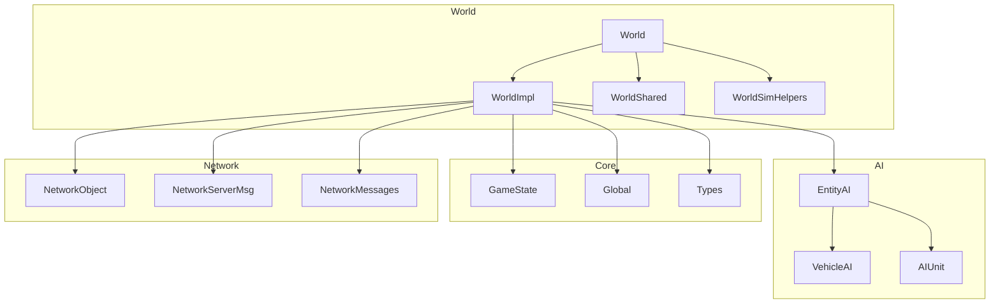
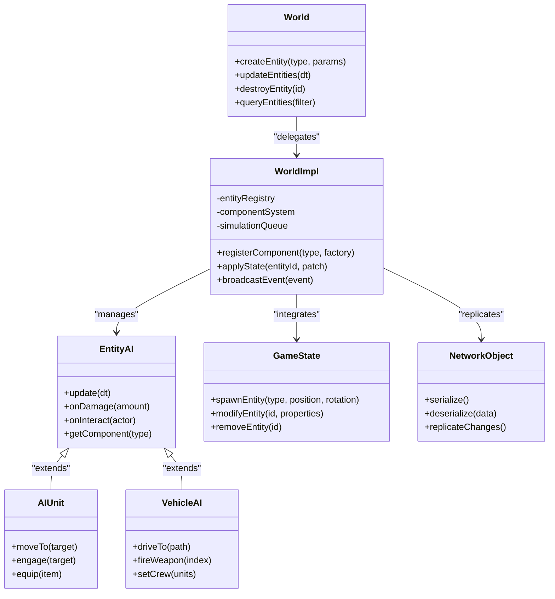
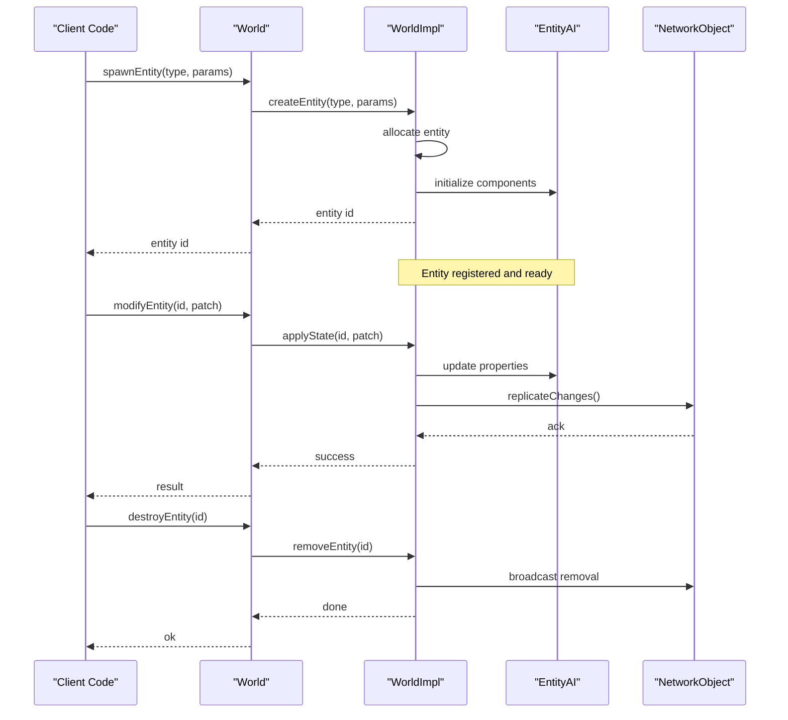
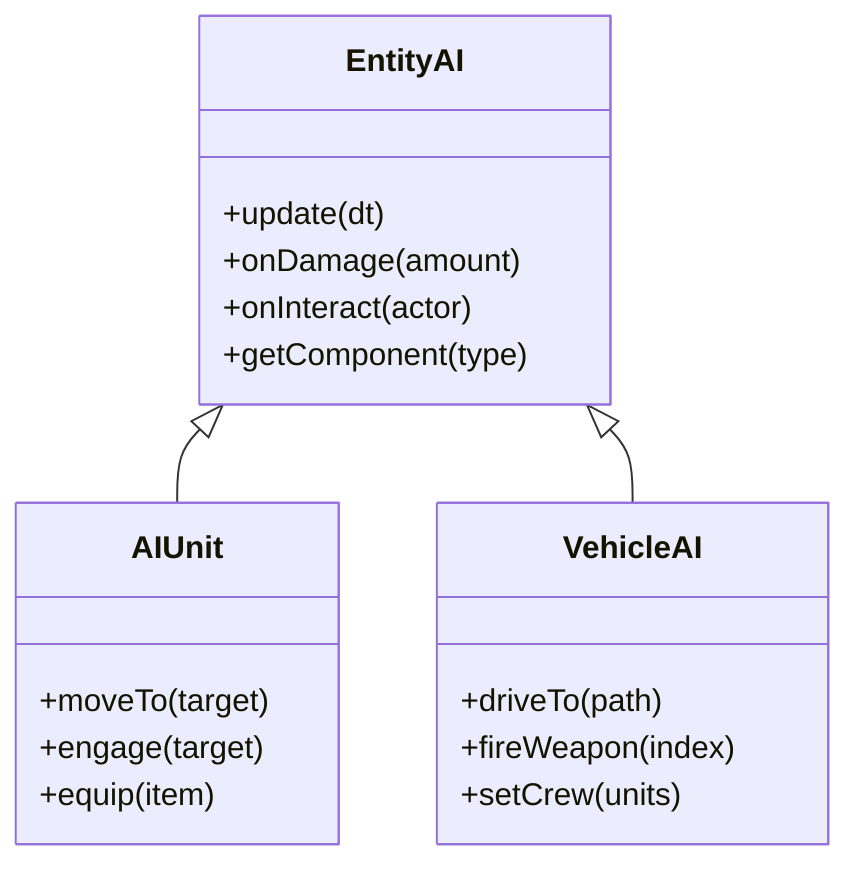
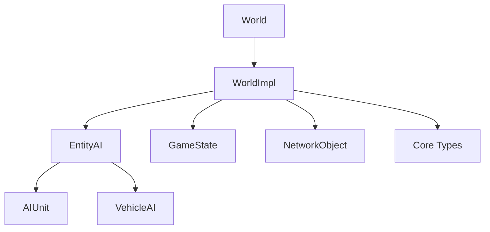

# Entity and Object Management

<cite>
**Referenced Files in This Document**
- [World.hpp](file://engine/Poseidon/World/World.hpp)
- [World.cpp](file://engine/Poseidon/World/World.cpp)
- [WorldImpl.cpp](file://engine/Poseidon/World/WorldImpl.cpp)
- [WorldInit.cpp](file://engine/Poseidon/World/WorldInit.cpp)
- [WorldShared.hpp](file://engine/Poseidon/World/WorldShared.hpp)
- [WorldSimHelpers.inc](file://engine/Poseidon/World/WorldSimHelpers.inc)
- [EntityAI.hpp](file://engine/Poseidon/AI/EntityAI.hpp)
- [EntityAI.cpp](file://engine/Poseidon/AI/EntityAI.cpp)
- [VehicleAI.hpp](file://engine/Poseidon/AI/VehicleAI.hpp)
- [VehicleAI.cpp](file://engine/Poseidon/AI/VehicleAI.cpp)
- [AIUnit.hpp](file://engine/Poseidon/AI/AIUnit.hpp)
- [AIUnitImpl.cpp](file://engine/Poseidon/AI/AIUnitImpl.cpp)
- [GameState.cpp](file://engine/Poseidon/Core/GameState.cpp)
- [Global.hpp](file://engine/Poseidon/Core/Global.hpp)
- [Types.hpp](file://engine/Poseidon/Core/Types.hpp)
- [NetworkObject.hpp](file://engine/Poseidon/Network/NetworkObject.hpp)
- [NetworkServerMsg.cpp](file://engine/Poseidon/Network/NetworkServerMsg.cpp)
- [NetworkMessages.hpp](file://engine/Poseidon/Network/NetworkMessages.hpp)
</cite>

## Table of Contents
1. [Introduction](#introduction)
2. [Project Structure](#project-structure)
3. [Core Components](#core-components)
4. [Architecture Overview](#architecture-overview)
5. [Detailed Component Analysis](#detailed-component-analysis)
6. [Dependency Analysis](#dependency-analysis)
7. [Performance Considerations](#performance-considerations)
8. [Troubleshooting Guide](#troubleshooting-guide)
9. [Conclusion](#conclusion)
10. [Appendices](#appendices)

## Introduction
This document explains the entity and object management systems in CWR-CE, focusing on base classes for objects and things, their inheritance hierarchy, and common interfaces used across the engine. It covers how entities are created, modified, and destroyed through GameState extensions, and details specialized types such as vehicles and infantry units. The guide also describes lifecycle management, component-like patterns, data binding approaches, and performance considerations for entity-heavy scenarios. Practical examples illustrate creating custom entities, modifying existing objects, and implementing entity-specific logic.

## Project Structure
The entity system spans several core areas:
- World and simulation layer manage entity lifecycles and scene composition.
- AI subsystem defines behavior abstractions for entities (e.g., AIUnit, VehicleAI).
- Core utilities provide shared types and global state access.
- Networking integrates entity state replication and server-side messaging.

**Diagram sources**
- [World.hpp](file://engine/Poseidon/World/World.hpp)
- [WorldImpl.cpp](file://engine/Poseidon/World/WorldImpl.cpp)
- [WorldShared.hpp](file://engine/Poseidon/World/WorldShared.hpp)
- [WorldSimHelpers.inc](file://engine/Poseidon/World/WorldSimHelpers.inc)
- [EntityAI.hpp](file://engine/Poseidon/AI/EntityAI.hpp)
- [VehicleAI.hpp](file://engine/Poseidon/AI/VehicleAI.hpp)
- [AIUnit.hpp](file://engine/Poseidon/AI/AIUnit.hpp)
- [GameState.cpp](file://engine/Poseidon/Core/GameState.cpp)
- [Global.hpp](file://engine/Poseidon/Core/Global.hpp)
- [Types.hpp](file://engine/Poseidon/Core/Types.hpp)
- [NetworkObject.hpp](file://engine/Poseidon/Network/NetworkObject.hpp)
- [NetworkServerMsg.cpp](file://engine/Poseidon/Network/NetworkServerMsg.cpp)
- [NetworkMessages.hpp](file://engine/Poseidon/Network/NetworkMessages.hpp)

**Section sources**
- [World.hpp](file://engine/Poseidon/World/World.hpp)
- [WorldImpl.cpp](file://engine/Poseidon/World/WorldImpl.cpp)
- [WorldShared.hpp](file://engine/Poseidon/World/WorldShared.hpp)
- [WorldSimHelpers.inc](file://engine/Poseidon/World/WorldSimHelpers.inc)
- [EntityAI.hpp](file://engine/Poseidon/AI/EntityAI.hpp)
- [VehicleAI.hpp](file://engine/Poseidon/AI/VehicleAI.hpp)
- [AIUnit.hpp](file://engine/Poseidon/AI/AIUnit.hpp)
- [GameState.cpp](file://engine/Poseidon/Core/GameState.cpp)
- [Global.hpp](file://engine/Poseidon/Core/Global.hpp)
- [Types.hpp](file://engine/Poseidon/Core/Types.hpp)
- [NetworkObject.hpp](file://engine/Poseidon/Network/NetworkObject.hpp)
- [NetworkServerMsg.cpp](file://engine/Poseidon/Network/NetworkServerMsg.cpp)
- [NetworkMessages.hpp](file://engine/Poseidon/Network/NetworkMessages.hpp)

## Core Components
- World and WorldImpl coordinate entity creation, modification, destruction, and simulation updates. They expose APIs to instantiate entities, attach components or behaviors, and query or mutate state during gameplay.
- EntityAI provides a common abstraction for all simulated entities, with specialized implementations for infantry (AIUnit) and vehicles (VehicleAI). These define movement, interaction, and combat-related behaviors.
- GameState extends core game state to include entity lifecycle hooks and scripting integration points.
- NetworkObject and related networking modules handle entity state replication and server-side message dispatching.

Key responsibilities:
- Creation: Factory-style methods in World/WorldImpl allocate and initialize entities based on configuration or mission data.
- Modification: Property setters and component updates propagate changes through simulation and network layers.
- Destruction: Cleanup routines release resources, detach components, and broadcast removal events.

**Section sources**
- [World.hpp](file://engine/Poseidon/World/World.hpp)
- [WorldImpl.cpp](file://engine/Poseidon/World/WorldImpl.cpp)
- [EntityAI.hpp](file://engine/Poseidon/AI/EntityAI.hpp)
- [AIUnit.hpp](file://engine/Poseidon/AI/AIUnit.hpp)
- [VehicleAI.hpp](file://engine/Poseidon/AI/VehicleAI.hpp)
- [GameState.cpp](file://engine/Poseidon/Core/GameState.cpp)
- [NetworkObject.hpp](file://engine/Poseidon/Network/NetworkObject.hpp)

## Architecture Overview
The entity architecture follows a layered approach:
- World layer manages the scene graph and entity registry.
- AI layer implements behavior abstractions and specialized logic.
- Core layer provides shared types and global context.
- Network layer ensures consistent state across clients and servers.

**Diagram sources**
- [World.hpp](file://engine/Poseidon/World/World.hpp)
- [WorldImpl.cpp](file://engine/Poseidon/World/WorldImpl.cpp)
- [EntityAI.hpp](file://engine/Poseidon/AI/EntityAI.hpp)
- [AIUnit.hpp](file://engine/Poseidon/AI/AIUnit.hpp)
- [VehicleAI.hpp](file://engine/Poseidon/AI/VehicleAI.hpp)
- [GameState.cpp](file://engine/Poseidon/Core/GameState.cpp)
- [NetworkObject.hpp](file://engine/Poseidon/Network/NetworkObject.hpp)

## Detailed Component Analysis

### World and WorldImpl
Responsibilities:
- Maintain an entity registry and component system.
- Provide APIs for spawning, updating, and destroying entities.
- Coordinate simulation steps and event broadcasting.

Lifecycle flow:
- Spawn: WorldImpl allocates an entity, initializes components, and registers it.
- Update: Simulation loop iterates over active entities, invoking update hooks.
- Destroy: Entities are unregistered, components released, and network messages sent.

**Diagram sources**
- [World.hpp](file://engine/Poseidon/World/World.hpp)
- [WorldImpl.cpp](file://engine/Poseidon/World/WorldImpl.cpp)
- [EntityAI.hpp](file://engine/Poseidon/AI/EntityAI.hpp)
- [NetworkObject.hpp](file://engine/Poseidon/Network/NetworkObject.hpp)

**Section sources**
- [World.hpp](file://engine/Poseidon/World/World.hpp)
- [WorldImpl.cpp](file://engine/Poseidon/World/WorldImpl.cpp)
- [WorldShared.hpp](file://engine/Poseidon/World/WorldShared.hpp)
- [WorldSimHelpers.inc](file://engine/Poseidon/World/WorldSimHelpers.inc)

### EntityAI, AIUnit, and VehicleAI
Abstraction and specialization:
- EntityAI defines common behavior interfaces like update, damage handling, and interactions.
- AIUnit specializes infantry behavior: movement, engagement, equipment.
- VehicleAI specializes vehicle behavior: driving, weapon firing, crew management.

**Diagram sources**
- [EntityAI.hpp](file://engine/Poseidon/AI/EntityAI.hpp)
- [EntityAI.cpp](file://engine/Poseidon/AI/EntityAI.cpp)
- [AIUnit.hpp](file://engine/Poseidon/AI/AIUnit.hpp)
- [AIUnitImpl.cpp](file://engine/Poseidon/AI/AIUnitImpl.cpp)
- [VehicleAI.hpp](file://engine/Poseidon/AI/VehicleAI.hpp)
- [VehicleAI.cpp](file://engine/Poseidon/AI/VehicleAI.cpp)

**Section sources**
- [EntityAI.hpp](file://engine/Poseidon/AI/EntityAI.hpp)
- [EntityAI.cpp](file://engine/Poseidon/AI/EntityAI.cpp)
- [AIUnit.hpp](file://engine/Poseidon/AI/AIUnit.hpp)
- [AIUnitImpl.cpp](file://engine/Poseidon/AI/AIUnitImpl.cpp)
- [VehicleAI.hpp](file://engine/Poseidon/AI/VehicleAI.hpp)
- [VehicleAI.cpp](file://engine/Poseidon/AI/VehicleAI.cpp)

### GameState Extensions
GameState provides high-level APIs for entity lifecycle operations:
- spawnEntity: Creates new entities with specified type, position, and rotation.
- modifyEntity: Applies property patches to existing entities.
- removeEntity: Destroys entities and cleans up associated resources.

These methods integrate with World/WorldImpl and trigger network replication when necessary.

**Section sources**
- [GameState.cpp](file://engine/Poseidon/Core/GameState.cpp)
- [World.hpp](file://engine/Poseidon/World/World.hpp)
- [WorldImpl.cpp](file://engine/Poseidon/World/WorldImpl.cpp)

### Data Binding and Component Patterns
- Components are attached to entities via WorldImpl’s component system.
- Data binding is achieved through property patches applied via modifyEntity.
- Event-driven updates allow decoupled communication between components.

Best practices:
- Use small, focused components for cohesion.
- Batch property updates to minimize replication overhead.
- Avoid tight coupling between components; use events for cross-component communication.

**Section sources**
- [WorldImpl.cpp](file://engine/Poseidon/World/WorldImpl.cpp)
- [WorldSimHelpers.inc](file://engine/Poseidon/World/WorldSimHelpers.inc)

### Networking Integration
NetworkObject serializes entity state and replicates changes across the network. Server-side messages coordinate multiplayer synchronization.

Key flows:
- State serialization/deserialization for consistency.
- Change detection to minimize bandwidth usage.
- Server authoritative updates for critical state.

**Section sources**
- [NetworkObject.hpp](file://engine/Poseidon/Network/NetworkObject.hpp)
- [NetworkServerMsg.cpp](file://engine/Poseidon/Network/NetworkServerMsg.cpp)
- [NetworkMessages.hpp](file://engine/Poseidon/Network/NetworkMessages.hpp)

## Dependency Analysis
Entity management depends on:
- World/WorldImpl for lifecycle and simulation.
- AI subsystem for behavior implementation.
- Core types and global state for shared context.
- Networking for multi-player synchronization.

**Diagram sources**
- [World.hpp](file://engine/Poseidon/World/World.hpp)
- [WorldImpl.cpp](file://engine/Poseidon/World/WorldImpl.cpp)
- [EntityAI.hpp](file://engine/Poseidon/AI/EntityAI.hpp)
- [AIUnit.hpp](file://engine/Poseidon/AI/AIUnit.hpp)
- [VehicleAI.hpp](file://engine/Poseidon/AI/VehicleAI.hpp)
- [GameState.cpp](file://engine/Poseidon/Core/GameState.cpp)
- [NetworkObject.hpp](file://engine/Poseidon/Network/NetworkObject.hpp)
- [Types.hpp](file://engine/Poseidon/Core/Types.hpp)

**Section sources**
- [World.hpp](file://engine/Poseidon/World/World.hpp)
- [WorldImpl.cpp](file://engine/Poseidon/World/WorldImpl.cpp)
- [EntityAI.hpp](file://engine/Poseidon/AI/EntityAI.hpp)
- [AIUnit.hpp](file://engine/Poseidon/AI/AIUnit.hpp)
- [VehicleAI.hpp](file://engine/Poseidon/AI/VehicleAI.hpp)
- [GameState.cpp](file://engine/Poseidon/Core/GameState.cpp)
- [NetworkObject.hpp](file://engine/Poseidon/Network/NetworkObject.hpp)
- [Types.hpp](file://engine/Poseidon/Core/Types.hpp)

## Performance Considerations
- Entity count: Limit simultaneous active entities to reduce CPU and memory pressure.
- Component design: Keep components small and avoid heavy computations in update loops.
- Replication: Batch updates and use change detection to minimize network traffic.
- Memory allocation: Reuse entity pools where possible to avoid frequent allocations.
- Simulation step: Tune dt and update frequency to balance accuracy and performance.

[No sources needed since this section provides general guidance]

## Troubleshooting Guide
Common issues and resolutions:
- Entity not appearing: Verify spawn parameters and ensure WorldImpl registration succeeded.
- State desync: Check NetworkObject serialization and server authoritative updates.
- Performance drops: Profile update loops and component interactions; consider batching.
- Memory leaks: Ensure proper cleanup in destroyEntity and component detachment.

Debugging tips:
- Use logging in WorldImpl to trace entity lifecycle events.
- Inspect NetworkObject serialization for correctness.
- Validate AIUnit/VehicleAI behavior with unit tests.

**Section sources**
- [WorldImpl.cpp](file://engine/Poseidon/World/WorldImpl.cpp)
- [NetworkObject.hpp](file://engine/Poseidon/Network/NetworkObject.hpp)
- [AIUnitImpl.cpp](file://engine/Poseidon/AI/AIUnitImpl.cpp)
- [VehicleAI.cpp](file://engine/Poseidon/AI/VehicleAI.cpp)

## Conclusion
CWR-CE’s entity system combines a robust World layer, flexible AI abstractions, and integrated networking to support complex simulations. By following best practices for component design, data binding, and performance optimization, developers can create scalable and maintainable entity-heavy applications.

[No sources needed since this section summarizes without analyzing specific files]

## Appendices
- Examples:
  - Creating custom entities: Extend EntityAI and register components via WorldImpl.
  - Modifying existing objects: Use GameState.modifyEntity with property patches.
  - Implementing entity-specific logic: Override AIUnit/VehicleAI methods for custom behavior.

[No sources needed since this section provides general guidance]