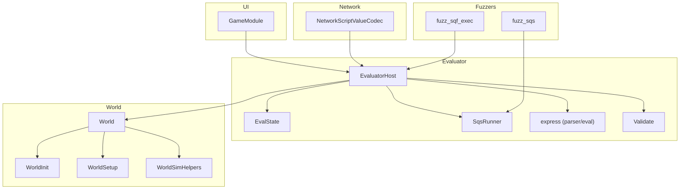
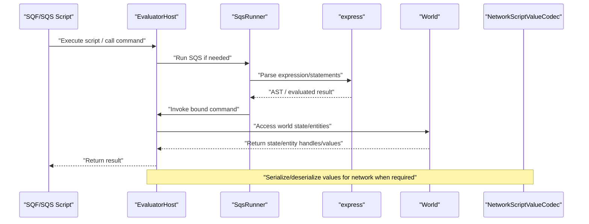
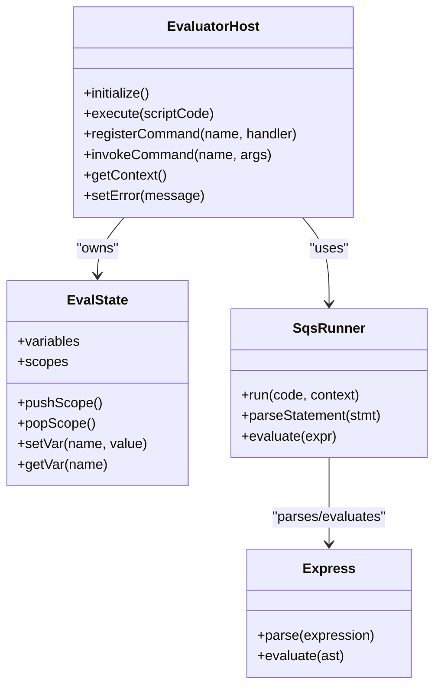
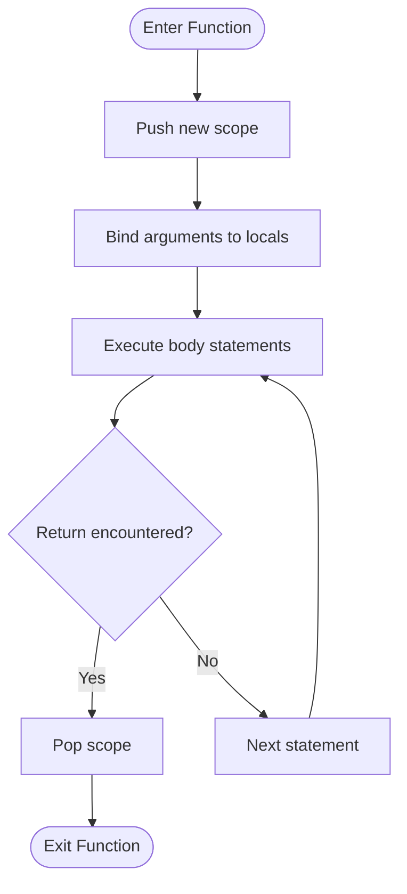
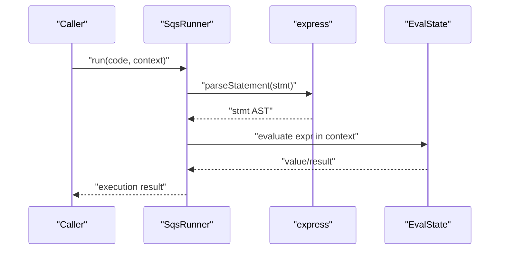
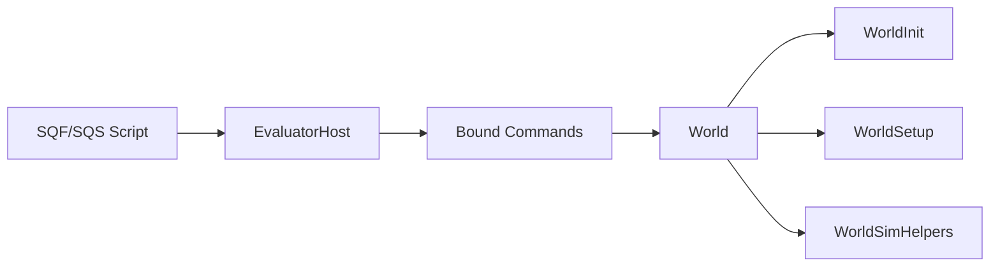
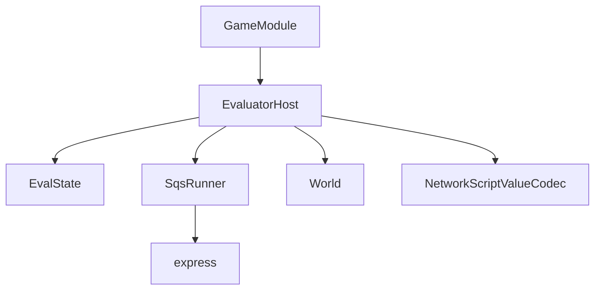

# Scripting Integration

<cite>
**Referenced Files in This Document**
- [EvaluatorHost.hpp](file://engine/Evaluator/EvaluatorHost.hpp)
- [EvaluatorHost.cpp](file://engine/Evaluator/EvaluatorHost.cpp)
- [EvalState.hpp](file://engine/Evaluator/EvalState.hpp)
- [EvalState.cpp](file://engine/Evaluator/EvalState.cpp)
- [SqsRunner.hpp](file://engine/Evaluator/SqsRunner.hpp)
- [SqsRunner.cpp](file://engine/Evaluator/SqsRunner.cpp)
- [express.hpp](file://engine/Evaluator/express.hpp)
- [express.cpp](file://engine/Evaluator/express.cpp)
- [Validate.hpp](file://engine/Evaluator/Validate.hpp)
- [Validate.cpp](file://engine/Evaluator/Validate.cpp)
- [World.hpp](file://engine/Poseidon/World/World.hpp)
- [World.cpp](file://engine/Poseidon/World/World.cpp)
- [WorldInit.cpp](file://engine/Poseidon/World/WorldInit.cpp)
- [WorldSetup.cpp](file://engine/Poseidon/World/WorldSetup.cpp)
- [WorldSimHelpers.inc](file://engine/Poseidon/World/WorldSimHelpers.inc)
- [GameModule.hpp](file://engine/Poseidon/UI/GameModule.hpp)
- [GameModule.cpp](file://engine/Poseidon/UI/GameModule.cpp)
- [NetworkScriptValueCodec.hpp](file://engine/Poseidon/Network/NetworkScriptValueCodec.hpp)
- [NetworkScriptValueCodec.cpp](file://engine/Poseidon/Network/NetworkScriptValueCodec.cpp)
- [fuzz_sqf_exec.cpp](file://apps/fuzzers/Fuzzer/fuzz_sqf_exec.cpp)
- [fuzz_sqs.cpp](file://apps/fuzzers/Fuzzer/fuzz_sqs.cpp)
</cite>

## Table of Contents
1. [Introduction](#introduction)
2. [Project Structure](#project-structure)
3. [Core Components](#core-components)
4. [Architecture Overview](#architecture-overview)
5. [Detailed Component Analysis](#detailed-component-analysis)
6. [Dependency Analysis](#dependency-analysis)
7. [Performance Considerations](#performance-considerations)
8. [Troubleshooting Guide](#troubleshooting-guide)
9. [Conclusion](#conclusion)
10. [Appendices](#appendices)

## Introduction
This document explains how scripting integrates with the world simulation, focusing on SQF/SQS execution, interaction with world state and entities, and the bridge between scripts and C++. It covers the scripting API surface exposed to scripts, function binding mechanisms, parameter handling, execution context and scoping, event-driven patterns, command registration, custom function implementation, and script-to-C++ communication. It also includes guidance for extending world functionality via scripts, creating game modes, implementing scripted behaviors, debugging techniques, performance profiling, and troubleshooting common issues.

## Project Structure
The scripting subsystem is primarily implemented under engine/Evaluator and integrates with the world simulation through engine/Poseidon/World and UI components. Network serialization for script values is handled under engine/Poseidon/Network. Fuzzers provide additional insight into execution paths.

**Diagram sources**
- [EvaluatorHost.hpp](file://engine/Evaluator/EvaluatorHost.hpp)
- [EvaluatorHost.cpp](file://engine/Evaluator/EvaluatorHost.cpp)
- [EvalState.hpp](file://engine/Evaluator/EvalState.hpp)
- [EvalState.cpp](file://engine/Evaluator/EvalState.cpp)
- [SqsRunner.hpp](file://engine/Evaluator/SqsRunner.hpp)
- [SqsRunner.cpp](file://engine/Evaluator/SqsRunner.cpp)
- [express.hpp](file://engine/Evaluator/express.hpp)
- [express.cpp](file://engine/Evaluator/express.cpp)
- [Validate.hpp](file://engine/Evaluator/Validate.hpp)
- [Validate.cpp](file://engine/Evaluator/Validate.cpp)
- [World.hpp](file://engine/Poseidon/World/World.hpp)
- [World.cpp](file://engine/Poseidon/World/World.cpp)
- [WorldInit.cpp](file://engine/Poseidon/World/WorldInit.cpp)
- [WorldSetup.cpp](file://engine/Poseidon/World/WorldSetup.cpp)
- [WorldSimHelpers.inc](file://engine/Poseidon/World/WorldSimHelpers.inc)
- [GameModule.hpp](file://engine/Poseidon/UI/GameModule.hpp)
- [GameModule.cpp](file://engine/Poseidon/UI/GameModule.cpp)
- [NetworkScriptValueCodec.hpp](file://engine/Poseidon/Network/NetworkScriptValueCodec.hpp)
- [NetworkScriptValueCodec.cpp](file://engine/Poseidon/Network/NetworkScriptValueCodec.cpp)
- [fuzz_sqf_exec.cpp](file://apps/fuzzers/Fuzzer/fuzz_sqf_exec.cpp)
- [fuzz_sqs.cpp](file://apps/fuzzers/Fuzzer/fuzz_sqs.cpp)

**Section sources**
- [EvaluatorHost.hpp](file://engine/Evaluator/EvaluatorHost.hpp)
- [EvaluatorHost.cpp](file://engine/Evaluator/EvaluatorHost.cpp)
- [EvalState.hpp](file://engine/Evaluator/EvalState.hpp)
- [EvalState.cpp](file://engine/Evaluator/EvalState.cpp)
- [SqsRunner.hpp](file://engine/Evaluator/SqsRunner.hpp)
- [SqsRunner.cpp](file://engine/Evaluator/SqsRunner.cpp)
- [express.hpp](file://engine/Evaluator/express.hpp)
- [express.cpp](file://engine/Evaluator/express.cpp)
- [Validate.hpp](file://engine/Evaluator/Validate.hpp)
- [Validate.cpp](file://engine/Evaluator/Validate.cpp)
- [World.hpp](file://engine/Poseidon/World/World.hpp)
- [World.cpp](file://engine/Poseidon/World/World.cpp)
- [WorldInit.cpp](file://engine/Poseidon/World/WorldInit.cpp)
- [WorldSetup.cpp](file://engine/Poseidon/World/WorldSetup.cpp)
- [WorldSimHelpers.inc](file://engine/Poseidon/World/WorldSimHelpers.inc)
- [GameModule.hpp](file://engine/Poseidon/UI/GameModule.hpp)
- [GameModule.cpp](file://engine/Poseidon/UI/GameModule.cpp)
- [NetworkScriptValueCodec.hpp](file://engine/Poseidon/Network/NetworkScriptValueCodec.hpp)
- [NetworkScriptValueCodec.cpp](file://engine/Poseidon/Network/NetworkScriptValueCodec.cpp)
- [fuzz_sqf_exec.cpp](file://apps/fuzzers/Fuzzer/fuzz_sqf_exec.cpp)
- [fuzz_sqs.cpp](file://apps/fuzzers/Fuzzer/fuzz_sqs.cpp)

## Core Components
- EvaluatorHost: Central host that manages script execution contexts, binds commands/functions, and coordinates evaluation of SQF/SQS code.
- EvalState: Holds per-execution state including variables, scopes, and runtime data used by scripts.
- SqsRunner: Dedicated runner for SQS scripts, parsing and executing statements within a given context.
- express: Expression parser and evaluator used by the scripting layer to evaluate expressions and build ASTs.
- Validate: Validation utilities for script inputs and structures.
- World integration: The World component exposes state and entity manipulation hooks to scripts via bindings.
- GameModule: UI/gameplay module that can trigger or manage scripted logic during gameplay.
- NetworkScriptValueCodec: Serializes/deserializes script values for network transport.
- Fuzzers: Provide stress and edge-case coverage for script execution paths.

Key responsibilities:
- Command registration and dispatch from scripts to C++ functions.
- Parameter marshaling between script types and native types.
- Execution context management (scopes, globals, locals).
- Event-driven callbacks and hooks invoked from the simulation loop.

**Section sources**
- [EvaluatorHost.hpp](file://engine/Evaluator/EvaluatorHost.hpp)
- [EvaluatorHost.cpp](file://engine/Evaluator/EvaluatorHost.cpp)
- [EvalState.hpp](file://engine/Evaluator/EvalState.hpp)
- [EvalState.cpp](file://engine/Evaluator/EvalState.cpp)
- [SqsRunner.hpp](file://engine/Evaluator/SqsRunner.hpp)
- [SqsRunner.cpp](file://engine/Evaluator/SqsRunner.cpp)
- [express.hpp](file://engine/Evaluator/express.hpp)
- [express.cpp](file://engine/Evaluator/express.cpp)
- [Validate.hpp](file://engine/Evaluator/Validate.hpp)
- [Validate.cpp](file://engine/Evaluator/Validate.cpp)
- [World.hpp](file://engine/Poseidon/World/World.hpp)
- [World.cpp](file://engine/Poseidon/World/World.cpp)
- [GameModule.hpp](file://engine/Poseidon/UI/GameModule.hpp)
- [GameModule.cpp](file://engine/Poseidon/UI/GameModule.cpp)
- [NetworkScriptValueCodec.hpp](file://engine/Poseidon/Network/NetworkScriptValueCodec.hpp)
- [NetworkScriptValueCodec.cpp](file://engine/Poseidon/Network/NetworkScriptValueCodec.cpp)

## Architecture Overview
The scripting architecture centers around an evaluator host that owns execution contexts and provides a stable API surface to scripts. Scripts call registered commands which are dispatched to C++ implementations. World state and entities are accessed through these commands. Network serialization ensures consistent value representation across clients and servers.

**Diagram sources**
- [EvaluatorHost.hpp](file://engine/Evaluator/EvaluatorHost.hpp)
- [EvaluatorHost.cpp](file://engine/Evaluator/EvaluatorHost.cpp)
- [SqsRunner.hpp](file://engine/Evaluator/SqsRunner.hpp)
- [SqsRunner.cpp](file://engine/Evaluator/SqsRunner.cpp)
- [express.hpp](file://engine/Evaluator/express.hpp)
- [express.cpp](file://engine/Evaluator/express.cpp)
- [World.hpp](file://engine/Poseidon/World/World.hpp)
- [World.cpp](file://engine/Poseidon/World/World.cpp)
- [NetworkScriptValueCodec.hpp](file://engine/Poseidon/Network/NetworkScriptValueCodec.hpp)
- [NetworkScriptValueCodec.cpp](file://engine/Poseidon/Network/NetworkScriptValueCodec.cpp)

## Detailed Component Analysis

### EvaluatorHost
EvaluatorHost is the primary interface for script execution and command binding. It maintains execution contexts, resolves commands, and bridges scripts to C++ functions. It orchestrates parsing and evaluation through the expression engine and runners.

Key aspects:
- Context lifecycle: creation, initialization, destruction.
- Command registry: mapping names to callable handlers.
- Parameter marshaling: converting script values to native types and vice versa.
- Error propagation: capturing and reporting errors back to scripts.

**Diagram sources**
- [EvaluatorHost.hpp](file://engine/Evaluator/EvaluatorHost.hpp)
- [EvaluatorHost.cpp](file://engine/Evaluator/EvaluatorHost.cpp)
- [EvalState.hpp](file://engine/Evaluator/EvalState.hpp)
- [EvalState.cpp](file://engine/Evaluator/EvalState.cpp)
- [SqsRunner.hpp](file://engine/Evaluator/SqsRunner.hpp)
- [SqsRunner.cpp](file://engine/Evaluator/SqsRunner.cpp)
- [express.hpp](file://engine/Evaluator/express.hpp)
- [express.cpp](file://engine/Evaluator/express.cpp)

**Section sources**
- [EvaluatorHost.hpp](file://engine/Evaluator/EvaluatorHost.hpp)
- [EvaluatorHost.cpp](file://engine/Evaluator/EvaluatorHost.cpp)
- [EvalState.hpp](file://engine/Evaluator/EvalState.hpp)
- [EvalState.cpp](file://engine/Evaluator/EvalState.cpp)
- [SqsRunner.hpp](file://engine/Evaluator/SqsRunner.hpp)
- [SqsRunner.cpp](file://engine/Evaluator/SqsRunner.cpp)
- [express.hpp](file://engine/Evaluator/express.hpp)
- [express.cpp](file://engine/Evaluator/express.cpp)

### EvalState and Scoping
EvalState manages variable storage and scope chains. Scripts create local scopes for functions and loops; global variables persist across executions unless explicitly cleared.

Responsibilities:
- Push/pop scopes to isolate variable visibility.
- Set/get variables by name with type-aware handling.
- Maintain execution metadata such as error states and stack traces.

**Diagram sources**
- [EvalState.hpp](file://engine/Evaluator/EvalState.hpp)
- [EvalState.cpp](file://engine/Evaluator/EvalState.cpp)

**Section sources**
- [EvalState.hpp](file://engine/Evaluator/EvalState.hpp)
- [EvalState.cpp](file://engine/Evaluator/EvalState.cpp)

### SqsRunner and Expression Evaluation
SqsRunner executes SQS scripts by parsing statements and evaluating expressions. It works closely with the expression engine to build and traverse ASTs.

Execution flow:
- Parse input code into statements.
- Evaluate each statement in the current context.
- Handle control flow constructs and function calls.
- Propagate errors and results back to the caller.

**Diagram sources**
- [SqsRunner.hpp](file://engine/Evaluator/SqsRunner.hpp)
- [SqsRunner.cpp](file://engine/Evaluator/SqsRunner.cpp)
- [express.hpp](file://engine/Evaluator/express.hpp)
- [express.cpp](file://engine/Evaluator/express.cpp)
- [EvalState.hpp](file://engine/Evaluator/EvalState.hpp)
- [EvalState.cpp](file://engine/Evaluator/EvalState.cpp)

**Section sources**
- [SqsRunner.hpp](file://engine/Evaluator/SqsRunner.hpp)
- [SqsRunner.cpp](file://engine/Evaluator/SqsRunner.cpp)
- [express.hpp](file://engine/Evaluator/express.hpp)
- [express.cpp](file://engine/Evaluator/express.cpp)
- [EvalState.hpp](file://engine/Evaluator/EvalState.hpp)
- [EvalState.cpp](file://engine/Evaluator/EvalState.cpp)

### World Integration and Entity Manipulation
Scripts interact with the world through commands bound to EvaluatorHost. These commands expose world state queries and entity manipulations.

Integration points:
- World initialization and setup routines expose hooks for scripting.
- Simulation helpers provide utility functions for scripted behaviors.
- Commands return handles or values representing entities and world objects.

**Diagram sources**
- [World.hpp](file://engine/Poseidon/World/World.hpp)
- [World.cpp](file://engine/Poseidon/World/World.cpp)
- [WorldInit.cpp](file://engine/Poseidon/World/WorldInit.cpp)
- [WorldSetup.cpp](file://engine/Poseidon/World/WorldSetup.cpp)
- [WorldSimHelpers.inc](file://engine/Poseidon/World/WorldSimHelpers.inc)
- [EvaluatorHost.hpp](file://engine/Evaluator/EvaluatorHost.hpp)
- [EvaluatorHost.cpp](file://engine/Evaluator/EvaluatorHost.cpp)

**Section sources**
- [World.hpp](file://engine/Poseidon/World/World.hpp)
- [World.cpp](file://engine/Poseidon/World/World.cpp)
- [WorldInit.cpp](file://engine/Poseidon/World/WorldInit.cpp)
- [WorldSetup.cpp](file://engine/Poseidon/World/WorldSetup.cpp)
- [WorldSimHelpers.inc](file://engine/Poseidon/World/WorldSimHelpers.inc)
- [EvaluatorHost.hpp](file://engine/Evaluator/EvaluatorHost.hpp)
- [EvaluatorHost.cpp](file://engine/Evaluator/EvaluatorHost.cpp)

### GameModule and Scripted Behaviors
GameModule coordinates UI and gameplay interactions that may trigger scripted logic. It can invoke commands to start missions, handle events, and update game state based on script outcomes.

Responsibilities:
- Trigger script execution on user actions or system events.
- Manage lifecycle of scripted behaviors tied to gameplay phases.
- Bridge UI events to scripting commands.

**Section sources**
- [GameModule.hpp](file://engine/Poseidon/UI/GameModule.hpp)
- [GameModule.cpp](file://engine/Poseidon/UI/GameModule.cpp)

### NetworkScriptValueCodec
Ensures script values are serialized consistently for network transmission. This is critical for multiplayer scenarios where scripts must share state across peers.

Responsibilities:
- Encode/decode primitive and composite script values.
- Maintain type fidelity across network boundaries.
- Integrate with EvaluatorHost for seamless value exchange.

**Section sources**
- [NetworkScriptValueCodec.hpp](file://engine/Poseidon/Network/NetworkScriptValueCodec.hpp)
- [NetworkScriptValueCodec.cpp](file://engine/Poseidon/Network/NetworkScriptValueCodec.cpp)

### Fuzzers for Script Execution
Fuzzers exercise script execution paths to uncover edge cases and robustness issues. They help validate parsing, evaluation, and command invocation flows.

Usage insights:
- fuzz_sqf_exec targets SQF execution entry points.
- fuzz_sqs targets SQS execution paths.
- Useful for regression testing and identifying crashes or undefined behavior.

**Section sources**
- [fuzz_sqf_exec.cpp](file://apps/fuzzers/Fuzzer/fuzz_sqf_exec.cpp)
- [fuzz_sqs.cpp](file://apps/fuzzers/Fuzzer/fuzz_sqs.cpp)

## Dependency Analysis
The scripting layer depends on the expression engine, world simulation, and network serialization. Dependencies are structured to keep the evaluator decoupled from concrete world implementations while providing clear interfaces for command binding.

**Diagram sources**
- [EvaluatorHost.hpp](file://engine/Evaluator/EvaluatorHost.hpp)
- [EvaluatorHost.cpp](file://engine/Evaluator/EvaluatorHost.cpp)
- [EvalState.hpp](file://engine/Evaluator/EvalState.hpp)
- [EvalState.cpp](file://engine/Evaluator/EvalState.cpp)
- [SqsRunner.hpp](file://engine/Evaluator/SqsRunner.hpp)
- [SqsRunner.cpp](file://engine/Evaluator/SqsRunner.cpp)
- [express.hpp](file://engine/Evaluator/express.hpp)
- [express.cpp](file://engine/Evaluator/express.cpp)
- [World.hpp](file://engine/Poseidon/World/World.hpp)
- [World.cpp](file://engine/Poseidon/World/World.cpp)
- [NetworkScriptValueCodec.hpp](file://engine/Poseidon/Network/NetworkScriptValueCodec.hpp)
- [NetworkScriptValueCodec.cpp](file://engine/Poseidon/Network/NetworkScriptValueCodec.cpp)
- [GameModule.hpp](file://engine/Poseidon/UI/GameModule.hpp)
- [GameModule.cpp](file://engine/Poseidon/UI/GameModule.cpp)

**Section sources**
- [EvaluatorHost.hpp](file://engine/Evaluator/EvaluatorHost.hpp)
- [EvaluatorHost.cpp](file://engine/Evaluator/EvaluatorHost.cpp)
- [EvalState.hpp](file://engine/Evaluator/EvalState.hpp)
- [EvalState.cpp](file://engine/Evaluator/EvalState.cpp)
- [SqsRunner.hpp](file://engine/Evaluator/SqsRunner.hpp)
- [SqsRunner.cpp](file://engine/Evaluator/SqsRunner.cpp)
- [express.hpp](file://engine/Evaluator/express.hpp)
- [express.cpp](file://engine/Evaluator/express.cpp)
- [World.hpp](file://engine/Poseidon/World/World.hpp)
- [World.cpp](file://engine/Poseidon/World/World.cpp)
- [NetworkScriptValueCodec.hpp](file://engine/Poseidon/Network/NetworkScriptValueCodec.hpp)
- [NetworkScriptValueCodec.cpp](file://engine/Poseidon/Network/NetworkScriptValueCodec.cpp)
- [GameModule.hpp](file://engine/Poseidon/UI/GameModule.hpp)
- [GameModule.cpp](file://engine/Poseidon/UI/GameModule.cpp)

## Performance Considerations
- Minimize frequent script calls in tight loops; batch operations where possible.
- Avoid excessive allocations in command handlers; reuse buffers and objects.
- Use efficient data structures for variable storage and lookup in EvalState.
- Profile script execution using built-in profiling hooks and external tools.
- Be cautious with deep recursion in scripts; prefer iterative approaches.
- Serialize only necessary data over the network to reduce bandwidth usage.

[No sources needed since this section provides general guidance]

## Troubleshooting Guide
Common issues and resolutions:
- Script parse errors: Check syntax and ensure expressions are valid; use validation utilities.
- Undefined variables: Verify scoping rules and ensure variables are set before access.
- Command not found: Confirm command registration and correct naming.
- Type mismatches: Ensure parameters match expected types in command handlers.
- Network deserialization failures: Validate value encoding and version compatibility.
- Crashes in execution: Use fuzzers and debug builds to identify edge cases.

Debugging techniques:
- Enable logging in EvaluatorHost and command handlers.
- Inspect EvalState variables during execution.
- Use breakpoints in SqsRunner and expression evaluation paths.
- Leverage fuzzers to reproduce problematic inputs.

**Section sources**
- [Validate.hpp](file://engine/Evaluator/Validate.hpp)
- [Validate.cpp](file://engine/Evaluator/Validate.cpp)
- [EvaluatorHost.hpp](file://engine/Evaluator/EvaluatorHost.hpp)
- [EvaluatorHost.cpp](file://engine/Evaluator/EvaluatorHost.cpp)
- [EvalState.hpp](file://engine/Evaluator/EvalState.hpp)
- [EvalState.cpp](file://engine/Evaluator/EvalState.cpp)
- [SqsRunner.hpp](file://engine/Evaluator/SqsRunner.hpp)
- [SqsRunner.cpp](file://engine/Evaluator/SqsRunner.cpp)
- [express.hpp](file://engine/Evaluator/express.hpp)
- [express.cpp](file://engine/Evaluator/express.cpp)
- [NetworkScriptValueCodec.hpp](file://engine/Poseidon/Network/NetworkScriptValueCodec.hpp)
- [NetworkScriptValueCodec.cpp](file://engine/Poseidon/Network/NetworkScriptValueCodec.cpp)
- [fuzz_sqf_exec.cpp](file://apps/fuzzers/Fuzzer/fuzz_sqf_exec.cpp)
- [fuzz_sqs.cpp](file://apps/fuzzers/Fuzzer/fuzz_sqs.cpp)

## Conclusion
The scripting integration provides a robust framework for extending world simulation behavior through SQF/SQS scripts. By leveraging EvaluatorHost for command binding, EvalState for scoping, and SqsRunner for execution, developers can implement rich scripted functionalities. Proper attention to performance, debugging, and network serialization ensures reliable and scalable scripting capabilities.

[No sources needed since this section summarizes without analyzing specific files]

## Appendices
- Best practices for command design: Keep handlers idempotent and avoid heavy work in hot paths.
- Event-driven patterns: Use callbacks to react to world changes triggered by scripts.
- Extensibility: Register new commands dynamically at runtime for mod support.
- Testing: Write unit tests for command handlers and integration tests for script workflows.

[No sources needed since this section provides general guidance]