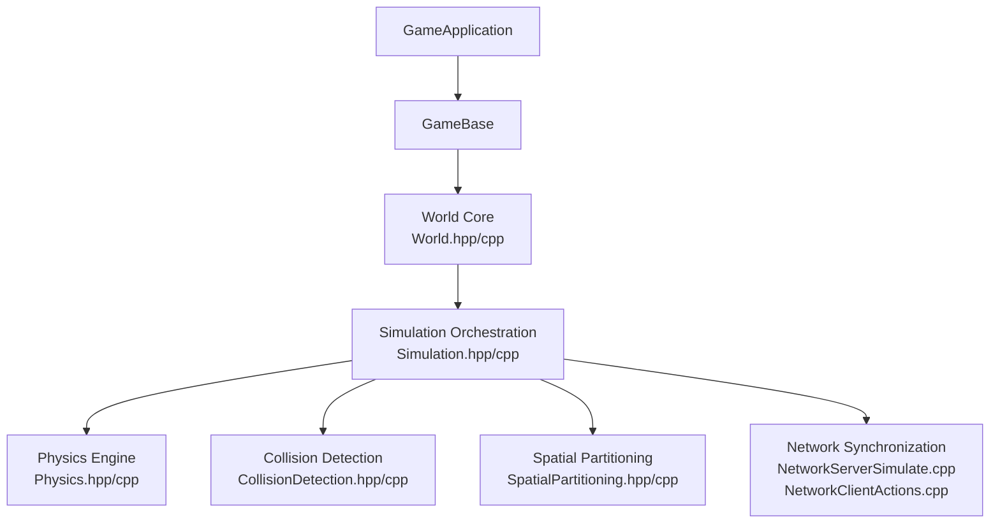
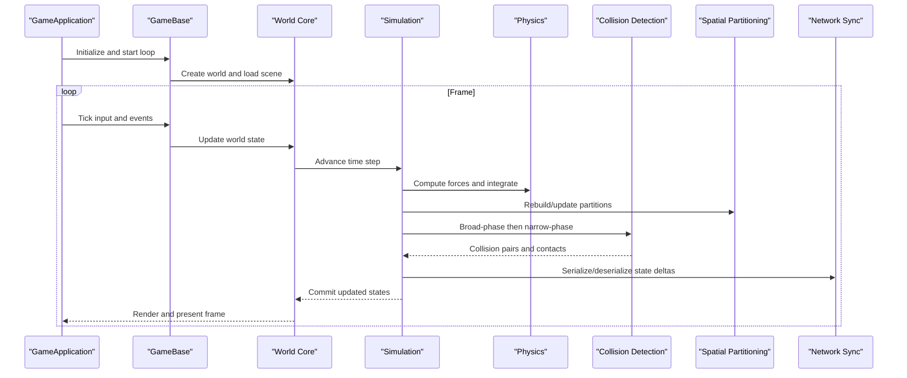
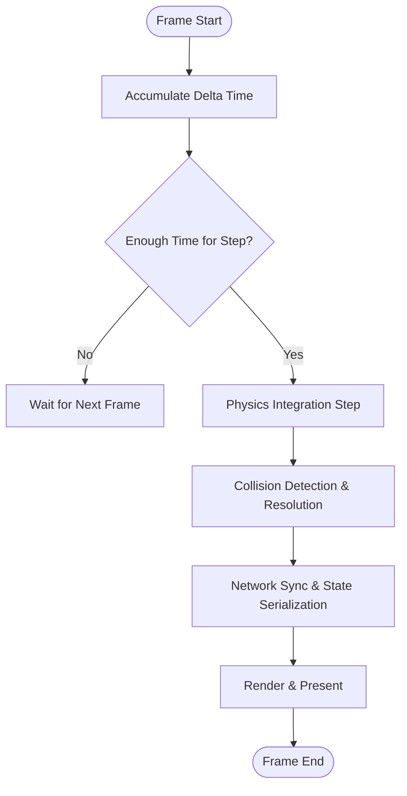
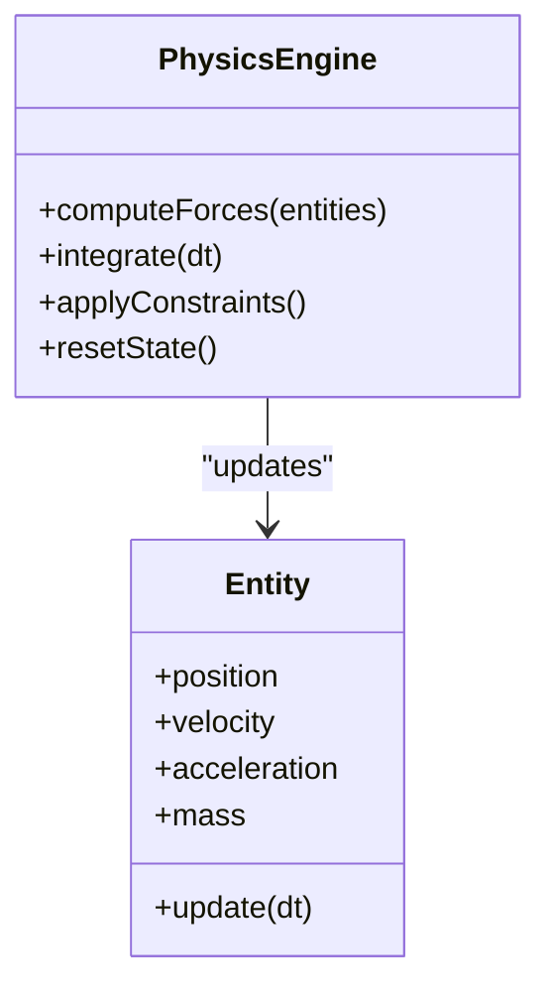
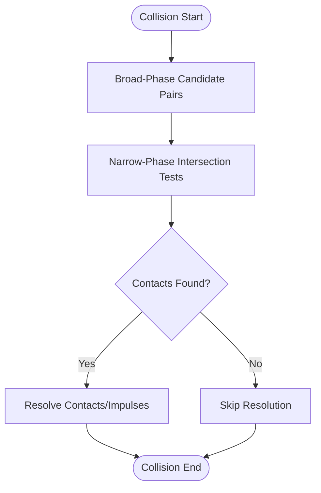
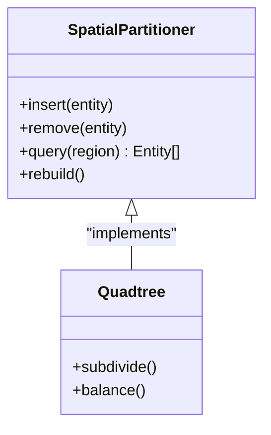
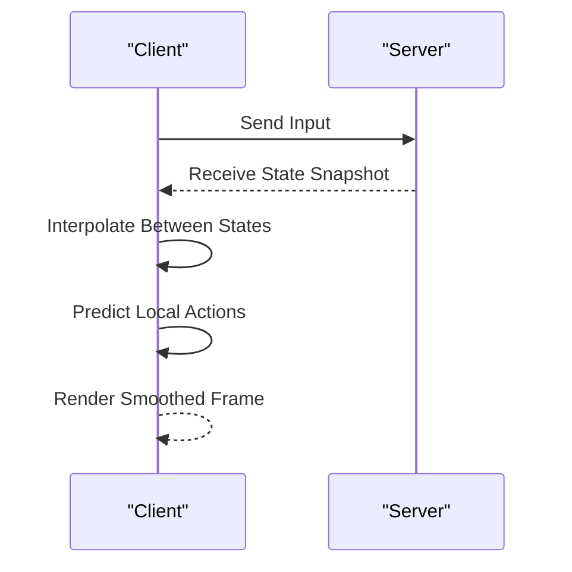
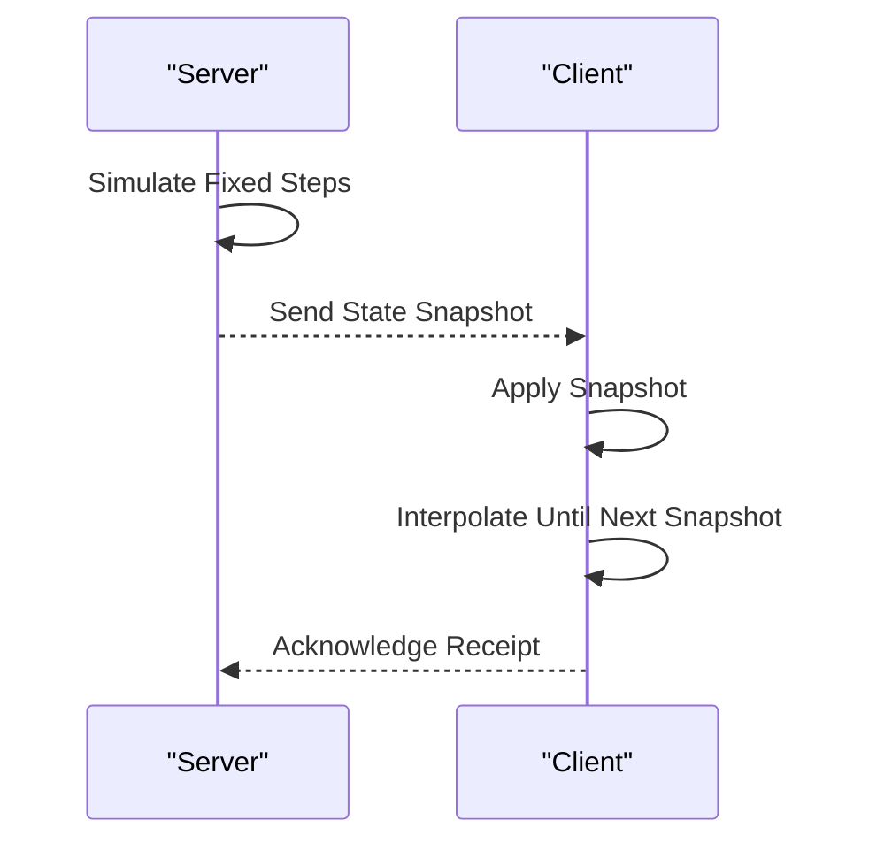
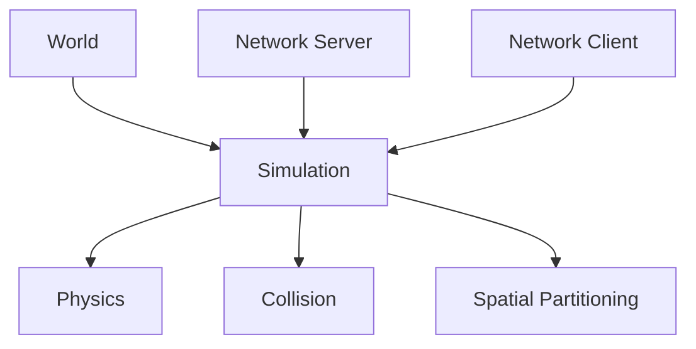

# Simulation Controls

<cite>
**Referenced Files in This Document**
- [World.hpp](file://engine/Poseidon/World/World.hpp)
- [World.cpp](file://engine/Poseidon/World/World.cpp)
- [WorldImpl.cpp](file://engine/Poseidon/World/WorldImpl.cpp)
- [WorldInit.cpp](file://engine/Poseidon/World/WorldInit.cpp)
- [WorldSimHelpers.inc](file://engine/Poseidon/World/WorldSimHelpers.inc)
- [Simulation.hpp](file://engine/Poseidon/World/Simulation/Simulation.hpp)
- [Simulation.cpp](file://engine/Poseidon/World/Simulation/Simulation.cpp)
- [Physics.hpp](file://engine/Poseidon/World/Simulation/Physics/Physics.hpp)
- [Physics.cpp](file://engine/Poseidon/World/Simulation/Physics/Physics.cpp)
- [CollisionDetection.hpp](file://engine/Poseidon/World/Detection/CollisionDetection.hpp)
- [CollisionDetection.cpp](file://engine/Poseidon/World/Detection/CollisionDetection.cpp)
- [SpatialPartitioning.hpp](file://engine/Poseidon/World/Scene/SpatialPartitioning.hpp)
- [SpatialPartitioning.cpp](file://engine/Poseidon/World/Scene/SpatialPartitioning.cpp)
- [NetworkServerSimulate.cpp](file://engine/Poseidon/Network/NetworkServerSimulate.cpp)
- [NetworkClientActions.cpp](file://engine/Poseidon/Network/NetworkClientActions.cpp)
- [GameApplication.cpp](file://apps/cwr/Game/GameApplication.cpp)
- [GameBase.cpp](file://apps/cwr/GameBase/GameBase.cpp)
</cite>

## Table of Contents
1. [Introduction](#introduction)
2. [Project Structure](#project-structure)
3. [Core Components](#core-components)
4. [Architecture Overview](#architecture-overview)
5. [Detailed Component Analysis](#detailed-component-analysis)
6. [Dependency Analysis](#dependency-analysis)
7. [Performance Considerations](#performance-considerations)
8. [Troubleshooting Guide](#troubleshooting-guide)
9. [Conclusion](#conclusion)
10. [Appendices](#appendices)

## Introduction
This document explains the simulation control systems that govern world physics, collision detection, and frame updates. It covers the simulation loop architecture, time stepping mechanisms, update ordering, collision detection algorithms, physics calculations, spatial partitioning strategies, frame inversion techniques, interpolation systems, and network synchronization patterns. It also provides guidance for customizing simulation behavior, implementing custom physics, optimizing performance, and using debugging tools to analyze and troubleshoot simulation issues.

## Project Structure
The simulation subsystem is primarily implemented under the Poseidon engine’s World and Network modules:
- World core and lifecycle: World.hpp/cpp, WorldImpl.cpp, WorldInit.cpp
- Simulation orchestration: Simulation.hpp/cpp
- Physics and collision: Physics.hpp/cpp, CollisionDetection.hpp/cpp
- Spatial partitioning: SpatialPartitioning.hpp/cpp
- Network synchronization: NetworkServerSimulate.cpp, NetworkClientActions.cpp
- Application entry points: GameApplication.cpp, GameBase.cpp

**Diagram sources**
- [GameApplication.cpp](file://apps/cwr/Game/GameApplication.cpp)
- [GameBase.cpp](file://apps/cwr/GameBase/GameBase.cpp)
- [World.hpp](file://engine/Poseidon/World/World.hpp)
- [World.cpp](file://engine/Poseidon/World/World.cpp)
- [Simulation.hpp](file://engine/Poseidon/World/Simulation/Simulation.hpp)
- [Physics.hpp](file://engine/Poseidon/World/Simulation/Physics/Physics.hpp)
- [CollisionDetection.hpp](file://engine/Poseidon/World/Detection/CollisionDetection.hpp)
- [SpatialPartitioning.hpp](file://engine/Poseidon/World/Scene/SpatialPartitioning.hpp)
- [NetworkServerSimulate.cpp](file://engine/Poseidon/Network/NetworkServerSimulate.cpp)
- [NetworkClientActions.cpp](file://engine/Poseidon/Network/NetworkClientActions.cpp)

**Section sources**
- [World.hpp](file://engine/Poseidon/World/World.hpp)
- [World.cpp](file://engine/Poseidon/World/World.cpp)
- [WorldImpl.cpp](file://engine/Poseidon/World/WorldImpl.cpp)
- [WorldInit.cpp](file://engine/Poseidon/World/WorldInit.cpp)
- [Simulation.hpp](file://engine/Poseidon/World/Simulation/Simulation.hpp)
- [Physics.hpp](file://engine/Poseidon/World/Simulation/Physics/Physics.hpp)
- [CollisionDetection.hpp](file://engine/Poseidon/World/Detection/CollisionDetection.hpp)
- [SpatialPartitioning.hpp](file://engine/Poseidon/World/Scene/SpatialPartitioning.hpp)
- [NetworkServerSimulate.cpp](file://engine/Poseidon/Network/NetworkServerSimulate.cpp)
- [NetworkClientActions.cpp](file://engine/Poseidon/Network/NetworkClientActions.cpp)
- [GameApplication.cpp](file://apps/cwr/Game/GameApplication.cpp)
- [GameBase.cpp](file://apps/cwr/GameBase/GameBase.cpp)

## Core Components
- World Core: Initializes and manages the game world lifecycle, scene setup, and integration with the application loop.
- Simulation Orchestration: Drives the main simulation loop, coordinates time stepping, and orders updates across subsystems.
- Physics Engine: Computes forces, velocities, accelerations, and integrates motion over time steps.
- Collision Detection: Identifies intersecting entities and triggers responses (e.g., impulses, constraints).
- Spatial Partitioning: Organizes objects into hierarchical or grid-based structures to accelerate queries and broad-phase collision checks.
- Network Synchronization: Ensures deterministic or authoritative simulation state consistency across clients and server.

Key responsibilities and interactions are detailed in the following sections.

**Section sources**
- [World.hpp](file://engine/Poseidon/World/World.hpp)
- [World.cpp](file://engine/Poseidon/World/World.cpp)
- [Simulation.hpp](file://engine/Poseidon/World/Simulation/Simulation.hpp)
- [Physics.hpp](file://engine/Poseidon/World/Simulation/Physics/Physics.hpp)
- [CollisionDetection.hpp](file://engine/Poseidon/World/Detection/CollisionDetection.hpp)
- [SpatialPartitioning.hpp](file://engine/Poseidon/World/Scene/SpatialPartitioning.hpp)
- [NetworkServerSimulate.cpp](file://engine/Poseidon/Network/NetworkServerSimulate.cpp)
- [NetworkClientActions.cpp](file://engine/Poseidon/Network/NetworkClientActions.cpp)

## Architecture Overview
The simulation architecture follows a layered approach:
- Application layer drives the main loop and delegates to the game base.
- World layer initializes scenes and exposes APIs for simulation control.
- Simulation orchestrates time stepping and update phases.
- Physics and collision compute dynamics and interactions.
- Spatial partitioning optimizes queries and broad-phase checks.
- Network layer synchronizes state deterministically across peers.

**Diagram sources**
- [GameApplication.cpp](file://apps/cwr/Game/GameApplication.cpp)
- [GameBase.cpp](file://apps/cwr/GameBase/GameBase.cpp)
- [World.hpp](file://engine/Poseidon/World/World.hpp)
- [Simulation.hpp](file://engine/Poseidon/World/Simulation/Simulation.hpp)
- [Physics.hpp](file://engine/Poseidon/World/Simulation/Physics/Physics.hpp)
- [CollisionDetection.hpp](file://engine/Poseidon/World/Detection/CollisionDetection.hpp)
- [SpatialPartitioning.hpp](file://engine/Poseidon/World/Scene/SpatialPartitioning.hpp)
- [NetworkServerSimulate.cpp](file://engine/Poseidon/Network/NetworkServerSimulate.cpp)
- [NetworkClientActions.cpp](file://engine/Poseidon/Network/NetworkClientActions.cpp)

## Detailed Component Analysis

### Simulation Loop and Time Stepping
- The simulation loop advances time by fixed or variable steps, ensuring deterministic updates where required.
- Time stepping may use fixed delta-time accumulation to maintain stability and reproducibility.
- Update ordering typically follows: input processing, physics integration, collision detection, constraint resolution, networking, and rendering.

**Diagram sources**
- [Simulation.hpp](file://engine/Poseidon/World/Simulation/Simulation.hpp)
- [Simulation.cpp](file://engine/Poseidon/World/Simulation/Simulation.cpp)
- [WorldSimHelpers.inc](file://engine/Poseidon/World/WorldSimHelpers.inc)

**Section sources**
- [Simulation.hpp](file://engine/Poseidon/World/Simulation/Simulation.hpp)
- [Simulation.cpp](file://engine/Poseidon/World/Simulation/Simulation.cpp)
- [WorldSimHelpers.inc](file://engine/Poseidon/World/WorldSimHelpers.inc)

### Physics Calculations and Integration
- Forces are computed per entity based on gravity, user inputs, and environmental effects.
- Integrators advance positions and orientations using velocity and acceleration over the time step.
- Constraints and damping stabilize motion and prevent numerical drift.

**Diagram sources**
- [Physics.hpp](file://engine/Poseidon/World/Simulation/Physics/Physics.hpp)
- [Physics.cpp](file://engine/Poseidon/World/Simulation/Physics/Physics.cpp)

**Section sources**
- [Physics.hpp](file://engine/Poseidon/World/Simulation/Physics/Physics.hpp)
- [Physics.cpp](file://engine/Poseidon/World/Simulation/Physics/Physics.cpp)

### Collision Detection Algorithms
- Broad-phase uses spatial partitioning to reduce candidate pairs.
- Narrow-phase performs precise intersection tests between shapes.
- Contact generation produces impulses or constraints to resolve overlaps.

**Diagram sources**
- [CollisionDetection.hpp](file://engine/Poseidon/World/Detection/CollisionDetection.hpp)
- [CollisionDetection.cpp](file://engine/Poseidon/World/Detection/CollisionDetection.cpp)
- [SpatialPartitioning.hpp](file://engine/Poseidon/World/Scene/SpatialPartitioning.hpp)

**Section sources**
- [CollisionDetection.hpp](file://engine/Poseidon/World/Detection/CollisionDetection.hpp)
- [CollisionDetection.cpp](file://engine/Poseidon/World/Detection/CollisionDetection.cpp)
- [SpatialPartitioning.hpp](file://engine/Poseidon/World/Scene/SpatialPartitioning.hpp)

### Spatial Partitioning Strategies
- Grid-based or hierarchical structures (e.g., quadtrees/octrees) organize entities for efficient queries.
- Partition updates occur when entities move beyond thresholds or periodically.
- Queries include overlap tests, raycasts, and neighbor searches.

**Diagram sources**
- [SpatialPartitioning.hpp](file://engine/Poseidon/World/Scene/SpatialPartitioning.hpp)
- [SpatialPartitioning.cpp](file://engine/Poseidon/World/Scene/SpatialPartitioning.cpp)

**Section sources**
- [SpatialPartitioning.hpp](file://engine/Poseidon/World/Scene/SpatialPartitioning.hpp)
- [SpatialPartitioning.cpp](file://engine/Poseidon/World/Scene/SpatialPartitioning.cpp)

### Frame Inversion Techniques and Interpolation
- Frame inversion allows rendering at different rates than simulation for smooth visuals.
- Interpolation blends between previous and current states to avoid jitter.
- Client-side prediction compensates for latency while maintaining consistency.

**Diagram sources**
- [NetworkClientActions.cpp](file://engine/Poseidon/Network/NetworkClientActions.cpp)
- [NetworkServerSimulate.cpp](file://engine/Poseidon/Network/NetworkServerSimulate.cpp)

**Section sources**
- [NetworkClientActions.cpp](file://engine/Poseidon/Network/NetworkClientActions.cpp)
- [NetworkServerSimulate.cpp](file://engine/Poseidon/Network/NetworkServerSimulate.cpp)

### Network Synchronization Patterns
- Authoritative server runs deterministic simulation and broadcasts state updates.
- Clients receive snapshots and interpolate to render smoothly.
- Delta compression reduces bandwidth usage.

**Diagram sources**
- [NetworkServerSimulate.cpp](file://engine/Poseidon/Network/NetworkServerSimulate.cpp)
- [NetworkClientActions.cpp](file://engine/Poseidon/Network/NetworkClientActions.cpp)

**Section sources**
- [NetworkServerSimulate.cpp](file://engine/Poseidon/Network/NetworkServerSimulate.cpp)
- [NetworkClientActions.cpp](file://engine/Poseidon/Network/NetworkClientActions.cpp)

## Dependency Analysis
The simulation components have clear dependencies:
- World depends on Simulation for orchestration.
- Simulation depends on Physics, Collision, and Spatial Partitioning.
- Network layers depend on Simulation for state serialization and synchronization.

**Diagram sources**
- [World.hpp](file://engine/Poseidon/World/World.hpp)
- [Simulation.hpp](file://engine/Poseidon/World/Simulation/Simulation.hpp)
- [Physics.hpp](file://engine/Poseidon/World/Simulation/Physics/Physics.hpp)
- [CollisionDetection.hpp](file://engine/Poseidon/World/Detection/CollisionDetection.hpp)
- [SpatialPartitioning.hpp](file://engine/Poseidon/World/Scene/SpatialPartitioning.hpp)
- [NetworkServerSimulate.cpp](file://engine/Poseidon/Network/NetworkServerSimulate.cpp)
- [NetworkClientActions.cpp](file://engine/Poseidon/Network/NetworkClientActions.cpp)

**Section sources**
- [World.hpp](file://engine/Poseidon/World/World.hpp)
- [Simulation.hpp](file://engine/Poseidon/World/Simulation/Simulation.hpp)
- [Physics.hpp](file://engine/Poseidon/World/Simulation/Physics/Physics.hpp)
- [CollisionDetection.hpp](file://engine/Poseidon/World/Detection/CollisionDetection.hpp)
- [SpatialPartitioning.hpp](file://engine/Poseidon/World/Scene/SpatialPartitioning.hpp)
- [NetworkServerSimulate.cpp](file://engine/Poseidon/Network/NetworkServerSimulate.cpp)
- [NetworkClientActions.cpp](file://engine/Poseidon/Network/NetworkClientActions.cpp)

## Performance Considerations
- Use fixed time steps for deterministic simulation; accumulate delta time to avoid drift.
- Optimize spatial partitioning rebuild frequency; only update when necessary.
- Minimize allocations during hot paths; reuse buffers and pools.
- Profile physics and collision costs; consider simplifying shapes or reducing query frequency.
- Network bandwidth can be reduced via delta compression and selective updates.

[No sources needed since this section provides general guidance]

## Troubleshooting Guide
Common issues and debugging approaches:
- Simulation drift: Verify time stepping logic and ensure consistent delta accumulation.
- Stuttering frames: Check interpolation and frame inversion settings; ensure rendering is decoupled from simulation.
- Collision misses: Validate broad-phase candidates and narrow-phase tests; inspect spatial partitioning accuracy.
- Network desync: Confirm deterministic simulation and consistent state serialization; check client prediction and rollback.

Debugging tools:
- Logging simulation steps and collision events.
- Profiling CPU and GPU usage to identify bottlenecks.
- Visualizing spatial partitions and collision volumes.

**Section sources**
- [WorldSimHelpers.inc](file://engine/Poseidon/World/WorldSimHelpers.inc)
- [Simulation.cpp](file://engine/Poseidon/World/Simulation/Simulation.cpp)
- [CollisionDetection.cpp](file://engine/Poseidon/World/Detection/CollisionDetection.cpp)
- [SpatialPartitioning.cpp](file://engine/Poseidon/World/Scene/SpatialPartitioning.cpp)

## Conclusion
The simulation control system combines robust time stepping, physics integration, collision detection, spatial partitioning, and network synchronization to deliver stable and responsive gameplay. By understanding the architecture and leveraging debugging tools, developers can customize behavior, implement advanced physics, and optimize performance effectively.

[No sources needed since this section summarizes without analyzing specific files]

## Appendices
- Customization examples: Extend PhysicsEngine for custom forces; override CollisionDetection for specialized shapes.
- Optimization tips: Batch updates, use SIMD where possible, and profile frequently.
- Best practices: Keep simulation deterministic, separate rendering from simulation, and validate network state consistency.

[No sources needed since this section provides general guidance]