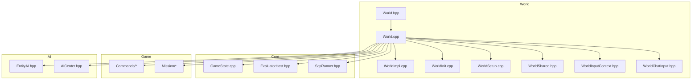
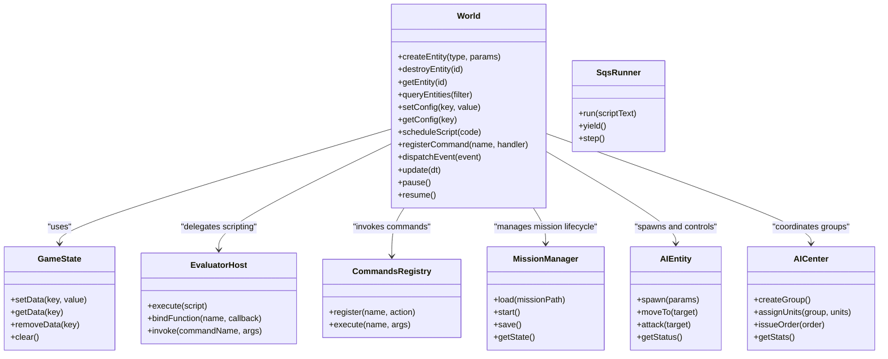
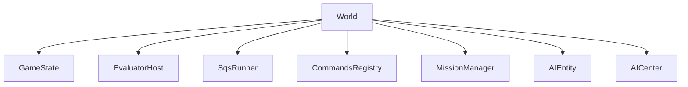

# World API

<cite>
**Referenced Files in This Document**
- [World.hpp](file://engine/Poseidon/World/World.hpp)
- [World.cpp](file://engine/Poseidon/World/World.cpp)
- [WorldImpl.cpp](file://engine/Poseidon/World/WorldImpl.cpp)
- [WorldInit.cpp](file://engine/Poseidon/World/WorldInit.cpp)
- [WorldSetup.cpp](file://engine/Poseidon/World/WorldSetup.cpp)
- [WorldShared.hpp](file://engine/Poseidon/World/WorldShared.hpp)
- [WorldInputContext.hpp](file://engine/Poseidon/World/WorldInputContext.hpp)
- [WorldChatInput.hpp](file://engine/Poseidon/World/WorldChatInput.hpp)
- [GameState.cpp](file://engine/Poseidon/Core/GameState.cpp)
- [EvaluatorHost.hpp](file://engine/Poseidon/Evaluator/EvaluatorHost.hpp)
- [SqsRunner.hpp](file://engine/Poseidon/Evaluator/SqsRunner.hpp)
- [EntityAI.hpp](file://engine/Poseidon/AI/EntityAI.hpp)
- [AICenter.hpp](file://engine/Poseidon/AI/AICenter.hpp)
- [Commands directory](file://engine/Poseidon/Game/Commands/)
- [Mission directory](file://engine/Poseidon/Game/Mission/)
</cite>

## Table of Contents
1. [Introduction](#introduction)
2. [Project Structure](#project-structure)
3. [Core Components](#core-components)
4. [Architecture Overview](#architecture-overview)
5. [Detailed Component Analysis](#detailed-component-analysis)
6. [Dependency Analysis](#dependency-analysis)
7. [Performance Considerations](#performance-considerations)
8. [Troubleshooting Guide](#troubleshooting-guide)
9. [Conclusion](#conclusion)
10. [Appendices](#appendices)

## Introduction
This document provides detailed API documentation for the world simulation interface in CWR-CE, focusing on the World class and related systems used for game state manipulation, entity management, and simulation control. It also covers GameState extensions for custom game logic, object creation and modification, world configuration, the command system for scripted actions, event handling, and world state synchronization. Guidance is included for thread safety considerations, performance implications, and debugging tools available during world development.

## Project Structure
The world simulation subsystem resides under engine/Poseidon/World and integrates with core engine components such as the Evaluator (scripting), AI subsystems, and Game commands. Key files include:
- World interface and implementation headers/sources
- Initialization and setup utilities
- Shared types and helpers
- Input context and chat input integration
- GameState and scripting host interfaces
- AI entities and centers
- Command definitions and mission support

**Diagram sources**
- [World.hpp](file://engine/Poseidon/World/World.hpp)
- [World.cpp](file://engine/Poseidon/World/World.cpp)
- [WorldImpl.cpp](file://engine/Poseidon/World/WorldImpl.cpp)
- [WorldInit.cpp](file://engine/Poseidon/World/WorldInit.cpp)
- [WorldSetup.cpp](file://engine/Poseidon/World/WorldSetup.cpp)
- [WorldShared.hpp](file://engine/Poseidon/World/WorldShared.hpp)
- [WorldInputContext.hpp](file://engine/Poseidon/World/WorldInputContext.hpp)
- [WorldChatInput.hpp](file://engine/Poseidon/World/WorldChatInput.hpp)
- [GameState.cpp](file://engine/Poseidon/Core/GameState.cpp)
- [EvaluatorHost.hpp](file://engine/Poseidon/Evaluator/EvaluatorHost.hpp)
- [SqsRunner.hpp](file://engine/Poseidon/Evaluator/SqsRunner.hpp)
- [EntityAI.hpp](file://engine/Poseidon/AI/EntityAI.hpp)
- [AICenter.hpp](file://engine/Poseidon/AI/AICenter.hpp)
- [Commands directory](file://engine/Poseidon/Game/Commands/)
- [Mission directory](file://engine/Poseidon/Game/Mission/)

**Section sources**
- [World.hpp](file://engine/Poseidon/World/World.hpp)
- [World.cpp](file://engine/Poseidon/World/World.cpp)
- [WorldImpl.cpp](file://engine/Poseidon/World/WorldImpl.cpp)
- [WorldInit.cpp](file://engine/Poseidon/World/WorldInit.cpp)
- [WorldSetup.cpp](file://engine/Poseidon/World/WorldSetup.cpp)
- [WorldShared.hpp](file://engine/Poseidon/World/WorldShared.hpp)
- [WorldInputContext.hpp](file://engine/Poseidon/World/WorldInputContext.hpp)
- [WorldChatInput.hpp](file://engine/Poseidon/World/WorldChatInput.hpp)
- [GameState.cpp](file://engine/Poseidon/Core/GameState.cpp)
- [EvaluatorHost.hpp](file://engine/Poseidon/Evaluator/EvaluatorHost.hpp)
- [SqsRunner.hpp](file://engine/Poseidon/Evaluator/SqsRunner.hpp)
- [EntityAI.hpp](file://engine/Poseidon/AI/EntityAI.hpp)
- [AICenter.hpp](file://engine/Poseidon/AI/AICenter.hpp)
- [Commands directory](file://engine/Poseidon/Game/Commands/)
- [Mission directory](file://engine/Poseidon/Game/Mission/)

## Core Components
- World: The central interface to the simulation environment, providing methods to create, modify, query, and manage entities; access world configuration; schedule and execute scripted actions; and handle events.
- GameState: Extensible state container for custom game logic, enabling persistent data across frames and sessions.
- EvaluatorHost and SqsRunner: Script execution infrastructure that bridges C++ APIs to scripting languages (e.g., SQF), allowing dynamic behavior and command invocation.
- Commands: A registry of executable actions invoked via scripts or UI, encapsulating gameplay operations like spawning units, changing weather, or triggering effects.
- Mission: Mission lifecycle and persistence support, integrating with World to load, run, and save missions.
- AI Entities and Centers: Abstractions for AI-driven objects and group coordination, exposed through World APIs for spawning and controlling AI.

Key responsibilities:
- Entity lifecycle: creation, destruction, property updates, querying by type/class, spatial queries, and association with players or groups.
- Simulation control: time stepping, frame pacing, pause/resume, and synchronization hooks.
- Configuration: loading world settings, terrain parameters, and runtime flags.
- Scripting integration: exposing functions to scripts, executing commands, and managing event callbacks.
- Event handling: dispatching world events (e.g., entity spawn/despawn, player join/leave, environmental changes).

**Section sources**
- [World.hpp](file://engine/Poseidon/World/World.hpp)
- [World.cpp](file://engine/Poseidon/World/World.cpp)
- [WorldImpl.cpp](file://engine/Poseidon/World/WorldImpl.cpp)
- [GameState.cpp](file://engine/Poseidon/Core/GameState.cpp)
- [EvaluatorHost.hpp](file://engine/Poseidon/Evaluator/EvaluatorHost.hpp)
- [SqsRunner.hpp](file://engine/Poseidon/Evaluator/SqsRunner.hpp)
- [Commands directory](file://engine/Poseidon/Game/Commands/)
- [Mission directory](file://engine/Poseidon/Game/Mission/)
- [EntityAI.hpp](file://engine/Poseidon/AI/EntityAI.hpp)
- [AICenter.hpp](file://engine/Poseidon/AI/AICenter.hpp)

## Architecture Overview
The World component orchestrates simulation updates, entity management, and scripting interactions. It delegates heavy tasks to specialized subsystems while maintaining a unified API surface.

**Diagram sources**
- [World.hpp](file://engine/Poseidon/World/World.hpp)
- [World.cpp](file://engine/Poseidon/World/World.cpp)
- [GameState.cpp](file://engine/Poseidon/Core/GameState.cpp)
- [EvaluatorHost.hpp](file://engine/Poseidon/Evaluator/EvaluatorHost.hpp)
- [SqsRunner.hpp](file://engine/Poseidon/Evaluator/SqsRunner.hpp)
- [Commands directory](file://engine/Poseidon/Game/Commands/)
- [Mission directory](file://engine/Poseidon/Game/Mission/)
- [EntityAI.hpp](file://engine/Poseidon/AI/EntityAI.hpp)
- [AICenter.hpp](file://engine/Poseidon/AI/AICenter.hpp)

## Detailed Component Analysis

### World Class API
The World class exposes methods for:
- Entity management: creating, destroying, querying, and updating entities.
- Configuration: reading and writing world settings at runtime.
- Scripting: scheduling and executing code via the evaluator.
- Events: registering handlers and dispatching world events.
- Simulation control: pausing, resuming, and stepping the simulation.

Typical usage patterns:
- Create an entity with parameters and attach it to a player or group.
- Query entities by type or spatial region.
- Update entity properties (position, health, state).
- Schedule scripted actions to run asynchronously.
- Register custom commands for reuse across scripts.

Thread safety considerations:
- Entity mutations should be performed on the simulation thread unless explicitly documented as safe from other threads.
- Use synchronization primitives when accessing shared state from multiple threads.
- Avoid long-running operations in event handlers to prevent frame stalls.

Performance implications:
- Batch entity updates where possible to reduce overhead.
- Prefer bulk queries over per-entity checks.
- Minimize frequent script executions within tight loops.

Debugging tips:
- Log entity IDs and states around critical operations.
- Use profiling tools to identify hotspots in update loops.
- Validate configuration values before applying them.

**Section sources**
- [World.hpp](file://engine/Poseidon/World/World.hpp)
- [World.cpp](file://engine/Poseidon/World/World.cpp)
- [WorldImpl.cpp](file://engine/Poseidon/World/WorldImpl.cpp)

### GameState Extensions
GameState provides a flexible storage mechanism for custom game logic:
- Store arbitrary key-value pairs for persistent data.
- Clear or remove specific entries as needed.
- Integrate with serialization for save/load functionality.

Best practices:
- Use descriptive keys to avoid collisions.
- Serialize only necessary data to minimize payload size.
- Validate data types before storing.

Example scenarios:
- Track mission objectives and progress.
- Maintain player-specific stats or preferences.
- Cache computed results for quick retrieval.

**Section sources**
- [GameState.cpp](file://engine/Poseidon/Core/GameState.cpp)

### Scripting Integration (EvaluatorHost and SqsRunner)
The scripting layer enables dynamic behavior through script execution:
- Bind C++ functions to script names for invocation.
- Execute scripts asynchronously without blocking the main loop.
- Manage script lifecycle and error handling.

Common workflows:
- Register commands in C++ and call them from scripts.
- Pass structured data between C++ and scripts using supported types.
- Handle exceptions and log errors gracefully.

Performance guidance:
- Avoid excessive script calls per frame.
- Cache frequently used function references.
- Use yield points to prevent starvation.

**Section sources**
- [EvaluatorHost.hpp](file://engine/Poseidon/Evaluator/EvaluatorHost.hpp)
- [SqsRunner.hpp](file://engine/Poseidon/Evaluator/SqsRunner.hpp)

### Command System
Commands encapsulate discrete actions that can be invoked from scripts or UI:
- Define command handlers in C++.
- Register commands with unique names.
- Execute commands with typed arguments.

Design principles:
- Keep commands atomic and idempotent where possible.
- Provide clear error messages for invalid inputs.
- Support both synchronous and asynchronous execution modes.

Use cases:
- Spawn vehicles or units.
- Modify weather or lighting conditions.
- Trigger audio or visual effects.

**Section sources**
- [Commands directory](file://engine/Poseidon/Game/Commands/)

### Mission Management
Mission support includes loading, starting, saving, and querying mission state:
- Load mission files from disk or archives.
- Initialize world state based on mission configuration.
- Persist changes back to storage.

Integration points:
- Hook into World initialization and shutdown.
- Coordinate with GameState for mission-specific data.
- Notify subscribers of mission events.

**Section sources**
- [Mission directory](file://engine/Poseidon/Game/Mission/)

### AI Entities and Centers
AI-related abstractions allow spawning and controlling intelligent agents:
- Spawn AI entities with predefined behaviors.
- Assign units to groups and issue orders.
- Query AI status and statistics.

Operational guidelines:
- Use centers to manage group dynamics efficiently.
- Avoid micromanaging individual units when group-level commands suffice.
- Monitor performance impact of complex AI routines.

**Section sources**
- [EntityAI.hpp](file://engine/Poseidon/AI/EntityAI.hpp)
- [AICenter.hpp](file://engine/Poseidon/AI/AICenter.hpp)

## Dependency Analysis
The World component depends on several subsystems to provide full functionality:

**Diagram sources**
- [World.hpp](file://engine/Poseidon/World/World.hpp)
- [GameState.cpp](file://engine/Poseidon/Core/GameState.cpp)
- [EvaluatorHost.hpp](file://engine/Poseidon/Evaluator/EvaluatorHost.hpp)
- [SqsRunner.hpp](file://engine/Poseidon/Evaluator/SqsRunner.hpp)
- [Commands directory](file://engine/Poseidon/Game/Commands/)
- [Mission directory](file://engine/Poseidon/Game/Mission/)
- [EntityAI.hpp](file://engine/Poseidon/AI/EntityAI.hpp)
- [AICenter.hpp](file://engine/Poseidon/AI/AICenter.hpp)

**Section sources**
- [World.hpp](file://engine/Poseidon/World/World.hpp)
- [World.cpp](file://engine/Poseidon/World/World.cpp)

## Performance Considerations
- Entity operations: Prefer batched updates and queries to reduce CPU overhead.
- Script execution: Limit frequency and complexity of script calls; cache reusable resources.
- AI computations: Offload heavy calculations to background threads if supported.
- Memory usage: Monitor allocations during entity creation/destruction; reuse objects where feasible.
- I/O operations: Asynchronize file reads/writes to avoid blocking the main loop.

[No sources needed since this section provides general guidance]

## Troubleshooting Guide
Common issues and resolutions:
- Script errors: Check logs for stack traces and validate syntax before execution.
- Entity not found: Verify IDs and ensure entities are created before access.
- Performance drops: Profile update loops and optimize hot paths.
- Configuration mismatches: Validate settings against expected formats and ranges.
- Thread conflicts: Ensure proper synchronization when accessing shared state.

Debugging tools:
- Enable verbose logging for detailed diagnostics.
- Use memory profilers to detect leaks or excessive allocations.
- Employ render debuggers to visualize entity bounds and paths.

**Section sources**
- [World.cpp](file://engine/Poseidon/World/World.cpp)
- [WorldImpl.cpp](file://engine/Poseidon/World/WorldImpl.cpp)

## Conclusion
The World API in CWR-CE provides a comprehensive interface for simulating dynamic environments, managing entities, and integrating scripting and AI systems. By following best practices for performance, thread safety, and debugging, developers can build robust and responsive game experiences. The modular architecture allows for easy extension and customization through GameState, commands, and mission management.

[No sources needed since this section summarizes without analyzing specific files]

## Appendices

### Example Workflows

#### Creating Custom Entities
Steps:
1. Define entity parameters (type, position, owner).
2. Call World.createEntity with appropriate arguments.
3. Attach additional components or behaviors as needed.
4. Query and update entity properties during simulation.

**Section sources**
- [World.hpp](file://engine/Poseidon/World/World.hpp)
- [World.cpp](file://engine/Poseidon/World/World.cpp)

#### Implementing Game-Specific Behaviors
Approach:
1. Extend GameState to store custom variables.
2. Register new commands for gameplay actions.
3. Use scripting to orchestrate complex sequences.
4. Integrate with AI centers for coordinated actions.

**Section sources**
- [GameState.cpp](file://engine/Poseidon/Core/GameState.cpp)
- [Commands directory](file://engine/Poseidon/Game/Commands/)
- [EntityAI.hpp](file://engine/Poseidon/AI/EntityAI.hpp)
- [AICenter.hpp](file://engine/Poseidon/AI/AICenter.hpp)

#### Handling World Events
Pattern:
1. Register event handlers during initialization.
2. Dispatch events from relevant subsystems.
3. Process events asynchronously to avoid blocking.
4. Clean up handlers when no longer needed.

**Section sources**
- [World.cpp](file://engine/Poseidon/World/World.cpp)
- [WorldImpl.cpp](file://engine/Poseidon/World/WorldImpl.cpp)