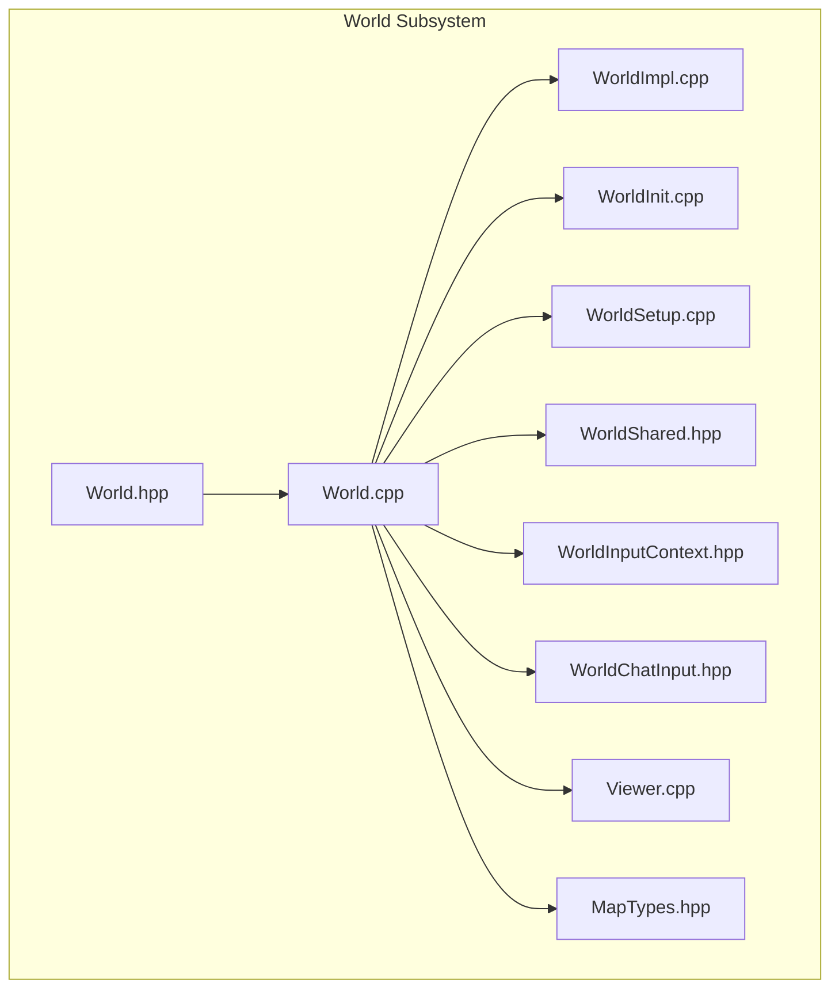
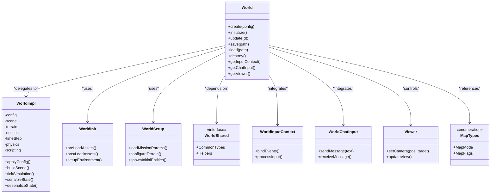
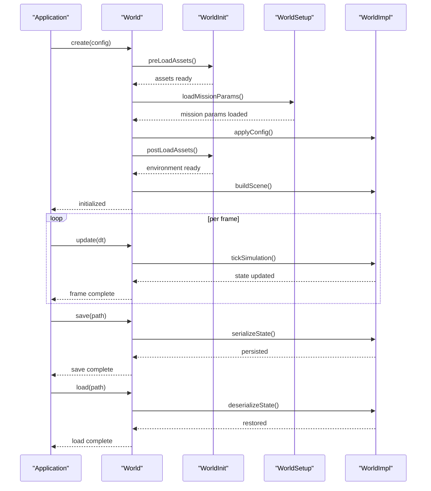
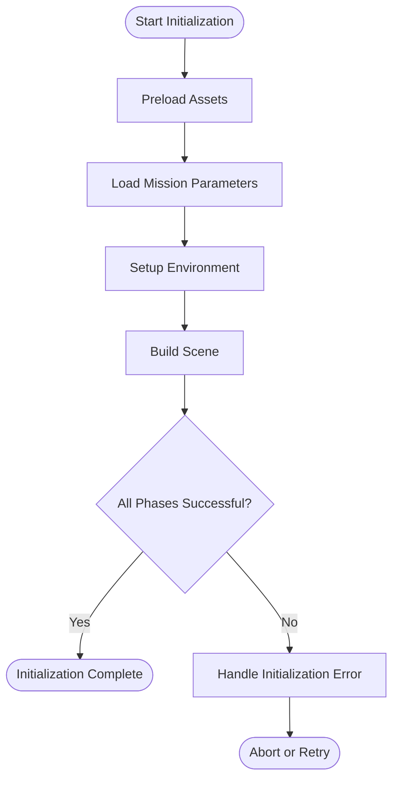
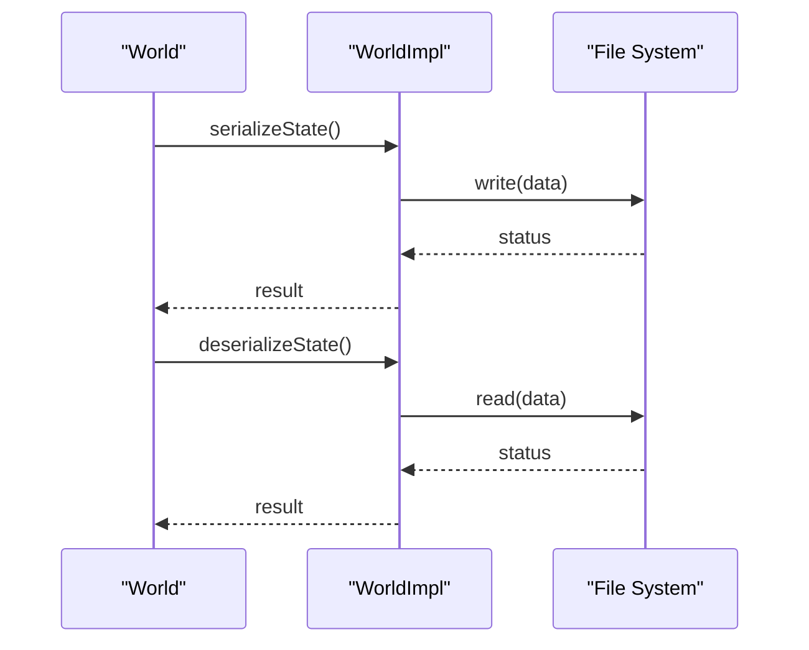
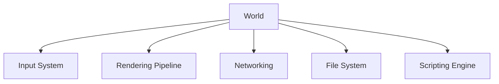

# World Core Interface

<cite>
**Referenced Files in This Document**
- [World.hpp](file://engine/Poseidon/World/World.hpp)
- [World.cpp](file://engine/Poseidon/World/World.cpp)
- [WorldImpl.cpp](file://engine/Poseidon/World/WorldImpl.cpp)
- [WorldInit.cpp](file://engine/Poseidon/World/WorldInit.cpp)
- [WorldSetup.cpp](file://engine/Poseidon/World/WorldSetup.cpp)
- [WorldShared.hpp](file://engine/Poseidon/World/WorldShared.hpp)
- [WorldInputContext.hpp](file://engine/Poseidon/World/WorldInputContext.hpp)
- [WorldChatInput.hpp](file://engine/Poseidon/World/WorldChatInput.hpp)
- [Viewer.cpp](file://engine/Poseidon/World/Viewer.cpp)
- [MapTypes.hpp](file://engine/Poseidon/World/MapTypes.hpp)
</cite>

## Table of Contents
1. [Introduction](#introduction)
2. [Project Structure](#project-structure)
3. [Core Components](#core-components)
4. [Architecture Overview](#architecture-overview)
5. [Detailed Component Analysis](#detailed-component-analysis)
6. [Dependency Analysis](#dependency-analysis)
7. [Performance Considerations](#performance-considerations)
8. [Troubleshooting Guide](#troubleshooting-guide)
9. [Conclusion](#conclusion)
10. [Appendices](#appendices)

## Introduction
This document provides comprehensive documentation for the core World interface in CWR-CE, focusing on the World class architecture, initialization lifecycle, and core methods for game state management. It explains world setup procedures, configuration loading, environment initialization, persistence mechanisms (save/load), state serialization, thread safety considerations, performance optimization strategies, memory management patterns, practical examples, error handling, debugging capabilities, and profiling tools available for world development.

## Project Structure
The World subsystem resides under engine/Poseidon/World and is organized around a clear separation between public interfaces, implementation details, initialization routines, and shared types:
- Public API and core abstractions are exposed via header files such as World.hpp and WorldShared.hpp.
- Implementation logic is split across multiple .cpp files to keep concerns focused: World.cpp, WorldImpl.cpp, WorldInit.cpp, WorldSetup.cpp.
- Supporting components include input context, chat input, viewer control, and map type definitions.

**Diagram sources**
- [World.hpp](file://engine/Poseidon/World/World.hpp)
- [World.cpp](file://engine/Poseidon/World/World.cpp)
- [WorldImpl.cpp](file://engine/Poseidon/World/WorldImpl.cpp)
- [WorldInit.cpp](file://engine/Poseidon/World/WorldInit.cpp)
- [WorldSetup.cpp](file://engine/Poseidon/World/WorldSetup.cpp)
- [WorldShared.hpp](file://engine/Poseidon/World/WorldShared.hpp)
- [WorldInputContext.hpp](file://engine/Poseidon/World/WorldInputContext.hpp)
- [WorldChatInput.hpp](file://engine/Poseidon/World/WorldChatInput.hpp)
- [Viewer.cpp](file://engine/Poseidon/World/Viewer.cpp)
- [MapTypes.hpp](file://engine/Poseidon/World/MapTypes.hpp)

**Section sources**
- [World.hpp](file://engine/Poseidon/World/World.hpp)
- [World.cpp](file://engine/Poseidon/World/World.cpp)
- [WorldImpl.cpp](file://engine/Poseidon/World/WorldImpl.cpp)
- [WorldInit.cpp](file://engine/Poseidon/World/WorldInit.cpp)
- [WorldSetup.cpp](file://engine/Poseidon/World/WorldSetup.cpp)
- [WorldShared.hpp](file://engine/Poseidon/World/WorldShared.hpp)
- [WorldInputContext.hpp](file://engine/Poseidon/World/WorldInputContext.hpp)
- [WorldChatInput.hpp](file://engine/Poseidon/World/WorldChatInput.hpp)
- [Viewer.cpp](file://engine/Poseidon/World/Viewer.cpp)
- [MapTypes.hpp](file://engine/Poseidon/World/MapTypes.hpp)

## Core Components
The World interface encapsulates the runtime simulation environment and exposes operations for creating, configuring, updating, saving, and destroying worlds. Key responsibilities include:
- Lifecycle management: creation, initialization, update loop integration, and destruction.
- Configuration and environment setup: loading mission parameters, terrain, and scene data.
- State management: entity registry, time stepping, physics updates, and scripting integration.
- Persistence: save/load workflows and serialization of world state.
- Input and UI integration: input context binding and chat input handling.
- Viewer control: camera and view management.

Practical usage typically involves constructing a World instance, applying configuration, initializing assets and scenes, running the update loop, and persisting state when needed.

**Section sources**
- [World.hpp](file://engine/Poseidon/World/World.hpp)
- [World.cpp](file://engine/Poseidon/World/World.cpp)
- [WorldImpl.cpp](file://engine/Poseidon/World/WorldImpl.cpp)
- [WorldInit.cpp](file://engine/Poseidon/World/WorldInit.cpp)
- [WorldSetup.cpp](file://engine/Poseidon/World/WorldSetup.cpp)
- [WorldShared.hpp](file://engine/Poseidon/World/WorldShared.hpp)
- [WorldInputContext.hpp](file://engine/Poseidon/World/WorldInputContext.hpp)
- [WorldChatInput.hpp](file://engine/Poseidon/World/WorldChatInput.hpp)
- [Viewer.cpp](file://engine/Poseidon/World/Viewer.cpp)
- [MapTypes.hpp](file://engine/Poseidon/World/MapTypes.hpp)

## Architecture Overview
The World architecture follows a layered design:
- Public API layer: World.hpp defines the interface used by applications and higher-level systems.
- Implementation layer: World.cpp orchestrates subsystems; WorldImpl.cpp contains concrete logic; WorldInit.cpp handles initialization sequences; WorldSetup.cpp manages configuration and environment setup.
- Shared utilities: WorldShared.hpp provides common types and helpers; MapTypes.hpp defines map-related enumerations and structures.
- Integration points: WorldInputContext.hpp binds input events; WorldChatInput.hpp manages chat interactions; Viewer.cpp controls camera/view state.

**Diagram sources**
- [World.hpp](file://engine/Poseidon/World/World.hpp)
- [World.cpp](file://engine/Poseidon/World/World.cpp)
- [WorldImpl.cpp](file://engine/Poseidon/World/WorldImpl.cpp)
- [WorldInit.cpp](file://engine/Poseidon/World/WorldInit.cpp)
- [WorldSetup.cpp](file://engine/Poseidon/World/WorldSetup.cpp)
- [WorldShared.hpp](file://engine/Poseidon/World/WorldShared.hpp)
- [WorldInputContext.hpp](file://engine/Poseidon/World/WorldInputContext.hpp)
- [WorldChatInput.hpp](file://engine/Poseidon/World/WorldChatInput.hpp)
- [Viewer.cpp](file://engine/Poseidon/World/Viewer.cpp)
- [MapTypes.hpp](file://engine/Poseidon/World/MapTypes.hpp)

## Detailed Component Analysis

### World Class Architecture
The World class serves as the primary entry point for managing the simulation environment. It coordinates initialization, update cycles, and persistence while delegating detailed work to specialized modules. The interface emphasizes clean separation between configuration, environment setup, and runtime operations.

Key aspects:
- Creation and configuration: Accepts a configuration object that defines mission parameters, asset paths, and runtime options.
- Initialization sequence: Preloads assets, sets up environment, and builds the scene graph.
- Update loop: Advances time, processes physics, runs scripting hooks, and synchronizes with rendering and networking.
- Persistence: Serializes world state to disk and restores from saved states.
- Integration: Provides accessors for input context, chat input, and viewer control.

**Diagram sources**
- [World.cpp](file://engine/Poseidon/World/World.cpp)
- [WorldInit.cpp](file://engine/Poseidon/World/WorldInit.cpp)
- [WorldSetup.cpp](file://engine/Poseidon/World/WorldSetup.cpp)
- [WorldImpl.cpp](file://engine/Poseidon/World/WorldImpl.cpp)

**Section sources**
- [World.hpp](file://engine/Poseidon/World/World.hpp)
- [World.cpp](file://engine/Poseidon/World/World.cpp)
- [WorldImpl.cpp](file://engine/Poseidon/World/WorldImpl.cpp)
- [WorldInit.cpp](file://engine/Poseidon/World/WorldInit.cpp)
- [WorldSetup.cpp](file://engine/Poseidon/World/WorldSetup.cpp)

### Initialization Lifecycle
Initialization is structured into distinct phases to ensure deterministic startup:
- Asset preloading: Loads essential resources required for configuration and environment setup.
- Mission parameter loading: Parses mission-specific settings and constraints.
- Environment setup: Configures terrain, lighting, and global simulation parameters.
- Scene building: Instantiates entities, constructs spatial hierarchies, and registers components.

Each phase reports success or failure, allowing the application to handle errors gracefully and provide meaningful diagnostics.

**Diagram sources**
- [WorldInit.cpp](file://engine/Poseidon/World/WorldInit.cpp)
- [WorldSetup.cpp](file://engine/Poseidon/World/WorldSetup.cpp)

**Section sources**
- [WorldInit.cpp](file://engine/Poseidon/World/WorldInit.cpp)
- [WorldSetup.cpp](file://engine/Poseidon/World/WorldSetup.cpp)

### Configuration Loading and Environment Initialization
Configuration loading involves parsing mission files, applying defaults, and validating inputs. Environment initialization configures terrain meshes, water surfaces, vegetation, and global simulation parameters such as gravity and time scale.

Key steps:
- Parse configuration files and merge overrides.
- Validate parameters against expected ranges and dependencies.
- Initialize terrain loaders and cache frequently accessed data.
- Configure global simulation settings and register event handlers.

**Section sources**
- [WorldSetup.cpp](file://engine/Poseidon/World/WorldSetup.cpp)
- [WorldShared.hpp](file://engine/Poseidon/World/WorldShared.hpp)

### World Persistence Mechanisms
Persistence enables saving and loading world state to support checkpoints, replay, and multiplayer synchronization. The workflow includes:
- Serialization: Captures entity positions, velocities, health, inventory, and script variables.
- Compression: Optionally compresses large datasets to reduce storage and network overhead.
- Versioning: Supports migration across savegame versions to maintain compatibility.
- Validation: Verifies integrity of loaded data and rolls back on corruption.

**Diagram sources**
- [WorldImpl.cpp](file://engine/Poseidon/World/WorldImpl.cpp)

**Section sources**
- [WorldImpl.cpp](file://engine/Poseidon/World/WorldImpl.cpp)

### Thread Safety Considerations
World operations must be safe across threads, especially during update loops and persistence:
- Update loop: Typically runs on the main thread; avoid concurrent modifications without synchronization.
- Persistence: Serialize/deserialize should be isolated or use locks to prevent race conditions.
- Input and networking: Events may arrive on separate threads; queue and process safely.
- Resource loading: Use asynchronous loaders with completion callbacks to avoid blocking.

Best practices:
- Minimize shared mutable state; prefer immutable snapshots where possible.
- Use fine-grained locks for critical sections.
- Avoid long-running operations on the main thread.

**Section sources**
- [World.cpp](file://engine/Poseidon/World/World.cpp)
- [WorldImpl.cpp](file://engine/Poseidon/World/WorldImpl.cpp)

### Performance Optimization Strategies
Optimizations focus on reducing CPU and memory overhead:
- Batch operations: Group entity updates and physics calculations.
- Spatial partitioning: Use grids or trees for efficient collision and culling.
- Lazy loading: Defer asset loading until needed.
- Data-oriented design: Store related data contiguously for better cache locality.
- Profiling: Instrument hot paths and identify bottlenecks.

**Section sources**
- [WorldImpl.cpp](file://engine/Poseidon/World/WorldImpl.cpp)

### Memory Management Patterns
Memory management emphasizes predictable allocation and deallocation:
- Object pooling: Reuse frequently created/destroyed objects like particles and projectiles.
- Arena allocators: Allocate temporary data in fixed-size arenas for fast cleanup.
- Smart pointers: Use RAII principles to manage ownership and lifetime.
- Leak detection: Integrate sanitizers and custom allocators for debugging.

**Section sources**
- [WorldImpl.cpp](file://engine/Poseidon/World/WorldImpl.cpp)

### Practical Examples
Typical usage patterns include:
- Creating a world with default configuration and loading a specific mission.
- Applying runtime overrides for testing or debugging.
- Running the update loop with frame pacing and delta time control.
- Saving state at checkpoints and loading previous states for replay.

Example steps:
1. Construct World with configuration.
2. Call initialize to preload assets and set up environment.
3. Enter update loop, calling update each frame.
4. Save state periodically or on user request.
5. Destroy world to release resources.

**Section sources**
- [World.hpp](file://engine/Poseidon/World/World.hpp)
- [World.cpp](file://engine/Poseidon/World/World.cpp)

### Error Handling and Debugging Capabilities
Error handling ensures robustness during initialization, updates, and persistence:
- Validation: Check configuration validity and resource availability.
- Logging: Emit detailed logs for failures and warnings.
- Recovery: Attempt graceful degradation or rollback on errors.
- Debugging: Expose diagnostic queries and state inspection tools.

Profiling tools:
- Frame timing: Measure update and render durations.
- Memory profiling: Track allocations and leaks.
- GPU profiling: Inspect rendering performance and bottlenecks.

**Section sources**
- [World.cpp](file://engine/Poseidon/World/World.cpp)
- [WorldImpl.cpp](file://engine/Poseidon/World/WorldImpl.cpp)

## Dependency Analysis
The World module depends on several subsystems and utilities:
- Input system for player actions and UI interactions.
- Rendering pipeline for visualization and feedback.
- Networking for multiplayer synchronization.
- File system for persistence and asset loading.
- Scripting engine for mission logic and dynamic behavior.

[No diagram sources since this diagram shows conceptual relationships]

**Section sources**
- [World.hpp](file://engine/Poseidon/World/World.hpp)
- [World.cpp](file://engine/Poseidon/World/World.cpp)

## Performance Considerations
Key performance considerations for World development:
- Minimize per-frame allocations to reduce GC pressure.
- Use efficient data structures for entity lookups and spatial queries.
- Profile and optimize hot paths in update and rendering loops.
- Leverage multi-threading carefully to avoid contention.
- Monitor memory usage and adjust caching strategies accordingly.

[No sources needed since this section provides general guidance]

## Troubleshooting Guide
Common issues and resolutions:
- Initialization failures: Verify asset paths and configuration validity.
- Save/load errors: Check file permissions and data integrity.
- Performance drops: Identify bottlenecks using profilers and reduce workload.
- Threading issues: Ensure proper synchronization and avoid deadlocks.

Debugging tips:
- Enable verbose logging for detailed diagnostics.
- Use unit tests to validate individual components.
- Employ sanitizers to detect memory and concurrency bugs.

**Section sources**
- [World.cpp](file://engine/Poseidon/World/World.cpp)
- [WorldImpl.cpp](file://engine/Poseidon/World/WorldImpl.cpp)

## Conclusion
The World interface in CWR-CE provides a robust foundation for managing simulation environments. Its modular architecture supports flexible configuration, efficient updates, reliable persistence, and seamless integration with input, rendering, networking, and scripting systems. By following best practices for thread safety, performance optimization, and memory management, developers can build scalable and responsive game experiences.

[No sources needed since this section summarizes without analyzing specific files]

## Appendices
- Additional references to supporting components:
  - Input context: WorldInputContext.hpp
  - Chat input: WorldChatInput.hpp
  - Viewer control: Viewer.cpp
  - Map types: MapTypes.hpp

**Section sources**
- [WorldInputContext.hpp](file://engine/Poseidon/World/WorldInputContext.hpp)
- [WorldChatInput.hpp](file://engine/Poseidon/World/WorldChatInput.hpp)
- [Viewer.cpp](file://engine/Poseidon/World/Viewer.cpp)
- [MapTypes.hpp](file://engine/Poseidon/World/MapTypes.hpp)