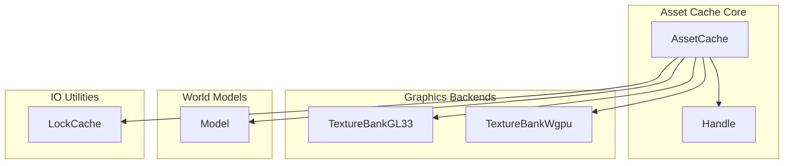
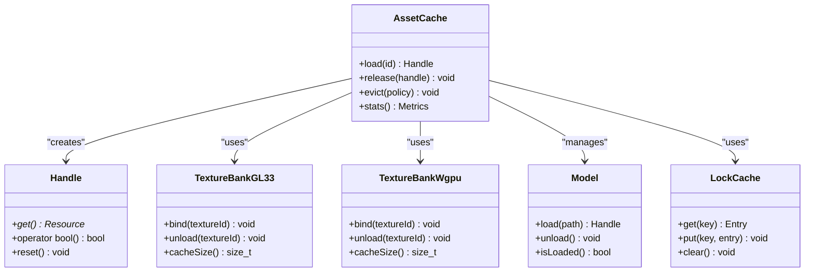
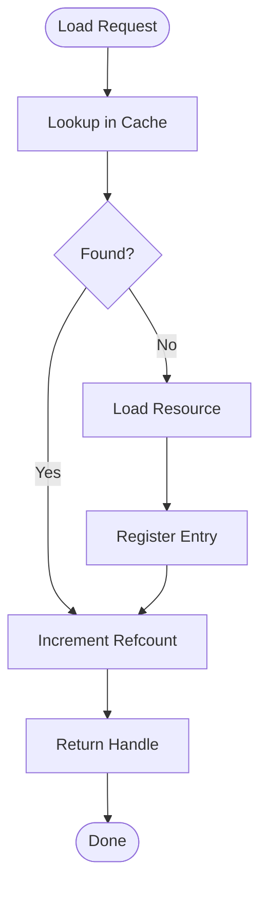
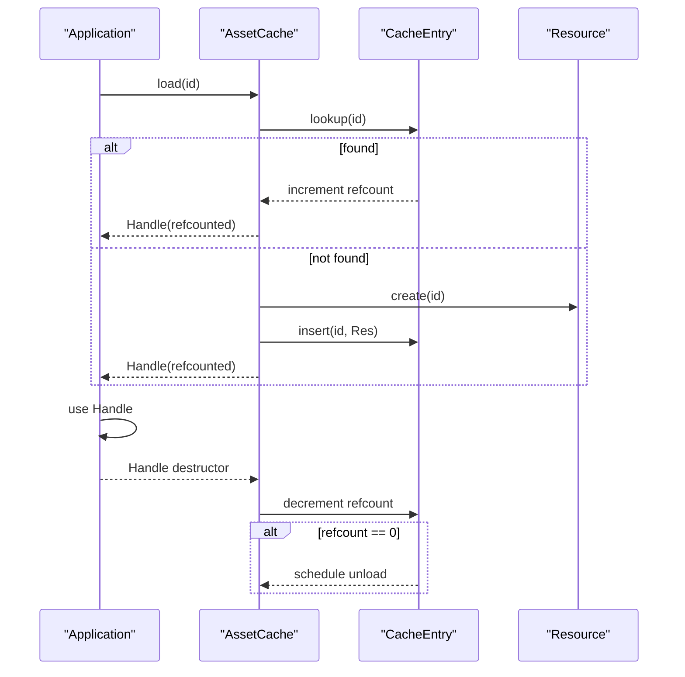
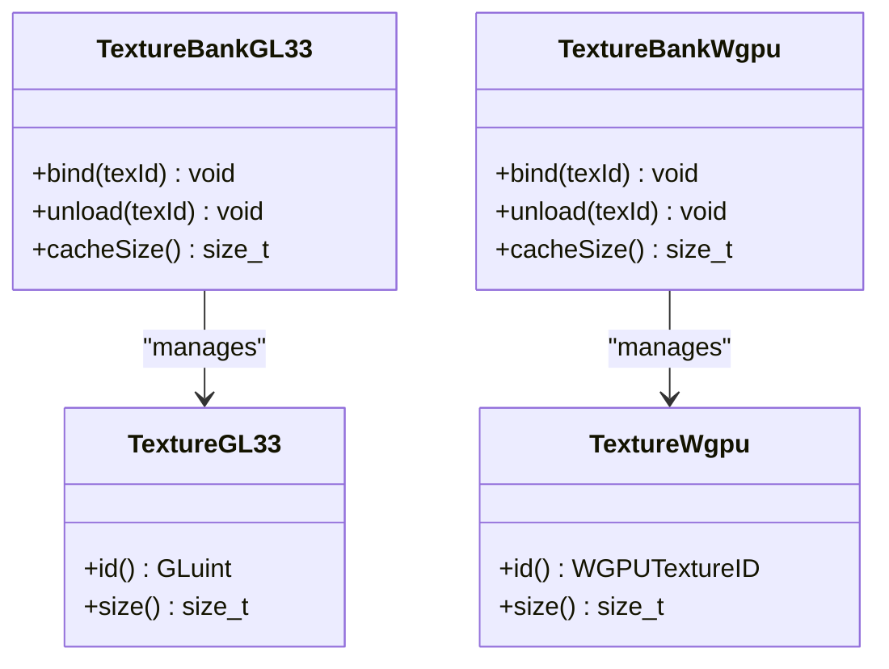
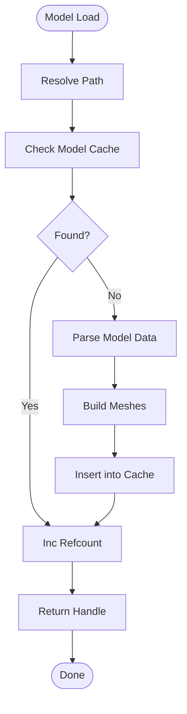
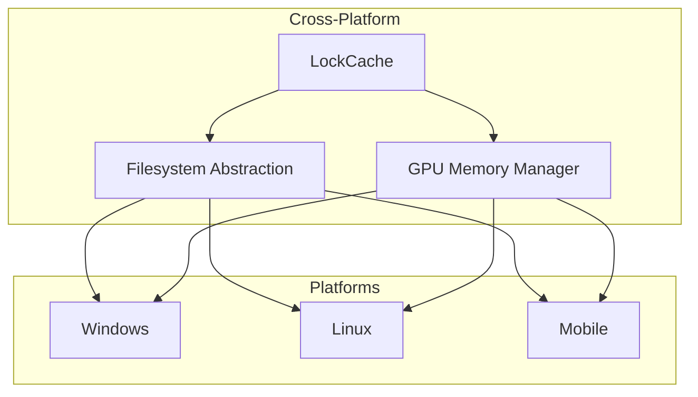
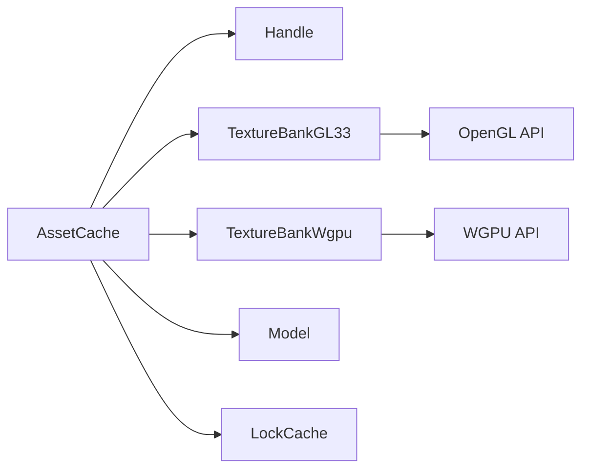

# Asset Caching System

<cite>
**Referenced Files in This Document**
- [AssetCache.hpp](file://engine/Poseidon/Asset/Cache/AssetCache.hpp)
- [AssetCache.cpp](file://engine/Poseidon/Asset/Cache/AssetCache.cpp)
- [Handle.hpp](file://engine/Poseidon/Asset/Cache/Handle.hpp)
- [TextureBankGL33_Core.cpp](file://engine/PoseidonGL33/TextureBankGL33_Core.cpp)
- [TextureBankGL33_Cache.cpp](file://engine/PoseidonGL33/TextureBankGL33_Cache.cpp)
- [TextureWgpu.cpp](file://engine/WgpuRenderer/TextureWgpu.cpp)
- [TextureWgpu.hpp](file://engine/WgpuRenderer/TextureWgpu.hpp)
- [TextureBankWgpu.cpp](file://engine/WgpuRenderer/TextureBankWgpu.cpp)
- [TextureBankWgpu.hpp](file://engine/WgpuRenderer/TextureBankWgpu.hpp)
- [Model.hpp](file://engine/Poseidon/World/Model/Model.hpp)
- [Model.cpp](file://engine/Poseidon/World/Model/Model.cpp)
- [LockCache.hpp](file://engine/Poseidon/IO/LockCache.hpp)
- [LockCache.cpp](file://engine/Poseidon/IO/LockCache.cpp)
</cite>

## Table of Contents
1. [Introduction](#introduction)
2. [Project Structure](#project-structure)
3. [Core Components](#core-components)
4. [Architecture Overview](#architecture-overview)
5. [Detailed Component Analysis](#detailed-component-analysis)
6. [Dependency Analysis](#dependency-analysis)
7. [Performance Considerations](#performance-considerations)
8. [Troubleshooting Guide](#troubleshooting-guide)
9. [Conclusion](#conclusion)
10. [Appendices](#appendices)

## Introduction
This document explains the asset caching system used to manage loaded resources with reference counting and automatic cleanup. It covers the AssetCache implementation, the Handle system for safe resource access and lifecycle management, texture banking across graphics backends, model caching, and cross-platform cache strategies. It also provides guidance on implementing custom cache policies, monitoring performance, debugging memory leaks, and applying cache invalidation and memory budgeting techniques for large asset sets.

## Project Structure
The asset caching subsystem spans several engine modules:
- Core cache and handle abstractions under Poseidon/Asset/Cache
- Graphics backend-specific texture banks under PoseidonGL33 and WgpuRenderer
- Model caching under Poseidon/World/Model
- Cross-platform IO utilities including a lock-based cache under Poseidon/IO

[No sources needed since this diagram shows conceptual structure]

## Core Components
- AssetCache: Central registry that loads, caches, and unloads resources using reference counting and policy-driven eviction.
- Handle: Safe, lightweight wrapper around cached resources that manages lifetime via reference semantics and ensures thread-safe access where applicable.
- Texture Bank: Backend-specific texture storage and caching layer (OpenGL/GL33 and WGPU).
- Model Cache: Model-level caching and lifecycle management for world objects.
- LockCache: Thread-safe caching primitive for IO-bound assets.

Key responsibilities:
- Reference counting and automatic cleanup when references drop to zero
- Policy-driven eviction based on usage, size, or platform constraints
- Thread-safe access patterns for concurrent loaders and renderers
- Platform-aware strategies for GPU memory budgets and disk caching

**Section sources**
- [AssetCache.hpp](file://engine/Poseidon/Asset/Cache/AssetCache.hpp)
- [AssetCache.cpp](file://engine/Poseidon/Asset/Cache/AssetCache.cpp)
- [Handle.hpp](file://engine/Poseidon/Asset/Cache/Handle.hpp)
- [TextureBankGL33_Core.cpp](file://engine/PoseidonGL33/TextureBankGL33_Core.cpp)
- [TextureBankGL33_Cache.cpp](file://engine/PoseidonGL33/TextureBankGL33_Cache.cpp)
- [TextureWgpu.cpp](file://engine/WgpuRenderer/TextureWgpu.cpp)
- [TextureWgpu.hpp](file://engine/WgpuRenderer/TextureWgpu.hpp)
- [TextureBankWgpu.cpp](file://engine/WgpuRenderer/TextureBankWgpu.cpp)
- [TextureBankWgpu.hpp](file://engine/WgpuRenderer/TextureBankWgpu.hpp)
- [Model.hpp](file://engine/Poseidon/World/Model/Model.hpp)
- [Model.cpp](file://engine/Poseidon/World/Model/Model.cpp)
- [LockCache.hpp](file://engine/Poseidon/IO/LockCache.hpp)
- [LockCache.cpp](file://engine/Poseidon/IO/LockCache.cpp)

## Architecture Overview
The asset caching architecture separates concerns between generic caching logic and platform-specific resource handling:
- AssetCache owns the global cache state and coordinates loading/unloading
- Handle instances provide scoped access and automatic refcount updates
- TextureBank implementations encapsulate GPU-side allocations and backend calls
- Model cache integrates with scene graph lifecycle and streaming
- LockCache abstracts thread-safe IO caching for shared assets

**Diagram sources**
- [AssetCache.hpp](file://engine/Poseidon/Asset/Cache/AssetCache.hpp)
- [Handle.hpp](file://engine/Poseidon/Asset/Cache/Handle.hpp)
- [TextureBankGL33_Core.cpp](file://engine/PoseidonGL33/TextureBankGL33_Core.cpp)
- [TextureBankGL33_Cache.cpp](file://engine/PoseidonGL33/TextureBankGL33_Cache.cpp)
- [TextureWgpu.cpp](file://engine/WgpuRenderer/TextureWgpu.cpp)
- [TextureWgpu.hpp](file://engine/WgpuRenderer/TextureWgpu.hpp)
- [TextureBankWgpu.cpp](file://engine/WgpuRenderer/TextureBankWgpu.cpp)
- [TextureBankWgpu.hpp](file://engine/WgpuRenderer/TextureBankWgpu.hpp)
- [Model.hpp](file://engine/Poseidon/World/Model/Model.hpp)
- [Model.cpp](file://engine/Poseidon/World/Model/Model.cpp)
- [LockCache.hpp](file://engine/Poseidon/IO/LockCache.hpp)
- [LockCache.cpp](file://engine/Poseidon/IO/LockCache.cpp)

## Detailed Component Analysis

### AssetCache Implementation
AssetCache is the central registry for all cached assets. It maintains:
- A mapping from asset identifiers to internal entries
- Reference counts per entry to track active handles
- Eviction policies driven by metrics such as size, last-access time, and priority
- Lifecycle hooks for load, unload, and cleanup

Typical operations:
- Load: resolve path, check cache, instantiate resource, register entry, return Handle
- Release: decrement refcount; if zero, schedule or perform immediate unload
- Evict: apply policy to free least-recently-used or oversized entries
- Stats: expose cache size, hit rate, and memory usage

**Diagram sources**
- [AssetCache.hpp](file://engine/Poseidon/Asset/Cache/AssetCache.hpp)
- [AssetCache.cpp](file://engine/Poseidon/Asset/Cache/AssetCache.cpp)

**Section sources**
- [AssetCache.hpp](file://engine/Poseidon/Asset/Cache/AssetCache.hpp)
- [AssetCache.cpp](file://engine/Poseidon/Asset/Cache/AssetCache.cpp)

### Handle System
Handles are lightweight, copyable wrappers that ensure safe access to cached resources:
- Copying increments reference count; destruction decrements it
- Provides boolean conversion to detect valid access
- Supports reset to release ownership early
- Integrates with thread-safety mechanisms where required

Lifecycle pattern:
- Acquire via AssetCache::load
- Use through operator-> or get()
- Release automatically on scope exit or explicit reset

**Diagram sources**
- [Handle.hpp](file://engine/Poseidon/Asset/Cache/Handle.hpp)
- [AssetCache.hpp](file://engine/Poseidon/Asset/Cache/AssetCache.hpp)
- [AssetCache.cpp](file://engine/Poseidon/Asset/Cache/AssetCache.cpp)

**Section sources**
- [Handle.hpp](file://engine/Poseidon/Asset/Cache/Handle.hpp)

### Texture Banking (GL33 and WGPU)
Texture banks encapsulate GPU-side texture storage and backend-specific operations:
- GL33 bank manages OpenGL textures, binding, and memory
- WGPU bank manages WGPU textures, bindings, and memory
- Both support caching, eviction, and statistics

Common behaviors:
- Bind texture for rendering
- Unload texture when refcount drops to zero
- Track cache size and memory footprint
- Provide platform-specific optimizations (e.g., mipmap generation, format conversions)

**Diagram sources**
- [TextureBankGL33_Core.cpp](file://engine/PoseidonGL33/TextureBankGL33_Core.cpp)
- [TextureBankGL33_Cache.cpp](file://engine/PoseidonGL33/TextureBankGL33_Cache.cpp)
- [TextureWgpu.cpp](file://engine/WgpuRenderer/TextureWgpu.cpp)
- [TextureWgpu.hpp](file://engine/WgpuRenderer/TextureWgpu.hpp)
- [TextureBankWgpu.cpp](file://engine/WgpuRenderer/TextureBankWgpu.cpp)
- [TextureBankWgpu.hpp](file://engine/WgpuRenderer/TextureBankWgpu.hpp)

**Section sources**
- [TextureBankGL33_Core.cpp](file://engine/PoseidonGL33/TextureBankGL33_Core.cpp)
- [TextureBankGL33_Cache.cpp](file://engine/PoseidonGL33/TextureBankGL33_Cache.cpp)
- [TextureWgpu.cpp](file://engine/WgpuRenderer/TextureWgpu.cpp)
- [TextureWgpu.hpp](file://engine/WgpuRenderer/TextureWgpu.hpp)
- [TextureBankWgpu.cpp](file://engine/WgpuRenderer/TextureBankWgpu.cpp)
- [TextureBankWgpu.hpp](file://engine/WgpuRenderer/TextureBankWgpu.hpp)

### Model Caching
Model caching integrates with the world module to manage 3D models:
- Loads model data and geometry
- Tracks references via Handle
- Supports streaming and partial loading for large scenes
- Coordinates with AssetCache for unified lifecycle

**Diagram sources**
- [Model.hpp](file://engine/Poseidon/World/Model/Model.hpp)
- [Model.cpp](file://engine/Poseidon/World/Model/Model.cpp)

**Section sources**
- [Model.hpp](file://engine/Poseidon/World/Model/Model.hpp)
- [Model.cpp](file://engine/Poseidon/World/Model/Model.cpp)

### Cross-Platform Cache Strategies
Cross-platform considerations include:
- Disk caching via LockCache for IO-bound assets
- GPU memory budgets varying by platform (mobile vs desktop)
- Filesystem differences handled by abstraction layers
- Threading models and synchronization primitives

[No sources needed since this diagram shows conceptual strategy]

## Dependency Analysis
The asset caching system exhibits clear separation between core logic and backend specifics:
- AssetCache depends on Handle, TextureBank implementations, Model, and LockCache
- TextureBank implementations depend on platform-specific graphics APIs
- Model depends on AssetCache for lifecycle coordination
- LockCache provides thread-safe IO caching independent of graphics

**Diagram sources**
- [AssetCache.hpp](file://engine/Poseidon/Asset/Cache/AssetCache.hpp)
- [Handle.hpp](file://engine/Poseidon/Asset/Cache/Handle.hpp)
- [TextureBankGL33_Core.cpp](file://engine/PoseidonGL33/TextureBankGL33_Core.cpp)
- [TextureWgpu.cpp](file://engine/WgpuRenderer/TextureWgpu.cpp)
- [Model.hpp](file://engine/Poseidon/World/Model/Model.hpp)
- [LockCache.hpp](file://engine/Poseidon/IO/LockCache.hpp)

**Section sources**
- [AssetCache.hpp](file://engine/Poseidon/Asset/Cache/AssetCache.hpp)
- [Handle.hpp](file://engine/Poseidon/Asset/Cache/Handle.hpp)
- [TextureBankGL33_Core.cpp](file://engine/PoseidonGL33/TextureBankGL33_Core.cpp)
- [TextureWgpu.cpp](file://engine/WgpuRenderer/TextureWgpu.cpp)
- [Model.hpp](file://engine/Poseidon/World/Model/Model.hpp)
- [LockCache.hpp](file://engine/Poseidon/IO/LockCache.hpp)

## Performance Considerations
- Prefer pooling for frequently reused small assets to reduce allocation overhead
- Implement LRU or LFU eviction policies to minimize cache churn
- Batch texture uploads and avoid redundant format conversions
- Monitor cache hit rates and adjust sizes based on platform constraints
- Use asynchronous loading to prevent frame stalls during asset acquisition
- Profile GPU memory usage and implement tiered caching (hot/warm/cold)

[No sources needed since this section provides general guidance]

## Troubleshooting Guide
Common issues and resolutions:
- Memory leaks: verify Handle lifetimes and ensure refcounts reach zero
- Stale references: confirm proper invalidation on asset reload
- Deadlocks: review LockCache usage and threading boundaries
- GPU OOM: implement memory budgets and aggressive eviction policies
- Performance regressions: monitor cache stats and adjust policies

Debugging techniques:
- Enable verbose logging for load/unload events
- Use memory profilers to track allocations and leaks
- Implement cache introspection endpoints for runtime inspection
- Validate Handle usage patterns with static analysis tools

**Section sources**
- [LockCache.hpp](file://engine/Poseidon/IO/LockCache.hpp)
- [LockCache.cpp](file://engine/Poseidon/IO/LockCache.cpp)

## Conclusion
The asset caching system provides a robust foundation for managing game resources through reference counting, safe Handle access, and platform-aware texture banking. By implementing appropriate eviction policies, monitoring performance, and following best practices for lifecycle management, developers can optimize memory usage and maintain smooth gameplay even with large asset sets.

[No sources needed since this section summarizes without analyzing specific files]

## Appendices

### Custom Cache Policies
To implement custom cache policies:
- Extend the eviction interface in AssetCache
- Define metrics for priority scoring (size, age, frequency)
- Integrate with platform-specific memory managers
- Test thoroughly with stress scenarios

### Monitoring Cache Performance
Key metrics to track:
- Cache hit/miss ratios
- Memory usage over time
- Load/unload frequencies
- Average latency for asset acquisition

### Debugging Memory Leaks
Recommended approaches:
- Use sanitizers (AddressSanitizer, LeakSanitizer)
- Implement reference tracking with debug builds
- Create automated tests for asset lifecycle scenarios

[No sources needed since this section provides general guidance]