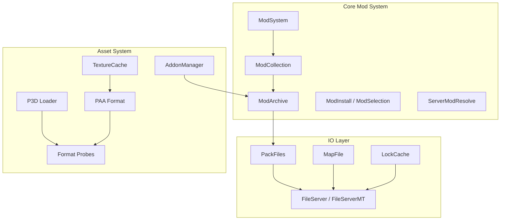
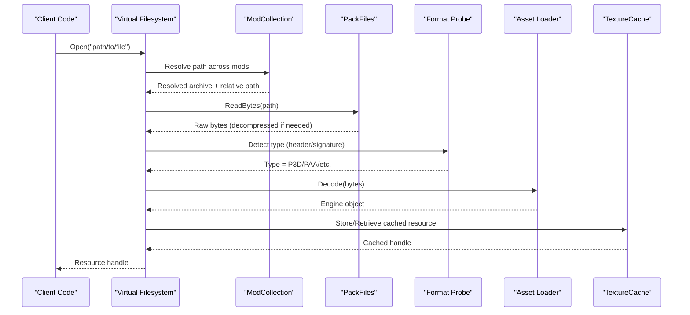
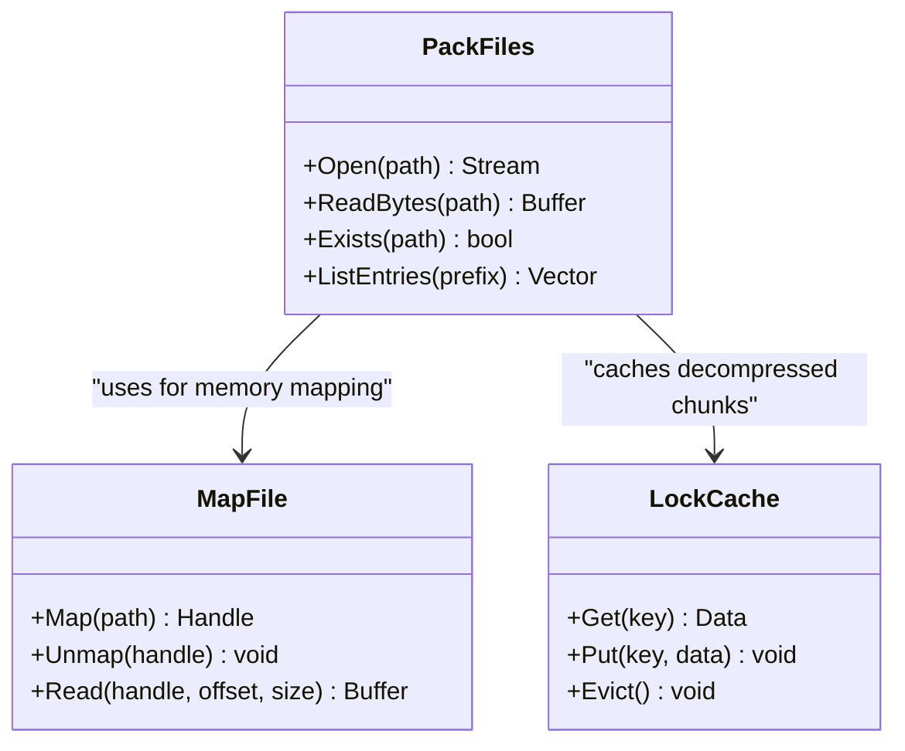
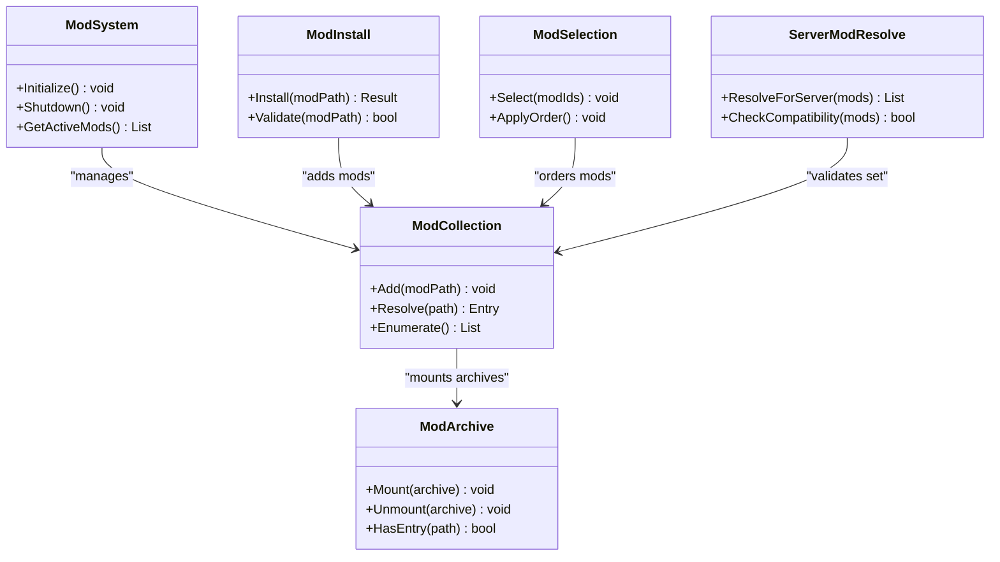
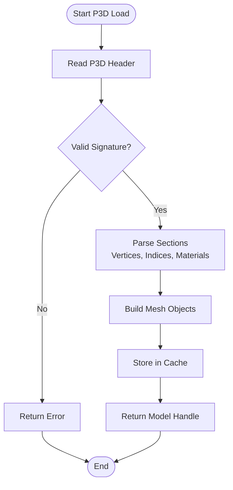
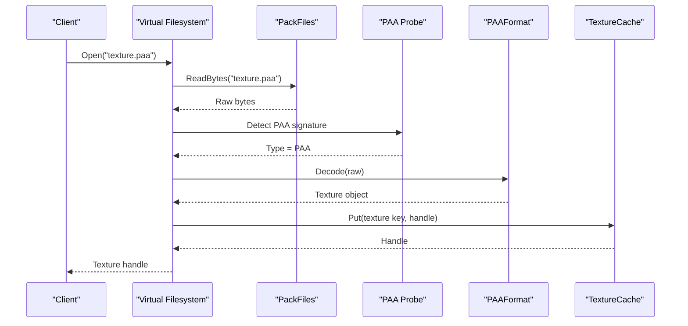
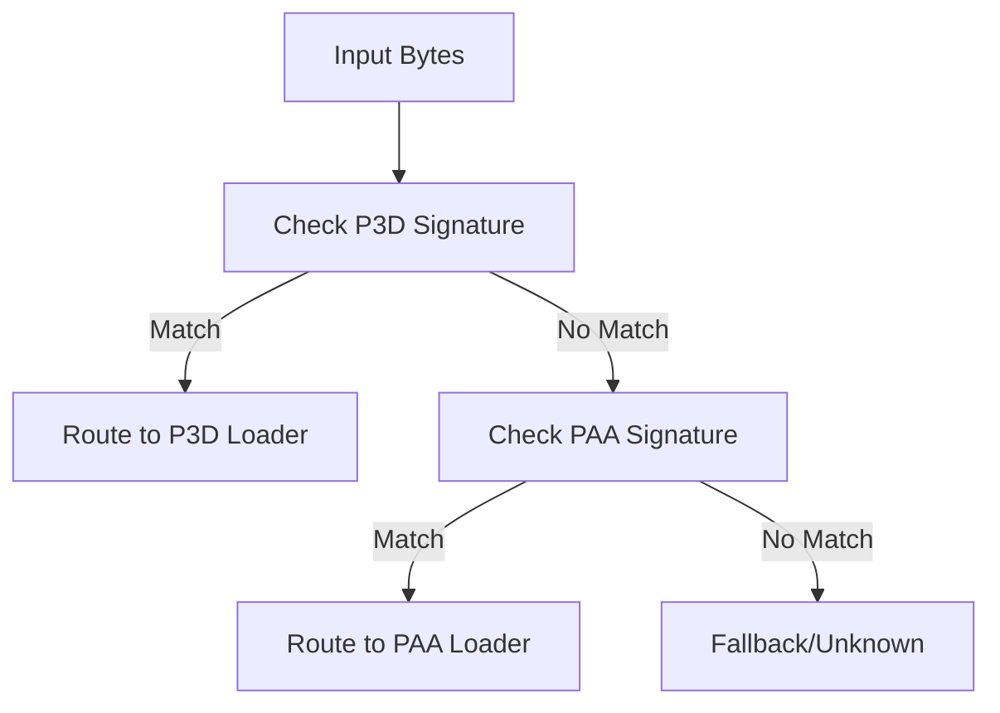
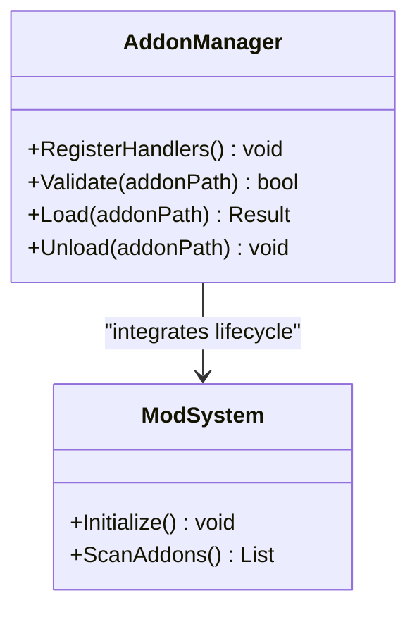
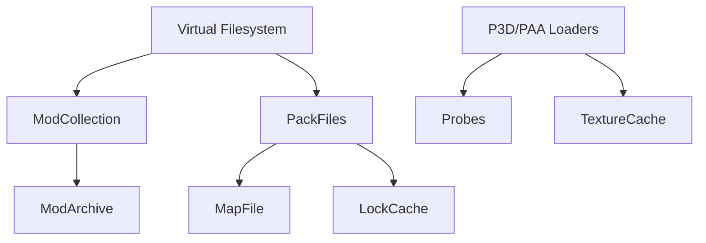

# Asset Management

<cite>
**Referenced Files in This Document**
- [PackFiles.cpp](file://engine/Poseidon/IO/PackFiles.cpp)
- [PackFiles.hpp](file://engine/Poseidon/IO/PackFiles.hpp)
- [ModArchive.cpp](file://engine/Poseidon/Core/ModArchive.cpp)
- [ModArchive.hpp](file://engine/Poseidon/Core/ModArchive.hpp)
- [ModCollection.cpp](file://engine/Poseidon/Core/ModCollection.cpp)
- [ModCollection.hpp](file://engine/Poseidon/Core/ModCollection.hpp)
- [ModSystem.cpp](file://engine/Poseidon/Core/ModSystem.cpp)
- [ModSystem.hpp](file://engine/Poseidon/Core/ModSystem.hpp)
- [ModId.cpp](file://engine/Poseidon/Core/ModId.cpp)
- [ModId.hpp](file://engine/Poseidon/Core/ModId.hpp)
- [ModInstall.cpp](file://engine/Poseidon/Core/ModInstall.cpp)
- [ModInstall.hpp](file://engine/Poseidon/Core/ModInstall.hpp)
- [ModSelection.cpp](file://engine/Poseidon/Core/ModSelection.cpp)
- [ModSelection.hpp](file://engine/Poseidon/Core/ModSelection.hpp)
- [ServerModResolve.cpp](file://engine/Poseidon/Core/ServerModResolve.cpp)
- [ServerModResolve.hpp](file://engine/Poseidon/Core/ServerModResolve.hpp)
- [MapFile.cpp](file://engine/Poseidon/IO/MapFile.cpp)
- [MapFile.hpp](file://engine/Poseidon/IO/MapFile.hpp)
- [LockCache.cpp](file://engine/Poseidon/IO/LockCache.cpp)
- [LockCache.hpp](file://engine/Poseidon/IO/LockCache.hpp)
- [FileServer.cpp](file://engine/Poseidon/IO/FileServer.cpp)
- [FileServer.hpp](file://engine/Poseidon/IO/FileServer.hpp)
- [FileServerMT.hpp](file://engine/Poseidon/IO/FileServerMT.hpp)
- [Asset/Addon/AddonManager.cpp](file://engine/Poseidon/Asset/Addon/AddonManager.cpp)
- [Asset/Addon/AddonManager.hpp](file://engine/Poseidon/Asset/Addon/AddonManager.hpp)
- [Asset/Formats/P3D/P3DLoader.cpp](file://engine/Poseidon/Asset/Formats/P3D/P3DLoader.cpp)
- [Asset/Formats/P3D/P3DLoader.hpp](file://engine/Poseidon/Asset/Formats/P3D/P3DLoader.hpp)
- [Asset/Formats/PAA/PAAFormat.cpp](file://engine/Poseidon/Asset/Formats/PAA/PAAFormat.cpp)
- [Asset/Formats/PAA/PAAFormat.hpp](file://engine/Poseidon/Asset/Formats/PAA/PAAFormat.hpp)
- [Asset/Cache/TextureCache.cpp](file://engine/Poseidon/Asset/Cache/TextureCache.cpp)
- [Asset/Cache/TextureCache.hpp](file://engine/Poseidon/Asset/Cache/TextureCache.hpp)
- [Asset/Probes/P3DProbe.cpp](file://engine/Poseidon/Asset/Probes/P3DProbe.cpp)
- [Asset/Probes/PAAProbe.cpp](file://engine/Poseidon/Asset/Probes/PAAProbe.cpp)
- [fuzz_p3d.cpp](file://apps/fuzzers/Fuzzer/fuzz_p3d.cpp)
- [fuzz_paa.cpp](file://apps/fuzzers/Fuzzer/fuzz_paa.cpp)
- [fuzz_pbo.cpp](file://apps/fuzzers/Fuzzer/fuzz_pbo.cpp)
</cite>

## Table of Contents
1. [Introduction](#introduction)
2. [Project Structure](#project-structure)
3. [Core Components](#core-components)
4. [Architecture Overview](#architecture-overview)
5. [Detailed Component Analysis](#detailed-component-analysis)
6. [Dependency Analysis](#dependency-analysis)
7. [Performance Considerations](#performance-considerations)
8. [Troubleshooting Guide](#troubleshooting-guide)
9. [Conclusion](#conclusion)
10. [Appendices](#appendices)

## Introduction
This document explains the asset management system for handling game file formats and resources, focusing on binary stream processing for P3D models, PAA textures, and other assets. It covers the pack file system (PBO archives), mod loading, and asset virtualization. Implementation details include format detection, decompression, memory mapping strategies, and the relationships between asset loaders, caching systems, and memory management. Practical guidance is provided for adding new file formats, optimizing asset loading, and debugging issues. The mod system architecture, addon validation, and asset versioning strategies are also documented, along with performance considerations for large asset sets and streaming techniques.

## Project Structure
The asset management subsystem spans several engine modules:
- IO layer provides filesystem abstraction, pack files, memory-mapped files, and thread-safe caching.
- Core module manages mods, addons, and their lifecycle.
- Asset module defines format-specific loaders, probes, and caches.
- Fuzzers provide robustness tests for critical formats.

**Diagram sources**
- [PackFiles.cpp](file://engine/Poseidon/IO/PackFiles.cpp)
- [PackFiles.hpp](file://engine/Poseidon/IO/PackFiles.hpp)
- [MapFile.cpp](file://engine/Poseidon/IO/MapFile.cpp)
- [MapFile.hpp](file://engine/Poseidon/IO/MapFile.hpp)
- [LockCache.cpp](file://engine/Poseidon/IO/LockCache.cpp)
- [LockCache.hpp](file://engine/Poseidon/IO/LockCache.hpp)
- [FileServer.cpp](file://engine/Poseidon/IO/FileServer.cpp)
- [FileServer.hpp](file://engine/Poseidon/IO/FileServer.hpp)
- [FileServerMT.hpp](file://engine/Poseidon/IO/FileServerMT.hpp)
- [ModArchive.cpp](file://engine/Poseidon/Core/ModArchive.cpp)
- [ModArchive.hpp](file://engine/Poseidon/Core/ModArchive.hpp)
- [ModCollection.cpp](file://engine/Poseidon/Core/ModCollection.cpp)
- [ModCollection.hpp](file://engine/Poseidon/Core/ModCollection.hpp)
- [ModSystem.cpp](file://engine/Poseidon/Core/ModSystem.cpp)
- [ModSystem.hpp](file://engine/Poseidon/Core/ModSystem.hpp)
- [ModInstall.cpp](file://engine/Poseidon/Core/ModInstall.cpp)
- [ModInstall.hpp](file://engine/Poseidon/Core/ModInstall.hpp)
- [ModSelection.cpp](file://engine/Poseidon/Core/ModSelection.cpp)
- [ModSelection.hpp](file://engine/Poseidon/Core/ModSelection.hpp)
- [ServerModResolve.cpp](file://engine/Poseidon/Core/ServerModResolve.cpp)
- [ServerModResolve.hpp](file://engine/Poseidon/Core/ServerModResolve.hpp)
- [Asset/Addon/AddonManager.cpp](file://engine/Poseidon/Asset/Addon/AddonManager.cpp)
- [Asset/Addon/AddonManager.hpp](file://engine/Poseidon/Asset/Addon/AddonManager.hpp)
- [Asset/Formats/P3D/P3DLoader.cpp](file://engine/Poseidon/Asset/Formats/P3D/P3DLoader.cpp)
- [Asset/Formats/P3D/P3DLoader.hpp](file://engine/Poseidon/Asset/Formats/P3D/P3DLoader.hpp)
- [Asset/Formats/PAA/PAAFormat.cpp](file://engine/Poseidon/Asset/Formats/PAA/PAAFormat.cpp)
- [Asset/Formats/PAA/PAAFormat.hpp](file://engine/Poseidon/Asset/Formats/PAA/PAAFormat.hpp)
- [Asset/Cache/TextureCache.cpp](file://engine/Poseidon/Asset/Cache/TextureCache.cpp)
- [Asset/Cache/TextureCache.hpp](file://engine/Poseidon/Asset/Cache/TextureCache.hpp)
- [Asset/Probes/P3DProbe.cpp](file://engine/Poseidon/Asset/Probes/P3DProbe.cpp)
- [Asset/Probes/PAAProbe.cpp](file://engine/Poseidon/Asset/Probes/PAAProbe.cpp)

**Section sources**
- [PackFiles.cpp](file://engine/Poseidon/IO/PackFiles.cpp)
- [PackFiles.hpp](file://engine/Poseidon/IO/PackFiles.hpp)
- [ModArchive.cpp](file://engine/Poseidon/Core/ModArchive.cpp)
- [ModArchive.hpp](file://engine/Poseidon/Core/ModArchive.hpp)
- [ModCollection.cpp](file://engine/Poseidon/Core/ModCollection.cpp)
- [ModCollection.hpp](file://engine/Poseidon/Core/ModCollection.hpp)
- [ModSystem.cpp](file://engine/Poseidon/Core/ModSystem.cpp)
- [ModSystem.hpp](file://engine/Poseidon/Core/ModSystem.hpp)
- [Asset/Addon/AddonManager.cpp](file://engine/Poseidon/Asset/Addon/AddonManager.cpp)
- [Asset/Addon/AddonManager.hpp](file://engine/Poseidon/Asset/Addon/AddonManager.hpp)

## Core Components
- PackFiles: Provides virtualized access to packed archives (PBO). It exposes a unified interface to read files from compressed containers without extracting them to disk.
- MapFile: Implements memory-mapped file access for efficient I/O and zero-copy reads where supported by the platform.
- LockCache: Thread-safe cache for frequently accessed data blocks, reducing repeated decompression or decoding overhead.
- ModArchive and ModCollection: Manage discovery, ordering, and resolution of mods and addons; integrate with pack files to present a merged virtual filesystem.
- AddonManager: Coordinates asset addon lifecycle, including validation and registration of format handlers.
- Format Loaders (P3D, PAA): Binary stream parsers that decode model and texture data into engine-native structures.
- TextureCache: Caches decoded textures to avoid redundant work and reduce memory churn.
- Format Probes: Lightweight detectors used to identify file types based on headers or signatures before invoking specific loaders.

Key responsibilities:
- Virtual filesystem composition across multiple packs and directories.
- Safe, concurrent access to shared resources.
- Efficient decompression and decoding pipelines.
- Robust error handling and diagnostics.

**Section sources**
- [PackFiles.cpp](file://engine/Poseidon/IO/PackFiles.cpp)
- [PackFiles.hpp](file://engine/Poseidon/IO/PackFiles.hpp)
- [MapFile.cpp](file://engine/Poseidon/IO/MapFile.cpp)
- [MapFile.hpp](file://engine/Poseidon/IO/MapFile.hpp)
- [LockCache.cpp](file://engine/Poseidon/IO/LockCache.cpp)
- [LockCache.hpp](file://engine/Poseidon/IO/LockCache.hpp)
- [ModArchive.cpp](file://engine/Poseidon/Core/ModArchive.cpp)
- [ModArchive.hpp](file://engine/Poseidon/Core/ModArchive.hpp)
- [ModCollection.cpp](file://engine/Poseidon/Core/ModCollection.cpp)
- [ModCollection.hpp](file://engine/Poseidon/Core/ModCollection.hpp)
- [Asset/Addon/AddonManager.cpp](file://engine/Poseidon/Asset/Addon/AddonManager.cpp)
- [Asset/Addon/AddonManager.hpp](file://engine/Poseidon/Asset/Addon/AddonManager.hpp)
- [Asset/Formats/P3D/P3DLoader.cpp](file://engine/Poseidon/Asset/Formats/P3D/P3DLoader.cpp)
- [Asset/Formats/P3D/P3DLoader.hpp](file://engine/Poseidon/Asset/Formats/P3D/P3DLoader.hpp)
- [Asset/Formats/PAA/PAAFormat.cpp](file://engine/Poseidon/Asset/Formats/PAA/PAAFormat.cpp)
- [Asset/Formats/PAA/PAAFormat.hpp](file://engine/Poseidon/Asset/Formats/PAA/PAAFormat.hpp)
- [Asset/Cache/TextureCache.cpp](file://engine/Poseidon/Asset/Cache/TextureCache.cpp)
- [Asset/Cache/TextureCache.hpp](file://engine/Poseidon/Asset/Cache/TextureCache.hpp)
- [Asset/Probes/P3DProbe.cpp](file://engine/Poseidon/Asset/Probes/P3DProbe.cpp)
- [Asset/Probes/PAAProbe.cpp](file://engine/Poseidon/Asset/Probes/PAAProbe.cpp)

## Architecture Overview
The asset management architecture layers IO virtualization over mod resolution and format-specific loaders. Packs are mounted as virtual filesystems; requests traverse through the mod collection to resolve paths, then use pack readers to obtain raw bytes. Format probes detect content types, and loaders decode streams into engine objects. Caching minimizes repeated work, while memory mapping reduces copy overhead.

**Diagram sources**
- [PackFiles.cpp](file://engine/Poseidon/IO/PackFiles.cpp)
- [PackFiles.hpp](file://engine/Poseidon/IO/PackFiles.hpp)
- [ModCollection.cpp](file://engine/Poseidon/Core/ModCollection.cpp)
- [ModCollection.hpp](file://engine/Poseidon/Core/ModCollection.hpp)
- [Asset/Probes/P3DProbe.cpp](file://engine/Poseidon/Asset/Probes/P3DProbe.cpp)
- [Asset/Probes/PAAProbe.cpp](file://engine/Poseidon/Asset/Probes/PAAProbe.cpp)
- [Asset/Formats/P3D/P3DLoader.cpp](file://engine/Poseidon/Asset/Formats/P3D/P3DLoader.cpp)
- [Asset/Formats/PAA/PAAFormat.cpp](file://engine/Poseidon/Asset/Formats/PAA/PAAFormat.cpp)
- [Asset/Cache/TextureCache.cpp](file://engine/Poseidon/Asset/Cache/TextureCache.cpp)
- [Asset/Cache/TextureCache.hpp](file://engine/Poseidon/Asset/Cache/TextureCache.hpp)

## Detailed Component Analysis

### Pack Files and Virtual Filesystem
PackFiles implements reading from packed archives, exposing methods to locate and extract file contents. It integrates with the filesystem abstraction to support both direct files and archived resources. Memory mapping via MapFile can be used for large assets to minimize copies.

Key behaviors:
- Archive enumeration and file lookup.
- Decompression on-demand for contained files.
- Integration with lock-based caching for concurrent access.

**Diagram sources**
- [PackFiles.cpp](file://engine/Poseidon/IO/PackFiles.cpp)
- [PackFiles.hpp](file://engine/Poseidon/IO/PackFiles.hpp)
- [MapFile.cpp](file://engine/Poseidon/IO/MapFile.cpp)
- [MapFile.hpp](file://engine/Poseidon/IO/MapFile.hpp)
- [LockCache.cpp](file://engine/Poseidon/IO/LockCache.cpp)
- [LockCache.hpp](file://engine/Poseidon/IO/LockCache.hpp)

**Section sources**
- [PackFiles.cpp](file://engine/Poseidon/IO/PackFiles.cpp)
- [PackFiles.hpp](file://engine/Poseidon/IO/PackFiles.hpp)
- [MapFile.cpp](file://engine/Poseidon/IO/MapFile.cpp)
- [MapFile.hpp](file://engine/Poseidon/IO/MapFile.hpp)
- [LockCache.cpp](file://engine/Poseidon/IO/LockCache.cpp)
- [LockCache.hpp](file://engine/Poseidon/IO/LockCache.hpp)

### Mod System and Addon Management
ModCollection and ModArchive manage the discovery, ordering, and merging of mods. ModSystem coordinates initialization and lifecycle, while ModInstall and ModSelection handle user-driven choices and installation states. ServerModResolve ensures server-side consistency for multiplayer sessions.

**Diagram sources**
- [ModCollection.cpp](file://engine/Poseidon/Core/ModCollection.cpp)
- [ModCollection.hpp](file://engine/Poseidon/Core/ModCollection.hpp)
- [ModArchive.cpp](file://engine/Poseidon/Core/ModArchive.cpp)
- [ModArchive.hpp](file://engine/Poseidon/Core/ModArchive.hpp)
- [ModSystem.cpp](file://engine/Poseidon/Core/ModSystem.cpp)
- [ModSystem.hpp](file://engine/Poseidon/Core/ModSystem.hpp)
- [ModInstall.cpp](file://engine/Poseidon/Core/ModInstall.cpp)
- [ModInstall.hpp](file://engine/Poseidon/Core/ModInstall.hpp)
- [ModSelection.cpp](file://engine/Poseidon/Core/ModSelection.cpp)
- [ModSelection.hpp](file://engine/Poseidon/Core/ModSelection.hpp)
- [ServerModResolve.cpp](file://engine/Poseidon/Core/ServerModResolve.cpp)
- [ServerModResolve.hpp](file://engine/Poseidon/Core/ServerModResolve.hpp)

**Section sources**
- [ModCollection.cpp](file://engine/Poseidon/Core/ModCollection.cpp)
- [ModCollection.hpp](file://engine/Poseidon/Core/ModCollection.hpp)
- [ModArchive.cpp](file://engine/Poseidon/Core/ModArchive.cpp)
- [ModArchive.hpp](file://engine/Poseidon/Core/ModArchive.hpp)
- [ModSystem.cpp](file://engine/Poseidon/Core/ModSystem.cpp)
- [ModSystem.hpp](file://engine/Poseidon/Core/ModSystem.hpp)
- [ModInstall.cpp](file://engine/Poseidon/Core/ModInstall.cpp)
- [ModInstall.hpp](file://engine/Poseidon/Core/ModInstall.hpp)
- [ModSelection.cpp](file://engine/Poseidon/Core/ModSelection.cpp)
- [ModSelection.hpp](file://engine/Poseidon/Core/ModSelection.hpp)
- [ServerModResolve.cpp](file://engine/Poseidon/Core/ServerModResolve.cpp)
- [ServerModResolve.hpp](file://engine/Poseidon/Core/ServerModResolve.hpp)

### P3D Model Loading Pipeline
P3DLoader decodes 3D model data from binary streams. It typically parses headers, vertex buffers, indices, materials, and animation data. Format probes ensure correct routing to the loader.

**Diagram sources**
- [Asset/Formats/P3D/P3DLoader.cpp](file://engine/Poseidon/Asset/Formats/P3D/P3DLoader.cpp)
- [Asset/Formats/P3D/P3DLoader.hpp](file://engine/Poseidon/Asset/Formats/P3D/P3DLoader.hpp)
- [Asset/Probes/P3DProbe.cpp](file://engine/Poseidon/Asset/Probes/P3DProbe.cpp)

**Section sources**
- [Asset/Formats/P3D/P3DLoader.cpp](file://engine/Poseidon/Asset/Formats/P3D/P3DLoader.cpp)
- [Asset/Formats/P3D/P3DLoader.hpp](file://engine/Poseidon/Asset/Formats/P3D/P3DLoader.hpp)
- [Asset/Probes/P3DProbe.cpp](file://engine/Poseidon/Asset/Probes/P3DProbe.cpp)
- [fuzz_p3d.cpp](file://apps/fuzzers/Fuzzer/fuzz_p3d.cpp)

### PAA Texture Loading Pipeline
PAAFormat handles texture decoding from PAA archives. It reads texture metadata, pixel data, and compression flags, producing GPU-ready textures. TextureCache stores decoded results to avoid reprocessing.

**Diagram sources**
- [Asset/Formats/PAA/PAAFormat.cpp](file://engine/Poseidon/Asset/Formats/PAA/PAAFormat.cpp)
- [Asset/Formats/PAA/PAAFormat.hpp](file://engine/Poseidon/Asset/Formats/PAA/PAAFormat.hpp)
- [Asset/Probes/PAAProbe.cpp](file://engine/Poseidon/Asset/Probes/PAAProbe.cpp)
- [Asset/Cache/TextureCache.cpp](file://engine/Poseidon/Asset/Cache/TextureCache.cpp)
- [Asset/Cache/TextureCache.hpp](file://engine/Poseidon/Asset/Cache/TextureCache.hpp)

**Section sources**
- [Asset/Formats/PAA/PAAFormat.cpp](file://engine/Poseidon/Asset/Formats/PAA/PAAFormat.cpp)
- [Asset/Formats/PAA/PAAFormat.hpp](file://engine/Poseidon/Asset/Formats/PAA/PAAFormat.hpp)
- [Asset/Probes/PAAProbe.cpp](file://engine/Poseidon/Asset/Probes/PAAProbe.cpp)
- [Asset/Cache/TextureCache.cpp](file://engine/Poseidon/Asset/Cache/TextureCache.cpp)
- [Asset/Cache/TextureCache.hpp](file://engine/Poseidon/Asset/Cache/TextureCache.hpp)
- [fuzz_paa.cpp](file://apps/fuzzers/Fuzzer/fuzz_paa.cpp)

### Format Detection and Probes
Probes examine file headers or signatures to determine the appropriate loader. They enable dynamic dispatch without hardcoding file extensions.

**Diagram sources**
- [Asset/Probes/P3DProbe.cpp](file://engine/Poseidon/Asset/Probes/P3DProbe.cpp)
- [Asset/Probes/PAAProbe.cpp](file://engine/Poseidon/Asset/Probes/PAAProbe.cpp)

**Section sources**
- [Asset/Probes/P3DProbe.cpp](file://engine/Poseidon/Asset/Probes/P3DProbe.cpp)
- [Asset/Probes/PAAProbe.cpp](file://engine/Poseidon/Asset/Probes/PAAProbe.cpp)

### Addon Manager and Validation
AddonManager coordinates addon lifecycle, integrating with ModSystem to validate and register assets. It ensures that addons conform to expected schemas and dependencies.

**Diagram sources**
- [Asset/Addon/AddonManager.cpp](file://engine/Poseidon/Asset/Addon/AddonManager.cpp)
- [Asset/Addon/AddonManager.hpp](file://engine/Poseidon/Asset/Addon/AddonManager.hpp)
- [ModSystem.cpp](file://engine/Poseidon/Core/ModSystem.cpp)
- [ModSystem.hpp](file://engine/Poseidon/Core/ModSystem.hpp)

**Section sources**
- [Asset/Addon/AddonManager.cpp](file://engine/Poseidon/Asset/Addon/AddonManager.cpp)
- [Asset/Addon/AddonManager.hpp](file://engine/Poseidon/Asset/Addon/AddonManager.hpp)
- [ModSystem.cpp](file://engine/Poseidon/Core/ModSystem.cpp)
- [ModSystem.hpp](file://engine/Poseidon/Core/ModSystem.hpp)

## Dependency Analysis
The asset system depends on IO abstractions, mod resolution, and format-specific implementations. Caching and memory mapping optimize performance.

**Diagram sources**
- [PackFiles.cpp](file://engine/Poseidon/IO/PackFiles.cpp)
- [PackFiles.hpp](file://engine/Poseidon/IO/PackFiles.hpp)
- [ModCollection.cpp](file://engine/Poseidon/Core/ModCollection.cpp)
- [ModCollection.hpp](file://engine/Poseidon/Core/ModCollection.hpp)
- [Asset/Formats/P3D/P3DLoader.cpp](file://engine/Poseidon/Asset/Formats/P3D/P3DLoader.cpp)
- [Asset/Formats/PAA/PAAFormat.cpp](file://engine/Poseidon/Asset/Formats/PAA/PAAFormat.cpp)
- [Asset/Cache/TextureCache.cpp](file://engine/Poseidon/Asset/Cache/TextureCache.cpp)

**Section sources**
- [PackFiles.cpp](file://engine/Poseidon/IO/PackFiles.cpp)
- [PackFiles.hpp](file://engine/Poseidon/IO/PackFiles.hpp)
- [ModCollection.cpp](file://engine/Poseidon/Core/ModCollection.cpp)
- [ModCollection.hpp](file://engine/Poseidon/Core/ModCollection.hpp)
- [Asset/Formats/P3D/P3DLoader.cpp](file://engine/Poseidon/Asset/Formats/P3D/P3DLoader.cpp)
- [Asset/Formats/PAA/PAAFormat.cpp](file://engine/Poseidon/Asset/Formats/PAA/PAAFormat.cpp)
- [Asset/Cache/TextureCache.cpp](file://engine/Poseidon/Asset/Cache/TextureCache.cpp)

## Performance Considerations
- Memory Mapping: Use MapFile for large assets to avoid copying and leverage OS page caching.
- Caching: Employ LockCache for decompressed chunks and TextureCache for decoded textures to reduce repeated work.
- Streaming: For very large models or textures, stream sections incrementally rather than loading entire files into memory.
- Parallelism: Offload decoding and decompression to background threads where safe.
- Path Resolution: Minimize mod traversal cost by caching resolved paths and entries.
- Compression: Prefer formats with fast decompression for frequently accessed assets.

[No sources needed since this section provides general guidance]

## Troubleshooting Guide
Common issues and remedies:
- Format Detection Failures: Verify probe signatures and ensure headers match expected patterns.
- Missing Assets: Check mod order and archive mounting; confirm paths exist within packs.
- Corruption or Invalid Data: Use fuzzers (fuzz_p3d, fuzz_paa, fuzz_pbo) to validate robustness and identify edge cases.
- Performance Bottlenecks: Profile decoding paths; consider enabling caching or switching to memory-mapped reads.
- Concurrency Errors: Ensure LockCache usage is consistent; avoid sharing mutable state across threads.

Practical steps:
- Enable detailed logging in PackFiles and ModCollection to trace file resolution.
- Validate addon manifests and dependencies using ModInstall and ServerModResolve.
- Inspect cache hit rates and eviction policies in LockCache and TextureCache.

**Section sources**
- [fuzz_p3d.cpp](file://apps/fuzzers/Fuzzer/fuzz_p3d.cpp)
- [fuzz_paa.cpp](file://apps/fuzzers/Fuzzer/fuzz_paa.cpp)
- [fuzz_pbo.cpp](file://apps/fuzzers/Fuzzer/fuzz_pbo.cpp)
- [PackFiles.cpp](file://engine/Poseidon/IO/PackFiles.cpp)
- [ModCollection.cpp](file://engine/Poseidon/Core/ModCollection.cpp)
- [LockCache.cpp](file://engine/Poseidon/IO/LockCache.cpp)
- [Asset/Cache/TextureCache.cpp](file://engine/Poseidon/Asset/Cache/TextureCache.cpp)

## Conclusion
The asset management system combines virtualized filesystem access, robust mod resolution, and specialized format loaders to efficiently handle P3D models, PAA textures, and other assets. By leveraging memory mapping, caching, and streaming, it achieves high performance even with large asset sets. Proper addon validation and versioning ensure stability and compatibility across mods. Following the guidelines for adding new formats and optimizing loading pipelines will help maintain scalability and reliability.

[No sources needed since this section summarizes without analyzing specific files]

## Appendices

### Adding Support for a New File Format
Steps:
- Implement a probe to detect the format signature.
- Create a loader that parses binary streams into engine objects.
- Integrate the loader with the virtual filesystem pipeline.
- Add caching support if the format produces heavy intermediate data.
- Provide fuzz tests to validate robustness.

Example references:
- Probe implementation pattern: [Asset/Probes/P3DProbe.cpp](file://engine/Poseidon/Asset/Probes/P3DProbe.cpp)
- Loader implementation pattern: [Asset/Formats/P3D/P3DLoader.cpp](file://engine/Poseidon/Asset/Formats/P3D/P3DLoader.cpp)
- Fuzz test pattern: [fuzz_p3d.cpp](file://apps/fuzzers/Fuzzer/fuzz_p3d.cpp)

**Section sources**
- [Asset/Probes/P3DProbe.cpp](file://engine/Poseidon/Asset/Probes/P3DProbe.cpp)
- [Asset/Formats/P3D/P3DLoader.cpp](file://engine/Poseidon/Asset/Formats/P3D/P3DLoader.cpp)
- [fuzz_p3d.cpp](file://apps/fuzzers/Fuzzer/fuzz_p3d.cpp)

### Optimizing Asset Loading
Recommendations:
- Use memory mapping for large static assets.
- Precompute and cache frequently accessed resources.
- Stream large assets in chunks to reduce peak memory usage.
- Batch decoding operations to improve throughput.
- Monitor cache hit ratios and adjust sizes accordingly.

[No sources needed since this section provides general guidance]

### Debugging Asset Issues
Tools and practices:
- Enable verbose logging in IO and mod resolution layers.
- Use fuzzers to stress-test format parsers.
- Inspect pack contents and verify file integrity.
- Profile decoding paths to identify hotspots.

**Section sources**
- [fuzz_pbo.cpp](file://apps/fuzzers/Fuzzer/fuzz_pbo.cpp)
- [PackFiles.cpp](file://engine/Poseidon/IO/PackFiles.cpp)
- [ModCollection.cpp](file://engine/Poseidon/Core/ModCollection.cpp)