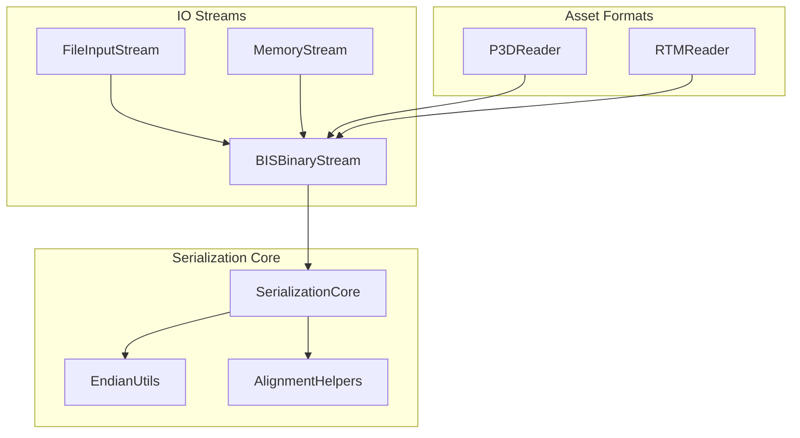
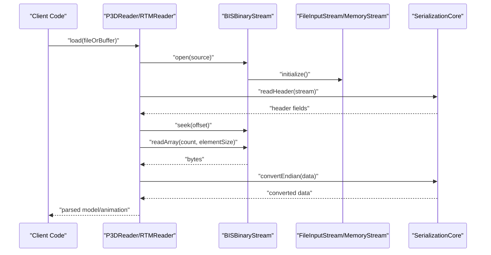
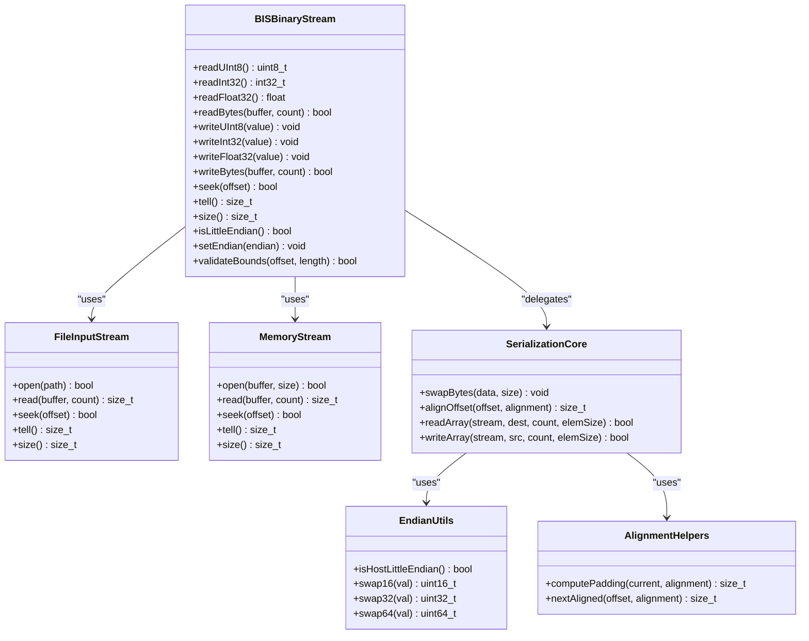
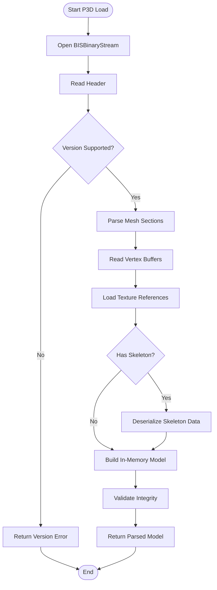
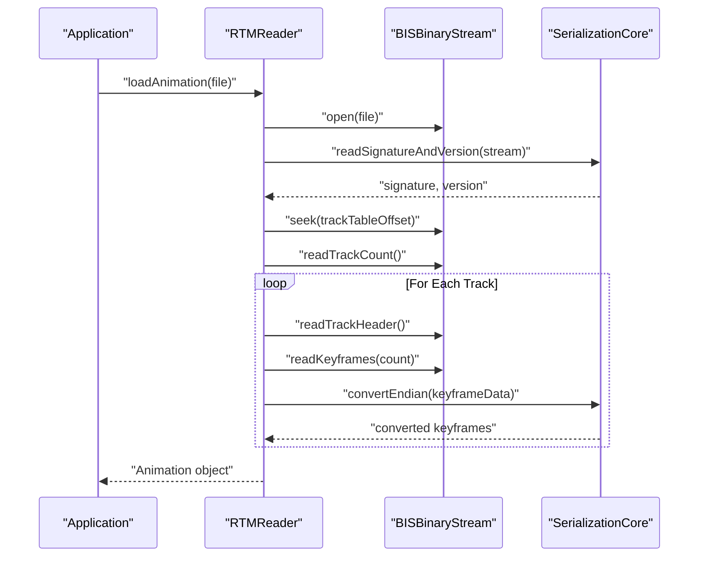
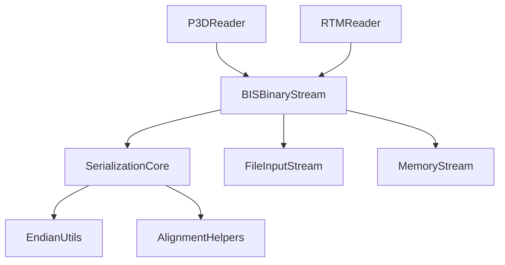

# Binary Format Handling

<cite>
**Referenced Files in This Document**
- [BISBinaryStream.hpp](file://engine/Poseidon/IO/Streams/BISBinaryStream.hpp)
- [BISBinaryStream.cpp](file://engine/Poseidon/IO/Streams/BISBinaryStream.cpp)
- [P3DReader.hpp](file://engine/Poseidon/Asset/Formats/P3D/P3DReader.hpp)
- [P3DReader.cpp](file://engine/Poseidon/Asset/Formats/P3D/P3DReader.cpp)
- [RTMReader.hpp](file://engine/Poseidon/Asset/Formats/RTM/RTMReader.hpp)
- [RTMReader.cpp](file://engine/Poseidon/Asset/Formats/RTM/RTMReader.cpp)
- [SerializationCore.hpp](file://engine/Poseidon/IO/Serialization/SerializationCore.hpp)
- [SerializationCore.cpp](file://engine/Poseidon/IO/Serialization/SerializationCore.cpp)
- [MemoryStream.hpp](file://engine/Poseidon/IO/Streams/MemoryStream.hpp)
- [FileInputStream.hpp](file://engine/Poseidon/IO/Streams/FileInputStream.hpp)
- [EndianUtils.hpp](file://engine/Poseidon/Foundation/Common/EndianUtils.hpp)
- [AlignmentHelpers.hpp](file://engine/Poseidon/Foundation/Common/AlignmentHelpers.hpp)
</cite>

## Table of Contents
1. [Introduction](#introduction)
2. [Project Structure](#project-structure)
3. [Core Components](#core-components)
4. [Architecture Overview](#architecture-overview)
5. [Detailed Component Analysis](#detailed-component-analysis)
6. [Dependency Analysis](#dependency-analysis)
7. [Performance Considerations](#performance-considerations)
8. [Troubleshooting Guide](#troubleshooting-guide)
9. [Conclusion](#conclusion)
10. [Appendices](#appendices)

## Introduction
This document explains the binary format handling system used to read and write game-specific assets such as P3D models, RTM animations, and other binary formats. It focuses on the BISBinaryStream implementation for serialization, endianness handling, memory alignment, and streaming patterns. It also provides guidance on implementing new binary readers/writers, validating data integrity, and ensuring version compatibility while addressing performance considerations for large files.

## Project Structure
The binary format handling spans several engine subsystems:
- IO Streams: low-level input/output abstractions for file and memory-backed streams
- Serialization Core: shared utilities for endian conversion, alignment, and common serialization helpers
- Asset Formats: format-specific readers (e.g., P3D, RTM) that consume stream APIs
- Utilities: endianness and alignment helpers used across the codebase

**Diagram sources**
- [FileInputStream.hpp](file://engine/Poseidon/IO/Streams/FileInputStream.hpp)
- [MemoryStream.hpp](file://engine/Poseidon/IO/Streams/MemoryStream.hpp)
- [BISBinaryStream.hpp](file://engine/Poseidon/IO/Streams/BISBinaryStream.hpp)
- [SerializationCore.hpp](file://engine/Poseidon/IO/Serialization/SerializationCore.hpp)
- [EndianUtils.hpp](file://engine/Poseidon/Foundation/Common/EndianUtils.hpp)
- [AlignmentHelpers.hpp](file://engine/Poseidon/Foundation/Common/AlignmentHelpers.hpp)
- [P3DReader.hpp](file://engine/Poseidon/Asset/Formats/P3D/P3DReader.hpp)
- [RTMReader.hpp](file://engine/Poseidon/Asset/Formats/RTM/RTMReader.hpp)

**Section sources**
- [BISBinaryStream.hpp](file://engine/Poseidon/IO/Streams/BISBinaryStream.hpp)
- [BISBinaryStream.cpp](file://engine/Poseidon/IO/Streams/BISBinaryStream.cpp)
- [SerializationCore.hpp](file://engine/Poseidon/IO/Serialization/SerializationCore.hpp)
- [SerializationCore.cpp](file://engine/Poseidon/IO/Serialization/SerializationCore.cpp)
- [P3DReader.hpp](file://engine/Poseidon/Asset/Formats/P3D/P3DReader.hpp)
- [P3DReader.cpp](file://engine/Poseidon/Asset/Formats/P3D/P3DReader.cpp)
- [RTMReader.hpp](file://engine/Poseidon/Asset/Formats/RTM/RTMReader.hpp)
- [RTMReader.cpp](file://engine/Poseidon/Asset/Formats/RTM/RTMReader.cpp)
- [MemoryStream.hpp](file://engine/Poseidon/IO/Streams/MemoryStream.hpp)
- [FileInputStream.hpp](file://engine/Poseidon/IO/Streams/FileInputStream.hpp)
- [EndianUtils.hpp](file://engine/Poseidon/Foundation/Common/EndianUtils.hpp)
- [AlignmentHelpers.hpp](file://engine/Poseidon/Foundation/Common/AlignmentHelpers.hpp)

## Core Components
- BISBinaryStream: A stream wrapper tailored for reading and writing game binary formats with explicit control over endianness, alignment, and bounds checking. It exposes typed read/write methods and supports seeking, size queries, and error state inspection.
- SerializationCore: Shared serialization primitives including endian conversion, padding/alignment calculations, and helper functions for arrays, strings, and nested structures.
- EndianUtils: Low-level byte swapping utilities and platform-endianness detection.
- AlignmentHelpers: Utilities for computing struct padding, alignment requirements, and safe offsets.
- Stream Backends: FileInputStream and MemoryStream provide backing storage for disk and in-memory buffers respectively.

Key responsibilities:
- Provide a consistent API for serializing/deserializing binary structures
- Ensure correct endianness handling across platforms
- Enforce memory alignment and padding rules
- Support streaming for large assets without loading entire files into memory

**Section sources**
- [BISBinaryStream.hpp](file://engine/Poseidon/IO/Streams/BISBinaryStream.hpp)
- [BISBinaryStream.cpp](file://engine/Poseidon/IO/Streams/BISBinaryStream.cpp)
- [SerializationCore.hpp](file://engine/Poseidon/IO/Serialization/SerializationCore.hpp)
- [SerializationCore.cpp](file://engine/Poseidon/IO/Serialization/SerializationCore.cpp)
- [EndianUtils.hpp](file://engine/Poseidon/Foundation/Common/EndianUtils.hpp)
- [AlignmentHelpers.hpp](file://engine/Poseidon/Foundation/Common/AlignmentHelpers.hpp)
- [MemoryStream.hpp](file://engine/Poseidon/IO/Streams/MemoryStream.hpp)
- [FileInputStream.hpp](file://engine/Poseidon/IO/Streams/FileInputStream.hpp)

## Architecture Overview
The binary format handling architecture layers the stream abstraction above concrete backends and uses shared serialization utilities. Format-specific readers implement their own parsing logic but rely on BISBinaryStream for I/O and SerializationCore for data transformations.

**Diagram sources**
- [P3DReader.hpp](file://engine/Poseidon/Asset/Formats/P3D/P3DReader.hpp)
- [P3DReader.cpp](file://engine/Poseidon/Asset/Formats/P3D/P3DReader.cpp)
- [RTMReader.hpp](file://engine/Poseidon/Asset/Formats/RTM/RTMReader.hpp)
- [RTMReader.cpp](file://engine/Poseidon/Asset/Formats/RTM/RTMReader.cpp)
- [BISBinaryStream.hpp](file://engine/Poseidon/IO/Streams/BISBinaryStream.hpp)
- [BISBinaryStream.cpp](file://engine/Poseidon/IO/Streams/BISBinaryStream.cpp)
- [SerializationCore.hpp](file://engine/Poseidon/IO/Serialization/SerializationCore.hpp)
- [SerializationCore.cpp](file://engine/Poseidon/IO/Serialization/SerializationCore.cpp)
- [FileInputStream.hpp](file://engine/Poseidon/IO/Streams/FileInputStream.hpp)
- [MemoryStream.hpp](file://engine/Poseidon/IO/Streams/MemoryStream.hpp)

## Detailed Component Analysis

### BISBinaryStream Implementation
BISBinaryStream encapsulates binary I/O operations with explicit endianness and alignment controls. It typically provides:
- Typed read/write methods for primitive types (integers, floats, booleans)
- Bulk read/write for arrays and raw bytes
- Seek and tell operations for random access
- Size and position queries
- Error state flags and validation helpers

Endianness handling:
- Detects host endianness via EndianUtils
- Provides methods to swap bytes when necessary
- Ensures consistent behavior regardless of platform

Memory alignment:
- Uses AlignmentHelpers to compute required padding
- Supports aligned reads/writes to avoid misaligned access penalties
- Validates alignment constraints for structure fields

Error handling:
- Returns status codes or exceptions on failure
- Tracks read/write positions to prevent out-of-bounds access
- Offers validation routines to check stream integrity

**Diagram sources**
- [BISBinaryStream.hpp](file://engine/Poseidon/IO/Streams/BISBinaryStream.hpp)
- [BISBinaryStream.cpp](file://engine/Poseidon/IO/Streams/BISBinaryStream.cpp)
- [FileInputStream.hpp](file://engine/Poseidon/IO/Streams/FileInputStream.hpp)
- [MemoryStream.hpp](file://engine/Poseidon/IO/Streams/MemoryStream.hpp)
- [SerializationCore.hpp](file://engine/Poseidon/IO/Serialization/SerializationCore.hpp)
- [SerializationCore.cpp](file://engine/Poseidon/IO/Serialization/SerializationCore.cpp)
- [EndianUtils.hpp](file://engine/Poseidon/Foundation/Common/EndianUtils.hpp)
- [AlignmentHelpers.hpp](file://engine/Poseidon/Foundation/Common/AlignmentHelpers.hpp)

**Section sources**
- [BISBinaryStream.hpp](file://engine/Poseidon/IO/Streams/BISBinaryStream.hpp)
- [BISBinaryStream.cpp](file://engine/Poseidon/IO/Streams/BISBinaryStream.cpp)
- [SerializationCore.hpp](file://engine/Poseidon/IO/Serialization/SerializationCore.hpp)
- [SerializationCore.cpp](file://engine/Poseidon/IO/Serialization/SerializationCore.cpp)
- [EndianUtils.hpp](file://engine/Poseidon/Foundation/Common/EndianUtils.hpp)
- [AlignmentHelpers.hpp](file://engine/Poseidon/Foundation/Common/AlignmentHelpers.hpp)

### P3D Model Format Reader
P3DReader implements parsing of 3D model binaries. Typical responsibilities include:
- Reading model headers and metadata
- Parsing mesh definitions, vertex buffers, and texture references
- Handling animation skeletons and keyframe data if present
- Validating structural integrity and version compatibility

Data flow:
- Initialize stream from file or memory buffer
- Read header to determine format version and capabilities
- Iterate through chunks or sections using seek operations
- Deserialize arrays and nested structures with proper alignment
- Convert endianness where needed and validate bounds

**Diagram sources**
- [P3DReader.hpp](file://engine/Poseidon/Asset/Formats/P3D/P3DReader.hpp)
- [P3DReader.cpp](file://engine/Poseidon/Asset/Formats/P3D/P3DReader.cpp)
- [BISBinaryStream.hpp](file://engine/Poseidon/IO/Streams/BISBinaryStream.hpp)
- [BISBinaryStream.cpp](file://engine/Poseidon/IO/Streams/BISBinaryStream.cpp)

**Section sources**
- [P3DReader.hpp](file://engine/Poseidon/Asset/Formats/P3D/P3DReader.hpp)
- [P3DReader.cpp](file://engine/Poseidon/Asset/Formats/P3D/P3DReader.cpp)

### RTM Animation Format Reader
RTMReader handles runtime animation data. Key tasks include:
- Reading animation headers and track definitions
- Parsing keyframe sequences and interpolation parameters
- Managing time-based playback data and event markers
- Ensuring correct alignment and endianness for numeric fields

Processing steps:
- Open stream and read RTM signature/version
- Deserialize track list and associated metadata
- For each track, read keyframes with timestamps and values
- Apply endianness conversion and alignment checks
- Construct animation objects ready for playback

**Diagram sources**
- [RTMReader.hpp](file://engine/Poseidon/Asset/Formats/RTM/RTMReader.hpp)
- [RTMReader.cpp](file://engine/Poseidon/Asset/Formats/RTM/RTMReader.cpp)
- [BISBinaryStream.hpp](file://engine/Poseidon/IO/Streams/BISBinaryStream.hpp)
- [BISBinaryStream.cpp](file://engine/Poseidon/IO/Streams/BISBinaryStream.cpp)
- [SerializationCore.hpp](file://engine/Poseidon/IO/Serialization/SerializationCore.hpp)
- [SerializationCore.cpp](file://engine/Poseidon/IO/Serialization/SerializationCore.cpp)

**Section sources**
- [RTMReader.hpp](file://engine/Poseidon/Asset/Formats/RTM/RTMReader.hpp)
- [RTMReader.cpp](file://engine/Poseidon/Asset/Formats/RTM/RTMReader.cpp)

### Serialization Patterns and Data Structures
Common patterns implemented by SerializationCore and used by format readers:
- Fixed-size structs with explicit padding
- Variable-length arrays with length prefixes
- Nested structures with offset tables
- Versioned headers with capability flags

Endianness and alignment:
- Use EndianUtils for byte swapping of integers and floats
- Apply AlignmentHelpers to compute padding between fields
- Validate alignment before accessing multi-byte types

Validation strategies:
- Check magic numbers and version fields
- Verify array bounds against stream size
- Ensure all required sections are present

**Section sources**
- [SerializationCore.hpp](file://engine/Poseidon/IO/Serialization/SerializationCore.hpp)
- [SerializationCore.cpp](file://engine/Poseidon/IO/Serialization/SerializationCore.cpp)
- [EndianUtils.hpp](file://engine/Poseidon/Foundation/Common/EndianUtils.hpp)
- [AlignmentHelpers.hpp](file://engine/Poseidon/Foundation/Common/AlignmentHelpers.hpp)

## Dependency Analysis
The binary format handling relies on a layered dependency structure:
- Format readers depend on BISBinaryStream for I/O
- BISBinaryStream depends on SerializationCore for data transformations
- SerializationCore depends on EndianUtils and AlignmentHelpers
- Stream backends (FileInputStream, MemoryStream) provide underlying storage

**Diagram sources**
- [P3DReader.hpp](file://engine/Poseidon/Asset/Formats/P3D/P3DReader.hpp)
- [RTMReader.hpp](file://engine/Poseidon/Asset/Formats/RTM/RTMReader.hpp)
- [BISBinaryStream.hpp](file://engine/Poseidon/IO/Streams/BISBinaryStream.hpp)
- [SerializationCore.hpp](file://engine/Poseidon/IO/Serialization/SerializationCore.hpp)
- [EndianUtils.hpp](file://engine/Poseidon/Foundation/Common/EndianUtils.hpp)
- [AlignmentHelpers.hpp](file://engine/Poseidon/Foundation/Common/AlignmentHelpers.hpp)
- [FileInputStream.hpp](file://engine/Poseidon/IO/Streams/FileInputStream.hpp)
- [MemoryStream.hpp](file://engine/Poseidon/IO/Streams/MemoryStream.hpp)

**Section sources**
- [P3DReader.hpp](file://engine/Poseidon/Asset/Formats/P3D/P3DReader.hpp)
- [RTMReader.hpp](file://engine/Poseidon/Asset/Formats/RTM/RTMReader.hpp)
- [BISBinaryStream.hpp](file://engine/Poseidon/IO/Streams/BISBinaryStream.hpp)
- [SerializationCore.hpp](file://engine/Poseidon/IO/Serialization/SerializationCore.hpp)
- [EndianUtils.hpp](file://engine/Poseidon/Foundation/Common/EndianUtils.hpp)
- [AlignmentHelpers.hpp](file://engine/Poseidon/Foundation/Common/AlignmentHelpers.hpp)
- [FileInputStream.hpp](file://engine/Poseidon/IO/Streams/FileInputStream.hpp)
- [MemoryStream.hpp](file://engine/Poseidon/IO/Streams/MemoryStream.hpp)

## Performance Considerations
For large binary files and efficient memory usage:
- Prefer streaming over full-file loading: use FileInputStream with BISBinaryStream to process data incrementally
- Minimize temporary allocations: reuse buffers for array reads where possible
- Batch operations: read large arrays in single calls rather than element-by-element
- Avoid unnecessary conversions: only apply endianness swaps when required
- Use memory-mapped files when available for faster I/O
- Implement lazy loading for optional sections to reduce initial load times

Best practices:
- Validate stream bounds before each read operation
- Cache frequently accessed metadata after initial parsing
- Use aligned memory allocation for GPU-bound data transfers
- Profile I/O patterns to identify bottlenecks

[No sources needed since this section provides general guidance]

## Troubleshooting Guide
Common issues and resolutions:
- Endianness mismatches: verify host endianness detection and ensure consistent swapping across platforms
- Alignment errors: check struct packing and padding calculations; use AlignmentHelpers consistently
- Out-of-bounds access: validate stream size and offsets before reading; implement bounds checking in BISBinaryStream
- Version incompatibility: handle unsupported versions gracefully with clear error messages
- Corrupted data: implement checksums or CRC validation for critical sections

Debugging techniques:
- Log stream positions during parsing to trace execution flow
- Dump raw bytes around parse failures for manual inspection
- Use unit tests with known-good binary samples
- Implement assertion guards for critical assumptions

**Section sources**
- [BISBinaryStream.hpp](file://engine/Poseidon/IO/Streams/BISBinaryStream.hpp)
- [BISBinaryStream.cpp](file://engine/Poseidon/IO/Streams/BISBinaryStream.cpp)
- [SerializationCore.hpp](file://engine/Poseidon/IO/Serialization/SerializationCore.hpp)
- [SerializationCore.cpp](file://engine/Poseidon/IO/Serialization/SerializationCore.cpp)

## Conclusion
The binary format handling system provides a robust foundation for reading and writing game-specific binary assets. Through BISBinaryStream, SerializationCore, and format-specific readers like P3DReader and RTMReader, the system ensures reliable serialization with proper endianness handling, memory alignment, and streaming capabilities. By following the patterns and best practices outlined here, developers can extend support for new binary formats while maintaining performance and data integrity.

[No sources needed since this section summarizes without analyzing specific files]

## Appendices

### Implementing New Binary Format Readers/Writers
Steps to add support for a new binary format:
1. Define structure layouts with explicit padding and alignment
2. Create a reader class that uses BISBinaryStream for I/O
3. Implement header parsing with version and capability checks
4. Add validation routines for data integrity
5. Handle endianness conversion using SerializationCore
6. Test with sample files covering edge cases

Example workflow:
- Initialize stream from file or memory buffer
- Parse and validate header
- Iterate through data sections with proper seeking
- Deserialize arrays and nested structures
- Validate final data consistency
- Return parsed objects to caller

**Section sources**
- [BISBinaryStream.hpp](file://engine/Poseidon/IO/Streams/BISBinaryStream.hpp)
- [SerializationCore.hpp](file://engine/Poseidon/IO/Serialization/SerializationCore.hpp)
- [P3DReader.hpp](file://engine/Poseidon/Asset/Formats/P3D/P3DReader.hpp)
- [RTMReader.hpp](file://engine/Poseidon/Asset/Formats/RTM/RTMReader.hpp)

### Validating Binary Data Integrity
Strategies for ensuring data correctness:
- Magic number verification at file start
- Version field validation with backward compatibility
- Array length checks against declared sizes
- CRC or checksum validation for critical sections
- Bounds checking for all read operations

Implementation tips:
- Centralize validation logic in SerializationCore
- Provide utility functions for common validation patterns
- Log detailed error information for debugging
- Fail fast on invalid data to prevent undefined behavior

**Section sources**
- [SerializationCore.hpp](file://engine/Poseidon/IO/Serialization/SerializationCore.hpp)
- [SerializationCore.cpp](file://engine/Poseidon/IO/Serialization/SerializationCore.cpp)
- [BISBinaryStream.hpp](file://engine/Poseidon/IO/Streams/BISBinaryStream.hpp)

### Handling Version Compatibility
Approaches for managing format evolution:
- Include version numbers in headers with feature flags
- Implement graceful fallbacks for missing features
- Maintain separate parsing paths for different versions
- Document breaking changes and migration procedures
- Test compatibility across supported versions

Best practices:
- Use semantic versioning for format specifications
- Provide upgrade tools for older formats
- Maintain backward compatibility when possible
- Deprecate old features gradually with warnings

**Section sources**
- [P3DReader.hpp](file://engine/Poseidon/Asset/Formats/P3D/P3DReader.hpp)
- [RTMReader.hpp](file://engine/Poseidon/Asset/Formats/RTM/RTMReader.hpp)
- [SerializationCore.hpp](file://engine/Poseidon/IO/Serialization/SerializationCore.hpp)