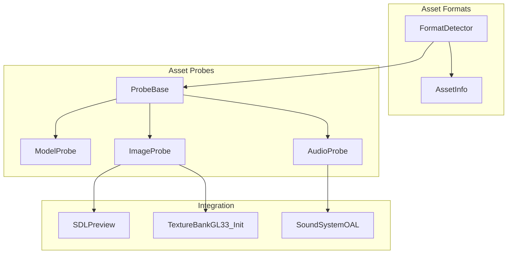
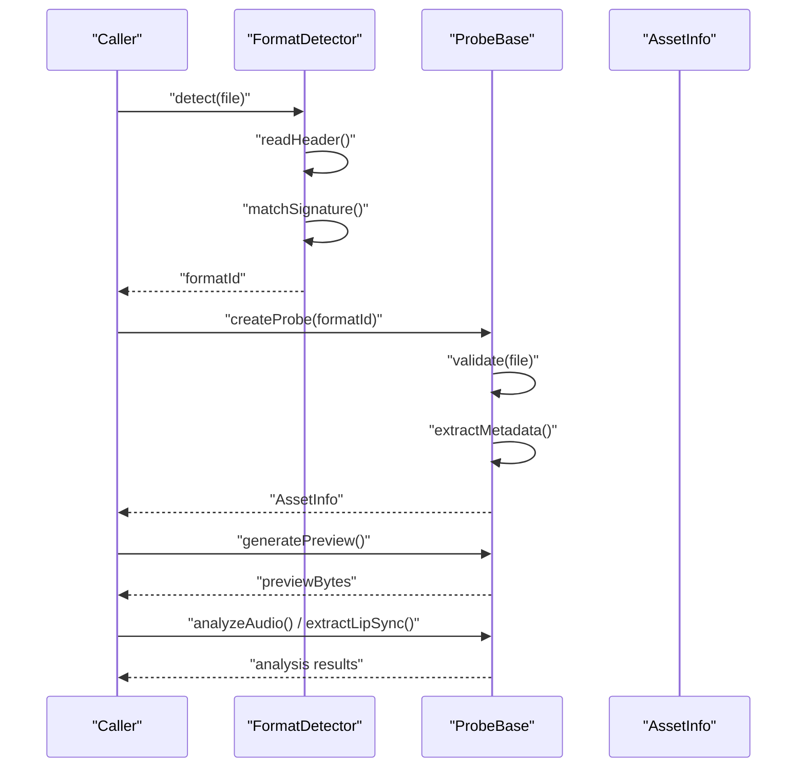
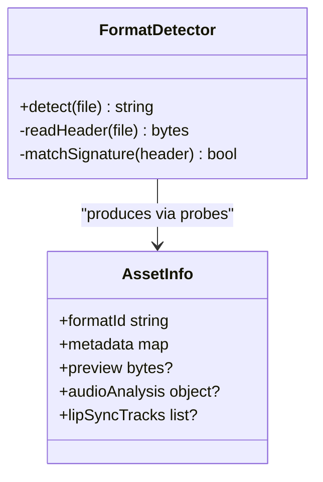
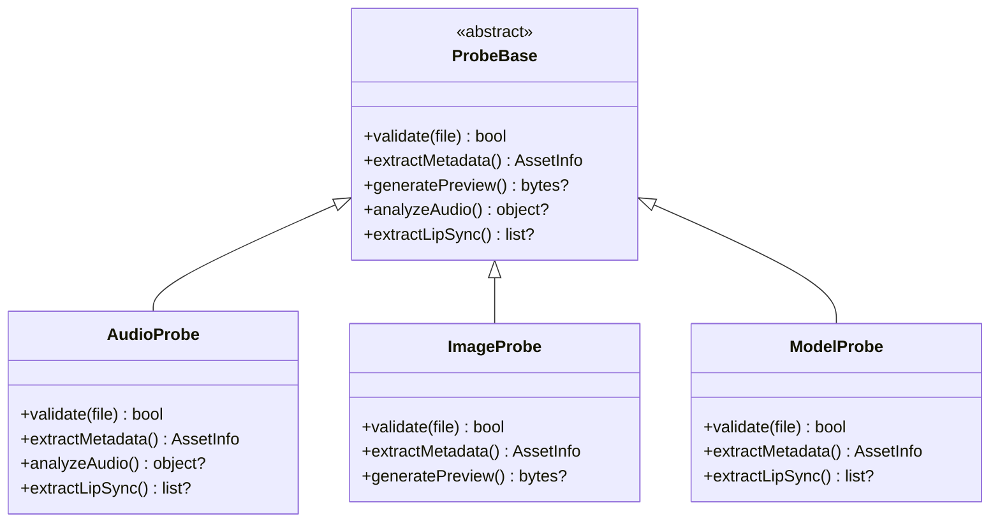
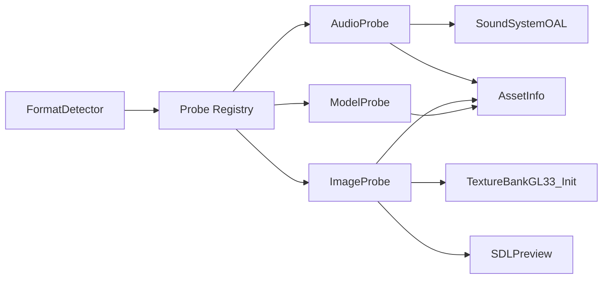

# Format Detection and Probing

<cite>
**Referenced Files in This Document**
- [AssetInfo.hpp](file://engine/Poseidon/Asset/Formats/AssetInfo.hpp)
- [AssetInfo.cpp](file://engine/Poseidon/Asset/Formats/AssetInfo.cpp)
- [FormatDetector.hpp](file://engine/Poseidon/Asset/Formats/FormatDetector.hpp)
- [FormatDetector.cpp](file://engine/Poseidon/Asset/Formats/FormatDetector.cpp)
- [ProbeBase.hpp](file://engine/Poseidon/Asset/Probes/ProbeBase.hpp)
- [ProbeBase.cpp](file://engine/Poseidon/Asset/Probes/ProbeBase.cpp)
- [AudioProbe.hpp](file://engine/Poseidon/Asset/Probes/AudioProbe.hpp)
- [AudioProbe.cpp](file://engine/Poseidon/Asset/Probes/AudioProbe.cpp)
- [ImageProbe.hpp](file://engine/Poseidon/Asset/Probes/ImageProbe.hpp)
- [ImageProbe.cpp](file://engine/Poseidon/Asset/Probes/ImageProbe.cpp)
- [ModelProbe.hpp](file://engine/Poseidon/Asset/Probes/ModelProbe.hpp)
- [ModelProbe.cpp](file://engine/Poseidon/Asset/Probes/ModelProbe.cpp)
- [TextureBankGL33_Init.cpp](file://engine/PoseidonGL33/TextureBankGL33_Init.cpp)
- [SoundSystemOAL.cpp](file://engine/PoseidonOpenAL/SoundSystemOAL.cpp)
- [SDLPreview.cpp](file://apps/tools/Tools/SDLPreview.cpp)
- [SDLPreview.hpp](file://apps/tools/Tools/SDLPreview.hpp)
</cite>

## Table of Contents
1. [Introduction](#introduction)
2. [Project Structure](#project-structure)
3. [Core Components](#core-components)
4. [Architecture Overview](#architecture-overview)
5. [Detailed Component Analysis](#detailed-component-analysis)
6. [Dependency Analysis](#dependency-analysis)
7. [Performance Considerations](#performance-considerations)
8. [Troubleshooting Guide](#troubleshooting-guide)
9. [Conclusion](#conclusion)
10. [Appendices](#appendices)

## Introduction
This document explains the format detection and asset probing system used to automatically identify file types from headers and signatures, extract metadata, generate previews, analyze audio, and extract lip-sync data. It focuses on the FormatDetector implementation for signature-based detection, the AssetInfo system for structured metadata, and the probe framework that encapsulates per-format logic. It also provides guidance for adding new formats, implementing custom probes, optimizing performance, handling malformed files, and defining fallback strategies.

## Project Structure
The relevant code is organized under:
- engine/Poseidon/Asset/Formats: core detection and metadata structures
- engine/Poseidon/Asset/Probes: pluggable per-format probes (audio, image, model)
- engine/PoseidonGL33 and engine/PoseidonOpenAL: preview generation and audio analysis integration points
- apps/tools/Tools: preview utilities demonstrating usage

**Diagram sources**
- [FormatDetector.hpp](file://engine/Poseidon/Asset/Formats/FormatDetector.hpp)
- [AssetInfo.hpp](file://engine/Poseidon/Asset/Formats/AssetInfo.hpp)
- [ProbeBase.hpp](file://engine/Poseidon/Asset/Probes/ProbeBase.hpp)
- [AudioProbe.hpp](file://engine/Poseidon/Asset/Probes/AudioProbe.hpp)
- [ImageProbe.hpp](file://engine/Poseidon/Asset/Probes/ImageProbe.hpp)
- [ModelProbe.hpp](file://engine/Poseidon/Asset/Probes/ModelProbe.hpp)
- [TextureBankGL33_Init.cpp](file://engine/PoseidonGL33/TextureBankGL33_Init.cpp)
- [SoundSystemOAL.cpp](file://engine/PoseidonOpenAL/SoundSystemOAL.cpp)
- [SDLPreview.cpp](file://apps/tools/Tools/SDLPreview.cpp)

**Section sources**
- [FormatDetector.hpp](file://engine/Poseidon/Asset/Formats/FormatDetector.hpp)
- [AssetInfo.hpp](file://engine/Poseidon/Asset/Formats/AssetInfo.hpp)
- [ProbeBase.hpp](file://engine/Poseidon/Asset/Probes/ProbeBase.hpp)

## Core Components
- FormatDetector: Identifies file type by reading initial bytes and matching known signatures or magic numbers. It returns a stable format identifier used downstream.
- AssetInfo: A lightweight container holding extracted metadata such as dimensions, duration, sample rate, channels, codec hints, and optional embedded thumbnails or lip-sync tracks.
- ProbeBase: Abstract base for per-format probes. Each probe implements detection validation, metadata extraction, preview generation, and specialized analysis (e.g., audio features).
- AudioProbe: Extends ProbeBase to parse audio containers/codecs, compute duration, bitrate, channel layout, and optionally extract embedded lyrics or lip-sync markers.
- ImageProbe: Extends ProbeBase to read image headers, resolve pixel formats, and generate thumbnail previews suitable for UI.
- ModelProbe: Extends ProbeBase to inspect 3D assets, extract bounding boxes, material hints, and optional animation/lip-sync track references.

Key responsibilities:
- Fast, non-invasive header inspection to avoid full file parsing where possible.
- Centralized error reporting with clear failure modes for malformed inputs.
- Pluggable probe registry enabling extension without modifying core detection logic.

**Section sources**
- [FormatDetector.cpp](file://engine/Poseidon/Asset/Formats/FormatDetector.cpp)
- [AssetInfo.cpp](file://engine/Poseidon/Asset/Formats/AssetInfo.cpp)
- [ProbeBase.cpp](file://engine/Poseidon/Asset/Probes/ProbeBase.cpp)
- [AudioProbe.cpp](file://engine/Poseidon/Asset/Probes/AudioProbe.cpp)
- [ImageProbe.cpp](file://engine/Poseidon/Asset/Probes/ImageProbe.cpp)
- [ModelProbe.cpp](file://engine/Poseidon/Asset/Probes/ModelProbe.cpp)

## Architecture Overview
The system follows a layered design:
- Detection layer (FormatDetector) performs quick signature checks and delegates to the appropriate probe.
- Probe layer encapsulates format-specific parsing and analysis.
- Integration layer consumes AssetInfo for rendering previews, audio playback, and 3D loading.

**Diagram sources**
- [FormatDetector.cpp](file://engine/Poseidon/Asset/Formats/FormatDetector.cpp)
- [ProbeBase.cpp](file://engine/Poseidon/Asset/Probes/ProbeBase.cpp)
- [AssetInfo.cpp](file://engine/Poseidon/Asset/Formats/AssetInfo.cpp)

## Detailed Component Analysis

### FormatDetector
Purpose:
- Identify file type using header signatures and magic numbers.
- Provide a stable format identifier for downstream processing.
- Fail fast on unreadable or truncated files.

Behavior highlights:
- Reads a fixed-size header buffer.
- Compares against registered signatures.
- Returns a canonical format ID or an error state indicating unsupported/malformed input.

Optimization tips:
- Cache frequently matched signatures.
- Avoid unnecessary I/O; short-circuit after first match.

Error handling:
- Distinguish between “unsupported” and “malformed” cases to guide fallbacks.

**Section sources**
- [FormatDetector.hpp](file://engine/Poseidon/Asset/Formats/FormatDetector.hpp)
- [FormatDetector.cpp](file://engine/Poseidon/Asset/Formats/FormatDetector.cpp)

#### Class Diagram

**Diagram sources**
- [FormatDetector.hpp](file://engine/Poseidon/Asset/Formats/FormatDetector.hpp)
- [AssetInfo.hpp](file://engine/Poseidon/Asset/Formats/AssetInfo.hpp)

### AssetInfo
Purpose:
- Hold normalized metadata across all asset types.
- Provide optional fields for previews, audio analysis, and lip-sync tracks.

Common fields:
- formatId: canonical identifier returned by FormatDetector
- dimensions: width/height for images/models
- duration: seconds for audio/video
- sampleRate, channels: audio specifics
- codecHint: detected codec/container
- preview: thumbnail bytes when available
- audioAnalysis: beat/tempo/key estimates if applicable
- lipSyncTracks: time-aligned phoneme or viseme markers

Usage patterns:
- UI consumers render thumbnails from preview.
- Audio subsystem uses sampleRate/channels/duration for playback setup.
- Animation pipeline reads lipSyncTracks for mouth movement.

**Section sources**
- [AssetInfo.hpp](file://engine/Poseidon/Asset/Formats/AssetInfo.hpp)
- [AssetInfo.cpp](file://engine/Poseidon/Asset/Formats/AssetInfo.cpp)

### ProbeBase and Concrete Probes
ProbeBase defines the interface for:
- validate(file): confirm the file matches this probe’s expectations
- extractMetadata(): populate AssetInfo
- generatePreview(): produce thumbnail or representative frame
- analyzeAudio(): compute audio metrics
- extractLipSync(): return time-aligned markers

Concrete probes:
- AudioProbe: parses audio containers/codecs, computes metrics, extracts embedded cues
- ImageProbe: decodes headers, resolves pixel formats, generates thumbnails
- ModelProbe: inspects 3D containers, extracts geometry hints, locates animation/lip-sync tracks

**Diagram sources**
- [ProbeBase.hpp](file://engine/Poseidon/Asset/Probes/ProbeBase.hpp)
- [AudioProbe.hpp](file://engine/Poseidon/Asset/Probes/AudioProbe.hpp)
- [ImageProbe.hpp](file://engine/Poseidon/Asset/Probes/ImageProbe.hpp)
- [ModelProbe.hpp](file://engine/Poseidon/Asset/Probes/ModelProbe.hpp)

**Section sources**
- [ProbeBase.cpp](file://engine/Poseidon/Asset/Probes/ProbeBase.cpp)
- [AudioProbe.cpp](file://engine/Poseidon/Asset/Probes/AudioProbe.cpp)
- [ImageProbe.cpp](file://engine/Poseidon/Asset/Probes/ImageProbe.cpp)
- [ModelProbe.cpp](file://engine/Poseidon/Asset/Probes/ModelProbe.cpp)

### Preview Generation
ImageProbe integrates with the graphics backend to create thumbnails efficiently:
- Decode minimal frames or use embedded thumbnails
- Scale to target preview size
- Encode to a compact format (e.g., PNG/JPEG)

Integration point:
- Texture initialization path consumes preview bytes to build GPU textures quickly.

**Section sources**
- [ImageProbe.cpp](file://engine/Poseidon/Asset/Probes/ImageProbe.cpp)
- [TextureBankGL33_Init.cpp](file://engine/PoseidonGL33/TextureBankGL33_Init.cpp)
- [SDLPreview.cpp](file://apps/tools/Tools/SDLPreview.cpp)
- [SDLPreview.hpp](file://apps/tools/Tools/SDLPreview.hpp)

### Audio Analysis and Lip-Sync Extraction
AudioProbe leverages the audio subsystem to:
- Determine duration, sample rate, channels, and codec hints
- Compute basic metrics (RMS energy, peak, estimated tempo)
- Extract embedded lip-sync tracks or markers when present

Integration point:
- Sound system initialization and decoding paths consume metadata for correct playback configuration.

**Section sources**
- [AudioProbe.cpp](file://engine/Poseidon/Asset/Probes/AudioProbe.cpp)
- [SoundSystemOAL.cpp](file://engine/PoseidonOpenAL/SoundSystemOAL.cpp)

## Dependency Analysis
High-level dependencies:
- FormatDetector depends on signature tables and may reference probe registry for delegation.
- Probes depend on platform IO and media libraries through integration points.
- AssetInfo is a pure data structure consumed by multiple subsystems.

**Diagram sources**
- [FormatDetector.cpp](file://engine/Poseidon/Asset/Formats/FormatDetector.cpp)
- [ProbeBase.cpp](file://engine/Poseidon/Asset/Probes/ProbeBase.cpp)
- [AudioProbe.cpp](file://engine/Poseidon/Asset/Probes/AudioProbe.cpp)
- [ImageProbe.cpp](file://engine/Poseidon/Asset/Probes/ImageProbe.cpp)
- [ModelProbe.cpp](file://engine/Poseidon/Asset/Probes/ModelProbe.cpp)
- [SoundSystemOAL.cpp](file://engine/PoseidonOpenAL/SoundSystemOAL.cpp)
- [TextureBankGL33_Init.cpp](file://engine/PoseidonGL33/TextureBankGL33_Init.cpp)
- [SDLPreview.cpp](file://apps/tools/Tools/SDLPreview.cpp)

**Section sources**
- [FormatDetector.cpp](file://engine/Poseidon/Asset/Formats/FormatDetector.cpp)
- [ProbeBase.cpp](file://engine/Poseidon/Asset/Probes/ProbeBase.cpp)

## Performance Considerations
- Header-first detection: Keep signature reads small and bounded to minimize I/O.
- Early exits: Stop parsing once sufficient information is gathered.
- Caching: Cache probe creation and signature tables where appropriate.
- Parallelism: Run independent probes concurrently for batch scans.
- Memory: Reuse buffers for header reads and previews to reduce allocations.
- Encoding: Use fast encoders for previews and limit resolution.

[No sources needed since this section provides general guidance]

## Troubleshooting Guide
Common issues and resolutions:
- Unsupported format: Ensure signature table includes the new format and probe registration is complete.
- Malformed files: Validate headers before deep parsing; return clear error codes distinguishing truncation vs corruption.
- Missing preview: Fallback to default placeholder; log warnings when embedded thumbnails are unavailable.
- Audio analysis failures: Gracefully degrade to basic metadata only; do not block playback.
- Lip-sync extraction errors: Return empty track list and continue; mark as best-effort.

Recommended strategies:
- Implement robust error propagation from probes to callers.
- Provide diagnostic logs with file offsets and expected signatures.
- Offer safe defaults for missing fields in AssetInfo.

**Section sources**
- [FormatDetector.cpp](file://engine/Poseidon/Asset/Formats/FormatDetector.cpp)
- [ProbeBase.cpp](file://engine/Poseidon/Asset/Probes/ProbeBase.cpp)
- [AssetInfo.cpp](file://engine/Poseidon/Asset/Formats/AssetInfo.cpp)

## Conclusion
The format detection and probing system combines fast signature-based identification with modular probes to deliver rich metadata, previews, audio insights, and lip-sync data. Its design supports easy extension for new formats, resilient error handling, and efficient performance. By following the guidelines here, developers can add support for new asset types, implement custom probes, and optimize detection pipelines while maintaining robustness against malformed inputs.

[No sources needed since this section summarizes without analyzing specific files]

## Appendices

### Adding Support for a New Asset Format
Steps:
- Extend FormatDetector signature table with new magic/header patterns.
- Implement a new probe derived from ProbeBase:
  - validate: confirm header/signature and structural sanity
  - extractMetadata: populate AssetInfo fields
  - generatePreview: produce thumbnail bytes
  - analyzeAudio/extractLipSync: as applicable
- Register the probe with the registry so FormatDetector can delegate.
- Add tests with valid and malformed samples.

[No sources needed since this section provides general guidance]

### Optimizing Detection Performance
Tips:
- Minimize disk reads by caching headers and reusing buffers.
- Prioritize most common formats in signature checks.
- Use non-blocking I/O for large directory scans.
- Profile probe execution to identify hotspots.

[No sources needed since this section provides general guidance]