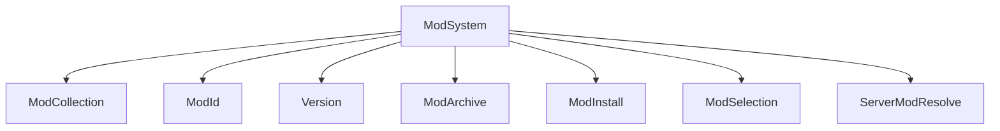
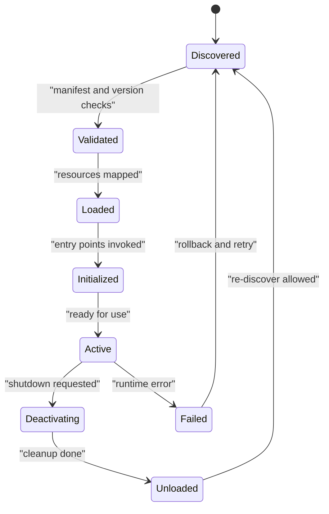
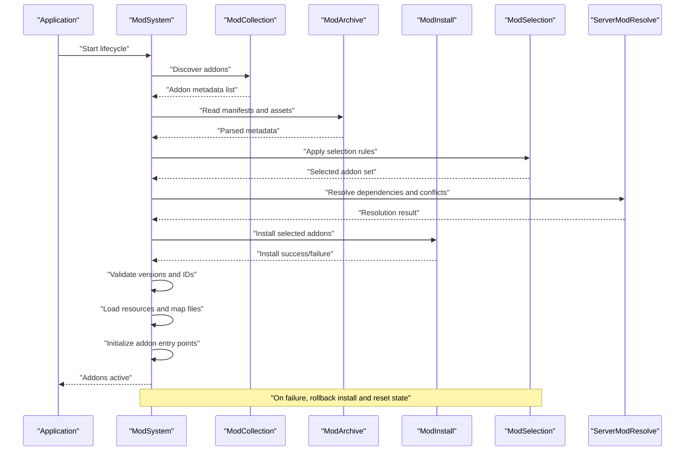
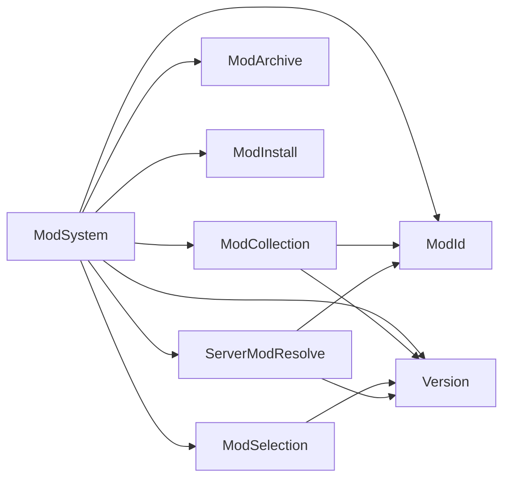

# Addon Lifecycle Management

<cite>
**Referenced Files in This Document**
- [ModSystem.hpp](file://engine/Poseidon/Core/ModSystem.hpp)
- [ModSystem.cpp](file://engine/Poseidon/Core/ModSystem.cpp)
- [ModCollection.hpp](file://engine/Poseidon/Core/ModCollection.hpp)
- [ModCollection.cpp](file://engine/Poseidon/Core/ModCollection.cpp)
- [ModId.hpp](file://engine/Poseidon/Core/ModId.hpp)
- [ModId.cpp](file://engine/Poseidon/Core/ModId.cpp)
- [Version.hpp](file://engine/Poseidon/Core/Version.hpp)
- [Version.cpp](file://engine/Poseidon/Core/Version.cpp)
- [ModArchive.hpp](file://engine/Poseidon/Core/ModArchive.hpp)
- [ModArchive.cpp](file://engine/Poseidon/Core/ModArchive.cpp)
- [ModInstall.hpp](file://engine/Poseidon/Core/ModInstall.hpp)
- [ModInstall.cpp](file://engine/Poseidon/Core/ModInstall.cpp)
- [ModSelection.hpp](file://engine/Poseidon/Core/ModSelection.hpp)
- [ModSelection.cpp](file://engine/Poseidon/Core/ModSelection.cpp)
- [ServerModResolve.hpp](file://engine/Poseidon/Core/ServerModResolve.hpp)
- [ServerModResolve.cpp](file://engine/Poseidon/Core/ServerModResolve.cpp)
</cite>

## Table of Contents
1. Introduction
2. Project Structure
3. Core Components
4. Architecture Overview
5. Detailed Component Analysis
6. Dependency Analysis
7. Performance Considerations
8. Troubleshooting Guide
9. Conclusion

## Introduction
This document explains the addon lifecycle management system used by the engine to discover, validate, load, initialize, and manage addons (mods). It covers the complete flow from discovery to initialization, including validation phases, dependency checking, error handling, state transitions, context creation/destruction, memory management patterns, cleanup procedures, versioning and compatibility checks, and rollback mechanisms. Practical guidance is provided for implementing custom addon loaders, handling errors gracefully, monitoring addon health, and ensuring safe upgrades and rollbacks.

## Project Structure
The addon subsystem is implemented under the Poseidon core with a clear separation of concerns:
- ModSystem orchestrates the overall lifecycle and state machine.
- ModCollection manages the set of discovered addons and their metadata.
- ModId and Version provide identity and semantic versioning utilities.
- ModArchive and ModInstall handle archive access and installation operations.
- ModSelection resolves user-selected sets and constraints.
- ServerModResolve coordinates server-side resolution and consistency.

**Diagram sources**
- [ModSystem.hpp](file://engine/Poseidon/Core/ModSystem.hpp)
- [ModCollection.hpp](file://engine/Poseidon/Core/ModCollection.hpp)
- [ModId.hpp](file://engine/Poseidon/Core/ModId.hpp)
- [Version.hpp](file://engine/Poseidon/Core/Version.hpp)
- [ModArchive.hpp](file://engine/Poseidon/Core/ModArchive.hpp)
- [ModInstall.hpp](file://engine/Poseidon/Core/ModInstall.hpp)
- [ModSelection.hpp](file://engine/Poseidon/Core/ModSelection.hpp)
- [ServerModResolve.hpp](file://engine/Poseidon/Core/ServerModResolve.hpp)

**Section sources**
- [ModSystem.hpp](file://engine/Poseidon/Core/ModSystem.hpp)
- [ModCollection.hpp](file://engine/Poseidon/Core/ModCollection.hpp)
- [ModId.hpp](file://engine/Poseidon/Core/ModId.hpp)
- [Version.hpp](file://engine/Poseidon/Core/Version.hpp)
- [ModArchive.hpp](file://engine/Poseidon/Core/ModArchive.hpp)
- [ModInstall.hpp](file://engine/Poseidon/Core/ModInstall.hpp)
- [ModSelection.hpp](file://engine/Poseidon/Core/ModSelection.hpp)
- [ServerModResolve.hpp](file://engine/Poseidon/Core/ServerModResolve.hpp)

## Core Components
- ModSystem: Central coordinator that drives discovery, validation, loading, initialization, activation, and teardown of addons. It maintains per-addon states such as discovered, loaded, initialized, active, and handles transitions and error recovery.
- ModCollection: Holds the registry of addons, their metadata, and provides iteration and lookup facilities.
- ModId: Represents unique identifiers for addons and supports canonicalization and comparison.
- Version: Semantic version parsing, comparison, and compatibility helpers.
- ModArchive: Provides read-only access to addon archives (e.g., PBO), enabling manifest inspection and asset enumeration.
- ModInstall: Manages installation steps, file placement, and rollback on failure.
- ModSelection: Resolves which addons are selected and applies selection rules or constraints.
- ServerModResolve: Ensures consistent addon sets across clients and servers, resolving conflicts and missing dependencies.

Key responsibilities:
- Discovery: Scan configured paths and archives to find addons.
- Validation: Check manifests, versions, and dependency constraints.
- Loading: Map resources and prepare runtime structures.
- Initialization: Call addon entry points and establish contexts.
- Activation: Mark addons ready for use by the game systems.
- Teardown: Clean up contexts, release resources, and restore state.

**Section sources**
- [ModSystem.hpp](file://engine/Poseidon/Core/ModSystem.hpp)
- [ModCollection.hpp](file://engine/Poseidon/Core/ModCollection.hpp)
- [ModId.hpp](file://engine/Poseidon/Core/ModId.hpp)
- [Version.hpp](file://engine/Poseidon/Core/Version.hpp)
- [ModArchive.hpp](file://engine/Poseidon/Core/ModArchive.hpp)
- [ModInstall.hpp](file://engine/Poseidon/Core/ModInstall.hpp)
- [ModSelection.hpp](file://engine/Poseidon/Core/ModSelection.hpp)
- [ServerModResolve.hpp](file://engine/Poseidon/Core/ServerModResolve.hpp)

## Architecture Overview
The addon lifecycle follows a strict state machine driven by ModSystem. Each addon progresses through well-defined stages with explicit validation and error handling at each step.

**Diagram sources**
- [ModSystem.hpp](file://engine/Poseidon/Core/ModSystem.hpp)
- [ModSystem.cpp](file://engine/Poseidon/Core/ModSystem.cpp)

**Section sources**
- [ModSystem.hpp](file://engine/Poseidon/Core/ModSystem.hpp)
- [ModSystem.cpp](file://engine/Poseidon/Core/ModSystem.cpp)

## Detailed Component Analysis

### Addon System Orchestration (ModSystem)
ModSystem implements the lifecycle orchestration and state transitions. It exposes methods to:
- Discover addons from configured locations and archives.
- Validate manifests and dependency graphs.
- Load addon resources into memory-mapped or cached storage.
- Initialize addons via defined entry points and create addon contexts.
- Activate addons for use by game systems.
- Deactivate and unload addons during shutdown or reload.
- Handle errors and perform rollback when necessary.

Typical workflow:
- Discovery scans ModCollection and ModArchive to populate addon metadata.
- Validation uses Version and ModId to enforce compatibility and uniqueness.
- Loading prepares resource handles and maps files via ModArchive.
- Initialization invokes addon hooks and constructs per-addon contexts.
- Activation marks addons ready; deactivation triggers cleanup.

Error handling:
- Fail-fast on invalid manifests or incompatible versions.
- Partial failures trigger rollback of installed changes and resource cleanup.
- Health monitoring tracks failed states and allows retries where appropriate.

**Section sources**
- [ModSystem.hpp](file://engine/Poseidon/Core/ModSystem.hpp)
- [ModSystem.cpp](file://engine/Poseidon/Core/ModSystem.cpp)

### Addon Registry and Metadata (ModCollection)
ModCollection maintains the authoritative list of addons with their metadata:
- Unique identifiers via ModId.
- Version information via Version.
- Manifest data parsed from archives.
- Dependency lists and constraints.
- Selection status and lifecycle state.

Operations include:
- Adding discovered addons.
- Querying by ID or name.
- Iterating for processing pipelines.
- Updating state and metadata during lifecycle transitions.

**Section sources**
- [ModCollection.hpp](file://engine/Poseidon/Core/ModCollection.hpp)
- [ModCollection.cpp](file://engine/Poseidon/Core/ModCollection.cpp)

### Identity and Versioning (ModId and Version)
ModId ensures stable identification:
- Canonical forms and normalization.
- Comparison and equality checks.
- Integration with selection and resolution logic.

Version provides semantic version support:
- Parsing version strings.
- Comparing versions for compatibility.
- Enforcing minimum/maximum version constraints.

These components are essential for compatibility checks and preventing mismatches between addons and the engine or each other.

**Section sources**
- [ModId.hpp](file://engine/Poseidon/Core/ModId.hpp)
- [ModId.cpp](file://engine/Poseidon/Core/ModId.cpp)
- [Version.hpp](file://engine/Poseidon/Core/Version.hpp)
- [Version.cpp](file://engine/Poseidon/Core/Version.cpp)

### Archive Access and Installation (ModArchive and ModInstall)
ModArchive abstracts reading addon archives:
- Enumerating files and directories.
- Extracting manifests and metadata.
- Providing streaming or buffered access to assets.

ModInstall manages installation steps:
- Copying or linking required files.
- Creating configuration entries.
- Recording installation state for rollback.
- Rolling back on failure to maintain consistency.

Together they enable robust addon deployment and recovery.

**Section sources**
- [ModArchive.hpp](file://engine/Poseidon/Core/ModArchive.hpp)
- [ModArchive.cpp](file://engine/Poseidon/Core/ModArchive.cpp)
- [ModInstall.hpp](file://engine/Poseidon/Core/ModInstall.hpp)
- [ModInstall.cpp](file://engine/Poseidon/Core/ModInstall.cpp)

### Selection and Resolution (ModSelection and ServerModResolve)
ModSelection resolves which addons are enabled based on user preferences and constraints:
- Applying allow/deny lists.
- Handling optional dependencies.
- Producing a deterministic selection set.

ServerModResolve ensures server-client consistency:
- Verifying required addons and versions.
- Detecting conflicts and missing dependencies.
- Generating resolution reports for diagnostics.

**Section sources**
- [ModSelection.hpp](file://engine/Poseidon/Core/ModSelection.hpp)
- [ModSelection.cpp](file://engine/Poseidon/Core/ModSelection.cpp)
- [ServerModResolve.hpp](file://engine/Poseidon/Core/ServerModResolve.hpp)
- [ServerModResolve.cpp](file://engine/Poseidon/Core/ServerModResolve.cpp)

### Lifecycle Sequence Diagram
The following sequence illustrates the end-to-end lifecycle from discovery to activation, including validation and error handling.

**Diagram sources**
- [ModSystem.hpp](file://engine/Poseidon/Core/ModSystem.hpp)
- [ModCollection.hpp](file://engine/Poseidon/Core/ModCollection.hpp)
- [ModArchive.hpp](file://engine/Poseidon/Core/ModArchive.hpp)
- [ModInstall.hpp](file://engine/Poseidon/Core/ModInstall.hpp)
- [ModSelection.hpp](file://engine/Poseidon/Core/ModSelection.hpp)
- [ServerModResolve.hpp](file://engine/Poseidon/Core/ServerModResolve.hpp)

**Section sources**
- [ModSystem.hpp](file://engine/Poseidon/Core/ModSystem.hpp)
- [ModCollection.hpp](file://engine/Poseidon/Core/ModCollection.hpp)
- [ModArchive.hpp](file://engine/Poseidon/Core/ModArchive.hpp)
- [ModInstall.hpp](file://engine/Poseidon/Core/ModInstall.hpp)
- [ModSelection.hpp](file://engine/Poseidon/Core/ModSelection.hpp)
- [ServerModResolve.hpp](file://engine/Poseidon/Core/ServerModResolve.hpp)

### Addon Context Creation and Destruction
Context lifecycle:
- Creation occurs during initialization after successful validation and loading.
- Context holds per-addon runtime state, handles, and references.
- Destruction is triggered during deactivation/unload, releasing all resources.

Memory management patterns:
- RAII-style ownership for addon-owned resources.
- Reference counting or smart pointers for shared assets.
- Explicit cleanup callbacks invoked by ModSystem during teardown.

Cleanup procedures:
- Close file handles and unmap memory regions.
- Release graphics/audio resources allocated by addons.
- Clear event listeners and hooks registered by addons.
- Ensure no dangling references remain in global registries.

**Section sources**
- [ModSystem.hpp](file://engine/Poseidon/Core/ModSystem.hpp)
- [ModSystem.cpp](file://engine/Poseidon/Core/ModSystem.cpp)

### Error Handling and Rollback
Error handling strategy:
- Validation errors halt the pipeline early and report detailed diagnostics.
- Installation failures trigger automatic rollback to previous state.
- Runtime errors mark addons as failed and prevent activation.

Rollback mechanisms:
- Transactional installation records changes and reverts on failure.
- Resource mapping failures revert mappings and free allocations.
- State machine resets to last known good state before retry.

Monitoring health:
- Track addon states and transition counts.
- Log warnings for degraded states and repeated failures.
- Expose metrics for external monitoring tools.

**Section sources**
- [ModSystem.hpp](file://engine/Poseidon/Core/ModSystem.hpp)
- [ModSystem.cpp](file://engine/Poseidon/Core/ModSystem.cpp)
- [ModInstall.hpp](file://engine/Poseidon/Core/ModInstall.hpp)
- [ModInstall.cpp](file://engine/Poseidon/Core/ModInstall.cpp)

### Versioning and Compatibility Checks
Compatibility enforcement:
- Minimum/maximum engine version constraints checked against Version.
- Inter-addon dependency versions validated using ModId and Version.
- Incompatible combinations rejected during resolution.

Practical examples:
- Reject addons requiring unsupported engine features.
- Prevent mixing addons with conflicting dependency versions.
- Allow optional dependencies to be skipped if unavailable.

**Section sources**
- [Version.hpp](file://engine/Poseidon/Core/Version.hpp)
- [Version.cpp](file://engine/Poseidon/Core/Version.cpp)
- [ModId.hpp](file://engine/Poseidon/Core/ModId.hpp)
- [ModId.cpp](file://engine/Poseidon/Core/ModId.cpp)
- [ServerModResolve.hpp](file://engine/Poseidon/Core/ServerModResolve.hpp)
- [ServerModResolve.cpp](file://engine/Poseidon/Core/ServerModResolve.cpp)

### Custom Addon Loader Implementation
To implement a custom loader:
- Implement an interface compatible with ModSystem’s expected loader contract.
- Provide functions to parse addon-specific formats and extract metadata.
- Integrate with ModArchive for asset access and with ModInstall for deployment.
- Register the loader with ModSystem so it participates in discovery and loading.

Guidelines:
- Ensure idempotent parsing and caching of metadata.
- Validate inputs thoroughly to avoid crashes.
- Report errors with actionable messages for diagnostics.

**Section sources**
- [ModSystem.hpp](file://engine/Poseidon/Core/ModSystem.hpp)
- [ModArchive.hpp](file://engine/Poseidon/Core/ModArchive.hpp)
- [ModInstall.hpp](file://engine/Poseidon/Core/ModInstall.hpp)

### Monitoring Addon Health
Health monitoring recommendations:
- Track state transitions and durations.
- Record error counts and types per addon.
- Expose health endpoints or logs for automated checks.
- Alert on repeated failures or stuck states.

Operational practices:
- Use structured logging with addon IDs and versions.
- Aggregate metrics for dashboards and alerts.
- Implement graceful degradation for non-critical addons.

**Section sources**
- [ModSystem.hpp](file://engine/Poseidon/Core/ModSystem.hpp)
- [ModSystem.cpp](file://engine/Poseidon/Core/ModSystem.cpp)

## Dependency Analysis
The addon subsystem exhibits clear layering and low coupling:
- ModSystem depends on ModCollection, ModId, Version, ModArchive, ModInstall, ModSelection, and ServerModResolve.
- ModCollection relies on ModId and Version for identity and compatibility.
- ModArchive and ModInstall are infrastructure components used by higher layers.
- ServerModResolve integrates with selection and resolution to ensure consistency.

**Diagram sources**
- [ModSystem.hpp](file://engine/Poseidon/Core/ModSystem.hpp)
- [ModCollection.hpp](file://engine/Poseidon/Core/ModCollection.hpp)
- [ModId.hpp](file://engine/Poseidon/Core/ModId.hpp)
- [Version.hpp](file://engine/Poseidon/Core/Version.hpp)
- [ModArchive.hpp](file://engine/Poseidon/Core/ModArchive.hpp)
- [ModInstall.hpp](file://engine/Poseidon/Core/ModInstall.hpp)
- [ModSelection.hpp](file://engine/Poseidon/Core/ModSelection.hpp)
- [ServerModResolve.hpp](file://engine/Poseidon/Core/ServerModResolve.hpp)

**Section sources**
- [ModSystem.hpp](file://engine/Poseidon/Core/ModSystem.hpp)
- [ModCollection.hpp](file://engine/Poseidon/Core/ModCollection.hpp)
- [ModId.hpp](file://engine/Poseidon/Core/ModId.hpp)
- [Version.hpp](file://engine/Poseidon/Core/Version.hpp)
- [ModArchive.hpp](file://engine/Poseidon/Core/ModArchive.hpp)
- [ModInstall.hpp](file://engine/Poseidon/Core/ModInstall.hpp)
- [ModSelection.hpp](file://engine/Poseidon/Core/ModSelection.hpp)
- [ServerModResolve.hpp](file://engine/Poseidon/Core/ServerModResolve.hpp)

## Performance Considerations
- Minimize repeated parsing by caching addon metadata after initial discovery.
- Use streaming reads for large assets to reduce memory pressure.
- Parallelize independent tasks like scanning multiple archives and validating manifests.
- Avoid heavy work during critical path initialization; defer non-essential tasks.
- Profile resource mapping and file I/O to identify bottlenecks.
- Batch operations where possible to reduce overhead.

[No sources needed since this section provides general guidance]

## Troubleshooting Guide
Common issues and resolutions:
- Invalid manifest: Verify addon structure and required fields; check parsing logs.
- Version mismatch: Update addon or engine to satisfy constraints; review compatibility matrices.
- Dependency conflict: Resolve conflicting versions or remove incompatible addons.
- Installation failure: Inspect permissions and disk space; verify rollback logs.
- Runtime crash: Enable verbose logging and isolate failing addon; test in isolation.

Diagnostic steps:
- Dump addon state and transitions for analysis.
- Export selection and resolution reports.
- Reproduce with minimal addon set to pinpoint issues.

**Section sources**
- [ModSystem.hpp](file://engine/Poseidon/Core/ModSystem.hpp)
- [ModSystem.cpp](file://engine/Poseidon/Core/ModSystem.cpp)
- [ModInstall.hpp](file://engine/Poseidon/Core/ModInstall.hpp)
- [ModInstall.cpp](file://engine/Poseidon/Core/ModInstall.cpp)
- [ServerModResolve.hpp](file://engine/Poseidon/Core/ServerModResolve.hpp)
- [ServerModResolve.cpp](file://engine/Poseidon/Core/ServerModResolve.cpp)

## Conclusion
The addon lifecycle management system provides a robust, extensible framework for discovering, validating, loading, initializing, and managing addons. By enforcing strict state transitions, comprehensive validation, and reliable rollback mechanisms, it ensures stability and safety. The modular design enables custom loaders and integration with existing systems while maintaining performance and reliability. Following the guidelines in this document will help developers implement addons that integrate seamlessly and operate reliably in production environments.

[No sources needed since this section summarizes without analyzing specific files]