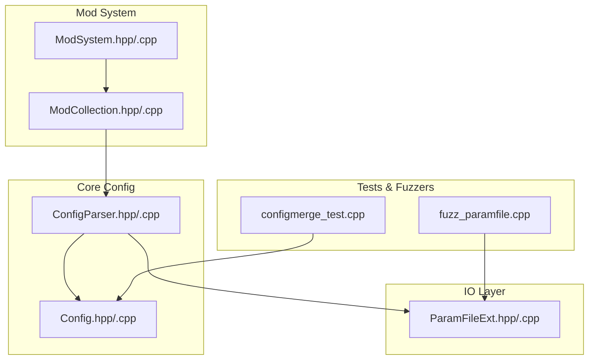
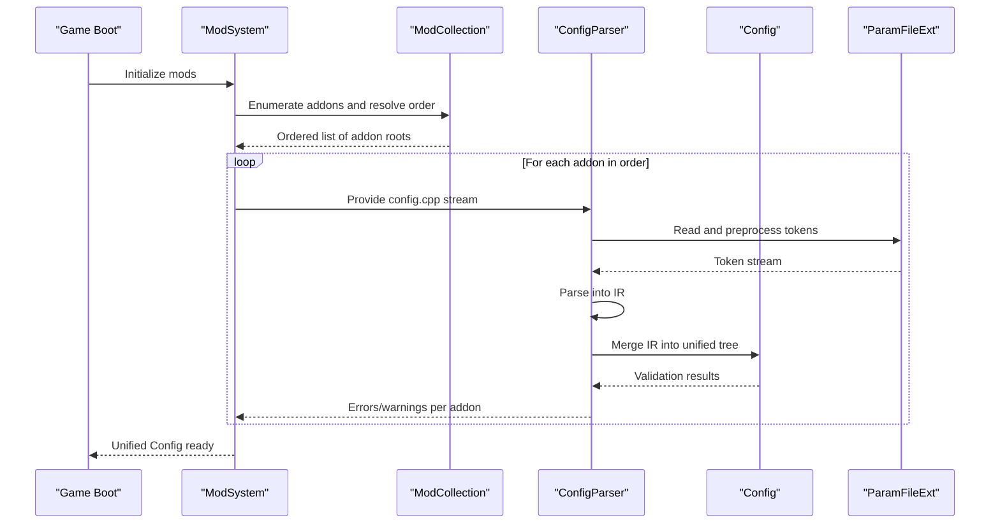
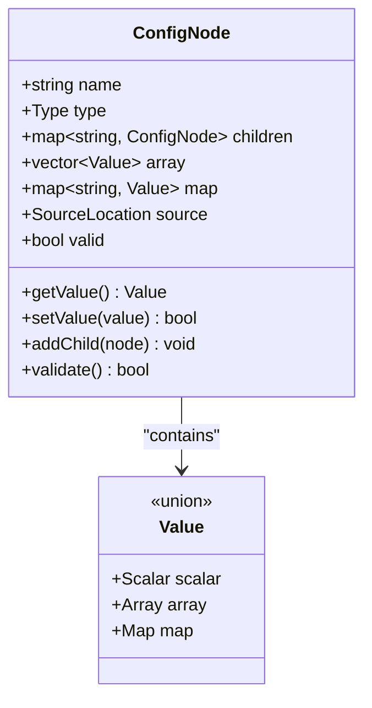
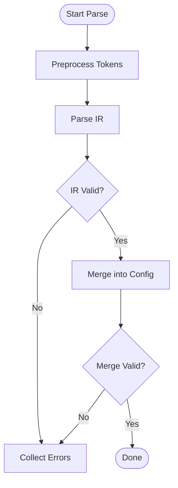
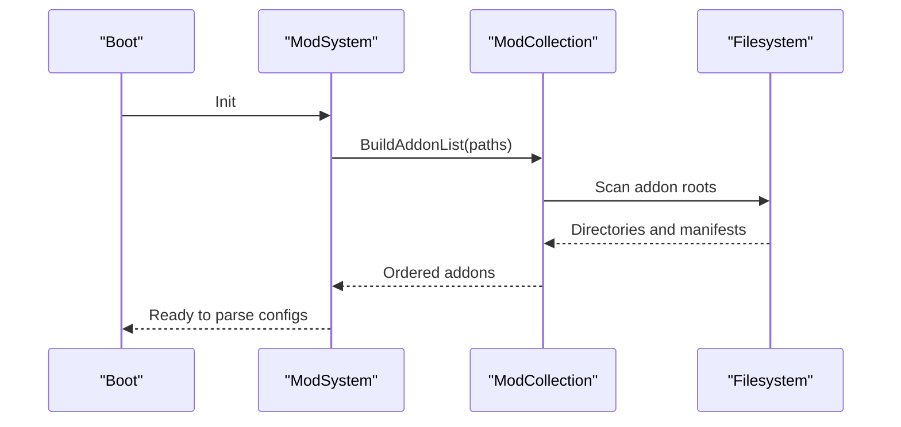
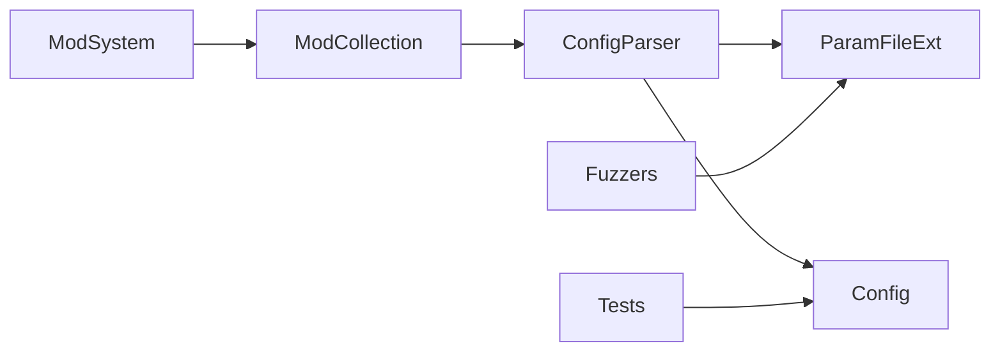

# Configuration Merging and Override System

<cite>
**Referenced Files in This Document**
- [Config.hpp](file://engine/Poseidon/Core/Config/Config.hpp)
- [Config.cpp](file://engine/Poseidon/Core/Config/Config.cpp)
- [ConfigParser.hpp](file://engine/Poseidon/Core/Config/ConfigParser.hpp)
- [ConfigParser.cpp](file://engine/Poseidon/Core/Config/ConfigParser.cpp)
- [ModCollection.hpp](file://engine/Poseidon/Core/ModCollection.hpp)
- [ModCollection.cpp](file://engine/Poseidon/Core/ModCollection.cpp)
- [ModSystem.hpp](file://engine/Poseidon/Core/ModSystem.hpp)
- [ModSystem.cpp](file://engine/Poseidon/Core/ModSystem.cpp)
- [ParamFileExt.hpp](file://engine/Poseidon/IO/ParamFileExt.hpp)
- [ParamFileExt.cpp](file://engine/Poseidon/IO/ParamFileExt.cpp)
- [fuzz_paramfile.cpp](file://apps/fuzzers/Fuzzer/fuzz_paramfile.cpp)
- [configmerge_test.cpp](file://tests/unit/engine/configmerge_test.cpp)
</cite>

## Table of Contents
1. [Introduction](#introduction)
2. [Project Structure](#project-structure)
3. [Core Components](#core-components)
4. [Architecture Overview](#architecture-overview)
5. [Detailed Component Analysis](#detailed-component-analysis)
6. [Dependency Analysis](#dependency-analysis)
7. [Performance Considerations](#performance-considerations)
8. [Troubleshooting Guide](#troubleshooting-guide)
9. [Conclusion](#conclusion)
10. [Appendices](#appendices)

## Introduction
This document explains the configuration merging system that combines multiple addon configurations into a unified game state. It covers the hierarchical configuration structure, override precedence rules, and merge algorithms for different data types. It also documents how config.cpp files are parsed, validated, and merged across addon boundaries, with guidance on creating compatible addon configurations, handling conflicts, and implementing dynamic updates. Finally, it addresses validation rules, error reporting, debugging tools, and performance optimization for large configuration sets and incremental updates.

## Project Structure
The configuration system is implemented primarily under engine/Poseidon/Core/Config and integrates with the mod system to load and merge configurations from multiple addons. The IO layer provides parameter file parsing utilities used by the config parser. Tests and fuzzers validate behavior and robustness.

**Diagram sources**
- [Config.hpp](file://engine/Poseidon/Core/Config/Config.hpp)
- [Config.cpp](file://engine/Poseidon/Core/Config/Config.cpp)
- [ConfigParser.hpp](file://engine/Poseidon/Core/Config/ConfigParser.hpp)
- [ConfigParser.cpp](file://engine/Poseidon/Core/Config/ConfigParser.cpp)
- [ModCollection.hpp](file://engine/Poseidon/Core/ModCollection.hpp)
- [ModCollection.cpp](file://engine/Poseidon/Core/ModCollection.cpp)
- [ModSystem.hpp](file://engine/Poseidon/Core/ModSystem.hpp)
- [ModSystem.cpp](file://engine/Poseidon/Core/ModSystem.cpp)
- [ParamFileExt.hpp](file://engine/Poseidon/IO/ParamFileExt.hpp)
- [ParamFileExt.cpp](file://engine/Poseidon/IO/ParamFileExt.cpp)
- [configmerge_test.cpp](file://tests/unit/engine/configmerge_test.cpp)
- [fuzz_paramfile.cpp](file://apps/fuzzers/Fuzzer/fuzz_paramfile.cpp)

**Section sources**
- [Config.hpp](file://engine/Poseidon/Core/Config/Config.hpp)
- [Config.cpp](file://engine/Poseidon/Core/Config/Config.cpp)
- [ConfigParser.hpp](file://engine/Poseidon/Core/Config/ConfigParser.hpp)
- [ConfigParser.cpp](file://engine/Poseidon/Core/Config/ConfigParser.cpp)
- [ModCollection.hpp](file://engine/Poseidon/Core/ModCollection.hpp)
- [ModCollection.cpp](file://engine/Poseidon/Core/ModCollection.cpp)
- [ModSystem.hpp](file://engine/Poseidon/Core/ModSystem.hpp)
- [ModSystem.cpp](file://engine/Poseidon/Core/ModSystem.cpp)
- [ParamFileExt.hpp](file://engine/Poseidon/IO/ParamFileExt.hpp)
- [ParamFileExt.cpp](file://engine/Poseidon/IO/ParamFileExt.cpp)
- [configmerge_test.cpp](file://tests/unit/engine/configmerge_test.cpp)
- [fuzz_paramfile.cpp](file://apps/fuzzers/Fuzzer/fuzz_paramfile.cpp)

## Core Components
- Config: Represents the unified configuration tree after merging. Provides accessors and mutation points for runtime updates.
- ConfigParser: Parses config.cpp content into an intermediate representation and merges it into the Config tree according to precedence rules.
- ModCollection and ModSystem: Discover, order, and feed addon configurations to the parser, ensuring correct override hierarchy.
- ParamFileExt: Low-level utilities for reading and preprocessing parameter files consumed by the parser.

Key responsibilities:
- Hierarchical node management (namespaces, classes, objects).
- Type-aware merging (scalar, array, map, nested structures).
- Validation and error reporting during parse and merge phases.
- Incremental update support for dynamic reconfiguration.

**Section sources**
- [Config.hpp](file://engine/Poseidon/Core/Config/Config.hpp)
- [Config.cpp](file://engine/Poseidon/Core/Config/Config.cpp)
- [ConfigParser.hpp](file://engine/Poseidon/Core/Config/ConfigParser.hpp)
- [ConfigParser.cpp](file://engine/Poseidon/Core/Config/ConfigParser.cpp)
- [ModCollection.hpp](file://engine/Poseidon/Core/ModCollection.hpp)
- [ModCollection.cpp](file://engine/Poseidon/Core/ModCollection.cpp)
- [ModSystem.hpp](file://engine/Poseidon/Core/ModSystem.hpp)
- [ModSystem.cpp](file://engine/Poseidon/Core/ModSystem.cpp)
- [ParamFileExt.hpp](file://engine/Poseidon/IO/ParamFileExt.hpp)
- [ParamFileExt.cpp](file://engine/Poseidon/IO/ParamFileExt.cpp)

## Architecture Overview
The system follows a layered architecture:
- Mod discovery and ordering (ModSystem/ModCollection) produce a deterministic sequence of addon configs.
- ConfigParser consumes each addon’s config.cpp stream, building or updating nodes in the unified Config tree.
- Merge semantics are type-specific and respect override precedence based on addon order.
- Validation occurs at parse-time and merge-time; errors are reported with context.

**Diagram sources**
- [ModSystem.hpp](file://engine/Poseidon/Core/ModSystem.hpp)
- [ModSystem.cpp](file://engine/Poseidon/Core/ModSystem.cpp)
- [ModCollection.hpp](file://engine/Poseidon/Core/ModCollection.hpp)
- [ModCollection.cpp](file://engine/Poseidon/Core/ModCollection.cpp)
- [ConfigParser.hpp](file://engine/Poseidon/Core/Config/ConfigParser.hpp)
- [ConfigParser.cpp](file://engine/Poseidon/Core/Config/ConfigParser.cpp)
- [Config.hpp](file://engine/Poseidon/Core/Config/Config.hpp)
- [ParamFileExt.hpp](file://engine/Poseidon/IO/ParamFileExt.hpp)
- [ParamFileExt.cpp](file://engine/Poseidon/IO/ParamFileExt.cpp)

## Detailed Component Analysis

### Config Tree and Data Types
The Config tree models hierarchical namespaces and typed values:
- Nodes represent containers (objects/maps) or leaf values (scalars, arrays, maps).
- Each node carries metadata such as source location and validation status.
- Accessors provide safe reads; mutations trigger validation and change notifications.

Merge behavior by type:
- Scalars: Later addons overwrite earlier values.
- Arrays: Append mode unless explicitly overridden; deep append preserves element identity when keys match.
- Maps: Key-based merge; later entries override earlier ones by key.
- Nested objects: Recursive merge following scalar/array/map rules.

**Diagram sources**
- [Config.hpp](file://engine/Poseidon/Core/Config/Config.hpp)
- [Config.cpp](file://engine/Poseidon/Core/Config/Config.cpp)

**Section sources**
- [Config.hpp](file://engine/Poseidon/Core/Config/Config.hpp)
- [Config.cpp](file://engine/Poseidon/Core/Config/Config.cpp)

### ConfigParser: Parsing and Merging
The parser transforms raw config.cpp text into an intermediate representation (IR) and merges it into the Config tree:
- Tokenization and preprocessing via ParamFileExt.
- Grammar-driven parsing into IR nodes.
- Merge pass applies precedence rules and validates types.
- Error collection includes line/column context and conflict details.

**Diagram sources**
- [ConfigParser.hpp](file://engine/Poseidon/Core/Config/ConfigParser.hpp)
- [ConfigParser.cpp](file://engine/Poseidon/Core/Config/ConfigParser.cpp)
- [ParamFileExt.hpp](file://engine/Poseidon/IO/ParamFileExt.hpp)
- [ParamFileExt.cpp](file://engine/Poseidon/IO/ParamFileExt.cpp)

**Section sources**
- [ConfigParser.hpp](file://engine/Poseidon/Core/Config/ConfigParser.hpp)
- [ConfigParser.cpp](file://engine/Poseidon/Core/Config/ConfigParser.cpp)
- [ParamFileExt.hpp](file://engine/Poseidon/IO/ParamFileExt.hpp)
- [ParamFileExt.cpp](file://engine/Poseidon/IO/ParamFileExt.cpp)

### ModSystem and ModCollection: Addon Ordering and Loading
- ModSystem orchestrates initialization and lifecycle of mods.
- ModCollection enumerates addon directories, resolves dependencies, and produces a deterministic load order.
- The ordered list ensures consistent override precedence: later addons can override earlier ones.

**Diagram sources**
- [ModSystem.hpp](file://engine/Poseidon/Core/ModSystem.hpp)
- [ModSystem.cpp](file://engine/Poseidon/Core/ModSystem.cpp)
- [ModCollection.hpp](file://engine/Poseidon/Core/ModCollection.hpp)
- [ModCollection.cpp](file://engine/Poseidon/Core/ModCollection.cpp)

**Section sources**
- [ModSystem.hpp](file://engine/Poseidon/Core/ModSystem.hpp)
- [ModSystem.cpp](file://engine/Poseidon/Core/ModSystem.cpp)
- [ModCollection.hpp](file://engine/Poseidon/Core/ModCollection.hpp)
- [ModCollection.cpp](file://engine/Poseidon/Core/ModCollection.cpp)

### Example Workflow: Creating Compatible Addon Configurations
- Define base settings in core addon config.cpp.
- Create overriding addon config.cpp that targets specific nodes by path.
- Ensure type compatibility: arrays appended, maps merged by key, scalars overwritten.
- Use unique identifiers for array elements to enable targeted overrides.
- Validate locally using tests and fuzzers before integration.

[No sources needed since this section provides general guidance]

### Handling Conflicting Settings
- Conflicts arise when incompatible types are merged or when required fields are missing.
- The parser reports conflicts with precise locations and suggests resolutions.
- Prefer additive changes (arrays/maps) over full replacements to reduce conflicts.

[No sources needed since this section provides general guidance]

### Dynamic Configuration Updates
- The Config API supports runtime mutations with validation and change events.
- Use incremental updates to apply patches without full reloads.
- Ensure thread-safety if updates occur concurrently with reads.

[No sources needed since this section provides general guidance]

## Dependency Analysis
The configuration system has clear separation of concerns:
- ModSystem/ModCollection depend on filesystem and manifest parsing.
- ConfigParser depends on ParamFileExt for tokenization and on Config for tree operations.
- Tests and fuzzers exercise both IO and parsing paths.

**Diagram sources**
- [ModSystem.hpp](file://engine/Poseidon/Core/ModSystem.hpp)
- [ModSystem.cpp](file://engine/Poseidon/Core/ModSystem.cpp)
- [ModCollection.hpp](file://engine/Poseidon/Core/ModCollection.hpp)
- [ModCollection.cpp](file://engine/Poseidon/Core/ModCollection.cpp)
- [ConfigParser.hpp](file://engine/Poseidon/Core/Config/ConfigParser.hpp)
- [ConfigParser.cpp](file://engine/Poseidon/Core/Config/ConfigParser.cpp)
- [ParamFileExt.hpp](file://engine/Poseidon/IO/ParamFileExt.hpp)
- [ParamFileExt.cpp](file://engine/Poseidon/IO/ParamFileExt.cpp)
- [Config.hpp](file://engine/Poseidon/Core/Config/Config.hpp)
- [Config.cpp](file://engine/Poseidon/Core/Config/Config.cpp)
- [configmerge_test.cpp](file://tests/unit/engine/configmerge_test.cpp)
- [fuzz_paramfile.cpp](file://apps/fuzzers/Fuzzer/fuzz_paramfile.cpp)

**Section sources**
- [ModSystem.hpp](file://engine/Poseidon/Core/ModSystem.hpp)
- [ModSystem.cpp](file://engine/Poseidon/Core/ModSystem.cpp)
- [ModCollection.hpp](file://engine/Poseidon/Core/ModCollection.hpp)
- [ModCollection.cpp](file://engine/Poseidon/Core/ModCollection.cpp)
- [ConfigParser.hpp](file://engine/Poseidon/Core/Config/ConfigParser.hpp)
- [ConfigParser.cpp](file://engine/Poseidon/Core/Config/ConfigParser.cpp)
- [ParamFileExt.hpp](file://engine/Poseidon/IO/ParamFileExt.hpp)
- [ParamFileExt.cpp](file://engine/Poseidon/IO/ParamFileExt.cpp)
- [Config.hpp](file://engine/Poseidon/Core/Config/Config.hpp)
- [Config.cpp](file://engine/Poseidon/Core/Config/Config.cpp)
- [configmerge_test.cpp](file://tests/unit/engine/configmerge_test.cpp)
- [fuzz_paramfile.cpp](file://apps/fuzzers/Fuzzer/fuzz_paramfile.cpp)

## Performance Considerations
- Minimize redundant parsing by caching preprocessed tokens for unchanged addons.
- Use incremental merges: only re-parse and re-merge changed addon files.
- Prefer map-based overrides keyed by stable identifiers to avoid full array rebuilds.
- Batch validation passes to reduce repeated checks.
- Profile large configuration sets to identify hotspots in parsing and merging.

[No sources needed since this section provides general guidance]

## Troubleshooting Guide
Common issues and remedies:
- Parse errors: Check syntax and tokenization; use fuzzers to stress-test inputs.
- Merge conflicts: Inspect type mismatches and ensure additive changes where possible.
- Missing nodes: Verify addon load order and namespace paths.
- Runtime invalidation: Validate mutations and handle change events gracefully.

Debugging tools:
- Unit tests for expected merge outcomes and error conditions.
- Fuzzers for robustness against malformed inputs.
- Logging hooks in parser and validator to trace decisions and errors.

**Section sources**
- [configmerge_test.cpp](file://tests/unit/engine/configmerge_test.cpp)
- [fuzz_paramfile.cpp](file://apps/fuzzers/Fuzzer/fuzz_paramfile.cpp)

## Conclusion
The configuration merging system provides a robust, type-aware mechanism for combining multiple addon configurations into a unified game state. By enforcing clear precedence rules, validating inputs, and supporting incremental updates, it enables scalable and maintainable modding ecosystems. Proper design of addon configurations and careful handling of conflicts ensure stability and performance even with large configuration sets.

## Appendices
- Best practices for addon authors:
  - Use stable identifiers for array elements.
  - Prefer additive changes to minimize conflicts.
  - Keep configurations modular and well-namespaced.
- Validation checklist:
  - Confirm types match expected schemas.
  - Verify required fields are present.
  - Test merge order with representative addons.

[No sources needed since this section provides general guidance]