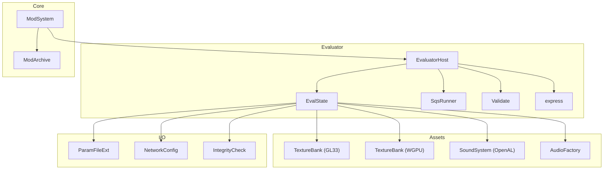
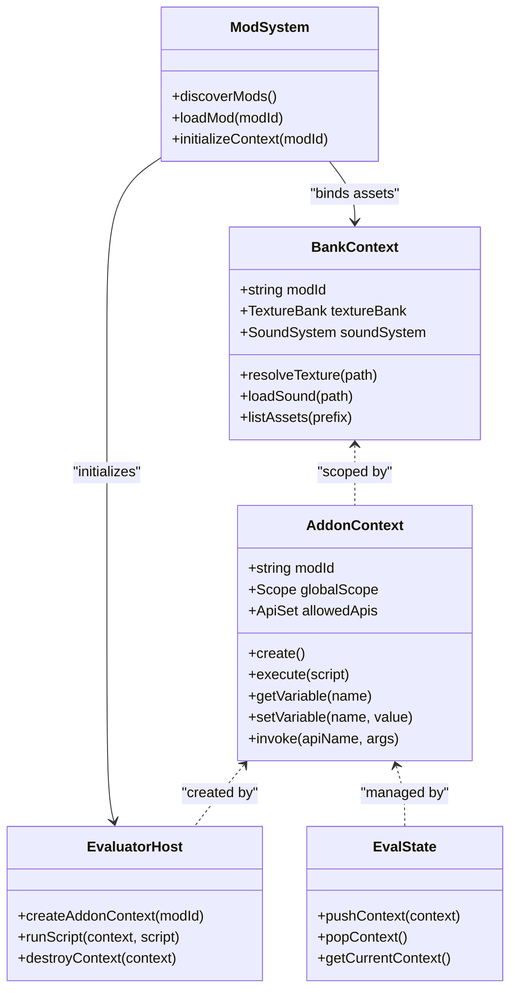
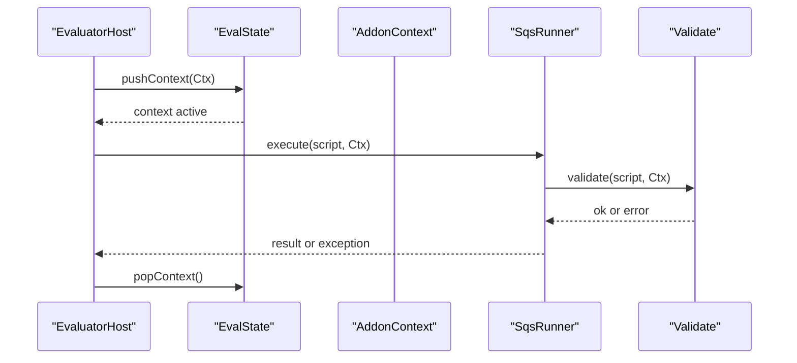
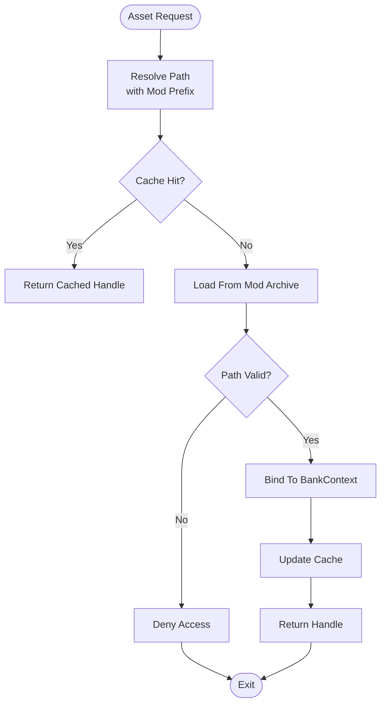
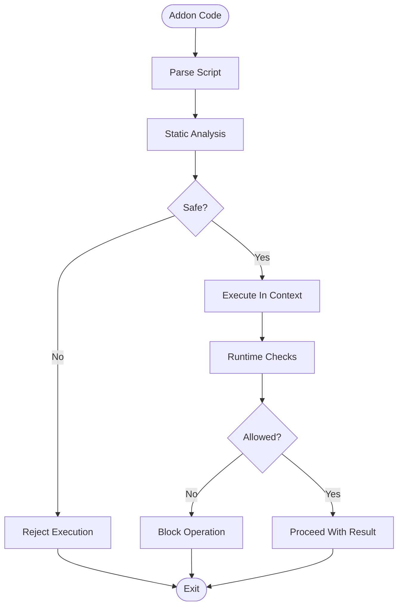
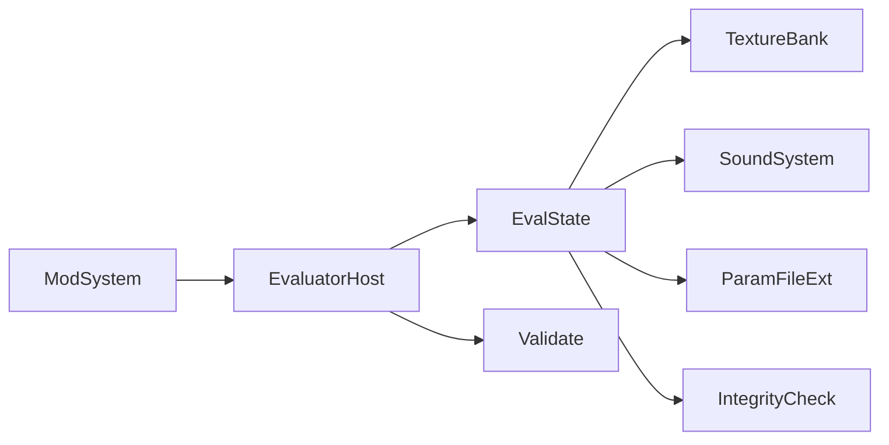

# Context Isolation and Security

<cite>
**Referenced Files in This Document**
- [EvaluatorHost.hpp](file://engine/Poseidon/Evaluator/EvaluatorHost.hpp)
- [EvaluatorHost.cpp](file://engine/Poseidon/Evaluator/EvaluatorHost.cpp)
- [EvalState.hpp](file://engine/Poseidon/Evaluator/EvalState.hpp)
- [EvalState.cpp](file://engine/Poseidon/Evaluator/EvalState.cpp)
- [SqsRunner.hpp](file://engine/Poseidon/Evaluator/SqsRunner.hpp)
- [SqsRunner.cpp](file://engine/Poseidon/Evaluator/SqsRunner.cpp)
- [Validate.hpp](file://engine/Poseidon/Evaluator/Validate.hpp)
- [Validate.cpp](file://engine/Poseidon/Evaluator/Validate.cpp)
- [express.hpp](file://engine/Poseidon/Evaluator/express.hpp)
- [express.cpp](file://engine/Poseidon/Evaluator/express.cpp)
- [ModSystem.hpp](file://engine/Poseidon/Core/ModSystem.hpp)
- [ModSystem.cpp](file://engine/Poseidon/Core/ModSystem.cpp)
- [ModArchive.hpp](file://engine/Poseidon/Core/ModArchive.hpp)
- [ModArchive.cpp](file://engine/Poseidon/Core/ModArchive.cpp)
- [TextureBankGL33_Core.cpp](file://engine/PoseidonGL33/TextureBankGL33_Core.cpp)
- [TextureBankWgpu.cpp](file://engine/WgpuRenderer/TextureBankWgpu.cpp)
- [SoundSystemOAL.hpp](file://engine/PoseidonOpenAL/SoundSystemOAL.hpp)
- [SoundSystemOAL.cpp](file://engine/PoseidonOpenAL/SoundSystemOAL.cpp)
- [AudioFactory.hpp](file://engine/Poseidon/Audio/AudioFactory.hpp)
- [AudioFactory.cpp](file://engine/Poseidon/Audio/AudioFactory.cpp)
- [ParamFileExt.hpp](file://engine/Poseidon/IO/ParamFileExt.hpp)
- [ParamFileExt.cpp](file://engine/Poseidon/IO/ParamFileExt.cpp)
- [NetworkConfig.hpp](file://engine/Poseidon/Network/NetworkConfig.hpp)
- [NetworkConfig.cpp](file://engine/Poseidon/Network/NetworkConfig.cpp)
- [IntegrityCheck.hpp](file://engine/Poseidon/Network/IntegrityCheck.hpp)
- [IntegrityCheck.cpp](file://engine/Poseidon/Network/IntegrityCheck.cpp)
</cite>

## Table of Contents
1. [Introduction](#introduction)
2. [Project Structure](#project-structure)
3. [Core Components](#core-components)
4. [Architecture Overview](#architecture-overview)
5. [Detailed Component Analysis](#detailed-component-analysis)
6. [Dependency Analysis](#dependency-analysis)
7. [Performance Considerations](#performance-considerations)
8. [Troubleshooting Guide](#troubleshooting-guide)
9. [Conclusion](#conclusion)

## Introduction
This document explains the context isolation system that provides secure execution environments for mods. It focuses on how AddonContext creates isolated namespaces for addon code execution to prevent cross-contamination between different mods, and how BankContext isolates assets such as textures, sounds, and configuration files. It also documents the security model, sandboxing techniques, API restrictions, safe API implementation patterns, resource access controls, and performance implications of context switching with optimization strategies.

## Project Structure
The context isolation system spans several engine subsystems:
- Evaluator: scripting runtime and execution contexts
- Core Mod System: mod discovery, loading, and lifecycle
- Asset Banks: texture and sound asset isolation per context
- Configuration and Network: restricted access to sensitive resources
- Validation and Integrity: pre-execution checks and runtime integrity verification

**Diagram sources**
- [EvaluatorHost.hpp](file://engine/Poseidon/Evaluator/EvaluatorHost.hpp)
- [EvalState.hpp](file://engine/Poseidon/Evaluator/EvalState.hpp)
- [SqsRunner.hpp](file://engine/Poseidon/Evaluator/SqsRunner.hpp)
- [Validate.hpp](file://engine/Poseidon/Evaluator/Validate.hpp)
- [express.hpp](file://engine/Poseidon/Evaluator/express.hpp)
- [ModSystem.hpp](file://engine/Poseidon/Core/ModSystem.hpp)
- [ModArchive.hpp](file://engine/Poseidon/Core/ModArchive.hpp)
- [TextureBankGL33_Core.cpp](file://engine/PoseidonGL33/TextureBankGL33_Core.cpp)
- [TextureBankWgpu.cpp](file://engine/WgpuRenderer/TextureBankWgpu.cpp)
- [SoundSystemOAL.hpp](file://engine/PoseidonOpenAL/SoundSystemOAL.hpp)
- [AudioFactory.hpp](file://engine/Poseidon/Audio/AudioFactory.hpp)
- [ParamFileExt.hpp](file://engine/Poseidon/IO/ParamFileExt.hpp)
- [NetworkConfig.hpp](file://engine/Poseidon/Network/NetworkConfig.hpp)
- [IntegrityCheck.hpp](file://engine/Poseidon/Network/IntegrityCheck.hpp)

**Section sources**
- [EvaluatorHost.hpp](file://engine/Poseidon/Evaluator/EvaluatorHost.hpp)
- [EvalState.hpp](file://engine/Poseidon/Evaluator/EvalState.hpp)
- [ModSystem.hpp](file://engine/Poseidon/Core/ModSystem.hpp)
- [ModArchive.hpp](file://engine/Poseidon/Core/ModArchive.hpp)

## Core Components
- AddonContext: an isolated execution environment per mod, providing a private namespace for variables, functions, and state. It is created and managed by the EvaluatorHost and EvalState.
- BankContext: an asset-scoped view over texture and sound banks, ensuring each mod accesses only its own assets. Implemented via texture bank backends and audio factory abstractions.
- Security and Sandboxing: enforced through validation, restricted APIs, and controlled I/O paths. The Validate module and integrity checks gate risky operations.
- Mod Lifecycle Integration: ModSystem coordinates discovery, loading, and initialization of mods within isolated contexts.

Key responsibilities:
- Namespace isolation: separate global scopes per mod
- Resource scoping: restrict file and network access to whitelisted paths
- API surface control: expose only safe functions to addon code
- Asset isolation: ensure textures and sounds are bound to specific contexts

**Section sources**
- [EvaluatorHost.cpp](file://engine/Poseidon/Evaluator/EvaluatorHost.cpp)
- [EvalState.cpp](file://engine/Poseidon/Evaluator/EvalState.cpp)
- [Validate.cpp](file://engine/Poseidon/Evaluator/Validate.cpp)
- [ModSystem.cpp](file://engine/Poseidon/Core/ModSystem.cpp)

## Architecture Overview
The context isolation architecture centers around two primary abstractions:
- AddonContext: encapsulates the scripting runtime state, variable scope, and allowed APIs for a single mod
- BankContext: encapsulates asset views (textures, sounds) scoped to a mod’s archive or namespace

**Diagram sources**
- [EvaluatorHost.hpp](file://engine/Poseidon/Evaluator/EvaluatorHost.hpp)
- [EvalState.hpp](file://engine/Poseidon/Evaluator/EvalState.hpp)
- [ModSystem.hpp](file://engine/Poseidon/Core/ModSystem.hpp)

## Detailed Component Analysis

### AddonContext: Isolated Namespaces for Mod Execution
AddonContext provides a per-mod execution environment with:
- Private global scope to avoid cross-mod variable leakage
- Controlled API exposure to prevent unsafe calls
- Script execution boundaries enforced by the evaluator host

Implementation highlights:
- Creation and destruction are coordinated by EvaluatorHost
- Scope management uses EvalState to push/pop contexts during execution
- Allowed APIs are curated and validated before invocation

Security considerations:
- Only whitelisted APIs are exposed; all others are blocked
- Input validation prevents injection and unsafe operations
- Context boundaries ensure no direct access to other mods’ state

Performance notes:
- Context push/pop should be minimized; batch script executions where possible
- Reuse compiled scripts across frames when feasible

**Section sources**
- [EvaluatorHost.cpp](file://engine/Poseidon/Evaluator/EvaluatorHost.cpp)
- [EvalState.cpp](file://engine/Poseidon/Evaluator/EvalState.cpp)
- [SqsRunner.cpp](file://engine/Poseidon/Evaluator/SqsRunner.cpp)
- [Validate.cpp](file://engine/Poseidon/Evaluator/Validate.cpp)

### BankContext: Asset Isolation for Textures, Sounds, and Configs
BankContext ensures each mod can only access its own assets:
- Texture isolation via texture bank backends (GL33, WGPU)
- Sound isolation via OpenAL-backed sound systems
- Configuration isolation via parameter file extensions scoped to mod archives

Key behaviors:
- resolveTexture(path): maps relative paths to mod-specific texture IDs
- loadSound(path): loads audio resources from mod archives
- listAssets(prefix): enumerates available assets under a prefix

Security considerations:
- Path resolution enforces mod-scoped prefixes
- Archive access is limited to whitelisted entries
- Sensitive configuration keys are filtered or denied

Performance considerations:
- Asset caching reduces repeated loads
- Lazy loading defers heavy work until first use

**Section sources**
- [TextureBankGL33_Core.cpp](file://engine/PoseidonGL33/TextureBankGL33_Core.cpp)
- [TextureBankWgpu.cpp](file://engine/WgpuRenderer/TextureBankWgpu.cpp)
- [SoundSystemOAL.cpp](file://engine/PoseidonOpenAL/SoundSystemOAL.cpp)
- [AudioFactory.cpp](file://engine/Poseidon/Audio/AudioFactory.cpp)
- [ParamFileExt.cpp](file://engine/Poseidon/IO/ParamFileExt.cpp)

### Security Model and Sandboxing Techniques
The security model combines static and dynamic safeguards:
- Static validation: scripts are analyzed and sanitized before execution
- Dynamic enforcement: runtime checks guard sensitive operations
- API restriction: only safe functions are exposed to addon code
- Resource gating: file and network access is constrained to whitelisted paths

Validation and integrity:
- Validate module inspects scripts for dangerous constructs
- IntegrityCheck verifies asset and config integrity at load time

**Section sources**
- [Validate.cpp](file://engine/Poseidon/Evaluator/Validate.cpp)
- [IntegrityCheck.cpp](file://engine/Poseidon/Network/IntegrityCheck.cpp)

### API Restrictions and Safe Addon APIs
Safe APIs are designed to minimize risk while enabling useful functionality:
- Read-only access to world state where appropriate
- Controlled mutation via explicit change requests
- Resource access through scoped handles rather than raw paths
- Event-driven interactions instead of direct memory manipulation

Examples of safe API design:
- Expose query functions for game state without allowing modification
- Provide asset loaders that return opaque handles
- Use callbacks for asynchronous operations to avoid blocking

Best practices:
- Keep API surfaces minimal and well-documented
- Validate all inputs rigorously
- Log and audit sensitive operations

**Section sources**
- [express.cpp](file://engine/Poseidon/Evaluator/express.cpp)
- [Validate.cpp](file://engine/Poseidon/Evaluator/Validate.cpp)

### Preventing Malicious Code Execution
Prevention strategies include:
- Pre-execution validation to detect malicious patterns
- Runtime monitoring for anomalous behavior
- Strict separation of concerns between mods
- Limited privilege escalation paths

Operational measures:
- Sandbox execution threads with resource limits
- Enforce timeouts for long-running scripts
- Monitor memory usage and CPU consumption per context

**Section sources**
- [Validate.cpp](file://engine/Poseidon/Evaluator/Validate.cpp)
- [SqsRunner.cpp](file://engine/Poseidon/Evaluator/SqsRunner.cpp)

## Dependency Analysis
The context isolation system depends on tightly coupled components:
- EvaluatorHost orchestrates context creation and script execution
- EvalState manages context stack and current scope
- ModSystem initializes contexts and binds assets
- Asset backends provide isolated views into textures and sounds
- Validation and integrity modules enforce security policies

**Diagram sources**
- [ModSystem.cpp](file://engine/Poseidon/Core/ModSystem.cpp)
- [EvaluatorHost.cpp](file://engine/Poseidon/Evaluator/EvaluatorHost.cpp)
- [EvalState.cpp](file://engine/Poseidon/Evaluator/EvalState.cpp)
- [TextureBankGL33_Core.cpp](file://engine/PoseidonGL33/TextureBankGL33_Core.cpp)
- [SoundSystemOAL.cpp](file://engine/PoseidonOpenAL/SoundSystemOAL.cpp)
- [ParamFileExt.cpp](file://engine/Poseidon/IO/ParamFileExt.cpp)
- [Validate.cpp](file://engine/Poseidon/Evaluator/Validate.cpp)
- [IntegrityCheck.cpp](file://engine/Poseidon/Network/IntegrityCheck.cpp)

**Section sources**
- [ModSystem.cpp](file://engine/Poseidon/Core/ModSystem.cpp)
- [EvaluatorHost.cpp](file://engine/Poseidon/Evaluator/EvaluatorHost.cpp)
- [EvalState.cpp](file://engine/Poseidon/Evaluator/EvalState.cpp)

## Performance Considerations
Context switching overhead:
- Minimize frequent push/pop operations by batching script executions
- Reuse compiled scripts and cached assets across frames
- Avoid unnecessary asset reloads by implementing robust caching

Optimization strategies:
- Lazy initialization of contexts and assets
- Asynchronous loading of large resources
- Thread-safe access patterns to shared data structures

Monitoring and profiling:
- Track context creation and destruction times
- Measure asset load latency and cache hit rates
- Profile script execution hotspots

[No sources needed since this section provides general guidance]

## Troubleshooting Guide
Common issues and resolutions:
- Context not found errors: verify correct context push/pop sequencing
- Asset access denied: check path resolution and mod-scoped prefixes
- Script validation failures: review static analysis rules and input sanitization
- Performance degradation: inspect cache efficiency and excessive context switches

Debugging utilities:
- Enable detailed logging for context lifecycle events
- Use integrity checks to identify corrupted or tampered assets
- Monitor API usage patterns for anomalies

**Section sources**
- [Validate.cpp](file://engine/Poseidon/Evaluator/Validate.cpp)
- [IntegrityCheck.cpp](file://engine/Poseidon/Network/IntegrityCheck.cpp)

## Conclusion
The context isolation system provides a robust foundation for secure mod execution. By combining isolated namespaces, asset scoping, strict API restrictions, and comprehensive validation, it prevents cross-contamination and malicious behavior while enabling rich modding capabilities. Proper implementation of these principles ensures both security and performance, creating a reliable platform for community-driven content.

[No sources needed since this section summarizes without analyzing specific files]