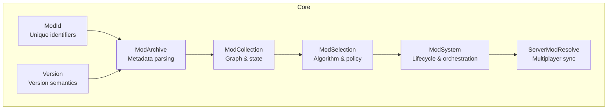
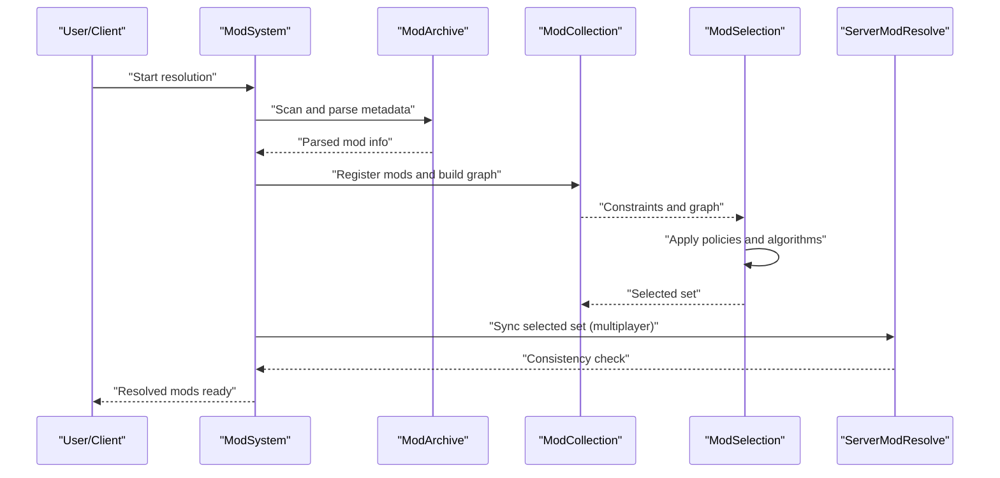
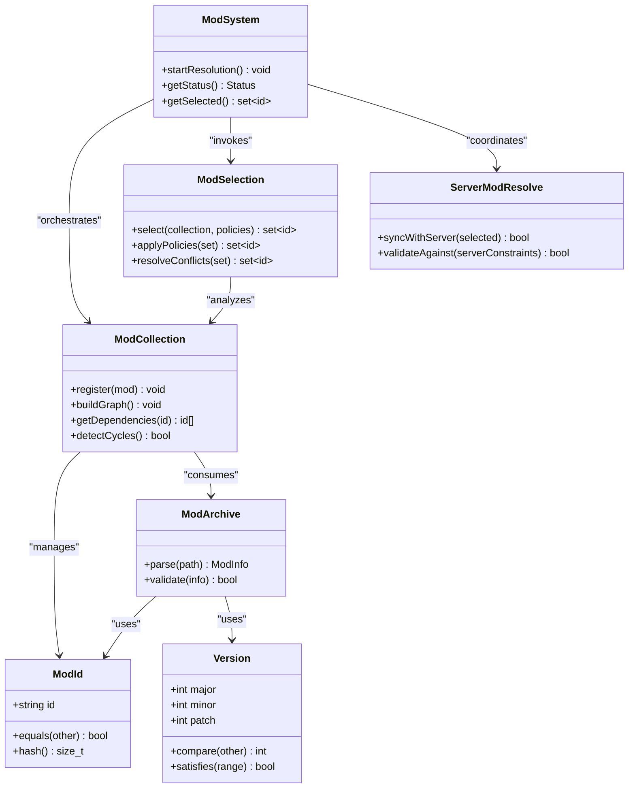
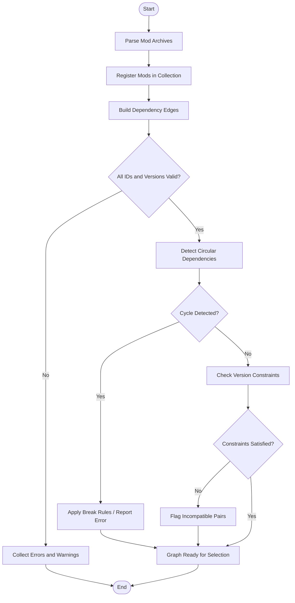

# Dependency Resolution and Conflict Handling

<cite>
**Referenced Files in This Document**
- [ModCollection.hpp](file://engine/Poseidon/Core/ModCollection.hpp)
- [ModCollection.cpp](file://engine/Poseidon/Core/ModCollection.cpp)
- [ModSelection.hpp](file://engine/Poseidon/Core/ModSelection.hpp)
- [ModSelection.cpp](file://engine/Poseidon/Core/ModSelection.cpp)
- [ModSystem.hpp](file://engine/Poseidon/Core/ModSystem.hpp)
- [ModSystem.cpp](file://engine/Poseidon/Core/ModSystem.cpp)
- [ModId.hpp](file://engine/Poseidon/Core/ModId.hpp)
- [ModId.cpp](file://engine/Poseidon/Core/ModId.cpp)
- [Version.hpp](file://engine/Poseidon/Core/Version.hpp)
- [Version.cpp](file://engine/Poseidon/Core/Version.cpp)
- [ModArchive.hpp](file://engine/Poseidon/Core/ModArchive.hpp)
- [ModArchive.cpp](file://engine/Poseidon/Core/ModArchive.cpp)
- [ServerModResolve.hpp](file://engine/Poseidon/Core/ServerModResolve.hpp)
- [ServerModResolve.cpp](file://engine/Poseidon/Core/ServerModResolve.cpp)
</cite>

## Table of Contents
1. [Introduction](#introduction)
2. [Project Structure](#project-structure)
3. [Core Components](#core-components)
4. [Architecture Overview](#architecture-overview)
5. [Detailed Component Analysis](#detailed-component-analysis)
6. [Dependency Analysis](#dependency-analysis)
7. [Performance Considerations](#performance-considerations)
8. [Troubleshooting Guide](#troubleshooting-guide)
9. [Conclusion](#conclusion)

## Introduction
This document explains the mod dependency resolution system used by the engine to analyze addon metadata, resolve dependencies, detect conflicts, and select optimal addon combinations. It covers the ModSelection algorithm, priority systems, conflict resolution strategies, version compatibility checking, circular dependency detection, and graceful failure handling. Practical guidance is provided for defining addon dependencies in metadata files, implementing custom conflict resolution logic, and debugging dependency issues. Performance considerations for large mod collections and caching strategies are also addressed.

## Project Structure
The dependency resolution system lives primarily under the Core module of the Poseidon engine. Key components include:
- Mod identification and versioning
- Mod archive parsing and metadata extraction
- Collection management and dependency graph construction
- Selection algorithm and conflict resolution
- Server-side resolution coordination

**Diagram sources**
- [ModId.hpp](file://engine/Poseidon/Core/ModId.hpp)
- [Version.hpp](file://engine/Poseidon/Core/Version.hpp)
- [ModArchive.hpp](file://engine/Poseidon/Core/ModArchive.hpp)
- [ModCollection.hpp](file://engine/Poseidon/Core/ModCollection.hpp)
- [ModSelection.hpp](file://engine/Poseidon/Core/ModSelection.hpp)
- [ModSystem.hpp](file://engine/Poseidon/Core/ModSystem.hpp)
- [ServerModResolve.hpp](file://engine/Poseidon/Core/ServerModResolve.hpp)

**Section sources**
- [ModCollection.hpp](file://engine/Poseidon/Core/ModCollection.hpp)
- [ModSelection.hpp](file://engine/Poseidon/Core/ModSelection.hpp)
- [ModSystem.hpp](file://engine/Poseidon/Core/ModSystem.hpp)
- [ModId.hpp](file://engine/Poseidon/Core/ModId.hpp)
- [Version.hpp](file://engine/Poseidon/Core/Version.hpp)
- [ModArchive.hpp](file://engine/Poseidon/Core/ModArchive.hpp)
- [ServerModResolve.hpp](file://engine/Poseidon/Core/ServerModResolve.hpp)

## Core Components
- ModId: Represents a unique mod identifier used across the system for consistent referencing.
- Version: Encodes version semantics and supports comparison and compatibility checks.
- ModArchive: Parses addon archives to extract metadata such as name, version, dependencies, and flags.
- ModCollection: Maintains the set of discovered mods, builds the dependency graph, and tracks selection state.
- ModSelection: Implements the algorithm to choose compatible addon combinations based on constraints and policies.
- ModSystem: Orchestrates discovery, loading, resolution, and lifecycle events for mods.
- ServerModResolve: Coordinates resolution between client and server to ensure consistent mod sets in multiplayer.

**Section sources**
- [ModId.hpp](file://engine/Poseidon/Core/ModId.hpp)
- [Version.hpp](file://engine/Poseidon/Core/Version.hpp)
- [ModArchive.hpp](file://engine/Poseidon/Core/ModArchive.hpp)
- [ModCollection.hpp](file://engine/Poseidon/Core/ModCollection.hpp)
- [ModSelection.hpp](file://engine/Poseidon/Core/ModSelection.hpp)
- [ModSystem.hpp](file://engine/Poseidon/Core/ModSystem.hpp)
- [ServerModResolve.hpp](file://engine/Poseidon/Core/ServerModResolve.hpp)

## Architecture Overview
The resolution pipeline proceeds through discovery, parsing, graph construction, constraint evaluation, and selection. The following sequence diagram maps the typical flow from scanning addons to producing a resolved set.

**Diagram sources**
- [ModSystem.cpp](file://engine/Poseidon/Core/ModSystem.cpp)
- [ModArchive.cpp](file://engine/Poseidon/Core/ModArchive.cpp)
- [ModCollection.cpp](file://engine/Poseidon/Core/ModCollection.cpp)
- [ModSelection.cpp](file://engine/Poseidon/Core/ModSelection.cpp)
- [ServerModResolve.cpp](file://engine/Poseidon/Core/ServerModResolve.cpp)

## Detailed Component Analysis

### Mod Identification and Versioning
- ModId provides stable identifiers for addons, enabling consistent dependency references across archives and sessions.
- Version defines semantic versioning behavior, including comparisons and compatibility ranges used during resolution.

Key responsibilities:
- Normalize and compare identifiers and versions
- Provide utilities for range matching and equality checks

**Section sources**
- [ModId.hpp](file://engine/Poseidon/Core/ModId.hpp)
- [ModId.cpp](file://engine/Poseidon/Core/ModId.cpp)
- [Version.hpp](file://engine/Poseidon/Core/Version.hpp)
- [Version.cpp](file://engine/Poseidon/Core/Version.cpp)

### Metadata Parsing and Extraction
- ModArchive reads addon archives to extract metadata fields such as title, author, version, dependencies, and optional flags.
- Parsing must handle malformed or missing metadata gracefully and produce a normalized representation for downstream processing.

Responsibilities:
- Validate required metadata fields
- Convert raw strings into structured types (e.g., Version, ModId)
- Surface errors without aborting the entire scan

**Section sources**
- [ModArchive.hpp](file://engine/Poseidon/Core/ModArchive.hpp)
- [ModArchive.cpp](file://engine/Poseidon/Core/ModArchive.cpp)

### Dependency Graph Construction and Management
- ModCollection maintains the registry of mods and constructs a directed graph where edges represent dependencies.
- It tracks selection state (selected, deselected, pending) and exposes queries for validation and diagnostics.

Responsibilities:
- Register parsed mods
- Build and update dependency graph
- Detect cycles and unsupported relationships
- Provide iteration over selected and unselected mods

**Section sources**
- [ModCollection.hpp](file://engine/Poseidon/Core/ModCollection.hpp)
- [ModCollection.cpp](file://engine/Poseidon/Core/ModCollection.cpp)

### Selection Algorithm and Policy Engine
- ModSelection implements the core algorithm to determine an optimal combination of mods that satisfies all constraints.
- Policies define priorities, tie-breaking rules, and conflict resolution strategies.

Algorithm highlights:
- Constraint satisfaction over the dependency graph
- Iterative pruning of incompatible options
- Preference ordering based on declared priorities and heuristics
- Backtracking when necessary to find a feasible solution

Policy hooks:
- Custom comparators for equal-priority mods
- Override rules for known incompatibilities
- Exclusion lists for user or server-enforced selections

**Section sources**
- [ModSelection.hpp](file://engine/Poseidon/Core/ModSelection.hpp)
- [ModSelection.cpp](file://engine/Poseidon/Core/ModSelection.cpp)

### Orchestration and Lifecycle
- ModSystem coordinates discovery, parsing, resolution, and runtime activation of mods.
- It exposes APIs for starting/stopping resolution, querying status, and integrating with UI or server flows.

Responsibilities:
- Initialize subsystems (archives, collection, selector)
- Manage progress and error reporting
- Integrate with multiplayer synchronization via ServerModResolve

**Section sources**
- [ModSystem.hpp](file://engine/Poseidon/Core/ModSystem.hpp)
- [ModSystem.cpp](file://engine/Poseidon/Core/ModSystem.cpp)

### Multiplayer Coordination
- ServerModResolve ensures that clients and servers agree on the final mod set before mission start.
- It validates client selections against server constraints and resolves discrepancies deterministically.

Responsibilities:
- Exchange selected sets and constraints
- Apply server overrides and fallbacks
- Report mismatches and enforce consistency

**Section sources**
- [ServerModResolve.hpp](file://engine/Poseidon/Core/ServerModResolve.hpp)
- [ServerModResolve.cpp](file://engine/Poseidon/Core/ServerModResolve.cpp)

#### Class Relationships

**Diagram sources**
- [ModId.hpp](file://engine/Poseidon/Core/ModId.hpp)
- [Version.hpp](file://engine/Poseidon/Core/Version.hpp)
- [ModArchive.hpp](file://engine/Poseidon/Core/ModArchive.hpp)
- [ModCollection.hpp](file://engine/Poseidon/Core/ModCollection.hpp)
- [ModSelection.hpp](file://engine/Poseidon/Core/ModSelection.hpp)
- [ModSystem.hpp](file://engine/Poseidon/Core/ModSystem.hpp)
- [ServerModResolve.hpp](file://engine/Poseidon/Core/ServerModResolve.hpp)

## Dependency Analysis
The dependency graph is constructed from parsed metadata and validated for correctness. The following flowchart outlines the key steps in building and validating the graph, including cycle detection and constraint checks.

**Diagram sources**
- [ModCollection.cpp](file://engine/Poseidon/Core/ModCollection.cpp)
- [ModArchive.cpp](file://engine/Poseidon/Core/ModArchive.cpp)
- [Version.cpp](file://engine/Poseidon/Core/Version.cpp)

**Section sources**
- [ModCollection.cpp](file://engine/Poseidon/Core/ModCollection.cpp)
- [ModArchive.cpp](file://engine/Poseidon/Core/ModArchive.cpp)
- [Version.cpp](file://engine/Poseidon/Core/Version.cpp)

## Performance Considerations
- Graph construction complexity scales with the number of mods and dependencies; avoid redundant scans by caching parsed metadata.
- Use incremental updates when only a subset of mods changes to minimize recomputation.
- Prefer hash-based lookups for ID and version matching to reduce overhead.
- Defer expensive operations (e.g., deep validation) until after initial filtering.
- For large collections, consider parallelizing archive parsing while maintaining thread safety for shared structures.

[No sources needed since this section provides general guidance]

## Troubleshooting Guide
Common issues and how to address them:
- Missing or invalid metadata: Ensure required fields exist and conform to expected formats. Inspect parse logs for specific failures.
- Circular dependencies: Identify cycles using graph analysis tools and adjust dependency declarations or introduce override rules.
- Version incompatibility: Verify version ranges and constraints; update dependent mods or relax constraints if appropriate.
- Conflicts not resolved: Review policy definitions and priority settings; add explicit exclusion rules for known conflicts.
- Multiplayer mismatches: Confirm server constraints match client expectations; use synchronization logs to pinpoint differences.

Debugging tips:
- Enable detailed logging in ModArchive and ModCollection to trace parsing and graph-building steps.
- Export the dependency graph for external inspection.
- Use unit tests to validate edge cases like empty graphs, single-mod scenarios, and complex cycles.

**Section sources**
- [ModArchive.cpp](file://engine/Poseidon/Core/ModArchive.cpp)
- [ModCollection.cpp](file://engine/Poseidon/Core/ModCollection.cpp)
- [ModSelection.cpp](file://engine/Poseidon/Core/ModSelection.cpp)
- [ServerModResolve.cpp](file://engine/Poseidon/Core/ServerModResolve.cpp)

## Conclusion
The dependency resolution system combines robust metadata parsing, efficient graph management, and a flexible selection algorithm to deliver reliable addon combinations. By adhering to clear metadata conventions, leveraging version semantics, and applying well-defined policies, developers can manage complex mod ecosystems with confidence. Proper debugging practices and performance optimizations ensure scalability and stability even with large collections.

[No sources needed since this section summarizes without analyzing specific files]