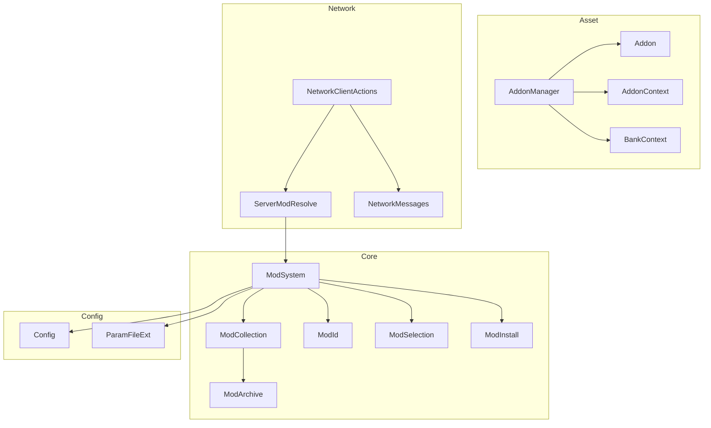
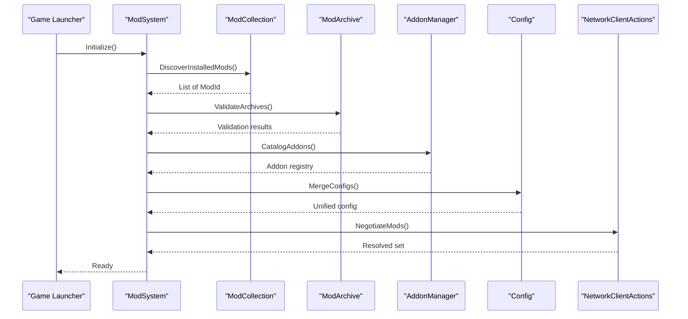
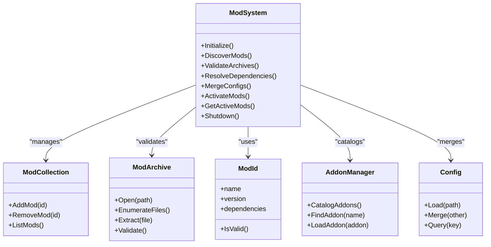
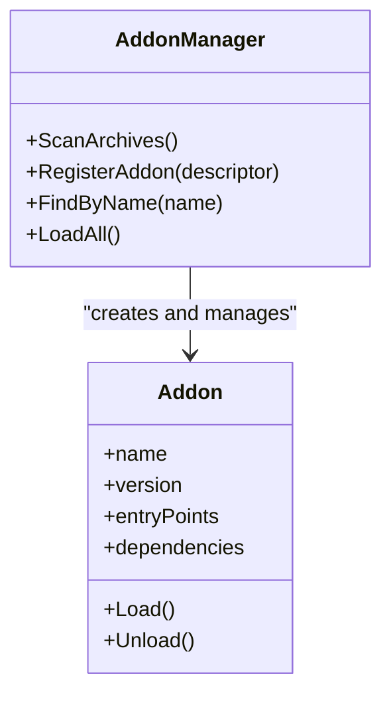
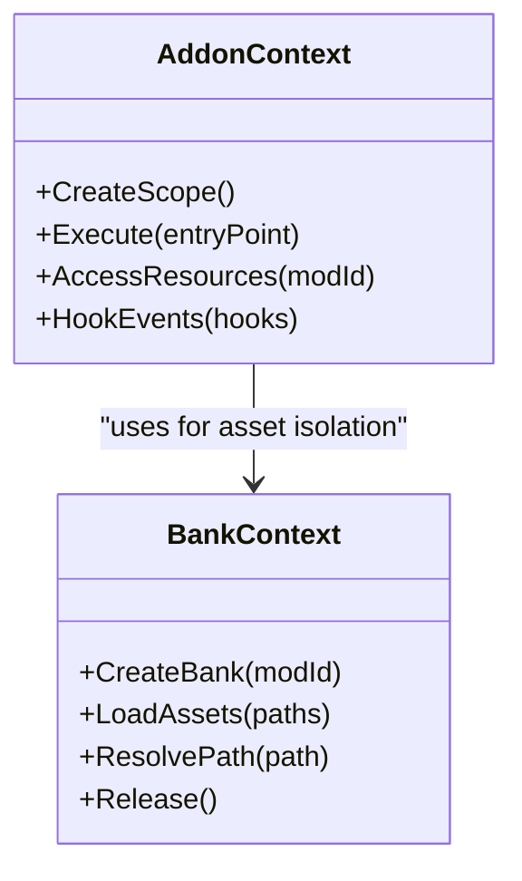
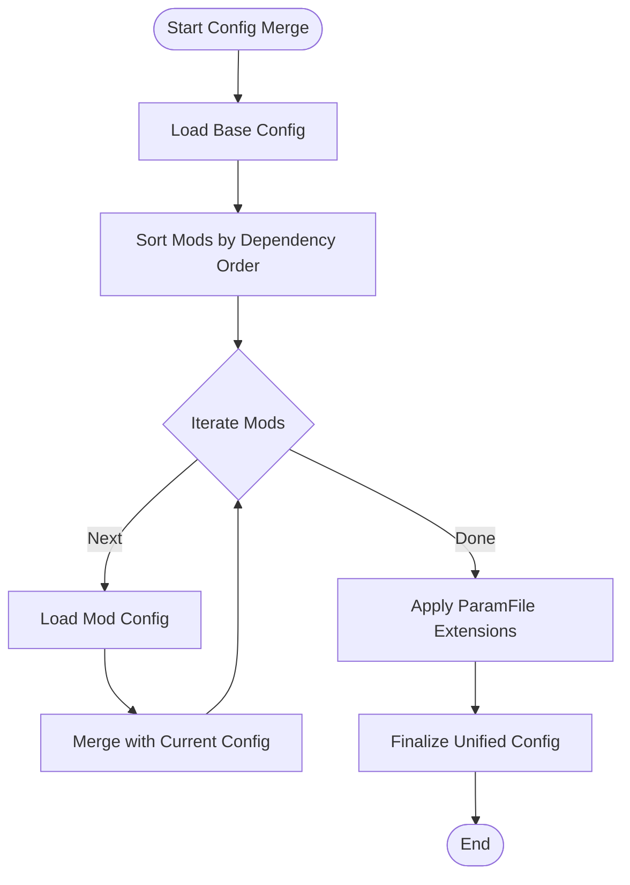
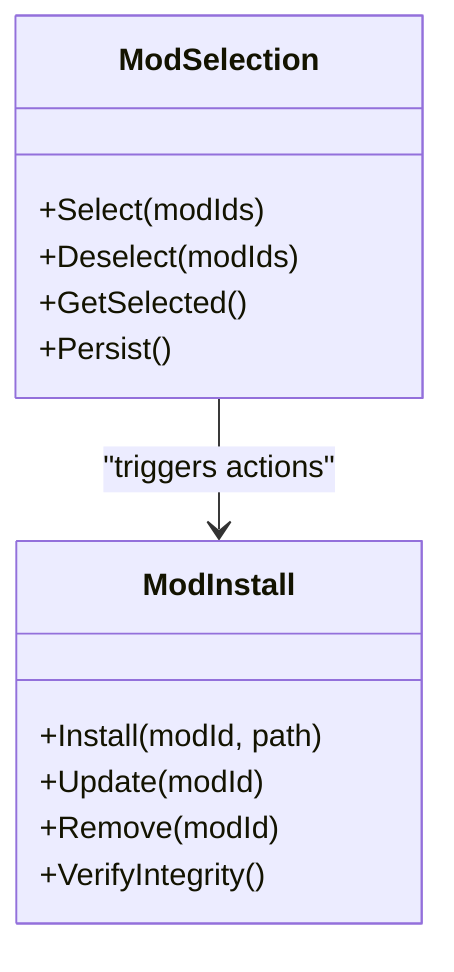
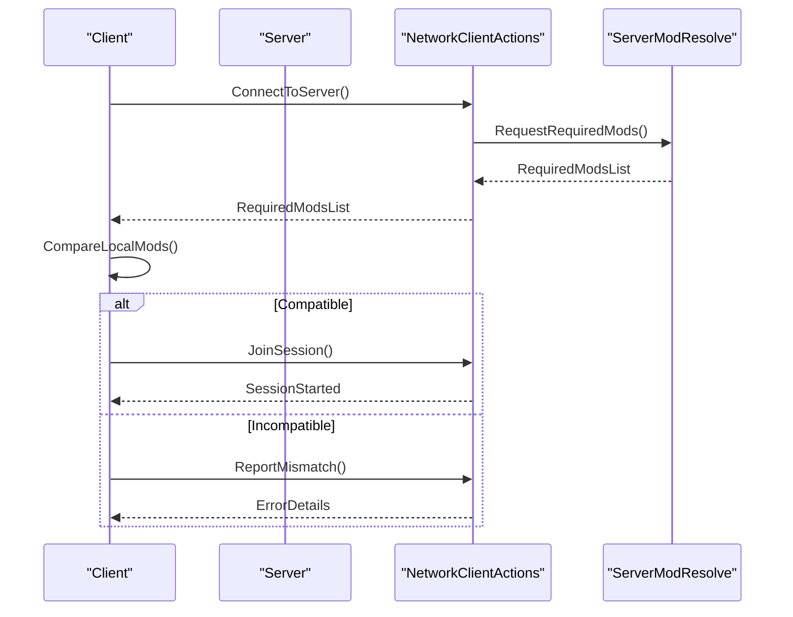
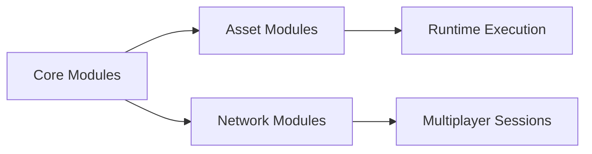

# Mod Architecture

<cite>
**Referenced Files in This Document**
- [ModSystem.hpp](file://engine/Poseidon/Core/ModSystem.hpp)
- [ModSystem.cpp](file://engine/Poseidon/Core/ModSystem.cpp)
- [ModCollection.hpp](file://engine/Poseidon/Core/ModCollection.hpp)
- [ModCollection.cpp](file://engine/Poseidon/Core/ModCollection.cpp)
- [ModArchive.hpp](file://engine/Poseidon/Core/ModArchive.hpp)
- [ModArchive.cpp](file://engine/Poseidon/Core/ModArchive.cpp)
- [ModId.hpp](file://engine/Poseidon/Core/ModId.hpp)
- [ModId.cpp](file://engine/Poseidon/Core/ModId.cpp)
- [ModInstall.hpp](file://engine/Poseidon/Core/ModInstall.hpp)
- [ModInstall.cpp](file://engine/Poseidon/Core/ModInstall.cpp)
- [ModSelection.hpp](file://engine/Poseidon/Core/ModSelection.hpp)
- [ModSelection.cpp](file://engine/Poseidon/Core/ModSelection.cpp)
- [ServerModResolve.hpp](file://engine/Poseidon/Core/ServerModResolve.hpp)
- [ServerModResolve.cpp](file://engine/Poseidon/Core/ServerModResolve.cpp)
- [Addon.hpp](file://engine/Poseidon/Asset/Addon/Addon.hpp)
- [Addon.cpp](file://engine/Poseidon/Asset/Addon/Addon.cpp)
- [AddonManager.hpp](file://engine/Poseidon/Asset/Addon/AddonManager.hpp)
- [AddonManager.cpp](file://engine/Poseidon/Asset/Addon/AddonManager.cpp)
- [AddonContext.hpp](file://engine/Poseidon/Asset/Addon/AddonContext.hpp)
- [AddonContext.cpp](file://engine/Poseidon/Asset/Addon/AddonContext.cpp)
- [BankContext.hpp](file://engine/Poseidon/Asset/BankContext.hpp)
- [BankContext.cpp](file://engine/Poseidon/Asset/BankContext.cpp)
- [Config.hpp](file://engine/Poseidon/Core/Config/Config.hpp)
- [Config.cpp](file://engine/Poseidon/Core/Config/Config.cpp)
- [ParamFileExt.hpp](file://engine/Poseidon/IO/ParamFileExt.hpp)
- [ParamFileExt.cpp](file://engine/Poseidon/IO/ParamFileExt.cpp)
- [NetworkClientActions.cpp](file://engine/Poseidon/Network/NetworkClientActions.cpp)
- [NetworkMessages.hpp](file://engine/Poseidon/Network/NetworkMessages.hpp)
</cite>

## Table of Contents
1. [Introduction](#introduction)
2. [Project Structure](#project-structure)
3. [Core Components](#core-components)
4. [Architecture Overview](#architecture-overview)
5. [Detailed Component Analysis](#detailed-component-analysis)
6. [Dependency Analysis](#dependency-analysis)
7. [Performance Considerations](#performance-considerations)
8. [Troubleshooting Guide](#troubleshooting-guide)
9. [Conclusion](#conclusion)
10. [Appendices](#appendices)

## Introduction
This document explains the mod architecture and addon system, focusing on how game modifications are discovered, validated, resolved, loaded, and executed in isolated contexts. It covers:
- AddonSystem implementation for loading, validating, and managing mods
- AddonContext and BankContext for isolated execution environments
- Mod dependency resolution, configuration merging, and asset priority systems
- Practical guidance for creating custom addons, implementing validation rules, and handling conflicts
- Security considerations, sandboxing techniques, and performance impact of mod loading

## Project Structure
The mod system spans several engine subsystems:
- Core mod management (IDs, archives, collections, selection, installation)
- Asset-level addon discovery and context isolation
- Configuration merging and param file extensions
- Network-side mod resolution for multiplayer sessions

**Diagram sources**
- [ModSystem.hpp](file://engine/Poseidon/Core/ModSystem.hpp)
- [ModCollection.hpp](file://engine/Poseidon/Core/ModCollection.hpp)
- [ModArchive.hpp](file://engine/Poseidon/Core/ModArchive.hpp)
- [ModId.hpp](file://engine/Poseidon/Core/ModId.hpp)
- [ModSelection.hpp](file://engine/Poseidon/Core/ModSelection.hpp)
- [ModInstall.hpp](file://engine/Poseidon/Core/ModInstall.hpp)
- [AddonManager.hpp](file://engine/Poseidon/Asset/Addon/AddonManager.hpp)
- [Addon.hpp](file://engine/Poseidon/Asset/Addon/Addon.hpp)
- [AddonContext.hpp](file://engine/Poseidon/Asset/Addon/AddonContext.hpp)
- [BankContext.hpp](file://engine/Poseidon/Asset/BankContext.hpp)
- [Config.hpp](file://engine/Poseidon/Core/Config/Config.hpp)
- [ParamFileExt.hpp](file://engine/Poseidon/IO/ParamFileExt.hpp)
- [ServerModResolve.hpp](file://engine/Poseidon/Core/ServerModResolve.hpp)
- [NetworkClientActions.cpp](file://engine/Poseidon/Network/NetworkClientActions.cpp)
- [NetworkMessages.hpp](file://engine/Poseidon/Network/NetworkMessages.hpp)

**Section sources**
- [ModSystem.hpp](file://engine/Poseidon/Core/ModSystem.hpp)
- [ModCollection.hpp](file://engine/Poseidon/Core/ModCollection.hpp)
- [ModArchive.hpp](file://engine/Poseidon/Core/ModArchive.hpp)
- [ModId.hpp](file://engine/Poseidon/Core/ModId.hpp)
- [ModSelection.hpp](file://engine/Poseidon/Core/ModSelection.hpp)
- [ModInstall.hpp](file://engine/Poseidon/Core/ModInstall.hpp)
- [AddonManager.hpp](file://engine/Poseidon/Asset/Addon/AddonManager.hpp)
- [Addon.hpp](file://engine/Poseidon/Asset/Addon/Addon.hpp)
- [AddonContext.hpp](file://engine/Poseidon/Asset/Addon/AddonContext.hpp)
- [BankContext.hpp](file://engine/Poseidon/Asset/BankContext.hpp)
- [Config.hpp](file://engine/Poseidon/Core/Config/Config.hpp)
- [ParamFileExt.hpp](file://engine/Poseidon/IO/ParamFileExt.hpp)
- [ServerModResolve.hpp](file://engine/Poseidon/Core/ServerModResolve.hpp)
- [NetworkClientActions.cpp](file://engine/Poseidon/Network/NetworkClientActions.cpp)
- [NetworkMessages.hpp](file://engine/Poseidon/Network/NetworkMessages.hpp)

## Core Components
- ModSystem: Orchestrates lifecycle of mods including discovery, validation, dependency resolution, configuration merging, and activation order.
- ModCollection: Maintains the set of installed mods and their metadata.
- ModArchive: Represents a mod archive (e.g., PBO), providing file enumeration and extraction.
- ModId: Unique identifier for mods with versioning and compatibility metadata.
- ModSelection: User or server-driven selection of active mods per session.
- ModInstall: Handles installation, updates, and removal of mods.
- AddonManager: Discovers and manages addons within archives, exposing them to the engine.
- AddonContext: Provides an isolated execution environment for addon code and assets.
- BankContext: Isolates asset bank operations per mod to avoid cross-mod interference.
- Config and ParamFileExt: Provide configuration parsing and extension mechanisms used by mods.
- ServerModResolve: Resolves required mods for multiplayer consistency.
- NetworkClientActions and NetworkMessages: Coordinate mod negotiation and synchronization over the network.

**Section sources**
- [ModSystem.cpp](file://engine/Poseidon/Core/ModSystem.cpp)
- [ModCollection.cpp](file://engine/Poseidon/Core/ModCollection.cpp)
- [ModArchive.cpp](file://engine/Poseidon/Core/ModArchive.cpp)
- [ModId.cpp](file://engine/Poseidon/Core/ModId.cpp)
- [ModSelection.cpp](file://engine/Poseidon/Core/ModSelection.cpp)
- [ModInstall.cpp](file://engine/Poseidon/Core/ModInstall.cpp)
- [AddonManager.cpp](file://engine/Poseidon/Asset/Addon/AddonManager.cpp)
- [Addon.cpp](file://engine/Poseidon/Asset/Addon/Addon.cpp)
- [AddonContext.cpp](file://engine/Poseidon/Asset/Addon/AddonContext.cpp)
- [BankContext.cpp](file://engine/Poseidon/Asset/BankContext.cpp)
- [Config.cpp](file://engine/Poseidon/Core/Config/Config.cpp)
- [ParamFileExt.cpp](file://engine/Poseidon/IO/ParamFileExt.cpp)
- [ServerModResolve.cpp](file://engine/Poseidon/Core/ServerModResolve.cpp)
- [NetworkClientActions.cpp](file://engine/Poseidon/Network/NetworkClientActions.cpp)
- [NetworkMessages.hpp](file://engine/Poseidon/Network/NetworkMessages.hpp)

## Architecture Overview
The mod architecture separates concerns into discovery, validation, resolution, loading, and execution:
- Discovery scans archives and catalogs addons.
- Validation enforces structural and semantic constraints.
- Resolution computes dependency graphs and load order.
- Loading merges configurations and prepares assets.
- Execution runs addon code within isolated contexts.

**Diagram sources**
- [ModSystem.cpp](file://engine/Poseidon/Core/ModSystem.cpp)
- [ModCollection.cpp](file://engine/Poseidon/Core/ModCollection.cpp)
- [ModArchive.cpp](file://engine/Poseidon/Core/ModArchive.cpp)
- [AddonManager.cpp](file://engine/Poseidon/Asset/Addon/AddonManager.cpp)
- [Config.cpp](file://engine/Poseidon/Core/Config/Config.cpp)
- [NetworkClientActions.cpp](file://engine/Poseidon/Network/NetworkClientActions.cpp)

## Detailed Component Analysis

### ModSystem
Responsibilities:
- Orchestrate mod lifecycle: discovery, validation, resolution, configuration merge, activation.
- Maintain global state for active mods and their contexts.
- Integrate with network layer for multiplayer mod negotiation.

Key behaviors:
- Iterates through installed archives to build a consistent mod list.
- Validates archives for integrity and expected structure.
- Computes dependency graph and resolves conflicts using version constraints.
- Merges configuration files from multiple mods according to priority rules.
- Exposes APIs to start/stop mods and query status.

**Diagram sources**
- [ModSystem.hpp](file://engine/Poseidon/Core/ModSystem.hpp)
- [ModCollection.hpp](file://engine/Poseidon/Core/ModCollection.hpp)
- [ModArchive.hpp](file://engine/Poseidon/Core/ModArchive.hpp)
- [ModId.hpp](file://engine/Poseidon/Core/ModId.hpp)
- [AddonManager.hpp](file://engine/Poseidon/Asset/Addon/AddonManager.hpp)
- [Config.hpp](file://engine/Poseidon/Core/Config/Config.hpp)

**Section sources**
- [ModSystem.cpp](file://engine/Poseidon/Core/ModSystem.cpp)
- [ModCollection.cpp](file://engine/Poseidon/Core/ModCollection.cpp)
- [ModArchive.cpp](file://engine/Poseidon/Core/ModArchive.cpp)
- [ModId.cpp](file://engine/Poseidon/Core/ModId.cpp)
- [AddonManager.cpp](file://engine/Poseidon/Asset/Addon/AddonManager.cpp)
- [Config.cpp](file://engine/Poseidon/Core/Config/Config.cpp)

### AddonManager and Addon
Responsibilities:
- Discover addons inside archives based on conventions and manifests.
- Build an internal registry mapping addon names to descriptors.
- Provide lookup and loading interfaces for engines and scripts.

Key behaviors:
- Scans known addon entry points and metadata files.
- Validates addon structure and dependencies.
- Registers addons with the engine subsystems that consume them.

**Diagram sources**
- [AddonManager.hpp](file://engine/Poseidon/Asset/Addon/AddonManager.hpp)
- [Addon.hpp](file://engine/Poseidon/Asset/Addon/Addon.hpp)

**Section sources**
- [AddonManager.cpp](file://engine/Poseidon/Asset/Addon/AddonManager.cpp)
- [Addon.cpp](file://engine/Poseidon/Asset/Addon/Addon.cpp)

### AddonContext and BankContext
Responsibilities:
- Isolate execution environments for addons to prevent cross-mod interference.
- Provide separate namespaces for configuration, assets, and runtime state.

Key behaviors:
- AddonContext encapsulates script execution scope, resource access, and event hooks.
- BankContext isolates asset banks so each mod’s assets do not collide with others.
- Context switching ensures safe transitions between mods during initialization and runtime.

**Diagram sources**
- [AddonContext.hpp](file://engine/Poseidon/Asset/Addon/AddonContext.hpp)
- [BankContext.hpp](file://engine/Poseidon/Asset/BankContext.hpp)

**Section sources**
- [AddonContext.cpp](file://engine/Poseidon/Asset/Addon/AddonContext.cpp)
- [BankContext.cpp](file://engine/Poseidon/Asset/BankContext.cpp)

### Configuration Merging and ParamFile Extensions
Responsibilities:
- Parse and merge configuration files from multiple mods following priority rules.
- Extend parameter file processing to support mod-specific directives.

Key behaviors:
- Load base configs first, then overlay mod configs in dependency order.
- Resolve conflicts deterministically based on declared priorities.
- Apply param file extensions to enable mod-specific features.

**Diagram sources**
- [Config.hpp](file://engine/Poseidon/Core/Config/Config.hpp)
- [ParamFileExt.hpp](file://engine/Poseidon/IO/ParamFileExt.hpp)

**Section sources**
- [Config.cpp](file://engine/Poseidon/Core/Config/Config.cpp)
- [ParamFileExt.cpp](file://engine/Poseidon/IO/ParamFileExt.cpp)

### Mod Selection and Installation
Responsibilities:
- Manage user-selected sets of mods per session.
- Handle installation, updates, and removal workflows.

Key behaviors:
- Validate selected mods against availability and compatibility.
- Persist selections across sessions.
- Coordinate with archive manager to install/update content.

**Diagram sources**
- [ModSelection.hpp](file://engine/Poseidon/Core/ModSelection.hpp)
- [ModInstall.hpp](file://engine/Poseidon/Core/ModInstall.hpp)

**Section sources**
- [ModSelection.cpp](file://engine/Poseidon/Core/ModSelection.cpp)
- [ModInstall.cpp](file://engine/Poseidon/Core/ModInstall.cpp)

### Server Mod Resolution and Network Coordination
Responsibilities:
- Ensure all clients have compatible mods before joining a multiplayer session.
- Exchange mod lists and versions to resolve differences.

Key behaviors:
- Server publishes required mods and constraints.
- Clients compare local sets with server requirements.
- Network messages coordinate negotiation and error reporting.

**Diagram sources**
- [ServerModResolve.hpp](file://engine/Poseidon/Core/ServerModResolve.hpp)
- [NetworkClientActions.cpp](file://engine/Poseidon/Network/NetworkClientActions.cpp)
- [NetworkMessages.hpp](file://engine/Poseidon/Network/NetworkMessages.hpp)

**Section sources**
- [ServerModResolve.cpp](file://engine/Poseidon/Core/ServerModResolve.cpp)
- [NetworkClientActions.cpp](file://engine/Poseidon/Network/NetworkClientActions.cpp)
- [NetworkMessages.hpp](file://engine/Poseidon/Network/NetworkMessages.hpp)

## Dependency Analysis
The mod system exhibits clear separation of concerns:
- Core modules depend on low-level utilities (archive handling, IDs).
- Asset modules depend on core for metadata and selection.
- Network modules depend on core for resolution logic and messaging.

**Diagram sources**
- [ModSystem.hpp](file://engine/Poseidon/Core/ModSystem.hpp)
- [AddonManager.hpp](file://engine/Poseidon/Asset/Addon/AddonManager.hpp)
- [ServerModResolve.hpp](file://engine/Poseidon/Core/ServerModResolve.hpp)

**Section sources**
- [ModSystem.cpp](file://engine/Poseidon/Core/ModSystem.cpp)
- [AddonManager.cpp](file://engine/Poseidon/Asset/Addon/AddonManager.cpp)
- [ServerModResolve.cpp](file://engine/Poseidon/Core/ServerModResolve.cpp)

## Performance Considerations
- Archive scanning should be cached to avoid repeated I/O.
- Configuration merging can be incremental; avoid full re-merge on minor changes.
- Addon loading should be lazy where possible to reduce startup time.
- Asset bank isolation introduces overhead; batch asset loads when feasible.
- Network negotiation should minimize message size and frequency.

[No sources needed since this section provides general guidance]

## Troubleshooting Guide
Common issues and resolutions:
- Invalid archive structure: Verify manifest presence and checksums.
- Dependency conflicts: Review version constraints and update incompatible mods.
- Configuration overrides: Check priority order and ensure no circular references.
- Asset collisions: Confirm unique paths and namespace isolation via BankContext.
- Multiplayer mismatches: Align client and server mod lists; use negotiation logs.

**Section sources**
- [ModArchive.cpp](file://engine/Poseidon/Core/ModArchive.cpp)
- [ModId.cpp](file://engine/Poseidon/Core/ModId.cpp)
- [Config.cpp](file://engine/Poseidon/Core/Config/Config.cpp)
- [BankContext.cpp](file://engine/Poseidon/Asset/BankContext.cpp)
- [ServerModResolve.cpp](file://engine/Poseidon/Core/ServerModResolve.cpp)

## Conclusion
The mod architecture provides a robust foundation for discovering, validating, resolving, and executing game modifications safely and efficiently. By leveraging isolated contexts and strict dependency management, it enables a rich ecosystem of addons while maintaining stability and security. Proper configuration merging and asset prioritization ensure predictable behavior across diverse mod combinations.

[No sources needed since this section summarizes without analyzing specific files]

## Appendices

### Creating Custom Addons
Steps:
- Define addon metadata and entry points.
- Place assets under mod-specific paths.
- Implement configuration files with appropriate priority.
- Register with AddonManager during discovery.

[No sources needed since this section provides general guidance]

### Implementing Mod Validation Rules
Guidelines:
- Enforce required files and structures.
- Validate version compatibility and dependency constraints.
- Reject unsafe operations in sandboxed contexts.

[No sources needed since this section provides general guidance]

### Handling Mod Conflicts
Strategies:
- Declare explicit dependencies and exclusions.
- Use configuration merging rules to resolve overlaps.
- Provide fallback assets and configs for compatibility.

[No sources needed since this section provides general guidance]

### Security Considerations and Sandboxing
Recommendations:
- Restrict filesystem and network access within AddonContext.
- Validate all inputs and outputs from mod code.
- Monitor resource usage and enforce limits.

[No sources needed since this section provides general guidance]