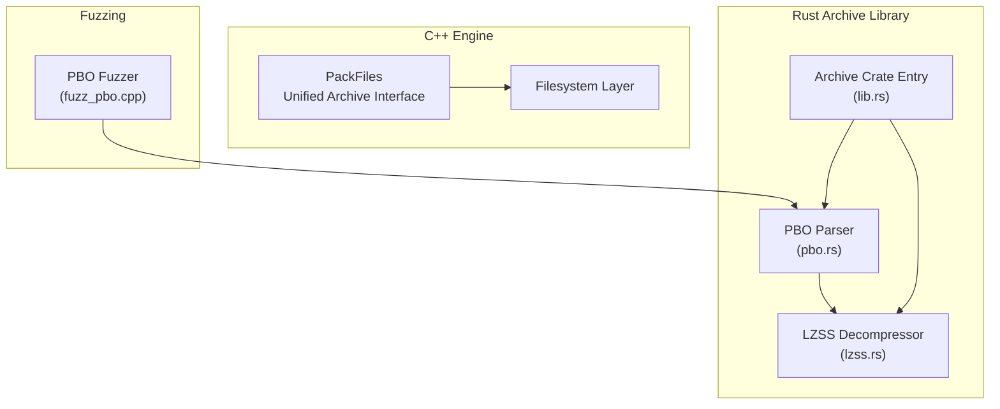
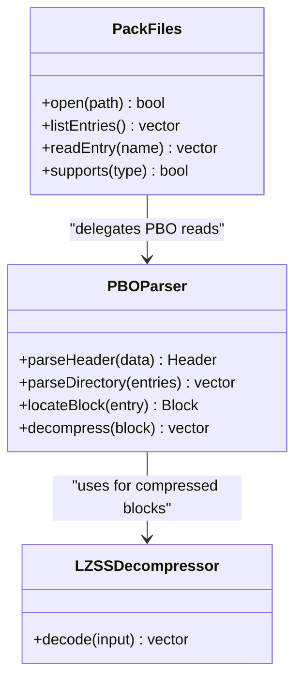
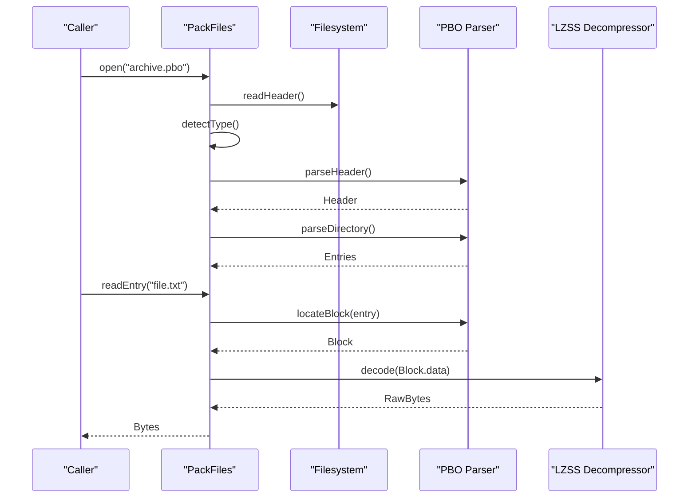
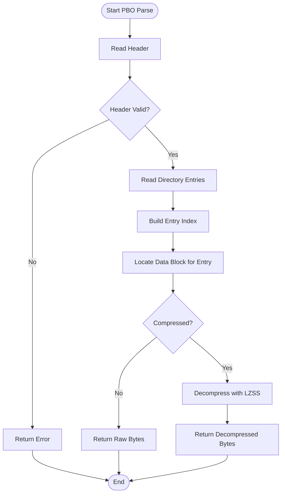
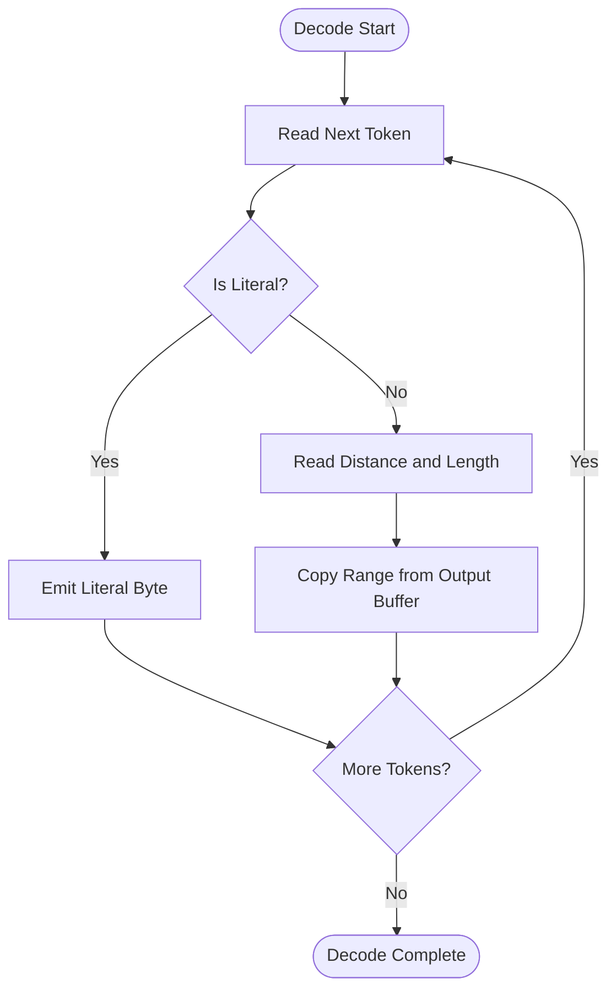
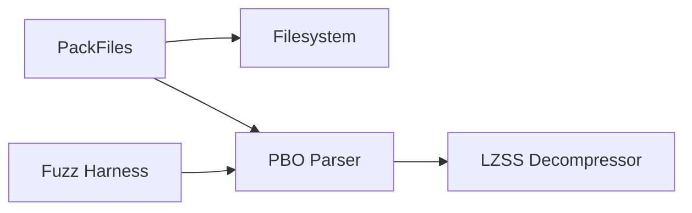

# Archive Formats and PBO Handling

<cite>
**Referenced Files in This Document**
- [PackFiles.hpp](file://engine/Poseidon/IO/PackFiles.hpp)
- [PackFiles.cpp](file://engine/Poseidon/IO/PackFiles.cpp)
- [pbo.rs](file://mserver/Archive/src/pbo.rs)
- [lzss.rs](file://mserver/Archive/src/lzss.rs)
- [lib.rs](file://mserver/Archive/src/lib.rs)
- [fuzz_pbo.cpp](file://apps/fuzzers/Fuzzer/fuzz_pbo.cpp)
</cite>

## Table of Contents
1. [Introduction](#introduction)
2. [Project Structure](#project-structure)
3. [Core Components](#core-components)
4. [Architecture Overview](#architecture-overview)
5. [Detailed Component Analysis](#detailed-component-analysis)
6. [Dependency Analysis](#dependency-analysis)
7. [Performance Considerations](#performance-considerations)
8. [Troubleshooting Guide](#troubleshooting-guide)
9. [Conclusion](#conclusion)

## Introduction
This document explains how the pack file system handles archive formats, with a focus on the PBO (Pack Binary Object) format used by the engine. It covers the binary structure of PBO files, directory entries, data blocks, compression handling (including LZSS), and the unified access interface provided by the PackFiles class. It also includes guidance for creating custom archive formats, implementing decompression handlers, optimizing parsing performance, and addressing error handling, version compatibility, and security considerations when processing untrusted archives.

## Project Structure
The archive handling spans both C++ and Rust components:
- C++ layer provides the high-level PackFiles abstraction over multiple archive types and exposes a unified API to the rest of the engine.
- Rust layer implements PBO parsing and LZSS decompression used by server-side tooling and fuzzing harnesses.
- Fuzzing harnesses exercise PBO parsing paths to improve robustness.

**Diagram sources**
- [PackFiles.hpp](file://engine/Poseidon/IO/PackFiles.hpp)
- [PackFiles.cpp](file://engine/Poseidon/IO/PackFiles.cpp)
- [pbo.rs](file://mserver/Archive/src/pbo.rs)
- [lzss.rs](file://mserver/Archive/src/lzss.rs)
- [lib.rs](file://mserver/Archive/src/lib.rs)
- [fuzz_pbo.cpp](file://apps/fuzzers/Fuzzer/fuzz_pbo.cpp)

**Section sources**
- [PackFiles.hpp](file://engine/Poseidon/IO/PackFiles.hpp)
- [PackFiles.cpp](file://engine/Poseidon/IO/PackFiles.cpp)
- [pbo.rs](file://mserver/Archive/src/pbo.rs)
- [lzss.rs](file://mserver/Archive/src/lzss.rs)
- [lib.rs](file://mserver/Archive/src/lib.rs)
- [fuzz_pbo.cpp](file://apps/fuzzers/Fuzzer/fuzz_pbo.cpp)

## Core Components
- PackFiles (C++): Provides a unified interface to open archives, enumerate entries, and read file contents across different archive types. It abstracts differences between formats and exposes consistent APIs for consumers.
- PBO parser (Rust): Implements parsing of PBO headers, directory entries, and data blocks, including support for compressed content via LZSS.
- LZSS decompressor (Rust): Decodes LZSS-compressed streams into raw bytes.
- Fuzz harness (C++): Exercises PBO parsing code paths to detect crashes and undefined behavior.

Key responsibilities:
- Detect archive type from file header or extension.
- Parse directory structures and locate data blocks.
- Stream or cache decompressed content as needed.
- Validate inputs and handle malformed archives safely.

**Section sources**
- [PackFiles.hpp](file://engine/Poseidon/IO/PackFiles.hpp)
- [PackFiles.cpp](file://engine/Poseidon/IO/PackFiles.cpp)
- [pbo.rs](file://mserver/Archive/src/pbo.rs)
- [lzss.rs](file://mserver/Archive/src/lzss.rs)
- [fuzz_pbo.cpp](file://apps/fuzzers/Fuzzer/fuzz_pbo.cpp)

## Architecture Overview
The system separates concerns between the high-level archive abstraction and format-specific implementations:
- PackFiles acts as a facade over multiple backends.
- PBO parsing is implemented in Rust for safety and performance, exposed to the broader system where needed.
- LZSS decompression is isolated in a dedicated module to keep decoding logic focused and testable.

**Diagram sources**
- [PackFiles.hpp](file://engine/Poseidon/IO/PackFiles.hpp)
- [PackFiles.cpp](file://engine/Poseidon/IO/PackFiles.cpp)
- [pbo.rs](file://mserver/Archive/src/pbo.rs)
- [lzss.rs](file://mserver/Archive/src/lzss.rs)

## Detailed Component Analysis

### PackFiles Unified Interface
PackFiles centralizes archive operations:
- Open and validate archive files based on signatures or extensions.
- Enumerate entries and provide random access to file contents.
- Abstract compression details so callers do not need to know about specific codecs.

Typical usage flow:
- Initialize PackFiles with a path.
- Check supported types and open the archive.
- List entries and read desired files.
- Handle errors gracefully for corrupted or unsupported archives.

**Diagram sources**
- [PackFiles.hpp](file://engine/Poseidon/IO/PackFiles.hpp)
- [PackFiles.cpp](file://engine/Poseidon/IO/PackFiles.cpp)
- [pbo.rs](file://mserver/Archive/src/pbo.rs)
- [lzss.rs](file://mserver/Archive/src/lzss.rs)

**Section sources**
- [PackFiles.hpp](file://engine/Poseidon/IO/PackFiles.hpp)
- [PackFiles.cpp](file://engine/Poseidon/IO/PackFiles.cpp)

### PBO Binary Structure and Parsing
PBO files consist of:
- A header indicating format version and metadata.
- A directory containing entries for each file, including names, offsets, sizes, and flags.
- Data blocks storing uncompressed or compressed content referenced by directory entries.

Parsing steps:
- Read and validate the header fields.
- Iterate through directory entries to build an index.
- For each entry, resolve the data block location and size.
- If flagged as compressed, use the appropriate decompressor.

**Diagram sources**
- [pbo.rs](file://mserver/Archive/src/pbo.rs)
- [lzss.rs](file://mserver/Archive/src/lzss.rs)

**Section sources**
- [pbo.rs](file://mserver/Archive/src/pbo.rs)

### LZSS Compression and Decompression
LZSS is a dictionary-based compression algorithm that replaces repeated sequences with references to earlier data. The implementation:
- Encodes input into a stream of literals and length-distance pairs.
- Decodes by reconstructing output using literal bytes and copying from previously decoded data according to distance and length values.

Key aspects:
- Fixed window size for lookback.
- Bit-packing efficiency for encoding.
- Robust error handling for malformed bitstreams.

**Diagram sources**
- [lzss.rs](file://mserver/Archive/src/lzss.rs)

**Section sources**
- [lzss.rs](file://mserver/Archive/src/lzss.rs)

### Creating Custom Archive Formats
To add a new archive type:
- Define a parser that can identify the format via magic bytes or extension.
- Implement directory parsing and block resolution similar to PBO.
- Integrate with PackFiles by registering the new backend.
- Provide a decompression handler if the format uses compression.

Steps:
- Add detection logic in the archive opener.
- Implement entry enumeration and data retrieval.
- Ensure error paths are well-defined for malformed inputs.
- Add tests and fuzzing coverage.

**Section sources**
- [PackFiles.hpp](file://engine/Poseidon/IO/PackFiles.hpp)
- [PackFiles.cpp](file://engine/Poseidon/IO/PackFiles.cpp)
- [pbo.rs](file://mserver/Archive/src/pbo.rs)

### Implementing Decompression Handlers
A decompression handler should:
- Accept compressed input and produce raw bytes.
- Validate input integrity before decoding.
- Handle partial reads and streaming scenarios efficiently.
- Expose clear error codes for invalid or truncated streams.

Integration points:
- Register the handler with the archive parser.
- Use it within block resolution when the compressed flag is set.
- Ensure memory bounds are respected during decoding.

**Section sources**
- [lzss.rs](file://mserver/Archive/src/lzss.rs)
- [pbo.rs](file://mserver/Archive/src/pbo.rs)

### Optimizing Archive Parsing Performance
Recommendations:
- Cache directory indexes after initial parsing.
- Use memory-mapped I/O for large archives to reduce copies.
- Parallelize independent decompressions where safe.
- Minimize allocations by reusing buffers.
- Avoid unnecessary validation passes; batch checks.

**Section sources**
- [PackFiles.cpp](file://engine/Poseidon/IO/PackFiles.cpp)
- [pbo.rs](file://mserver/Archive/src/pbo.rs)

## Dependency Analysis
The archive subsystem has clear boundaries:
- PackFiles depends on filesystem primitives and delegates format-specific logic to parsers.
- PBO parser depends on LZSS decompression for compressed blocks.
- Fuzz harness depends on PBO parser to exercise edge cases.

**Diagram sources**
- [PackFiles.hpp](file://engine/Poseidon/IO/PackFiles.hpp)
- [PackFiles.cpp](file://engine/Poseidon/IO/PackFiles.cpp)
- [pbo.rs](file://mserver/Archive/src/pbo.rs)
- [lzss.rs](file://mserver/Archive/src/lzss.rs)
- [fuzz_pbo.cpp](file://apps/fuzzers/Fuzzer/fuzz_pbo.cpp)

**Section sources**
- [PackFiles.hpp](file://engine/Poseidon/IO/PackFiles.hpp)
- [PackFiles.cpp](file://engine/Poseidon/IO/PackFiles.cpp)
- [pbo.rs](file://mserver/Archive/src/pbo.rs)
- [lzss.rs](file://mserver/Archive/src/lzss.rs)
- [fuzz_pbo.cpp](file://apps/fuzzers/Fuzzer/fuzz_pbo.cpp)

## Performance Considerations
- Prefer streaming decompression for large files to avoid loading entire archives into memory.
- Use efficient buffer management to reduce allocation overhead.
- Leverage parallelism carefully; ensure thread-safety for shared state.
- Profile hot paths in directory parsing and decompression loops.
- Consider lazy loading of entries and blocks on demand.

[No sources needed since this section provides general guidance]

## Troubleshooting Guide
Common issues and resolutions:
- Corrupted headers: Validate magic numbers and version fields early; return clear errors.
- Malformed directory entries: Check offsets and sizes against file bounds; abort on inconsistency.
- Decompression failures: Verify token validity and buffer lengths; log detailed diagnostics.
- Unsupported archive types: Ensure detection logic covers all expected signatures.

Debugging tips:
- Enable verbose logging for parsing steps.
- Use fuzzing harnesses to reproduce edge cases.
- Validate intermediate structures against known-good samples.

**Section sources**
- [fuzz_pbo.cpp](file://apps/fuzzers/Fuzzer/fuzz_pbo.cpp)
- [pbo.rs](file://mserver/Archive/src/pbo.rs)
- [lzss.rs](file://mserver/Archive/src/lzss.rs)

## Conclusion
The archive handling system provides a robust, extensible foundation for managing multiple archive formats with a focus on PBO and LZSS. PackFiles offers a unified interface, while format-specific parsers and decompressors encapsulate complexity. By following best practices for performance, error handling, and security, developers can safely process untrusted archives and extend support to new formats with minimal friction.

[No sources needed since this section summarizes without analyzing specific files]