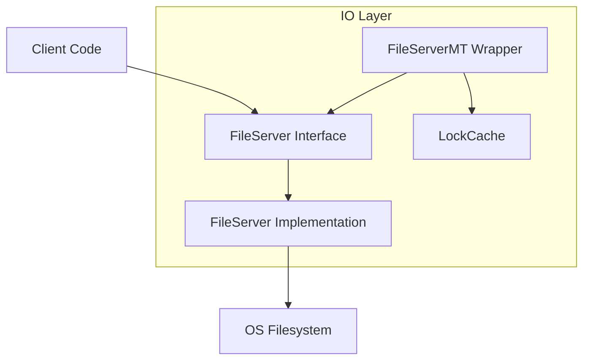
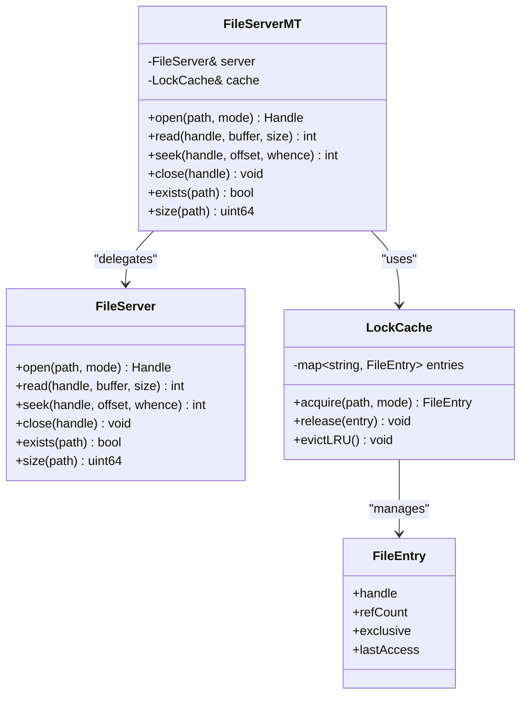
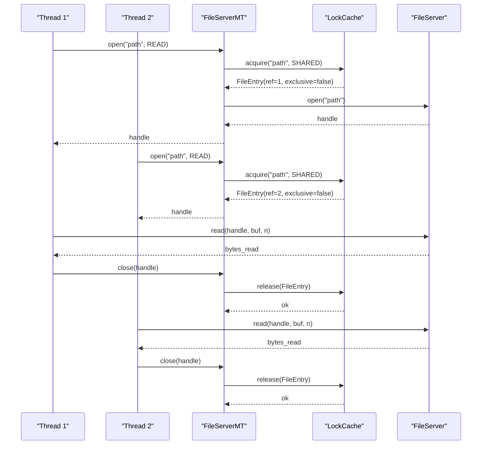
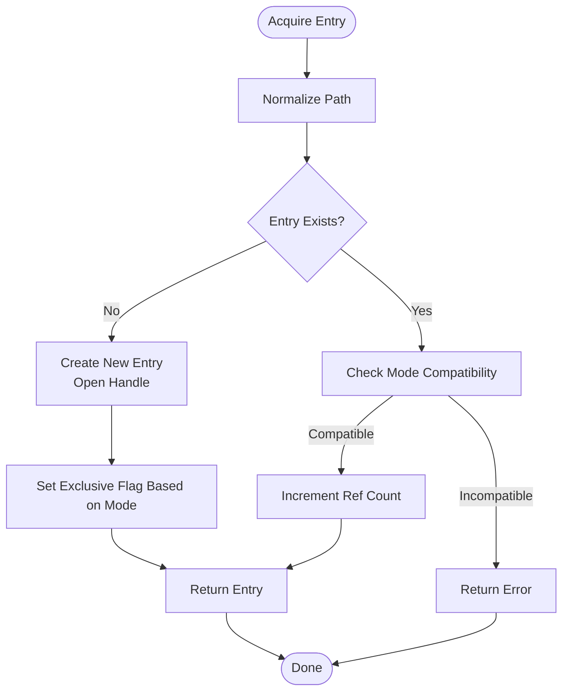
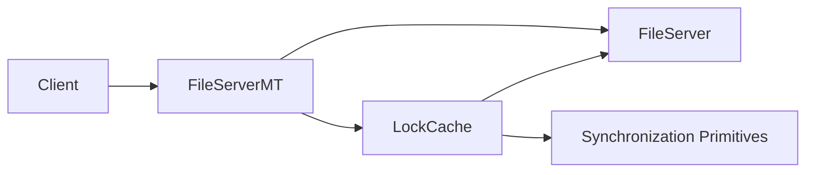

# File Server Architecture

<cite>
**Referenced Files in This Document**
- [FileServer.hpp](file://engine/Poseidon/IO/FileServer.hpp)
- [FileServer.cpp](file://engine/Poseidon/IO/FileServer.cpp)
- [FileServerMT.hpp](file://engine/Poseidon/IO/FileServerMT.hpp)
- [LockCache.hpp](file://engine/Poseidon/IO/LockCache.hpp)
- [LockCache.cpp](file://engine/Poseidon/IO/LockCache.cpp)
</cite>

## Table of Contents
1. [Introduction](#introduction)
2. [Project Structure](#project-structure)
3. [Core Components](#core-components)
4. [Architecture Overview](#architecture-overview)
5. [Detailed Component Analysis](#detailed-component-analysis)
6. [Dependency Analysis](#dependency-analysis)
7. [Performance Considerations](#performance-considerations)
8. [Troubleshooting Guide](#troubleshooting-guide)
9. [Conclusion](#conclusion)
10. [Appendices](#appendices)

## Introduction
This document explains the file server abstraction layer that provides a unified interface for reading files across different backends and threading models. It focuses on:
- The FileServer interface design and its multi-threaded variant FileServerMT
- The lock cache mechanism used to coordinate concurrent access to the same file
- Thread safety strategies and resource management patterns
- Practical guidance for implementing custom file servers, handling locking scenarios, and optimizing I/O under high concurrency
- Performance tuning, memory usage optimization, and debugging techniques

## Project Structure
The file server abstraction lives under engine/Poseidon/IO and is composed of:
- A single-threaded interface and implementation (FileServer)
- A multi-threaded wrapper (FileServerMT)
- A lock cache (LockCache) that coordinates exclusive or shared access to file handles

**Diagram sources**
- [FileServer.hpp](file://engine/Poseidon/IO/FileServer.hpp)
- [FileServer.cpp](file://engine/Poseidon/IO/FileServer.cpp)
- [FileServerMT.hpp](file://engine/Poseidon/IO/FileServerMT.hpp)
- [LockCache.hpp](file://engine/Poseidon/IO/LockCache.hpp)
- [LockCache.cpp](file://engine/Poseidon/IO/LockCache.cpp)

**Section sources**
- [FileServer.hpp](file://engine/Poseidon/IO/FileServer.hpp)
- [FileServer.cpp](file://engine/Poseidon/IO/FileServer.cpp)
- [FileServerMT.hpp](file://engine/Poseidon/IO/FileServerMT.hpp)
- [LockCache.hpp](file://engine/Poseidon/IO/LockCache.hpp)
- [LockCache.cpp](file://engine/Poseidon/IO/LockCache.cpp)

## Core Components
- FileServer: Defines the core operations for opening, reading, seeking, and closing files. It is designed for single-threaded use or when external synchronization is provided by callers.
- FileServerMT: A thread-safe facade over FileServer that serializes or coordinates concurrent requests using LockCache.
- LockCache: Manages per-file locks and caches open file descriptors/handles to avoid contention and redundant opens. It supports both exclusive and shared modes depending on operation semantics.

Key responsibilities:
- Uniform API for file operations regardless of backend
- Safe concurrent access via locking and handle caching
- Efficient resource lifecycle management with RAII-style ownership

**Section sources**
- [FileServer.hpp](file://engine/Poseidon/IO/FileServer.hpp)
- [FileServer.cpp](file://engine/Poseidon/IO/FileServer.cpp)
- [FileServerMT.hpp](file://engine/Poseidon/IO/FileServerMT.hpp)
- [LockCache.hpp](file://engine/Poseidon/IO/LockCache.hpp)
- [LockCache.cpp](file://engine/Poseidon/IO/LockCache.cpp)

## Architecture Overview
The architecture separates concerns between the abstract interface, concrete implementations, and concurrency control:
- Callers interact with FileServer or FileServerMT
- FileServerMT uses LockCache to ensure safe concurrent access
- Underlying storage backends are encapsulated behind FileServer implementations

**Diagram sources**
- [FileServer.hpp](file://engine/Poseidon/IO/FileServer.hpp)
- [FileServerMT.hpp](file://engine/Poseidon/IO/FileServerMT.hpp)
- [LockCache.hpp](file://engine/Poseidon/IO/LockCache.hpp)

**Section sources**
- [FileServer.hpp](file://engine/Poseidon/IO/FileServer.hpp)
- [FileServerMT.hpp](file://engine/Poseidon/IO/FileServerMT.hpp)
- [LockCache.hpp](file://engine/Poseidon/IO/LockCache.hpp)

## Detailed Component Analysis

### FileServer Interface and Implementation
Responsibilities:
- Define a minimal set of operations for file I/O
- Provide consistent error handling and return codes
- Support common modes such as read-only and seekable streams

Design considerations:
- Single-threaded contract: callers must not share handles across threads unless they provide their own synchronization
- Resource ownership: handles are opaque and managed by the caller after open/close
- Backend flexibility: multiple implementations can be swapped without changing client code

Typical usage pattern:
- Open a file once per logical stream
- Read/Seek as needed
- Close when done to release resources

**Section sources**
- [FileServer.hpp](file://engine/Poseidon/IO/FileServer.hpp)
- [FileServer.cpp](file://engine/Poseidon/IO/FileServer.cpp)

### FileServerMT Multi-threaded Wrapper
Responsibilities:
- Provide thread-safe access to FileServer operations
- Coordinate concurrent reads/writes through LockCache
- Ensure correct ordering and isolation of operations

Concurrency model:
- Uses LockCache to acquire appropriate locks per path
- Supports shared locks for read-only operations and exclusive locks for write or mutating operations
- Serializes conflicting operations while allowing parallel non-conflicting ones

Error propagation:
- Wraps underlying errors from FileServer into a consistent error model
- Ensures locks are released even on exceptions or early returns

**Section sources**
- [FileServerMT.hpp](file://engine/Poseidon/IO/FileServerMT.hpp)

### LockCache Mechanism
Responsibilities:
- Maintain per-path state including open handles, reference counts, and lock modes
- Implement eviction policies to bound memory usage
- Provide atomic acquisition and release of locks

Data structures:
- Per-entry metadata includes handle, ref count, exclusive flag, and last-access time
- Map from normalized path to entry for O(1) lookup

Algorithm highlights:
- Acquire: check if an entry exists; if so, increment ref count and validate mode compatibility; otherwise create new entry and open handle
- Release: decrement ref count; if zero, close handle and remove entry
- Eviction: periodically evict least-recently-used entries to prevent unbounded growth

Thread safety:
- Internal synchronization ensures safe concurrent updates to the map and entries
- External synchronization is not required for LockCache itself

**Section sources**
- [LockCache.hpp](file://engine/Poseidon/IO/LockCache.hpp)
- [LockCache.cpp](file://engine/Poseidon/IO/LockCache.cpp)

### Sequence of a Concurrent Read

**Diagram sources**
- [FileServerMT.hpp](file://engine/Poseidon/IO/FileServerMT.hpp)
- [LockCache.hpp](file://engine/Poseidon/IO/LockCache.hpp)
- [FileServer.hpp](file://engine/Poseidon/IO/FileServer.hpp)

### Flowchart of Lock Acquisition and Release

**Diagram sources**
- [LockCache.hpp](file://engine/Poseidon/IO/LockCache.hpp)
- [LockCache.cpp](file://engine/Poseidon/IO/LockCache.cpp)

## Dependency Analysis
- FileServerMT depends on FileServer and LockCache
- LockCache depends on platform primitives for synchronization and filesystem utilities for path normalization
- Clients depend only on the public interfaces, enabling swapping of implementations

**Diagram sources**
- [FileServer.hpp](file://engine/Poseidon/IO/FileServer.hpp)
- [FileServerMT.hpp](file://engine/Poseidon/IO/FileServerMT.hpp)
- [LockCache.hpp](file://engine/Poseidon/IO/LockCache.hpp)

**Section sources**
- [FileServer.hpp](file://engine/Poseidon/IO/FileServer.hpp)
- [FileServerMT.hpp](file://engine/Poseidon/IO/FileServerMT.hpp)
- [LockCache.hpp](file://engine/Poseidon/IO/LockCache.hpp)

## Performance Considerations
- Minimize lock contention by batching reads and avoiding frequent open/close cycles
- Use shared locks for read-only paths to allow concurrent access
- Tune cache size and eviction thresholds based on workload characteristics
- Prefer sequential reads where possible to improve disk throughput
- Avoid unnecessary seeks; maintain read position when feasible
- Monitor memory usage of open handles and adjust LRU eviction policy accordingly

[No sources needed since this section provides general guidance]

## Troubleshooting Guide
Common issues and remedies:
- Deadlocks due to inconsistent lock ordering: ensure all paths acquire locks in a deterministic order and avoid nested locks
- Handle leaks: verify that every open has a corresponding close, even on error paths
- Excessive memory usage: inspect cache size and eviction behavior; consider reducing max entries or tightening TTLs
- Stale data: confirm that writers flush and close handles before readers expect updated content
- Platform-specific errors: validate path normalization and permissions; log underlying OS error codes

Debugging techniques:
- Enable verbose logging around open/read/seek/close and lock acquire/release
- Add metrics for cache hit rate, average latency, and eviction frequency
- Use sanitizers and thread tools to detect races and leaks during development

**Section sources**
- [LockCache.cpp](file://engine/Poseidon/IO/LockCache.cpp)
- [FileServerMT.hpp](file://engine/Poseidon/IO/FileServerMT.hpp)

## Conclusion
The file server abstraction layer provides a clean separation between I/O operations and concurrency control. FileServer defines a simple, single-threaded interface, while FileServerMT adds robust multi-threaded support via LockCache. By following the recommended patterns for locking, caching, and resource management, applications can achieve high concurrency and predictable performance. Extensibility is straightforward: implement new FileServer backends and integrate them through FileServerMT to benefit from built-in concurrency controls.

[No sources needed since this section summarizes without analyzing specific files]

## Appendices

### Implementing a Custom File Server
Steps:
- Implement the FileServer interface methods for your backend (e.g., virtual filesystem, archive, network store)
- Ensure consistent error codes and handle semantics
- Register or construct your implementation and pass it to FileServerMT

Best practices:
- Validate inputs and normalize paths consistently
- Handle partial reads/writes correctly
- Keep handles lightweight and avoid holding large buffers in memory

**Section sources**
- [FileServer.hpp](file://engine/Poseidon/IO/FileServer.hpp)
- [FileServer.cpp](file://engine/Poseidon/IO/FileServer.cpp)
- [FileServerMT.hpp](file://engine/Poseidon/IO/FileServerMT.hpp)

### Handling File Locking Scenarios
Guidelines:
- Use shared locks for read-only operations to maximize concurrency
- Use exclusive locks for writes or operations that mutate state
- Avoid long-held locks; perform heavy work outside critical sections
- Detect and report deadlocks or contention hotspots via metrics

**Section sources**
- [LockCache.hpp](file://engine/Poseidon/IO/LockCache.hpp)
- [LockCache.cpp](file://engine/Poseidon/IO/LockCache.cpp)

### Optimizing I/O for High-Concurrency Environments
Recommendations:
- Batch small reads into larger chunks when possible
- Pre-warm frequently accessed files by opening handles at startup
- Use asynchronous I/O where supported by the backend
- Profile and tune cache sizes based on observed working sets

[No sources needed since this section provides general guidance]

### Extending with Caching Layers
Approach:
- Wrap FileServer with a caching layer that stores recently accessed content in memory or disk
- Integrate with LockCache to avoid duplicate loads and ensure consistency
- Implement invalidation strategies for mutable content

**Section sources**
- [FileServer.hpp](file://engine/Poseidon/IO/FileServer.hpp)
- [LockCache.hpp](file://engine/Poseidon/IO/LockCache.hpp)