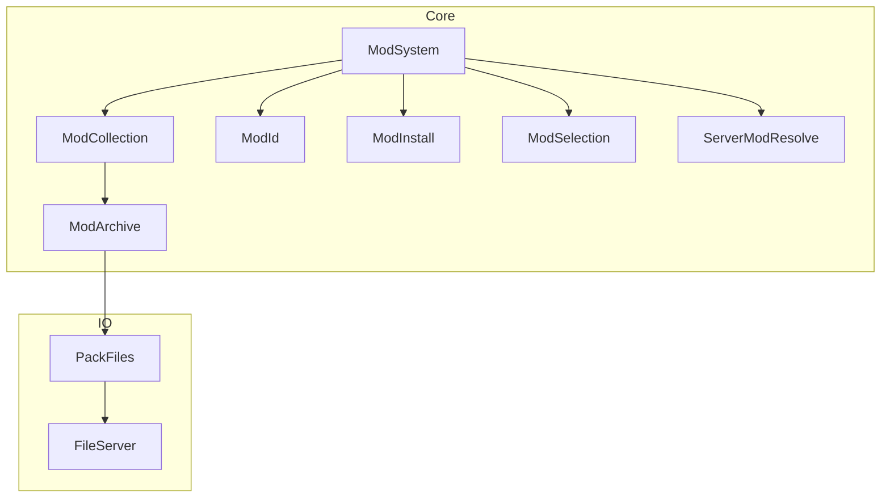
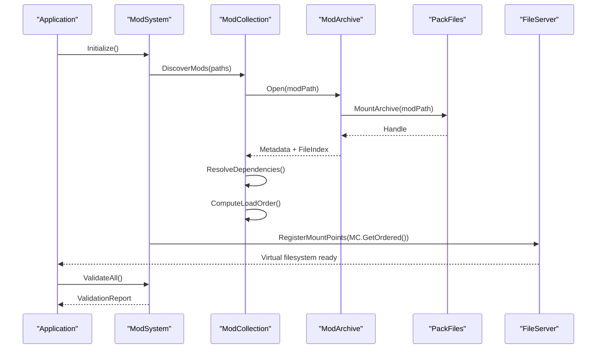
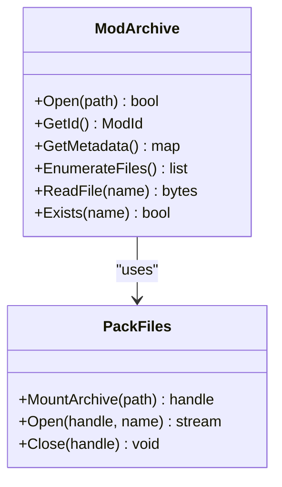
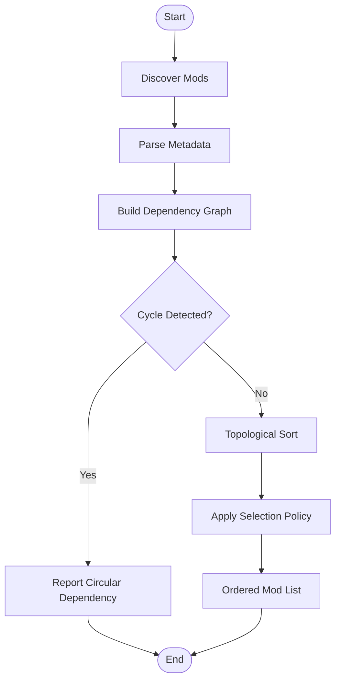
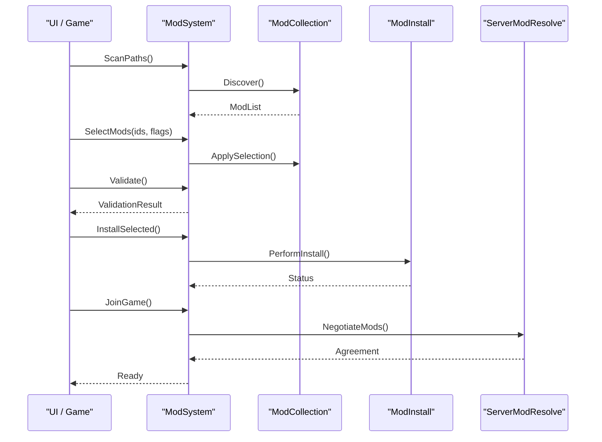
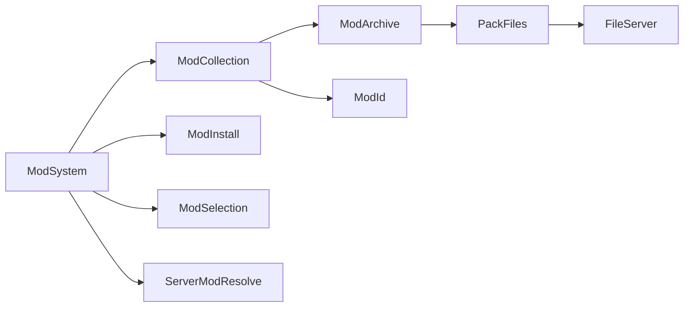

# Mod System Integration

<cite>
**Referenced Files in This Document**
- [ModArchive.hpp](file://engine/Poseidon/Core/ModArchive.hpp)
- [ModArchive.cpp](file://engine/Poseidon/Core/ModArchive.cpp)
- [ModCollection.hpp](file://engine/Poseidon/Core/ModCollection.hpp)
- [ModCollection.cpp](file://engine/Poseidon/Core/ModCollection.cpp)
- [ModSystem.hpp](file://engine/Poseidon/Core/ModSystem.hpp)
- [ModSystem.cpp](file://engine/Poseidon/Core/ModSystem.cpp)
- [ModId.hpp](file://engine/Poseidon/Core/ModId.hpp)
- [ModId.cpp](file://engine/Poseidon/Core/ModId.cpp)
- [ModInstall.hpp](file://engine/Poseidon/Core/ModInstall.hpp)
- [ModInstall.cpp](file://engine/Poseidon/Core/ModInstall.cpp)
- [ModSelection.hpp](file://engine/Poseidon/Core/ModSelection.hpp)
- [ModSelection.cpp](file://engine/Poseidon/Core/ModSelection.cpp)
- [ServerModResolve.hpp](file://engine/Poseidon/Core/ServerModResolve.hpp)
- [ServerModResolve.cpp](file://engine/Poseidon/Core/ServerModResolve.cpp)
- [PackFiles.hpp](file://engine/Poseidon/IO/PackFiles.hpp)
- [PackFiles.cpp](file://engine/Poseidon/IO/PackFiles.cpp)
- [FileServer.hpp](file://engine/Poseidon/IO/FileServer.hpp)
- [FileServer.cpp](file://engine/Poseidon/IO/FileServer.cpp)
- [mods-manymags.pbo](file://tests/fixtures/mods-manymags/@manymags/bin/)
- [workshop fixture mod](file://tests/fixtures/workshop/@wsfixture/)
</cite>

## Table of Contents
1. [Introduction](#introduction)
2. [Project Structure](#project-structure)
3. [Core Components](#core-components)
4. [Architecture Overview](#architecture-overview)
5. [Detailed Component Analysis](#detailed-component-analysis)
6. [Dependency Analysis](#dependency-analysis)
7. [Performance Considerations](#performance-considerations)
8. [Troubleshooting Guide](#troubleshooting-guide)
9. [Conclusion](#conclusion)
10. [Appendices](#appendices)

## Introduction
This document explains how the engine integrates mods with its pack file system. It focuses on:
- How individual mod archives are represented and accessed via ModArchive
- How multiple mods are organized, resolved for dependencies, and ordered via ModCollection
- The runtime ModSystem interface used to discover, load, validate, and manage mods
- Packaging standards, metadata handling, distribution mechanisms, and conflict resolution
- Practical guidance for creating custom loaders, implementing validation, and troubleshooting common issues

## Project Structure
The mod subsystem spans core engine modules and IO layers:
- Core mod management lives under engine/Poseidon/Core (ModArchive, ModCollection, ModSystem, ModId, ModInstall, ModSelection, ServerModResolve)
- Pack file integration is implemented under engine/Poseidon/IO (PackFiles, FileServer)
- Tests provide example mod packages and scenarios under tests/fixtures

**Diagram sources**
- [ModArchive.hpp](file://engine/Poseidon/Core/ModArchive.hpp)
- [ModCollection.hpp](file://engine/Poseidon/Core/ModCollection.hpp)
- [ModSystem.hpp](file://engine/Poseidon/Core/ModSystem.hpp)
- [PackFiles.hpp](file://engine/Poseidon/IO/PackFiles.hpp)
- [FileServer.hpp](file://engine/Poseidon/IO/FileServer.hpp)

**Section sources**
- [ModArchive.hpp](file://engine/Poseidon/Core/ModArchive.hpp)
- [ModCollection.hpp](file://engine/Poseidon/Core/ModCollection.hpp)
- [ModSystem.hpp](file://engine/Poseidon/Core/ModSystem.hpp)
- [PackFiles.hpp](file://engine/Poseidon/IO/PackFiles.hpp)
- [FileServer.hpp](file://engine/Poseidon/IO/FileServer.hpp)

## Core Components
- ModArchive: Represents a single mod archive (e.g., PBO). Provides access to files within the archive and exposes identifiers and metadata.
- ModCollection: Manages a set of mods, resolves dependencies, computes load order, and exposes an ordered view to consumers.
- ModSystem: Central runtime API for discovering mods, loading archives, validating them, resolving conflicts, and coordinating installation and selection.
- ModId: Canonical identifier for a mod, ensuring consistent matching across discovery, resolution, and network synchronization.
- ModInstall: Handles installation workflows, including verification and placement into the active game directory.
- ModSelection: Tracks which mods are enabled/disabled by the user or policy.
- ServerModResolve: Ensures server and clients agree on mod sets and versions before joining.

Key responsibilities:
- Archive abstraction over pack files
- Dependency graph construction and topological ordering
- Validation hooks and error reporting
- Distribution and update coordination

**Section sources**
- [ModArchive.hpp](file://engine/Poseidon/Core/ModArchive.hpp)
- [ModCollection.hpp](file://engine/Poseidon/Core/ModCollection.hpp)
- [ModSystem.hpp](file://engine/Poseidon/Core/ModSystem.hpp)
- [ModId.hpp](file://engine/Poseidon/Core/ModId.hpp)
- [ModInstall.hpp](file://engine/Poseidon/Core/ModInstall.hpp)
- [ModSelection.hpp](file://engine/Poseidon/Core/ModSelection.hpp)
- [ServerModResolve.hpp](file://engine/Poseidon/Core/ServerModResolve.hpp)

## Architecture Overview
The mod system composes archive access with collection-level logic and a unified runtime interface.

**Diagram sources**
- [ModSystem.cpp](file://engine/Poseidon/Core/ModSystem.cpp)
- [ModCollection.cpp](file://engine/Poseidon/Core/ModCollection.cpp)
- [ModArchive.cpp](file://engine/Poseidon/Core/ModArchive.cpp)
- [PackFiles.cpp](file://engine/Poseidon/IO/PackFiles.cpp)
- [FileServer.cpp](file://engine/Poseidon/IO/FileServer.cpp)

## Detailed Component Analysis

### ModArchive: Individual Mod Archives
Responsibilities:
- Wrap a single mod archive (PBO-like) and expose file enumeration and content access
- Provide mod identity and basic metadata extraction
- Integrate with PackFiles to mount and serve files efficiently

**Diagram sources**
- [ModArchive.hpp](file://engine/Poseidon/Core/ModArchive.hpp)
- [PackFiles.hpp](file://engine/Poseidon/IO/PackFiles.hpp)

Implementation notes:
- Use canonical paths and case-insensitive lookups where applicable
- Cache file indices for performance
- Surface errors consistently to callers

**Section sources**
- [ModArchive.hpp](file://engine/Poseidon/Core/ModArchive.hpp)
- [ModArchive.cpp](file://engine/Poseidon/Core/ModArchive.cpp)
- [PackFiles.hpp](file://engine/Poseidon/IO/PackFiles.hpp)
- [PackFiles.cpp](file://engine/Poseidon/IO/PackFiles.cpp)

### ModCollection: Organization, Dependencies, Load Order
Responsibilities:
- Maintain a registry of discovered mods
- Build dependency graphs from mod metadata
- Compute deterministic load order using topological sorting
- Expose ordered iteration and filtering

**Diagram sources**
- [ModCollection.cpp](file://engine/Poseidon/Core/ModCollection.cpp)
- [ModCollection.hpp](file://engine/Poseidon/Core/ModCollection.hpp)

Key behaviors:
- Deterministic ordering ensures reproducible behavior across platforms
- Conflict detection flags overlapping resources or incompatible versions
- Selection policy respects user preferences and constraints

**Section sources**
- [ModCollection.hpp](file://engine/Poseidon/Core/ModCollection.hpp)
- [ModCollection.cpp](file://engine/Poseidon/Core/ModCollection.cpp)

### ModSystem: Runtime Discovery, Loading, and Management
Responsibilities:
- Orchestrate discovery across configured search paths
- Manage lifecycle of ModArchive instances
- Coordinate validation, installation, and selection
- Provide APIs for UI and gameplay systems to query mod state

**Diagram sources**
- [ModSystem.cpp](file://engine/Poseidon/Core/ModSystem.cpp)
- [ModCollection.cpp](file://engine/Poseidon/Core/ModCollection.cpp)
- [ModInstall.cpp](file://engine/Poseidon/Core/ModInstall.cpp)
- [ServerModResolve.cpp](file://engine/Poseidon/Core/ServerModResolve.cpp)

Design highlights:
- Clear separation between discovery (ModCollection), lifecycle (ModSystem), and IO (PackFiles/FileServer)
- Extensible validation pipeline allows custom checks per mod type
- Network-aware resolution ensures consistency between server and clients

**Section sources**
- [ModSystem.hpp](file://engine/Poseidon/Core/ModSystem.hpp)
- [ModSystem.cpp](file://engine/Poseidon/Core/ModSystem.cpp)
- [ModCollection.hpp](file://engine/Poseidon/Core/ModCollection.hpp)
- [ModCollection.cpp](file://engine/Poseidon/Core/ModCollection.cpp)
- [ModInstall.hpp](file://engine/Poseidon/Core/ModInstall.hpp)
- [ModInstall.cpp](file://engine/Poseidon/Core/ModInstall.cpp)
- [ServerModResolve.hpp](file://engine/Poseidon/Core/ServerModResolve.hpp)
- [ServerModResolve.cpp](file://engine/Poseidon/Core/ServerModResolve.cpp)

### ModId: Canonical Identification
Responsibilities:
- Normalize and compare mod identities
- Support versioning and compatibility tags
- Ensure stable hashing for caching and networking

Usage patterns:
- Used throughout discovery, resolution, and network messages
- Enables deduplication and conflict detection

**Section sources**
- [ModId.hpp](file://engine/Poseidon/Core/ModId.hpp)
- [ModId.cpp](file://engine/Poseidon/Core/ModId.cpp)

### ModInstall: Installation Workflow
Responsibilities:
- Verify integrity and compatibility
- Place files into target directories respecting precedence rules
- Roll back on failure and report detailed errors

Operational flow:
- Pre-flight checks (disk space, permissions)
- Atomic operations where possible
- Post-install validation

**Section sources**
- [ModInstall.hpp](file://engine/Poseidon/Core/ModInstall.hpp)
- [ModInstall.cpp](file://engine/Poseidon/Core/ModInstall.cpp)

### ModSelection: Enabling and Disabling Mods
Responsibilities:
- Track user-selected states
- Merge with policy-driven selections (e.g., required base mods)
- Persist choices across sessions

Behavior:
- Supports profiles and presets
- Validates that selected sets are resolvable

**Section sources**
- [ModSelection.hpp](file://engine/Poseidon/Core/ModSelection.hpp)
- [ModSelection.cpp](file://engine/Poseidon/Core/ModSelection.cpp)

### ServerModResolve: Multiplayer Consistency
Responsibilities:
- Exchange mod manifests between server and clients
- Detect mismatches and propose resolutions
- Block join if critical incompatibilities exist

Flow:
- Server publishes required mods and versions
- Clients compute differences and request updates
- Final agreement recorded before session start

**Section sources**
- [ServerModResolve.hpp](file://engine/Poseidon/Core/ServerModResolve.hpp)
- [ServerModResolve.cpp](file://engine/Poseidon/Core/ServerModResolve.cpp)

### PackFiles and FileServer: Integration with Pack File System
Responsibilities:
- PackFiles mounts archives and provides efficient file access
- FileServer registers virtual mount points so assets resolve through mod overlays

Integration points:
- ModArchive uses PackFiles to open and read archived files
- ModCollection passes ordered mods to FileServer to establish precedence

**Section sources**
- [PackFiles.hpp](file://engine/Poseidon/IO/PackFiles.hpp)
- [PackFiles.cpp](file://engine/Poseidon/IO/PackFiles.cpp)
- [FileServer.hpp](file://engine/Poseidon/IO/FileServer.hpp)
- [FileServer.cpp](file://engine/Poseidon/IO/FileServer.cpp)

## Dependency Analysis
The mod system exhibits clear layering and minimal coupling:
- ModSystem orchestrates higher-level flows without direct IO details
- ModCollection depends on ModArchive and ModId
- ModArchive depends on PackFiles
- FileServer consumes ordered mod lists to build the virtual filesystem

**Diagram sources**
- [ModSystem.hpp](file://engine/Poseidon/Core/ModSystem.hpp)
- [ModCollection.hpp](file://engine/Poseidon/Core/ModCollection.hpp)
- [ModArchive.hpp](file://engine/Poseidon/Core/ModArchive.hpp)
- [PackFiles.hpp](file://engine/Poseidon/IO/PackFiles.hpp)
- [FileServer.hpp](file://engine/Poseidon/IO/FileServer.hpp)

**Section sources**
- [ModSystem.hpp](file://engine/Poseidon/Core/ModSystem.hpp)
- [ModCollection.hpp](file://engine/Poseidon/Core/ModCollection.hpp)
- [ModArchive.hpp](file://engine/Poseidon/Core/ModArchive.hpp)
- [PackFiles.hpp](file://engine/Poseidon/IO/PackFiles.hpp)
- [FileServer.hpp](file://engine/Poseidon/IO/FileServer.hpp)

## Performance Considerations
- Archive indexing: Cache file listings and metadata to avoid repeated scans
- Lazy loading: Defer heavy parsing until first use
- Batch operations: Group file reads and writes where possible
- Concurrency: Parallelize independent tasks like scanning multiple archives
- Memory footprint: Stream large assets instead of loading fully into memory
- I/O efficiency: Use OS-level buffering and avoid redundant seeks

[No sources needed since this section provides general guidance]

## Troubleshooting Guide
Common issues and remedies:
- Circular dependencies: Inspect dependency metadata; break cycles by splitting mods or adjusting requirements
- Missing files: Verify archive integrity and correct paths; ensure proper casing and separators
- Load order conflicts: Check precedence rules; adjust selection to enforce expected overlay behavior
- Permission errors: Run with appropriate privileges; verify write targets during installation
- Network mismatch: Re-sync mod lists; ensure server and client have compatible versions

Diagnostic steps:
- Enable verbose logging for discovery and resolution phases
- Export mod manifest and dependency graph for inspection
- Validate archives offline before attempting installation

**Section sources**
- [ModCollection.cpp](file://engine/Poseidon/Core/ModCollection.cpp)
- [ModInstall.cpp](file://engine/Poseidon/Core/ModInstall.cpp)
- [ServerModResolve.cpp](file://engine/Poseidon/Core/ServerModResolve.cpp)

## Conclusion
The mod system cleanly separates concerns between archive access, collection management, and runtime orchestration. By leveraging PackFiles and FileServer, it provides a robust, extensible foundation for mod discovery, validation, dependency resolution, and load ordering. Following the packaging standards and validation practices outlined here will help ensure reliable mod experiences both locally and in multiplayer environments.

[No sources needed since this section summarizes without analyzing specific files]

## Appendices

### Creating Custom Mod Loaders
- Implement a loader that conforms to ModArchive’s contract for opening, enumerating, and reading files
- Extract standardized metadata fields (id, version, description)
- Register the loader with ModSystem’s discovery pipeline
- Add validation hooks for format-specific checks

Reference points:
- Archive interface expectations: [ModArchive.hpp](file://engine/Poseidon/Core/ModArchive.hpp)
- Loader registration and lifecycle: [ModSystem.cpp](file://engine/Poseidon/Core/ModSystem.cpp)

**Section sources**
- [ModArchive.hpp](file://engine/Poseidon/Core/ModArchive.hpp)
- [ModSystem.cpp](file://engine/Poseidon/Core/ModSystem.cpp)

### Implementing Mod Validation
- Define validation rules per mod type (syntax, asset presence, version constraints)
- Integrate validation into ModSystem’s validation phase
- Report structured errors with actionable hints

Reference points:
- Validation entry points: [ModSystem.cpp](file://engine/Poseidon/Core/ModSystem.cpp)
- Error propagation and reporting: [ModCollection.cpp](file://engine/Poseidon/Core/ModCollection.cpp)

**Section sources**
- [ModSystem.cpp](file://engine/Poseidon/Core/ModSystem.cpp)
- [ModCollection.cpp](file://engine/Poseidon/Core/ModCollection.cpp)

### Handling Mod Conflicts
- Detect overlapping resources and incompatible versions
- Prefer explicit overrides based on load order and selection policy
- Provide user-friendly conflict reports and suggested fixes

Reference points:
- Conflict detection and reporting: [ModCollection.cpp](file://engine/Poseidon/Core/ModCollection.cpp)
- Selection policy application: [ModSelection.cpp](file://engine/Poseidon/Core/ModSelection.cpp)

**Section sources**
- [ModCollection.cpp](file://engine/Poseidon/Core/ModCollection.cpp)
- [ModSelection.cpp](file://engine/Poseidon/Core/ModSelection.cpp)

### Mod Packaging Standards and Metadata
- Use standard archive formats supported by PackFiles
- Include a manifest with id, version, dependencies, and resource entries
- Follow naming conventions for predictable discovery and resolution

Reference points:
- Archive mounting and file access: [PackFiles.cpp](file://engine/Poseidon/IO/PackFiles.cpp)
- Example mod fixtures: [mods-manymags.pbo](file://tests/fixtures/mods-manymags/@manymags/bin/), [workshop fixture mod](file://tests/fixtures/workshop/@wsfixture/)

**Section sources**
- [PackFiles.cpp](file://engine/Poseidon/IO/PackFiles.cpp)
- [mods-manymags.pbo](file://tests/fixtures/mods-manymags/@manymags/bin/)
- [workshop fixture mod](file://tests/fixtures/workshop/@wsfixture/)

### Distribution Mechanisms
- Local distribution via packaged archives
- Workshop-style distribution with automatic download and verification
- Server-enforced distributions for multiplayer consistency

Reference points:
- Installation workflow: [ModInstall.cpp](file://engine/Poseidon/Core/ModInstall.cpp)
- Server-client negotiation: [ServerModResolve.cpp](file://engine/Poseidon/Core/ServerModResolve.cpp)

**Section sources**
- [ModInstall.cpp](file://engine/Poseidon/Core/ModInstall.cpp)
- [ServerModResolve.cpp](file://engine/Poseidon/Core/ServerModResolve.cpp)