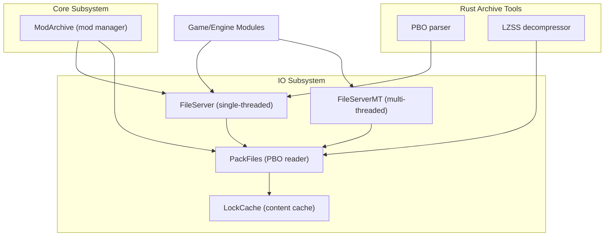
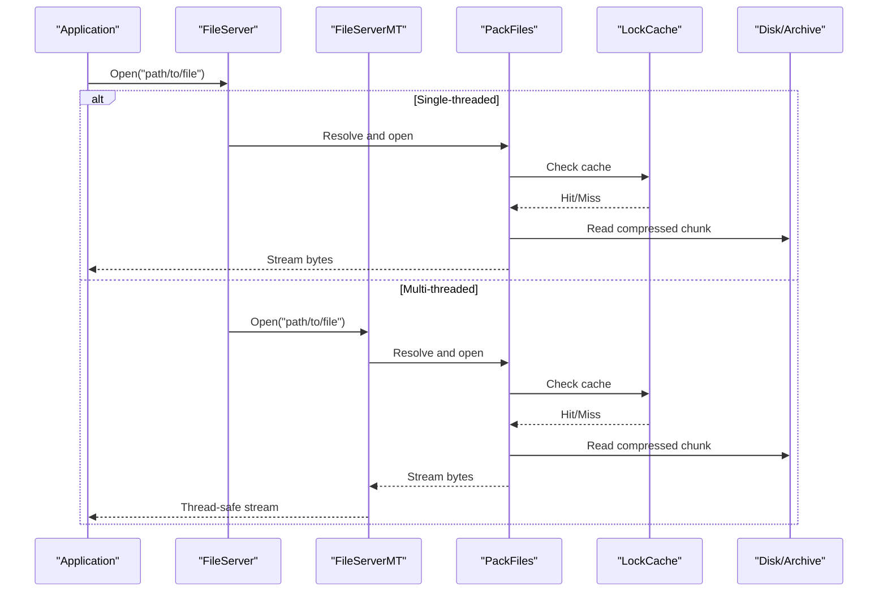
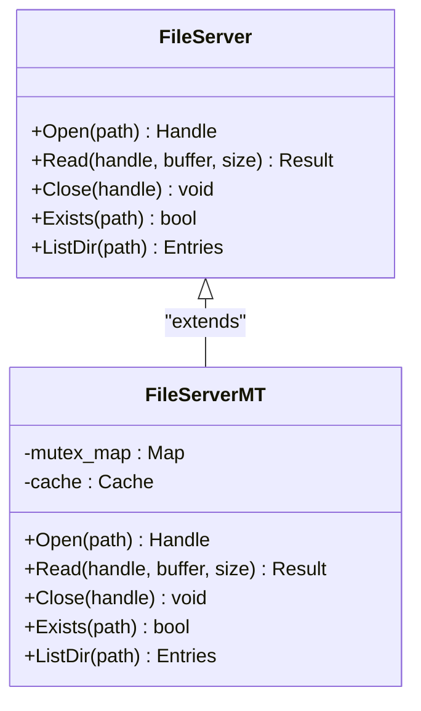
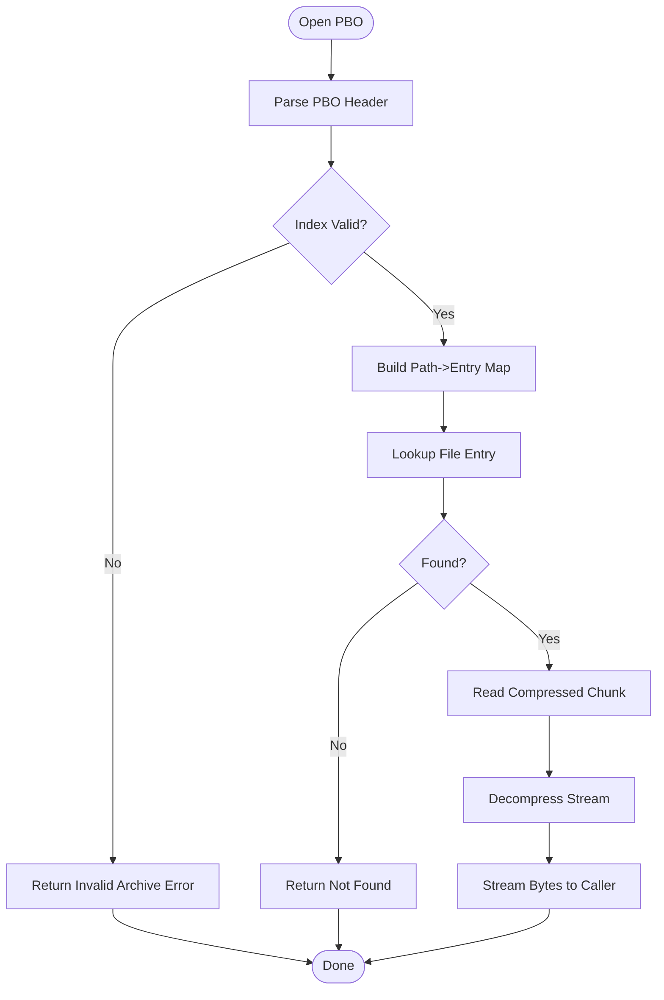
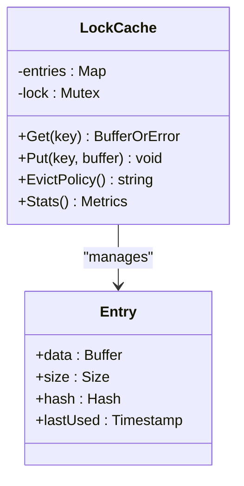
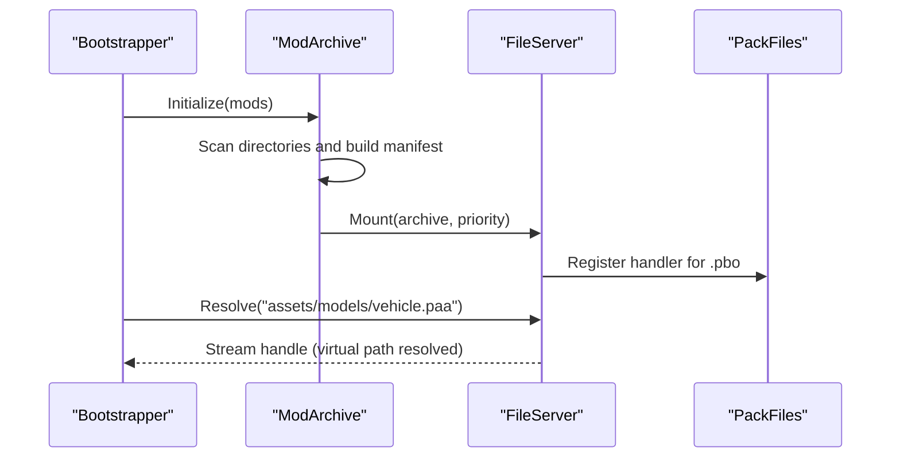
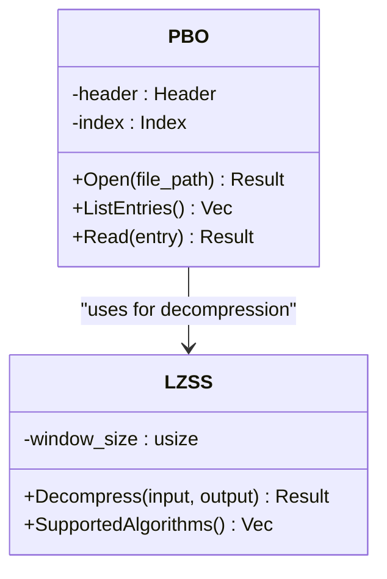
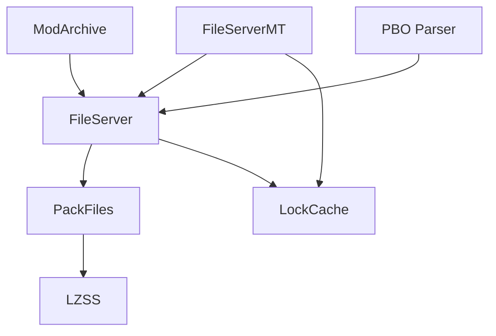

# Pack File System

<cite>
**Referenced Files in This Document**
- [PackFiles.hpp](file://engine/Poseidon/IO/PackFiles.hpp)
- [PackFiles.cpp](file://engine/Poseidon/IO/PackFiles.cpp)
- [FileServer.hpp](file://engine/Poseidon/IO/FileServer.hpp)
- [FileServer.cpp](file://engine/Poseidon/IO/FileServer.cpp)
- [FileServerMT.hpp](file://engine/Poseidon/IO/FileServerMT.hpp)
- [LockCache.hpp](file://engine/Poseidon/IO/LockCache.hpp)
- [LockCache.cpp](file://engine/Poseidon/IO/LockCache.cpp)
- [ModArchive.hpp](file://engine/Poseidon/Core/ModArchive.hpp)
- [ModArchive.cpp](file://engine/Poseidon/Core/ModArchive.cpp)
- [pbo.rs](file://mserver/Archive/src/pbo.rs)
- [lzss.rs](file://mserver/Archive/src/lzss.rs)
</cite>

## Table of Contents
1. [Introduction](#introduction)
2. [Project Structure](#project-structure)
3. [Core Components](#core-components)
4. [Architecture Overview](#architecture-overview)
5. [Detailed Component Analysis](#detailed-component-analysis)
6. [Dependency Analysis](#dependency-analysis)
7. [Performance Considerations](#performance-considerations)
8. [Troubleshooting Guide](#troubleshooting-guide)
9. [Conclusion](#conclusion)
10. [Appendices](#appendices)

## Introduction
This document explains the pack file system architecture used to virtualize game assets from PBO archives and other sources. It covers the PackFiles implementation for reading packed content, the FileServer abstraction layer that supports both single-threaded and multi-threaded access patterns, mod archive management, path resolution strategies, and asset virtualization techniques. Practical guidance is provided for creating custom pack handlers, implementing compression/decompression, optimizing I/O performance, handling concurrent access, caching, and robust error handling for corrupted or missing files.

## Project Structure
The pack file system spans several modules:
- IO subsystem provides the file server abstraction and pack file reader
- Core subsystem manages mods and their archives
- Rust-based archive utilities implement PBO parsing and LZSS decompression used by the server tooling

**Diagram sources**
- [FileServer.hpp](file://engine/Poseidon/IO/FileServer.hpp)
- [FileServer.cpp](file://engine/Poseidon/IO/FileServer.cpp)
- [FileServerMT.hpp](file://engine/Poseidon/IO/FileServerMT.hpp)
- [PackFiles.hpp](file://engine/Poseidon/IO/PackFiles.hpp)
- [PackFiles.cpp](file://engine/Poseidon/IO/PackFiles.cpp)
- [LockCache.hpp](file://engine/Poseidon/IO/LockCache.hpp)
- [ModArchive.hpp](file://engine/Poseidon/Core/ModArchive.hpp)
- [pbo.rs](file://mserver/Archive/src/pbo.rs)
- [lzss.rs](file://mserver/Archive/src/lzss.rs)

**Section sources**
- [FileServer.hpp](file://engine/Poseidon/IO/FileServer.hpp)
- [FileServer.cpp](file://engine/Poseidon/IO/FileServer.cpp)
- [FileServerMT.hpp](file://engine/Poseidon/IO/FileServerMT.hpp)
- [PackFiles.hpp](file://engine/Poseidon/IO/PackFiles.hpp)
- [PackFiles.cpp](file://engine/Poseidon/IO/PackFiles.cpp)
- [LockCache.hpp](file://engine/Poseidon/IO/LockCache.hpp)
- [LockCache.cpp](file://engine/Poseidon/IO/LockCache.cpp)
- [ModArchive.hpp](file://engine/Poseidon/Core/ModArchive.hpp)
- [ModArchive.cpp](file://engine/Poseidon/Core/ModArchive.cpp)
- [pbo.rs](file://mserver/Archive/src/pbo.rs)
- [lzss.rs](file://mserver/Archive/src/lzss.rs)

## Core Components
- FileServer: Abstracts file operations and exposes a unified API for reading assets across multiple sources. Supports single-threaded usage and thread-safe variants.
- FileServerMT: Multi-threaded variant providing concurrent read access with internal synchronization and caching.
- PackFiles: Implements PBO archive reading, including directory index traversal and compressed stream extraction.
- LockCache: Provides a content-level cache to reduce repeated decompression and disk reads.
- ModArchive: Manages mod discovery, ordering, and virtual path overlay so higher-priority mods can override base assets.

Key responsibilities:
- Path normalization and resolution across mounted archives
- Virtual file system view combining multiple archives and the filesystem
- Efficient streaming of compressed data with minimal memory overhead
- Robust error handling for malformed archives and missing files

**Section sources**
- [FileServer.hpp](file://engine/Poseidon/IO/FileServer.hpp)
- [FileServer.cpp](file://engine/Poseidon/IO/FileServer.cpp)
- [FileServerMT.hpp](file://engine/Poseidon/IO/FileServerMT.hpp)
- [PackFiles.hpp](file://engine/Poseidon/IO/PackFiles.hpp)
- [PackFiles.cpp](file://engine/Poseidon/IO/PackFiles.cpp)
- [LockCache.hpp](file://engine/Poseidon/IO/LockCache.hpp)
- [LockCache.cpp](file://engine/Poseidon/IO/LockCache.cpp)
- [ModArchive.hpp](file://engine/Poseidon/Core/ModArchive.hpp)
- [ModArchive.cpp](file://engine/Poseidon/Core/ModArchive.cpp)

## Architecture Overview
The pack file system presents a virtualized file interface over one or more archives. Requests are routed through FileServer, which selects an appropriate backend (e.g., PackFiles for PBO). The multi-threaded variant ensures safe concurrent access while leveraging caches to minimize redundant work.

**Diagram sources**
- [FileServer.hpp](file://engine/Poseidon/IO/FileServer.hpp)
- [FileServer.cpp](file://engine/Poseidon/IO/FileServer.cpp)
- [FileServerMT.hpp](file://engine/Poseidon/IO/FileServerMT.hpp)
- [PackFiles.hpp](file://engine/Poseidon/IO/PackFiles.hpp)
- [PackFiles.cpp](file://engine/Poseidon/IO/PackFiles.cpp)
- [LockCache.hpp](file://engine/Poseidon/IO/LockCache.hpp)
- [LockCache.cpp](file://engine/Poseidon/IO/LockCache.cpp)

## Detailed Component Analysis

### FileServer Abstraction Layer
- Purpose: Provide a consistent API for opening, reading, and closing files regardless of underlying storage (archives, disk, network).
- Single-threaded mode: Direct calls to backends without synchronization overhead.
- Multi-threaded mode: Synchronized access with per-file locks and shared caches; suitable for concurrent asset loading.

**Diagram sources**
- [FileServer.hpp](file://engine/Poseidon/IO/FileServer.hpp)
- [FileServer.cpp](file://engine/Poseidon/IO/FileServer.cpp)
- [FileServerMT.hpp](file://engine/Poseidon/IO/FileServerMT.hpp)

**Section sources**
- [FileServer.hpp](file://engine/Poseidon/IO/FileServer.hpp)
- [FileServer.cpp](file://engine/Poseidon/IO/FileServer.cpp)
- [FileServerMT.hpp](file://engine/Poseidon/IO/FileServerMT.hpp)

### PackFiles Implementation (PBO Archives)
- Responsibilities:
  - Parse PBO headers and directory indices
  - Locate files within archives
  - Decompress streams using supported algorithms (e.g., LZSS)
  - Provide streaming reads to avoid large memory allocations
- Data structures:
  - Directory entries mapping paths to offsets and sizes
  - Chunk descriptors for compressed segments
- Error handling:
  - Validate headers and indices
  - Detect truncated or corrupted chunks
  - Return clear error codes for missing or unreadable files

**Diagram sources**
- [PackFiles.hpp](file://engine/Poseidon/IO/PackFiles.hpp)
- [PackFiles.cpp](file://engine/Poseidon/IO/PackFiles.cpp)
- [lzss.rs](file://mserver/Archive/src/lzss.rs)

**Section sources**
- [PackFiles.hpp](file://engine/Poseidon/IO/PackFiles.hpp)
- [PackFiles.cpp](file://engine/Poseidon/IO/PackFiles.cpp)
- [lzss.rs](file://mserver/Archive/src/lzss.rs)

### LockCache (Content Caching)
- Purpose: Reduce repeated decompression and disk reads by caching recently accessed content.
- Strategies:
  - LRU eviction policy
  - Per-entry metadata (size, hash, last-used timestamp)
  - Optional split cache for hot/cold data
- Concurrency:
  - Thread-safe access via fine-grained locking
  - Avoids holding locks during heavy decompression

**Diagram sources**
- [LockCache.hpp](file://engine/Poseidon/IO/LockCache.hpp)
- [LockCache.cpp](file://engine/Poseidon/IO/LockCache.cpp)

**Section sources**
- [LockCache.hpp](file://engine/Poseidon/IO/LockCache.hpp)
- [LockCache.cpp](file://engine/Poseidon/IO/LockCache.cpp)

### ModArchive Management
- Responsibilities:
  - Discover installed mods and their PBO archives
  - Establish load order and priority
  - Overlay virtual paths so higher-priority mods override lower ones
- Integration:
  - Mount archives into FileServer
  - Normalize paths across different archive layouts
  - Provide existence checks and listing capabilities

**Diagram sources**
- [ModArchive.hpp](file://engine/Poseidon/Core/ModArchive.hpp)
- [ModArchive.cpp](file://engine/Poseidon/Core/ModArchive.cpp)
- [FileServer.hpp](file://engine/Poseidon/IO/FileServer.hpp)
- [PackFiles.hpp](file://engine/Poseidon/IO/PackFiles.hpp)

**Section sources**
- [ModArchive.hpp](file://engine/Poseidon/Core/ModArchive.hpp)
- [ModArchive.cpp](file://engine/Poseidon/Core/ModArchive.cpp)

### PBO Parsing and Compression Utilities (Rust)
- PBO parser:
  - Reads archive headers and directory tables
  - Validates integrity and structure
- LZSS decompressor:
  - Implements sliding window decompression
  - Optimized for streaming reads and minimal memory footprint

**Diagram sources**
- [pbo.rs](file://mserver/Archive/src/pbo.rs)
- [lzss.rs](file://mserver/Archive/src/lzss.rs)

**Section sources**
- [pbo.rs](file://mserver/Archive/src/pbo.rs)
- [lzss.rs](file://mserver/Archive/src/lzss.rs)

## Dependency Analysis
- FileServer depends on registered backends (e.g., PackFiles) and optional caches (LockCache).
- FileServerMT extends FileServer with concurrency primitives and shared cache access.
- PackFiles depends on decompression utilities (LZSS) and may integrate with Rust-based parsers when bridging to server tools.
- ModArchive orchestrates mounting and path resolution across multiple archives.

**Diagram sources**
- [FileServer.hpp](file://engine/Poseidon/IO/FileServer.hpp)
- [FileServer.cpp](file://engine/Poseidon/IO/FileServer.cpp)
- [FileServerMT.hpp](file://engine/Poseidon/IO/FileServerMT.hpp)
- [PackFiles.hpp](file://engine/Poseidon/IO/PackFiles.hpp)
- [PackFiles.cpp](file://engine/Poseidon/IO/PackFiles.cpp)
- [LockCache.hpp](file://engine/Poseidon/IO/LockCache.hpp)
- [ModArchive.hpp](file://engine/Poseidon/Core/ModArchive.hpp)
- [pbo.rs](file://mserver/Archive/src/pbo.rs)
- [lzss.rs](file://mserver/Archive/src/lzss.rs)

**Section sources**
- [FileServer.hpp](file://engine/Poseidon/IO/FileServer.hpp)
- [FileServer.cpp](file://engine/Poseidon/IO/FileServer.cpp)
- [FileServerMT.hpp](file://engine/Poseidon/IO/FileServerMT.hpp)
- [PackFiles.hpp](file://engine/Poseidon/IO/PackFiles.hpp)
- [PackFiles.cpp](file://engine/Poseidon/IO/PackFiles.cpp)
- [LockCache.hpp](file://engine/Poseidon/IO/LockCache.hpp)
- [ModArchive.hpp](file://engine/Poseidon/Core/ModArchive.hpp)
- [pbo.rs](file://mserver/Archive/src/pbo.rs)
- [lzss.rs](file://mserver/Archive/src/lzss.rs)

## Performance Considerations
- Streaming reads: Prefer incremental decompression and small buffers to reduce peak memory usage.
- Caching strategy: Use LockCache with tuned size limits and LRU eviction to balance hit rate and memory pressure.
- Concurrency: Use FileServerMT for parallel asset loading; ensure lock granularity avoids contention.
- Path resolution: Precompute normalized paths and mount order to minimize lookup overhead.
- I/O optimization: Batch reads where possible and leverage OS page cache; avoid unnecessary re-decompression.

[No sources needed since this section provides general guidance]

## Troubleshooting Guide
Common issues and resolutions:
- Corrupted PBO archives:
  - Validate headers and indices before use
  - Log detailed error codes and positions of corruption
  - Gracefully fallback to alternate sources if available
- Missing files:
  - Verify mod load order and path overlays
  - Ensure correct case sensitivity and separators
  - Provide clear diagnostics indicating expected vs. actual paths
- Concurrent access errors:
  - Confirm FileServerMT is used in multi-threaded contexts
  - Inspect lock contention and cache invalidation behavior
- Decompression failures:
  - Check algorithm support and input integrity
  - Implement retry logic with degraded modes if applicable

**Section sources**
- [PackFiles.cpp](file://engine/Poseidon/IO/PackFiles.cpp)
- [LockCache.cpp](file://engine/Poseidon/IO/LockCache.cpp)
- [ModArchive.cpp](file://engine/Poseidon/Core/ModArchive.cpp)

## Conclusion
The pack file system provides a robust, extensible foundation for virtualizing assets from PBO archives and other sources. Through the FileServer abstraction, developers can choose between single-threaded simplicity and multi-threaded performance. PackFiles handles PBO parsing and decompression efficiently, while LockCache reduces redundant work. ModArchive manages mod discovery and path overlays, enabling flexible asset overrides. By following the recommended practices for caching, concurrency, and error handling, applications can achieve high performance and reliability even under challenging conditions.

[No sources needed since this section summarizes without analyzing specific files]

## Appendices

### Creating Custom Pack File Handlers
- Steps:
  - Implement a backend adhering to the FileServer interface
  - Register the handler with FileServer for specific file extensions or prefixes
  - Provide streaming read support and accurate metadata (size, timestamps)
  - Integrate with LockCache for performance gains
- Example pattern:
  - Define a new archive format parser
  - Map virtual paths to archive entries
  - Handle decompression inline or delegate to specialized libraries

[No sources needed since this section provides general guidance]

### Implementing File Compression/Decompression
- Choose algorithms based on speed vs. ratio trade-offs (e.g., LZSS, zlib)
- Implement streaming decompression to minimize memory usage
- Validate inputs and handle partial reads gracefully
- Expose algorithm negotiation for compatibility across platforms

[No sources needed since this section provides general guidance]

### Optimizing File I/O Performance
- Tune buffer sizes for typical asset sizes
- Enable OS-level caching and asynchronous I/O where supported
- Profile hot paths to identify bottlenecks in path resolution and decompression
- Consider preloading frequently used assets during initialization

[No sources needed since this section provides general guidance]

### Handling Concurrent Access Patterns
- Use FileServerMT for parallel loads
- Ensure thread-safe implementations of backends and caches
- Monitor lock contention and adjust granularity as needed
- Implement timeouts and cancellation for long-running reads

[No sources needed since this section provides general guidance]

### Asset Virtualization Strategies
- Normalize all paths to a canonical form
- Support layered mounts with priority ordering
- Provide consistent APIs for existence checks and directory listings
- Allow dynamic mounting/unmounting for runtime mod updates

[No sources needed since this section provides general guidance]