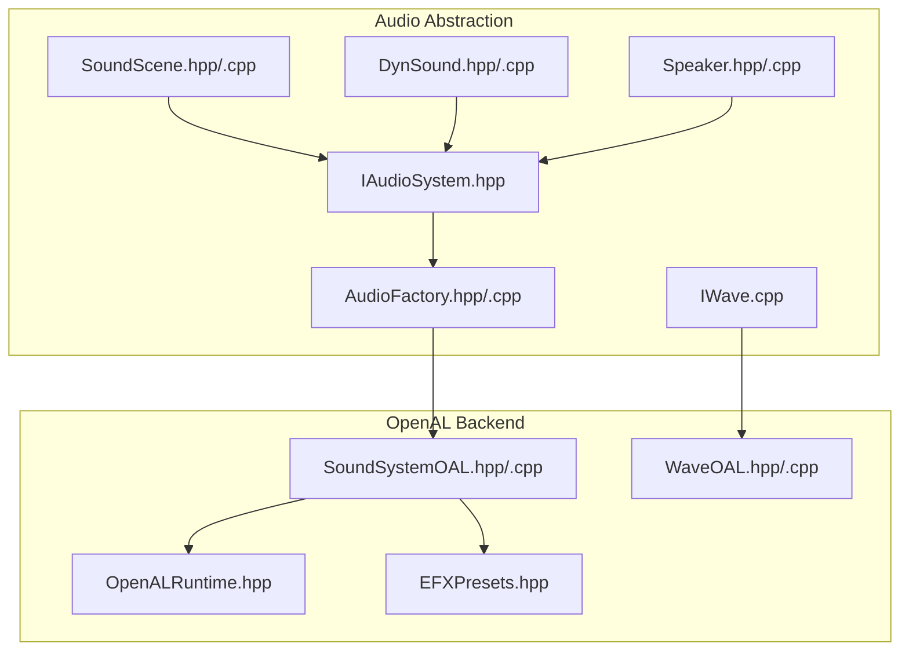
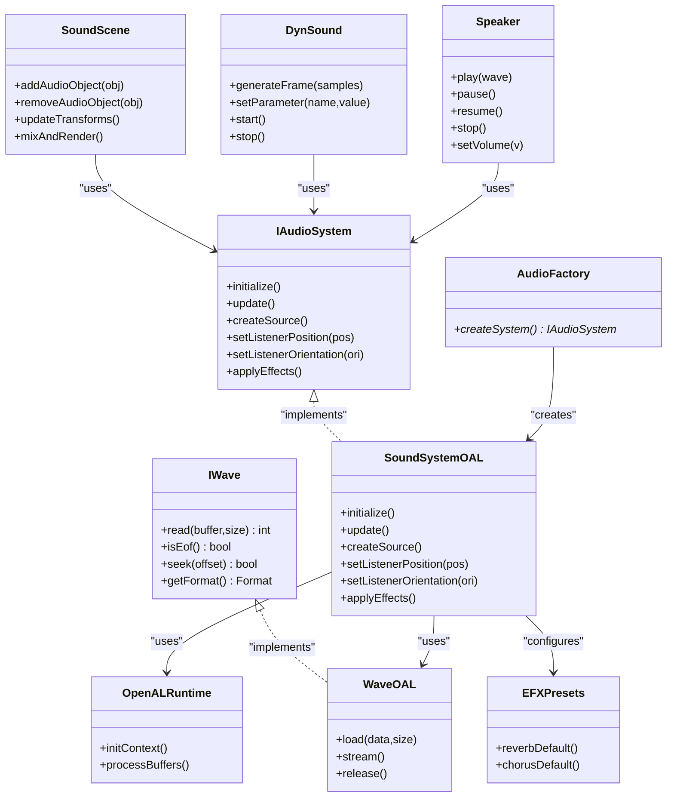
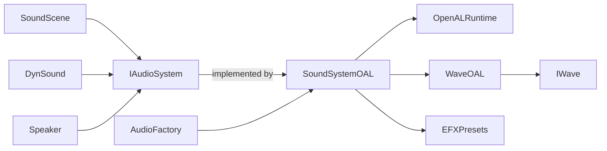

# Audio Core & Abstraction Layer

<cite>
**Referenced Files in This Document**
- [IAudioSystem.hpp](file://engine/Poseidon/Audio/IAudioSystem.hpp)
- [SoundScene.hpp](file://engine/Poseidon/Audio/SoundScene.hpp)
- [SoundScene.cpp](file://engine/Poseidon/Audio/SoundScene.cpp)
- [DynSound.hpp](file://engine/Poseidon/Audio/DynSound.hpp)
- [DynSound.cpp](file://engine/Poseidon/Audio/DynSound.cpp)
- [IWave.cpp](file://engine/Poseidon/Audio/IWave.cpp)
- [Speaker.hpp](file://engine/Poseidon/Audio/Speaker.hpp)
- [Speaker.cpp](file://engine/Poseidon/Audio/Speaker.cpp)
- [AudioFactory.hpp](file://engine/Poseidon/Audio/AudioFactory.hpp)
- [AudioFactory.cpp](file://engine/Poseidon/Audio/AudioFactory.cpp)
- [SoundSystemOAL.hpp](file://engine/Poseidon/OpenAL/SoundSystemOAL.hpp)
- [SoundSystemOAL.cpp](file://engine/Poseidon/OpenAL/SoundSystemOAL.cpp)
- [WaveOAL.hpp](file://engine/Poseidon/OpenAL/WaveOAL.hpp)
- [WaveOAL.cpp](file://engine/Poseidon/OpenAL/WaveOAL.cpp)
- [OpenALRuntime.hpp](file://engine/Poseidon/OpenAL/OpenALRuntime.hpp)
- [EFXPresets.hpp](file://engine/Poseidon/OpenAL/EFXPresets.hpp)
</cite>

## Table of Contents
1. [Introduction](#introduction)
2. [Project Structure](#project-structure)
3. [Core Components](#core-components)
4. [Architecture Overview](#architecture-overview)
5. [Detailed Component Analysis](#detailed-component-analysis)
6. [Dependency Analysis](#dependency-analysis)
7. [Performance Considerations](#performance-considerations)
8. [Troubleshooting Guide](#troubleshooting-guide)
9. [Conclusion](#conclusion)
10. [Appendices](#appendices)

## Introduction
This document explains the audio core abstraction layer that provides a unified API for different audio backends. It focuses on:
- The IAudioSystem interface design pattern and how it abstracts backend-specific details.
- The SoundScene architecture for managing audio objects, spatial positioning, and effects processing.
- The DynSound system for dynamic audio generation and manipulation.
- The IWave interface for audio stream handling, memory management strategies, and performance optimizations.
- Practical guidance for implementing custom audio sources, applying real-time effects, and managing audio resources efficiently.

## Project Structure
The audio subsystem is organized into an abstraction layer under engine/Poseidon/Audio and a concrete OpenAL backend under engine/Poseidon/OpenAL. Key responsibilities:
- Abstraction interfaces and scene management live in the Audio directory.
- Backend implementation (OpenAL) lives in the OpenAL directory.
- Factory components wire interfaces to implementations at runtime.

**Diagram sources**
- [IAudioSystem.hpp](file://engine/Poseidon/Audio/IAudioSystem.hpp)
- [SoundScene.hpp](file://engine/Poseidon/Audio/SoundScene.hpp)
- [SoundScene.cpp](file://engine/Poseidon/Audio/SoundScene.cpp)
- [DynSound.hpp](file://engine/Poseidon/Audio/DynSound.hpp)
- [DynSound.cpp](file://engine/Poseidon/Audio/DynSound.cpp)
- [IWave.cpp](file://engine/Poseidon/Audio/IWave.cpp)
- [Speaker.hpp](file://engine/Poseidon/Audio/Speaker.hpp)
- [Speaker.cpp](file://engine/Poseidon/Audio/Speaker.cpp)
- [AudioFactory.hpp](file://engine/Poseidon/Audio/AudioFactory.hpp)
- [AudioFactory.cpp](file://engine/Poseidon/Audio/AudioFactory.cpp)
- [SoundSystemOAL.hpp](file://engine/Poseidon/OpenAL/SoundSystemOAL.hpp)
- [SoundSystemOAL.cpp](file://engine/Poseidon/OpenAL/SoundSystemOAL.cpp)
- [WaveOAL.hpp](file://engine/Poseidon/OpenAL/WaveOAL.hpp)
- [WaveOAL.cpp](file://engine/Poseidon/OpenAL/WaveOAL.cpp)
- [OpenALRuntime.hpp](file://engine/Poseidon/OpenAL/OpenALRuntime.hpp)
- [EFXPresets.hpp](file://engine/Poseidon/OpenAL/EFXPresets.hpp)

**Section sources**
- [IAudioSystem.hpp](file://engine/Poseidon/Audio/IAudioSystem.hpp)
- [SoundScene.hpp](file://engine/Poseidon/Audio/SoundScene.hpp)
- [SoundScene.cpp](file://engine/Poseidon/Audio/SoundScene.cpp)
- [DynSound.hpp](file://engine/Poseidon/Audio/DynSound.hpp)
- [DynSound.cpp](file://engine/Poseidon/Audio/DynSound.cpp)
- [IWave.cpp](file://engine/Poseidon/Audio/IWave.cpp)
- [Speaker.hpp](file://engine/Poseidon/Audio/Speaker.hpp)
- [Speaker.cpp](file://engine/Poseidon/Audio/Speaker.cpp)
- [AudioFactory.hpp](file://engine/Poseidon/Audio/AudioFactory.hpp)
- [AudioFactory.cpp](file://engine/Poseidon/Audio/AudioFactory.cpp)
- [SoundSystemOAL.hpp](file://engine/Poseidon/OpenAL/SoundSystemOAL.hpp)
- [SoundSystemOAL.cpp](file://engine/Poseidon/OpenAL/SoundSystemOAL.cpp)
- [WaveOAL.hpp](file://engine/Poseidon/OpenAL/WaveOAL.hpp)
- [WaveOAL.cpp](file://engine/Poseidon/OpenAL/WaveOAL.cpp)
- [OpenALRuntime.hpp](file://engine/Poseidon/OpenAL/OpenALRuntime.hpp)
- [EFXPresets.hpp](file://engine/Poseidon/OpenAL/EFXPresets.hpp)

## Core Components
- IAudioSystem: Defines the platform-agnostic audio API used by higher layers (scene, dyn sound, speakers).
- SoundScene: Manages audio objects, their spatial transforms, mixing, and effects routing.
- DynSound: Provides dynamic audio generation and real-time manipulation APIs.
- IWave: Abstracts audio stream sources with consistent read semantics and lifecycle.
- Speaker: Represents output devices or channels and integrates with the backend.
- AudioFactory: Wires IAudioSystem to a concrete backend (e.g., OpenAL).
- SoundSystemOAL: Concrete OpenAL-based implementation of IAudioSystem.
- WaveOAL: Concrete IWave implementation backed by OpenAL buffers/streaming.
- OpenALRuntime: Encapsulates OpenAL context and device access.
- EFXPresets: Common effect presets for reverb, chorus, etc.

Key responsibilities and interactions are detailed in subsequent sections.

**Section sources**
- [IAudioSystem.hpp](file://engine/Poseidon/Audio/IAudioSystem.hpp)
- [SoundScene.hpp](file://engine/Poseidon/Audio/SoundScene.hpp)
- [DynSound.hpp](file://engine/Poseidon/Audio/DynSound.hpp)
- [IWave.cpp](file://engine/Poseidon/Audio/IWave.cpp)
- [Speaker.hpp](file://engine/Poseidon/Audio/Speaker.hpp)
- [AudioFactory.hpp](file://engine/Poseidon/Audio/AudioFactory.hpp)
- [SoundSystemOAL.hpp](file://engine/Poseidon/OpenAL/SoundSystemOAL.hpp)
- [WaveOAL.hpp](file://engine/Poseidon/OpenAL/WaveOAL.hpp)
- [OpenALRuntime.hpp](file://engine/Poseidon/OpenAL/OpenALRuntime.hpp)
- [EFXPresets.hpp](file://engine/Poseidon/OpenAL/EFXPresets.hpp)

## Architecture Overview
The audio core follows a layered abstraction pattern:
- Application code interacts with IAudioSystem through SoundScene and DynSound.
- IWave defines a uniform streaming interface for all audio sources.
- AudioFactory selects and constructs the backend implementation (OpenAL).
- SoundSystemOAL implements IAudioSystem using OpenAL, leveraging WaveOAL for playback and OpenALRuntime for low-level operations.
- EFXPresets provide reusable effect configurations.

**Diagram sources**
- [IAudioSystem.hpp](file://engine/Poseidon/Audio/IAudioSystem.hpp)
- [SoundScene.hpp](file://engine/Poseidon/Audio/SoundScene.hpp)
- [DynSound.hpp](file://engine/Poseidon/Audio/DynSound.hpp)
- [IWave.cpp](file://engine/Poseidon/Audio/IWave.cpp)
- [Speaker.hpp](file://engine/Poseidon/Audio/Speaker.hpp)
- [AudioFactory.hpp](file://engine/Poseidon/Audio/AudioFactory.hpp)
- [SoundSystemOAL.hpp](file://engine/Poseidon/OpenAL/SoundSystemOAL.hpp)
- [WaveOAL.hpp](file://engine/Poseidon/OpenAL/WaveOAL.hpp)
- [OpenALRuntime.hpp](file://engine/Poseidon/OpenAL/OpenALRuntime.hpp)
- [EFXPresets.hpp](file://engine/Poseidon/OpenAL/EFXPresets.hpp)

## Detailed Component Analysis

### IAudioSystem Interface Design Pattern
- Purpose: Provide a single, stable API surface for audio initialization, listener configuration, source creation, and frame rendering independent of the underlying backend.
- Design highlights:
  - Virtual methods define capabilities like listener transform updates, source lifecycle, and effects application.
  - Backend-specific logic is hidden behind this interface; callers only depend on the interface.
  - Factory pattern decouples construction from usage, enabling runtime selection of the backend.

Implementation notes:
- Implementations must ensure thread-safety where applicable and maintain consistent state across update cycles.
- Error paths should be explicit and return clear status codes or exceptions as defined by the interface contract.

**Section sources**
- [IAudioSystem.hpp](file://engine/Poseidon/Audio/IAudioSystem.hpp)
- [AudioFactory.hpp](file://engine/Poseidon/Audio/AudioFactory.hpp)
- [AudioFactory.cpp](file://engine/Poseidon/Audio/AudioFactory.cpp)

### SoundScene Architecture
- Responsibilities:
  - Manage a collection of audio objects with positions, orientations, velocities, and roles (ambient, positional, UI, etc.).
  - Compute per-frame attenuation, Doppler shifts, and panning based on listener transforms.
  - Route audio through effects chains and mix outputs to speakers.
- Data flow:
  - Update loop refreshes transforms and culls distant sounds.
  - Mixer prepares buffers, applies per-source parameters, and writes to the output buffer.
  - Effects are applied either per-source or globally depending on configuration.

Optimization techniques:
- Spatial culling reduces active sources.
- Batched parameter updates minimize backend calls.
- Hierarchical grouping allows efficient effect routing.

**Section sources**
- [SoundScene.hpp](file://engine/Poseidon/Audio/SoundScene.hpp)
- [SoundScene.cpp](file://engine/Poseidon/Audio/SoundScene.cpp)

### DynSound System
- Purpose: Generate and manipulate audio samples programmatically at runtime.
- Capabilities:
  - Parameterized synthesis (oscillators, noise, envelopes).
  - Real-time modulation via LFOs and filters.
  - Integration with IAudioSystem for playback through speakers.

Usage patterns:
- Create a DynSound instance, set parameters, start generation, and feed frames to the mixer or speaker.
- Use efficient buffer sizes aligned with backend requirements to reduce overhead.

**Section sources**
- [DynSound.hpp](file://engine/Poseidon/Audio/DynSound.hpp)
- [DynSound.cpp](file://engine/Poseidon/Audio/DynSound.cpp)

### IWave Interface for Audio Stream Handling
- Purpose: Abstract audio data sources (files, streams, generated content) behind a uniform read interface.
- Key operations:
  - Read chunks into a buffer until EOF.
  - Query format (sample rate, channels, bit depth).
  - Seek support for random access when available.
- Memory management:
  - Prefer zero-copy streaming where possible.
  - Reuse buffers across reads to avoid allocations.
  - Ensure proper ownership and lifetime of internal buffers.

Performance considerations:
- Align buffer sizes to backend block sizes.
- Minimize blocking I/O by prebuffering.
- Handle EOF and error conditions gracefully without stalling the audio thread.

**Section sources**
- [IWave.cpp](file://engine/Poseidon/Audio/IWave.cpp)
- [WaveOAL.hpp](file://engine/Poseidon/OpenAL/WaveOAL.hpp)
- [WaveOAL.cpp](file://engine/Poseidon/OpenAL/WaveOAL.cpp)

### Speaker and Output Management
- Responsibilities:
  - Represent an output device or channel group.
  - Control playback lifecycle (play, pause, resume, stop).
  - Adjust volume and mute states.
- Integration:
  - Uses IAudioSystem to create and manage sources.
  - Coordinates with SoundScene for global volume and master controls.

**Section sources**
- [Speaker.hpp](file://engine/Poseidon/Audio/Speaker.hpp)
- [Speaker.cpp](file://engine/Poseidon/Audio/Speaker.cpp)

### OpenAL Backend Implementation
- SoundSystemOAL:
  - Implements IAudioSystem using OpenAL.
  - Manages listener position/orientation, source creation, and effects.
  - Integrates with OpenALRuntime for context and device operations.
- WaveOAL:
  - Implements IWave using OpenAL buffers and streaming.
  - Handles loading, buffering, and releasing audio data efficiently.
- OpenALRuntime:
  - Encapsulates OpenAL context lifecycle and buffer processing.
- EFXPresets:
  - Provides common effect configurations (reverb, chorus) for quick setup.

**Section sources**
- [SoundSystemOAL.hpp](file://engine/Poseidon/OpenAL/SoundSystemOAL.hpp)
- [SoundSystemOAL.cpp](file://engine/Poseidon/OpenAL/SoundSystemOAL.cpp)
- [WaveOAL.hpp](file://engine/Poseidon/OpenAL/WaveOAL.hpp)
- [WaveOAL.cpp](file://engine/Poseidon/OpenAL/WaveOAL.cpp)
- [OpenALRuntime.hpp](file://engine/Poseidon/OpenAL/OpenALRuntime.hpp)
- [EFXPresets.hpp](file://engine/Poseidon/OpenAL/EFXPresets.hpp)

## Dependency Analysis
The audio core exhibits clear separation between abstraction and implementation:
- High-level components (SoundScene, DynSound, Speaker) depend only on IAudioSystem and IWave.
- AudioFactory resolves the concrete backend at startup.
- OpenAL backend depends on OpenALRuntime and EFXPresets.

**Diagram sources**
- [SoundScene.hpp](file://engine/Poseidon/Audio/SoundScene.hpp)
- [DynSound.hpp](file://engine/Poseidon/Audio/DynSound.hpp)
- [Speaker.hpp](file://engine/Poseidon/Audio/Speaker.hpp)
- [IAudioSystem.hpp](file://engine/Poseidon/Audio/IAudioSystem.hpp)
- [SoundSystemOAL.hpp](file://engine/Poseidon/OpenAL/SoundSystemOAL.hpp)
- [OpenALRuntime.hpp](file://engine/Poseidon/OpenAL/OpenALRuntime.hpp)
- [WaveOAL.hpp](file://engine/Poseidon/OpenAL/WaveOAL.hpp)
- [IWave.cpp](file://engine/Poseidon/Audio/IWave.cpp)
- [AudioFactory.hpp](file://engine/Poseidon/Audio/AudioFactory.hpp)
- [EFXPresets.hpp](file://engine/Poseidon/OpenAL/EFXPresets.hpp)

**Section sources**
- [AudioFactory.hpp](file://engine/Poseidon/Audio/AudioFactory.hpp)
- [AudioFactory.cpp](file://engine/Poseidon/Audio/AudioFactory.cpp)
- [SoundSystemOAL.hpp](file://engine/Poseidon/OpenAL/SoundSystemOAL.hpp)
- [OpenALRuntime.hpp](file://engine/Poseidon/OpenAL/OpenALRuntime.hpp)
- [WaveOAL.hpp](file://engine/Poseidon/OpenAL/WaveOAL.hpp)
- [IWave.cpp](file://engine/Poseidon/Audio/IWave.cpp)
- [EFXPresets.hpp](file://engine/Poseidon/OpenAL/EFXPresets.hpp)

## Performance Considerations
- Buffer sizing:
  - Align IWave read sizes with backend block sizes to minimize copies and syscalls.
  - Prebuffer sufficient data to avoid underruns during playback.
- Threading:
  - Keep audio processing on a dedicated thread to meet latency constraints.
  - Avoid heavy work in the audio callback; schedule tasks asynchronously.
- Spatial culling:
  - Reduce active sources by distance and occlusion checks within SoundScene.
- Effect routing:
  - Apply shared effects once per chain rather than per source where possible.
- Memory reuse:
  - Reuse buffers and objects to prevent frequent allocations.
- Resource lifecycle:
  - Explicitly release wave buffers and sources when no longer needed.

[No sources needed since this section provides general guidance]

## Troubleshooting Guide
Common issues and remedies:
- No audio output:
  - Verify IAudioSystem::initialize succeeded and OpenAL context is valid.
  - Check speaker volume and mute states.
- Audio glitches or dropouts:
  - Increase buffer sizes and prebuffer more data.
  - Ensure IWave::read returns complete blocks and handles EOF correctly.
- Incorrect spatialization:
  - Confirm listener position/orientation updates each frame.
  - Validate source positions and velocities relative to listener.
- Excessive CPU usage:
  - Reduce number of active sources and effects.
  - Enable spatial culling and disable unnecessary real-time processing.
- Memory leaks:
  - Ensure WaveOAL releases buffers and IWave instances are destroyed properly.

**Section sources**
- [SoundSystemOAL.hpp](file://engine/Poseidon/OpenAL/SoundSystemOAL.hpp)
- [SoundSystemOAL.cpp](file://engine/Poseidon/OpenAL/SoundSystemOAL.cpp)
- [WaveOAL.hpp](file://engine/Poseidon/OpenAL/WaveOAL.hpp)
- [WaveOAL.cpp](file://engine/Poseidon/OpenAL/WaveOAL.cpp)
- [IWave.cpp](file://engine/Poseidon/Audio/IWave.cpp)

## Conclusion
The audio core abstraction layer cleanly separates high-level audio concerns from backend specifics. IAudioSystem provides a stable API for SoundScene, DynSound, and Speaker, while IWave standardizes audio streaming. The OpenAL backend demonstrates a robust implementation using OpenALRuntime and EFXPresets. By following the recommended practices for buffer sizing, threading, and resource management, developers can achieve efficient, scalable audio systems suitable for real-time applications.

[No sources needed since this section summarizes without analyzing specific files]

## Appendices

### Implementing a Custom Audio Source
Steps:
- Implement IWave to supply audio data via read(), handle EOF, and report format.
- Use AudioFactory to obtain IAudioSystem and create a source.
- Feed IWave data to the speaker or mixer, respecting buffer sizes.
- Manage lifecycle: load, play, and release resources appropriately.

**Section sources**
- [IWave.cpp](file://engine/Poseidon/Audio/IWave.cpp)
- [WaveOAL.hpp](file://engine/Poseidon/OpenAL/WaveOAL.hpp)
- [AudioFactory.hpp](file://engine/Poseidon/Audio/AudioFactory.hpp)

### Applying Real-Time Effects
Approach:
- Configure effect presets via EFXPresets for common scenarios.
- Attach effects to sources or groups within SoundScene.
- Update effect parameters dynamically based on gameplay events.

**Section sources**
- [EFXPresets.hpp](file://engine/Poseidon/OpenAL/EFXPresets.hpp)
- [SoundScene.hpp](file://engine/Poseidon/Audio/SoundScene.hpp)

### Managing Audio Resources Efficiently
Guidelines:
- Reuse IWave instances where possible.
- Preallocate buffers sized to backend requirements.
- Release resources promptly after use to avoid leaks.
- Monitor active source counts and adjust culling thresholds.

**Section sources**
- [IWave.cpp](file://engine/Poseidon/Audio/IWave.cpp)
- [WaveOAL.cpp](file://engine/Poseidon/OpenAL/WaveOAL.cpp)
- [SoundScene.cpp](file://engine/Poseidon/Audio/SoundScene.cpp)