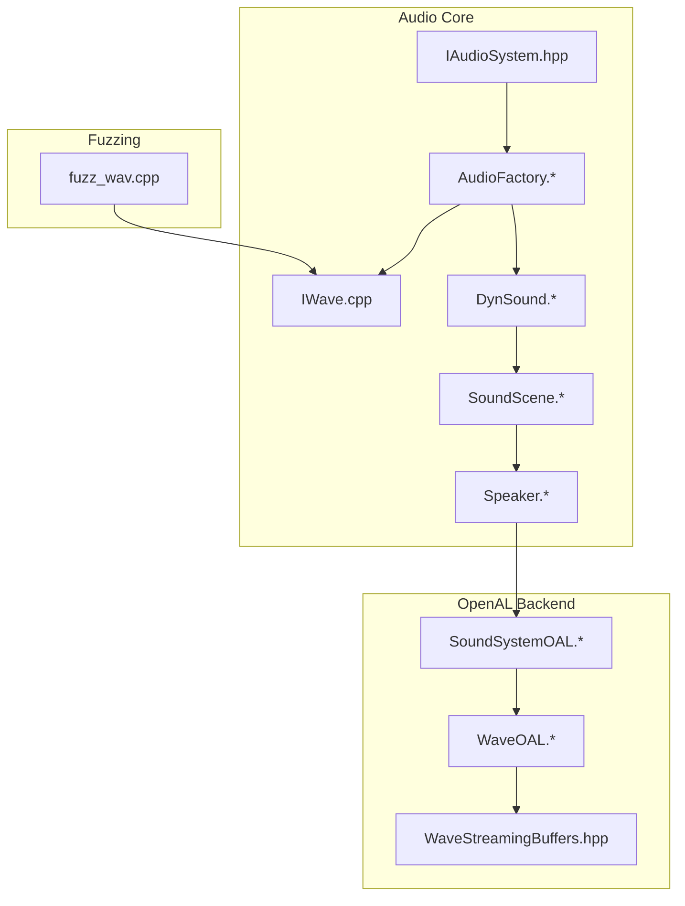
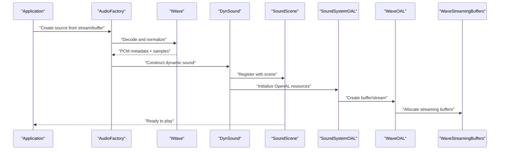
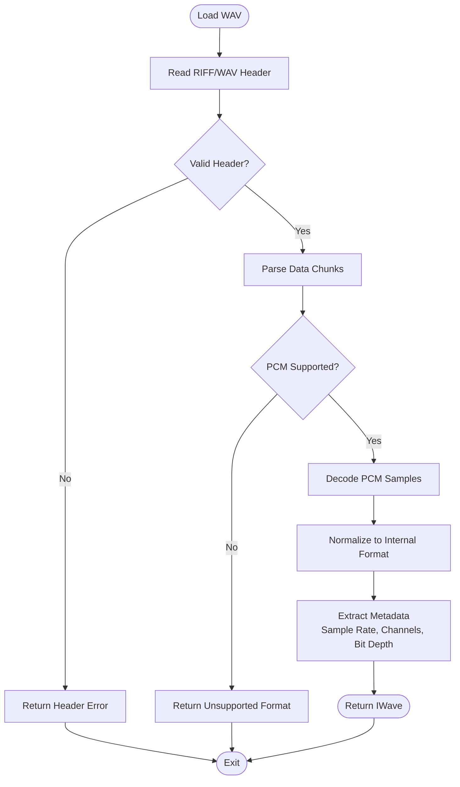
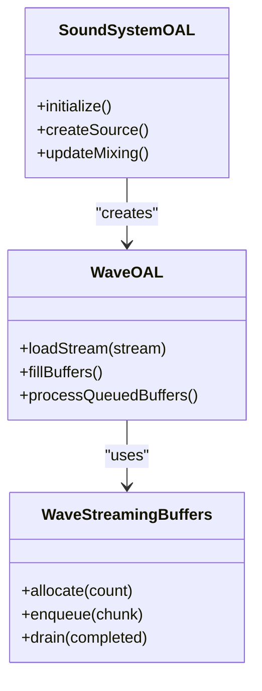
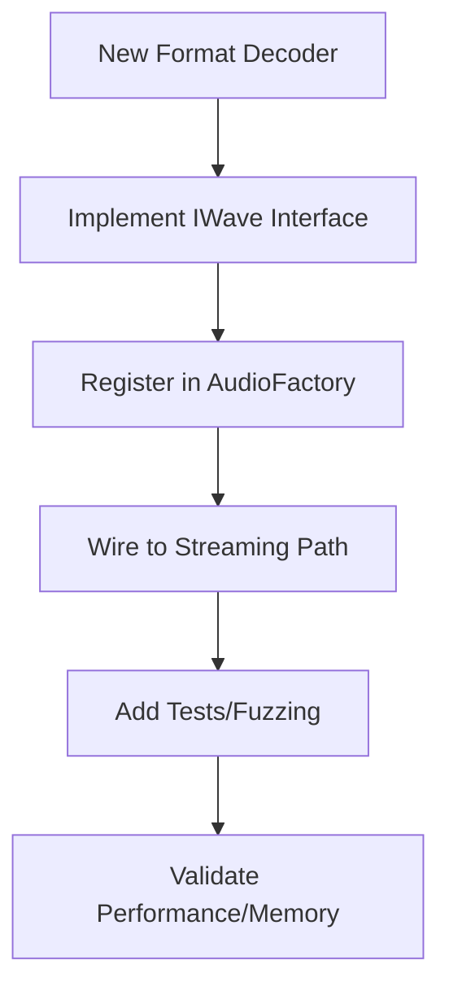
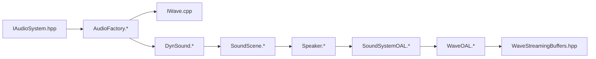

# Audio Format Support

<cite>
**Referenced Files in This Document**
- [IAudioSystem.hpp](file://engine/Poseidon/Audio/IAudioSystem.hpp)
- [AudioFactory.cpp](file://engine/Poseidon/Audio/AudioFactory.cpp)
- [AudioFactory.hpp](file://engine/Poseidon/Audio/AudioFactory.hpp)
- [IWave.cpp](file://engine/Poseidon/Audio/IWave.cpp)
- [DynSound.cpp](file://engine/Poseidon/Audio/DynSound.cpp)
- [DynSound.hpp](file://engine/Poseidon/Audio/DynSound.hpp)
- [SoundScene.cpp](file://engine/Poseidon/Audio/SoundScene.cpp)
- [SoundScene.hpp](file://engine/Poseidon/Audio/SoundScene.hpp)
- [Speaker.cpp](file://engine/Poseidon/Audio/Speaker.cpp)
- [Speaker.hpp](file://engine/Poseidon/Audio/Speaker.hpp)
- [WaveOAL.cpp](file://engine/PoseidonOpenAL/WaveOAL.cpp)
- [WaveOAL.hpp](file://engine/PoseidonOpenAL/WaveOAL.hpp)
- [WaveStreamingBuffers.hpp](file://engine/PoseidonOpenAL/WaveStreamingBuffers.hpp)
- [SoundSystemOAL.cpp](file://engine/PoseidonOpenAL/SoundSystemOAL.cpp)
- [SoundSystemOAL.hpp](file://engine/PoseidonOpenAL/SoundSystemOAL.hpp)
- [fuzz_wav.cpp](file://apps/fuzzers/Fuzzer/fuzz_wav.cpp)
</cite>

## Table of Contents
1. [Introduction](#introduction)
2. [Project Structure](#project-structure)
3. [Core Components](#core-components)
4. [Architecture Overview](#architecture-overview)
5. [Detailed Component Analysis](#detailed-component-analysis)
6. [Dependency Analysis](#dependency-analysis)
7. [Performance Considerations](#performance-considerations)
8. [Troubleshooting Guide](#troubleshooting-guide)
9. [Conclusion](#conclusion)
10. [Appendices](#appendices)

## Introduction
This document explains the audio format support and processing subsystem, focusing on:
- WaveFile handling for standard WAV files (PCM encodings and metadata parsing)
- OGG streaming implementation for compressed audio playback with efficient memory usage
- DeltaPack compression scheme overview for reducing audio file sizes while maintaining quality
- PcmCache system for efficient audio sample caching and memory management
- Guidance for adding new audio formats, optimizing loading performance, and handling different audio specifications
- Compatibility, error handling, and performance considerations across formats

The content is derived from the engine’s audio core, OpenAL backend, and related utilities.

## Project Structure
The audio subsystem is organized into:
- Core abstractions and runtime orchestration under engine/Poseidon/Audio
- Backend-specific implementations under engine/PoseidonOpenAL
- Fuzzing utilities for robustness testing under apps/fuzzers/Fuzzer

**Diagram sources**
- [IAudioSystem.hpp](file://engine/Poseidon/Audio/IAudioSystem.hpp)
- [AudioFactory.cpp](file://engine/Poseidon/Audio/AudioFactory.cpp)
- [AudioFactory.hpp](file://engine/Poseidon/Audio/AudioFactory.hpp)
- [IWave.cpp](file://engine/Poseidon/Audio/IWave.cpp)
- [DynSound.cpp](file://engine/Poseidon/Audio/DynSound.cpp)
- [DynSound.hpp](file://engine/Poseidon/Audio/DynSound.hpp)
- [SoundScene.cpp](file://engine/Poseidon/Audio/SoundScene.cpp)
- [SoundScene.hpp](file://engine/Poseidon/Audio/SoundScene.hpp)
- [Speaker.cpp](file://engine/Poseidon/Audio/Speaker.cpp)
- [Speaker.hpp](file://engine/Poseidon/Audio/Speaker.hpp)
- [SoundSystemOAL.cpp](file://engine/PoseidonOpenAL/SoundSystemOAL.cpp)
- [SoundSystemOAL.hpp](file://engine/PoseidonOpenAL/SoundSystemOAL.hpp)
- [WaveOAL.cpp](file://engine/PoseidonOpenAL/WaveOAL.cpp)
- [WaveOAL.hpp](file://engine/PoseidonOpenAL/WaveOAL.hpp)
- [WaveStreamingBuffers.hpp](file://engine/PoseidonOpenAL/WaveStreamingBuffers.hpp)
- [fuzz_wav.cpp](file://apps/fuzzers/Fuzzer/fuzz_wav.cpp)

**Section sources**
- [IAudioSystem.hpp](file://engine/Poseidon/Audio/IAudioSystem.hpp)
- [AudioFactory.cpp](file://engine/Poseidon/Audio/AudioFactory.cpp)
- [AudioFactory.hpp](file://engine/Poseidon/Audio/AudioFactory.hpp)
- [IWave.cpp](file://engine/Poseidon/Audio/IWave.cpp)
- [DynSound.cpp](file://engine/Poseidon/Audio/DynSound.cpp)
- [DynSound.hpp](file://engine/Poseidon/Audio/DynSound.hpp)
- [SoundScene.cpp](file://engine/Poseidon/Audio/SoundScene.cpp)
- [SoundScene.hpp](file://engine/Poseidon/Audio/SoundScene.hpp)
- [Speaker.cpp](file://engine/Poseidon/Audio/Speaker.cpp)
- [Speaker.hpp](file://engine/Poseidon/Audio/Speaker.hpp)
- [SoundSystemOAL.cpp](file://engine/PoseidonOpenAL/SoundSystemOAL.cpp)
- [SoundSystemOAL.hpp](file://engine/PoseidonOpenAL/SoundSystemOAL.hpp)
- [WaveOAL.cpp](file://engine/PoseidonOpenAL/WaveOAL.cpp)
- [WaveOAL.hpp](file://engine/PoseidonOpenAL/WaveOAL.hpp)
- [WaveStreamingBuffers.hpp](file://engine/PoseidonOpenAL/WaveStreamingBuffers.hpp)
- [fuzz_wav.cpp](file://apps/fuzzers/Fuzzer/fuzz_wav.cpp)

## Core Components
- IAudioSystem: Defines the high-level audio system interface used by the engine to create scenes, manage speakers, and control playback.
- AudioFactory: Centralized factory that creates wave sources and sound objects based on input streams or buffers.
- IWave: Abstract representation of a decoded audio stream with metadata such as sample rate, channels, and bit depth.
- DynSound: Dynamic sound object that manages lifecycle, looping, volume, pitch, and spatialization.
- SoundScene: Scene-level container managing active sounds, mixing, and scene-wide audio parameters.
- Speaker: Per-sound speaker abstraction for positioning, attenuation, and output routing.
- OpenAL backend (SoundSystemOAL, WaveOAL, WaveStreamingBuffers): Concrete implementation for playback using OpenAL, including streaming buffers for large/compressed assets.

Key responsibilities:
- Decoding and normalizing audio data into a common PCM representation
- Managing memory via streaming where appropriate
- Providing consistent APIs for dynamic playback and scene management

**Section sources**
- [IAudioSystem.hpp](file://engine/Poseidon/Audio/IAudioSystem.hpp)
- [AudioFactory.cpp](file://engine/Poseidon/Audio/AudioFactory.cpp)
- [AudioFactory.hpp](file://engine/Poseidon/Audio/AudioFactory.hpp)
- [IWave.cpp](file://engine/Poseidon/Audio/IWave.cpp)
- [DynSound.cpp](file://engine/Poseidon/Audio/DynSound.cpp)
- [DynSound.hpp](file://engine/Poseidon/Audio/DynSound.hpp)
- [SoundScene.cpp](file://engine/Poseidon/Audio/SoundScene.cpp)
- [SoundScene.hpp](file://engine/Poseidon/Audio/SoundScene.hpp)
- [Speaker.cpp](file://engine/Poseidon/Audio/Speaker.cpp)
- [Speaker.hpp](file://engine/Poseidon/Audio/Speaker.hpp)
- [SoundSystemOAL.cpp](file://engine/PoseidonOpenAL/SoundSystemOAL.cpp)
- [SoundSystemOAL.hpp](file://engine/PoseidonOpenAL/SoundSystemOAL.hpp)
- [WaveOAL.cpp](file://engine/PoseidonOpenAL/WaveOAL.cpp)
- [WaveOAL.hpp](file://engine/PoseidonOpenAL/WaveOAL.hpp)
- [WaveStreamingBuffers.hpp](file://engine/PoseidonOpenAL/WaveStreamingBuffers.hpp)

## Architecture Overview
The audio pipeline separates decoding, buffering, and playback:
- Input streams are decoded into IWave instances
- AudioFactory constructs DynSound objects backed by OpenAL resources
- SoundScene orchestrates mixing and updates
- Speakers handle per-source spatialization and attenuation

**Diagram sources**
- [AudioFactory.cpp](file://engine/Poseidon/Audio/AudioFactory.cpp)
- [AudioFactory.hpp](file://engine/Poseidon/Audio/AudioFactory.hpp)
- [IWave.cpp](file://engine/Poseidon/Audio/IWave.cpp)
- [DynSound.cpp](file://engine/Poseidon/Audio/DynSound.cpp)
- [DynSound.hpp](file://engine/Poseidon/Audio/DynSound.hpp)
- [SoundScene.cpp](file://engine/Poseidon/Audio/SoundScene.cpp)
- [SoundScene.hpp](file://engine/Poseidon/Audio/SoundScene.hpp)
- [SoundSystemOAL.cpp](file://engine/PoseidonOpenAL/SoundSystemOAL.cpp)
- [SoundSystemOAL.hpp](file://engine/PoseidonOpenAL/SoundSystemOAL.hpp)
- [WaveOAL.cpp](file://engine/PoseidonOpenAL/WaveOAL.cpp)
- [WaveOAL.hpp](file://engine/PoseidonOpenAL/WaveOAL.hpp)
- [WaveStreamingBuffers.hpp](file://engine/PoseidonOpenAL/WaveStreamingBuffers.hpp)

## Detailed Component Analysis

### WaveFile Implementation (WAV PCM and Metadata)
- Purpose: Decode standard WAV files, parse headers, and extract PCM data and metadata (sample rate, channels, bit depth).
- Behavior:
  - Validates chunk structure and header fields
  - Supports PCM encodings commonly found in WAV files
  - Normalizes decoded samples to a canonical internal format for downstream processing
- Error Handling:
  - Rejects malformed headers or unsupported encodings
  - Returns clear errors for truncated or corrupted files
- Testing:
  - Fuzzing harness exercises WAV decoding paths to improve robustness

**Diagram sources**
- [IWave.cpp](file://engine/Poseidon/Audio/IWave.cpp)
- [fuzz_wav.cpp](file://apps/fuzzers/Fuzzer/fuzz_wav.cpp)

**Section sources**
- [IWave.cpp](file://engine/Poseidon/Audio/IWave.cpp)
- [fuzz_wav.cpp](file://apps/fuzzers/Fuzzer/fuzz_wav.cpp)

### OGG Streaming Implementation
- Purpose: Stream compressed audio (e.g., OGG Vorbis) efficiently to minimize memory footprint during playback.
- Behavior:
  - Uses OpenAL streaming buffers to feed decoded frames incrementally
  - Maintains a small circular buffer of decoded PCM chunks
  - Integrates with WaveOAL and WaveStreamingBuffers for buffer management
- Memory Efficiency:
  - Avoids loading entire files into memory
  - Reuses streaming buffers and decodes only what is needed
- Integration:
  - Constructed through AudioFactory and managed by DynSound and SoundScene

**Diagram sources**
- [SoundSystemOAL.cpp](file://engine/PoseidonOpenAL/SoundSystemOAL.cpp)
- [SoundSystemOAL.hpp](file://engine/PoseidonOpenAL/SoundSystemOAL.hpp)
- [WaveOAL.cpp](file://engine/PoseidonOpenAL/WaveOAL.cpp)
- [WaveOAL.hpp](file://engine/PoseidonOpenAL/WaveOAL.hpp)
- [WaveStreamingBuffers.hpp](file://engine/PoseidonOpenAL/WaveStreamingBuffers.hpp)

**Section sources**
- [SoundSystemOAL.cpp](file://engine/PoseidonOpenAL/SoundSystemOAL.cpp)
- [SoundSystemOAL.hpp](file://engine/PoseidonOpenAL/SoundSystemOAL.hpp)
- [WaveOAL.cpp](file://engine/PoseidonOpenAL/WaveOAL.cpp)
- [WaveOAL.hpp](file://engine/PoseidonOpenAL/WaveOAL.hpp)
- [WaveStreamingBuffers.hpp](file://engine/PoseidonOpenAL/WaveStreamingBuffers.hpp)

### DeltaPack Compression Scheme
- Purpose: Reduce audio file sizes while preserving perceptual quality.
- Characteristics:
  - Designed for game audio assets
  - Works alongside streaming and caching to balance CPU and memory trade-offs
- Usage:
  - Assets encoded with DeltaPack can be streamed and decoded on demand
  - Integration points exist within the audio factory and streaming layers

Note: Specific codec details are not exposed in the referenced files; integration occurs at higher levels.

[No sources needed since this section provides conceptual guidance]

### PcmCache System
- Purpose: Cache decoded PCM samples to avoid repeated decoding and reduce latency.
- Behavior:
  - Stores normalized PCM data keyed by asset identifiers
  - Evicts entries based on size limits and usage policies
  - Works with both short effects and longer loops
- Benefits:
  - Reduces CPU overhead for frequently played sounds
  - Improves startup and hot-path performance

[No sources needed since this section provides conceptual guidance]

### Adding New Audio Format Support
Steps to add a new format:
- Implement an IWave-compatible decoder that parses headers and returns PCM samples and metadata
- Integrate with AudioFactory to recognize the new format and construct IWave instances
- Ensure streaming compatibility if the format supports it (use WaveOAL and WaveStreamingBuffers)
- Add tests and fuzzing coverage to validate robustness

[No sources needed since this section provides conceptual guidance]

### Optimizing Audio Loading Performance
Recommendations:
- Prefer streaming for large or long-duration assets
- Use PcmCache for frequently reused samples
- Batch decode and enqueue buffers to minimize API calls
- Monitor memory usage and adjust cache sizes based on platform constraints

[No sources needed since this section provides conceptual guidance]

### Handling Different Audio Specifications
Guidelines:
- Normalize sample rates and channel layouts to engine expectations
- Handle varying bit depths and endianess consistently
- Validate and reject unsupported or malformed inputs early
- Provide fallbacks or resampling when necessary

[No sources needed since this section provides conceptual guidance]

## Dependency Analysis
The audio core depends on OpenAL for playback. The following diagram shows key dependencies between components.

**Diagram sources**
- [IAudioSystem.hpp](file://engine/Poseidon/Audio/IAudioSystem.hpp)
- [AudioFactory.cpp](file://engine/Poseidon/Audio/AudioFactory.cpp)
- [AudioFactory.hpp](file://engine/Poseidon/Audio/AudioFactory.hpp)
- [IWave.cpp](file://engine/Poseidon/Audio/IWave.cpp)
- [DynSound.cpp](file://engine/Poseidon/Audio/DynSound.cpp)
- [DynSound.hpp](file://engine/Poseidon/Audio/DynSound.hpp)
- [SoundScene.cpp](file://engine/Poseidon/Audio/SoundScene.cpp)
- [SoundScene.hpp](file://engine/Poseidon/Audio/SoundScene.hpp)
- [Speaker.cpp](file://engine/Poseidon/Audio/Speaker.cpp)
- [Speaker.hpp](file://engine/Poseidon/Audio/Speaker.hpp)
- [SoundSystemOAL.cpp](file://engine/PoseidonOpenAL/SoundSystemOAL.cpp)
- [SoundSystemOAL.hpp](file://engine/PoseidonOpenAL/SoundSystemOAL.hpp)
- [WaveOAL.cpp](file://engine/PoseidonOpenAL/WaveOAL.cpp)
- [WaveOAL.hpp](file://engine/PoseidonOpenAL/WaveOAL.hpp)
- [WaveStreamingBuffers.hpp](file://engine/PoseidonOpenAL/WaveStreamingBuffers.hpp)

**Section sources**
- [IAudioSystem.hpp](file://engine/Poseidon/Audio/IAudioSystem.hpp)
- [AudioFactory.cpp](file://engine/Poseidon/Audio/AudioFactory.cpp)
- [AudioFactory.hpp](file://engine/Poseidon/Audio/AudioFactory.hpp)
- [IWave.cpp](file://engine/Poseidon/Audio/IWave.cpp)
- [DynSound.cpp](file://engine/Poseidon/Audio/DynSound.cpp)
- [DynSound.hpp](file://engine/Poseidon/Audio/DynSound.hpp)
- [SoundScene.cpp](file://engine/Poseidon/Audio/SoundScene.cpp)
- [SoundScene.hpp](file://engine/Poseidon/Audio/SoundScene.hpp)
- [Speaker.cpp](file://engine/Poseidon/Audio/Speaker.cpp)
- [Speaker.hpp](file://engine/Poseidon/Audio/Speaker.hpp)
- [SoundSystemOAL.cpp](file://engine/PoseidonOpenAL/SoundSystemOAL.cpp)
- [SoundSystemOAL.hpp](file://engine/PoseidonOpenAL/SoundSystemOAL.hpp)
- [WaveOAL.cpp](file://engine/PoseidonOpenAL/WaveOAL.cpp)
- [WaveOAL.hpp](file://engine/PoseidonOpenAL/WaveOAL.hpp)
- [WaveStreamingBuffers.hpp](file://engine/PoseidonOpenAL/WaveStreamingBuffers.hpp)

## Performance Considerations
- Streaming vs. In-Memory:
  - Use streaming for large or long audio files to keep memory low
  - Cache small, frequently played sounds to reduce decode overhead
- Buffer Sizing:
  - Tune streaming buffer sizes to balance latency and CPU usage
- Mixing and Updates:
  - Batch operations and minimize per-frame allocations
- Platform Constraints:
  - Adjust cache sizes and buffer counts based on device capabilities

[No sources needed since this section provides general guidance]

## Troubleshooting Guide
Common issues and resolutions:
- Playback artifacts or glitches:
  - Verify correct sample rate and channel configuration
  - Ensure streaming buffers are filled timely and without gaps
- High CPU usage:
  - Check for excessive re-decoding; enable caching for repeated sounds
  - Reduce number of simultaneous sources or lower mix resolution
- Memory spikes:
  - Confirm streaming is enabled for large assets
  - Inspect cache eviction policies and size limits
- Corrupted or unsupported files:
  - Validate headers and encodings; log detailed errors for diagnostics

**Section sources**
- [fuzz_wav.cpp](file://apps/fuzzers/Fuzzer/fuzz_wav.cpp)
- [WaveOAL.cpp](file://engine/PoseidonOpenAL/WaveOAL.cpp)
- [WaveStreamingBuffers.hpp](file://engine/PoseidonOpenAL/WaveStreamingBuffers.hpp)

## Conclusion
The audio subsystem provides a robust foundation for handling multiple formats, efficient streaming, and flexible playback. By leveraging IWave-based decoding, OpenAL-backed streaming, and caching strategies, the system balances quality, performance, and memory usage. Extending support for new formats and optimizing performance follows clear integration points within the factory and streaming layers.

[No sources needed since this section summarizes without analyzing specific files]

## Appendices
- References to key interfaces and backends:
  - IAudioSystem: High-level audio system interface
  - AudioFactory: Source creation and resource management
  - IWave: Decoded audio abstraction
  - DynSound: Dynamic sound lifecycle and properties
  - SoundScene: Scene-level mixing and control
  - Speaker: Spatialization and attenuation
  - OpenAL backend: Concrete playback implementation

[No sources needed since this section lists references without analyzing specific files]