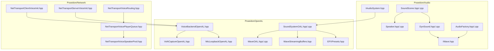
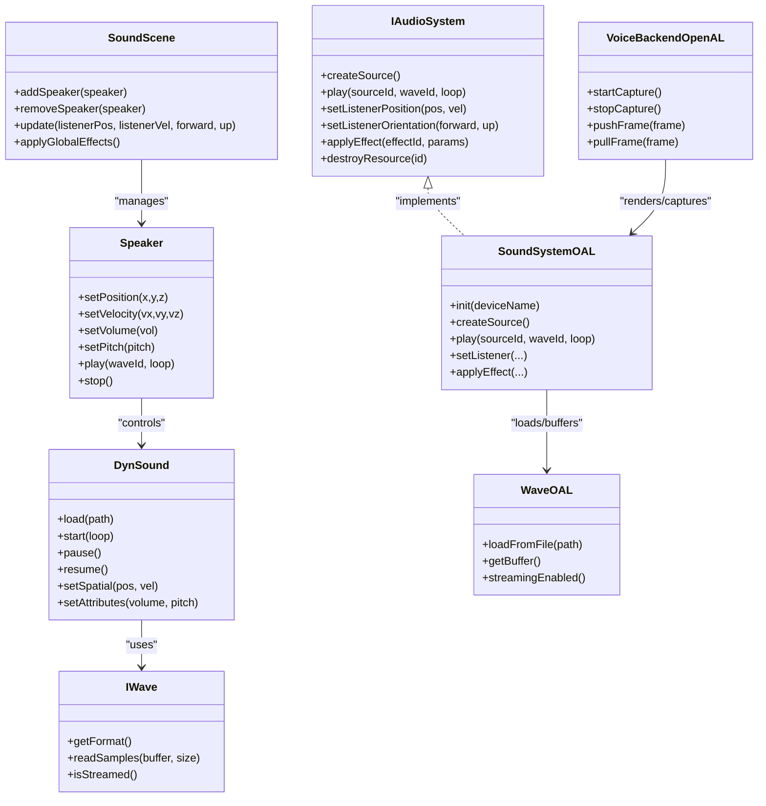
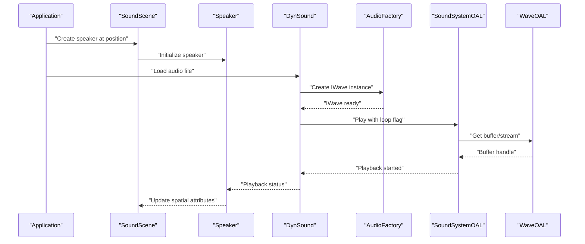
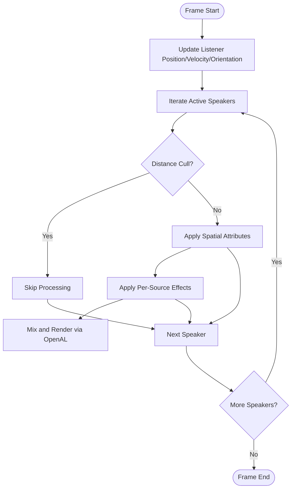
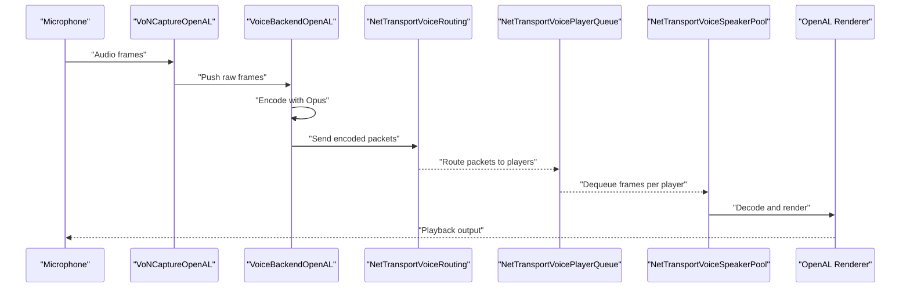
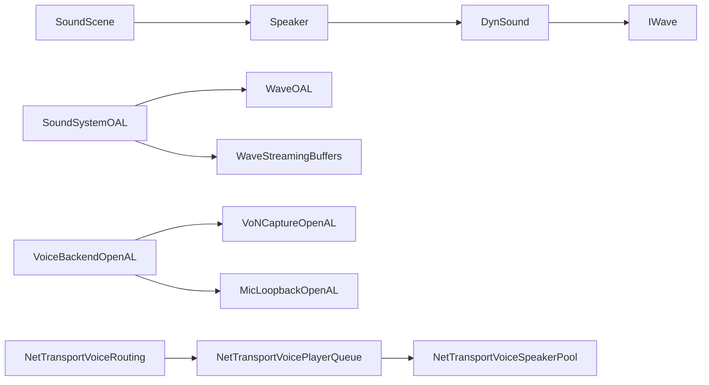

# Audio System

<cite>
**Referenced Files in This Document**
- [IAudioSystem.hpp](file://engine/Poseidon/Audio/IAudioSystem.hpp)
- [SoundScene.hpp](file://engine/Poseidon/Audio/SoundScene.hpp)
- [SoundScene.cpp](file://engine/Poseidon/Audio/SoundScene.cpp)
- [Speaker.hpp](file://engine/Poseidon/Audio/Speaker.hpp)
- [Speaker.cpp](file://engine/Poseidon/Audio/Speaker.cpp)
- [DynSound.hpp](file://engine/Poseidon/Audio/DynSound.hpp)
- [DynSound.cpp](file://engine/Poseidon/Audio/DynSound.cpp)
- [IWave.hpp](file://engine/Poseidon/Audio/IWave.hpp)
- [AudioFactory.hpp](file://engine/Poseidon/Audio/AudioFactory.hpp)
- [AudioFactory.cpp](file://engine/Poseidon/Audio/AudioFactory.cpp)
- [SoundSystemOAL.hpp](file://engine/PoseidonOpenAL/SoundSystemOAL.hpp)
- [SoundSystemOAL.cpp](file://engine/PoseidonOpenAL/SoundSystemOAL.cpp)
- [WaveOAL.hpp](file://engine/PoseidonOpenAL/WaveOAL.hpp)
- [WaveOAL.cpp](file://engine/PoseidonOpenAL/WaveOAL.cpp)
- [WaveStreamingBuffers.hpp](file://engine/PoseidonOpenAL/WaveStreamingBuffers.hpp)
- [EFXPresets.hpp](file://engine/PoseidonOpenAL/EFXPresets.hpp)
- [VoiceBackendOpenAL.hpp](file://engine/PoseidonOpenAL/Voice/VoiceBackendOpenAL.hpp)
- [VoNCaptureOpenAL.hpp](file://engine/PoseidonOpenAL/Voice/VoNCaptureOpenAL.hpp)
- [MicLoopbackOpenAL.hpp](file://engine/PoseidonOpenAL/Voice/MicLoopbackOpenAL.hpp)
- [NetTransportClientVoiceInit.hpp](file://engine/Poseidon/Network/NetTransportClientVoiceInit.hpp)
- [NetTransportServerVoiceInit.hpp](file://engine/Poseidon/Network/NetTransportServerVoiceInit.hpp)
- [NetTransportVoiceRouting.hpp](file://engine/Poseidon/Network/NetTransportVoiceRouting.hpp)
- [NetTransportVoicePlayerQueue.hpp](file://engine/Poseidon/Network/NetTransportVoicePlayerQueue.hpp)
- [NetTransportVoiceSpeakerPool.hpp](file://engine/Poseidon/Network/NetTransportVoiceSpeakerPool.hpp)
</cite>

## Table of Contents
1. [Introduction](#introduction)
2. [Project Structure](#project-structure)
3. [Core Components](#core-components)
4. [Architecture Overview](#architecture-overview)
5. [Detailed Component Analysis](#detailed-component-analysis)
6. [Dependency Analysis](#dependency-analysis)
7. [Performance Considerations](#performance-considerations)
8. [Troubleshooting Guide](#troubleshooting-guide)
9. [Conclusion](#conclusion)
10. [Appendices](#appendices)

## Introduction
This document describes the multi-format sound engine with OpenAL integration, focusing on the IAudioSystem interface design and its OpenAL backend implementation. It explains spatial audio, streaming, and voice communication features, as well as the SoundScene architecture for managing 3D audio objects and effects. The guide also covers supported audio formats (WAV, OGG, VOX), compression schemes, memory management strategies, and practical examples for custom sources, applying effects, and optimizing performance. Configuration options for quality, buffer sizes, and device selection are documented alongside cross-platform considerations and debugging techniques.

## Project Structure
The audio system is organized into a clear separation between the abstract interface and platform-specific implementations:
- Abstract audio API and scene management live under engine/Poseidon/Audio.
- OpenAL backend implementation lives under engine/PoseidonOpenAL.
- Voice chat components span both Poseidon/Audio/Voice and Poseidon/Network modules.

**Diagram sources**
- [IAudioSystem.hpp](file://engine/Poseidon/Audio/IAudioSystem.hpp)
- [SoundScene.hpp](file://engine/Poseidon/Audio/SoundScene.hpp)
- [SoundScene.cpp](file://engine/Poseidon/Audio/SoundScene.cpp)
- [Speaker.hpp](file://engine/Poseidon/Audio/Speaker.hpp)
- [Speaker.cpp](file://engine/Poseidon/Audio/Speaker.cpp)
- [DynSound.hpp](file://engine/Poseidon/Audio/DynSound.hpp)
- [DynSound.cpp](file://engine/Poseidon/Audio/DynSound.cpp)
- [IWave.hpp](file://engine/Poseidon/Audio/IWave.hpp)
- [AudioFactory.hpp](file://engine/Poseidon/Audio/AudioFactory.hpp)
- [AudioFactory.cpp](file://engine/Poseidon/Audio/AudioFactory.cpp)
- [SoundSystemOAL.hpp](file://engine/PoseidonOpenAL/SoundSystemOAL.hpp)
- [SoundSystemOAL.cpp](file://engine/PoseidonOpenAL/SoundSystemOAL.cpp)
- [WaveOAL.hpp](file://engine/PoseidonOpenAL/WaveOAL.hpp)
- [WaveOAL.cpp](file://engine/PoseidonOpenAL/WaveOAL.cpp)
- [WaveStreamingBuffers.hpp](file://engine/PoseidonOpenAL/WaveStreamingBuffers.hpp)
- [EFXPresets.hpp](file://engine/PoseidonOpenAL/EFXPresets.hpp)
- [VoiceBackendOpenAL.hpp](file://engine/PoseidonOpenAL/Voice/VoiceBackendOpenAL.hpp)
- [VoNCaptureOpenAL.hpp](file://engine/PoseidonOpenAL/Voice/VoNCaptureOpenAL.hpp)
- [MicLoopbackOpenAL.hpp](file://engine/PoseidonOpenAL/Voice/MicLoopbackOpenAL.hpp)
- [NetTransportClientVoiceInit](file://engine/Poseidon/Network/NetTransportClientVoiceInit.hpp)
- [NetTransportServerVoiceInit](file://engine/Poseidon/Network/NetTransportServerVoiceInit.hpp)
- [NetTransportVoiceRouting](file://engine/Poseidon/Network/NetTransportVoiceRouting.hpp)
- [NetTransportVoicePlayerQueue](file://engine/Poseidon/Network/NetTransportVoicePlayerQueue.hpp)
- [NetTransportVoiceSpeakerPool](file://engine/Poseidon/Network/NetTransportVoiceSpeakerPool.hpp)

**Section sources**
- [IAudioSystem.hpp](file://engine/Poseidon/Audio/IAudioSystem.hpp)
- [SoundScene.hpp](file://engine/Poseidon/Audio/SoundScene.hpp)
- [SoundScene.cpp](file://engine/Poseidon/Audio/SoundScene.cpp)
- [Speaker.hpp](file://engine/Poseidon/Audio/Speaker.hpp)
- [Speaker.cpp](file://engine/Poseidon/Audio/Speaker.cpp)
- [DynSound.hpp](file://engine/Poseidon/Audio/DynSound.hpp)
- [DynSound.cpp](file://engine/Poseidon/Audio/DynSound.cpp)
- [IWave.hpp](file://engine/Poseidon/Audio/IWave.hpp)
- [AudioFactory.hpp](file://engine/Poseidon/Audio/AudioFactory.hpp)
- [AudioFactory.cpp](file://engine/Poseidon/Audio/AudioFactory.cpp)
- [SoundSystemOAL.hpp](file://engine/PoseidonOpenAL/SoundSystemOAL.hpp)
- [SoundSystemOAL.cpp](file://engine/PoseidonOpenAL/SoundSystemOAL.cpp)
- [WaveOAL.hpp](file://engine/PoseidonOpenAL/WaveOAL.hpp)
- [WaveOAL.cpp](file://engine/PoseidonOpenAL/WaveOAL.cpp)
- [WaveStreamingBuffers.hpp](file://engine/PoseidonOpenAL/WaveStreamingBuffers.hpp)
- [EFXPresets.hpp](file://engine/PoseidonOpenAL/EFXPresets.hpp)
- [VoiceBackendOpenAL.hpp](file://engine/PoseidonOpenAL/Voice/VoiceBackendOpenAL.hpp)
- [VoNCaptureOpenAL.hpp](file://engine/PoseidonOpenAL/Voice/VoNCaptureOpenAL.hpp)
- [MicLoopbackOpenAL.hpp](file://engine/PoseidonOpenAL/Voice/MicLoopbackOpenAL.hpp)
- [NetTransportClientVoiceInit](file://engine/Poseidon/Network/NetTransportClientVoiceInit.hpp)
- [NetTransportServerVoiceInit](file://engine/Poseidon/Network/NetTransportServerVoiceInit.hpp)
- [NetTransportVoiceRouting](file://engine/Poseidon/Network/NetTransportVoiceRouting.hpp)
- [NetTransportVoicePlayerQueue](file://engine/Poseidon/Network/NetTransportVoicePlayerQueue.hpp)
- [NetTransportVoiceSpeakerPool](file://engine/Poseidon/Network/NetTransportVoiceSpeakerPool.hpp)

## Core Components
- IAudioSystem: Defines the abstract audio API used by the engine to create, manage, and play sounds independent of the underlying backend.
- SoundScene: Manages audio objects, their 3D positions, listener state, and applies global or per-source effects.
- Speaker: Represents an audio emitter/source with position, orientation, and playback controls.
- DynSound: Dynamic sound wrapper that handles lifecycle, looping, volume, pitch, and spatial attributes.
- IWave: Abstraction over decoded audio data streams and buffers.
- AudioFactory: Creates wave instances from various formats and manages resource loading.
- OpenAL Backend (SoundSystemOAL): Implements IAudioSystem using OpenAL, including EFX effects and streaming.
- WaveOAL: OpenAL-backed wave loader and buffer manager.
- WaveStreamingBuffers: Streaming pipeline for large audio files to avoid full memory loads.
- VoiceBackendOpenAL: Captures and renders voice audio via OpenAL.
- Network Voice Transport: Client/server voice initialization, routing, player queues, and speaker pools.

**Section sources**
- [IAudioSystem.hpp](file://engine/Poseidon/Audio/IAudioSystem.hpp)
- [SoundScene.hpp](file://engine/Poseidon/Audio/SoundScene.hpp)
- [Speaker.hpp](file://engine/Poseidon/Audio/Speaker.hpp)
- [DynSound.hpp](file://engine/Poseidon/Audio/DynSound.hpp)
- [IWave.hpp](file://engine/Poseidon/Audio/IWave.hpp)
- [AudioFactory.hpp](file://engine/Poseidon/Audio/AudioFactory.hpp)
- [SoundSystemOAL.hpp](file://engine/PoseidonOpenAL/SoundSystemOAL.hpp)
- [WaveOAL.hpp](file://engine/PoseidonOpenAL/WaveOAL.hpp)
- [WaveStreamingBuffers.hpp](file://engine/PoseidonOpenAL/WaveStreamingBuffers.hpp)
- [VoiceBackendOpenAL.hpp](file://engine/PoseidonOpenAL/Voice/VoiceBackendOpenAL.hpp)

## Architecture Overview
The audio system follows a layered architecture:
- Interface Layer: IAudioSystem exposes a stable API for creating and controlling audio resources.
- Scene Layer: SoundScene orchestrates speakers, listeners, and effects.
- Backend Layer: OpenAL implementation provides hardware-accelerated mixing, spatialization, and effects.
- Voice Layer: Opus-based voice capture and playback integrated with network transport.

**Diagram sources**
- [IAudioSystem.hpp](file://engine/Poseidon/Audio/IAudioSystem.hpp)
- [SoundScene.hpp](file://engine/Poseidon/Audio/SoundScene.hpp)
- [Speaker.hpp](file://engine/Poseidon/Audio/Speaker.hpp)
- [DynSound.hpp](file://engine/Poseidon/Audio/DynSound.hpp)
- [IWave.hpp](file://engine/Poseidon/Audio/IWave.hpp)
- [SoundSystemOAL.hpp](file://engine/PoseidonOpenAL/SoundSystemOAL.hpp)
- [WaveOAL.hpp](file://engine/PoseidonOpenAL/WaveOAL.hpp)
- [VoiceBackendOpenAL.hpp](file://engine/PoseidonOpenAL/Voice/VoiceBackendOpenAL.hpp)

## Detailed Component Analysis

### IAudioSystem Interface Design
- Purpose: Provide a backend-agnostic API for audio creation, playback, listener control, and effect application.
- Key responsibilities:
  - Source creation and lifecycle management.
  - Playback control (play, pause, stop).
  - Listener positioning and orientation updates.
  - Effect binding and parameter updates.
  - Resource destruction and cleanup.
- Design principles:
  - Minimal, stable interface surface for engine code.
  - Separation of concerns between scene logic and hardware specifics.
  - Extensibility for alternative backends beyond OpenAL.

**Section sources**
- [IAudioSystem.hpp](file://engine/Poseidon/Audio/IAudioSystem.hpp)

### OpenAL Backend Implementation
- SoundSystemOAL: Implements IAudioSystem using OpenAL, handling device initialization, context setup, source management, and EFX integration.
- WaveOAL: Loads WAV/OGG/VOX data into OpenAL buffers; supports streaming for large assets.
- WaveStreamingBuffers: Manages ring buffers and asynchronous refill to maintain continuous playback without blocking.
- EFXPresets: Predefined effect configurations (reverb, echo, etc.) applied to sources or groups.

**Diagram sources**
- [SoundScene.hpp](file://engine/Poseidon/Audio/SoundScene.hpp)
- [Speaker.hpp](file://engine/Poseidon/Audio/Speaker.hpp)
- [DynSound.hpp](file://engine/Poseidon/Audio/DynSound.hpp)
- [AudioFactory.hpp](file://engine/Poseidon/Audio/AudioFactory.hpp)
- [SoundSystemOAL.hpp](file://engine/PoseidonOpenAL/SoundSystemOAL.hpp)
- [WaveOAL.hpp](file://engine/PoseidonOpenAL/WaveOAL.hpp)

**Section sources**
- [SoundSystemOAL.hpp](file://engine/PoseidonOpenAL/SoundSystemOAL.hpp)
- [SoundSystemOAL.cpp](file://engine/PoseidonOpenAL/SoundSystemOAL.cpp)
- [WaveOAL.hpp](file://engine/PoseidonOpenAL/WaveOAL.hpp)
- [WaveOAL.cpp](file://engine/PoseidonOpenAL/WaveOAL.cpp)
- [WaveStreamingBuffers.hpp](file://engine/PoseidonOpenAL/WaveStreamingBuffers.hpp)
- [EFXPresets.hpp](file://engine/PoseidonOpenAL/EFXPresets.hpp)

### SoundScene Architecture
- Responsibilities:
  - Manage collection of speakers and their lifecycle.
  - Update listener position, velocity, and orientation each frame.
  - Apply global or per-source audio effects.
  - Optimize culling and distance-based attenuation.
- Spatial audio:
  - Uses 3D coordinates and velocities for Doppler and attenuation.
  - Integrates with OpenAL’s positional audio capabilities.
- Effects:
  - Supports reverb, delay, and other EFX presets.
  - Allows dynamic parameter changes during runtime.

**Diagram sources**
- [SoundScene.hpp](file://engine/Poseidon/Audio/SoundScene.hpp)
- [SoundScene.cpp](file://engine/Poseidon/Audio/SoundScene.cpp)
- [Speaker.hpp](file://engine/Poseidon/Audio/Speaker.hpp)
- [EFXPresets.hpp](file://engine/PoseidonOpenAL/EFXPresets.hpp)

**Section sources**
- [SoundScene.hpp](file://engine/Poseidon/Audio/SoundScene.hpp)
- [SoundScene.cpp](file://engine/Poseidon/Audio/SoundScene.cpp)
- [Speaker.hpp](file://engine/Poseidon/Audio/Speaker.hpp)
- [Speaker.cpp](file://engine/Poseidon/Audio/Speaker.cpp)

### Audio Formats and Compression
- Supported formats:
  - WAV: Uncompressed PCM; ideal for short SFX.
  - OGG: Compressed Vorbis; suitable for long music tracks.
  - VOX: ADPCM variant; compact speech samples.
- Decoding strategy:
  - IWave abstraction decodes on demand; streaming enabled for large files.
  - AudioFactory selects appropriate decoder based on file extension/mime type.
- Memory management:
  - In-memory buffers for small clips.
  - Streaming buffers for large assets to reduce peak memory usage.
  - Reference counting and lazy loading where applicable.

**Section sources**
- [IWave.hpp](file://engine/Poseidon/Audio/IWave.hpp)
- [AudioFactory.hpp](file://engine/Poseidon/Audio/AudioFactory.hpp)
- [AudioFactory.cpp](file://engine/Poseidon/Audio/AudioFactory.cpp)
- [WaveOAL.hpp](file://engine/PoseidonOpenAL/WaveOAL.hpp)
- [WaveStreamingBuffers.hpp](file://engine/PoseidonOpenAL/WaveStreamingBuffers.hpp)

### Voice Chat System (Opus Codec)
- Capture and playback:
  - VoiceBackendOpenAL captures microphone input and renders remote audio via OpenAL.
  - MicLoopbackOpenAL enables local monitoring if desired.
- Network integration:
  - NetTransportClientVoiceInit and NetTransportServerVoiceInit handle voice session setup.
  - NetTransportVoiceRouting routes captured frames to peers.
  - NetTransportVoicePlayerQueue buffers incoming frames per player.
  - NetTransportVoiceSpeakerPool manages speaker instances for multiple voices.
- Real-time processing:
  - Opus codec encodes/decodes voice frames with low latency.
  - Jitter buffering and packet loss concealment ensure smooth playback.

**Diagram sources**
- [VoNCaptureOpenAL.hpp](file://engine/PoseidonOpenAL/Voice/VoNCaptureOpenAL.hpp)
- [VoiceBackendOpenAL.hpp](file://engine/PoseidonOpenAL/Voice/VoiceBackendOpenAL.hpp)
- [NetTransportClientVoiceInit.hpp](file://engine/Poseidon/Network/NetTransportClientVoiceInit.hpp)
- [NetTransportServerVoiceInit.hpp](file://engine/Poseidon/Network/NetTransportServerVoiceInit.hpp)
- [NetTransportVoiceRouting.hpp](file://engine/Poseidon/Network/NetTransportVoiceRouting.hpp)
- [NetTransportVoicePlayerQueue.hpp](file://engine/Poseidon/Network/NetTransportVoicePlayerQueue.hpp)
- [NetTransportVoiceSpeakerPool.hpp](file://engine/Poseidon/Network/NetTransportVoiceSpeakerPool.hpp)

**Section sources**
- [VoiceBackendOpenAL.hpp](file://engine/PoseidonOpenAL/Voice/VoiceBackendOpenAL.hpp)
- [VoNCaptureOpenAL.hpp](file://engine/PoseidonOpenAL/Voice/VoNCaptureOpenAL.hpp)
- [MicLoopbackOpenAL.hpp](file://engine/PoseidonOpenAL/Voice/MicLoopbackOpenAL.hpp)
- [NetTransportClientVoiceInit.hpp](file://engine/Poseidon/Network/NetTransportClientVoiceInit.hpp)
- [NetTransportServerVoiceInit.hpp](file://engine/Poseidon/Network/NetTransportServerVoiceInit.hpp)
- [NetTransportVoiceRouting.hpp](file://engine/Poseidon/Network/NetTransportVoiceRouting.hpp)
- [NetTransportVoicePlayerQueue.hpp](file://engine/Poseidon/Network/NetTransportVoicePlayerQueue.hpp)
- [NetTransportVoiceSpeakerPool.hpp](file://engine/Poseidon/Network/NetTransportVoiceSpeakerPool.hpp)

## Dependency Analysis
- Coupling:
  - SoundScene depends on Speaker and DynSound for object management.
  - DynSound depends on IWave for audio data access.
  - OpenAL backend depends on WaveOAL and streaming buffers for playback.
- Cohesion:
  - Each module has a focused responsibility (scene, speaker, wave, backend, voice).
- External dependencies:
  - OpenAL for audio rendering and EFX.
  - Opus for voice encoding/decoding.
  - Network transport for voice distribution.

**Diagram sources**
- [SoundScene.hpp](file://engine/Poseidon/Audio/SoundScene.hpp)
- [Speaker.hpp](file://engine/Poseidon/Audio/Speaker.hpp)
- [DynSound.hpp](file://engine/Poseidon/Audio/DynSound.hpp)
- [IWave.hpp](file://engine/Poseidon/Audio/IWave.hpp)
- [SoundSystemOAL.hpp](file://engine/PoseidonOpenAL/SoundSystemOAL.hpp)
- [WaveOAL.hpp](file://engine/PoseidonOpenAL/WaveOAL.hpp)
- [WaveStreamingBuffers.hpp](file://engine/PoseidonOpenAL/WaveStreamingBuffers.hpp)
- [VoiceBackendOpenAL.hpp](file://engine/PoseidonOpenAL/Voice/VoiceBackendOpenAL.hpp)
- [VoNCaptureOpenAL.hpp](file://engine/PoseidonOpenAL/Voice/VoNCaptureOpenAL.hpp)
- [MicLoopbackOpenAL.hpp](file://engine/PoseidonOpenAL/Voice/MicLoopbackOpenAL.hpp)
- [NetTransportVoiceRouting.hpp](file://engine/Poseidon/Network/NetTransportVoiceRouting.hpp)
- [NetTransportVoicePlayerQueue.hpp](file://engine/Poseidon/Network/NetTransportVoicePlayerQueue.hpp)
- [NetTransportVoiceSpeakerPool.hpp](file://engine/Poseidon/Network/NetTransportVoiceSpeakerPool.hpp)

**Section sources**
- [SoundScene.hpp](file://engine/Poseidon/Audio/SoundScene.hpp)
- [Speaker.hpp](file://engine/Poseidon/Audio/Speaker.hpp)
- [DynSound.hpp](file://engine/Poseidon/Audio/DynSound.hpp)
- [IWave.hpp](file://engine/Poseidon/Audio/IWave.hpp)
- [SoundSystemOAL.hpp](file://engine/PoseidonOpenAL/SoundSystemOAL.hpp)
- [WaveOAL.hpp](file://engine/PoseidonOpenAL/WaveOAL.hpp)
- [WaveStreamingBuffers.hpp](file://engine/PoseidonOpenAL/WaveStreamingBuffers.hpp)
- [VoiceBackendOpenAL.hpp](file://engine/PoseidonOpenAL/Voice/VoiceBackendOpenAL.hpp)
- [VoNCaptureOpenAL.hpp](file://engine/PoseidonOpenAL/Voice/VoNCaptureOpenAL.hpp)
- [MicLoopbackOpenAL.hpp](file://engine/PoseidonOpenAL/Voice/MicLoopbackOpenAL.hpp)
- [NetTransportVoiceRouting.hpp](file://engine/Poseidon/Network/NetTransportVoiceRouting.hpp)
- [NetTransportVoicePlayerQueue.hpp](file://engine/Poseidon/Network/NetTransportVoicePlayerQueue.hpp)
- [NetTransportVoiceSpeakerPool.hpp](file://engine/Poseidon/Network/NetTransportVoiceSpeakerPool.hpp)

## Performance Considerations
- Buffer sizing:
  - Tune OpenAL buffer sizes to balance latency and CPU usage.
  - Use streaming for large assets to avoid memory spikes.
- Threading:
  - Keep audio thread separate from game logic to prevent stutter.
  - Use lock-free queues for voice frames where possible.
- Culling and attenuation:
  - Implement distance-based culling to reduce active sources.
  - Adjust attenuation curves for realistic spatial audio.
- Effects:
  - Limit number of active EFX effects per frame.
  - Reuse effect instances and update parameters efficiently.
- Format selection:
  - Prefer compressed formats (OGG/VOX) for long audio to save memory.
  - Use uncompressed WAV only for short, frequently triggered SFX.

[No sources needed since this section provides general guidance]

## Troubleshooting Guide
- Common issues:
  - No audio output: Verify device initialization and context creation in OpenAL backend.
  - Cracks/pops: Increase buffer sizes or adjust streaming refill intervals.
  - High CPU usage: Reduce active sources, disable unnecessary effects, or switch to streaming.
  - Voice dropouts: Increase jitter buffer size or improve network reliability.
- Debugging techniques:
  - Log source states and buffer statuses.
  - Visualize listener and speaker positions to validate spatial calculations.
  - Profile audio thread to identify bottlenecks.
  - Use OpenAL debug extensions if available.

**Section sources**
- [SoundSystemOAL.hpp](file://engine/PoseidonOpenAL/SoundSystemOAL.hpp)
- [SoundSystemOAL.cpp](file://engine/PoseidonOpenAL/SoundSystemOAL.cpp)
- [WaveOAL.hpp](file://engine/PoseidonOpenAL/WaveOAL.hpp)
- [WaveStreamingBuffers.hpp](file://engine/PoseidonOpenAL/WaveStreamingBuffers.hpp)
- [VoiceBackendOpenAL.hpp](file://engine/PoseidonOpenAL/Voice/VoiceBackendOpenAL.hpp)

## Conclusion
The audio system provides a robust, extensible foundation for multi-format sound playback, spatial audio, and real-time voice communication. By separating the interface from the OpenAL backend and leveraging streaming and effects, it achieves high performance and flexibility. Proper configuration, memory management, and debugging practices ensure reliable operation across platforms.

[No sources needed since this section summarizes without analyzing specific files]

## Appendices

### Practical Examples
- Custom audio source:
  - Create a subclass of IWave to decode a proprietary format.
  - Integrate with AudioFactory to support new file types.
- Applying effects:
  - Bind EFX presets to sources or groups via IAudioSystem.
  - Update parameters dynamically for interactive experiences.
- Optimizing performance:
  - Use streaming for large assets.
  - Implement distance culling and limit active effects.

[No sources needed since this section provides general guidance]

### Configuration Options
- Audio quality:
  - Sample rate, bit depth, and channel count settings.
- Buffer sizes:
  - OpenAL buffer and stream buffer tuning.
- Device selection:
  - Default device enumeration and user override.

[No sources needed since this section provides general guidance]

### Cross-Platform Considerations
- OpenAL Soft vs native OpenAL:
  - Ensure consistent behavior across Windows, Linux, and macOS.
- Input/output devices:
  - Handle platform-specific device naming and permissions.
- Latency and scheduling:
  - Adjust buffer sizes based on platform audio subsystem characteristics.

[No sources needed since this section provides general guidance]