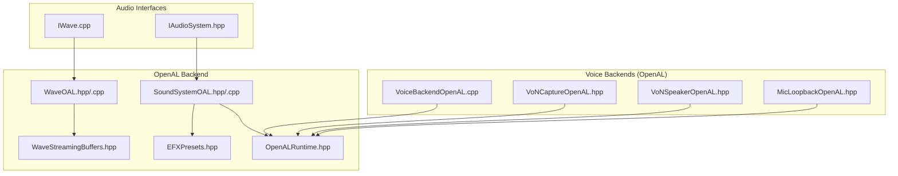
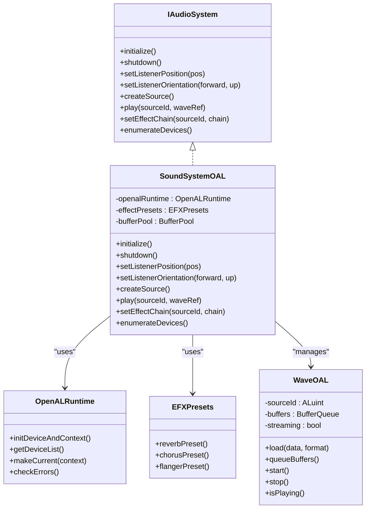
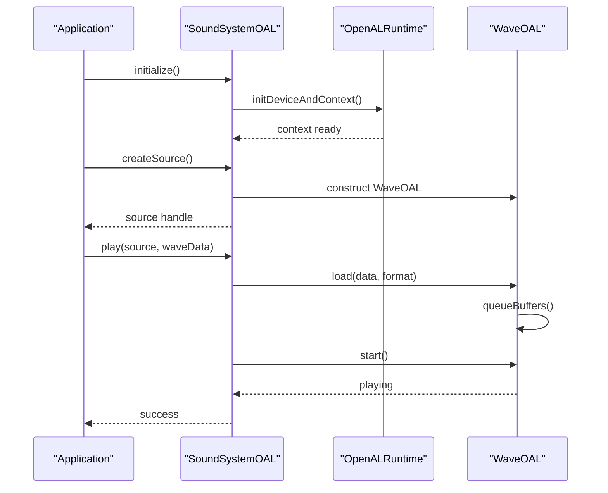
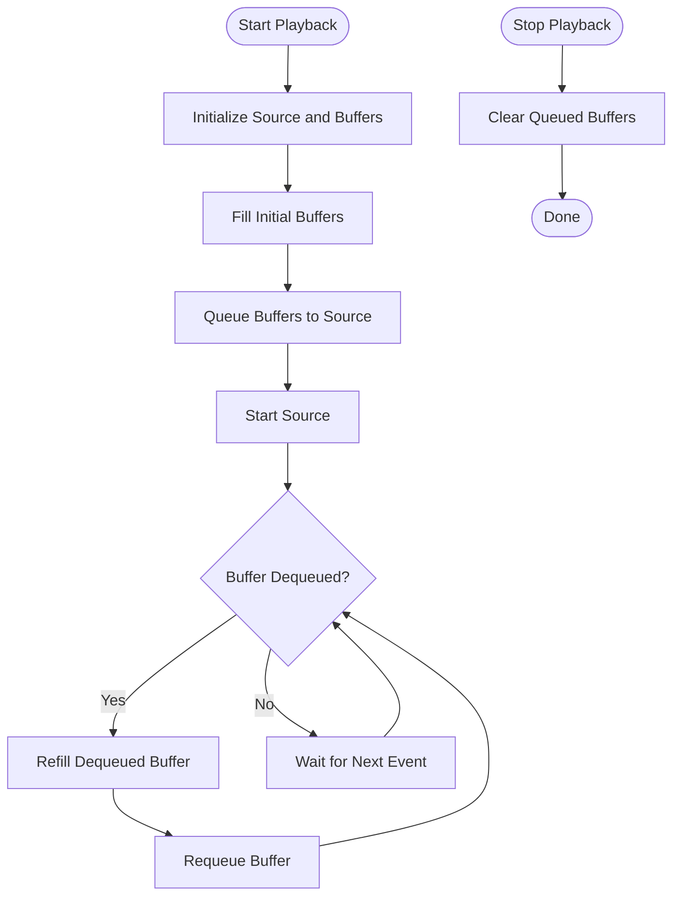
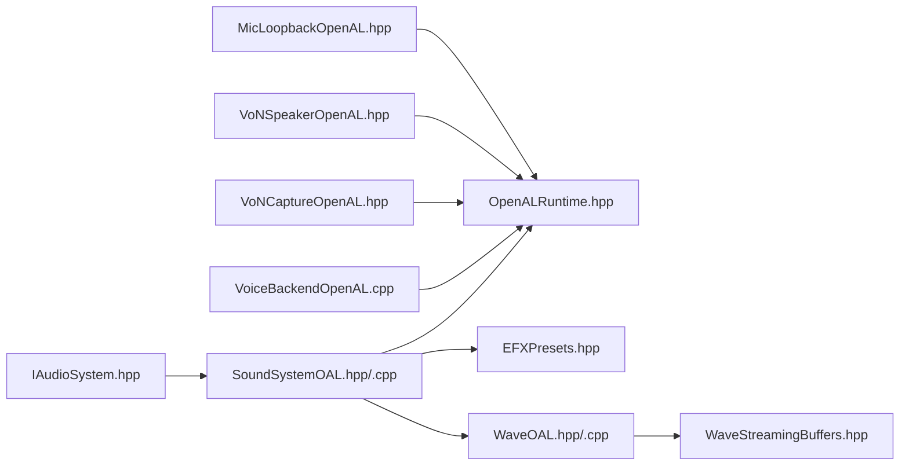

# OpenAL Backend Implementation

<cite>
**Referenced Files in This Document**
- [IAudioSystem.hpp](file://engine/Poseidon/Audio/IAudioSystem.hpp)
- [SoundSystemOAL.hpp](file://engine/PoseidonOpenAL/SoundSystemOAL.hpp)
- [SoundSystemOAL.cpp](file://engine/PoseidonOpenAL/SoundSystemOAL.cpp)
- [WaveOAL.hpp](file://engine/PoseidonOpenAL/WaveOAL.hpp)
- [WaveOAL.cpp](file://engine/PoseidonOpenAL/WaveOAL.cpp)
- [WaveStreamingBuffers.hpp](file://engine/PoseidonOpenAL/WaveStreamingBuffers.hpp)
- [EFXPresets.hpp](file://engine/PoseidonOpenAL/EFXPresets.hpp)
- [OpenALRuntime.hpp](file://engine/PoseidonOpenAL/OpenALRuntime.hpp)
- [VoiceBackendOpenAL.cpp](file://engine/PoseidonOpenAL/Voice/VoiceBackendOpenAL.cpp)
- [VoNCaptureOpenAL.hpp](file://engine/PoseidonOpenAL/Voice/VoNCaptureOpenAL.hpp)
- [VoNSpeakerOpenAL.hpp](file://engine/PoseidonOpenAL/Voice/VoNSpeakerOpenAL.hpp)
- [MicLoopbackOpenAL.hpp](file://engine/PoseidonOpenAL/Voice/MicLoopbackOpenAL.hpp)
</cite>

## Table of Contents
1. Introduction
2. Project Structure
3. Core Components
4. Architecture Overview
5. Detailed Component Analysis
6. Dependency Analysis
7. Performance Considerations
8. Troubleshooting Guide
9. Conclusion

## Introduction
This document explains the OpenAL backend implementation used by the engine’s audio subsystem. It focuses on how the SoundSystemOAL class implements the IAudioSystem interface using OpenAL for hardware-accelerated audio, and how WaveOAL provides efficient audio streaming and buffer management. It also covers OpenAL runtime initialization, device enumeration, context management, EFX presets for audio effects, spatial audio configuration, and performance tuning options. Practical guidance is included for configuring OpenAL parameters, handling audio device changes, optimizing latency, addressing cross-platform considerations, and debugging OpenAL-based implementations.

## Project Structure
The OpenAL backend resides under engine/PoseidonOpenAL and integrates with the shared audio interfaces defined in engine/Poseidon/Audio. The key files include:
- Interface definitions for the audio system and wave sources
- OpenAL-specific sound system and wave implementation
- Streaming buffer utilities
- EFX preset definitions
- OpenAL runtime abstraction
- Voice capture/speaker backends built on OpenAL

**Diagram sources**
- [IAudioSystem.hpp](file://engine/Poseidon/Audio/IAudioSystem.hpp)
- [IWave.cpp](file://engine/Poseidon/Audio/IWave.cpp)
- [SoundSystemOAL.hpp](file://engine/PoseidonOpenAL/SoundSystemOAL.hpp)
- [SoundSystemOAL.cpp](file://engine/PoseidonOpenAL/SoundSystemOAL.cpp)
- [WaveOAL.hpp](file://engine/PoseidonOpenAL/WaveOAL.hpp)
- [WaveOAL.cpp](file://engine/PoseidonOpenAL/WaveOAL.cpp)
- [WaveStreamingBuffers.hpp](file://engine/PoseidonOpenAL/WaveStreamingBuffers.hpp)
- [EFXPresets.hpp](file://engine/PoseidonOpenAL/EFXPresets.hpp)
- [OpenALRuntime.hpp](file://engine/PoseidonOpenAL/OpenALRuntime.hpp)
- [VoiceBackendOpenAL.cpp](file://engine/PoseidonOpenAL/Voice/VoiceBackendOpenAL.cpp)
- [VoNCaptureOpenAL.hpp](file://engine/PoseidonOpenAL/Voice/VoNCaptureOpenAL.hpp)
- [VoNSpeakerOpenAL.hpp](file://engine/PoseidonOpenAL/Voice/VoNSpeakerOpenAL.hpp)
- [MicLoopbackOpenAL.hpp](file://engine/PoseidonOpenAL/Voice/MicLoopbackOpenAL.hpp)

**Section sources**
- [IAudioSystem.hpp](file://engine/Poseidon/Audio/IAudioSystem.hpp)
- [SoundSystemOAL.hpp](file://engine/PoseidonOpenAL/SoundSystemOAL.hpp)
- [SoundSystemOAL.cpp](file://engine/PoseidonOpenAL/SoundSystemOAL.cpp)
- [WaveOAL.hpp](file://engine/PoseidonOpenAL/WaveOAL.hpp)
- [WaveOAL.cpp](file://engine/PoseidonOpenAL/WaveOAL.cpp)
- [WaveStreamingBuffers.hpp](file://engine/PoseidonOpenAL/WaveStreamingBuffers.hpp)
- [EFXPresets.hpp](file://engine/PoseidonOpenAL/EFXPresets.hpp)
- [OpenALRuntime.hpp](file://engine/PoseidonOpenAL/OpenALRuntime.hpp)
- [VoiceBackendOpenAL.cpp](file://engine/PoseidonOpenAL/Voice/VoiceBackendOpenAL.cpp)
- [VoNCaptureOpenAL.hpp](file://engine/PoseidonOpenAL/Voice/VoNCaptureOpenAL.hpp)
- [VoNSpeakerOpenAL.hpp](file://engine/PoseidonOpenAL/Voice/VoNSpeakerOpenAL.hpp)
- [MicLoopbackOpenAL.hpp](file://engine/PoseidonOpenAL/Voice/MicLoopbackOpenAL.hpp)

## Core Components
- IAudioSystem: Defines the abstract audio system interface that concrete backends implement.
- SoundSystemOAL: OpenAL-backed implementation of IAudioSystem, responsible for device/context lifecycle, mixing, effects, and spatial audio.
- WaveOAL: OpenAL-backed wave source providing efficient playback and streaming via buffers.
- WaveStreamingBuffers: Utility for managing OpenAL buffer queues to stream large audio data efficiently.
- EFXPresets: Predefined OpenAL EFX effect chains for reverb, chorus, flanger, etc.
- OpenALRuntime: Abstraction over OpenAL entry points, device enumeration, and context creation.
- Voice backends: OpenAL-based capture and speaker implementations for voice chat and loopback.

Key responsibilities:
- Device enumeration and selection
- Context creation and attribute configuration
- Buffer allocation and streaming pipeline
- Effect chain setup and parameterization
- Spatial positioning and listener updates
- Error handling and diagnostics

**Section sources**
- [IAudioSystem.hpp](file://engine/Poseidon/Audio/IAudioSystem.hpp)
- [SoundSystemOAL.hpp](file://engine/PoseidonOpenAL/SoundSystemOAL.hpp)
- [SoundSystemOAL.cpp](file://engine/PoseidonOpenAL/SoundSystemOAL.cpp)
- [WaveOAL.hpp](file://engine/PoseidonOpenAL/WaveOAL.hpp)
- [WaveOAL.cpp](file://engine/PoseidonOpenAL/WaveOAL.cpp)
- [WaveStreamingBuffers.hpp](file://engine/PoseidonOpenAL/WaveStreamingBuffers.hpp)
- [EFXPresets.hpp](file://engine/PoseidonOpenAL/EFXPresets.hpp)
- [OpenALRuntime.hpp](file://engine/PoseidonOpenAL/OpenALRuntime.hpp)
- [VoiceBackendOpenAL.cpp](file://engine/PoseidonOpenAL/Voice/VoiceBackendOpenAL.cpp)
- [VoNCaptureOpenAL.hpp](file://engine/PoseidonOpenAL/Voice/VoNCaptureOpenAL.hpp)
- [VoNSpeakerOpenAL.hpp](file://engine/PoseidonOpenAL/Voice/VoNSpeakerOpenAL.hpp)
- [MicLoopbackOpenAL.hpp](file://engine/PoseidonOpenAL/Voice/MicLoopbackOpenAL.hpp)

## Architecture Overview
The OpenAL backend composes a layered architecture:
- Application layer calls into IAudioSystem methods.
- SoundSystemOAL translates these calls into OpenAL operations via OpenALRuntime.
- WaveOAL manages per-source playback state and buffer queues.
- EFXPresets provide reusable effect configurations applied to sources or auxiliary buses.
- Voice backends use OpenAL for capture and playback paths.

**Diagram sources**
- [IAudioSystem.hpp](file://engine/Poseidon/Audio/IAudioSystem.hpp)
- [SoundSystemOAL.hpp](file://engine/PoseidonOpenAL/SoundSystemOAL.hpp)
- [SoundSystemOAL.cpp](file://engine/PoseidonOpenAL/SoundSystemOAL.cpp)
- [WaveOAL.hpp](file://engine/PoseidonOpenAL/WaveOAL.hpp)
- [WaveOAL.cpp](file://engine/PoseidonOpenAL/WaveOAL.cpp)
- [EFXPresets.hpp](file://engine/PoseidonOpenAL/EFXPresets.hpp)
- [OpenALRuntime.hpp](file://engine/PoseidonOpenAL/OpenALRuntime.hpp)

## Detailed Component Analysis

### SoundSystemOAL: OpenAL Audio System
Responsibilities:
- Initializes OpenAL device and context with appropriate attributes
- Enumerates available devices and selects default or user-specified device
- Creates and manages audio sources and their lifecycle
- Applies EFX chains to sources or auxiliary buses
- Updates listener position and orientation for spatial audio
- Handles errors and logs diagnostic information

Initialization flow:
- Load OpenAL symbols via OpenALRuntime
- Enumerate devices and select one
- Create context with desired attributes (e.g., frequency, refresh, sync)
- Initialize effect units and presets

Playback control:
- Create sources through the system
- Bind WaveOAL instances to sources
- Queue buffers for streaming or static playback
- Manage play/pause/stop states and volume/panning

Spatial audio:
- Set listener position and orientation vectors
- Configure Doppler factors and speed-of-sound
- Update per-source positions relative to listener

**Diagram sources**
- [SoundSystemOAL.cpp](file://engine/PoseidonOpenAL/SoundSystemOAL.cpp)
- [OpenALRuntime.hpp](file://engine/PoseidonOpenAL/OpenALRuntime.hpp)
- [WaveOAL.cpp](file://engine/PoseidonOpenAL/WaveOAL.cpp)

**Section sources**
- [SoundSystemOAL.hpp](file://engine/PoseidonOpenAL/SoundSystemOAL.hpp)
- [SoundSystemOAL.cpp](file://engine/PoseidonOpenAL/SoundSystemOAL.cpp)
- [OpenALRuntime.hpp](file://engine/PoseidonOpenAL/OpenALRuntime.hpp)

### WaveOAL: Efficient Streaming and Buffer Management
Responsibilities:
- Wraps an OpenAL source and associated buffers
- Supports both static and streaming playback modes
- Manages buffer queue depth and refill cycles
- Provides APIs to start, stop, pause, and query status

Streaming algorithm:
- Pre-allocate multiple buffers
- Fill buffers with audio chunks from input
- Queue buffers to the source
- Continuously refill queued buffers as they are consumed
- Handle underrun detection and recovery

**Diagram sources**
- [WaveOAL.cpp](file://engine/PoseidonOpenAL/WaveOAL.cpp)
- [WaveStreamingBuffers.hpp](file://engine/PoseidonOpenAL/WaveStreamingBuffers.hpp)

**Section sources**
- [WaveOAL.hpp](file://engine/PoseidonOpenAL/WaveOAL.hpp)
- [WaveOAL.cpp](file://engine/PoseidonOpenAL/WaveOAL.cpp)
- [WaveStreamingBuffers.hpp](file://engine/PoseidonOpenAL/WaveStreamingBuffers.hpp)

### EFX Presets: Audio Effects Configuration
Purpose:
- Provide predefined OpenAL EFX chains for common effects such as reverb, chorus, and flanger
- Simplify application-level configuration by exposing high-level presets
- Allow overriding individual effect parameters when needed

Usage pattern:
- Select a preset based on environment or artistic intent
- Apply the preset to a source or auxiliary bus
- Optionally tweak parameters like decay time, modulation depth, or feedback

**Section sources**
- [EFXPresets.hpp](file://engine/PoseidonOpenAL/EFXPresets.hpp)

### OpenAL Runtime: Initialization, Devices, and Context
Responsibilities:
- Load OpenAL dynamic library and resolve function pointers
- Enumerate available audio devices
- Create and manage contexts with specified attributes
- Provide error checking helpers and logging

Initialization steps:
- Detect platform and load OpenAL Soft or native driver
- Query device list and present options
- Create context with sample rate, buffer size, and synchronization settings
- Make context current for the calling thread

Device change handling:
- Monitor device availability and notify the system if needed
- Gracefully recreate context when the active device changes

**Section sources**
- [OpenALRuntime.hpp](file://engine/PoseidonOpenAL/OpenALRuntime.hpp)

### Voice Backends: Capture and Speaker
Components:
- VoiceBackendOpenAL: Common logic for voice capture and playback using OpenAL
- VoNCaptureOpenAL: Microphone capture path
- VoNSpeakerOpenAL: Speaker playback path
- MicLoopbackOpenAL: Loopback recording for testing or monitoring

Integration:
- Uses OpenALRuntime for device access
- Integrates with SoundSystemOAL for mixing and effects where applicable
- Ensures low-latency capture/playback pipelines

**Section sources**
- [VoiceBackendOpenAL.cpp](file://engine/PoseidonOpenAL/Voice/VoiceBackendOpenAL.cpp)
- [VoNCaptureOpenAL.hpp](file://engine/PoseidonOpenAL/Voice/VoNCaptureOpenAL.hpp)
- [VoNSpeakerOpenAL.hpp](file://engine/PoseidonOpenAL/Voice/VoNSpeakerOpenAL.hpp)
- [MicLoopbackOpenAL.hpp](file://engine/PoseidonOpenAL/Voice/MicLoopbackOpenAL.hpp)

## Dependency Analysis
The OpenAL backend depends on:
- IAudioSystem interface for abstraction
- OpenALRuntime for low-level OpenAL access
- EFXPresets for effect configuration
- WaveStreamingBuffers for efficient buffer management
- Voice backends for capture and speaker functionality

**Diagram sources**
- [IAudioSystem.hpp](file://engine/Poseidon/Audio/IAudioSystem.hpp)
- [SoundSystemOAL.hpp](file://engine/PoseidonOpenAL/SoundSystemOAL.hpp)
- [SoundSystemOAL.cpp](file://engine/PoseidonOpenAL/SoundSystemOAL.cpp)
- [OpenALRuntime.hpp](file://engine/PoseidonOpenAL/OpenALRuntime.hpp)
- [EFXPresets.hpp](file://engine/PoseidonOpenAL/EFXPresets.hpp)
- [WaveOAL.hpp](file://engine/PoseidonOpenAL/WaveOAL.hpp)
- [WaveOAL.cpp](file://engine/PoseidonOpenAL/WaveOAL.cpp)
- [WaveStreamingBuffers.hpp](file://engine/PoseidonOpenAL/WaveStreamingBuffers.hpp)
- [VoiceBackendOpenAL.cpp](file://engine/PoseidonOpenAL/Voice/VoiceBackendOpenAL.cpp)
- [VoNCaptureOpenAL.hpp](file://engine/PoseidonOpenAL/Voice/VoNCaptureOpenAL.hpp)
- [VoNSpeakerOpenAL.hpp](file://engine/PoseidonOpenAL/Voice/VoNSpeakerOpenAL.hpp)
- [MicLoopbackOpenAL.hpp](file://engine/PoseidonOpenAL/Voice/MicLoopbackOpenAL.hpp)

**Section sources**
- [IAudioSystem.hpp](file://engine/Poseidon/Audio/IAudioSystem.hpp)
- [SoundSystemOAL.hpp](file://engine/PoseidonOpenAL/SoundSystemOAL.hpp)
- [SoundSystemOAL.cpp](file://engine/PoseidonOpenAL/SoundSystemOAL.cpp)
- [OpenALRuntime.hpp](file://engine/PoseidonOpenAL/OpenALRuntime.hpp)
- [EFXPresets.hpp](file://engine/PoseidonOpenAL/EFXPresets.hpp)
- [WaveOAL.hpp](file://engine/PoseidonOpenAL/WaveOAL.hpp)
- [WaveOAL.cpp](file://engine/PoseidonOpenAL/WaveOAL.cpp)
- [WaveStreamingBuffers.hpp](file://engine/PoseidonOpenAL/WaveStreamingBuffers.hpp)
- [VoiceBackendOpenAL.cpp](file://engine/PoseidonOpenAL/Voice/VoiceBackendOpenAL.cpp)
- [VoNCaptureOpenAL.hpp](file://engine/PoseidonOpenAL/Voice/VoNCaptureOpenAL.hpp)
- [VoNSpeakerOpenAL.hpp](file://engine/PoseidonOpenAL/Voice/VoNSpeakerOpenAL.hpp)
- [MicLoopbackOpenAL.hpp](file://engine/PoseidonOpenAL/Voice/MicLoopbackOpenAL.hpp)

## Performance Considerations
- Buffer sizing: Choose buffer sizes that balance latency and CPU overhead; larger buffers reduce underruns but increase latency.
- Stream depth: Maintain sufficient queued buffers to avoid gaps during refills; typical depths range from 3 to 8 depending on workload.
- Sample rate: Match the device’s native sample rate to avoid resampling overhead.
- Effects usage: Limit concurrent EFX chains; reuse presets and avoid excessive parameter changes per frame.
- Listener updates: Batch listener updates and avoid unnecessary recalculations.
- Threading: Keep OpenAL calls on the audio thread; avoid blocking operations in the playback loop.
- Error checks: Use OpenAL error checks sparingly in hot paths; log and recover gracefully.

[No sources needed since this section provides general guidance]

## Troubleshooting Guide
Common issues and remedies:
- No audio output: Verify device enumeration results and ensure a valid device is selected; check context creation attributes.
- Cracks or pops: Increase buffer size or queue depth; verify correct format conversion and sample rates.
- High CPU usage: Reduce number of active sources/effects; optimize streaming refill loops.
- Latency spikes: Ensure real-time priority for audio thread; minimize allocations in the playback loop.
- Device changes: Recreate context when the active device changes; rebind sources and buffers.

Debugging techniques:
- Enable OpenAL error checks during development to catch invalid calls early.
- Log device capabilities and selected attributes for reproducibility.
- Use capture loopback to validate input/output paths independently.
- Profile the audio thread to identify bottlenecks in buffer refills or effect processing.

**Section sources**
- [OpenALRuntime.hpp](file://engine/PoseidonOpenAL/OpenALRuntime.hpp)
- [VoiceBackendOpenAL.cpp](file://engine/PoseidonOpenAL/Voice/VoiceBackendOpenAL.cpp)
- [MicLoopbackOpenAL.hpp](file://engine/PoseidonOpenAL/Voice/MicLoopbackOpenAL.hpp)

## Conclusion
The OpenAL backend provides a robust, hardware-accelerated audio solution integrated with the engine’s audio framework. SoundSystemOAL implements the IAudioSystem interface with comprehensive device and context management, while WaveOAL delivers efficient streaming and buffer management. EFXPresets simplify effect configuration, and OpenALRuntime abstracts platform-specific details. With careful tuning of buffer sizes, streaming depth, and effect usage, the backend achieves low-latency, high-quality audio across platforms. Proper debugging and error handling ensure reliability in diverse environments.

[No sources needed since this section summarizes without analyzing specific files]