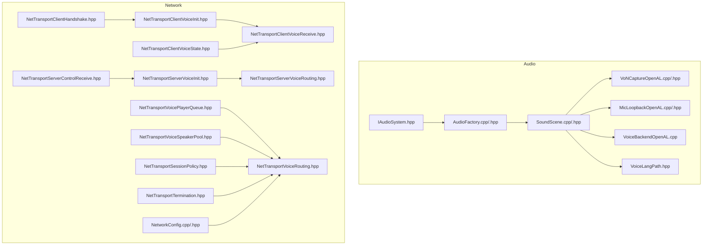
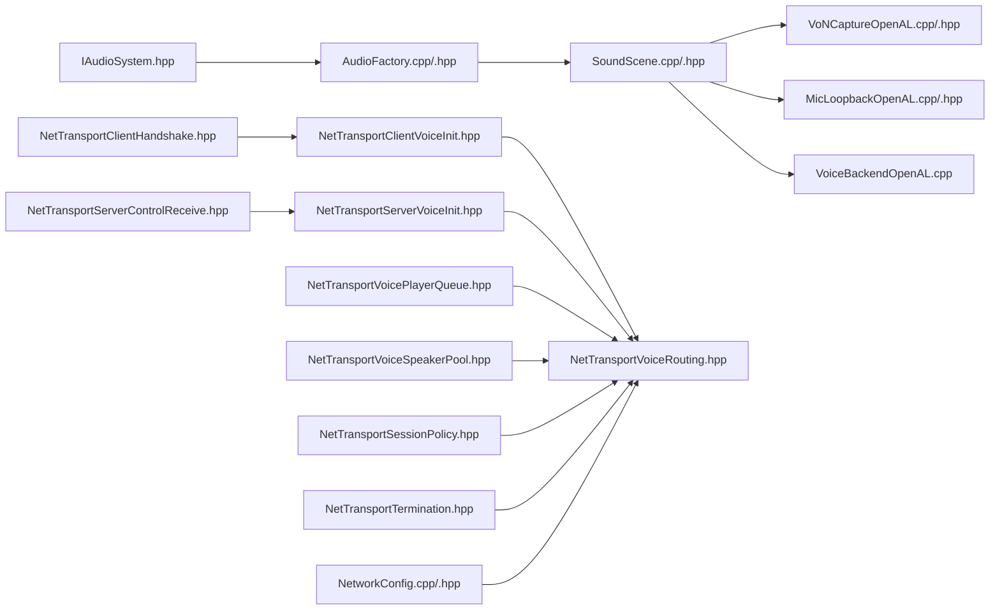

# Voice Chat & Communication

<cite>
**Referenced Files in This Document**
- [IAudioSystem.hpp](file://engine/Poseidon/Audio/IAudioSystem.hpp)
- [AudioFactory.cpp](file://engine/Poseidon/Audio/AudioFactory.cpp)
- [AudioFactory.hpp](file://engine/Poseidon/Audio/AudioFactory.hpp)
- [SoundScene.cpp](file://engine/Poseidon/Audio/SoundScene.cpp)
- [SoundScene.hpp](file://engine/Poseidon/Audio/SoundScene.hpp)
- [VoiceLangPath.hpp](file://engine/Poseidon/Audio/VoiceLangPath.hpp)
- [VoNCaptureOpenAL.cpp](file://engine/Poseidon/OpenAL/Voice/VoNCaptureOpenAL.cpp)
- [VoNCaptureOpenAL.hpp](file://engine/Poseidon/OpenAL/Voice/VoNCaptureOpenAL.hpp)
- [MicLoopbackOpenAL.cpp](file://engine/Poseidon/OpenAL/Voice/MicLoopbackOpenAL.cpp)
- [MicLoopbackOpenAL.hpp](file://engine/Poseidon/OpenAL/Voice/MicLoopbackOpenAL.hpp)
- [VoiceBackendOpenAL.cpp](file://engine/Poseidon/OpenAL/Voice/VoiceBackendOpenAL.cpp)
- [NetTransportClientVoiceInit.hpp](file://engine/Poseidon/Network/NetTransportClientVoiceInit.hpp)
- [NetTransportClientVoiceReceive.hpp](file://engine/Poseidon/Network/NetTransportClientVoiceReceive.hpp)
- [NetTransportClientVoiceState.hpp](file://engine/Poseidon/Network/NetTransportClientVoiceState.hpp)
- [NetTransportServerVoiceInit.hpp](file://engine/Poseidon/Network/NetTransportServerVoiceInit.hpp)
- [NetTransportServerVoiceRouting.hpp](file://engine/Poseidon/Network/NetTransportServerVoiceRouting.hpp)
- [NetTransportVoicePlayerQueue.hpp](file://engine/Poseidon/Network/NetTransportVoicePlayerQueue.hpp)
- [NetTransportVoiceSpeakerPool.hpp](file://engine/Poseidon/Network/NetTransportVoiceSpeakerPool.hpp)
- [NetTransportVoiceRouting.hpp](file://engine/Poseidon/Network/NetTransportVoiceRouting.hpp)
- [NetTransportClientHandshake.hpp](file://engine/Poseidon/Network/NetTransportClientHandshake.hpp)
- [NetTransportServerControlReceive.hpp](file://engine/Poseidon/Network/NetTransportServerControlReceive.hpp)
- [NetTransportSessionPolicy.hpp](file://engine/Poseidon/Network/NetTransportSessionPolicy.hpp)
- [NetTransportTermination.hpp](file://engine/Poseidon/Network/NetTransportTermination.hpp)
- [NetworkConfig.cpp](file://engine/Poseidon/Network/NetworkConfig.cpp)
- [NetworkConfig.hpp](file://engine/Poseidon/Network/NetworkConfig.hpp)
</cite>

## Table of Contents
1. [Introduction](#introduction)
2. [Project Structure](#project-structure)
3. [Core Components](#core-components)
4. [Architecture Overview](#architecture-overview)
5. [Detailed Component Analysis](#detailed-component-analysis)
6. [Dependency Analysis](#dependency-analysis)
7. [Performance Considerations](#performance-considerations)
8. [Troubleshooting Guide](#troubleshooting-guide)
9. [Conclusion](#conclusion)

## Introduction
This document explains the voice chat and communication system implemented in the project, focusing on how voice sessions are managed, how codecs are selected and used, and how network transport handles packet routing and error recovery. It also covers microphone capture, audio loopback, real-time audio processing pipelines, and practical guidance for implementing voice features, configuring audio quality, and handling connectivity issues. Security considerations, bandwidth optimization strategies, and troubleshooting steps are included to help developers build robust voice chat experiences.

## Project Structure
The voice system spans two main areas:
- Audio subsystem: interfaces, factories, scene management, and platform-specific OpenAL implementations for capture and playback.
- Network subsystem: client/server voice messaging, session policies, routing, and termination handling.



**Diagram sources**
- [IAudioSystem.hpp](file://engine/Poseidon/Audio/IAudioSystem.hpp)
- [AudioFactory.cpp](file://engine/Poseidon/Audio/AudioFactory.cpp)
- [AudioFactory.hpp](file://engine/Poseidon/Audio/AudioFactory.hpp)
- [SoundScene.cpp](file://engine/Poseidon/Audio/SoundScene.cpp)
- [SoundScene.hpp](file://engine/Poseidon/Audio/SoundScene.hpp)
- [VoiceLangPath.hpp](file://engine/Poseidon/Audio/VoiceLangPath.hpp)
- [VoNCaptureOpenAL.cpp](file://engine/Poseidon/OpenAL/Voice/VoNCaptureOpenAL.cpp)
- [VoNCaptureOpenAL.hpp](file://engine/Poseidon/OpenAL/Voice/VoNCaptureOpenAL.hpp)
- [MicLoopbackOpenAL.cpp](file://engine/Poseidon/OpenAL/Voice/MicLoopbackOpenAL.cpp)
- [MicLoopbackOpenAL.hpp](file://engine/Poseidon/OpenAL/Voice/MicLoopbackOpenAL.hpp)
- [VoiceBackendOpenAL.cpp](file://engine/Poseidon/OpenAL/Voice/VoiceBackendOpenAL.cpp)
- [NetTransportClientVoiceInit.hpp](file://engine/Poseidon/Network/NetTransportClientVoiceInit.hpp)
- [NetTransportClientVoiceReceive.hpp](file://engine/Poseidon/Network/NetTransportClientVoiceReceive.hpp)
- [NetTransportClientVoiceState.hpp](file://engine/Poseidon/Network/NetTransportClientVoiceState.hpp)
- [NetTransportServerVoiceInit.hpp](file://engine/Poseidon/Network/NetTransportServerVoiceInit.hpp)
- [NetTransportServerVoiceRouting.hpp](file://engine/Poseidon/Network/NetTransportServerVoiceRouting.hpp)
- [NetTransportVoicePlayerQueue.hpp](file://engine/Poseidon/Network/NetTransportVoicePlayerQueue.hpp)
- [NetTransportVoiceSpeakerPool.hpp](file://engine/Poseidon/Network/NetTransportVoiceSpeakerPool.hpp)
- [NetTransportVoiceRouting.hpp](file://engine/Poseidon/Network/NetTransportVoiceRouting.hpp)
- [NetTransportClientHandshake.hpp](file://engine/Poseidon/Network/NetTransportClientHandshake.hpp)
- [NetTransportServerControlReceive.hpp](file://engine/Poseidon/Network/NetTransportServerControlReceive.hpp)
- [NetTransportSessionPolicy.hpp](file://engine/Poseidon/Network/NetTransportSessionPolicy.hpp)
- [NetTransportTermination.hpp](file://engine/Poseidon/Network/NetTransportTermination.hpp)
- [NetworkConfig.cpp](file://engine/Poseidon/Network/NetworkConfig.cpp)
- [NetworkConfig.hpp](file://engine/Poseidon/Network/NetworkConfig.hpp)

**Section sources**
- [IAudioSystem.hpp](file://engine/Poseidon/Audio/IAudioSystem.hpp)
- [AudioFactory.cpp](file://engine/Poseidon/Audio/AudioFactory.cpp)
- [AudioFactory.hpp](file://engine/Poseidon/Audio/AudioFactory.hpp)
- [SoundScene.cpp](file://engine/Poseidon/Audio/SoundScene.cpp)
- [SoundScene.hpp](file://engine/Poseidon/Audio/SoundScene.hpp)
- [VoiceLangPath.hpp](file://engine/Poseidon/Audio/VoiceLangPath.hpp)
- [VoNCaptureOpenAL.cpp](file://engine/Poseidon/OpenAL/Voice/VoNCaptureOpenAL.cpp)
- [VoNCaptureOpenAL.hpp](file://engine/Poseidon/OpenAL/Voice/VoNCaptureOpenAL.hpp)
- [MicLoopbackOpenAL.cpp](file://engine/Poseidon/OpenAL/Voice/MicLoopbackOpenAL.cpp)
- [MicLoopbackOpenAL.hpp](file://engine/Poseidon/OpenAL/Voice/MicLoopbackOpenAL.hpp)
- [VoiceBackendOpenAL.cpp](file://engine/Poseidon/OpenAL/Voice/VoiceBackendOpenAL.cpp)
- [NetTransportClientVoiceInit.hpp](file://engine/Poseidon/Network/NetTransportClientVoiceInit.hpp)
- [NetTransportClientVoiceReceive.hpp](file://engine/Poseidon/Network/NetTransportClientVoiceReceive.hpp)
- [NetTransportClientVoiceState.hpp](file://engine/Poseidon/Network/NetTransportClientVoiceState.hpp)
- [NetTransportServerVoiceInit.hpp](file://engine/Poseidon/Network/NetTransportServerVoiceInit.hpp)
- [NetTransportServerVoiceRouting.hpp](file://engine/Poseidon/Network/NetTransportServerVoiceRouting.hpp)
- [NetTransportVoicePlayerQueue.hpp](file://engine/Poseidon/Network/NetTransportVoicePlayerQueue.hpp)
- [NetTransportVoiceSpeakerPool.hpp](file://engine/Poseidon/Network/NetTransportVoiceSpeakerPool.hpp)
- [NetTransportVoiceRouting.hpp](file://engine/Poseidon/Network/NetTransportVoiceRouting.hpp)
- [NetTransportClientHandshake.hpp](file://engine/Poseidon/Network/NetTransportClientHandshake.hpp)
- [NetTransportServerControlReceive.hpp](file://engine/Poseidon/Network/NetTransportServerControlReceive.hpp)
- [NetTransportSessionPolicy.hpp](file://engine/Poseidon/Network/NetTransportSessionPolicy.hpp)
- [NetTransportTermination.hpp](file://engine/Poseidon/Network/NetTransportTermination.hpp)
- [NetworkConfig.cpp](file://engine/Poseidon/Network/NetworkConfig.cpp)
- [NetworkConfig.hpp](file://engine/Poseidon/Network/NetworkConfig.hpp)

## Core Components
- Audio abstraction and factory: The IAudioSystem interface defines the audio backend contract. AudioFactory selects and initializes the appropriate backend (e.g., OpenAL), providing access to capture, playback, and voice services.
- Sound scene: Manages per-scene audio state, speaker pools, and coordinates between capture and playback components.
- OpenAL voice backend: Implements capture (microphone), loopback (monitoring), and speaker playback using OpenAL primitives.
- Network voice protocol: Client and server messages for voice initialization, streaming, and control; player queues and speaker pools for efficient distribution; session policy and termination handling.

Key responsibilities:
- Capture pipeline: Microphone input -> optional loopback -> encoding -> network packets.
- Playback pipeline: Network packets -> decoding -> mixing -> speaker output.
- Session lifecycle: Handshake -> init -> stream -> mute/speak events -> disconnect/termination.

**Section sources**
- [IAudioSystem.hpp](file://engine/Poseidon/Audio/IAudioSystem.hpp)
- [AudioFactory.cpp](file://engine/Poseidon/Audio/AudioFactory.cpp)
- [AudioFactory.hpp](file://engine/Poseidon/Audio/AudioFactory.hpp)
- [SoundScene.cpp](file://engine/Poseidon/Audio/SoundScene.cpp)
- [SoundScene.hpp](file://engine/Poseidon/Audio/SoundScene.hpp)
- [VoiceBackendOpenAL.cpp](file://engine/Poseidon/OpenAL/Voice/VoiceBackendOpenAL.cpp)
- [VoNCaptureOpenAL.cpp](file://engine/Poseidon/OpenAL/Voice/VoNCaptureOpenAL.cpp)
- [VoNCaptureOpenAL.hpp](file://engine/Poseidon/OpenAL/Voice/VoNCaptureOpenAL.hpp)
- [MicLoopbackOpenAL.cpp](file://engine/Poseidon/OpenAL/Voice/MicLoopbackOpenAL.cpp)
- [MicLoopbackOpenAL.hpp](file://engine/Poseidon/OpenAL/Voice/MicLoopbackOpenAL.hpp)
- [NetTransportClientVoiceInit.hpp](file://engine/Poseidon/Network/NetTransportClientVoiceInit.hpp)
- [NetTransportClientVoiceReceive.hpp](file://engine/Poseidon/Network/NetTransportClientVoiceReceive.hpp)
- [NetTransportClientVoiceState.hpp](file://engine/Poseidon/Network/NetTransportClientVoiceState.hpp)
- [NetTransportServerVoiceInit.hpp](file://engine/Poseidon/Network/NetTransportServerVoiceInit.hpp)
- [NetTransportServerVoiceRouting.hpp](file://engine/Poseidon/Network/NetTransportServerVoiceRouting.hpp)
- [NetTransportVoicePlayerQueue.hpp](file://engine/Poseidon/Network/NetTransportVoicePlayerQueue.hpp)
- [NetTransportVoiceSpeakerPool.hpp](file://engine/Poseidon/Network/NetTransportVoiceSpeakerPool.hpp)
- [NetTransportVoiceRouting.hpp](file://engine/Poseidon/Network/NetTransportVoiceRouting.hpp)
- [NetTransportClientHandshake.hpp](file://engine/Poseidon/Network/NetTransportClientHandshake.hpp)
- [NetTransportServerControlReceive.hpp](file://engine/Poseidon/Network/NetTransportServerControlReceive.hpp)
- [NetTransportSessionPolicy.hpp](file://engine/Poseidon/Network/NetTransportSessionPolicy.hpp)
- [NetTransportTermination.hpp](file://engine/Poseidon/Network/NetTransportTermination.hpp)
- [NetworkConfig.cpp](file://engine/Poseidon/Network/NetworkConfig.cpp)
- [NetworkConfig.hpp](file://engine/Poseidon/Network/NetworkConfig.hpp)

## Architecture Overview
The voice architecture separates concerns into audio capture/playback, codec processing, and network transport with clear boundaries:

```mermaid
sequenceDiagram
participant Mic as "Microphone Capture (OpenAL)"
participant Loop as "Loopback Mixer"
participant Enc as "Encoder (Opus)"
participant NetC as "Network Client Voice"
participant NetS as "Network Server Voice"
participant Dec as "Decoder (Opus)"
participant Spk as "Speaker Output (OpenAL)"
Mic->>Loop : "Raw PCM frames"
Loop-->>Enc : "Processed PCM"
Enc->>NetC : "Encoded Opus packets"
NetC->>NetS : "Stream packets"
NetS-->>NetC : "Ack/flow control"
NetS->>Dec : "Deliver encoded frames"
Dec-->>Spk : "Decoded PCM"
Spk-->>User : "Audio playback"
```

**Diagram sources**
- [VoNCaptureOpenAL.cpp](file://engine/Poseidon/OpenAL/Voice/VoNCaptureOpenAL.cpp)
- [MicLoopbackOpenAL.cpp](file://engine/Poseidon/OpenAL/Voice/MicLoopbackOpenAL.cpp)
- [NetTransportClientVoiceInit.hpp](file://engine/Poseidon/Network/NetTransportClientVoiceInit.hpp)
- [NetTransportClientVoiceReceive.hpp](file://engine/Poseidon/Network/NetTransportClientVoiceReceive.hpp)
- [NetTransportServerVoiceInit.hpp](file://engine/Poseidon/Network/NetTransportServerVoiceInit.hpp)
- [NetTransportServerVoiceRouting.hpp](file://engine/Poseidon/Network/NetTransportServerVoiceRouting.hpp)
- [NetTransportVoicePlayerQueue.hpp](file://engine/Poseidon/Network/NetTransportVoicePlayerQueue.hpp)
- [NetTransportVoiceSpeakerPool.hpp](file://engine/Poseidon/Network/NetTransportVoiceSpeakerPool.hpp)

## Detailed Component Analysis

### Audio Abstraction and Factory
- IAudioSystem defines the common interface for audio backends, including methods for initializing devices, capturing audio, playing back streams, and managing voice channels.
- AudioFactory selects the concrete backend (e.g., OpenAL) based on runtime configuration and platform capabilities, exposing a unified API to higher layers like the sound scene.

Implementation highlights:
- Backend selection logic ensures consistent behavior across platforms.
- Resource lifecycle is managed centrally to avoid leaks and ensure proper device teardown.

**Section sources**
- [IAudioSystem.hpp](file://engine/Poseidon/Audio/IAudioSystem.hpp)
- [AudioFactory.cpp](file://engine/Poseidon/Audio/AudioFactory.cpp)
- [AudioFactory.hpp](file://engine/Poseidon/Audio/AudioFactory.hpp)

### Sound Scene and Voice Coordination
- SoundScene orchestrates audio resources per scene, manages speaker pools, and integrates capture and playback paths.
- It coordinates with the network layer to start/stop voice sessions and route incoming/outgoing audio frames.

Key behaviors:
- Initializes capture devices and speaker outputs.
- Buffers and mixes audio frames for low-latency playback.
- Integrates with voice routing to map remote speakers to local audio channels.

**Section sources**
- [SoundScene.cpp](file://engine/Poseidon/Audio/SoundScene.cpp)
- [SoundScene.hpp](file://engine/Poseidon/Audio/SoundScene.hpp)
- [VoiceLangPath.hpp](file://engine/Poseidon/Audio/VoiceLangPath.hpp)

### OpenAL Voice Backend: Capture, Loopback, and Playback
- VoNCaptureOpenAL implements microphone capture using OpenAL, delivering PCM frames to the encoder pipeline.
- MicLoopbackOpenAL provides loopback functionality, allowing users to monitor their own voice or mix local audio with remote streams.
- VoiceBackendOpenAL ties together capture, loopback, and speaker playback within the OpenAL context.

Operational flow:
- Capture thread reads PCM buffers from the microphone.
- Optional loopback mixes captured audio with playback output.
- Speaker pool renders decoded frames to the audio device.

**Section sources**
- [VoNCaptureOpenAL.cpp](file://engine/Poseidon/OpenAL/Voice/VoNCaptureOpenAL.cpp)
- [VoNCaptureOpenAL.hpp](file://engine/Poseidon/OpenAL/Voice/VoNCaptureOpenAL.hpp)
- [MicLoopbackOpenAL.cpp](file://engine/Poseidon/OpenAL/Voice/MicLoopbackOpenAL.cpp)
- [MicLoopbackOpenAL.hpp](file://engine/Poseidon/OpenAL/Voice/MicLoopbackOpenAL.hpp)
- [VoiceBackendOpenAL.cpp](file://engine/Poseidon/OpenAL/Voice/VoiceBackendOpenAL.cpp)

### Network Voice Protocol: Client and Server
- Client-side voice messages handle initialization, receiving encoded frames, and maintaining voice state.
- Server-side voice messages manage initialization, routing, and control signals.
- Player queues buffer and prioritize outgoing/incoming voice packets per peer.
- Speaker pools allocate and manage audio channels for multiple simultaneous speakers.

Protocol interactions:
- Client handshake establishes connection parameters and capabilities.
- Voice init exchanges codec preferences and session metadata.
- Streaming delivers encoded frames with acknowledgments and retransmission policies.
- Control messages handle mute/unmute, speak events, and session termination.

**Section sources**
- [NetTransportClientVoiceInit.hpp](file://engine/Poseidon/Network/NetTransportClientVoiceInit.hpp)
- [NetTransportClientVoiceReceive.hpp](file://engine/Poseidon/Network/NetTransportClientVoiceReceive.hpp)
- [NetTransportClientVoiceState.hpp](file://engine/Poseidon/Network/NetTransportClientVoiceState.hpp)
- [NetTransportServerVoiceInit.hpp](file://engine/Poseidon/Network/NetTransportServerVoiceInit.hpp)
- [NetTransportServerVoiceRouting.hpp](file://engine/Poseidon/Network/NetTransportServerVoiceRouting.hpp)
- [NetTransportVoicePlayerQueue.hpp](file://engine/Poseidon/Network/NetTransportVoicePlayerQueue.hpp)
- [NetTransportVoiceSpeakerPool.hpp](file://engine/Poseidon/Network/NetTransportVoiceSpeakerPool.hpp)
- [NetTransportVoiceRouting.hpp](file://engine/Poseidon/Network/NetTransportVoiceRouting.hpp)
- [NetTransportClientHandshake.hpp](file://engine/Poseidon/Network/NetTransportClientHandshake.hpp)
- [NetTransportServerControlReceive.hpp](file://engine/Poseidon/Network/NetTransportServerControlReceive.hpp)
- [NetTransportSessionPolicy.hpp](file://engine/Poseidon/Network/NetTransportSessionPolicy.hpp)
- [NetTransportTermination.hpp](file://engine/Poseidon/Network/NetTransportTermination.hpp)

### Codec Selection and Opus Implementation
- Codec negotiation occurs during voice initialization, where clients and servers exchange supported formats and select the best match.
- Opus is chosen for high-quality voice compression with adaptive bitrate and latency tuning.
- Encoding and decoding pipelines integrate with the capture and playback threads to minimize latency and maintain synchronization.

Configuration aspects:
- Bitrate, frame size, and complexity settings can be tuned based on network conditions and device capabilities.
- Error concealment and packet loss handling improve perceived audio quality under adverse conditions.

**Section sources**
- [NetTransportClientVoiceInit.hpp](file://engine/Poseidon/Network/NetTransportClientVoiceInit.hpp)
- [NetTransportServerVoiceInit.hpp](file://engine/Poseidon/Network/NetTransportServerVoiceInit.hpp)
- [NetTransportVoiceRouting.hpp](file://engine/Poseidon/Network/NetTransportVoiceRouting.hpp)

### Real-Time Audio Processing Pipelines
- Capture path: Microphone -> optional loopback -> pre-processing (noise suppression, gain control) -> encoding -> network send.
- Playback path: Network receive -> buffering -> decoding -> post-processing (echo cancellation, volume normalization) -> speaker output.
- Mixing: Multiple remote speakers are mixed into a single output stream with per-speaker volume and panning controls.

Latency considerations:
- Buffer sizes and frame durations are balanced to achieve low latency while avoiding glitches.
- Thread scheduling and priority affect responsiveness and jitter.

**Section sources**
- [VoNCaptureOpenAL.cpp](file://engine/Poseidon/OpenAL/Voice/VoNCaptureOpenAL.cpp)
- [MicLoopbackOpenAL.cpp](file://engine/Poseidon/OpenAL/Voice/MicLoopbackOpenAL.cpp)
- [NetTransportClientVoiceReceive.hpp](file://engine/Poseidon/Network/NetTransportClientVoiceReceive.hpp)
- [NetTransportVoiceSpeakerPool.hpp](file://engine/Poseidon/Network/NetTransportVoiceSpeakerPool.hpp)

### Example Implementations and Configuration
- Enabling voice chat: Initialize audio backend via factory, create a sound scene, start capture, and join a voice session through the network client.
- Configuring audio quality: Adjust Opus bitrate, frame size, and complexity via network config and audio settings.
- Handling network issues: Implement reconnection logic, fallback codecs, and graceful degradation when bandwidth drops.

Best practices:
- Use adaptive bitrate to maintain quality under varying network conditions.
- Apply echo cancellation and noise suppression to improve clarity.
- Monitor queue lengths and adjust buffer sizes to prevent overflow or underflow.

**Section sources**
- [AudioFactory.cpp](file://engine/Poseidon/Audio/AudioFactory.cpp)
- [NetworkConfig.cpp](file://engine/Poseidon/Network/NetworkConfig.cpp)
- [NetworkConfig.hpp](file://engine/Poseidon/Network/NetworkConfig.hpp)
- [NetTransportClientVoiceInit.hpp](file://engine/Poseidon/Network/NetTransportClientVoiceInit.hpp)
- [NetTransportServerVoiceInit.hpp](file://engine/Poseidon/Network/NetTransportServerVoiceInit.hpp)

## Dependency Analysis
The voice system exhibits clear separation between audio, codec, and networking layers with minimal coupling:



**Diagram sources**
- [IAudioSystem.hpp](file://engine/Poseidon/Audio/IAudioSystem.hpp)
- [AudioFactory.cpp](file://engine/Poseidon/Audio/AudioFactory.cpp)
- [AudioFactory.hpp](file://engine/Poseidon/Audio/AudioFactory.hpp)
- [SoundScene.cpp](file://engine/Poseidon/Audio/SoundScene.cpp)
- [SoundScene.hpp](file://engine/Poseidon/Audio/SoundScene.hpp)
- [VoNCaptureOpenAL.cpp](file://engine/Poseidon/OpenAL/Voice/VoNCaptureOpenAL.cpp)
- [VoNCaptureOpenAL.hpp](file://engine/Poseidon/OpenAL/Voice/VoNCaptureOpenAL.hpp)
- [MicLoopbackOpenAL.cpp](file://engine/Poseidon/OpenAL/Voice/MicLoopbackOpenAL.cpp)
- [MicLoopbackOpenAL.hpp](file://engine/Poseidon/OpenAL/Voice/MicLoopbackOpenAL.hpp)
- [VoiceBackendOpenAL.cpp](file://engine/Poseidon/OpenAL/Voice/VoiceBackendOpenAL.cpp)
- [NetTransportClientVoiceInit.hpp](file://engine/Poseidon/Network/NetTransportClientVoiceInit.hpp)
- [NetTransportServerVoiceInit.hpp](file://engine/Poseidon/Network/NetTransportServerVoiceInit.hpp)
- [NetTransportVoiceRouting.hpp](file://engine/Poseidon/Network/NetTransportVoiceRouting.hpp)
- [NetTransportVoicePlayerQueue.hpp](file://engine/Poseidon/Network/NetTransportVoicePlayerQueue.hpp)
- [NetTransportVoiceSpeakerPool.hpp](file://engine/Poseidon/Network/NetTransportVoiceSpeakerPool.hpp)
- [NetTransportClientHandshake.hpp](file://engine/Poseidon/Network/NetTransportClientHandshake.hpp)
- [NetTransportServerControlReceive.hpp](file://engine/Poseidon/Network/NetTransportServerControlReceive.hpp)
- [NetTransportSessionPolicy.hpp](file://engine/Poseidon/Network/NetTransportSessionPolicy.hpp)
- [NetTransportTermination.hpp](file://engine/Poseidon/Network/NetTransportTermination.hpp)
- [NetworkConfig.cpp](file://engine/Poseidon/Network/NetworkConfig.cpp)
- [NetworkConfig.hpp](file://engine/Poseidon/Network/NetworkConfig.hpp)

**Section sources**
- [IAudioSystem.hpp](file://engine/Poseidon/Audio/IAudioSystem.hpp)
- [AudioFactory.cpp](file://engine/Poseidon/Audio/AudioFactory.cpp)
- [AudioFactory.hpp](file://engine/Poseidon/Audio/AudioFactory.hpp)
- [SoundScene.cpp](file://engine/Poseidon/Audio/SoundScene.cpp)
- [SoundScene.hpp](file://engine/Poseidon/Audio/SoundScene.hpp)
- [VoNCaptureOpenAL.cpp](file://engine/Poseidon/OpenAL/Voice/VoNCaptureOpenAL.cpp)
- [VoNCaptureOpenAL.hpp](file://engine/Poseidon/OpenAL/Voice/VoNCaptureOpenAL.hpp)
- [MicLoopbackOpenAL.cpp](file://engine/Poseidon/OpenAL/Voice/MicLoopbackOpenAL.cpp)
- [MicLoopbackOpenAL.hpp](file://engine/Poseidon/OpenAL/Voice/MicLoopbackOpenAL.hpp)
- [VoiceBackendOpenAL.cpp](file://engine/Poseidon/OpenAL/Voice/VoiceBackendOpenAL.cpp)
- [NetTransportClientVoiceInit.hpp](file://engine/Poseidon/Network/NetTransportClientVoiceInit.hpp)
- [NetTransportServerVoiceInit.hpp](file://engine/Poseidon/Network/NetTransportServerVoiceInit.hpp)
- [NetTransportVoiceRouting.hpp](file://engine/Poseidon/Network/NetTransportVoiceRouting.hpp)
- [NetTransportVoicePlayerQueue.hpp](file://engine/Poseidon/Network/NetTransportVoicePlayerQueue.hpp)
- [NetTransportVoiceSpeakerPool.hpp](file://engine/Poseidon/Network/NetTransportVoiceSpeakerPool.hpp)
- [NetTransportClientHandshake.hpp](file://engine/Poseidon/Network/NetTransportClientHandshake.hpp)
- [NetTransportServerControlReceive.hpp](file://engine/Poseidon/Network/NetTransportServerControlReceive.hpp)
- [NetTransportSessionPolicy.hpp](file://engine/Poseidon/Network/NetTransportSessionPolicy.hpp)
- [NetTransportTermination.hpp](file://engine/Poseidon/Network/NetTransportTermination.hpp)
- [NetworkConfig.cpp](file://engine/Poseidon/Network/NetworkConfig.cpp)
- [NetworkConfig.hpp](file://engine/Poseidon/Network/NetworkConfig.hpp)

## Performance Considerations
- Latency: Minimize buffer sizes and frame durations to reduce round-trip delay while avoiding audio dropouts.
- CPU usage: Optimize encoder/decoder settings and apply only necessary audio effects to balance quality and performance.
- Bandwidth: Use adaptive bitrate and packet loss concealment to maintain quality under fluctuating network conditions.
- Threading: Separate capture, encode/decode, and network I/O threads to prevent blocking and ensure smooth playback.
- Memory: Reuse buffers and avoid frequent allocations in hot paths to reduce GC pressure and fragmentation.

[No sources needed since this section provides general guidance]

## Troubleshooting Guide
Common issues and resolutions:
- No audio capture: Verify device permissions, check OpenAL initialization, and ensure capture thread is running.
- Echo or feedback: Enable echo cancellation, adjust loopback levels, and verify speaker/microphone isolation.
- Choppy playback: Increase buffer sizes, enable jitter buffers, and monitor network packet loss.
- Connection failures: Inspect handshake and voice init messages, validate firewall rules, and retry with fallback codecs.
- High CPU usage: Reduce encoder complexity, disable unnecessary effects, and profile audio threads.

Debugging tips:
- Log capture and playback buffer states to detect underflows/overflows.
- Track network metrics (latency, jitter, packet loss) to correlate with audio quality.
- Use test tones and silence detection to validate pipeline integrity.

**Section sources**
- [NetTransportClientHandshake.hpp](file://engine/Poseidon/Network/NetTransportClientHandshake.hpp)
- [NetTransportClientVoiceInit.hpp](file://engine/Poseidon/Network/NetTransportClientVoiceInit.hpp)
- [NetTransportServerVoiceInit.hpp](file://engine/Poseidon/Network/NetTransportServerVoiceInit.hpp)
- [NetTransportTermination.hpp](file://engine/Poseidon/Network/NetTransportTermination.hpp)
- [NetworkConfig.cpp](file://engine/Poseidon/Network/NetworkConfig.cpp)
- [NetworkConfig.hpp](file://engine/Poseidon/Network/NetworkConfig.hpp)

## Conclusion
The voice chat system combines a modular audio backend with a robust network transport layer to deliver high-quality, low-latency communication. By separating capture, encoding, routing, and playback, the architecture supports flexible configuration, adaptive quality, and resilient operation under varying network conditions. Developers can implement voice features by leveraging the provided interfaces and configurations, while following best practices for performance, security, and troubleshooting.

[No sources needed since this section summarizes without analyzing specific files]