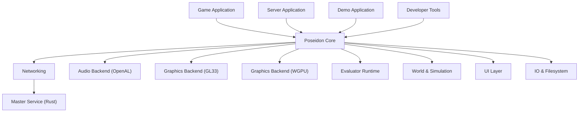
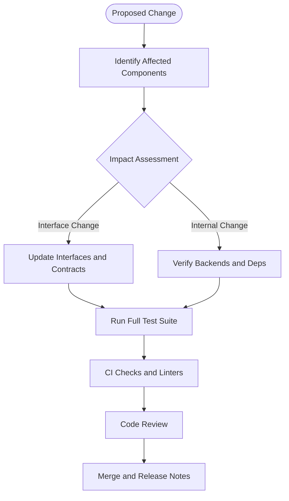
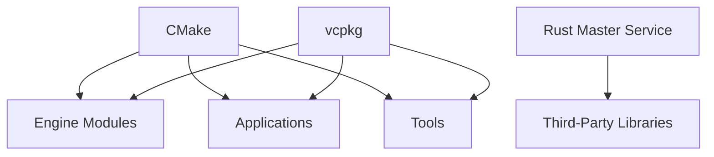

# Contributing Guide

<cite>
**Referenced Files in This Document**
- [CONTRIBUTING.md](file://CONTRIBUTING.md)
- [.clang-format](file://.clang-format)
- [.clang-tidy](file://.clang-tidy)
- [CMakeLists.txt](file://CMakeLists.txt)
- [CMakePresets.json](file://CMakePresets.json)
- [vcpkg.json](file://vcpkg.json)
- [README.md](file://README.md)
- [scripts/Build.ps1](file://scripts/Build.ps1)
- [scripts/Install.ps1](file://scripts/Install.ps1)
- [scripts/Start.ps1](file://scripts/Start.ps1)
- [tests/README.md](file://tests/README.md)
- [engine/Poseidon/CMakeLists.txt](file://engine/Poseidon/CMakeLists.txt)
- [apps/cwr/Game/CMakeLists.txt](file://apps/cwr/Game/CMakeLists.txt)
- [apps/tools/Tools/CMakeLists.txt](file://apps/tools/Tools/CMakeLists.txt)
- [mserver/MasterService/Cargo.toml](file://mserver/MasterService/Cargo.toml)
- [thirdparty/README.md](file://thirdparty/README.md)
- [THIRD_PARTY_NOTICES.md](file://THIRD_PARTY_NOTICES.md)
</cite>

## Table of Contents
1. Introduction
2. Project Structure
3. Core Components
4. Architecture Overview
5. Detailed Component Analysis
6. Dependency Analysis
7. Performance Considerations
8. Troubleshooting Guide
9. Conclusion
10. Appendices

## Introduction
This guide explains how to contribute to CWR-CE, including development workflow, coding standards enforced by .clang-format and .clang-tidy, pull request procedures, environment setup, testing, debugging, and community processes. It also outlines architectural principles that guide changes and how components interact so your contributions integrate smoothly.

## Project Structure
The repository is a multi-component system with:
- Engine core (Poseidon), graphics backends (GL33, WGPU), audio backend (OpenAL), networking, UI, world simulation, scripting evaluator, and utilities.
- Applications under apps/, including the game client, server, demo, and tools.
- A Rust-based master service under mserver/.
- Tests under tests/ with unit, integration, smoke, stress, and e2e suites.
- Build configuration via CMake and vcpkg, plus presets for platforms and sanitizers.
- Coding style and linting via .clang-format and .clang-tidy at the repository root.

```mermaid
graph TB
subgraph "Root"
Root["Repository Root"]
CMake["CMakeLists.txt"]
Presets["CMakePresets.json"]
Vcpkg["vcpkg.json"]
ClangFmt[".clang-format"]
ClangTidy[".clang-tidy"]
end
subgraph "Engine"
Poseidon["engine/Poseidon"]
GL33["engine/PoseidonGL33"]
Wgpu["engine/WgpuRenderer"]
OpenAL["engine/PoseidonOpenAL"]
Evaluator["engine/Evaluator"]
Random["engine/Random"]
end
subgraph "Apps"
GameApp["apps/cwr/Game"]
ServerApp["apps/cwr/Server"]
DemoApp["apps/cwr/GameDemo"]
Tools["apps/tools"]
end
subgraph "Master Service"
Msvc["mserver/MasterService"]
end
subgraph "Tests"
Unit["tests/unit"]
Integration["tests/integration"]
Smoke["tests/smoke"]
Stress["tests/stress"]
E2E["tests/e2e"]
end
Root --> CMake
Root --> Presets
Root --> Vcpkg
Root --> ClangFmt
Root --> ClangTidy
CMake --> Poseidon
CMake --> GL33
CMake --> Wgpu
CMake --> OpenAL
CMake --> Evaluator
CMake --> GameApp
CMake --> ServerApp
CMake --> DemoApp
CMake --> Tools
Msvc -. Cargo .- Msvc
Unit --> Poseidon
Integration --> Poseidon
Smoke --> Poseidon
Stress --> Poseidon
E2E --> Poseidon
```

**Diagram sources**
- [CMakeLists.txt](file://CMakeLists.txt)
- [CMakePresets.json](file://CMakePresets.json)
- [vcpkg.json](file://vcpkg.json)
- [engine/Poseidon/CMakeLists.txt](file://engine/Poseidon/CMakeLists.txt)
- [apps/cwr/Game/CMakeLists.txt](file://apps/cwr/Game/CMakeLists.txt)
- [apps/tools/Tools/CMakeLists.txt](file://apps/tools/Tools/CMakeLists.txt)
- [mserver/MasterService/Cargo.toml](file://mserver/MasterService/Cargo.toml)

**Section sources**
- [README.md](file://README.md)
- [CMakeLists.txt](file://CMakeLists.txt)
- [CMakePresets.json](file://CMakePresets.json)
- [vcpkg.json](file://vcpkg.json)

## Core Components
- Engine core (Poseidon): Application lifecycle, subsystems (audio, graphics, input, network, UI, world, IO, math, memory, threads, platform abstraction).
- Graphics backends: OpenGL 3.3 and WGPU implementations abstracted behind a common interface.
- Audio backend: OpenAL implementation providing playback, capture, and voice routing.
- Scripting: Evaluator runtime and SQS runner for mission/script execution.
- Networking: Client/server transport, session management, message framing, integrity checks, and master server integration.
- Master service (Rust): HTTP API, mod catalog, probes, and CLI tooling.
- Applications: Game client, dedicated server, demo, and developer tools.
- Tests: Comprehensive suites covering unit, integration, smoke, stress, and e2e scenarios.

Key responsibilities and boundaries are defined through CMake targets and module directories. New features should fit within these modules or introduce new well-scoped modules with clear interfaces.

**Section sources**
- [engine/Poseidon/CMakeLists.txt](file://engine/Poseidon/CMakeLists.txt)
- [apps/cwr/Game/CMakeLists.txt](file://apps/cwr/Game/CMakeLists.txt)
- [apps/tools/Tools/CMakeLists.txt](file://apps/tools/Tools/CMakeLists.txt)
- [mserver/MasterService/Cargo.toml](file://mserver/MasterService/Cargo.toml)

## Architecture Overview
The system follows a layered architecture:
- Apps depend on engine subsystems.
- Engine subsystems expose stable interfaces; backends (graphics/audio) implement them.
- Networking spans client/server roles with shared protocols and transports.
- Master service is independent but integrates via HTTP and protocol definitions.



[No diagram sources needed since this diagram shows conceptual relationships without mapping to specific files]

## Detailed Component Analysis

### Development Workflow
- Configure and build using CMake presets for your platform and sanitizer needs.
- Use PowerShell scripts for one-click install/build/start workflows on Windows.
- Run tests with CTest or directly invoke test binaries as configured in the test suite.
- Format and lint code with clang-format and clang-tidy before submitting PRs.

Recommended steps:
- Install dependencies via vcpkg and ensure toolchains match presets.
- Generate build files with cmake --preset or use the provided scripts.
- Build targets for apps, engine, and tools as needed.
- Execute tests across unit, integration, smoke, stress, and e2e categories.
- Address any clang-tidy warnings and format changes from clang-format.

**Section sources**
- [CMakePresets.json](file://CMakePresets.json)
- [scripts/Build.ps1](file://scripts/Build.ps1)
- [scripts/Install.ps1](file://scripts/Install.ps1)
- [scripts/Start.ps1](file://scripts/Start.ps1)
- [tests/README.md](file://tests/README.md)

### Code Style Guidelines
- Formatting is enforced by .clang-format; run the formatter on all changed files.
- Linting rules are defined in .clang-tidy; resolve all warnings and errors.
- Prefer consistent naming, include guards, and modular headers.
- Keep includes minimal and ordered per project conventions.
- Avoid raw pointers where smart pointers or references suffice.
- Use RAII patterns and avoid global mutable state.

Practical tips:
- Integrate clang-format into your editor for automatic formatting on save.
- Run clang-tidy locally before committing to catch issues early.
- Follow existing patterns in engine/Poseidon for new code.

**Section sources**
- [.clang-format](file://.clang-format)
- [.clang-tidy](file://.clang-tidy)

### Pull Request Procedures
- Create a feature branch from main or the appropriate base branch.
- Ensure builds pass with chosen presets and sanitizers.
- Add or update tests for functional changes.
- Update documentation if user-facing behavior changes.
- Submit a PR with a clear description, affected components, and test results.
- Address review comments promptly and keep commits atomic and descriptive.

Review checklist:
- Does the change adhere to coding standards?
- Are there adequate tests covering edge cases?
- Is performance impact considered and documented if significant?
- Are dependencies updated safely (vcpkg, third-party)?
- Do CI checks pass?

**Section sources**
- [tests/README.md](file://tests/README.md)

### Environment Setup
- Prerequisites:
  - CMake and a supported compiler (Clang recommended per presets).
  - vcpkg installed and initialized.
  - Platform-specific SDKs (Windows SDK, Linux dev packages).
- Dependencies:
  - Managed via vcpkg; ensure triplet matches your target.
  - Third-party libraries listed in thirdparty/ and README.
- Optional:
  - Sanitizers (AddressSanitizer, ThreadSanitizer, UndefinedBehaviorSanitizer) via presets.
  - RenderDoc for graphics debugging.

Setup steps:
- Initialize vcpkg and install dependencies.
- Select a preset matching your platform and sanitizer configuration.
- Generate and build targets for the desired component.

**Section sources**
- [vcpkg.json](file://vcpkg.json)
- [CMakePresets.json](file://CMakePresets.json)
- [thirdparty/README.md](file://thirdparty/README.md)

### Running Tests
- Unit tests: Fast, focused on engine modules.
- Integration tests: Validate subsystem interactions and missions.
- Smoke tests: Quick boot and basic functionality checks.
- Stress tests: Long-running multiplayer scenarios.
- E2E tests: End-to-end flows like master server browser visibility.

Execution:
- Use CTest to run all tests or select categories.
- For Windows, leverage PowerShell scripts to streamline runs.
- Inspect logs and artifacts for failures.

**Section sources**
- [tests/README.md](file://tests/README.md)

### Debugging Contributions
- Graphics: Use RenderDoc to capture frames and inspect pipelines.
- Memory: Enable AddressSanitizer via presets to detect leaks and invalid access.
- Concurrency: Use ThreadSanitizer to find data races.
- Logging: Leverage engine logging facilities for runtime diagnostics.
- Network: Inspect messages and sessions via debug outputs and master service logs.

Best practices:
- Reproduce issues minimally with isolated tests.
- Capture logs and artifacts alongside bug reports.
- Use incremental builds to speed up iteration.

**Section sources**
- [CMakePresets.json](file://CMakePresets.json)
- [thirdparty/README.md](file://thirdparty/README.md)

### Relationship Between Components and Change Propagation
- Changes in engine subsystems may affect apps and tests; ensure backward compatibility where possible.
- Graphics/audio backends must conform to interfaces; updates require validation across both backends.
- Networking changes should be tested client-side and server-side; master service integration requires protocol alignment.
- Tooling updates should not break app builds; maintain separation of concerns.



[No diagram sources needed since this diagram shows conceptual workflow, not actual code structure]

## Dependency Analysis
- CMake orchestrates builds for C++ components; vcpkg manages dependencies.
- Rust master service uses Cargo; separate build pipeline.
- Third-party libraries are vendored or managed externally; track licenses and versions.



**Diagram sources**
- [CMakeLists.txt](file://CMakeLists.txt)
- [vcpkg.json](file://vcpkg.json)
- [mserver/MasterService/Cargo.toml](file://mserver/MasterService/Cargo.toml)
- [thirdparty/README.md](file://thirdparty/README.md)

**Section sources**
- [CMakeLists.txt](file://CMakeLists.txt)
- [vcpkg.json](file://vcpkg.json)
- [mserver/MasterService/Cargo.toml](file://mserver/MasterService/Cargo.toml)
- [thirdparty/README.md](file://thirdparty/README.md)

## Performance Considerations
- Profile hot paths with sampling profilers and graphics capture tools.
- Minimize allocations in tight loops; prefer object pools where appropriate.
- Use SIMD and vectorization hints judiciously; validate correctness.
- Avoid unnecessary synchronization; design lock-free structures when safe.
- Benchmark changes with realistic datasets and missions.

[No sources needed since this section provides general guidance]

## Troubleshooting Guide
Common issues and resolutions:
- Build failures due to missing dependencies: Re-run vcpkg install and verify triplets.
- Linker errors: Check target dependencies and library paths in CMake.
- Runtime crashes: Enable sanitizers and inspect stack traces.
- Graphics artifacts: Use RenderDoc to inspect shader compilation and texture loading.
- Network timeouts: Validate master service connectivity and firewall settings.

Debugging resources:
- Logs from engine subsystems and master service.
- Test output and artifacts for failing scenarios.
- Community channels for support and guidance.

**Section sources**
- [CMakePresets.json](file://CMakePresets.json)
- [tests/README.md](file://tests/README.md)

## Conclusion
Contributing to CWR-CE involves adhering to established coding standards, leveraging CMake and vcpkg for builds, running comprehensive tests, and following structured PR procedures. Understanding component boundaries and dependency chains ensures smooth integration of changes. Engage with the community, document your work, and prioritize quality and performance.

[No sources needed since this section summarizes without analyzing specific files]

## Appendices

### Community Guidelines
- Be respectful and collaborative in discussions and reviews.
- Follow issue templates and provide reproducible steps.
- Feature requests should include motivation, scope, and potential impacts.

### Issue Reporting Procedures
- Search existing issues before filing new ones.
- Include environment details, logs, and minimal reproduction cases.
- Label appropriately and link related issues.

### Feature Request Processes
- Describe the problem and proposed solution.
- Outline benefits and trade-offs.
- Provide examples and reference designs if applicable.

### Licensing and Intellectual Property
- Respect third-party licenses and include notices as required.
- Ensure contributions comply with project licensing terms.
- Maintain clarity on IP ownership and contributor agreements.

**Section sources**
- [THIRD_PARTY_NOTICES.md](file://THIRD_PARTY_NOTICES.md)
- [thirdparty/README.md](file://thirdparty/README.md)