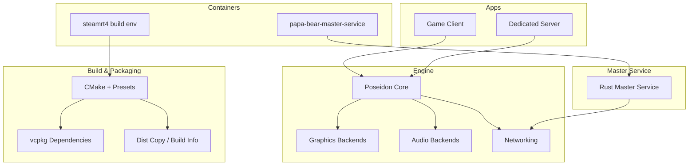
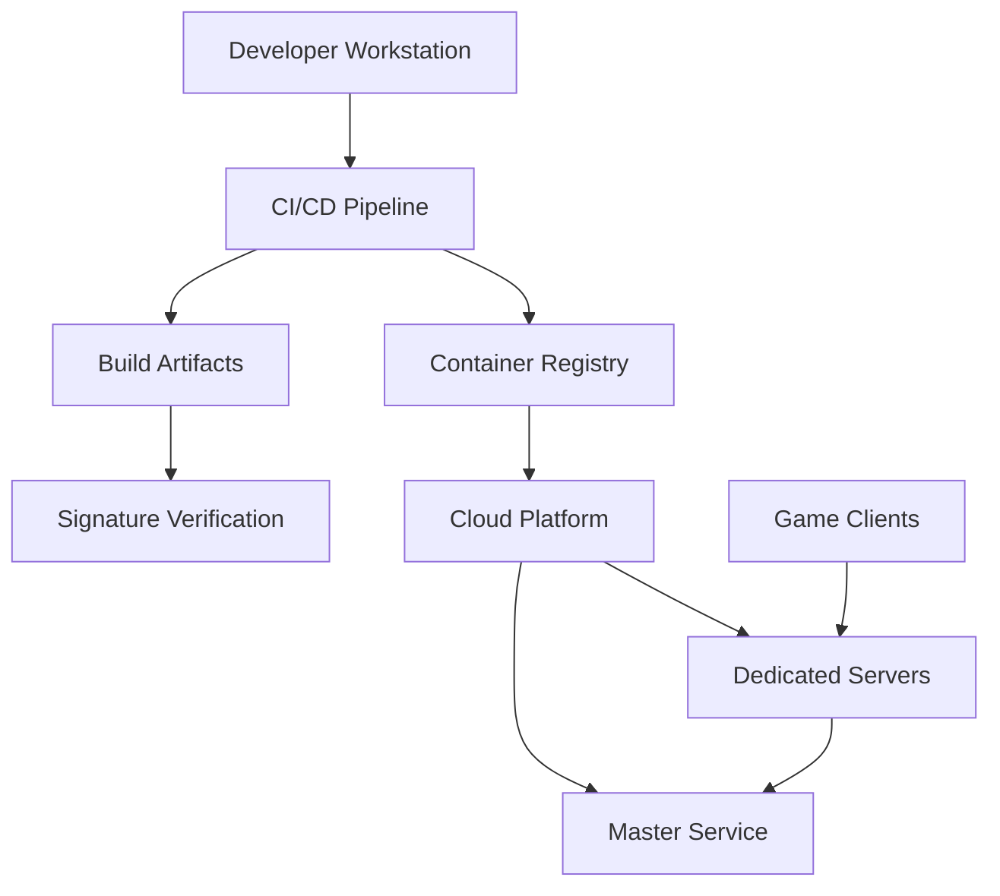
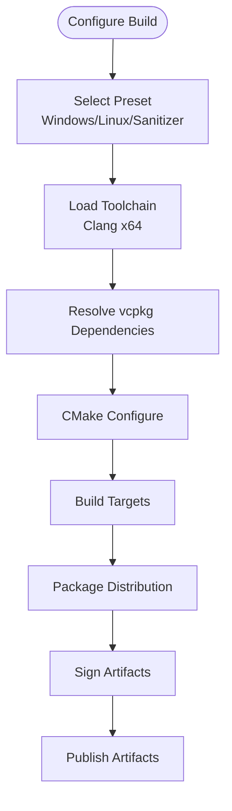
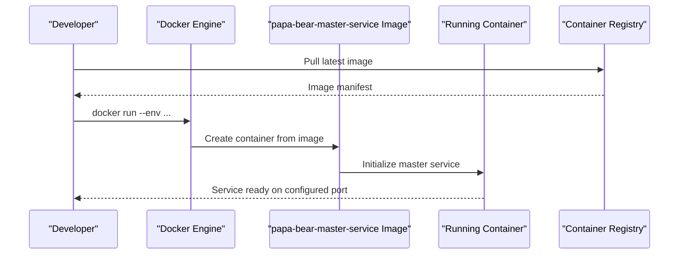
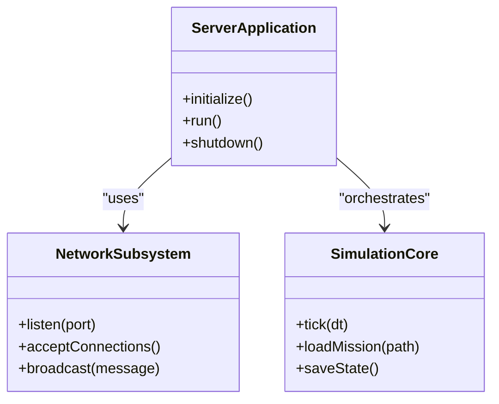
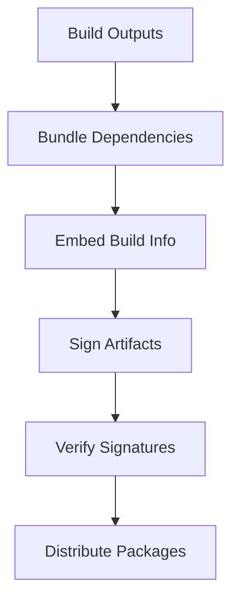
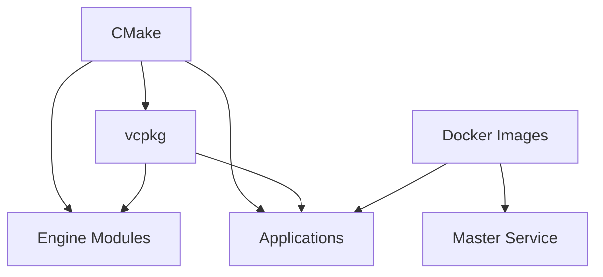

# Deployment

<cite>
**Referenced Files in This Document**
- [CMakeLists.txt](file://CMakeLists.txt)
- [CMakePresets.json](file://CMakePresets.json)
- [vcpkg.json](file://vcpkg.json)
- [docker/papa-bear-master-service/Dockerfile](file://docker/papa-bear-master-service/Dockerfile)
- [docker/steamrt4/Dockerfile](file://docker/steamrt4/Dockerfile)
- [docker/steamrt4/run-build.sh](file://docker/steamrt4/run-build.sh)
- [cmake/presets/base.json](file://cmake/presets/base.json)
- [cmake/presets/linux.json](file://cmake/presets/linux.json)
- [cmake/presets/windows.json](file://cmake/presets/windows.json)
- [cmake/toolchains/win-x64-clang.cmake](file://cmake/toolchains/win-x64-clang.cmake)
- [cmake/toolchains/linux-x64-clang.cmake](file://cmake/toolchains/linux-x64-clang.cmake)
- [cmake/toolchains/static-crt-flags-override.cmake](file://cmake/toolchains/static-crt-flags-override.cmake)
- [cmake/DistCopy.cmake](file://cmake/DistCopy.cmake)
- [cmake/GenerateBuildInfo.cmake](file://cmake/GenerateBuildInfo.cmake)
- [apps/cwr/Server/CMakeLists.txt](file://apps/cwr/Server/CMakeLists.txt)
- [apps/cwr/Server/ServerMain.cpp](file://apps/cwr/Server/ServerMain.cpp)
- [mserver/MasterService/Cargo.toml](file://mserver/MasterService/Cargo.toml)
- [mserver/MasterService/src/main.rs](file://mserver/MasterService/src/main.rs)
- [scripts/Build.ps1](file://scripts/Build.ps1)
- [scripts/Install.ps1](file://scripts/Install.ps1)
- [scripts/Start.ps1](file://scripts/Start.ps1)
</cite>

## Table of Contents
1. Introduction
2. Project Structure
3. Core Components
4. Architecture Overview
5. Detailed Component Analysis
6. Dependency Analysis
7. Performance Considerations
8. Troubleshooting Guide
9. Conclusion
10. Appendices

## Introduction
This document provides comprehensive deployment guidance for CWR-CE across development and production environments. It covers Docker containerization strategies for master servers and development, build system configuration with CMake presets and vcpkg dependencies, platform-specific optimizations, packaging distributions, digital signature verification, update mechanisms, and automation workflows. It also explains the relationship between build artifacts, deployment targets, and runtime dependencies, and includes cloud deployment options, scaling considerations, monitoring strategies, troubleshooting, and performance optimization recommendations.

## Project Structure
The repository is organized into clear layers:
- apps: Application binaries including game client and server executables
- engine: Core engine modules (graphics, audio, networking, etc.)
- mserver: Master service implementation written in Rust
- cmake: Build tooling, presets, toolchains, and packaging helpers
- docker: Container definitions for master service and a SteamRT-based build environment
- scripts: PowerShell automation for building, installing, and starting components
- thirdparty: External libraries and headers
- tests: Unit, integration, smoke, and stress tests

[No sources needed since this diagram shows conceptual project structure]

## Core Components
- CMake presets and toolchains define cross-platform builds for Windows and Linux using Clang toolchains, sanitizer configurations, and static CRT overrides where applicable.
- vcpkg manages third-party dependencies via a centralized manifest and overlay ports.
- The dedicated server application is built under apps/cwr/Server and integrates with the engine’s networking and simulation subsystems.
- The master service is implemented in Rust under mserver/MasterService and packaged as a container image.
- Dockerfiles provide reproducible environments for both development and production deployments.
- Packaging utilities generate distribution bundles and embed build metadata.

**Section sources**
- [CMakeLists.txt:1-200](file://CMakeLists.txt#L1-L200)
- [CMakePresets.json:1-200](file://CMakePresets.json#L1-L200)
- [vcpkg.json:1-200](file://vcpkg.json#L1-L200)
- [apps/cwr/Server/CMakeLists.txt:1-100](file://apps/cwr/Server/CMakeLists.txt#L1-L100)
- [apps/cwr/Server/ServerMain.cpp:1-100](file://apps/cwr/Server/ServerMain.cpp#L1-L100)
- [mserver/MasterService/Cargo.toml:1-100](file://mserver/MasterService/Cargo.toml#L1-L100)
- [mserver/MasterService/src/main.rs:1-100](file://mserver/MasterService/src/main.rs#L1-L100)
- [docker/papa-bear-master-service/Dockerfile:1-100](file://docker/papa-bear-master-service/Dockerfile#L1-L100)
- [docker/steamrt4/Dockerfile:1-100](file://docker/steamrt4/Dockerfile#L1-L100)
- [docker/steamrt4/run-build.sh:1-100](file://docker/steamrt4/run-build.sh#L1-L100)

## Architecture Overview
The deployment architecture comprises:
- Dedicated server instances running the CWR-CE server binary, orchestrated by process managers or containers.
- A master service that coordinates mod discovery, versioning, and matchmaking metadata.
- A build pipeline producing platform-specific artifacts with embedded build info and optional signatures.
- Containers isolating runtime dependencies and ensuring consistent behavior across environments.

[No sources needed since this diagram shows conceptual architecture]

## Detailed Component Analysis

### Build System Configuration with CMake Presets and vcpkg
- CMake presets centralize configuration profiles for different platforms and toolchains.
- Toolchain files specify compiler, linker flags, and environment variables for Windows and Linux builds.
- vcpkg.json declares dependencies; overlays customize specific ports when necessary.
- GenerateBuildInfo embeds version and build metadata into artifacts.
- DistCopy assists in assembling distribution packages.

**Diagram sources**
- [cmake/presets/base.json:1-200](file://cmake/presets/base.json#L1-L200)
- [cmake/presets/linux.json:1-200](file://cmake/presets/linux.json#L1-L200)
- [cmake/presets/windows.json:1-200](file://cmake/presets/windows.json#L1-L200)
- [cmake/toolchains/win-x64-clang.cmake:1-200](file://cmake/toolchains/win-x64-clang.cmake#L1-L200)
- [cmake/toolchains/linux-x64-clang.cmake:1-200](file://cmake/toolchains/linux-x64-clang.cmake#L1-L200)
- [cmake/GenerateBuildInfo.cmake:1-200](file://cmake/GenerateBuildInfo.cmake#L1-L200)
- [cmake/DistCopy.cmake:1-200](file://cmake/DistCopy.cmake#L1-L200)
- [vcpkg.json:1-200](file://vcpkg.json#L1-L200)

**Section sources**
- [CMakePresets.json:1-200](file://CMakePresets.json#L1-L200)
- [cmake/presets/base.json:1-200](file://cmake/presets/base.json#L1-L200)
- [cmake/presets/linux.json:1-200](file://cmake/presets/linux.json#L1-L200)
- [cmake/presets/windows.json:1-200](file://cmake/presets/windows.json#L1-L200)
- [cmake/toolchains/win-x64-clang.cmake:1-200](file://cmake/toolchains/win-x64-clang.cmake#L1-L200)
- [cmake/toolchains/linux-x64-clang.cmake:1-200](file://cmake/toolchains/linux-x64-clang.cmake#L1-L200)
- [cmake/toolchains/static-crt-flags-override.cmake:1-200](file://cmake/toolchains/static-crt-flags-override.cmake#L1-L200)
- [cmake/GenerateBuildInfo.cmake:1-200](file://cmake/GenerateBuildInfo.cmake#L1-L200)
- [cmake/DistCopy.cmake:1-200](file://cmake/DistCopy.cmake#L1-L200)
- [vcpkg.json:1-200](file://vcpkg.json#L1-L200)

### Docker Containerization Strategy
- papa-bear-master-service Dockerfile defines the production container for the master service, including dependency installation and entrypoint configuration.
- steamrt4 Dockerfile and run-build.sh provide a reproducible build environment leveraging Steam Runtime to ensure compatibility with graphics/audio backends during development and CI.

**Diagram sources**
- [docker/papa-bear-master-service/Dockerfile:1-200](file://docker/papa-bear-master-service/Dockerfile#L1-L200)
- [mserver/MasterService/Cargo.toml:1-200](file://mserver/MasterService/Cargo.toml#L1-L200)
- [mserver/MasterService/src/main.rs:1-200](file://mserver/MasterService/src/main.rs#L1-L200)

**Section sources**
- [docker/papa-bear-master-service/Dockerfile:1-200](file://docker/papa-bear-master-service/Dockerfile#L1-L200)
- [docker/steamrt4/Dockerfile:1-200](file://docker/steamrt4/Dockerfile#L1-L200)
- [docker/steamrt4/run-build.sh:1-200](file://docker/steamrt4/run-build.sh#L1-L200)

### Dedicated Server Implementation Details
- The server executable is defined under apps/cwr/Server with its own CMake target and main entry point.
- Integration with engine networking and simulation occurs through core engine modules.
- Configuration and runtime flags are passed via command-line arguments and environment variables.

**Diagram sources**
- [apps/cwr/Server/CMakeLists.txt:1-100](file://apps/cwr/Server/CMakeLists.txt#L1-L100)
- [apps/cwr/Server/ServerMain.cpp:1-100](file://apps/cwr/Server/ServerMain.cpp#L1-L100)

**Section sources**
- [apps/cwr/Server/CMakeLists.txt:1-100](file://apps/cwr/Server/CMakeLists.txt#L1-L100)
- [apps/cwr/Server/ServerMain.cpp:1-100](file://apps/cwr/Server/ServerMain.cpp#L1-L100)

### Packaging Distributions and Digital Signature Verification
- Packaging utilities assemble runtime dependencies, configuration files, and binaries into distributable archives.
- Build metadata is embedded via GenerateBuildInfo for traceability.
- Digital signatures can be applied post-build to verify artifact integrity before deployment.

**Diagram sources**
- [cmake/DistCopy.cmake:1-200](file://cmake/DistCopy.cmake#L1-L200)
- [cmake/GenerateBuildInfo.cmake:1-200](file://cmake/GenerateBuildInfo.cmake#L1-L200)

**Section sources**
- [cmake/DistCopy.cmake:1-200](file://cmake/DistCopy.cmake#L1-L200)
- [cmake/GenerateBuildInfo.cmake:1-200](file://cmake/GenerateBuildInfo.cmake#L1-L200)

### Update Mechanisms
- Versioning is managed via build metadata and container tags.
- Clients and servers should implement periodic checks against a trusted endpoint to fetch updates.
- Rollback strategies include maintaining previous versions and atomic swaps.

[No sources needed since this section provides general guidance]

### Automation Scripts
- PowerShell scripts automate building, installing, and starting components for local development and CI pipelines.

**Section sources**
- [scripts/Build.ps1:1-200](file://scripts/Build.ps1#L1-L200)
- [scripts/Install.ps1:1-200](file://scripts/Install.ps1#L1-L200)
- [scripts/Start.ps1:1-200](file://scripts/Start.ps1#L1-L200)

## Dependency Analysis
- CMake orchestrates the build and links engine modules, applications, and tools.
- vcpkg resolves external dependencies required by both C++ and Rust components.
- Docker images encapsulate runtime dependencies for consistent deployment.

**Diagram sources**
- [CMakeLists.txt:1-200](file://CMakeLists.txt#L1-L200)
- [vcpkg.json:1-200](file://vcpkg.json#L1-L200)
- [docker/papa-bear-master-service/Dockerfile:1-200](file://docker/papa-bear-master-service/Dockerfile#L1-L200)

**Section sources**
- [CMakeLists.txt:1-200](file://CMakeLists.txt#L1-L200)
- [vcpkg.json:1-200](file://vcpkg.json#L1-L200)

## Performance Considerations
- Use release builds with appropriate optimization flags in CMake presets for production.
- Enable link-time optimization and profile-guided optimization where supported.
- Minimize container image size by multi-stage builds and pruning unnecessary dependencies.
- Tune server thread pools, network buffers, and I/O settings based on workload characteristics.
- Monitor CPU, memory, and network utilization to identify bottlenecks.

[No sources needed since this section provides general guidance]

## Troubleshooting Guide
Common deployment issues and resolutions:
- Missing runtime libraries: Ensure all dynamic dependencies are bundled or installed on the host.
- Permission errors: Verify file and directory permissions for logs and data directories.
- Port conflicts: Confirm that required ports are available and not blocked by firewalls.
- Container startup failures: Inspect container logs and environment variable configurations.
- Signature verification failures: Validate certificate chains and timestamps.

**Section sources**
- [docker/papa-bear-master-service/Dockerfile:1-200](file://docker/papa-bear-master-service/Dockerfile#L1-L200)
- [cmake/DistCopy.cmake:1-200](file://cmake/DistCopy.cmake#L1-L200)

## Conclusion
CWR-CE provides a robust, containerized deployment model with a flexible build system supporting multiple platforms and toolchains. By leveraging CMake presets, vcpkg dependencies, and Docker images, teams can achieve consistent builds and reliable deployments. Following the guidelines in this document ensures secure, scalable, and maintainable operations in both development and production environments.

[No sources needed since this section summarizes without analyzing specific files]

## Appendices

### Practical Examples

#### Building Custom Distributions
- Select the appropriate preset for your target platform.
- Resolve dependencies via vcpkg.
- Build the desired targets and package outputs.
- Apply digital signatures and distribute.

**Section sources**
- [CMakePresets.json:1-200](file://CMakePresets.json#L1-L200)
- [vcpkg.json:1-200](file://vcpkg.json#L1-L200)
- [cmake/DistCopy.cmake:1-200](file://cmake/DistCopy.cmake#L1-L200)

#### Setting Up Dedicated Servers
- Deploy the server binary with required runtime dependencies.
- Configure network settings and mission paths.
- Run with process manager or container orchestration.

**Section sources**
- [apps/cwr/Server/CMakeLists.txt:1-100](file://apps/cwr/Server/CMakeLists.txt#L1-L100)
- [apps/cwr/Server/ServerMain.cpp:1-100](file://apps/cwr/Server/ServerMain.cpp#L1-L100)

#### Automating Deployments
- Integrate build and packaging steps into CI/CD pipelines.
- Push container images to registry and deploy to cloud platforms.
- Implement health checks and rolling updates.

**Section sources**
- [scripts/Build.ps1:1-200](file://scripts/Build.ps1#L1-L200)
- [scripts/Install.ps1:1-200](file://scripts/Install.ps1#L1-L200)
- [scripts/Start.ps1:1-200](file://scripts/Start.ps1#L1-L200)

#### Cloud Deployment Options
- Use managed container services (e.g., Kubernetes, ECS, AKS).
- Scale horizontally based on load metrics.
- Store configuration and state in persistent volumes.

[No sources needed since this section provides general guidance]

#### Monitoring Strategies
- Collect logs centrally and set up alerting for critical events.
- Track key metrics such as request latency, error rates, and resource usage.
- Use distributed tracing for complex interactions between services.

[No sources needed since this section provides general guidance]