# Application Framework

<cite>
**Referenced Files in This Document**
- [Application.hpp](file://engine/Poseidon/Core/Application.hpp)
- [Application.cpp](file://engine/Poseidon/Core/Application.cpp)
- [GameApplication.hpp](file://apps/cwr/Game/GameApplication.hpp)
- [GameApplication.cpp](file://apps/cwr/Game/GameApplication.cpp)
- [WinMain.cpp](file://apps/cwr/Game/WinMain.cpp)
- [ServerApplication.hpp](file://apps/cwr/Server/ServerApplication.hpp)
- [ServerApplication.cpp](file://apps/cwr/Server/ServerApplication.cpp)
- [ServerMain.cpp](file://apps/cwr/Server/ServerMain.cpp)
- [GameBase.hpp](file://apps/cwr/GameBase/GameBase.hpp)
- [GameBase.cpp](file://apps/cwr/GameBase/GameBase.cpp)
- [platform.hpp](file://engine/Poseidon/Foundation/platform.hpp)
- [EngineGL33_Lifecycle.cpp](file://engine/PoseidonGL33/EngineGL33_Lifecycle.cpp)
- [SoundSystemOAL.hpp](file://engine/PoseidonOpenAL/SoundSystemOAL.hpp)
- [InputSubsystem.hpp](file://engine/Poseidon/Input/InputSubsystem.hpp)
- [NetworkManagerState.hpp](file://engine/Poseidon/Network/NetworkManagerState.hpp)
</cite>

## Table of Contents
1. [Introduction](#introduction)
2. [Project Structure](#project-structure)
3. [Core Components](#core-components)
4. [Architecture Overview](#architecture-overview)
5. [Detailed Component Analysis](#detailed-component-analysis)
6. [Dependency Analysis](#dependency-analysis)
7. [Performance Considerations](#performance-considerations)
8. [Troubleshooting Guide](#troubleshooting-guide)
9. [Conclusion](#conclusion)
10. [Appendices](#appendices)

## Introduction
This document explains the Poseidon Application Framework with a focus on application lifecycle management, initialization sequence, and platform abstraction. It details the Application class architecture, startup and shutdown procedures, cross-platform compatibility mechanisms, and the InitBridge pattern used to integrate platform-specific code. It also provides guidance for extending the framework to build custom game applications, covering configuration loading, error handling strategies, memory management patterns, resource cleanup, and debugging support.

## Project Structure
At a high level, the framework is organized into:
- Core engine components under engine/Poseidon (application core, input, audio, graphics, network, UI, world, etc.)
- Platform abstractions and backends under engine/PoseidonFoundation and engine/Poseidon* (e.g., OpenGL, OpenAL)
- Concrete applications under apps/cwr (game, server, demo) that derive from the framework’s base classes
- Tools and utilities under apps/tools and thirdparty libraries

The Application class serves as the central orchestrator for lifecycle events, subsystem initialization, and shutdown. Platform entry points (for example, WinMain on Windows) bootstrap the process and hand control to the Application instance.

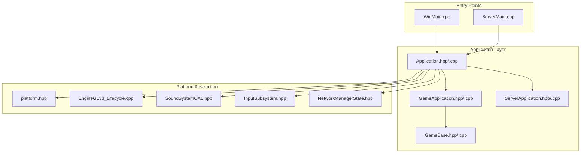

**Diagram sources**
- [WinMain.cpp](file://apps/cwr/Game/WinMain.cpp)
- [ServerMain.cpp](file://apps/cwr/Server/ServerMain.cpp)
- [Application.hpp](file://engine/Poseidon/Core/Application.hpp)
- [Application.cpp](file://engine/Poseidon/Core/Application.cpp)
- [GameApplication.hpp](file://apps/cwr/Game/GameApplication.hpp)
- [GameApplication.cpp](file://apps/cwr/Game/GameApplication.cpp)
- [ServerApplication.hpp](file://apps/cwr/Server/ServerApplication.hpp)
- [ServerApplication.cpp](file://apps/cwr/Server/ServerApplication.cpp)
- [GameBase.hpp](file://apps/cwr/GameBase/GameBase.hpp)
- [GameBase.cpp](file://apps/cwr/GameBase/GameBase.cpp)
- [platform.hpp](file://engine/Poseidon/Foundation/platform.hpp)
- [EngineGL33_Lifecycle.cpp](file://engine/PoseidonGL33/EngineGL33_Lifecycle.cpp)
- [SoundSystemOAL.hpp](file://engine/PoseidonOpenAL/SoundSystemOAL.hpp)
- [InputSubsystem.hpp](file://engine/Poseidon/Input/InputSubsystem.hpp)
- [NetworkManagerState.hpp](file://engine/Poseidon/Network/NetworkManagerState.hpp)

**Section sources**
- [Application.hpp](file://engine/Poseidon/Core/Application.hpp)
- [Application.cpp](file://engine/Poseidon/Core/Application.cpp)
- [GameApplication.hpp](file://apps/cwr/Game/GameApplication.hpp)
- [GameApplication.cpp](file://apps/cwr/Game/GameApplication.cpp)
- [ServerApplication.hpp](file://apps/cwr/Server/ServerApplication.hpp)
- [ServerApplication.cpp](file://apps/cwr/Server/ServerApplication.cpp)
- [GameBase.hpp](file://apps/cwr/GameBase/GameBase.hpp)
- [GameBase.cpp](file://apps/cwr/GameBase/GameBase.cpp)
- [platform.hpp](file://engine/Poseidon/Foundation/platform.hpp)

## Core Components
- Application: The central lifecycle manager responsible for initialization, main loop orchestration, and shutdown. It coordinates subsystems such as graphics, audio, input, and networking.
- GameApplication: A concrete application type for client-side games, extending the base Application to provide game-specific setup and behavior.
- ServerApplication: A concrete application type for server processes, extending the base Application to configure and run server-only features.
- GameBase: A shared base for game logic and common functionality across different application types.

Key responsibilities:
- Startup: Parse arguments, initialize logging, load configuration, create and initialize subsystems, and start the main loop.
- Main Loop: Process input, update simulation, render frames, and handle network I/O.
- Shutdown: Gracefully tear down subsystems, release resources, and exit cleanly.

Cross-platform compatibility:
- Platform abstraction via platform.hpp and backend-specific files (e.g., EngineGL33_Lifecycle.cpp).
- Entry points abstracted per platform (e.g., WinMain on Windows), delegating to the Application instance.

**Section sources**
- [Application.hpp](file://engine/Poseidon/Core/Application.hpp)
- [Application.cpp](file://engine/Poseidon/Core/Application.cpp)
- [GameApplication.hpp](file://apps/cwr/Game/GameApplication.hpp)
- [GameApplication.cpp](file://apps/cwr/Game/GameApplication.cpp)
- [ServerApplication.hpp](file://apps/cwr/Server/ServerApplication.hpp)
- [ServerApplication.cpp](file://apps/cwr/Server/ServerApplication.cpp)
- [GameBase.hpp](file://apps/cwr/GameBase/GameBase.hpp)
- [GameBase.cpp](file://apps/cwr/GameBase/GameBase.cpp)
- [platform.hpp](file://engine/Poseidon/Foundation/platform.hpp)

## Architecture Overview
The Poseidon Application Framework follows a layered architecture:
- Entry Point Layer: Platform-specific entry points (e.g., WinMain) bootstrap the runtime and construct the Application instance.
- Application Layer: Application orchestrates lifecycle events and delegates to subsystems.
- Subsystem Layer: Graphics, audio, input, networking, and other services are initialized and managed by the Application.
- Platform Abstraction: Backend implementations (e.g., OpenGL, OpenAL) are selected at runtime or compile time based on platform and configuration.

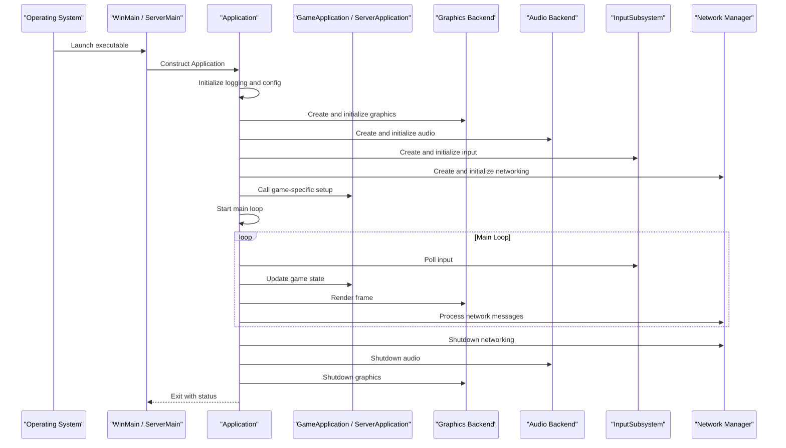

**Diagram sources**
- [WinMain.cpp](file://apps/cwr/Game/WinMain.cpp)
- [ServerMain.cpp](file://apps/cwr/Server/ServerMain.cpp)
- [Application.hpp](file://engine/Poseidon/Core/Application.hpp)
- [Application.cpp](file://engine/Poseidon/Core/Application.cpp)
- [GameApplication.hpp](file://apps/cwr/Game/GameApplication.hpp)
- [GameApplication.cpp](file://apps/cwr/Game/GameApplication.cpp)
- [ServerApplication.hpp](file://apps/cwr/Server/ServerApplication.hpp)
- [ServerApplication.cpp](file://apps/cwr/Server/ServerApplication.cpp)
- [EngineGL33_Lifecycle.cpp](file://engine/PoseidonGL33/EngineGL33_Lifecycle.cpp)
- [SoundSystemOAL.hpp](file://engine/PoseidonOpenAL/SoundSystemOAL.hpp)
- [InputSubsystem.hpp](file://engine/Poseidon/Input/InputSubsystem.hpp)
- [NetworkManagerState.hpp](file://engine/Poseidon/Network/NetworkManagerState.hpp)

## Detailed Component Analysis

### Application Class Architecture
The Application class encapsulates the entire lifecycle:
- Construction: Sets up internal state and prepares subsystem interfaces.
- Initialization: Loads configuration, initializes logging, creates subsystems, and performs platform-specific setup via InitBridge.
- Main Loop: Iteratively updates and renders until termination conditions are met.
- Shutdown: Ensures ordered teardown of subsystems and resource cleanup.

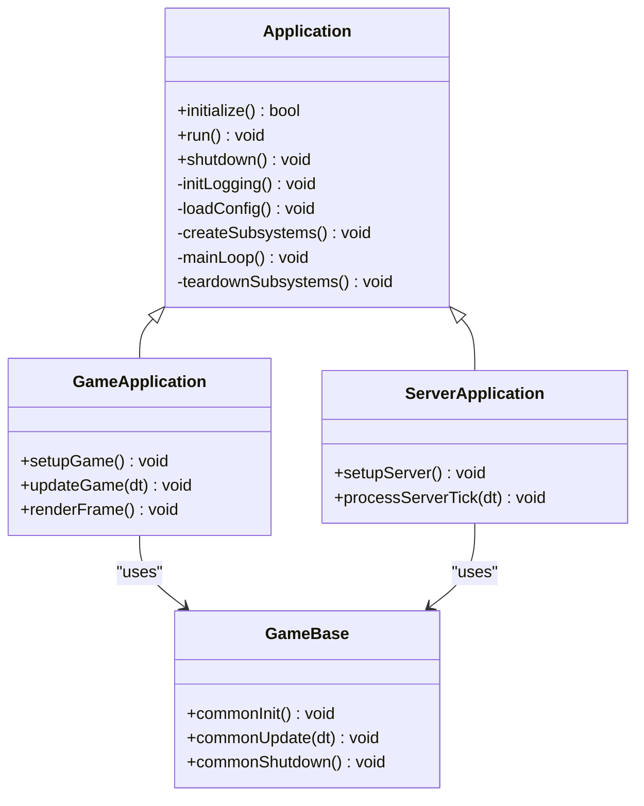

**Diagram sources**
- [Application.hpp](file://engine/Poseidon/Core/Application.hpp)
- [Application.cpp](file://engine/Poseidon/Core/Application.cpp)
- [GameApplication.hpp](file://apps/cwr/Game/GameApplication.hpp)
- [GameApplication.cpp](file://apps/cwr/Game/GameApplication.cpp)
- [ServerApplication.hpp](file://apps/cwr/Server/ServerApplication.hpp)
- [ServerApplication.cpp](file://apps/cwr/Server/ServerApplication.cpp)
- [GameBase.hpp](file://apps/cwr/GameBase/GameBase.hpp)
- [GameBase.cpp](file://apps/cwr/GameBase/GameBase.cpp)

**Section sources**
- [Application.hpp](file://engine/Poseidon/Core/Application.hpp)
- [Application.cpp](file://engine/Poseidon/Core/Application.cpp)
- [GameApplication.hpp](file://apps/cwr/Game/GameApplication.hpp)
- [GameApplication.cpp](file://apps/cwr/Game/GameApplication.cpp)
- [ServerApplication.hpp](file://apps/cwr/Server/ServerApplication.hpp)
- [ServerApplication.cpp](file://apps/cwr/Server/ServerApplication.cpp)
- [GameBase.hpp](file://apps/cwr/GameBase/GameBase.hpp)
- [GameBase.cpp](file://apps/cwr/GameBase/GameBase.cpp)

### Initialization Sequence and InitBridge Pattern
Initialization follows a strict order to ensure dependencies are ready:
- Logging and configuration are initialized first.
- Platform-specific setup occurs via InitBridge, which abstracts differences between operating systems and environments.
- Subsystems (graphics, audio, input, networking) are created and initialized in dependency order.
- Game-specific setup runs after subsystems are ready.

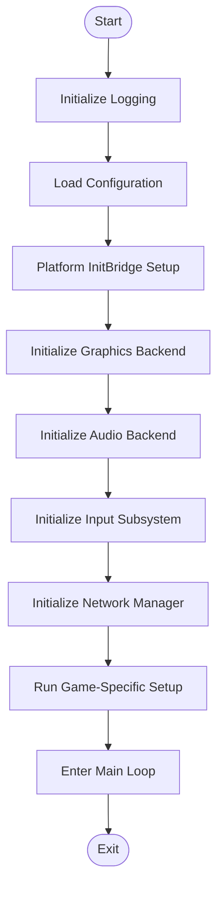

**Diagram sources**
- [Application.hpp](file://engine/Poseidon/Core/Application.hpp)
- [Application.cpp](file://engine/Poseidon/Core/Application.cpp)
- [platform.hpp](file://engine/Poseidon/Foundation/platform.hpp)
- [EngineGL33_Lifecycle.cpp](file://engine/PoseidonGL33/EngineGL33_Lifecycle.cpp)
- [SoundSystemOAL.hpp](file://engine/PoseidonOpenAL/SoundSystemOAL.hpp)
- [InputSubsystem.hpp](file://engine/Poseidon/Input/InputSubsystem.hpp)
- [NetworkManagerState.hpp](file://engine/Poseidon/Network/NetworkManagerState.hpp)

**Section sources**
- [Application.hpp](file://engine/Poseidon/Core/Application.hpp)
- [Application.cpp](file://engine/Poseidon/Core/Application.cpp)
- [platform.hpp](file://engine/Poseidon/Foundation/platform.hpp)

### Startup Procedures and Shutdown Handling
Startup:
- Entry point constructs the Application instance.
- Application initializes logging and loads configuration.
- Platform-specific InitBridge sets up environment capabilities.
- Subsystems are created and initialized in dependency order.
- Game-specific setup executes before entering the main loop.

Shutdown:
- Main loop exits when termination conditions are met.
- Subsystems are torn down in reverse order of initialization.
- Resources are released, logs are flushed, and the process exits cleanly.

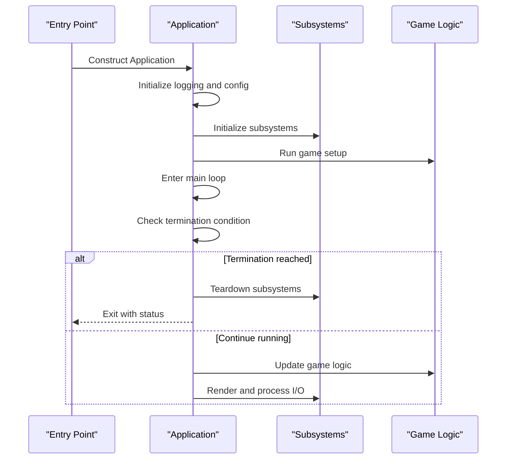

**Diagram sources**
- [WinMain.cpp](file://apps/cwr/Game/WinMain.cpp)
- [ServerMain.cpp](file://apps/cwr/Server/ServerMain.cpp)
- [Application.hpp](file://engine/Poseidon/Core/Application.hpp)
- [Application.cpp](file://engine/Poseidon/Core/Application.cpp)

**Section sources**
- [WinMain.cpp](file://apps/cwr/Game/WinMain.cpp)
- [ServerMain.cpp](file://apps/cwr/Server/ServerMain.cpp)
- [Application.hpp](file://engine/Poseidon/Core/Application.hpp)
- [Application.cpp](file://engine/Poseidon/Core/Application.cpp)

### Cross-Platform Compatibility Mechanisms
Cross-platform compatibility is achieved through:
- Platform abstraction layer (platform.hpp) providing unified interfaces.
- Backend-specific implementations (e.g., OpenGL lifecycle, OpenAL audio) selected at runtime or compile time.
- Entry points abstracted per platform (e.g., WinMain on Windows) delegating to the Application instance.

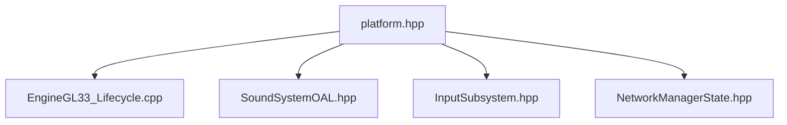

**Diagram sources**
- [platform.hpp](file://engine/Poseidon/Foundation/platform.hpp)
- [EngineGL33_Lifecycle.cpp](file://engine/PoseidonGL33/EngineGL33_Lifecycle.cpp)
- [SoundSystemOAL.hpp](file://engine/PoseidonOpenAL/SoundSystemOAL.hpp)
- [InputSubsystem.hpp](file://engine/Poseidon/Input/InputSubsystem.hpp)
- [NetworkManagerState.hpp](file://engine/Poseidon/Network/NetworkManagerState.hpp)

**Section sources**
- [platform.hpp](file://engine/Poseidon/Foundation/platform.hpp)
- [EngineGL33_Lifecycle.cpp](file://engine/PoseidonGL33/EngineGL33_Lifecycle.cpp)
- [SoundSystemOAL.hpp](file://engine/PoseidonOpenAL/SoundSystemOAL.hpp)
- [InputSubsystem.hpp](file://engine/Poseidon/Input/InputSubsystem.hpp)
- [NetworkManagerState.hpp](file://engine/Poseidon/Network/NetworkManagerState.hpp)

### Integration with Platform-Specific Code via InitBridge
The InitBridge pattern centralizes platform-specific initialization:
- Abstract interface defined in platform abstraction.
- Concrete implementations provided per platform.
- Application calls InitBridge during startup to configure platform capabilities.

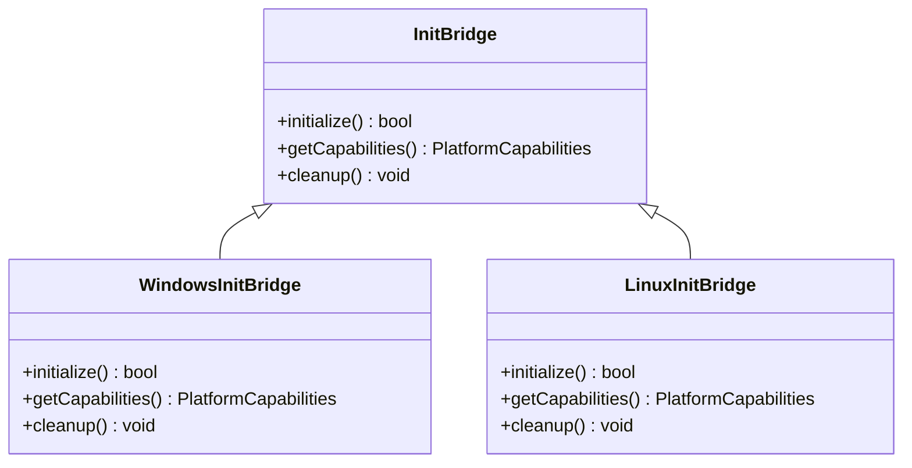

**Diagram sources**
- [platform.hpp](file://engine/Poseidon/Foundation/platform.hpp)

**Section sources**
- [platform.hpp](file://engine/Poseidon/Foundation/platform.hpp)

### Examples of Custom Application Setup
To extend the framework for a custom game application:
- Derive from GameApplication or ServerApplication depending on your needs.
- Override setup methods to configure game-specific features.
- Use GameBase for shared logic across different application types.

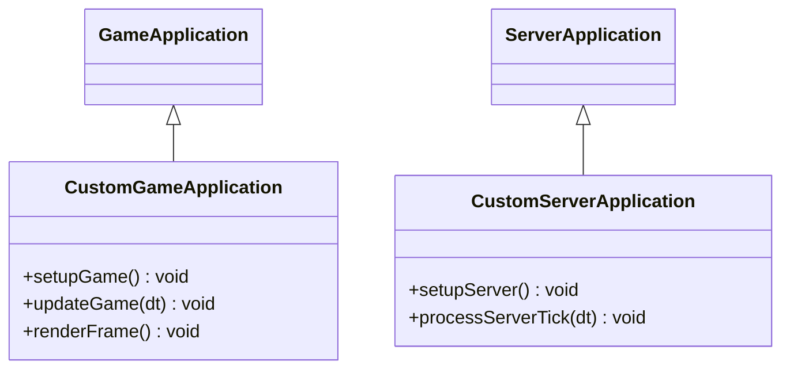

**Diagram sources**
- [GameApplication.hpp](file://apps/cwr/Game/GameApplication.hpp)
- [GameApplication.cpp](file://apps/cwr/Game/GameApplication.cpp)
- [ServerApplication.hpp](file://apps/cwr/Server/ServerApplication.hpp)
- [ServerApplication.cpp](file://apps/cwr/Server/ServerApplication.cpp)
- [GameBase.hpp](file://apps/cwr/GameBase/GameBase.hpp)
- [GameBase.cpp](file://apps/cwr/GameBase/GameBase.cpp)

**Section sources**
- [GameApplication.hpp](file://apps/cwr/Game/GameApplication.hpp)
- [GameApplication.cpp](file://apps/cwr/Game/GameApplication.cpp)
- [ServerApplication.hpp](file://apps/cwr/Server/ServerApplication.hpp)
- [ServerApplication.cpp](file://apps/cwr/Server/ServerApplication.cpp)
- [GameBase.hpp](file://apps/cwr/GameBase/GameBase.hpp)
- [GameBase.cpp](file://apps/cwr/GameBase/GameBase.cpp)

### Configuration Loading and Error Handling Strategies
Configuration loading:
- Centralized in Application during initialization.
- Supports multiple sources (command-line, config files, defaults).
- Validates critical settings before proceeding.

Error handling:
- Early validation with clear error messages.
- Graceful degradation where possible.
- Structured error propagation to upper layers.

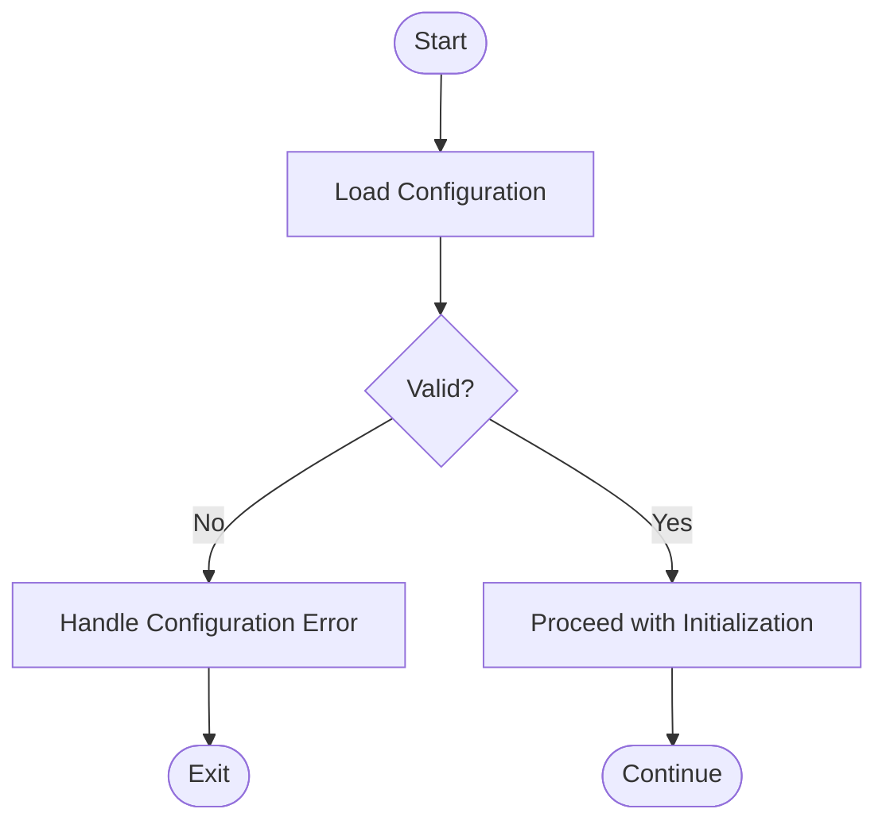

**Diagram sources**
- [Application.hpp](file://engine/Poseidon/Core/Application.hpp)
- [Application.cpp](file://engine/Poseidon/Core/Application.cpp)

**Section sources**
- [Application.hpp](file://engine/Poseidon/Core/Application.hpp)
- [Application.cpp](file://engine/Poseidon/Core/Application.cpp)

### Memory Management Patterns and Resource Cleanup
Memory management patterns:
- RAII principles for resource ownership.
- Smart pointers and containers for automatic cleanup.
- Explicit resource lifecycle management in subsystems.

Resource cleanup:
- Ordered teardown during shutdown.
- Fallback cleanup paths for error scenarios.
- Logging of resource deallocation for debugging.

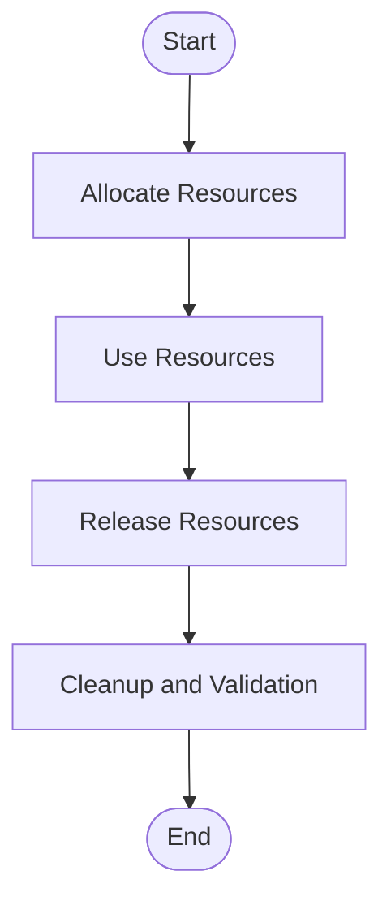

**Diagram sources**
- [Application.hpp](file://engine/Poseidon/Core/Application.hpp)
- [Application.cpp](file://engine/Poseidon/Core/Application.cpp)

**Section sources**
- [Application.hpp](file://engine/Poseidon/Core/Application.hpp)
- [Application.cpp](file://engine/Poseidon/Core/Application.cpp)

### Debugging Support
Debugging support includes:
- Comprehensive logging throughout the initialization and runtime phases.
- Diagnostic hooks in subsystems for performance and state inspection.
- Platform-specific debug tools integration (e.g., RenderDoc for graphics).

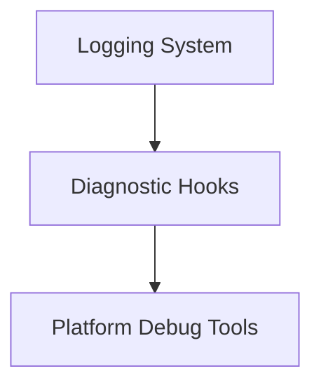

**Diagram sources**
- [Application.hpp](file://engine/Poseidon/Core/Application.hpp)
- [Application.cpp](file://engine/Poseidon/Core/Application.cpp)

**Section sources**
- [Application.hpp](file://engine/Poseidon/Core/Application.hpp)
- [Application.cpp](file://engine/Poseidon/Core/Application.cpp)

## Dependency Analysis
The Application class depends on various subsystems and platform abstractions. Understanding these dependencies is crucial for maintaining and extending the framework.

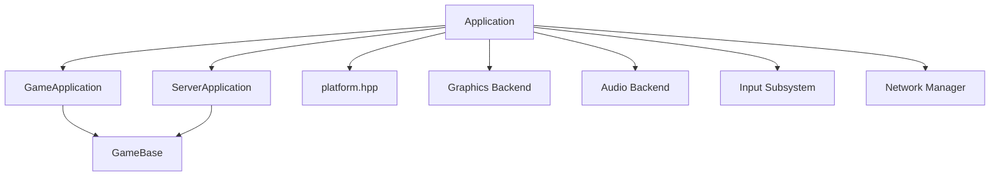

**Diagram sources**
- [Application.hpp](file://engine/Poseidon/Core/Application.hpp)
- [Application.cpp](file://engine/Poseidon/Core/Application.cpp)
- [GameApplication.hpp](file://apps/cwr/Game/GameApplication.hpp)
- [GameApplication.cpp](file://apps/cwr/Game/GameApplication.cpp)
- [ServerApplication.hpp](file://apps/cwr/Server/ServerApplication.hpp)
- [ServerApplication.cpp](file://apps/cwr/Server/ServerApplication.cpp)
- [GameBase.hpp](file://apps/cwr/GameBase/GameBase.hpp)
- [GameBase.cpp](file://apps/cwr/GameBase/GameBase.cpp)
- [platform.hpp](file://engine/Poseidon/Foundation/platform.hpp)

**Section sources**
- [Application.hpp](file://engine/Poseidon/Core/Application.hpp)
- [Application.cpp](file://engine/Poseidon/Core/Application.cpp)
- [GameApplication.hpp](file://apps/cwr/Game/GameApplication.hpp)
- [GameApplication.cpp](file://apps/cwr/Game/GameApplication.cpp)
- [ServerApplication.hpp](file://apps/cwr/Server/ServerApplication.hpp)
- [ServerApplication.cpp](file://apps/cwr/Server/ServerApplication.cpp)
- [GameBase.hpp](file://apps/cwr/GameBase/GameBase.hpp)
- [GameBase.cpp](file://apps/cwr/GameBase/GameBase.cpp)
- [platform.hpp](file://engine/Poseidon/Foundation/platform.hpp)

## Performance Considerations
- Minimize initialization overhead by lazy-loading non-critical subsystems.
- Use efficient data structures and algorithms in the main loop.
- Profile and optimize hot paths in rendering and simulation.
- Leverage multi-threading where appropriate while maintaining thread safety.

[No sources needed since this section provides general guidance]

## Troubleshooting Guide
Common issues and resolutions:
- Initialization failures: Check logging output for specific error messages.
- Platform-specific problems: Verify platform capabilities and backend availability.
- Resource leaks: Ensure proper cleanup in all code paths, especially error scenarios.
- Performance bottlenecks: Use profiling tools to identify slow operations.

**Section sources**
- [Application.hpp](file://engine/Poseidon/Core/Application.hpp)
- [Application.cpp](file://engine/Poseidon/Core/Application.cpp)

## Conclusion
The Poseidon Application Framework provides a robust foundation for building cross-platform applications with well-defined lifecycle management, platform abstraction, and extensibility points. By following the established patterns for initialization, shutdown, and subsystem integration, developers can create reliable and maintainable applications. The framework’s design supports both game and server applications, making it versatile for various use cases.

[No sources needed since this section summarizes without analyzing specific files]

## Appendices
- Best practices for extending the framework
- Common pitfalls and how to avoid them
- Additional resources and references

[No sources needed since this section provides general guidance]