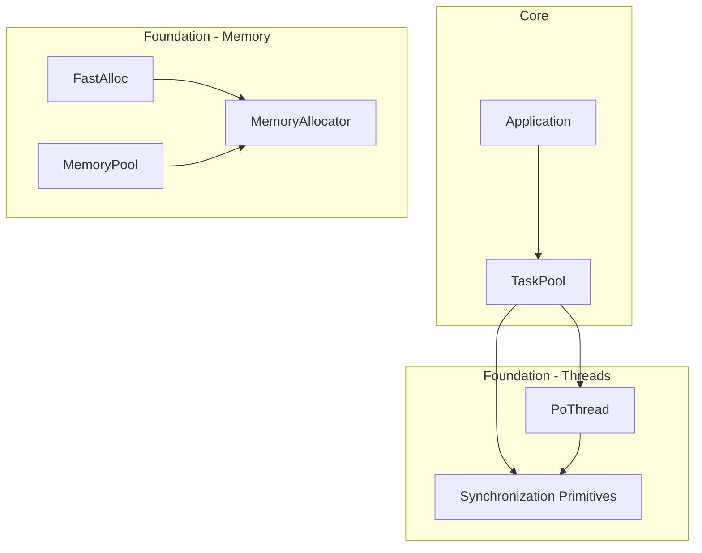
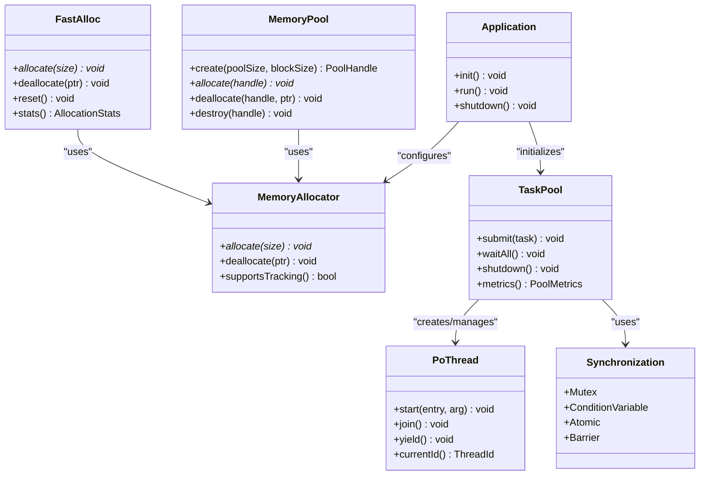
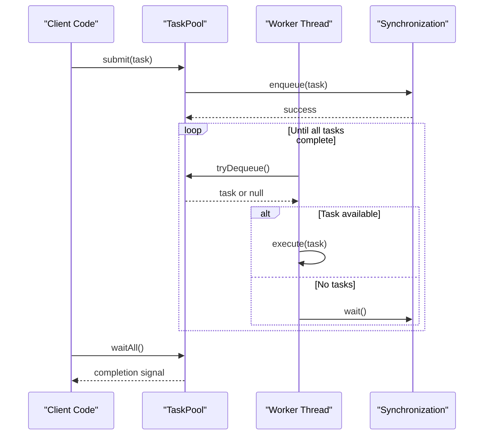
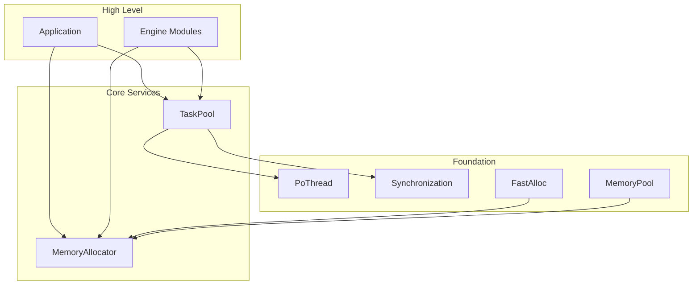

# Core Services

<cite>
**Referenced Files in This Document**
- [TaskPool.hpp](file://engine/Poseidon/Core/TaskPool.hpp)
- [TaskPool.cpp](file://engine/Poseidon/Core/TaskPool.cpp)
- [MemoryAllocator.hpp](file://engine/Poseidon/Foundation/Memory/MemoryAllocator.hpp)
- [FastAlloc.hpp](file://engine/Poseidon/Foundation/Memory/FastAlloc.hpp)
- [MemoryPool.hpp](file://engine/Poseidon/Foundation/Memory/MemoryPool.hpp)
- [Thread.hpp](file://engine/Poseidon/Foundation/Threads/Thread.hpp)
- [Synchronization.hpp](file://engine/Poseidon/Foundation/Threads/Synchronization.hpp)
- [Application.hpp](file://engine/Poseidon/Core/Application.hpp)
</cite>

## Table of Contents
1. [Introduction](#introduction)
2. [Project Structure](#project-structure)
3. [Core Components](#core-components)
4. [Architecture Overview](#architecture-overview)
5. [Detailed Component Analysis](#detailed-component-analysis)
6. [Dependency Analysis](#dependency-analysis)
7. [Performance Considerations](#performance-considerations)
8. [Troubleshooting Guide](#troubleshooting-guide)
9. [Conclusion](#conclusion)
10. [Appendices](#appendices)

## Introduction
This document explains the Core Services that provide fundamental engine capabilities for memory management and threading. It covers:
- Memory management system including FastAlloc allocator, memory pools, and allocation tracking
- Threading model with PoThread implementation, synchronization primitives, and task parallelization through TaskPool
- Integration patterns across engine modules
- Examples of custom allocators, thread-safe data structures, and concurrent task execution
- Performance optimization techniques, memory debugging tools, and thread safety best practices
- Guidance on profiling memory usage and identifying concurrency issues

## Project Structure
The Core Services are primarily implemented under the Poseidon core and foundation layers:
- Core services: TaskPool (task parallelization), Application lifecycle
- Foundation memory: FastAlloc, MemoryPool, MemoryAllocator
- Foundation threads: Thread abstraction and synchronization primitives

**Diagram sources**
- [Application.hpp](file://engine/Poseidon/Core/Application.hpp)
- [TaskPool.hpp](file://engine/Poseidon/Core/TaskPool.hpp)
- [MemoryAllocator.hpp](file://engine/Poseidon/Foundation/Memory/MemoryAllocator.hpp)
- [FastAlloc.hpp](file://engine/Poseidon/Foundation/Memory/FastAlloc.hpp)
- [MemoryPool.hpp](file://engine/Poseidon/Foundation/Memory/MemoryPool.hpp)
- [Thread.hpp](file://engine/Poseidon/Foundation/Threads/Thread.hpp)
- [Synchronization.hpp](file://engine/Poseidon/Foundation/Threads/Synchronization.hpp)

**Section sources**
- [TaskPool.hpp](file://engine/Poseidon/Core/TaskPool.hpp)
- [TaskPool.cpp](file://engine/Poseidon/Core/TaskPool.cpp)
- [MemoryAllocator.hpp](file://engine/Poseidon/Foundation/Memory/MemoryAllocator.hpp)
- [FastAlloc.hpp](file://engine/Poseidon/Foundation/Memory/FastAlloc.hpp)
- [MemoryPool.hpp](file://engine/Poseidon/Foundation/Memory/MemoryPool.hpp)
- [Thread.hpp](file://engine/Poseidon/Foundation/Threads/Thread.hpp)
- [Synchronization.hpp](file://engine/Poseidon/Foundation/Threads/Synchronization.hpp)
- [Application.hpp](file://engine/Poseidon/Core/Application.hpp)

## Core Components
- FastAlloc: A fast path allocator optimized for small, frequent allocations with minimal overhead
- MemoryPool: Object pool for fixed-size allocations to reduce fragmentation and improve locality
- MemoryAllocator: Abstraction layer over platform allocators enabling custom backends and tracking
- PoThread: Cross-platform thread abstraction providing creation, lifecycle, and scheduling control
- Synchronization Primitives: Mutexes, condition variables, atomics, and barriers used by higher-level components
- TaskPool: Work-stealing or queue-based parallel task execution harness integrated with the threading model

These components are designed to be composable:
- TaskPool uses PoThread and synchronization primitives to distribute work
- FastAlloc and MemoryPool can be configured via MemoryAllocator to integrate with engine subsystems
- Application orchestrates initialization and teardown of these services

**Section sources**
- [FastAlloc.hpp](file://engine/Poseidon/Foundation/Memory/FastAlloc.hpp)
- [MemoryPool.hpp](file://engine/Poseidon/Foundation/Memory/MemoryPool.hpp)
- [MemoryAllocator.hpp](file://engine/Poseidon/Foundation/Memory/MemoryAllocator.hpp)
- [Thread.hpp](file://engine/Poseidon/Foundation/Threads/Thread.hpp)
- [Synchronization.hpp](file://engine/Poseidon/Foundation/Threads/Synchronization.hpp)
- [TaskPool.hpp](file://engine/Poseidon/Core/TaskPool.hpp)
- [TaskPool.cpp](file://engine/Poseidon/Core/TaskPool.cpp)
- [Application.hpp](file://engine/Poseidon/Core/Application.hpp)

## Architecture Overview
The Core Services architecture separates concerns between memory and threading while providing integration points for engine modules.

**Diagram sources**
- [MemoryAllocator.hpp](file://engine/Poseidon/Foundation/Memory/MemoryAllocator.hpp)
- [FastAlloc.hpp](file://engine/Poseidon/Foundation/Memory/FastAlloc.hpp)
- [MemoryPool.hpp](file://engine/Poseidon/Foundation/Memory/MemoryPool.hpp)
- [Thread.hpp](file://engine/Poseidon/Foundation/Threads/Thread.hpp)
- [Synchronization.hpp](file://engine/Poseidon/Foundation/Threads/Synchronization.hpp)
- [TaskPool.hpp](file://engine/Poseidon/Core/TaskPool.hpp)
- [Application.hpp](file://engine/Poseidon/Core/Application.hpp)

## Detailed Component Analysis

### Memory Management System
The memory management system provides a layered approach:
- MemoryAllocator defines the interface for allocation/deallocation and optional tracking
- FastAlloc implements a high-performance allocator for small objects with per-thread caches
- MemoryPool manages fixed-size blocks to reduce fragmentation and improve cache locality
- Allocation tracking is enabled via MemoryAllocator hooks for debugging and profiling

Key responsibilities:
- Minimize allocation overhead and fragmentation
- Provide deterministic memory behavior for real-time systems
- Support custom backends for specialized use cases

Integration points:
- Engine modules configure MemoryAllocator at startup
- FastAlloc and MemoryPool can be selected based on workload characteristics
- Tracking hooks enable memory debugging tools

**Section sources**
- [MemoryAllocator.hpp](file://engine/Poseidon/Foundation/Memory/MemoryAllocator.hpp)
- [FastAlloc.hpp](file://engine/Poseidon/Foundation/Memory/FastAlloc.hpp)
- [MemoryPool.hpp](file://engine/Poseidon/Foundation/Memory/MemoryPool.hpp)

#### FastAlloc Allocator
FastAlloc is optimized for small, frequent allocations:
- Per-thread allocation caches reduce contention
- Binned allocation strategies for different size classes
- Minimal locking overhead for single-threaded hot paths
- Optional allocation tracking for debugging

Complexity considerations:
- O(1) average case for allocate/deallocate operations
- Low memory overhead for metadata
- Cache-friendly memory layout for frequently accessed objects

Optimization opportunities:
- Tune bin sizes based on application workload
- Implement custom allocation strategies for specific object types
- Use memory pools for predictable allocation patterns

**Section sources**
- [FastAlloc.hpp](file://engine/Poseidon/Foundation/Memory/FastAlloc.hpp)

#### Memory Pools
MemoryPool provides fixed-size block management:
- Pre-allocated memory regions for reduced fragmentation
- Efficient allocation/deallocation without system calls
- Automatic cleanup and resource management
- Configurable pool sizes and block alignment

Use cases:
- Game entities with fixed lifetimes
- Temporary buffers for processing tasks
- Object pools for frequently created/destroyed items

Performance characteristics:
- Constant time allocation and deallocation
- Improved memory locality for sequential access
- Reduced heap fragmentation

**Section sources**
- [MemoryPool.hpp](file://engine/Poseidon/Foundation/Memory/MemoryPool.hpp)

#### Custom Allocators
Custom allocators can be implemented by extending MemoryAllocator:
- Override allocate/deallocate methods for custom behavior
- Implement tracking hooks for memory debugging
- Support platform-specific optimizations

Example patterns:
- Stack-based allocators for temporary allocations
- Arena allocators for batch processing
- Debug allocators with validation and reporting

**Section sources**
- [MemoryAllocator.hpp](file://engine/Poseidon/Foundation/Memory/MemoryAllocator.hpp)

### Threading Model
The threading model provides cross-platform abstractions and synchronization primitives:

#### PoThread Implementation
PoThread abstracts platform-specific threading:
- Thread creation and lifecycle management
- Thread-local storage support
- Yield and priority controls
- Current thread identification

Thread lifecycle:
- Creation with entry point and arguments
- Join semantics for synchronization
- Graceful shutdown and resource cleanup

**Section sources**
- [Thread.hpp](file://engine/Poseidon/Foundation/Threads/Thread.hpp)

#### Synchronization Primitives
Synchronization provides building blocks for concurrent programming:
- Mutexes for mutual exclusion
- Condition variables for signaling
- Atomic operations for lock-free programming
- Barriers for coordinated execution

Usage patterns:
- RAII wrappers for automatic resource management
- Scoped locks for exception safety
- Lock ordering to prevent deadlocks

**Section sources**
- [Synchronization.hpp](file://engine/Poseidon/Foundation/Threads/Synchronization.hpp)

### Task Parallelization with TaskPool
TaskPool enables efficient parallel task execution:
- Work distribution across multiple threads
- Task submission and completion tracking
- Graceful shutdown and resource management
- Performance metrics and monitoring

**Diagram sources**
- [TaskPool.hpp](file://engine/Poseidon/Core/TaskPool.hpp)
- [TaskPool.cpp](file://engine/Poseidon/Core/TaskPool.cpp)
- [Synchronization.hpp](file://engine/Poseidon/Foundation/Threads/Synchronization.hpp)

**Section sources**
- [TaskPool.hpp](file://engine/Poseidon/Core/TaskPool.hpp)
- [TaskPool.cpp](file://engine/Poseidon/Core/TaskPool.cpp)

### Integration Patterns
Core Services integrate across engine modules through well-defined interfaces:

#### Application Lifecycle Integration
Application coordinates service initialization:
- Configure MemoryAllocator before other subsystems initialize
- Initialize TaskPool with appropriate thread count
- Ensure proper shutdown order for resource cleanup

#### Module-Specific Usage Patterns
- Graphics module uses MemoryPool for texture and mesh data
- Audio module employs FastAlloc for short-lived audio buffers
- Network module leverages TaskPool for async I/O operations
- Physics simulation uses MemoryPool for rigid body data

**Section sources**
- [Application.hpp](file://engine/Poseidon/Core/Application.hpp)

## Dependency Analysis
The Core Services have clear dependency relationships:

**Diagram sources**
- [Application.hpp](file://engine/Poseidon/Core/Application.hpp)
- [TaskPool.hpp](file://engine/Poseidon/Core/TaskPool.hpp)
- [MemoryAllocator.hpp](file://engine/Poseidon/Foundation/Memory/MemoryAllocator.hpp)
- [Thread.hpp](file://engine/Poseidon/Foundation/Threads/Thread.hpp)
- [Synchronization.hpp](file://engine/Poseidon/Foundation/Threads/Synchronization.hpp)
- [FastAlloc.hpp](file://engine/Poseidon/Foundation/Memory/FastAlloc.hpp)
- [MemoryPool.hpp](file://engine/Poseidon/Foundation/Memory/MemoryPool.hpp)

**Section sources**
- [TaskPool.hpp](file://engine/Poseidon/Core/TaskPool.hpp)
- [MemoryAllocator.hpp](file://engine/Poseidon/Foundation/Memory/MemoryAllocator.hpp)
- [Thread.hpp](file://engine/Poseidon/Foundation/Threads/Thread.hpp)
- [Synchronization.hpp](file://engine/Poseidon/Foundation/Threads/Synchronization.hpp)
- [FastAlloc.hpp](file://engine/Poseidon/Foundation/Memory/FastAlloc.hpp)
- [MemoryPool.hpp](file://engine/Poseidon/Foundation/Memory/MemoryPool.hpp)
- [Application.hpp](file://engine/Poseidon/Core/Application.hpp)

## Performance Considerations
Memory performance optimization techniques:
- Use FastAlloc for small, frequent allocations to reduce overhead
- Employ MemoryPool for objects with similar lifetimes to minimize fragmentation
- Profile allocation patterns to identify optimization opportunities
- Consider memory alignment for SIMD operations and cache efficiency

Threading performance considerations:
- Balance TaskPool size with CPU cores and workload characteristics
- Minimize synchronization overhead by reducing critical sections
- Use lock-free data structures where possible
- Profile thread contention and optimize accordingly

Memory debugging tools:
- Enable allocation tracking for leak detection
- Use memory sanitizers during development
- Implement custom allocators for detailed profiling
- Monitor memory usage patterns over time

Thread safety best practices:
- Prefer immutable data structures when possible
- Use RAII for resource management
- Avoid shared mutable state between threads
- Implement proper synchronization protocols

## Troubleshooting Guide
Common memory issues and solutions:
- Memory leaks: Enable allocation tracking and use debug allocators
- Fragmentation: Switch to MemoryPool for affected allocation patterns
- Performance regressions: Profile allocation hotspots and optimize accordingly

Concurrency problems and debugging:
- Deadlocks: Analyze lock ordering and implement deadlock detection
- Race conditions: Use thread sanitizers and atomic operations
- Performance issues: Profile thread contention and optimize synchronization

Debugging utilities:
- Memory usage reports and statistics
- Thread activity monitoring
- Allocation pattern analysis
- Concurrency violation detection

**Section sources**
- [MemoryAllocator.hpp](file://engine/Poseidon/Foundation/Memory/MemoryAllocator.hpp)
- [TaskPool.hpp](file://engine/Poseidon/Core/TaskPool.hpp)
- [Synchronization.hpp](file://engine/Poseidon/Foundation/Threads/Synchronization.hpp)

## Conclusion
The Core Services provide a robust foundation for memory management and threading in the engine. The modular design allows for flexible configuration and optimization based on specific workload requirements. By following the integration patterns and best practices outlined in this document, developers can build efficient, scalable, and maintainable applications that leverage the full capabilities of the Core Services.

## Appendices

### Example: Custom Allocator Implementation
To implement a custom allocator:
1. Extend MemoryAllocator base class
2. Implement allocate/deallocate methods
3. Add tracking hooks for debugging
4. Register with Application during initialization

### Example: Thread-Safe Data Structure
For thread-safe collections:
1. Use synchronization primitives for access control
2. Consider lock-free alternatives for high-performance scenarios
3. Implement proper RAII for resource management
4. Test thoroughly with concurrent access patterns

### Example: Concurrent Task Execution
To execute tasks concurrently:
1. Submit tasks to TaskPool
2. Use synchronization for coordination
3. Handle task completion and errors
4. Monitor performance metrics

[No sources needed since this section provides general guidance]