# Engine Core Architecture

<cite>
**Referenced Files in This Document**
- [CMakeLists.txt](file://CMakeLists.txt)
- [README.md](file://README.md)
- [apps/cwr/GameApplication.cpp](file://apps/cwr/GameApplication.cpp)
- [apps/cwr/GameApplication.hpp](file://apps/cwr/GameApplication.hpp)
- [apps/cwr/WinMain.cpp](file://apps/cwr/WinMain.cpp)
- [apps/cwr/GameBase/GameBase.cpp](file://apps/cwr/GameBase/GameBase.cpp)
- [apps/cwr/GameBase/GameBase.hpp](file://apps/cwr/GameBase/GameBase.hpp)
- [engine/Poseidon/Core/Application.cpp](file://engine/Poseidon/Core/Application.cpp)
- [engine/Poseidon/Core/Application.hpp](file://engine/Poseidon/Core/Application.hpp)
- [engine/Poseidon/Core/Global.hpp](file://engine/Poseidon/Core/Global.hpp)
- [engine/Poseidon/Core/EngineState.hpp](file://engine/Poseidon/Core/EngineState.hpp)
- [engine/Poseidon/Core/TaskPool.cpp](file://engine/Poseidon/Core/TaskPool.cpp)
- [engine/Poseidon/Core/TaskPool.hpp](file://engine/Poseidon/Core/TaskPool.hpp)
- [engine/Poseidon/Foundation/platform.hpp](file://engine/Poseidon/Foundation/platform.hpp)
- [engine/Poseidon/Foundation/Threads/Thread.hpp](file://engine/Poseidon/Foundation/Threads/Thread.hpp)
- [engine/Poseidon/Foundation/Memory/MemoryManager.hpp](file://engine/Poseidon/Foundation/Memory/MemoryManager.hpp)
- [engine/Poseidon/Foundation/Logging/Log.hpp](file://engine/Poseidon/Foundation/Logging/Log.hpp)
- [engine/Poseidon/Graphics/GraphicsEngineFactory.cpp](file://engine/Poseidon/Graphics/GraphicsEngineFactory.cpp)
- [engine/Poseidon/Graphics/IGraphicsEngine.hpp](file://engine/Poseidon/Graphics/IGraphicsEngine.hpp)
- [engine/Poseidon/Audio/AudioFactory.cpp](file://engine/Poseidon/Audio/AudioFactory.cpp)
- [engine/Poseidon/Audio/IAudioSystem.hpp](file://engine/Poseidon/Audio/IAudioSystem.hpp)
- [engine/Poseidon/Network/Network.cpp](file://engine/Poseidon/Network/Network.cpp)
- [engine/Poseidon/Network/Network.hpp](file://engine/Poseidon/Network/Network.hpp)
- [engine/Poseidon/IO/Filesystem/FileSystem.hpp](file://engine/Poseidon/IO/Filesystem/FileSystem.hpp)
- [engine/Poseidon/Core/ModSystem.cpp](file://engine/Poseidon/Core/ModSystem.cpp)
- [engine/Poseidon/Core/ModSystem.hpp](file://engine/Poseidon/Core/ModSystem.hpp)
- [engine/Poseidon/Core/ProgressSystem.cpp](file://engine/Poseidon/Core/ProgressSystem.cpp)
- [engine/Poseidon/Core/ProgressSystem.hpp](file://engine/Poseidon/Core/ProgressSystem.hpp)
- [engine/Poseidon/Core/Version.cpp](file://engine/Poseidon/Core/Version.cpp)
- [engine/Poseidon/Core/Version.hpp](file://engine/Poseidon/Core/Version.hpp)
- [cmake/presets/base.json](file://cmake/presets/base.json)
- [cmake/toolchains/win-x64-clang.cmake](file://cmake/toolchains/win-x64-clang.cmake)
- [cmake/toolchains/linux-x64-clang.cmake](file://cmake/toolchains/linux-x64-clang.cmake)
- [vcpkg.json](file://vcpkg.json)
</cite>

## Table of Contents
1. Introduction
2. Project Structure
3. Core Components
4. Architecture Overview
5. Detailed Component Analysis
6. Dependency Analysis
7. Performance Considerations
8. Troubleshooting Guide
9. Conclusion
10. Appendices

## Introduction
This document describes the Poseidon Engine Core architecture with a focus on foundational systems that power the entire game. It explains the Application lifecycle, GameLoop implementation, and core subsystem initialization patterns. It also documents component interactions between the Foundation layer, core services, and higher-level modules such as Graphics, Audio, and Network. Technical decisions around memory management, threading model, and resource loading strategies are covered. Infrastructure requirements for cross-platform compatibility and deployment topology across build targets are outlined. Cross-cutting concerns like logging, profiling, and error handling are addressed. The technology stack includes C++ standards used, third-party dependencies, and version compatibility matrices.

## Project Structure
The repository is organized into application entry points under apps, engine subsystems under engine, tooling and scripts under tools and scripts, build configuration under cmake, and tests under tests. The engine’s core resides in engine/Poseidon, with a layered design:
- Foundation: platform abstraction, threads, memory, logging, math, containers, strings, time, types, and common utilities.
- Core: application lifecycle, engine state, task pool, mod system, progress system, versioning, and global accessors.
- Subsystems: Graphics, Audio, Network, IO, Input, World, UI, AI, Asset, Security, Evaluator.
- Backends: PoseidonGL33 (OpenGL 3.3), WgpuRenderer (WGPU), PoseidonOpenAL (OpenAL).

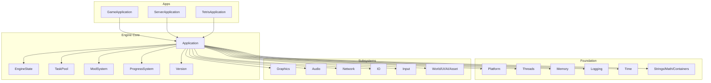

**Diagram sources**
- [apps/cwr/GameApplication.cpp](file://apps/cwr/GameApplication.cpp)
- [engine/Poseidon/Core/Application.cpp](file://engine/Poseidon/Core/Application.cpp)
- [engine/Poseidon/Core/EngineState.hpp](file://engine/Poseidon/Core/EngineState.hpp)
- [engine/Poseidon/Core/TaskPool.cpp](file://engine/Poseidon/Core/TaskPool.cpp)
- [engine/Poseidon/Core/ModSystem.cpp](file://engine/Poseidon/Core/ModSystem.cpp)
- [engine/Poseidon/Core/ProgressSystem.cpp](file://engine/Poseidon/Core/ProgressSystem.cpp)
- [engine/Poseidon/Core/Version.cpp](file://engine/Poseidon/Core/Version.cpp)
- [engine/Poseidon/Foundation/platform.hpp](file://engine/Poseidon/Foundation/platform.hpp)
- [engine/Poseidon/Foundation/Threads/Thread.hpp](file://engine/Poseidon/Foundation/Threads/Thread.hpp)
- [engine/Poseidon/Foundation/Memory/MemoryManager.hpp](file://engine/Poseidon/Foundation/Memory/MemoryManager.hpp)
- [engine/Poseidon/Foundation/Logging/Log.hpp](file://engine/Poseidon/Foundation/Logging/Log.hpp)
- [engine/Poseidon/Graphics/GraphicsEngineFactory.cpp](file://engine/Poseidon/Graphics/GraphicsEngineFactory.cpp)
- [engine/Poseidon/Audio/AudioFactory.cpp](file://engine/Poseidon/Audio/AudioFactory.cpp)
- [engine/Poseidon/Network/Network.cpp](file://engine/Poseidon/Network/Network.cpp)
- [engine/Poseidon/IO/Filesystem/FileSystem.hpp](file://engine/Poseidon/IO/Filesystem/FileSystem.hpp)

**Section sources**
- [README.md](file://README.md)
- [CMakeLists.txt](file://CMakeLists.txt)

## Core Components
- Application lifecycle: The Application class encapsulates initialization, main loop, and shutdown phases. It coordinates subsystem startup order, provides hooks for per-frame updates, and manages engine state transitions.
- GameLoop: Implemented within the Application or its derived classes, it drives frame timing, input polling, simulation updates, rendering, and audio processing.
- Core subsystems: TaskPool for asynchronous work, ModSystem for mod discovery and loading, ProgressSystem for download and load progress tracking, Version for build metadata, and Global accessors for shared state.
- Foundation layer: Platform abstraction, threading primitives, memory managers, logging, time utilities, and common data structures.

Key responsibilities:
- Initialization sequence: platform setup -> logging -> filesystem -> config -> mods -> graphics/audio/network -> world/UI -> game-specific init.
- Main loop: poll input -> update tasks -> simulate -> render -> audio -> present.
- Shutdown: reverse order teardown, flush logs, release resources.

**Section sources**
- [engine/Poseidon/Core/Application.cpp](file://engine/Poseidon/Core/Application.cpp)
- [engine/Poseidon/Core/Application.hpp](file://engine/Poseidon/Core/Application.hpp)
- [engine/Poseidon/Core/EngineState.hpp](file://engine/Poseidon/Core/EngineState.hpp)
- [engine/Poseidon/Core/TaskPool.cpp](file://engine/Poseidon/Core/TaskPool.cpp)
- [engine/Poseidon/Core/TaskPool.hpp](file://engine/Poseidon/Core/TaskPool.hpp)
- [engine/Poseidon/Core/ModSystem.cpp](file://engine/Poseidon/Core/ModSystem.cpp)
- [engine/Poseidon/Core/ModSystem.hpp](file://engine/Poseidon/Core/ModSystem.hpp)
- [engine/Poseidon/Core/ProgressSystem.cpp](file://engine/Poseidon/Core/ProgressSystem.cpp)
- [engine/Poseidon/Core/ProgressSystem.hpp](file://engine/Poseidon/Core/ProgressSystem.hpp)
- [engine/Poseidon/Core/Version.cpp](file://engine/Poseidon/Core/Version.cpp)
- [engine/Poseidon/Core/Version.hpp](file://engine/Poseidon/Core/Version.hpp)
- [engine/Poseidon/Core/Global.hpp](file://engine/Poseidon/Core/Global.hpp)

## Architecture Overview
The Poseidon Engine Core follows a layered architecture:
- Foundation: portable abstractions for OS, threads, memory, I/O, logging, math, and containers.
- Core: orchestrates subsystems via Application, maintains engine state, and exposes global accessors.
- Subsystems: Graphics, Audio, Network, IO, Input, World, UI, AI, Asset, each with interfaces and backends.
- Apps: concrete applications derive from base classes to implement game logic and platform entry points.

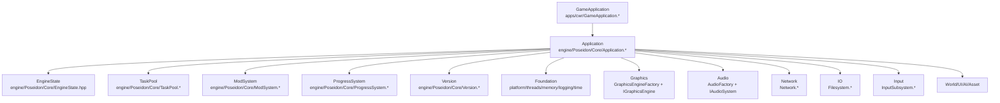

**Diagram sources**
- [apps/cwr/GameApplication.cpp](file://apps/cwr/GameApplication.cpp)
- [apps/cwr/GameApplication.hpp](file://apps/cwr/GameApplication.hpp)
- [engine/Poseidon/Core/Application.cpp](file://engine/Poseidon/Core/Application.cpp)
- [engine/Poseidon/Core/Application.hpp](file://engine/Poseidon/Core/Application.hpp)
- [engine/Poseidon/Core/EngineState.hpp](file://engine/Poseidon/Core/EngineState.hpp)
- [engine/Poseidon/Core/TaskPool.cpp](file://engine/Poseidon/Core/TaskPool.cpp)
- [engine/Poseidon/Core/TaskPool.hpp](file://engine/Poseidon/Core/TaskPool.hpp)
- [engine/Poseidon/Core/ModSystem.cpp](file://engine/Poseidon/Core/ModSystem.cpp)
- [engine/Poseidon/Core/ModSystem.hpp](file://engine/Poseidon/Core/ModSystem.hpp)
- [engine/Poseidon/Core/ProgressSystem.cpp](file://engine/Poseidon/Core/ProgressSystem.cpp)
- [engine/Poseidon/Core/ProgressSystem.hpp](file://engine/Poseidon/Core/ProgressSystem.hpp)
- [engine/Poseidon/Core/Version.cpp](file://engine/Poseidon/Core/Version.cpp)
- [engine/Poseidon/Core/Version.hpp](file://engine/Poseidon/Core/Version.hpp)
- [engine/Poseidon/Foundation/platform.hpp](file://engine/Poseidon/Foundation/platform.hpp)
- [engine/Poseidon/Graphics/GraphicsEngineFactory.cpp](file://engine/Poseidon/Graphics/GraphicsEngineFactory.cpp)
- [engine/Poseidon/Graphics/IGraphicsEngine.hpp](file://engine/Poseidon/Graphics/IGraphicsEngine.hpp)
- [engine/Poseidon/Audio/AudioFactory.cpp](file://engine/Poseidon/Audio/AudioFactory.cpp)
- [engine/Poseidon/Audio/IAudioSystem.hpp](file://engine/Poseidon/Audio/IAudioSystem.hpp)
- [engine/Poseidon/Network/Network.cpp](file://engine/Poseidon/Network/Network.cpp)
- [engine/Poseidon/Network/Network.hpp](file://engine/Poseidon/Network/Network.hpp)
- [engine/Poseidon/IO/Filesystem/FileSystem.hpp](file://engine/Poseidon/IO/Filesystem/FileSystem.hpp)

## Detailed Component Analysis

### Application Lifecycle and GameLoop
The Application class defines the lifecycle methods for initialization, running, and shutdown. Derived classes (e.g., GameApplication) override these to integrate game-specific logic. The GameLoop typically:
- Polls input and processes events.
- Drives asynchronous tasks via TaskPool.
- Updates simulation and world state.
- Renders frames through the selected Graphics backend.
- Processes audio buffers and streaming.
- Handles network I/O and message dispatch.

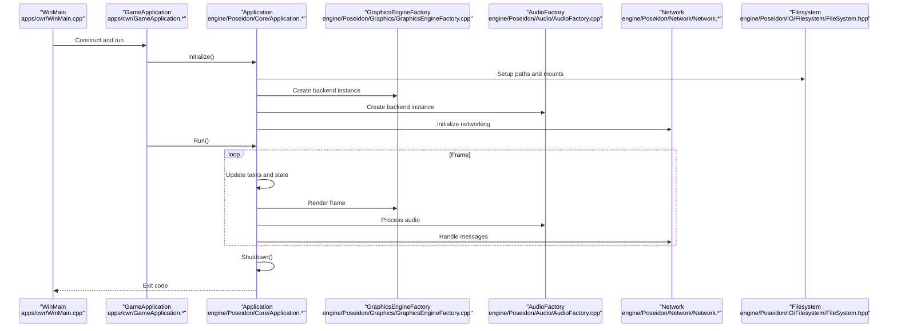

**Diagram sources**
- [apps/cwr/WinMain.cpp](file://apps/cwr/WinMain.cpp)
- [apps/cwr/GameApplication.cpp](file://apps/cwr/GameApplication.cpp)
- [apps/cwr/GameApplication.hpp](file://apps/cwr/GameApplication.hpp)
- [engine/Poseidon/Core/Application.cpp](file://engine/Poseidon/Core/Application.cpp)
- [engine/Poseidon/Core/Application.hpp](file://engine/Poseidon/Core/Application.hpp)
- [engine/Poseidon/Graphics/GraphicsEngineFactory.cpp](file://engine/Poseidon/Graphics/GraphicsEngineFactory.cpp)
- [engine/Poseidon/Audio/AudioFactory.cpp](file://engine/Poseidon/Audio/AudioFactory.cpp)
- [engine/Poseidon/Network/Network.cpp](file://engine/Poseidon/Network/Network.cpp)
- [engine/Poseidon/IO/Filesystem/FileSystem.hpp](file://engine/Poseidon/IO/Filesystem/FileSystem.hpp)

**Section sources**
- [apps/cwr/GameApplication.cpp](file://apps/cwr/GameApplication.cpp)
- [apps/cwr/GameApplication.hpp](file://apps/cwr/GameApplication.hpp)
- [apps/cwr/WinMain.cpp](file://apps/cwr/WinMain.cpp)
- [engine/Poseidon/Core/Application.cpp](file://engine/Poseidon/Core/Application.cpp)
- [engine/Poseidon/Core/Application.hpp](file://engine/Poseidon/Core/Application.hpp)

### Threading Model and TaskPool
The engine uses a dedicated TaskPool to schedule and execute background jobs. The TaskPool abstracts thread creation, job queues, synchronization, and completion callbacks. It supports:
- Submitting tasks with priorities.
- Batching independent work.
- Coordinating with the main thread for safe resource access.
- Profiling and metrics integration.

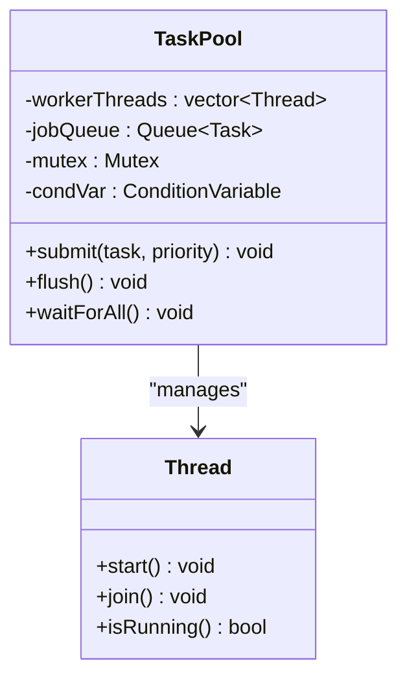

**Diagram sources**
- [engine/Poseidon/Core/TaskPool.cpp](file://engine/Poseidon/Core/TaskPool.cpp)
- [engine/Poseidon/Core/TaskPool.hpp](file://engine/Poseidon/Core/TaskPool.hpp)
- [engine/Poseidon/Foundation/Threads/Thread.hpp](file://engine/Poseidon/Foundation/Threads/Thread.hpp)

**Section sources**
- [engine/Poseidon/Core/TaskPool.cpp](file://engine/Poseidon/Core/TaskPool.cpp)
- [engine/Poseidon/Core/TaskPool.hpp](file://engine/Poseidon/Core/TaskPool.hpp)
- [engine/Poseidon/Foundation/Threads/Thread.hpp](file://engine/Poseidon/Foundation/Threads/Thread.hpp)

### Memory Management Strategy
Memory management is centralized in the Foundation layer with custom allocators and tracking. Key aspects include:
- Arena-based allocation for short-lived objects.
- Pool allocators for frequent small allocations.
- Debugging hooks for leak detection and validation.
- Integration with platform-specific memory APIs.

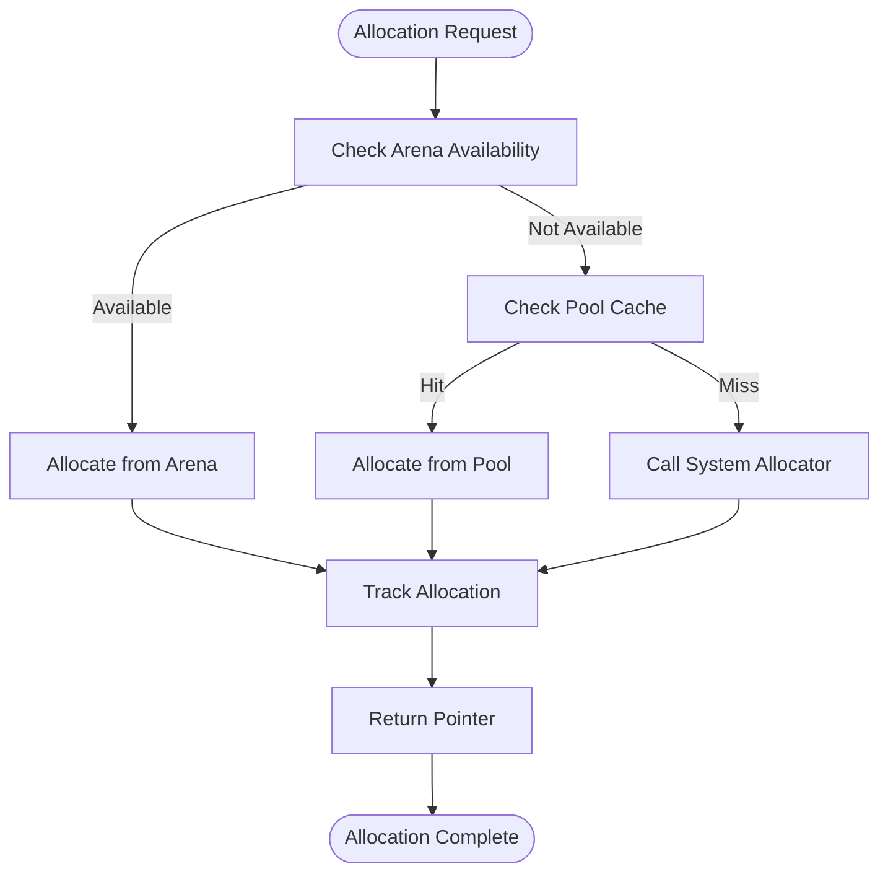

**Diagram sources**
- [engine/Poseidon/Foundation/Memory/MemoryManager.hpp](file://engine/Poseidon/Foundation/Memory/MemoryManager.hpp)

**Section sources**
- [engine/Poseidon/Foundation/Memory/MemoryManager.hpp](file://engine/Poseidon/Foundation/Memory/MemoryManager.hpp)

### Resource Loading and Filesystem
Resource loading is coordinated by the IO subsystem and Filesystem abstraction. It supports:
- Virtual file paths and mount points.
- Packed archives and streaming.
- Async loading with progress callbacks.
- Caching and deduplication.

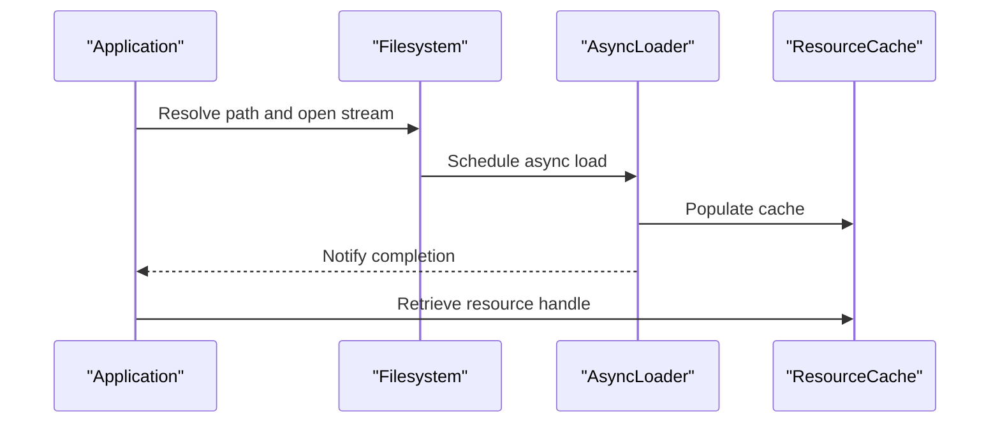

**Diagram sources**
- [engine/Poseidon/IO/Filesystem/FileSystem.hpp](file://engine/Poseidon/IO/Filesystem/FileSystem.hpp)

**Section sources**
- [engine/Poseidon/IO/Filesystem/FileSystem.hpp](file://engine/Poseidon/IO/Filesystem/FileSystem.hpp)

### Graphics Backend Abstraction
Graphics is abstracted via an interface implemented by multiple backends (OpenGL 3.3, WGPU). The factory selects the appropriate backend based on runtime capabilities and configuration.

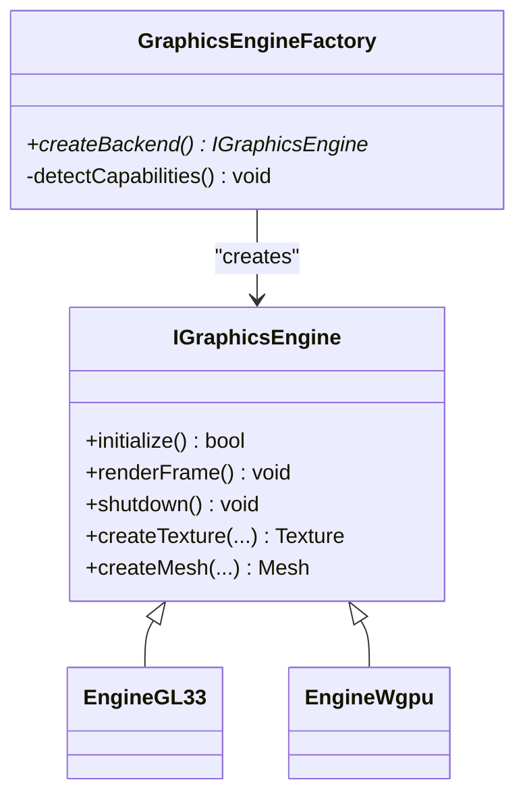

**Diagram sources**
- [engine/Poseidon/Graphics/IGraphicsEngine.hpp](file://engine/Poseidon/Graphics/IGraphicsEngine.hpp)
- [engine/Poseidon/Graphics/GraphicsEngineFactory.cpp](file://engine/Poseidon/Graphics/GraphicsEngineFactory.cpp)
- [engine/PoseidonGL33/EngineGL33.hpp](file://engine/PoseidonGL33/EngineGL33.hpp)
- [engine/WgpuRenderer/EngineWgpu.hpp](file://engine/WgpuRenderer/EngineWgpu.hpp)

**Section sources**
- [engine/Poseidon/Graphics/IGraphicsEngine.hpp](file://engine/Poseidon/Graphics/IGraphicsEngine.hpp)
- [engine/Poseidon/Graphics/GraphicsEngineFactory.cpp](file://engine/Poseidon/Graphics/GraphicsEngineFactory.cpp)

### Audio Backend Abstraction
Audio is abstracted via an interface implemented by OpenAL backend. The factory creates the appropriate audio system based on configuration.

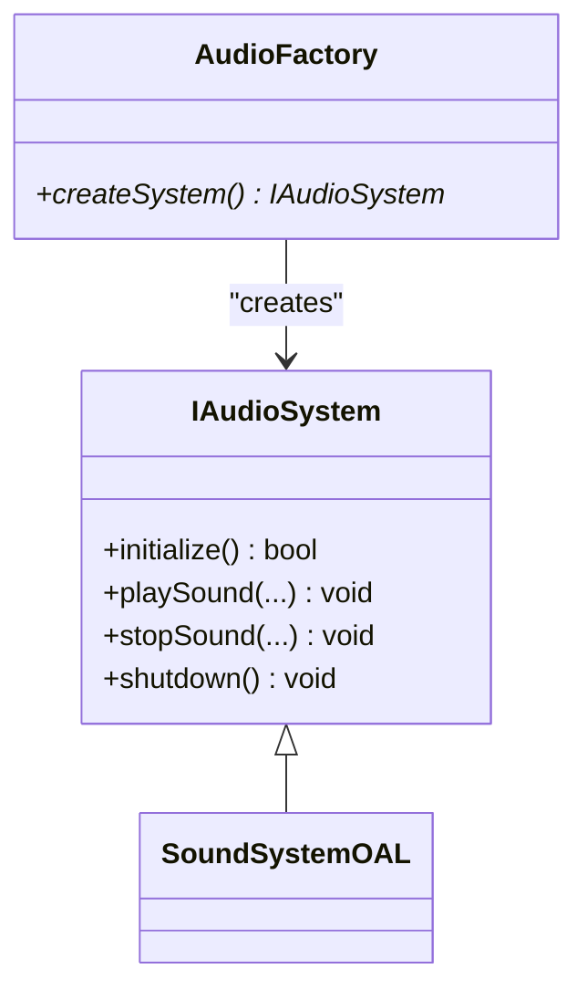

**Diagram sources**
- [engine/Poseidon/Audio/IAudioSystem.hpp](file://engine/Poseidon/Audio/IAudioSystem.hpp)
- [engine/Poseidon/Audio/AudioFactory.cpp](file://engine/Poseidon/Audio/AudioFactory.cpp)
- [engine/PoseidonOpenAL/SoundSystemOAL.hpp](file://engine/PoseidonOpenAL/SoundSystemOAL.hpp)

**Section sources**
- [engine/Poseidon/Audio/IAudioSystem.hpp](file://engine/Poseidon/Audio/IAudioSystem.hpp)
- [engine/Poseidon/Audio/AudioFactory.cpp](file://engine/Poseidon/Audio/AudioFactory.cpp)

### Networking Core
Networking provides client/server abstractions, message routing, authentication, and transport layers. It integrates with the Application lifecycle for connection management and event-driven message handling.

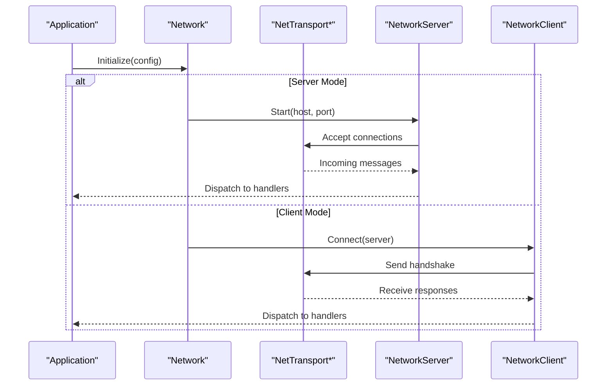

**Diagram sources**
- [engine/Poseidon/Network/Network.cpp](file://engine/Poseidon/Network/Network.cpp)
- [engine/Poseidon/Network/Network.hpp](file://engine/Poseidon/Network/Network.hpp)

**Section sources**
- [engine/Poseidon/Network/Network.cpp](file://engine/Poseidon/Network/Network.cpp)
- [engine/Poseidon/Network/Network.hpp](file://engine/Poseidon/Network/Network.hpp)

### Mod System and Progress Tracking
The ModSystem discovers, validates, and loads mods, integrating with the filesystem and asset pipelines. ProgressSystem tracks downloads and load progress, providing callbacks for UI updates.

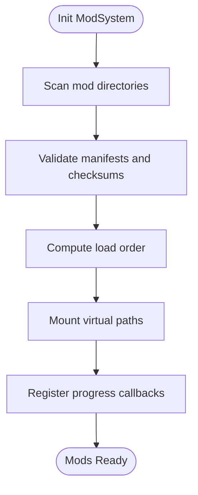

**Diagram sources**
- [engine/Poseidon/Core/ModSystem.cpp](file://engine/Poseidon/Core/ModSystem.cpp)
- [engine/Poseidon/Core/ModSystem.hpp](file://engine/Poseidon/Core/ModSystem.hpp)
- [engine/Poseidon/Core/ProgressSystem.cpp](file://engine/Poseidon/Core/ProgressSystem.cpp)
- [engine/Poseidon/Core/ProgressSystem.hpp](file://engine/Poseidon/Core/ProgressSystem.hpp)

**Section sources**
- [engine/Poseidon/Core/ModSystem.cpp](file://engine/Poseidon/Core/ModSystem.cpp)
- [engine/Poseidon/Core/ModSystem.hpp](file://engine/Poseidon/Core/ModSystem.hpp)
- [engine/Poseidon/Core/ProgressSystem.cpp](file://engine/Poseidon/Core/ProgressSystem.cpp)
- [engine/Poseidon/Core/ProgressSystem.hpp](file://engine/Poseidon/Core/ProgressSystem.hpp)

### Logging and Profiling
Logging is provided by the Foundation layer with structured output, severity levels, and sinks. Profiling integrates with task execution and rendering passes to capture performance metrics.

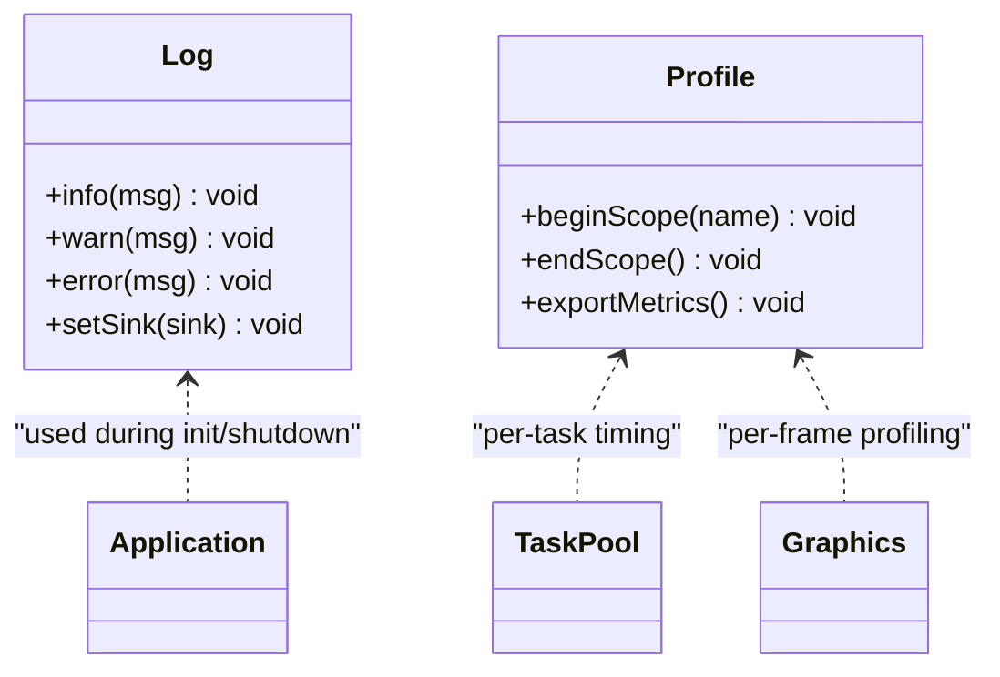

**Diagram sources**
- [engine/Poseidon/Foundation/Logging/Log.hpp](file://engine/Poseidon/Foundation/Logging/Log.hpp)
- [engine/Poseidon/Core/Profile/*](file://engine/Poseidon/Core/Profile/)

**Section sources**
- [engine/Poseidon/Foundation/Logging/Log.hpp](file://engine/Poseidon/Foundation/Logging/Log.hpp)

## Dependency Analysis
The engine exhibits clear separation of concerns with minimal coupling:
- Applications depend on Core Application and subsystem interfaces.
- Core depends on Foundation abstractions and subsystem interfaces.
- Subsystems depend on Foundation and Core where necessary.
- Backends implement subsystem interfaces without knowledge of higher layers.

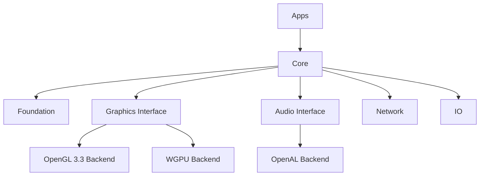

**Diagram sources**
- [apps/cwr/GameApplication.cpp](file://apps/cwr/GameApplication.cpp)
- [engine/Poseidon/Core/Application.cpp](file://engine/Poseidon/Core/Application.cpp)
- [engine/Poseidon/Graphics/GraphicsEngineFactory.cpp](file://engine/Poseidon/Graphics/GraphicsEngineFactory.cpp)
- [engine/Poseidon/Audio/AudioFactory.cpp](file://engine/Poseidon/Audio/AudioFactory.cpp)
- [engine/Poseidon/Network/Network.cpp](file://engine/Poseidon/Network/Network.cpp)
- [engine/Poseidon/IO/Filesystem/FileSystem.hpp](file://engine/Poseidon/IO/Filesystem/FileSystem.hpp)

**Section sources**
- [engine/Poseidon/Core/Application.cpp](file://engine/Poseidon/Core/Application.cpp)
- [engine/Poseidon/Graphics/GraphicsEngineFactory.cpp](file://engine/Poseidon/Graphics/GraphicsEngineFactory.cpp)
- [engine/Poseidon/Audio/AudioFactory.cpp](file://engine/Poseidon/Audio/AudioFactory.cpp)
- [engine/Poseidon/Network/Network.cpp](file://engine/Poseidon/Network/Network.cpp)
- [engine/Poseidon/IO/Filesystem/FileSystem.hpp](file://engine/Poseidon/IO/Filesystem/FileSystem.hpp)

## Performance Considerations
- Asynchronous task scheduling reduces main-thread stalls.
- Resource caching minimizes disk I/O and repeated parsing.
- Backend selection ensures optimal rendering paths.
- Memory pools reduce fragmentation and allocation overhead.
- Profiling hooks enable targeted optimization.

[No sources needed since this section provides general guidance]

## Troubleshooting Guide
Common issues and resolutions:
- Initialization failures: Verify platform setup, logging sinks, and filesystem mounts.
- Graphics backend errors: Check driver compatibility and configuration flags.
- Audio device not found: Ensure OpenAL runtime and device permissions.
- Network connectivity problems: Validate firewall settings and server endpoints.
- Memory leaks: Enable debug allocators and review leak suppressions.

**Section sources**
- [engine/Poseidon/Foundation/Logging/Log.hpp](file://engine/Poseidon/Foundation/Logging/Log.hpp)
- [engine/Poseidon/Core/Application.cpp](file://engine/Poseidon/Core/Application.cpp)

## Conclusion
The Poseidon Engine Core provides a robust, modular foundation for game development. Its layered architecture, clear interfaces, and flexible backends enable cross-platform deployment and efficient performance. The Application lifecycle, threading model, and resource management strategies ensure scalability and maintainability.

[No sources needed since this section summarizes without analyzing specific files]

## Appendices

### Technology Stack and Compatibility
- C++ standard: Defined by build configuration and toolchain presets.
- Third-party dependencies: Managed via vcpkg; see dependency manifest.
- Build presets: Support Windows and Linux with Clang toolchains.
- Docker images: Provided for consistent CI environments.

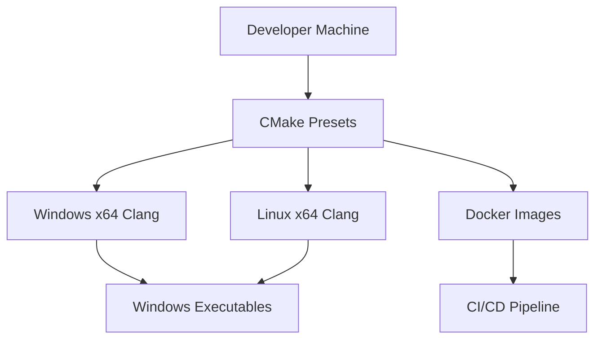

**Diagram sources**
- [cmake/presets/base.json](file://cmake/presets/base.json)
- [cmake/toolchains/win-x64-clang.cmake](file://cmake/toolchains/win-x64-clang.cmake)
- [cmake/toolchains/linux-x64-clang.cmake](file://cmake/toolchains/linux-x64-clang.cmake)
- [vcpkg.json](file://vcpkg.json)

**Section sources**
- [cmake/presets/base.json](file://cmake/presets/base.json)
- [cmake/toolchains/win-x64-clang.cmake](file://cmake/toolchains/win-x64-clang.cmake)
- [cmake/toolchains/linux-x64-clang.cmake](file://cmake/toolchains/linux-x64-clang.cmake)
- [vcpkg.json](file://vcpkg.json)