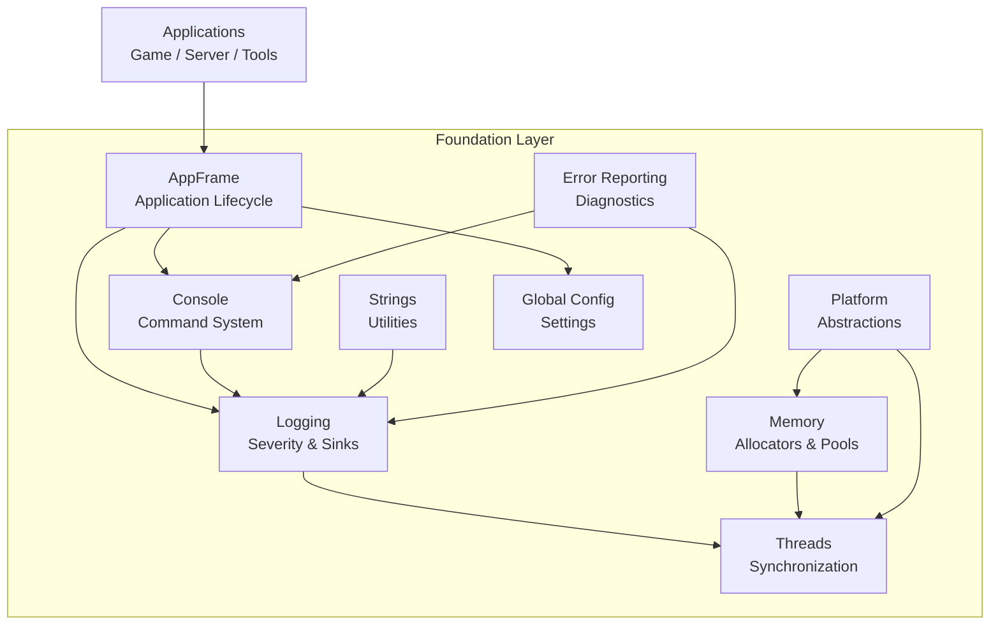
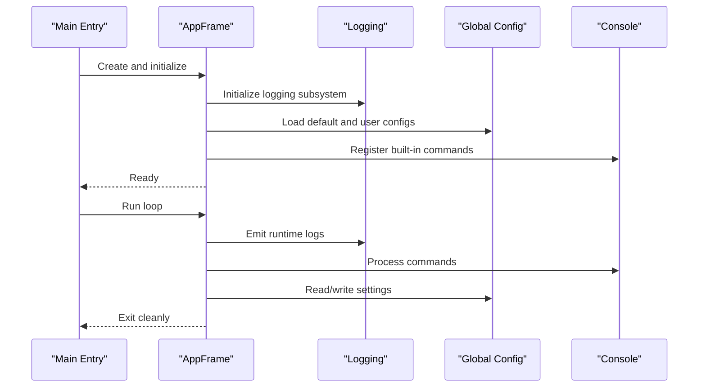
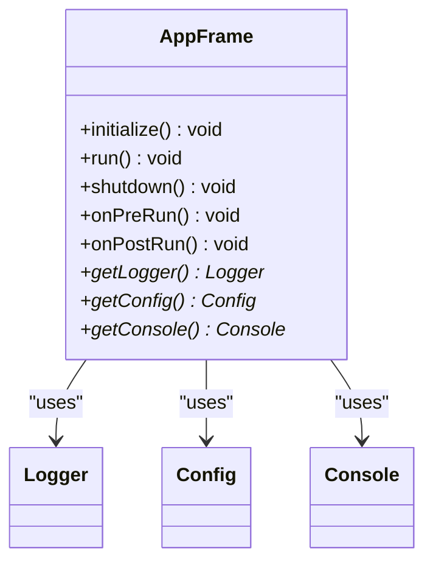
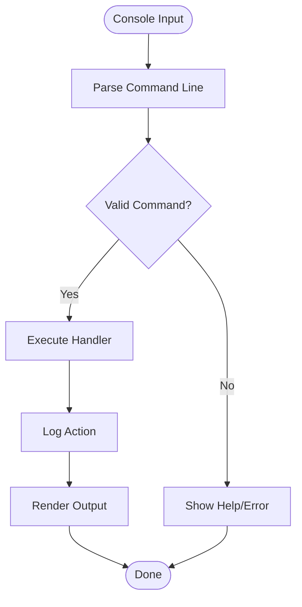
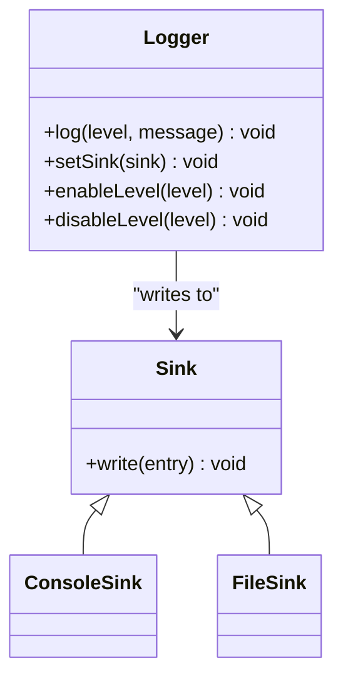
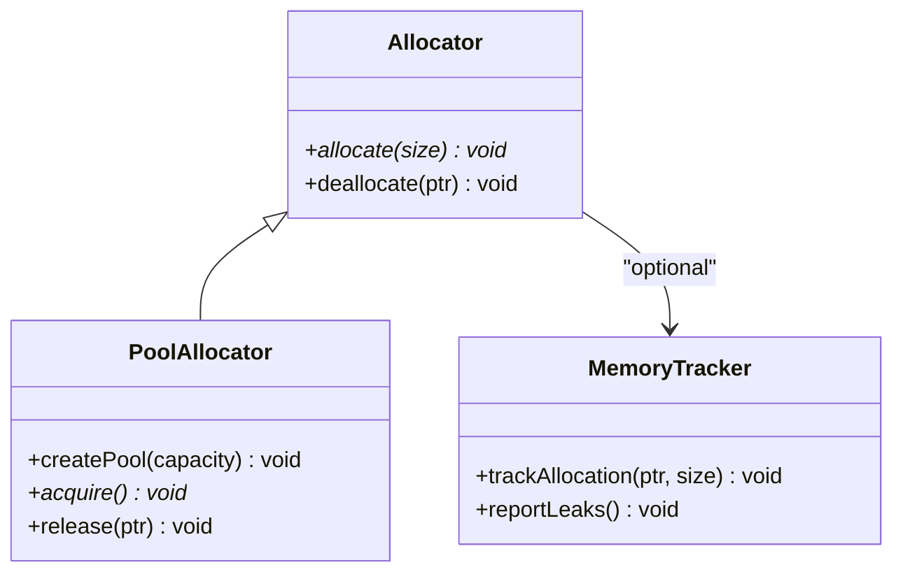
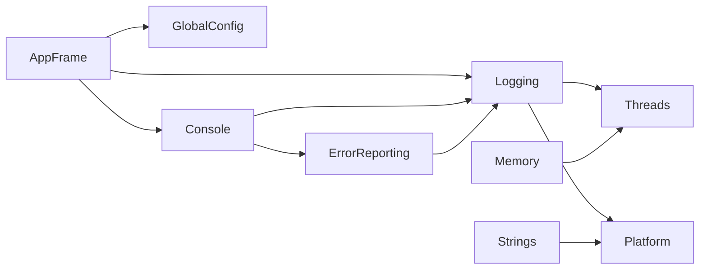

# Foundation Layer

<cite>
**Referenced Files in This Document**
- [Foundation.hpp](file://engine/Poseidon/Foundation/Foundation.hpp)
- [Foundation.cpp](file://engine/Poseidon/Foundation/Foundation.cpp)
- [AppFrame.hpp](file://engine/Poseidon/Foundation/Framework/AppFrame.hpp)
- [AppFrame.cpp](file://engine/Poseidon/Foundation/Framework/AppFrame.cpp)
- [Console.hpp](file://engine/Poseidon/Foundation/Common/Console.hpp)
- [Console.cpp](file://engine/Poseidon/Foundation/Common/Console.cpp)
- [Logging.hpp](file://engine/Poseidon/Foundation/Logging/Logging.hpp)
- [Logging.cpp](file://engine/Poseidon/Foundation/Logging/Logging.cpp)
- [MemoryAllocator.hpp](file://engine/Poseidon/Foundation/Memory/MemoryAllocator.hpp)
- [MemoryPool.hpp](file://engine/Poseidon/Foundation/Memory/MemoryPool.hpp)
- [StringUtilities.hpp](file://engine/Poseidon/Foundation/Strings/StringUtilities.hpp)
- [PlatformAbstraction.hpp](file://engine/Poseidon/Foundation/Platform/PlatformAbstraction.hpp)
- [ThreadSafety.hpp](file://engine/Poseidon/Foundation/Threads/ThreadSafety.hpp)
- [ErrorReporting.hpp](file://engine/Poseidon/Foundation/Common/ErrorReporting.hpp)
- [GlobalConfig.hpp](file://engine/Poseidon/Core/Config/GlobalConfig.hpp)
- [GlobalConfig.cpp](file://engine/Poseidon/Core/Config/GlobalConfig.cpp)
</cite>

## Table of Contents
1. [Introduction](#introduction)
2. [Project Structure](#project-structure)
3. [Core Components](#core-components)
4. [Architecture Overview](#architecture-overview)
5. [Detailed Component Analysis](#detailed-component-analysis)
6. [Dependency Analysis](#dependency-analysis)
7. [Performance Considerations](#performance-considerations)
8. [Troubleshooting Guide](#troubleshooting-guide)
9. [Conclusion](#conclusion)
10. [Appendices](#appendices)

## Introduction
This document explains the Foundation Layer that provides essential services across the entire engine. It covers global state management, the console system, logging infrastructure, and the AppFrame abstraction used by all applications. It also details memory allocation patterns, string handling utilities, platform-independent abstractions, thread safety considerations, error reporting mechanisms, and development tools integration. Practical examples show how to use logging, console commands, and global configuration, along with guidance for extending foundation services and maintaining consistency across modules.

## Project Structure
The Foundation Layer is organized into focused subsystems:
- Framework: Application lifecycle and common functionality via AppFrame
- Common: Console, error reporting, and shared utilities
- Logging: Centralized logging with severity levels and sinks
- Memory: Allocators, pools, and allocation policies
- Strings: String utilities and formatting helpers
- Platform: Abstractions over OS-specific behavior
- Threads: Thread safety primitives and synchronization utilities
- Core Config: Global configuration accessors and persistence

**Diagram sources**
- [AppFrame.hpp](file://engine/Poseidon/Foundation/Framework/AppFrame.hpp)
- [Console.hpp](file://engine/Poseidon/Foundation/Common/Console.hpp)
- [Logging.hpp](file://engine/Poseidon/Foundation/Logging/Logging.hpp)
- [MemoryAllocator.hpp](file://engine/Poseidon/Foundation/Memory/MemoryAllocator.hpp)
- [StringUtilities.hpp](file://engine/Poseidon/Foundation/Strings/StringUtilities.hpp)
- [PlatformAbstraction.hpp](file://engine/Poseidon/Foundation/Platform/PlatformAbstraction.hpp)
- [ThreadSafety.hpp](file://engine/Poseidon/Foundation/Threads/ThreadSafety.hpp)
- [GlobalConfig.hpp](file://engine/Poseidon/Core/Config/GlobalConfig.hpp)
- [ErrorReporting.hpp](file://engine/Poseidon/Foundation/Common/ErrorReporting.hpp)

**Section sources**
- [Foundation.hpp](file://engine/Poseidon/Foundation/Foundation.hpp)
- [Foundation.cpp](file://engine/Poseidon/Foundation/Foundation.cpp)

## Core Components
- AppFrame: Provides application lifecycle hooks, initialization order, and cross-cutting services (logging, config, console).
- Console: Command registration, parsing, execution, and output routing; integrates with logging and error reporting.
- Logging: Severity-based logging, contextual metadata, sink pluggability, and performance-aware formatting.
- Memory: Custom allocators, object pools, and allocation tracking; supports debug and release modes.
- Strings: Formatting, conversion, and safe manipulation utilities; avoids platform-specific pitfalls.
- Platform: Abstractions for file paths, time, threading, and OS features.
- Threads: Locks, atomics, and thread-local storage helpers ensuring consistent concurrency.
- Error Reporting: Structured diagnostics, stack traces where available, and integration with console/logging.
- Global Config: Centralized settings with validation, defaults, and hot-reload support.

**Section sources**
- [AppFrame.hpp](file://engine/Poseidon/Foundation/Framework/AppFrame.hpp)
- [Console.hpp](file://engine/Poseidon/Foundation/Common/Console.hpp)
- [Logging.hpp](file://engine/Poseidon/Foundation/Logging/Logging.hpp)
- [MemoryAllocator.hpp](file://engine/Poseidon/Foundation/Memory/MemoryAllocator.hpp)
- [StringUtilities.hpp](file://engine/Poseidon/Foundation/Strings/StringUtilities.hpp)
- [PlatformAbstraction.hpp](file://engine/Poseidon/Foundation/Platform/PlatformAbstraction.hpp)
- [ThreadSafety.hpp](file://engine/Poseidon/Foundation/Threads/ThreadSafety.hpp)
- [ErrorReporting.hpp](file://engine/Poseidon/Foundation/Common/ErrorReporting.hpp)
- [GlobalConfig.hpp](file://engine/Poseidon/Core/Config/GlobalConfig.hpp)

## Architecture Overview
The Foundation Layer acts as a central hub for cross-cutting concerns. Applications derive from AppFrame to gain lifecycle control and access to core services. Logging and console are initialized early and remain available throughout the process lifetime. Memory and strings are used pervasively, while platform and threads provide stable abstractions. Global configuration is accessed through a centralized interface.

**Diagram sources**
- [AppFrame.hpp](file://engine/Poseidon/Foundation/Framework/AppFrame.hpp)
- [AppFrame.cpp](file://engine/Poseidon/Foundation/Framework/AppFrame.cpp)
- [Logging.hpp](file://engine/Poseidon/Foundation/Logging/Logging.hpp)
- [GlobalConfig.hpp](file://engine/Poseidon/Core/Config/GlobalConfig.hpp)
- [Console.hpp](file://engine/Poseidon/Foundation/Common/Console.hpp)

## Detailed Component Analysis

### AppFrame Abstraction
AppFrame encapsulates application lifecycle and common functionality:
- Initialization sequence: logging, config, console, subsystems
- Event hooks: pre-run, post-run, shutdown
- Service accessors: logging, config, console, memory, platform
- Error propagation: structured errors to logging and console

**Diagram sources**
- [AppFrame.hpp](file://engine/Poseidon/Foundation/Framework/AppFrame.hpp)
- [AppFrame.cpp](file://engine/Poseidon/Foundation/Framework/AppFrame.cpp)

**Section sources**
- [AppFrame.hpp](file://engine/Poseidon/Foundation/Framework/AppFrame.hpp)
- [AppFrame.cpp](file://engine/Poseidon/Foundation/Framework/AppFrame.cpp)

### Console System Implementation
The console provides command registration, argument parsing, and execution:
- Command categories and help generation
- Input buffering and line processing
- Output redirection to logging or UI
- Integration with error reporting for immediate feedback

**Diagram sources**
- [Console.hpp](file://engine/Poseidon/Foundation/Common/Console.hpp)
- [Console.cpp](file://engine/Poseidon/Foundation/Common/Console.cpp)

**Section sources**
- [Console.hpp](file://engine/Poseidon/Foundation/Common/Console.hpp)
- [Console.cpp](file://engine/Poseidon/Foundation/Common/Console.cpp)

### Logging Infrastructure
Centralized logging with severity levels and sinks:
- Levels: debug, info, warn, error, fatal
- Contextual metadata: module, timestamp, thread ID
- Sink abstraction: console, file, network, custom
- Performance: lazy formatting and conditional checks

**Diagram sources**
- [Logging.hpp](file://engine/Poseidon/Foundation/Logging/Logging.hpp)
- [Logging.cpp](file://engine/Poseidon/Foundation/Logging/Logging.cpp)

**Section sources**
- [Logging.hpp](file://engine/Poseidon/Foundation/Logging/Logging.hpp)
- [Logging.cpp](file://engine/Poseidon/Foundation/Logging/Logging.cpp)

### Memory Allocation Patterns
Memory subsystem offers flexible allocation strategies:
- Custom allocator interfaces for heap and stack
- Object pools for frequent small allocations
- Debug hooks: leak detection, bounds checking
- Thread-safe options for concurrent contexts

**Diagram sources**
- [MemoryAllocator.hpp](file://engine/Poseidon/Foundation/Memory/MemoryAllocator.hpp)
- [MemoryPool.hpp](file://engine/Poseidon/Foundation/Memory/MemoryPool.hpp)

**Section sources**
- [MemoryAllocator.hpp](file://engine/Poseidon/Foundation/Memory/MemoryAllocator.hpp)
- [MemoryPool.hpp](file://engine/Poseidon/Foundation/Memory/MemoryPool.hpp)

### String Handling Utilities
String utilities ensure safe and portable operations:
- Conversion between encodings and formats
- Safe concatenation and splitting
- Formatting with type safety
- Avoiding platform-specific pitfalls

**Section sources**
- [StringUtilities.hpp](file://engine/Poseidon/Foundation/Strings/StringUtilities.hpp)

### Platform-Independent Abstractions
Platform layer abstracts OS differences:
- File path normalization and I/O helpers
- Time and clock utilities
- Threading primitives and CPU features
- Environment variable access

**Section sources**
- [PlatformAbstraction.hpp](file://engine/Poseidon/Foundation/Platform/PlatformAbstraction.hpp)

### Thread Safety Considerations
Concurrency utilities ensure correctness:
- Mutexes, condition variables, and atomics
- Thread-local storage for per-thread data
- Lock-free queues where applicable
- Guidelines for avoiding deadlocks and races

**Section sources**
- [ThreadSafety.hpp](file://engine/Poseidon/Foundation/Threads/ThreadSafety.hpp)

### Error Reporting Mechanisms
Structured diagnostics improve debugging:
- Error codes and messages
- Stack trace capture when available
- Integration with logging and console
- User-friendly messages for non-fatal issues

**Section sources**
- [ErrorReporting.hpp](file://engine/Poseidon/Foundation/Common/ErrorReporting.hpp)

### Global Configuration
Centralized settings management:
- Default values and overrides
- Validation and migration
- Hot-reload support
- Accessor APIs for subsystems

**Section sources**
- [GlobalConfig.hpp](file://engine/Poseidon/Core/Config/GlobalConfig.hpp)
- [GlobalConfig.cpp](file://engine/Poseidon/Core/Config/GlobalConfig.cpp)

## Dependency Analysis
Foundation components have clear dependencies:
- AppFrame depends on logging, config, and console
- Console uses logging and error reporting
- Logging may depend on threads and platform
- Memory and strings are used widely but kept independent
- Platform and threads provide foundational services

**Diagram sources**
- [AppFrame.hpp](file://engine/Poseidon/Foundation/Framework/AppFrame.hpp)
- [Console.hpp](file://engine/Poseidon/Foundation/Common/Console.hpp)
- [Logging.hpp](file://engine/Poseidon/Foundation/Logging/Logging.hpp)
- [MemoryAllocator.hpp](file://engine/Poseidon/Foundation/Memory/MemoryAllocator.hpp)
- [StringUtilities.hpp](file://engine/Poseidon/Foundation/Strings/StringUtilities.hpp)
- [PlatformAbstraction.hpp](file://engine/Poseidon/Foundation/Platform/PlatformAbstraction.hpp)
- [ThreadSafety.hpp](file://engine/Poseidon/Foundation/Threads/ThreadSafety.hpp)
- [ErrorReporting.hpp](file://engine/Poseidon/Foundation/Common/ErrorReporting.hpp)
- [GlobalConfig.hpp](file://engine/Poseidon/Core/Config/GlobalConfig.hpp)

**Section sources**
- [Foundation.hpp](file://engine/Poseidon/Foundation/Foundation.hpp)
- [Foundation.cpp](file://engine/Poseidon/Foundation/Foundation.cpp)

## Performance Considerations
- Use conditional logging to avoid unnecessary formatting
- Prefer object pools for frequent small allocations
- Minimize string copies by using views and references
- Batch console output to reduce I/O overhead
- Leverage platform-specific optimizations where safe
- Profile critical paths with sampling profilers

[No sources needed since this section provides general guidance]

## Troubleshooting Guide
Common issues and resolutions:
- Logging not appearing: verify sink configuration and severity levels
- Console commands unrecognized: check registration order and syntax
- Memory leaks: enable debug hooks and review allocation reports
- Thread crashes: inspect lock usage and race conditions
- Config loading failures: validate file paths and schema versions

**Section sources**
- [Logging.hpp](file://engine/Poseidon/Foundation/Logging/Logging.hpp)
- [Console.hpp](file://engine/Poseidon/Foundation/Common/Console.hpp)
- [MemoryAllocator.hpp](file://engine/Poseidon/Foundation/Memory/MemoryAllocator.hpp)
- [ThreadSafety.hpp](file://engine/Poseidon/Foundation/Threads/ThreadSafety.hpp)
- [GlobalConfig.hpp](file://engine/Poseidon/Core/Config/GlobalConfig.hpp)

## Conclusion
The Foundation Layer provides a robust, extensible base for engine applications. By following its patterns for lifecycle management, logging, console interaction, memory usage, and configuration, developers can build reliable and maintainable systems. Adhering to thread safety guidelines and leveraging platform abstractions ensures portability and performance.

[No sources needed since this section summarizes without analyzing specific files]

## Appendices

### Examples of Using Foundation Services

#### Logging Usage
- Initialize logger during app startup
- Set appropriate severity levels
- Write logs with contextual metadata
- Configure sinks for console and file output

**Section sources**
- [Logging.hpp](file://engine/Poseidon/Foundation/Logging/Logging.hpp)
- [Logging.cpp](file://engine/Poseidon/Foundation/Logging/Logging.cpp)

#### Console Commands
- Register commands with descriptions and handlers
- Parse arguments safely
- Provide help and error messages
- Integrate with logging for audit trails

**Section sources**
- [Console.hpp](file://engine/Poseidon/Foundation/Common/Console.hpp)
- [Console.cpp](file://engine/Poseidon/Foundation/Common/Console.cpp)

#### Global Configuration
- Load defaults and user overrides
- Validate settings at startup
- Access configuration via accessor APIs
- Support hot-reload for dynamic changes

**Section sources**
- [GlobalConfig.hpp](file://engine/Poseidon/Core/Config/GlobalConfig.hpp)
- [GlobalConfig.cpp](file://engine/Poseidon/Core/Config/GlobalConfig.cpp)

### Extending Foundation Services
- Implement new sinks by extending the sink interface
- Add console commands by registering handlers
- Extend memory allocators by implementing allocator interfaces
- Provide platform-specific implementations via abstraction layers
- Maintain consistency by following established patterns and conventions

**Section sources**
- [Logging.hpp](file://engine/Poseidon/Foundation/Logging/Logging.hpp)
- [Console.hpp](file://engine/Poseidon/Foundation/Common/Console.hpp)
- [MemoryAllocator.hpp](file://engine/Poseidon/Foundation/Memory/MemoryAllocator.hpp)
- [PlatformAbstraction.hpp](file://engine/Poseidon/Foundation/Platform/PlatformAbstraction.hpp)