# Game Loop System

<cite>
**Referenced Files in This Document**
- [GameApplication.cpp](file://apps/cwr/Game/GameApplication.cpp)
- [GameApplication.hpp](file://apps/cwr/Game/GameApplication.hpp)
- [WinMain.cpp](file://apps/cwr/Game/WinMain.cpp)
- [ServerApplication.cpp](file://apps/cwr/Server/ServerApplication.cpp)
- [ServerApplication.hpp](file://apps/cwr/Server/ServerApplication.hpp)
- [ServerMain.cpp](file://apps/cwr/Server/ServerMain.cpp)
- [Application.cpp](file://engine/Poseidon/Core/Application.cpp)
- [Application.hpp](file://engine/Poseidon/Core/Application.hpp)
- [EngineState.hpp](file://engine/Poseidon/Core/EngineState.hpp)
- [InputSubsystem.cpp](file://engine/Poseidon/Input/InputSubsystem.cpp)
- [InputSubsystem.hpp](file://engine/Poseidon/Input/InputSubsystem.hpp)
- [World.cpp](file://engine/Poseidon/World/World.cpp)
- [World.hpp](file://engine/Poseidon/World/World.hpp)
- [GraphicsEngineFactory.cpp](file://engine/Poseidon/Graphics/GraphicsEngineFactory.cpp)
- [GraphicsEngineFactory.hpp](file://engine/Poseidon/Graphics/GraphicsEngineFactory.hpp)
- [EngineGL33.cpp](file://engine/PoseidonGL33/EngineGL33.cpp)
- [EngineWgpu.cpp](file://engine/WgpuRenderer/EngineWgpu.cpp)
- [NetworkManagerState.hpp](file://engine/Poseidon/Network/NetworkManagerState.hpp)
- [NetworkClient.cpp](file://engine/Poseidon/Network/NetworkClient.cpp)
- [NetworkServer.cpp](file://engine/Poseidon/Network/NetworkServer.cpp)
- [TaskPool.cpp](file://engine/Poseidon/Core/TaskPool.cpp)
- [TaskPool.hpp](file://engine/Poseidon/Core/TaskPool.hpp)
</cite>

## Table of Contents
1. [Introduction](#introduction)
2. [Project Structure](#project-structure)
3. [Core Components](#core-components)
4. [Architecture Overview](#architecture-overview)
5. [Detailed Component Analysis](#detailed-component-analysis)
6. [Dependency Analysis](#dependency-analysis)
7. [Performance Considerations](#performance-considerations)
8. [Troubleshooting Guide](#troubleshooting-guide)
9. [Conclusion](#conclusion)

## Introduction
This document explains the Game Loop System that orchestrates the main execution flow of the engine. It covers frame timing, update cycles, and render synchronization; the separation between client-side and server-side loop implementations; integration with input processing, physics simulation, and rendering subsystems; examples of custom game loop extensions; performance monitoring and frame rate management; threading considerations; deterministic simulation requirements; network synchronization patterns; and guidance for debugging frame timing issues and optimizing loop performance.

## Project Structure
The game loop spans application entry points, core application lifecycle, platform-specific windows/message handling, and subsystem integrations (input, world/simulation, graphics). The client application drives a typical frame loop: process input, update simulation, render frames, and manage networking. The server application runs a dedicated loop focused on deterministic simulation and network replication without rendering.

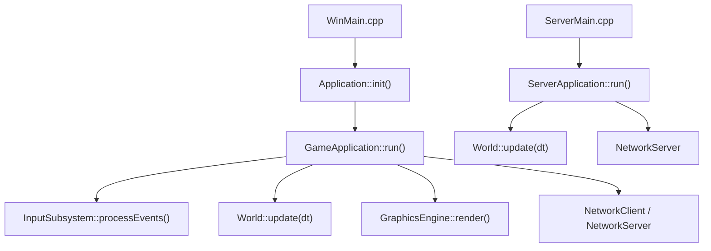

**Diagram sources**
- [WinMain.cpp](file://apps/cwr/Game/WinMain.cpp)
- [Application.cpp](file://engine/Poseidon/Core/Application.cpp)
- [GameApplication.cpp](file://apps/cwr/Game/GameApplication.cpp)
- [InputSubsystem.cpp](file://engine/Poseidon/Input/InputSubsystem.cpp)
- [World.cpp](file://engine/Poseidon/World/World.cpp)
- [GraphicsEngineFactory.cpp](file://engine/Poseidon/Graphics/GraphicsEngineFactory.cpp)
- [EngineGL33.cpp](file://engine/PoseidonGL33/EngineGL33.cpp)
- [EngineWgpu.cpp](file://engine/WgpuRenderer/EngineWgpu.cpp)
- [ServerMain.cpp](file://apps/cwr/Server/ServerMain.cpp)
- [ServerApplication.cpp](file://apps/cwr/Server/ServerApplication.cpp)
- [NetworkClient.cpp](file://engine/Poseidon/Network/NetworkClient.cpp)
- [NetworkServer.cpp](file://engine/Poseidon/Network/NetworkServer.cpp)

**Section sources**
- [WinMain.cpp](file://apps/cwr/Game/WinMain.cpp)
- [Application.cpp](file://engine/Poseidon/Core/Application.cpp)
- [GameApplication.cpp](file://apps/cwr/Game/GameApplication.cpp)
- [ServerMain.cpp](file://apps/cwr/Server/ServerMain.cpp)
- [ServerApplication.cpp](file://apps/cwr/Server/ServerApplication.cpp)

## Core Components
- Application lifecycle: initialization, run loop, shutdown.
- Client game loop: per-frame input, update, render, and network I/O.
- Server game loop: fixed-timestep simulation and network replication.
- Input subsystem: event polling and dispatch to game logic.
- World/simulation: deterministic updates, physics, entity state.
- Graphics engine: frame rendering and presentation.
- Networking: client/server message handling and synchronization.

Key responsibilities:
- Frame timing and delta-time computation.
- Update scheduling (fixed vs variable timestep).
- Render synchronization (vsync, frame pacing).
- Threading model for background tasks.
- Deterministic simulation constraints.

**Section sources**
- [Application.hpp](file://engine/Poseidon/Core/Application.hpp)
- [Application.cpp](file://engine/Poseidon/Core/Application.cpp)
- [GameApplication.hpp](file://apps/cwr/Game/GameApplication.hpp)
- [GameApplication.cpp](file://apps/cwr/Game/GameApplication.cpp)
- [InputSubsystem.hpp](file://engine/Poseidon/Input/InputSubsystem.hpp)
- [InputSubsystem.cpp](file://engine/Poseidon/Input/InputSubsystem.cpp)
- [World.hpp](file://engine/Poseidon/World/World.hpp)
- [World.cpp](file://engine/Poseidon/World/World.cpp)
- [GraphicsEngineFactory.hpp](file://engine/Poseidon/Graphics/GraphicsEngineFactory.hpp)
- [GraphicsEngineFactory.cpp](file://engine/Poseidon/Graphics/GraphicsEngineFactory.cpp)
- [EngineGL33.cpp](file://engine/PoseidonGL33/EngineGL33.cpp)
- [EngineWgpu.cpp](file://engine/WgpuRenderer/EngineWgpu.cpp)
- [NetworkClient.cpp](file://engine/Poseidon/Network/NetworkClient.cpp)
- [NetworkServer.cpp](file://engine/Poseidon/Network/NetworkServer.cpp)

## Architecture Overview
The engine uses a layered architecture where the application layer coordinates subsystems through a central game loop. The client loop is driven by window events and presents frames via the graphics backend. The server loop focuses on deterministic simulation and network synchronization.

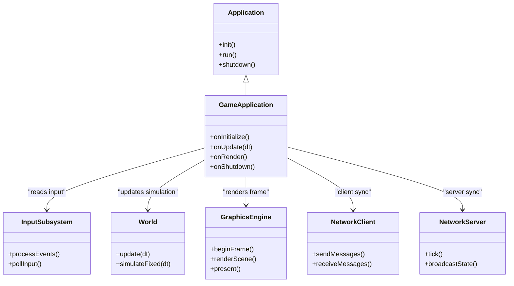

**Diagram sources**
- [Application.hpp](file://engine/Poseidon/Core/Application.hpp)
- [Application.cpp](file://engine/Poseidon/Core/Application.cpp)
- [GameApplication.hpp](file://apps/cwr/Game/GameApplication.hpp)
- [GameApplication.cpp](file://apps/cwr/Game/GameApplication.cpp)
- [InputSubsystem.hpp](file://engine/Poseidon/Input/InputSubsystem.hpp)
- [InputSubsystem.cpp](file://engine/Poseidon/Input/InputSubsystem.cpp)
- [World.hpp](file://engine/Poseidon/World/World.hpp)
- [World.cpp](file://engine/Poseidon/World/World.cpp)
- [GraphicsEngineFactory.hpp](file://engine/Poseidon/Graphics/GraphicsEngineFactory.hpp)
- [GraphicsEngineFactory.cpp](file://engine/Poseidon/Graphics/GraphicsEngineFactory.cpp)
- [EngineGL33.cpp](file://engine/PoseidonGL33/EngineGL33.cpp)
- [EngineWgpu.cpp](file://engine/WgpuRenderer/EngineWgpu.cpp)
- [NetworkClient.cpp](file://engine/Poseidon/Network/NetworkClient.cpp)
- [NetworkServer.cpp](file://engine/Poseidon/Network/NetworkServer.cpp)

## Detailed Component Analysis

### Client Game Loop
The client loop processes input, advances simulation, renders frames, and handles networking. It typically uses a variable timestep for rendering and may use a fixed timestep for deterministic simulation steps.

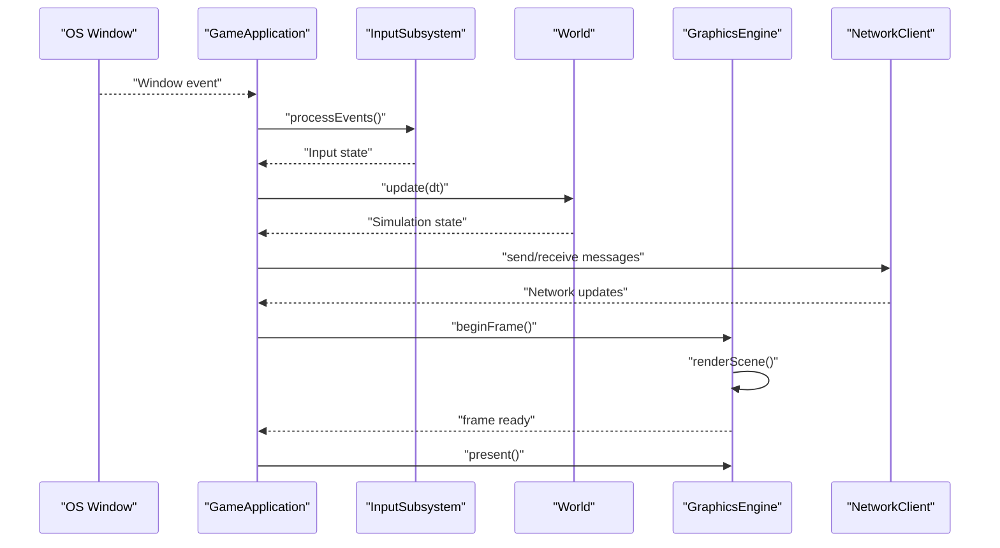

**Diagram sources**
- [GameApplication.cpp](file://apps/cwr/Game/GameApplication.cpp)
- [InputSubsystem.cpp](file://engine/Poseidon/Input/InputSubsystem.cpp)
- [World.cpp](file://engine/Poseidon/World/World.cpp)
- [GraphicsEngineFactory.cpp](file://engine/Poseidon/Graphics/GraphicsEngineFactory.cpp)
- [EngineGL33.cpp](file://engine/PoseidonGL33/EngineGL33.cpp)
- [EngineWgpu.cpp](file://engine/WgpuRenderer/EngineWgpu.cpp)
- [NetworkClient.cpp](file://engine/Poseidon/Network/NetworkClient.cpp)

**Section sources**
- [GameApplication.cpp](file://apps/cwr/Game/GameApplication.cpp)
- [InputSubsystem.cpp](file://engine/Poseidon/Input/InputSubsystem.cpp)
- [World.cpp](file://engine/Poseidon/World/World.cpp)
- [GraphicsEngineFactory.cpp](file://engine/Poseidon/Graphics/GraphicsEngineFactory.cpp)
- [EngineGL33.cpp](file://engine/PoseidonGL33/EngineGL33.cpp)
- [EngineWgpu.cpp](file://engine/WgpuRenderer/EngineWgpu.cpp)
- [NetworkClient.cpp](file://engine/Poseidon/Network/NetworkClient.cpp)

### Server Game Loop
The server loop focuses on deterministic simulation and network synchronization. It typically runs at a fixed timestep to ensure consistent gameplay across clients.

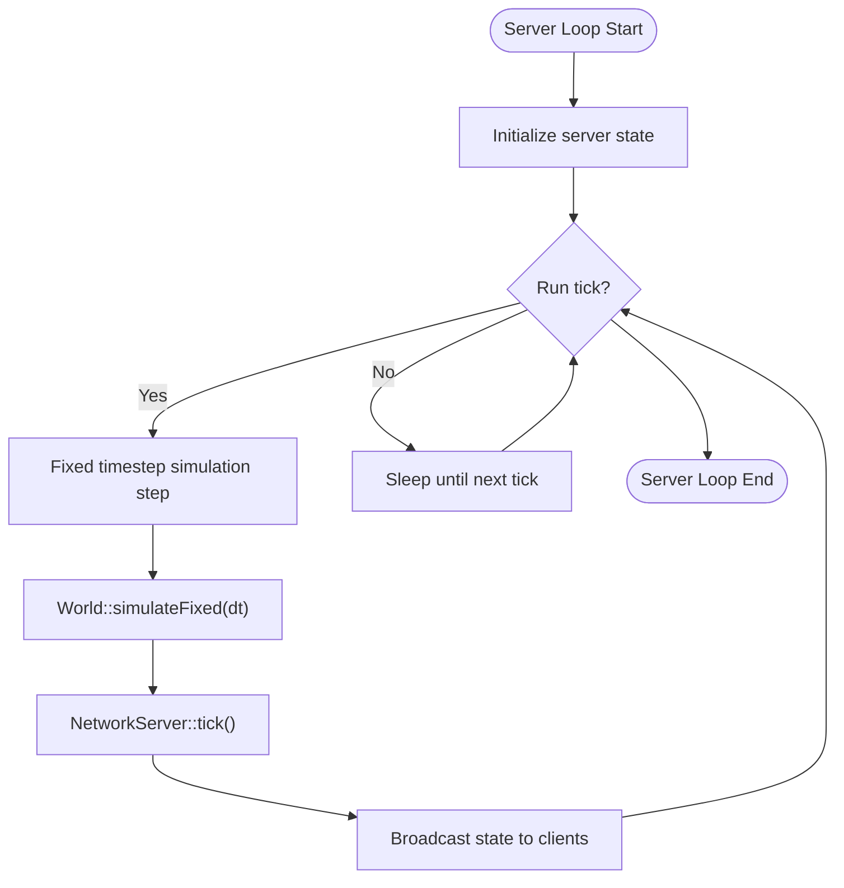

**Diagram sources**
- [ServerApplication.cpp](file://apps/cwr/Server/ServerApplication.cpp)
- [World.cpp](file://engine/Poseidon/World/World.cpp)
- [NetworkServer.cpp](file://engine/Poseidon/Network/NetworkServer.cpp)

**Section sources**
- [ServerApplication.cpp](file://apps/cwr/Server/ServerApplication.cpp)
- [World.cpp](file://engine/Poseidon/World/World.cpp)
- [NetworkServer.cpp](file://engine/Poseidon/Network/NetworkServer.cpp)

### Frame Timing and Delta-Time Management
Frame timing controls how often updates occur and how much time passes between frames. Key aspects include:
- Measuring elapsed time between frames.
- Accumulating time for fixed-step simulation.
- Clamping delta-time to avoid large jumps.
- Optional frame pacing to target specific frame rates.

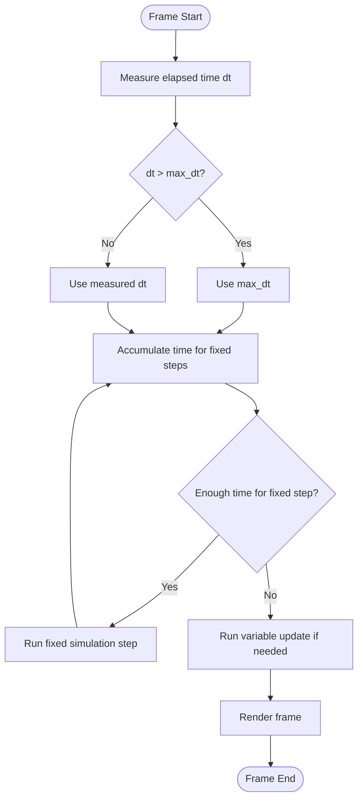

[No sources needed since this diagram shows conceptual workflow, not actual code structure]

### Input Processing Integration
Input events are polled and dispatched each frame. The input subsystem abstracts platform-specific details and provides normalized input state to the game loop.

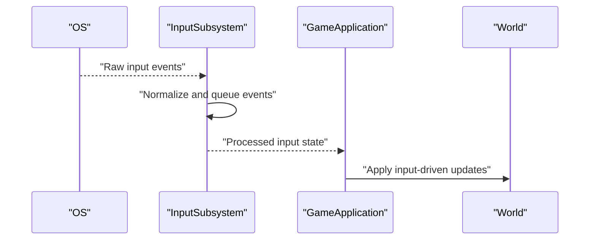

**Diagram sources**
- [InputSubsystem.cpp](file://engine/Poseidon/Input/InputSubsystem.cpp)
- [GameApplication.cpp](file://apps/cwr/Game/GameApplication.cpp)
- [World.cpp](file://engine/Poseidon/World/World.cpp)

**Section sources**
- [InputSubsystem.cpp](file://engine/Poseidon/Input/InputSubsystem.cpp)
- [GameApplication.cpp](file://apps/cwr/Game/GameApplication.cpp)
- [World.cpp](file://engine/Poseidon/World/World.cpp)

### Physics Simulation Integration
The world/simulation component manages deterministic updates. For deterministic behavior, fixed timesteps are preferred, while variable steps can be used for non-critical updates.

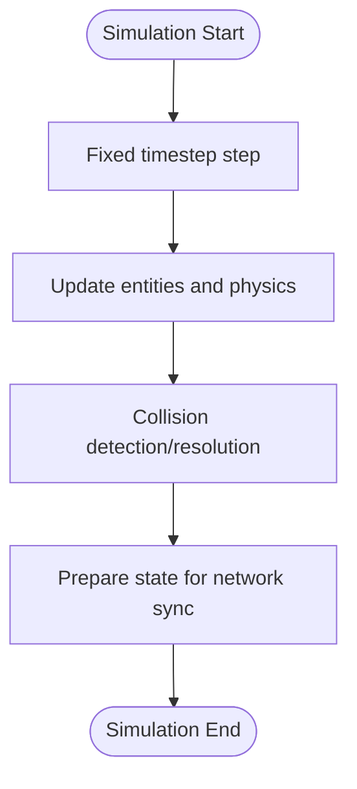

**Diagram sources**
- [World.cpp](file://engine/Poseidon/World/World.cpp)

**Section sources**
- [World.cpp](file://engine/Poseidon/World/World.cpp)

### Rendering Synchronization
Rendering is synchronized with the frame loop. The graphics engine begins a frame, renders the scene, and presents the result. Vsync or frame pacing may be used to control frame output.

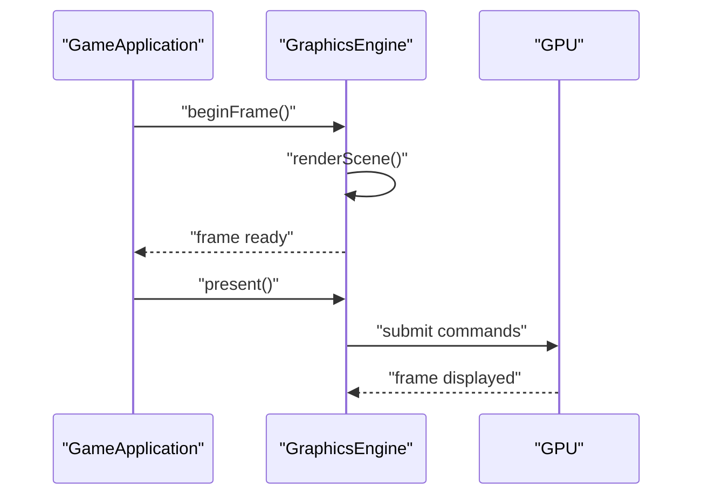

**Diagram sources**
- [GraphicsEngineFactory.cpp](file://engine/Poseidon/Graphics/GraphicsEngineFactory.cpp)
- [EngineGL33.cpp](file://engine/PoseidonGL33/EngineGL33.cpp)
- [EngineWgpu.cpp](file://engine/WgpuRenderer/EngineWgpu.cpp)

**Section sources**
- [GraphicsEngineFactory.cpp](file://engine/Poseidon/Graphics/GraphicsEngineFactory.cpp)
- [EngineGL33.cpp](file://engine/PoseidonGL33/EngineGL33.cpp)
- [EngineWgpu.cpp](file://engine/WgpuRenderer/EngineWgpu.cpp)

### Networking Synchronization Patterns
Networking integrates with the game loop to send and receive messages. Clients synchronize state from the server, while the server broadcasts authoritative state.

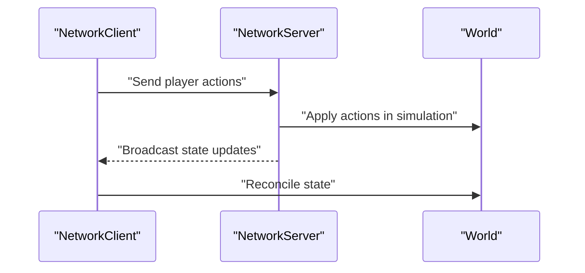

**Diagram sources**
- [NetworkClient.cpp](file://engine/Poseidon/Network/NetworkClient.cpp)
- [NetworkServer.cpp](file://engine/Poseidon/Network/NetworkServer.cpp)
- [World.cpp](file://engine/Poseidon/World/World.cpp)

**Section sources**
- [NetworkClient.cpp](file://engine/Poseidon/Network/NetworkClient.cpp)
- [NetworkServer.cpp](file://engine/Poseidon/Network/NetworkServer.cpp)
- [World.cpp](file://engine/Poseidon/World/World.cpp)

### Threading Considerations
Background tasks can be offloaded using a task pool to avoid blocking the main loop. Critical sections should be minimized to maintain determinism and responsiveness.

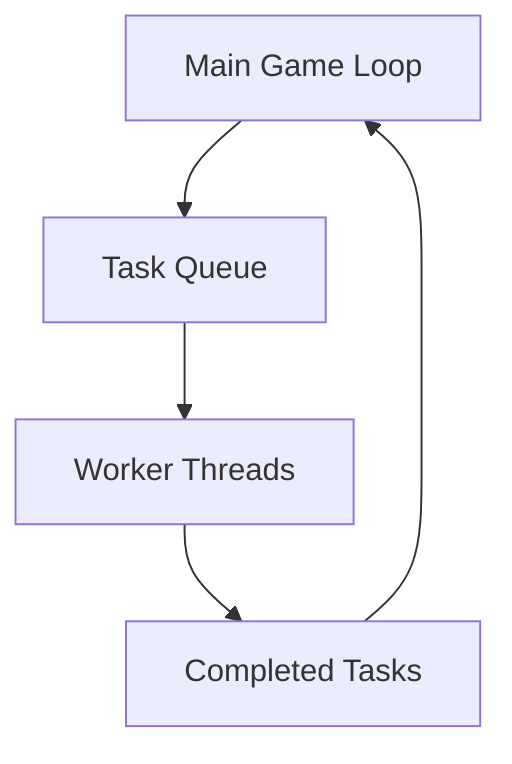

**Diagram sources**
- [TaskPool.cpp](file://engine/Poseidon/Core/TaskPool.cpp)
- [TaskPool.hpp](file://engine/Poseidon/Core/TaskPool.hpp)

**Section sources**
- [TaskPool.cpp](file://engine/Poseidon/Core/TaskPool.cpp)
- [TaskPool.hpp](file://engine/Poseidon/Core/TaskPool.hpp)

### Custom Game Loop Extensions
Extensions can hook into the loop for profiling, logging, or custom behaviors. Common extension points include:
- Pre-update hooks for input or network processing.
- Post-update hooks for state validation or metrics.
- Render hooks for overlays or debug visualization.

[No sources needed since this section provides general guidance]

### Performance Monitoring and Frame Rate Management
Monitoring includes tracking frame times, CPU/GPU utilization, and network latency. Frame rate management involves targeting specific FPS values and adjusting simulation steps accordingly.

[No sources needed since this section provides general guidance]

## Dependency Analysis
The game loop depends on several subsystems. Understanding these dependencies helps identify potential bottlenecks and coupling issues.

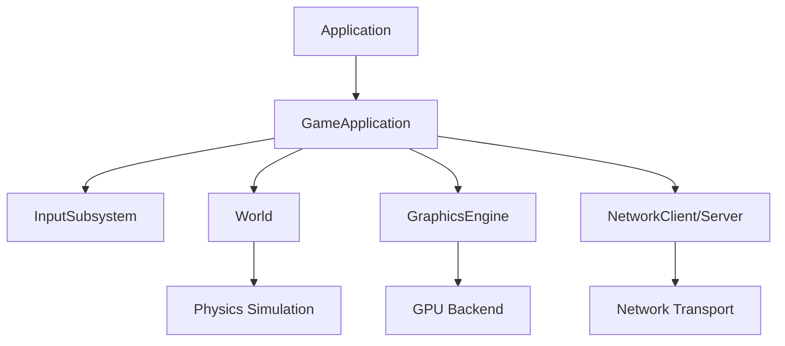

**Diagram sources**
- [Application.cpp](file://engine/Poseidon/Core/Application.cpp)
- [GameApplication.cpp](file://apps/cwr/Game/GameApplication.cpp)
- [InputSubsystem.cpp](file://engine/Poseidon/Input/InputSubsystem.cpp)
- [World.cpp](file://engine/Poseidon/World/World.cpp)
- [GraphicsEngineFactory.cpp](file://engine/Poseidon/Graphics/GraphicsEngineFactory.cpp)
- [NetworkClient.cpp](file://engine/Poseidon/Network/NetworkClient.cpp)
- [NetworkServer.cpp](file://engine/Poseidon/Network/NetworkServer.cpp)

**Section sources**
- [Application.cpp](file://engine/Poseidon/Core/Application.cpp)
- [GameApplication.cpp](file://apps/cwr/Game/GameApplication.cpp)
- [InputSubsystem.cpp](file://engine/Poseidon/Input/InputSubsystem.cpp)
- [World.cpp](file://engine/Poseidon/World/World.cpp)
- [GraphicsEngineFactory.cpp](file://engine/Poseidon/Graphics/GraphicsEngineFactory.cpp)
- [NetworkClient.cpp](file://engine/Poseidon/Network/NetworkClient.cpp)
- [NetworkServer.cpp](file://engine/Poseidon/Network/NetworkServer.cpp)

## Performance Considerations
- Use fixed timesteps for deterministic simulation to avoid drift.
- Clamp delta-time to prevent large jumps after pauses.
- Batch network messages to reduce overhead.
- Offload heavy tasks to worker threads using a task pool.
- Profile CPU and GPU usage to identify bottlenecks.
- Adjust rendering quality based on frame time targets.

[No sources needed since this section provides general guidance]

## Troubleshooting Guide
Common issues and solutions:
- Frame timing spikes: Check for blocking operations in input, network, or disk I/O.
- Stuttering: Ensure fixed timestep simulation is not delayed by long updates.
- Desynchronization: Verify deterministic simulation and consistent network message ordering.
- High CPU usage: Profile hotspots and optimize critical paths.
- Network lag: Monitor latency and adjust update frequencies.

Debugging tips:
- Log frame times and simulation steps.
- Use profiling tools to measure CPU/GPU utilization.
- Validate network message sequences and timestamps.
- Test with reduced complexity to isolate issues.

[No sources needed since this section provides general guidance]

## Conclusion
The Game Loop System coordinates input, simulation, rendering, and networking to deliver responsive and deterministic gameplay. By separating client and server loops, managing frame timing carefully, and integrating subsystems cleanly, the engine achieves robust performance and scalability. Extensibility points allow customization for profiling, logging, and specialized behaviors. Proper debugging and optimization techniques ensure smooth operation under varying conditions.

[No sources needed since this section summarizes without analyzing specific files]