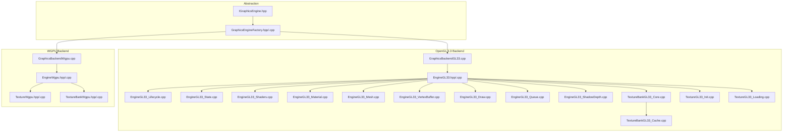
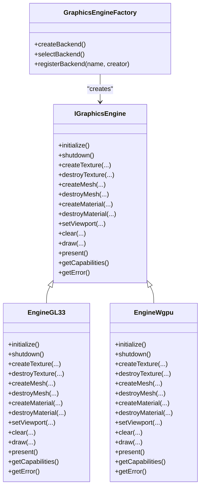
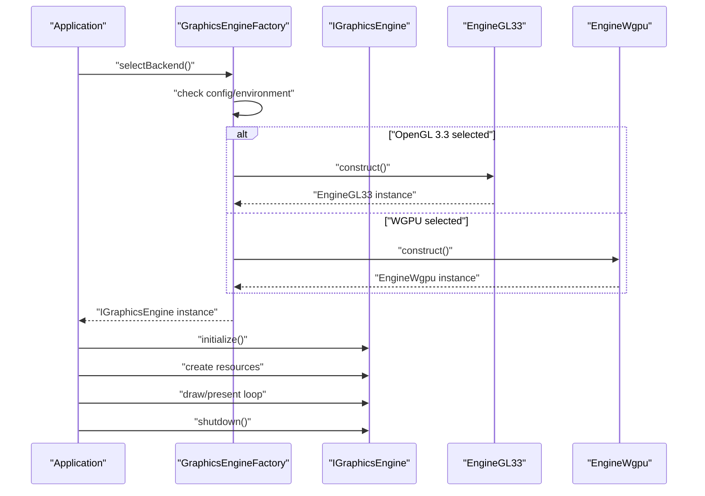
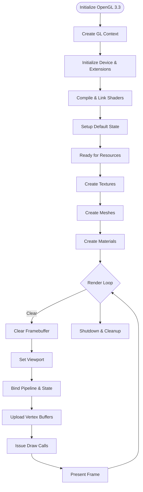
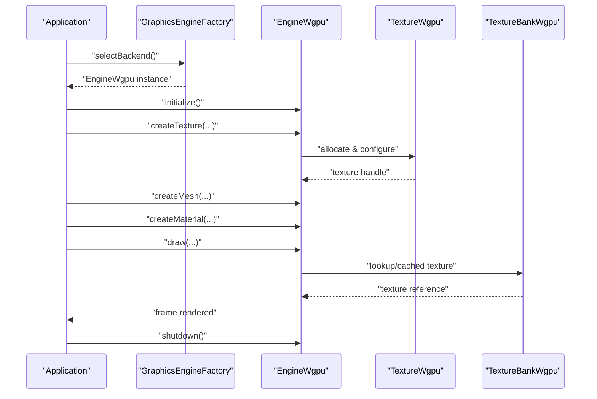
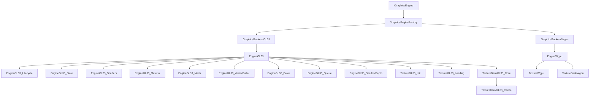

# Graphics Abstraction Layer

<cite>
**Referenced Files in This Document**
- [IGraphicsEngine.hpp](file://engine/Poseidon/Graphics/IGraphicsEngine.hpp)
- [GraphicsEngineFactory.hpp](file://engine/Poseidon/Graphics/GraphicsEngineFactory.hpp)
- [GraphicsEngineFactory.cpp](file://engine/Poseidon/Graphics/GraphicsEngineFactory.cpp)
- [GraphicsBackendGL33.cpp](file://engine/PoseidonGL33/GraphicsBackendGL33.cpp)
- [EngineGL33.hpp](file://engine/PoseidonGL33/EngineGL33.hpp)
- [EngineGL33.cpp](file://engine/PoseidonGL33/EngineGL33.cpp)
- [EngineGL33_Lifecycle.cpp](file://engine/PoseidonGL33/EngineGL33_Lifecycle.cpp)
- [EngineGL33_State.cpp](file://engine/PoseidonGL33/EngineGL33_State.cpp)
- [EngineGL33_Shaders.cpp](file://engine/PoseidonGL33/EngineGL33_Shaders.cpp)
- [EngineGL33_Material.cpp](file://engine/PoseidonGL33/EngineGL33_Material.cpp)
- [EngineGL33_Mesh.cpp](file://engine/PoseidonGL33/EngineGL33_Mesh.cpp)
- [EngineGL33_VertexBuffer.cpp](file://engine/PoseidonGL33/EngineGL33_VertexBuffer.cpp)
- [EngineGL33_Draw.cpp](file://engine/PoseidonGL33/EngineGL33_Draw.cpp)
- [EngineGL33_Queue.cpp](file://engine/PoseidonGL33/EngineGL33_Queue.cpp)
- [EngineGL33_ShadowDepth.cpp](file://engine/PoseidonGL33/EngineGL33_ShadowDepth.cpp)
- [TextureBankGL33_Core.cpp](file://engine/PoseidonGL33/TextureBankGL33_Core.cpp)
- [TextureBankGL33_Cache.cpp](file://engine/PoseidonGL33/TextureBankGL33_Cache.cpp)
- [TextureGL33_Init.cpp](file://engine/PoseidonGL33/TextureGL33_Init.cpp)
- [TextureGL33_Loading.cpp](file://engine/PoseidonGL33/TextureGL33_Loading.cpp)
- [GraphicsBackendWgpu.cpp](file://engine/WgpuRenderer/GraphicsBackendWgpu.cpp)
- [EngineWgpu.hpp](file://engine/WgpuRenderer/EngineWgpu.hpp)
- [EngineWgpu.cpp](file://engine/WgpuRenderer/EngineWgpu.cpp)
- [TextureWgpu.hpp](file://engine/WgpuRenderer/TextureWgpu.hpp)
- [TextureWgpu.cpp](file://engine/WgpuRenderer/TextureWgpu.cpp)
- [TextureBankWgpu.hpp](file://engine/WgpuRenderer/TextureBankWgpu.hpp)
- [TextureBankWgpu.cpp](file://engine/WgpuRenderer/TextureBankWgpu.cpp)
</cite>

## Table of Contents
1. [Introduction](#introduction)
2. [Project Structure](#project-structure)
3. [Core Components](#core-components)
4. [Architecture Overview](#architecture-overview)
5. [Detailed Component Analysis](#detailed-component-analysis)
6. [Dependency Analysis](#dependency-analysis)
7. [Performance Considerations](#performance-considerations)
8. [Troubleshooting Guide](#troubleshooting-guide)
9. [Conclusion](#conclusion)
10. [Appendices](#appendices)

## Introduction
This document describes the graphics abstraction layer that provides a unified interface across multiple rendering backends. It focuses on the IGraphicsEngine interface design, the backend factory pattern used to select and construct concrete backends, and how OpenGL 3.3 and WGPU are abstracted behind a consistent API. It also covers engine lifecycle management, resource initialization, platform-specific setup, graphics state handling, context management, error reporting, strategies for integrating new backends, performance considerations, debugging hooks, and testing approaches.

## Project Structure
The graphics abstraction is implemented under the Poseidon module with two primary backend implementations:
- OpenGL 3.3 backend under PoseidonGL33
- WGPU backend under WgpuRenderer

Key files include the core interface, factory, and backend-specific engine and texture implementations. The structure separates common abstractions from backend-specific details, enabling pluggable backends while keeping shared logic centralized.

**Diagram sources**
- [IGraphicsEngine.hpp](file://engine/Poseidon/Graphics/IGraphicsEngine.hpp)
- [GraphicsEngineFactory.hpp](file://engine/Poseidon/Graphics/GraphicsEngineFactory.hpp)
- [GraphicsEngineFactory.cpp](file://engine/Poseidon/Graphics/GraphicsEngineFactory.cpp)
- [GraphicsBackendGL33.cpp](file://engine/PoseidonGL33/GraphicsBackendGL33.cpp)
- [EngineGL33.hpp](file://engine/PoseidonGL33/EngineGL33.hpp)
- [EngineGL33.cpp](file://engine/PoseidonGL33/EngineGL33.cpp)
- [EngineGL33_Lifecycle.cpp](file://engine/PoseidonGL33/EngineGL33_Lifecycle.cpp)
- [EngineGL33_State.cpp](file://engine/PoseidonGL33/EngineGL33_State.cpp)
- [EngineGL33_Shaders.cpp](file://engine/PoseidonGL33/EngineGL33_Shaders.cpp)
- [EngineGL33_Material.cpp](file://engine/PoseidonGL33/EngineGL33_Material.cpp)
- [EngineGL33_Mesh.cpp](file://engine/PoseidonGL33/EngineGL33_Mesh.cpp)
- [EngineGL33_VertexBuffer.cpp](file://engine/PoseidonGL33/EngineGL33_VertexBuffer.cpp)
- [EngineGL33_Draw.cpp](file://engine/PoseidonGL33/EngineGL33_Draw.cpp)
- [EngineGL33_Queue.cpp](file://engine/PoseidonGL33/EngineGL33_Queue.cpp)
- [EngineGL33_ShadowDepth.cpp](file://engine/PoseidonGL33/EngineGL33_ShadowDepth.cpp)
- [TextureBankGL33_Core.cpp](file://engine/PoseidonGL33/TextureBankGL33_Core.cpp)
- [TextureBankGL33_Cache.cpp](file://engine/PoseidonGL33/TextureBankGL33_Cache.cpp)
- [TextureGL33_Init.cpp](file://engine/PoseidonGL33/TextureGL33_Init.cpp)
- [TextureGL33_Loading.cpp](file://engine/PoseidonGL33/TextureGL33_Loading.cpp)
- [GraphicsBackendWgpu.cpp](file://engine/WgpuRenderer/GraphicsBackendWgpu.cpp)
- [EngineWgpu.hpp](file://engine/WgpuRenderer/EngineWgpu.hpp)
- [EngineWgpu.cpp](file://engine/WgpuRenderer/EngineWgpu.cpp)
- [TextureWgpu.hpp](file://engine/WgpuRenderer/TextureWgpu.hpp)
- [TextureWgpu.cpp](file://engine/WgpuRenderer/TextureWgpu.cpp)
- [TextureBankWgpu.hpp](file://engine/WgpuRenderer/TextureBankWgpu.hpp)
- [TextureBankWgpu.cpp](file://engine/WgpuRenderer/TextureBankWgpu.cpp)

**Section sources**
- [IGraphicsEngine.hpp](file://engine/Poseidon/Graphics/IGraphicsEngine.hpp)
- [GraphicsEngineFactory.hpp](file://engine/Poseidon/Graphics/GraphicsEngineFactory.hpp)
- [GraphicsEngineFactory.cpp](file://engine/Poseidon/Graphics/GraphicsEngineFactory.cpp)
- [GraphicsBackendGL33.cpp](file://engine/PoseidonGL33/GraphicsBackendGL33.cpp)
- [EngineGL33.hpp](file://engine/PoseidonGL33/EngineGL33.hpp)
- [EngineGL33.cpp](file://engine/PoseidonGL33/EngineGL33.cpp)
- [EngineWgpu.hpp](file://engine/WgpuRenderer/EngineWgpu.hpp)
- [EngineWgpu.cpp](file://engine/WgpuRenderer/EngineWgpu.cpp)

## Core Components
- IGraphicsEngine: Defines the unified interface for all backends, including lifecycle methods (initialize, shutdown), resource creation (textures, meshes, materials), drawing commands, and state/query operations.
- GraphicsEngineFactory: Implements the backend factory pattern to create an IGraphicsEngine instance based on runtime configuration or environment selection. It encapsulates platform-specific checks and backend registration.
- Backend Implementations:
  - OpenGL 3.3 backend: EngineGL33 and related modules implement the IGraphicsEngine interface using OpenGL 3.3 APIs, managing contexts, shaders, buffers, textures, and draw queues.
  - WGPU backend: EngineWgpu implements the same interface using WGPU, providing equivalent functionality through WebGPU’s cross-platform GPU abstraction.

These components ensure that higher-level systems interact only with IGraphicsEngine, remaining agnostic to the underlying GPU API.

**Section sources**
- [IGraphicsEngine.hpp](file://engine/Poseidon/Graphics/IGraphicsEngine.hpp)
- [GraphicsEngineFactory.hpp](file://engine/Poseidon/Graphics/GraphicsEngineFactory.hpp)
- [GraphicsEngineFactory.cpp](file://engine/Poseidon/Graphics/GraphicsEngineFactory.cpp)
- [EngineGL33.hpp](file://engine/PoseidonGL33/EngineGL33.hpp)
- [EngineWgpu.hpp](file://engine/WgpuRenderer/EngineWgpu.hpp)

## Architecture Overview
The architecture follows a clear separation between abstraction and implementation:
- Abstraction layer exposes IGraphicsEngine methods for lifecycle, resources, and rendering.
- Factory selects and constructs the appropriate backend at startup.
- Each backend manages its own context, state, and resources while conforming to the interface contract.

**Diagram sources**
- [IGraphicsEngine.hpp](file://engine/Poseidon/Graphics/IGraphicsEngine.hpp)
- [EngineGL33.hpp](file://engine/PoseidonGL33/EngineGL33.hpp)
- [EngineWgpu.hpp](file://engine/WgpuRenderer/EngineWgpu.hpp)
- [GraphicsEngineFactory.hpp](file://engine/Poseidon/Graphics/GraphicsEngineFactory.hpp)

## Detailed Component Analysis

### IGraphicsEngine Interface Design
The interface defines a consistent set of operations for all backends:
- Lifecycle: initialize, shutdown
- Resource creation/destruction: textures, meshes, materials
- Rendering control: viewport, clear, draw, present
- Query and diagnostics: capabilities, error retrieval

This design ensures uniform behavior across backends and simplifies integration for application code.

**Section sources**
- [IGraphicsEngine.hpp](file://engine/Poseidon/Graphics/IGraphicsEngine.hpp)

### Backend Factory Pattern Implementation
The factory encapsulates backend selection and construction:
- Registration mechanism allows backends to register themselves by name.
- Selection logic chooses a backend based on configuration or environment.
- Creation returns a concrete IGraphicsEngine instance.

**Diagram sources**
- [GraphicsEngineFactory.hpp](file://engine/Poseidon/Graphics/GraphicsEngineFactory.hpp)
- [GraphicsEngineFactory.cpp](file://engine/Poseidon/Graphics/GraphicsEngineFactory.cpp)
- [EngineGL33.hpp](file://engine/PoseidonGL33/EngineGL33.hpp)
- [EngineWgpu.hpp](file://engine/WgpuRenderer/EngineWgpu.hpp)

**Section sources**
- [GraphicsEngineFactory.hpp](file://engine/Poseidon/Graphics/GraphicsEngineFactory.hpp)
- [GraphicsEngineFactory.cpp](file://engine/Poseidon/Graphics/GraphicsEngineFactory.cpp)

### OpenGL 3.3 Backend
The OpenGL 3.3 backend implements the full IGraphicsEngine interface:
- Lifecycle management via EngineGL33_Lifecycle handles context creation, device initialization, and cleanup.
- State management via EngineGL33_State tracks bindings and pipeline state.
- Shader management via EngineGL33_Shaders compiles and links programs.
- Material and mesh handling via EngineGL33_Material and EngineGL33_Mesh manage GPU-side assets.
- Vertex buffer management via EngineGL33_VertexBuffer handles buffer allocation and updates.
- Drawing commands via EngineGL33_Draw issue draw calls and batch operations.
- Queue management via EngineGL33_Queue organizes render passes and command submission.
- Shadow depth rendering via EngineGL33_ShadowDepth implements shadow map generation.
- Texture management via TextureGL33_Init and TextureGL33_Loading handle texture creation and loading.
- Texture bank caching via TextureBankGL33_Core and TextureBankGL33_Cache optimizes texture reuse.

**Diagram sources**
- [EngineGL33_Lifecycle.cpp](file://engine/PoseidonGL33/EngineGL33_Lifecycle.cpp)
- [EngineGL33_State.cpp](file://engine/PoseidonGL33/EngineGL33_State.cpp)
- [EngineGL33_Shaders.cpp](file://engine/PoseidonGL33/EngineGL33_Shaders.cpp)
- [EngineGL33_Material.cpp](file://engine/PoseidonGL33/EngineGL33_Material.cpp)
- [EngineGL33_Mesh.cpp](file://engine/PoseidonGL33/EngineGL33_Mesh.cpp)
- [EngineGL33_VertexBuffer.cpp](file://engine/PoseidonGL33/EngineGL33_VertexBuffer.cpp)
- [EngineGL33_Draw.cpp](file://engine/PoseidonGL33/EngineGL33_Draw.cpp)
- [EngineGL33_Queue.cpp](file://engine/PoseidonGL33/EngineGL33_Queue.cpp)
- [EngineGL33_ShadowDepth.cpp](file://engine/PoseidonGL33/EngineGL33_ShadowDepth.cpp)
- [TextureGL33_Init.cpp](file://engine/PoseidonGL33/TextureGL33_Init.cpp)
- [TextureGL33_Loading.cpp](file://engine/PoseidonGL33/TextureGL33_Loading.cpp)
- [TextureBankGL33_Core.cpp](file://engine/PoseidonGL33/TextureBankGL33_Core.cpp)
- [TextureBankGL33_Cache.cpp](file://engine/PoseidonGL33/TextureBankGL33_Cache.cpp)

**Section sources**
- [EngineGL33.hpp](file://engine/PoseidonGL33/EngineGL33.hpp)
- [EngineGL33.cpp](file://engine/PoseidonGL33/EngineGL33.cpp)
- [EngineGL33_Lifecycle.cpp](file://engine/PoseidonGL33/EngineGL33_Lifecycle.cpp)
- [EngineGL33_State.cpp](file://engine/PoseidonGL33/EngineGL33_State.cpp)
- [EngineGL33_Shaders.cpp](file://engine/PoseidonGL33/EngineGL33_Shaders.cpp)
- [EngineGL33_Material.cpp](file://engine/PoseidonGL33/EngineGL33_Material.cpp)
- [EngineGL33_Mesh.cpp](file://engine/PoseidonGL33/EngineGL33_Mesh.cpp)
- [EngineGL33_VertexBuffer.cpp](file://engine/PoseidonGL33/EngineGL33_VertexBuffer.cpp)
- [EngineGL33_Draw.cpp](file://engine/PoseidonGL33/EngineGL33_Draw.cpp)
- [EngineGL33_Queue.cpp](file://engine/PoseidonGL33/EngineGL33_Queue.cpp)
- [EngineGL33_ShadowDepth.cpp](file://engine/PoseidonGL33/EngineGL33_ShadowDepth.cpp)
- [TextureGL33_Init.cpp](file://engine/PoseidonGL33/TextureGL33_Init.cpp)
- [TextureGL33_Loading.cpp](file://engine/PoseidonGL33/TextureGL33_Loading.cpp)
- [TextureBankGL33_Core.cpp](file://engine/PoseidonGL33/TextureBankGL33_Core.cpp)
- [TextureBankGL33_Cache.cpp](file://engine/PoseidonGL33/TextureBankGL33_Cache.cpp)

### WGPU Backend
The WGPU backend mirrors the OpenGL 3.3 interface using WebGPU:
- EngineWgpu implements lifecycle, resource creation, and rendering commands.
- TextureWgpu handles texture creation and updates.
- TextureBankWgpu manages texture caching and reuse.

**Diagram sources**
- [EngineWgpu.hpp](file://engine/WgpuRenderer/EngineWgpu.hpp)
- [EngineWgpu.cpp](file://engine/WgpuRenderer/EngineWgpu.cpp)
- [TextureWgpu.hpp](file://engine/WgpuRenderer/TextureWgpu.hpp)
- [TextureWgpu.cpp](file://engine/WgpuRenderer/TextureWgpu.cpp)
- [TextureBankWgpu.hpp](file://engine/WgpuRenderer/TextureBankWgpu.hpp)
- [TextureBankWgpu.cpp](file://engine/WgpuRenderer/TextureBankWgpu.cpp)

**Section sources**
- [EngineWgpu.hpp](file://engine/WgpuRenderer/EngineWgpu.hpp)
- [EngineWgpu.cpp](file://engine/WgpuRenderer/EngineWgpu.cpp)
- [TextureWgpu.hpp](file://engine/WgpuRenderer/TextureWgpu.hpp)
- [TextureWgpu.cpp](file://engine/WgpuRenderer/TextureWgpu.cpp)
- [TextureBankWgpu.hpp](file://engine/WgpuRenderer/TextureBankWgpu.hpp)
- [TextureBankWgpu.cpp](file://engine/WgpuRenderer/TextureBankWgpu.cpp)

### Abstracting OpenGL 3.3 and WGPU Differences
The abstraction layer hides API differences:
- Context management: OpenGL uses window system integration; WGPU initializes a device and adapter.
- Resource creation: OpenGL uses GL objects; WGPU uses descriptors and handles.
- State management: OpenGL has global state; WGPU uses pipeline objects and bind groups.
- Command submission: OpenGL issues immediate calls; WGPU records command buffers.

By implementing these differences within each backend, the IGraphicsEngine interface remains consistent.

**Section sources**
- [IGraphicsEngine.hpp](file://engine/Poseidon/Graphics/IGraphicsEngine.hpp)
- [EngineGL33.hpp](file://engine/PoseidonGL33/EngineGL33.hpp)
- [EngineWgpu.hpp](file://engine/WgpuRenderer/EngineWgpu.hpp)

## Dependency Analysis
The dependency graph shows how the factory creates backends and how each backend depends on its specific modules.

**Diagram sources**
- [IGraphicsEngine.hpp](file://engine/Poseidon/Graphics/IGraphicsEngine.hpp)
- [GraphicsEngineFactory.hpp](file://engine/Poseidon/Graphics/GraphicsEngineFactory.hpp)
- [GraphicsBackendGL33.cpp](file://engine/PoseidonGL33/GraphicsBackendGL33.cpp)
- [EngineGL33.hpp](file://engine/PoseidonGL33/EngineGL33.hpp)
- [EngineGL33_Lifecycle.cpp](file://engine/PoseidonGL33/EngineGL33_Lifecycle.cpp)
- [EngineGL33_State.cpp](file://engine/PoseidonGL33/EngineGL33_State.cpp)
- [EngineGL33_Shaders.cpp](file://engine/PoseidonGL33/EngineGL33_Shaders.cpp)
- [EngineGL33_Material.cpp](file://engine/PoseidonGL33/EngineGL33_Material.cpp)
- [EngineGL33_Mesh.cpp](file://engine/PoseidonGL33/EngineGL33_Mesh.cpp)
- [EngineGL33_VertexBuffer.cpp](file://engine/PoseidonGL33/EngineGL33_VertexBuffer.cpp)
- [EngineGL33_Draw.cpp](file://engine/PoseidonGL33/EngineGL33_Draw.cpp)
- [EngineGL33_Queue.cpp](file://engine/PoseidonGL33/EngineGL33_Queue.cpp)
- [EngineGL33_ShadowDepth.cpp](file://engine/PoseidonGL33/EngineGL33_ShadowDepth.cpp)
- [TextureGL33_Init.cpp](file://engine/PoseidonGL33/TextureGL33_Init.cpp)
- [TextureGL33_Loading.cpp](file://engine/PoseidonGL33/TextureGL33_Loading.cpp)
- [TextureBankGL33_Core.cpp](file://engine/PoseidonGL33/TextureBankGL33_Core.cpp)
- [TextureBankGL33_Cache.cpp](file://engine/PoseidonGL33/TextureBankGL33_Cache.cpp)
- [GraphicsBackendWgpu.cpp](file://engine/WgpuRenderer/GraphicsBackendWgpu.cpp)
- [EngineWgpu.hpp](file://engine/WgpuRenderer/EngineWgpu.hpp)
- [TextureWgpu.hpp](file://engine/WgpuRenderer/TextureWgpu.hpp)
- [TextureBankWgpu.hpp](file://engine/WgpuRenderer/TextureBankWgpu.hpp)

**Section sources**
- [GraphicsEngineFactory.cpp](file://engine/Poseidon/Graphics/GraphicsEngineFactory.cpp)
- [EngineGL33.hpp](file://engine/PoseidonGL33/EngineGL33.hpp)
- [EngineWgpu.hpp](file://engine/WgpuRenderer/EngineWgpu.hpp)

## Performance Considerations
- Batching and Queuing: Both backends should minimize state changes and batch draw calls to reduce overhead.
- Texture Caching: Reuse textures via banks to avoid redundant allocations.
- Resource Lifetimes: Properly manage resource lifecycles to prevent leaks and unnecessary reloads.
- Asynchronous Operations: Where possible, use asynchronous loading and upload to keep the main thread responsive.
- Profiling Hooks: Integrate profiling markers to identify bottlenecks in shader compilation, texture uploads, and draw call submission.

[No sources needed since this section provides general guidance]

## Troubleshooting Guide
- Error Reporting: Use getError() to retrieve backend-specific error information after operations fail.
- Validation: Enable validation layers for OpenGL (via GL debug output) and WGPU (via validation features) during development.
- Logging: Add detailed logs around resource creation and destruction to track issues.
- Common Issues:
  - Context initialization failures: Check platform-specific setup and driver compatibility.
  - Shader compilation errors: Verify shader source and extensions support.
  - Texture loading failures: Validate file formats and memory constraints.

**Section sources**
- [IGraphicsEngine.hpp](file://engine/Poseidon/Graphics/IGraphicsEngine.hpp)
- [EngineGL33_State.cpp](file://engine/PoseidonGL33/EngineGL33_State.cpp)
- [EngineWgpu.cpp](file://engine/WgpuRenderer/EngineWgpu.cpp)

## Conclusion
The graphics abstraction layer provides a robust, extensible foundation for rendering across different GPU APIs. By defining a clear interface and using a factory pattern, it enables seamless switching between OpenGL 3.3 and WGPU backends while maintaining consistency in resource management, state handling, and rendering workflows. This design supports future backend additions and facilitates performance optimization and debugging efforts.

[No sources needed since this section summarizes without analyzing specific files]

## Appendices

### Integrating a New Backend
To add a new backend:
1. Implement IGraphicsEngine with all required methods.
2. Register the backend with GraphicsEngineFactory.
3. Ensure lifecycle, resource creation, and drawing methods match the interface contract.
4. Test thoroughly with existing applications to verify compatibility.

**Section sources**
- [IGraphicsEngine.hpp](file://engine/Poseidon/Graphics/IGraphicsEngine.hpp)
- [GraphicsEngineFactory.hpp](file://engine/Poseidon/Graphics/GraphicsEngineFactory.hpp)

### Testing Strategies
- Unit Tests: Test individual backend methods for correctness.
- Integration Tests: Run full rendering pipelines with sample scenes.
- Cross-Backend Consistency: Compare outputs between backends to ensure visual parity.
- Performance Benchmarks: Measure frame times and resource usage across backends.

**Section sources**
- [EngineGL33.hpp](file://engine/PoseidonGL33/EngineGL33.hpp)
- [EngineWgpu.hpp](file://engine/WgpuRenderer/EngineWgpu.hpp)