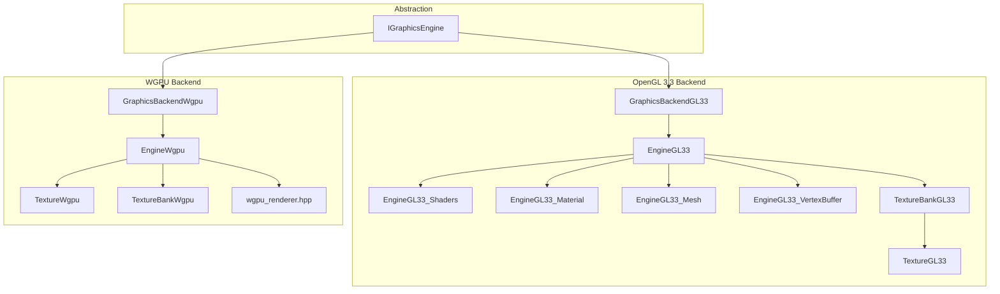
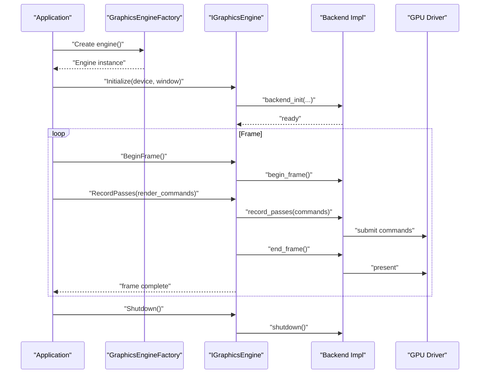
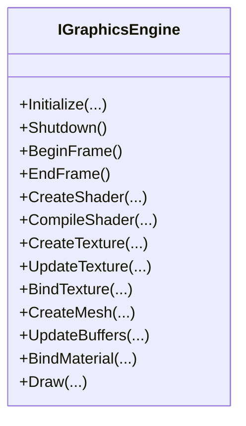
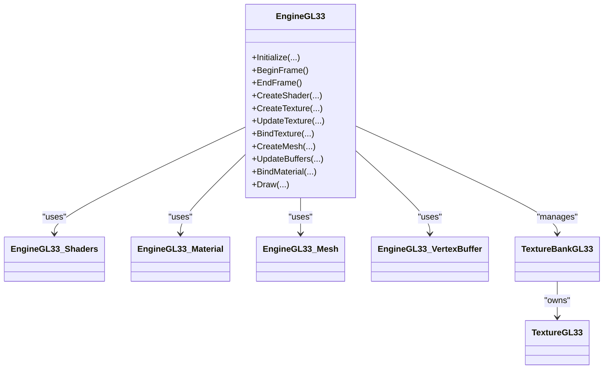
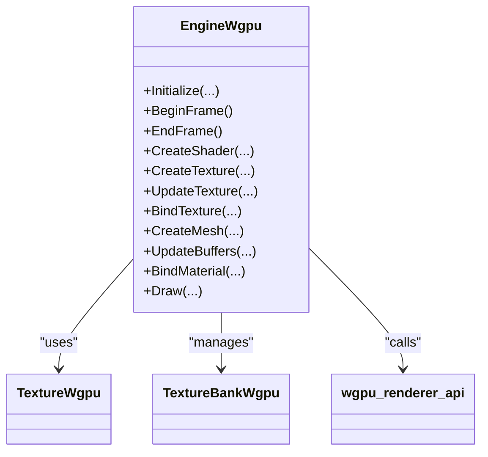
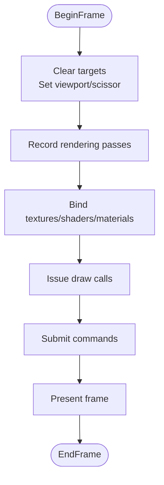
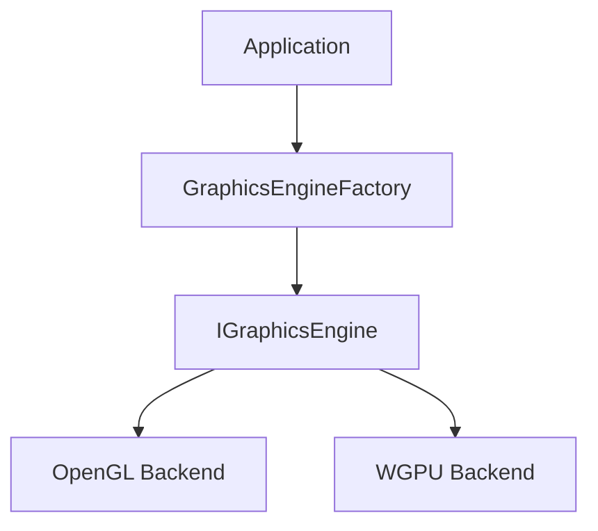

# Graphics System

<cite>
**Referenced Files in This Document**
- [IGraphicsEngine.hpp](file://engine/Poseidon/Graphics/IGraphicsEngine.hpp)
- [GraphicsEngineFactory.cpp](file://engine/Poseidon/Graphics/GraphicsEngineFactory.cpp)
- [GraphicsEngineFactory.hpp](file://engine/Poseidon/Graphics/GraphicsEngineFactory.hpp)
- [GraphicsBackendGL33.cpp](file://engine/Poseidon/PoseidonGL33/GraphicsBackendGL33.cpp)
- [EngineGL33.hpp](file://engine/Poseidon/PoseidonGL33/EngineGL33.hpp)
- [EngineGL33.cpp](file://engine/Poseidon/PoseidonGL33/EngineGL33.cpp)
- [EngineGL33_Shaders.cpp](file://engine/Poseidon/PoseidonGL33/EngineGL33_Shaders.cpp)
- [EngineGL33_Material.cpp](file://engine/Poseidon/PoseidonGL33/EngineGL33_Material.cpp)
- [EngineGL33_Mesh.cpp](file://engine/Poseidon/PoseidonGL33/EngineGL33_Mesh.cpp)
- [EngineGL33_VertexBuffer.cpp](file://engine/Poseidon/PoseidonGL33/EngineGL33_VertexBuffer.cpp)
- [TextureBankGL33_Core.cpp](file://engine/Poseidon/PoseidonGL33/TextureBankGL33_Core.cpp)
- [TextureGL33_Init.cpp](file://engine/Poseidon/PoseidonGL33/TextureGL33_Init.cpp)
- [TextureGL33_Loading.cpp](file://engine/Poseidon/PoseidonGL33/TextureGL33_Loading.cpp)
- [GraphicsBackendWgpu.cpp](file://engine/Poseidon/WgpuRenderer/GraphicsBackendWgpu.cpp)
- [EngineWgpu.hpp](file://engine/Poseidon/WgpuRenderer/EngineWgpu.hpp)
- [EngineWgpu.cpp](file://engine/Poseidon/WgpuRenderer/EngineWgpu.cpp)
- [TextureWgpu.hpp](file://engine/Poseidon/WgpuRenderer/TextureWgpu.hpp)
- [TextureWgpu.cpp](file://engine/Poseidon/WgpuRenderer/TextureWgpu.cpp)
- [TextureBankWgpu.hpp](file://engine/Poseidon/WgpuRenderer/TextureBankWgpu.hpp)
- [TextureBankWgpu.cpp](file://engine/Poseidon/WgpuRenderer/TextureBankWgpu.cpp)
- [wgpu_renderer.hpp](file://engine/Poseidon/WgpuRenderer/include/wgpu_renderer.hpp)
- [rendering-performance-plan.md](file://engine/Poseidon/WgpuRenderer/docs/rendering-performance-plan.md)
- [bindless-textures-plan.md](file://engine/Poseidon/WgpuRenderer/docs/bindless-textures-plan.md)
</cite>

## Table of Contents
1. [Introduction](#introduction)
2. [Project Structure](#project-structure)
3. [Core Components](#core-components)
4. [Architecture Overview](#architecture-overview)
5. [Detailed Component Analysis](#detailed-component-analysis)
6. [Dependency Analysis](#dependency-analysis)
7. [Performance Considerations](#performance-considerations)
8. [Troubleshooting Guide](#troubleshooting-guide)
9. [Conclusion](#conclusion)
10. [Appendices](#appendices)

## Introduction
This document explains the multi-backend graphics system that abstracts rendering across OpenGL 3.3 and WGPU backends. It focuses on the IGraphicsEngine abstraction, backend-specific implementations, frame rendering pipeline, draw call optimization, resource management (textures, shaders, GPU memory), and strategies for extending the API. It also covers performance considerations, debugging with RenderDoc, platform-specific optimizations, and migration guidance from OpenGL to WGPU.

## Project Structure
The graphics subsystem is organized around a common interface and two concrete backends:
- Abstraction layer: IGraphicsEngine defines the unified API used by the engine core and rendering passes.
- OpenGL 3.3 backend: PoseidonGL33 implements the interface using GL state, shaders, buffers, and textures.
- WGPU backend: WgpuRenderer implements the interface using WGPU pipelines, resources, and command encoding.

**Diagram sources**
- [IGraphicsEngine.hpp](file://engine/Poseidon/Graphics/IGraphicsEngine.hpp)
- [GraphicsBackendGL33.cpp](file://engine/Poseidon/PoseidonGL33/GraphicsBackendGL33.cpp)
- [EngineGL33.hpp](file://engine/Poseidon/PoseidonGL33/EngineGL33.hpp)
- [EngineGL33_Shaders.cpp](file://engine/Poseidon/PoseidonGL33/EngineGL33_Shaders.cpp)
- [EngineGL33_Material.cpp](file://engine/Poseidon/PoseidonGL33/EngineGL33_Material.cpp)
- [EngineGL33_Mesh.cpp](file://engine/Poseidon/PoseidonGL33/EngineGL33_Mesh.cpp)
- [EngineGL33_VertexBuffer.cpp](file://engine/Poseidon/PoseidonGL33/EngineGL33_VertexBuffer.cpp)
- [TextureBankGL33_Core.cpp](file://engine/Poseidon/PoseidonGL33/TextureBankGL33_Core.cpp)
- [TextureGL33_Init.cpp](file://engine/Poseidon/PoseidonGL33/TextureGL33_Init.cpp)
- [TextureGL33_Loading.cpp](file://engine/Poseidon/PoseidonGL33/TextureGL33_Loading.cpp)
- [GraphicsBackendWgpu.cpp](file://engine/Poseidon/WgpuRenderer/GraphicsBackendWgpu.cpp)
- [EngineWgpu.hpp](file://engine/Poseidon/WgpuRenderer/EngineWgpu.hpp)
- [TextureWgpu.hpp](file://engine/Poseidon/WgpuRenderer/TextureWgpu.hpp)
- [TextureWgpu.cpp](file://engine/Poseidon/WgpuRenderer/TextureWgpu.cpp)
- [TextureBankWgpu.hpp](file://engine/Poseidon/WgpuRenderer/TextureBankWgpu.hpp)
- [TextureBankWgpu.cpp](file://engine/Poseidon/WgpuRenderer/TextureBankWgpu.cpp)
- [wgpu_renderer.hpp](file://engine/Poseidon/WgpuRenderer/include/wgpu_renderer.hpp)

**Section sources**
- [IGraphicsEngine.hpp](file://engine/Poseidon/Graphics/IGraphicsEngine.hpp)
- [GraphicsEngineFactory.cpp](file://engine/Poseidon/Graphics/GraphicsEngineFactory.cpp)
- [GraphicsEngineFactory.hpp](file://engine/Poseidon/Graphics/GraphicsEngineFactory.hpp)

## Core Components
- IGraphicsEngine: The central abstraction defining device lifecycle, resource creation, shader compilation, texture management, mesh/buffer handling, material binding, and frame submission. All rendering code interacts through this interface to remain backend-agnostic.
- GraphicsEngineFactory: Selects and constructs the appropriate backend implementation based on runtime configuration or platform capabilities.
- Backend implementations:
  - OpenGL 3.3: EngineGL33 and supporting modules implement GL state management, shader compilation/linking, vertex buffer updates, material binding, and texture upload/caching.
  - WGPU: EngineWgpu and associated modules implement WGPU pipeline setup, resource allocation, command recording, and texture staging/binding.

Key responsibilities:
- Lifecycle: Initialize, configure, present frames, and shut down per backend constraints.
- Resources: Create, update, bind, and destroy textures, buffers, and shaders.
- Rendering: Record draw calls, set render states, and submit commands efficiently.
- Optimization: Batch draw calls, minimize state changes, and manage GPU memory carefully.

**Section sources**
- [IGraphicsEngine.hpp](file://engine/Poseidon/Graphics/IGraphicsEngine.hpp)
- [GraphicsEngineFactory.cpp](file://engine/Poseidon/Graphics/GraphicsEngineFactory.cpp)
- [GraphicsEngineFactory.hpp](file://engine/Poseidon/Graphics/GraphicsEngineFactory.hpp)

## Architecture Overview
The architecture separates the high-level rendering logic from low-level GPU APIs via a thin abstraction layer. Rendering passes invoke IGraphicsEngine methods without knowing whether they target OpenGL or WGPU. The factory instantiates the correct backend at startup. Each backend encapsulates its own resource types and driver-specific optimizations while exposing a consistent interface.

**Diagram sources**
- [GraphicsEngineFactory.cpp](file://engine/Poseidon/Graphics/GraphicsEngineFactory.cpp)
- [IGraphicsEngine.hpp](file://engine/Poseidon/Graphics/IGraphicsEngine.hpp)
- [GraphicsBackendGL33.cpp](file://engine/Poseidon/PoseidonGL33/GraphicsBackendGL33.cpp)
- [GraphicsBackendWgpu.cpp](file://engine/Poseidon/WgpuRenderer/GraphicsBackendWgpu.cpp)

## Detailed Component Analysis

### IGraphicsEngine Abstraction
- Purpose: Provide a stable API for lifecycle, resource management, shader compilation, texture handling, mesh/buffer operations, material binding, and frame submission.
- Design: Pure virtual interface ensuring all backends implement identical semantics.
- Extensibility: New features are added here first, then implemented per backend.

**Diagram sources**
- [IGraphicsEngine.hpp](file://engine/Poseidon/Graphics/IGraphicsEngine.hpp)

**Section sources**
- [IGraphicsEngine.hpp](file://engine/Poseidon/Graphics/IGraphicsEngine.hpp)

### OpenGL 3.3 Backend
- EngineGL33: Implements IGraphicsEngine for OpenGL 3.3, managing GL context, state, and command submission.
- Shader compilation: EngineGL33_Shaders handles GLSL source parsing, compilation, linking, and error reporting.
- Material binding: EngineGL33_Material binds uniforms, samplers, and state objects.
- Mesh and buffers: EngineGL33_Mesh and EngineGL33_VertexBuffer manage VBO/VAO/VBO updates and attribute layouts.
- Textures: TextureGL33 and TextureBankGL33 handle texture creation, loading, caching, and GPU memory management.

**Diagram sources**
- [EngineGL33.hpp](file://engine/Poseidon/PoseidonGL33/EngineGL33.hpp)
- [EngineGL33_Shaders.cpp](file://engine/Poseidon/PoseidonGL33/EngineGL33_Shaders.cpp)
- [EngineGL33_Material.cpp](file://engine/Poseidon/PoseidonGL33/EngineGL33_Material.cpp)
- [EngineGL33_Mesh.cpp](file://engine/Poseidon/PoseidonGL33/EngineGL33_Mesh.cpp)
- [EngineGL33_VertexBuffer.cpp](file://engine/Poseidon/PoseidonGL33/EngineGL33_VertexBuffer.cpp)
- [TextureBankGL33_Core.cpp](file://engine/Poseidon/PoseidonGL33/TextureBankGL33_Core.cpp)
- [TextureGL33_Init.cpp](file://engine/Poseidon/PoseidonGL33/TextureGL33_Init.cpp)
- [TextureGL33_Loading.cpp](file://engine/Poseidon/PoseidonGL33/TextureGL33_Loading.cpp)

**Section sources**
- [EngineGL33.hpp](file://engine/Poseidon/PoseidonGL33/EngineGL33.hpp)
- [EngineGL33_Shaders.cpp](file://engine/Poseidon/PoseidonGL33/EngineGL33_Shaders.cpp)
- [EngineGL33_Material.cpp](file://engine/Poseidon/PoseidonGL33/EngineGL33_Material.cpp)
- [EngineGL33_Mesh.cpp](file://engine/Poseidon/PoseidonGL33/EngineGL33_Mesh.cpp)
- [EngineGL33_VertexBuffer.cpp](file://engine/Poseidon/PoseidonGL33/EngineGL33_VertexBuffer.cpp)
- [TextureBankGL33_Core.cpp](file://engine/Poseidon/PoseidonGL33/TextureBankGL33_Core.cpp)
- [TextureGL33_Init.cpp](file://engine/Poseidon/PoseidonGL33/TextureGL33_Init.cpp)
- [TextureGL33_Loading.cpp](file://engine/Poseidon/PoseidonGL33/TextureGL33_Loading.cpp)

### WGPU Backend
- EngineWgpu: Implements IGraphicsEngine for WGPU, managing device, queues, pipelines, and command encoders.
- Textures: TextureWgpu and TextureBankWgpu provide staging uploads, mip generation, and efficient bindings.
- Integration: wgpu_renderer.hpp exposes the WGPU C API surface used by the backend.

**Diagram sources**
- [EngineWgpu.hpp](file://engine/Poseidon/WgpuRenderer/EngineWgpu.hpp)
- [TextureWgpu.hpp](file://engine/Poseidon/WgpuRenderer/TextureWgpu.hpp)
- [TextureWgpu.cpp](file://engine/Poseidon/WgpuRenderer/TextureWgpu.cpp)
- [TextureBankWgpu.hpp](file://engine/Poseidon/WgpuRenderer/TextureBankWgpu.hpp)
- [TextureBankWgpu.cpp](file://engine/Poseidon/WgpuRenderer/TextureBankWgpu.cpp)
- [wgpu_renderer.hpp](file://engine/Poseidon/WgpuRenderer/include/wgpu_renderer.hpp)

**Section sources**
- [EngineWgpu.hpp](file://engine/Poseidon/WgpuRenderer/EngineWgpu.hpp)
- [TextureWgpu.hpp](file://engine/Poseidon/WgpuRenderer/TextureWgpu.hpp)
- [TextureWgpu.cpp](file://engine/Poseidon/WgpuRenderer/TextureWgpu.cpp)
- [TextureBankWgpu.hpp](file://engine/Poseidon/WgpuRenderer/TextureBankWgpu.hpp)
- [TextureBankWgpu.cpp](file://engine/Poseidon/WgpuRenderer/TextureBankWgpu.cpp)
- [wgpu_renderer.hpp](file://engine/Poseidon/WgpuRenderer/include/wgpu_renderer.hpp)

### Frame Rendering Pipeline
The frame pipeline coordinates begin/end phases, pass recording, and submission. Both backends follow the same sequence exposed by IGraphicsEngine.

**Diagram sources**
- [IGraphicsEngine.hpp](file://engine/Poseidon/Graphics/IGraphicsEngine.hpp)
- [EngineGL33.hpp](file://engine/Poseidon/PoseidonGL33/EngineGL33.hpp)
- [EngineWgpu.hpp](file://engine/Poseidon/WgpuRenderer/EngineWgpu.hpp)

**Section sources**
- [IGraphicsEngine.hpp](file://engine/Poseidon/Graphics/IGraphicsEngine.hpp)

### Draw Call Optimization
- State batching: Group draw calls by shader, material, and texture sets to minimize state changes.
- Instancing: Use instanced rendering where possible to reduce CPU overhead.
- Buffer updates: Coalesce vertex/index buffer updates and avoid frequent reuploads.
- Occlusion and culling: Implement frustum and occlusion culling to skip hidden geometry.
- Command encoding: On WGPU, batch commands into single encoders; on GL, use VAO/VBO reuse and minimal glBind calls.

[No sources needed since this section provides general guidance]

### Resource Management Strategies
- Textures:
  - Staging buffers for uploads (WGPU) or direct glTexImage/glTexSubImage (GL).
  - Mipmaps and format conversion handled centrally.
  - Texture banks cache and deduplicate textures to reduce memory usage.
- Shaders:
  - Compile once, link once, and cache compiled binaries when supported.
  - Validate shader sources and log errors consistently across backends.
- GPU Memory:
  - Track allocations and ensure timely destruction.
  - Avoid fragmentation by pooling frequently reused resources.

**Section sources**
- [TextureGL33_Init.cpp](file://engine/Poseidon/PoseidonGL33/TextureGL33_Init.cpp)
- [TextureGL33_Loading.cpp](file://engine/Poseidon/PoseidonGL33/TextureGL33_Loading.cpp)
- [TextureBankGL33_Core.cpp](file://engine/Poseidon/PoseidonGL33/TextureBankGL33_Core.cpp)
- [TextureWgpu.hpp](file://engine/Poseidon/WgpuRenderer/TextureWgpu.hpp)
- [TextureWgpu.cpp](file://engine/Poseidon/WgpuRenderer/TextureWgpu.cpp)
- [TextureBankWgpu.hpp](file://engine/Poseidon/WgpuRenderer/TextureBankWgpu.hpp)
- [TextureBankWgpu.cpp](file://engine/Poseidon/WgpuRenderer/TextureBankWgpu.cpp)

### Relationship Between Graphics Core, Rendering Passes, and Backend Optimizations
- Graphics core uses IGraphicsEngine to issue high-level commands.
- Rendering passes encapsulate specific tasks (e.g., forward shading, shadow maps, UI).
- Backend optimizations are isolated within each implementation:
  - GL: VAO/VBO reuse, state caching, minimal driver calls.
  - WGPU: Command encoder batching, descriptor sets, compute shaders for heavy workloads.

[No sources needed since this section provides general guidance]

### Practical Examples: Adding New Features and Extending the API
Steps to add a new rendering feature:
1. Define the API in IGraphicsEngine (e.g., CreateFeatureResource, UpdateFeatureResource, BindFeatureResource, DrawFeature).
2. Implement in OpenGL backend:
   - Add GL-specific classes/functions under EngineGL33_* modules.
   - Handle GL state, buffers, and textures accordingly.
3. Implement in WGPU backend:
   - Add WGPU-specific classes/functions under EngineWgpu and related modules.
   - Manage descriptors, pipelines, and command recording.
4. Integrate into rendering passes:
   - Use the new API consistently across passes.
5. Test both backends:
   - Validate behavior, performance, and memory usage.

[No sources needed since this section provides general guidance]

## Dependency Analysis
The factory decouples application code from backend specifics. Rendering passes depend only on IGraphicsEngine. Backends depend on their respective libraries (GL drivers, WGPU).

**Diagram sources**
- [GraphicsEngineFactory.cpp](file://engine/Poseidon/Graphics/GraphicsEngineFactory.cpp)
- [IGraphicsEngine.hpp](file://engine/Poseidon/Graphics/IGraphicsEngine.hpp)
- [GraphicsBackendGL33.cpp](file://engine/Poseidon/PoseidonGL33/GraphicsBackendGL33.cpp)
- [GraphicsBackendWgpu.cpp](file://engine/Poseidon/WgpuRenderer/GraphicsBackendWgpu.cpp)

**Section sources**
- [GraphicsEngineFactory.cpp](file://engine/Poseidon/Graphics/GraphicsEngineFactory.cpp)
- [GraphicsEngineFactory.hpp](file://engine/Poseidon/Graphics/GraphicsEngineFactory.hpp)

## Performance Considerations
- Minimize state changes: Batch draw calls by shader/material/texture sets.
- Reduce CPU-GPU synchronization: Avoid unnecessary flushes and stalls.
- Efficient uploads: Use staging buffers and compressed formats where applicable.
- Leverage modern features: Compute shaders, bindless textures, and advanced blending modes.
- Monitor memory: Profile allocations and leaks; prefer pooling and reuse.

**Section sources**
- [rendering-performance-plan.md](file://engine/Poseidon/WgpuRenderer/docs/rendering-performance-plan.md)
- [bindless-textures-plan.md](file://engine/Poseidon/WgpuRenderer/docs/bindless-textures-plan.md)

## Troubleshooting Guide
- Debugging with RenderDoc:
  - Capture frames to inspect draw calls, state, and resources.
  - Verify shader compilation logs and texture uploads.
- Common issues:
  - Shader compile/link failures: Check source syntax and uniform/sampler bindings.
  - Texture artifacts: Validate formats, mip levels, and upload paths.
  - Performance regressions: Identify excessive state changes or CPU stalls.
- Platform-specific tips:
  - Ensure correct driver versions and extensions.
  - Use vendor-specific tools (NVIDIA Nsight, AMD Radeon GPU Profiler) alongside RenderDoc.

**Section sources**
- [EngineGL33_Shaders.cpp](file://engine/Poseidon/PoseidonGL33/EngineGL33_Shaders.cpp)
- [TextureGL33_Loading.cpp](file://engine/Poseidon/PoseidonGL33/TextureGL33_Loading.cpp)

## Conclusion
The graphics system cleanly abstracts rendering across OpenGL 3.3 and WGPU through IGraphicsEngine, enabling consistent rendering logic with backend-specific optimizations. By following the outlined patterns for resource management, draw call optimization, and extensibility, developers can add features and migrate between backends with minimal friction. Performance tuning and debugging should leverage profiling tools and backend-specific insights to achieve optimal results.

## Appendices
- Migration from OpenGL to WGPU:
  - Map GL concepts to WGPU equivalents (VAOs/VBOs -> buffers, textures -> textures, shaders -> pipelines).
  - Replace immediate-state calls with command encoding and descriptor sets.
  - Validate behavior across both backends during transition.

[No sources needed since this section provides general guidance]